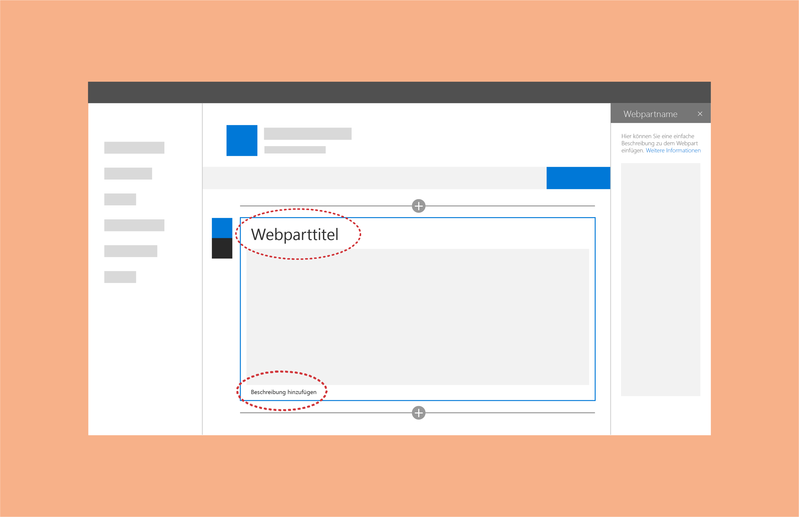
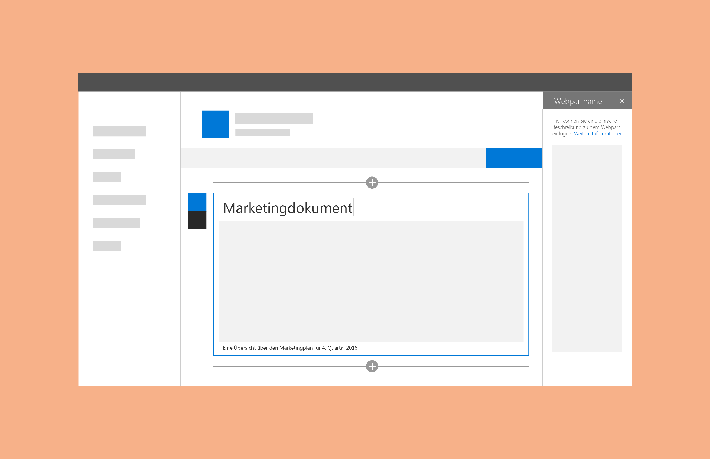

# Titel und Beschreibungen für SharePoint-Webparts

Sie können Webparts Titel und Beschreibungen hinzufügen, damit Benutzer besser verstehen, was die Webparts tun. Dies ist hilfreich, wenn eine Seite viele verschiedene Webparts enthält. Einige Webparts (wie beispielsweise Bildwebparts) benötigen möglicherweise keinen Titel, aber eventuell eine Beschreibung vor oder nach dem Inhaltsbereich. Gehen Sie nicht davon aus, dass Benutzer den Kontext des Webparts ohne einen Titel oder eine Beschreibung verstehen, und rechnen Sie nicht damit, dass Benutzer selbst Titel oder Beschreibungen einfügen. 
 
Eine Option besteht darin, den Titel und die Beschreibung mit den Konfigurationseigenschaften des Webparts zu verknüpfen. Hierdurch wird sichergestellt, dass Ihre Webparts bereits vorab mit Inhalten befüllt werden, die im Rahmen der jeweiligen Konfiguration am sinnvollsten sind. 
 
Haben Sie beispielsweise ein Webpart, das die zuletzt hinzugefügten Elemente aus einer Dokumentbibliothek abfragt, würde sich als Standardtitel „Neueste Dokumente“ empfehlen.

 

Der Autor einer Seite kann den Standardplatzhaltertext für den Titel und die Beschreibung überschreiben und durch individuellen Text ersetzen, der besser zu der Seite passt, die erstellt wird. 

## Siehe auch

- [Entwerfen von benutzerfreundlichen SharePoint-Umgebungen](design-guidance-overview.md)