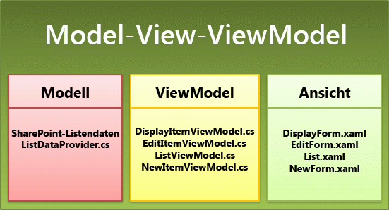
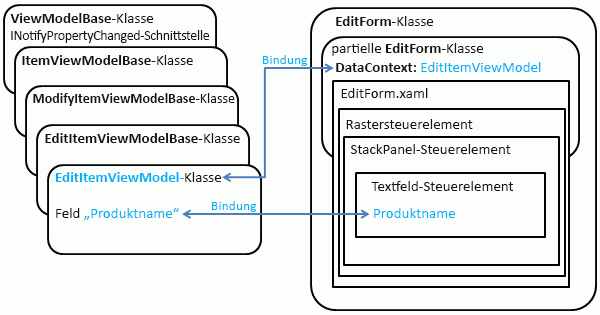

# Architektur der Windows Phone SharePoint-ListenanwendungsvorlageArchitecture of the Windows Phone SharePoint List Application template
Verstehen Sie das Entwurfsmuster von Projekten, die aus der Vorlage für Windows Phone SharePoint List Application erstellt. Die Windows Phone SharePoint List Application-Vorlage vom Windows Phone SharePoint Software Development Kit installiert wurde entwickelt, um Windows Phone-apps basierend auf einem Muster, die Teile des Projekts in verschiedenen Komponenten trennt generieren. Die Vorlage funktioniert über das Erstellen der Klassen und Dateien herstellen das Muster, da Entwickler zur Erweiterung konzentrieren generiert Projekten basierend auf ihren bestimmte Anforderungen, die Geschäftslogik und die Daten.Understand the design pattern of projects created from the Windows Phone SharePoint List Application template. The Windows Phone SharePoint List Application template installed by the Windows Phone SharePoint Software Development Kit has been designed to generate Windows Phone apps based on a pattern that separates parts of the project into different components. The template does the work of creating the classes and files to establish the pattern, allowing developers to focus on extending generated projects based on their particular requirements, business logic, and data.
  
    
    

## Die Vorlage Windows Phone SharePoint List Application und den Entwurf MVVM-MusterThe Windows Phone SharePoint List Application template and the MVVM design pattern

Die Vorlage Windows Phone SharePoint List Application generiert ein Visual Studio 2010-Projekt für eine Silverlight-basierte Windows Phone-app entwickelt wurden, nach einem Software Design Muster das Muster View-Modell-ViewModel (MVVM) genannt. Das MVVM-Muster ist eine Möglichkeit zum Organisieren und Code in einem Projekt in verwaltbare Ebenen, die unabhängig voneinander entwickelt, getestet und geändert werden können, unterteilen. Es ist ein Entwicklungsmuster besonders effizient für Windows Presentation Foundation (WPF) und Silverlight-Projekten, da ein Vorteil das Muster der Darstellungsschicht einer Anwendung auf die Struktur der zugrunde liegenden Daten, Freigeben von Entwicklern die Darstellungsschicht für die verschiedenen Kontexten (als, z. B. Web Browser, Mobilgerät Schnittstellen oder desktopanwendungen) angepasst werden kann, Bildschirmdarstellung dieselben zugrunde liegenden Datenstrukturen weniger strengen abhängig sind ermöglicht.The Windows Phone SharePoint List Application template generates a Visual Studio 2010 project for a Silverlight-based Windows Phone app developed according to a software design pattern known as the View-Model-ViewModel (MVVM) pattern. The MVVM pattern is a way of organizing and compartmentalizing code in a project into manageable layers, which can be independently developed, tested, and modified. It is a particularly effective development pattern for Windows Presentation Foundation (WPF) and Silverlight projects because, among other benefits, the pattern allows for the presentation layer of a given application to have a less rigid dependency on the structure of underlying data, freeing developers to adapt the presentation layer for different contexts (as, for instance, Web browsers, mobile device interfaces, or desktop applications) while retaining the same underlying data structures.
  
    
    
Im Gegensatz zu einer einfacheren Ansatz umfasst sagen, Schreiben aller Daten-Management-Code in der CodeBehind-Dateien mit bestimmten XAML-Dateien in einer Silverlight-Anwendung ein Projekt entsprechend der MVVM-Muster organisieren verknüpft ist eine zusätzliche anfängliche Investition von Aufwand zu planen und entwickeln die erforderlichen Klassen, die Vererbungsmodell und die Methoden der Kommunikation zwischen den Komponenten des Musters. Die Vorlage Windows Phone SharePoint List Application kümmert dieser anfänglichen Konfiguration und Entwicklung Aufgaben zum Einrichten von dem Muster für Sie, sodass Sie anpassen und Erweitern des Projekts, um eine funktionsfähige MVVM-Anwendung schnell zu entwickeln.As opposed to a simpler approach of, say, writing all of your data-management code in the code-behind files associated with particular XAML files in a Silverlight application, organizing a project according to the MVVM pattern involves an additional initial investment of effort to plan and develop the necessary classes, the inheritance model, and the methods of communication between the components of the pattern. The Windows Phone SharePoint List Application template takes care of this initial configuration and development work to set up the pattern for you, allowing you to customize and extend the project to develop a functional MVVM application quickly.
  
    
    
Die drei Hauptkomponenten oder Ebenen der MVVM-Muster werden die Ansicht, das Modell und das Ansichtsmodell. In Projekten basierend auf der Vorlage Windows Phone SharePoint List Application werden diese Komponenten von verschiedenen Project-Dateien implementiert, wie in Abbildung 1 dargestellt.The three main components or layers of the MVVM pattern are the View, the Model, and the ViewModel. In projects based on the Windows Phone SharePoint List Application template, these components are implemented by various project files, as shown in Figure 1.
  
    
    

**Abbildung 1. Windows Phone SharePoint List Application Dateien in das MVVM-Muster****Figure 1. Windows Phone SharePoint List Application files in the MVVM pattern**

  
    
    

  
    
    

  
    
    
Den folgenden Abschnitten werden einige der Details im Zusammenhang mit der Implementierung dieser Komponenten in die Vorlage Windows Phone SharePoint List Application.The following sections explain some of the details related to the implementation of these components in the Windows Phone SharePoint List Application template.
  
    
    

### Die Model-KomponenteThe Model component

Die Komponente Model in MVVM-Muster bezieht sich auf die Klassen und Strukturen verwendet, um die Daten für eine Anwendung darstellen. Für eine app basierend auf einer SharePoint-Liste zu der Liste und seine Elemente als die zugrunde liegenden Daten verarbeiten. In Windows Phone SharePoint List Application übernimmt die Klasse **ListDataProvider** SharePoint-Client-Objektmodell Standardfunktionen für die Verbindung mit einer SharePoint-Liste. beispielsweise erstellen eine Instanz der Klasse **ClientContext** und Festlegen seiner Eigenschaften. Die genaue Implementierungsdetails der **ListDataProvider** -Klasse in der Vorlage hängen die Optionen in den Schritten des Assistenten für SharePoint Phone-Anwendung angegeben wird, wenn Sie ein Projekt basierend auf der Vorlage erstellen.The Model component in the MVVM pattern refers to the classes and structures used to represent the data for an application. For an app based on a SharePoint list, the list and its items serve as the underlying data. In the Windows Phone SharePoint List Application, the **ListDataProvider** class handles the standard SharePoint client object model operations for connecting to a SharePoint list; for example, creating an instance of the **ClientContext** class and setting its properties. The exact implementation details of the **ListDataProvider** class in the template depend on the options specified in the steps of the SharePoint Phone Application Wizard when you create a project based on the template.
  
    
    
Die Basisklasse implementiert **ListDataProviderBase** (in Microsoft.SharePoint.Phone.Application.dll), von denen die **ListDataProvider** -Klasse abgeleitet ist einen Mechanismus für das Zwischenspeichern für SharePoint-Listendaten. Listenelemente aus dem Server abgerufen werden, werden sie von der **ListDataProvider** -Klasse in der lokalen Speichers zu Phone-app zwischengespeichert, und diese Elemente in der app benötigt, des Caches zum Einsparen von Ressourcen und Reduzierung von Reisen an den Server zuerst aktiviert wird.The base class, **ListDataProviderBase** (in the Microsoft.SharePoint.Phone.Application.dll), from which the **ListDataProvider** class is derived implements a caching mechanism for SharePoint list data. When list items are retrieved from the server, they are cached by the **ListDataProvider** class in the local memory allocated to the phone app and when those items are needed in the app, the cache is checked first in order to conserve resources and reduce trips to the server.
  
    
    
Wenn das Filtern der Daten von der SharePoint-Liste abgerufen, oder geben Sie genau welche Daten abgerufen werden soll, können Sie den Code in der **ListDataProvider** -Klasse (in der Datei ListDataProvider.cs) ändern. Die Teile der Datei, die Sie für diese Zwecke wahrscheinlich ändern würde werden die **LoadDataFromServer** -Methode und die Implementierung der statischen **CamlQueryBuilder** -Klasse. Sie können auch eine eigene Klasse von der Klasse **ListDataProviderBase** ableiten. Wenn Sie dies tun, müssen Sie unbedingt die abstrakten Methoden aus der Basisklasse, **LoadData** und **LoadItem**implementieren, und auch Implementieren des **Context** -Eigenschaft Mitglieds der Basisklasse, eine geeignete **get** Accessor-Methode bereitgestellt.If you want to filter the data retrieved from the SharePoint list or specify exactly what data to retrieve, you can modify the code in the **ListDataProvider** class (in the ListDataProvider.cs file). The parts of the file you would most likely modify for these purposes are the **LoadDataFromServer** method and the implementation of the static **CamlQueryBuilder** class. You can also derive your own class from the **ListDataProviderBase** class. If you do so, be sure to implement the abstract methods from the base class, **LoadData** and **LoadItem**, and also implement the **Context** property member of the base class, providing a suitable **get** accessor method.
  
    
    

### Die Komponente anzeigenThe View component

Die Ansichtskomponente in MVVM-Muster bezieht sich auf der Benutzeroberfläche (UI) einer app. In Silverlight-basierten Windows Phone-app wird die Ansichtskomponente darstellten von XAML-Dateien zum Deklarieren und Kennzeichnen von Benutzeroberflächenelementen und CodeBehind-Dateien, die die Verwendung von XAML-Dateien, die implementieren Ereignishandler und anderen Code zum Bestimmen der Interaktion zwischen Benutzern mit der UI-Elemente zugeordnet.The View component in the MVVM pattern refers to the user interface (UI) of an app. In Silverlight-based Windows Phone app, the View component is constituted by XAML files for declaring and qualifying UI elements and code-behind files associated with those XAML files that implement event handlers and other code to determine how users interact with the UI elements.
  
    
    
Es ist wichtig, zwischen zwei Sinne des Worts "anzeigen" im Zusammenhang mit der Entwicklung von apps für SharePoint-Liste für Windows Phone zu unterscheiden. Eine SharePoint-Liste ist eine oder mehrere Ansichten, wie beispielsweise, alle Elemente als Standardansicht für eine Liste oder eine Liste basierend auf der Listenvorlage Kalender in der Ansicht Aktuelle Ereignisse zugeordnet. Diese Ansichten stellen Möglichkeiten zum Organisieren und Anzeigen von Listenelementen in einer SharePoint-Liste dar. Je nach Art der SharePoint-Liste (und gibt an, ob benutzerdefinierte Ansichten der Liste hinzugefügt wurden) Ziel für Ihre app, die Ansichten der Liste aus, wie alle Aufgaben oder aktuelle Ereignisse zugeordnet werden zur Verfügung gestellt, die festlegen, dass Ihre app in den Assistenten für SharePoint Phone-Anwendung einschließen, wenn Sie ein Projekt aus der Vorlage erstellen. Wenn Sie eine bestimmte Ansicht einfügen, generiert die Vorlage ein **PivotItem** -Steuerelement (ein **Pivot** Steuerelement enthaltene) zum Rendern der Ansicht der Liste.It is important to distinguish between two senses of the word "view" in the context of developing SharePoint list apps for Windows Phone. A SharePoint list is associated with one or more views, as, for example, the default All Items view for a list, or the Current Events view for a list based on the Calendar list template. These views represent ways of organizing and displaying list items in a SharePoint list. Depending on the kind of SharePoint list (and on whether custom views have been added to the list) you target for your app, the views associated with the list, such as All Tasks or Current Events, are made available for you to choose to include in your app in the SharePoint Phone Application Wizard when you create a project from the template. If you include a given view, the template generates a **PivotItem** control (contained within a **Pivot** control) to render the view of the list.
  
    
    
In diesem Sinne "anzeigen" ist von im Sinne des Worts unterschieden werden, wie sie auf die Ansichten in der Vorlage angewendet wird. Finden Sie in einem Projekt basierend auf der Vorlage Windows Phone SharePoint List Application (implementierten als XAML-Dateien im Ordner "Ansichten" des Projekts) Konzept in der Ansicht-Komponente des MVVM-Muster. D. h., stellen die Ansichten im Projekt die Darstellungsschicht für die Daten (oder Modell) einer gegebenen Entität dar. In diesem Fall ist die Entität einer SharePoint-Liste oder eine SharePoint-Listenelement.This sense of the word "view" is to be distinguished from the sense of the word as it applies to the Views in the template. In a project based on the Windows Phone SharePoint List Application template, the Views (implemented as XAML files in the Views folder of the project) refer conceptually to the View component of the MVVM pattern. That is, the Views in the project represent the presentation layer for the data (or, Model) of a given entity. In this case, the entity is either a SharePoint list or a SharePoint list item.
  
    
    
Obwohl das Listenformular (List.xaml) im Projekt bezeichnet werden kann, um die Standardansicht einer SharePoint-Liste, die konzeptionelle Unterschied zwischen Standardansicht des einer SharePoint-Liste und der Ansicht durch die Liste dargestellt, das Formular weiterhin beibehalten werden soll, zugeordnet, da das Listenformular im Projekt unbedingt die Standardansicht der Liste auf dem Server zugeordnet ist, entspricht. Wenn Sie beispielsweise ändern Sie die standardmäßige Listenansicht auf dem Server (durch, beispielsweise eine bestimmte Sortierreihenfolge angeben oder Anzeigen bestimmter Felder und andere nicht), die Änderungen werden nicht in der XAML-Code, der das Listenformular im Projekt, bildet dargestellt werden. Legen Sie die Reihenfolge der Elemente, wie sie in der Liste angezeigt werden, Formular in Ihrer app basierend auf Ihrer Auswahl im Application-Assistent für SharePoint-Telefon (oder basierend auf der nachfolgenden Anpassungen des Listenformulars), unabhängig von der Reihenfolge für die Standardansicht zugeordneten SharePoint-Liste auf dem Server konfiguriert sind.Although the List form (List.xaml) in the project can be said to correspond to the default view associated with a SharePoint list, the conceptual distinction between the default view of a SharePoint list and the View as represented by the List form should still be maintained, because the List form in the project doesn't necessarily map to the default view of the list on the server. If, for example, you modify the default list view on the server (by, say, specifying a given sort order or displaying certain fields and not others), the modifications will not be represented in the XAML that constitutes the List form in the project. You set the order of the items as they are shown in the List form in your app based on your choices in the SharePoint Phone Application Wizard (or based on your subsequent customizations of the List form), regardless of the order configured for the default view associated with the SharePoint list on the server.
  
    
    
Das Listenformular stellt die Ansicht (oder der Darstellungsschicht) für die SharePoint-Liste. Die drei Ansichtsdateien beziehen sich auf einzelne Listenelemente, und sie gilt der verfügbaren Formulare (Allgemein) entsprechen der Liste Element im Menü für ein Listenelement in SharePoint.The List form represents the View (or presentation layer) for the SharePoint list. The other three View files pertain to individual list items, and they can be said to correspond to the forms available (generally) from the list item menu for a list item in SharePoint.
  
    
    

- Das Formular anzeigen (DisplayForm.xaml) entspricht dem Element anzeigen-Formular (DispForm.aspx) für eine SharePoint-Liste. Dieses Formular stellt eine Ansicht für ein einzelnes Element in einer SharePoint-Liste.The Display form (DisplayForm.xaml) corresponds to the View Item form (DispForm.aspx) for a SharePoint list. This form presents a View for an individual item in a SharePoint list.
    
  
- Mit dem Bearbeitungsformular (EditForm.xaml) entspricht dem Eintrag bearbeiten-Formular (EditForm.aspx) für eine SharePoint-Liste. Dieses Formular stellt eine Ansicht für ein bestimmtes Element zur Bearbeitung verfügbar gemacht wird.The Edit form (EditForm.xaml) corresponds to the Edit Item form (EditForm.aspx) for a SharePoint list. This form presents a View for a given item as it is exposed for editing.
    
  
- Die neue Formulardatei (NewForm.xaml) entspricht dem Formular neues Element (NewForm.aspx), für eine SharePoint-Liste. Dieses Formular stellt eine Ansicht für ein bestimmtes Element, das erstellt und der Liste hinzugefügt werden soll.The New form (NewForm.xaml) file corresponds to the New Item form (NewForm.aspx) for a SharePoint list. This form presents a View for a given item that is to be created and added to the list.
    
  
Das Listenformular ist immer in einem Projekt auf Grundlage der Vorlage Windows Phone SharePoint List Application standardmäßig enthalten. Die XAML-Dateien für die anderen Formulare im Ordner "Ansichten" des Projekts werden generiert basierend auf der List-Vorgängen (New, anzeigen oder bearbeiten) in den Assistenten für SharePoint Phone-Anwendung aktiviert.The List form is always included by default in a project based on the Windows Phone SharePoint List Application template. The XAML files for the other forms in the Views folder of the project are generated based on the list operations (New, Display, or Edit) selected in the SharePoint Phone Application Wizard.
  
    
    

### Der ViewModel-KomponenteThe ViewModel component

Die ViewModel-Komponente in MVVM-Muster soll dienen als eine Art Broker vereinfachen die Interaktionen zwischen der Ansichtskomponente und das Modell-Komponente, während die Ansichtskomponente aus der Komponente Modell entkoppeln, daher es einfacher ist, eine oder anderen ändern, wirkt sich negativ auf die andere. Genau genommen konnte die ViewModel-Komponente Teil der Darstellungsschicht angesehen werden, da sie häufig Logik für die zugrunde liegenden Daten für die Präsentation in der Ansichtskomponente "Gestaltung" enthält. In Projekten basierend auf der Vorlage Windows Phone SharePoint List Application, implementieren Sie die ViewModels den Code für das Binden von SharePoint-Listendaten aus der Objektmodell-Komponente abgerufen (d. h., ein Objekt von der Klasse **ListDataProvider** ) zu UI-Steuerelementen in einem Teil der Ansicht-Komponente (beispielsweise dem Formular bearbeiten). Abhängig von der Art des Steuerelements zum Anzeigen der Daten aus der Liste und den Typ der Daten (d. h., ob der Feldtyp für das Listenelement Text oder numerische Daten oder etwa ein Auswahlfeld mit SharePoint ist), das Ansichtsmodell zuerst verarbeitet oder konvertiert die Daten, sodass es für ein bestimmtes UI-Steuerelement gebunden werden kann.The ViewModel component in the MVVM pattern is intended to serve as a kind of broker to facilitate the interactions between the View component and the Model component, while decoupling the View component from the Model component so it is easier to change one or the other without adversely affecting the other. Strictly speaking, the ViewModel component could be considered part of the presentation layer, because it often includes logic for "shaping" underlying data for presentation in the View component. In projects based on the Windows Phone SharePoint List Application template, the ViewModels implement the code for binding SharePoint list data retrieved from the Model component (that is, from an object of the **ListDataProvider** class) to UI controls in a part of the View component (for example, the Edit form). Depending on the kind of control used to display the data from the list and the type of data (that is, whether the field type for the list item is text or numerical data or something like a SharePoint Choice field), the ViewModel first processes or converts the data such that it can be bound to a given UI control.
  
    
    
Insbesondere das Ansichtsmodell Steuerelementklassen im Projekt (wie, beispielsweise die **EditItemViewModel** -Klasse) eine Basisklasse **ViewModelBase** (in Microsoft.SharePoint.Phone.Application.dll), die die **INotifyPropertyChanged** -Schnittstelle implementiert, damit die Silverlight-Steuerelemente die Benutzeroberfläche der app bildet aktualisiert werden können, wenn Werte in der zugrunde liegenden Daten geändert werden (und sollte in der anderen Richtung) Ändern der Werte in der UI-Steuerelemente gespeichert (wenn bidirektionale auf die zugrunde liegenden Daten angewendet werden abgeleitet sind oder "bidirektionale" Bindung für ein Steuerelement konfiguriert).In particular, the ViewModel classes in the project (as, for example, the **EditItemViewModel** class) are derived from a base class, **ViewModelBase** (in the Microsoft.SharePoint.Phone.Application.dll), which implements the **INotifyPropertyChanged** interface so that the Silverlight controls constituting the user interface of the app can be updated when values in the underlying data change, and (going in the other direction) changes to the values stored in UI controls can be applied to the underlying data (if bi-directional, or "two-way", binding is configured for a control).
  
    
    
Abbildung 2 zeigt eine vereinfachte Darstellung der Klassenvererbungshierarchie für die **EditItemViewModel** -Klasse und die Bindung für ein angegebenes UI-Steuerelement in dem Formular bearbeiten, mit das entsprechende Feld in der ViewModel.Figure 2 shows a simplified representation of the class inheritance hierarchy for the **EditItemViewModel** class and the binding for a given UI control in the Edit form with the corresponding field in the ViewModel.
  
    
    

**Abbildung 2. Die Klassen EditItemViewModel und EditForm****Figure 2. The EditItemViewModel and EditForm classes**

  
    
    

  
    
    

  
    
    
Die **EditForm** -Klasse (die die Ansicht-Komponente aus dem MVVM-Muster darstellt) ist definiert und von zwei Dateien, die EditForm.xaml und die zugeordneten Code-Behind-Datei EditForm.xaml.cs implementiert. In der Datei EditForm.xaml.cs ist die **EditItemViewModel** -Klasse (für die ViewModel-Komponente von MVVM-Muster) auf die Ansicht in der Datei EditForm.xaml.cs durch Festlegen der **DataContext** -Eigenschaft der **EditForm** -Klasse auf ein Objekt der Klasse **EditItemViewModel** gebunden.The **EditForm** class (which represents the View component from the MVVM pattern) is defined and implemented by two files, the EditForm.xaml file and its associated code-behind file, EditForm.xaml.cs. In the EditForm.xaml.cs file, the **EditItemViewModel** class (representing the ViewModel component of the MVVM pattern) is bound to the View in the EditForm.xaml.cs file by setting the **DataContext** property of the **EditForm** class to an object of the **EditItemViewModel** class.
  
    
    
Auf MVVM-Mustern basierende Software-Designs beschränken häufig die Geschäftslogik und Überprüfungsroutinen für die Modellkomponente des Musters.Software designs based on the MVVM pattern often confine business logic and validation routines to the Model component of the pattern. In Projekten auf Grundlage der Listenanwendungsvorlage für Windows Phone SharePoint wurden einige Vorgänge, die in der Regel als Teil der Modellkomponente angesehen werden, in die ViewModel-Komponente implementiert, damit Entwickler die Projekte bequemer erweitern können, wodurch allerdings der konzeptionelle Unterschied zwischen der Datenschicht (Model) und der Darstellungsschicht (ViewModel) leicht verschwimmt.Software designs based on the MVVM pattern often confine business logic and validation routines to the Model component of the pattern. In projects based on the Windows Phone SharePoint List Application template, however, some operations that are typically considered part of the Model component have been implemented in the ViewModel component to make it more convenient for developers to extend the projects, at the cost of slightly blurring the conceptual distinction between the data layer (Model) and the presentation layer (ViewModel). For example, the ViewModel classes for editing and creating list items (that is, the EditItemViewModel and NewItemViewModel classes) expose a Validate method that developers can override to implement validation of data entered by users. (For information on implementing data validation with these ViewModels, see How to: Implement business logic and data validation in a Windows Phone app for SharePoint.) Zum Beispiel machen die ViewModel-Klassen für das Bearbeiten und Erstellen von Listenelementen (d.h. **EditItemViewModel**- und **NewItemViewModel**-Klassen) eine **Überprüfungsmethode** verfügbar, die Entwickler überschreiben können, um eine Überprüfung der von Benutzern eingegebenen Daten implementieren zu können.For example, the ViewModel classes for editing and creating list items (that is, the **EditItemViewModel** and **NewItemViewModel** classes) expose a **Validate** method that developers can override to implement validation of data entered by users. (Informationen zur Implementierung der Datenüberprüfung mit den ViewModels finden Sie unter [Vorgehensweise: Geschäftslogik und Datenüberprüfung in eine Windows Phone-App für SharePoint implementieren](how-to-implement-business-logic-and-data-validation-in-a-windows-phone-app-for-s.md))(For information on implementing data validation with these ViewModels, see [How to: Implement business logic and data validation in a Windows Phone app for SharePoint](how-to-implement-business-logic-and-data-validation-in-a-windows-phone-app-for-s.md)..md)
  
    
    

    
> **Hinweis:** Das **ListDataProvider**-Objekt lädt die Daten nur vom Server.**Note:** The **ListDataProvider** object only loads the data from server. Andere Vorgänge, wie z. B. **Hinzufügen**, **Aktualisieren** und **Löschen**, werden im ViewModel selbst durchgeführt. Anschließend erfolgt ein Aktualisierungsaufruf, um die ViewModel-Daten vom Server zu aktualisieren.Note The ListDataProvider object only loads the data from server. Other operations, such as **Add**, **Update**, and **Delete**, are performed in the ViewModel itself, followed by a refresh call to update the ViewModel data from the server. This design reduces cluttering of the code. Dieses Design reduziert die Überladung des Codes.This design reduces cluttering of the code. 
  
    
    

## Die Datei App.xaml und das Silverlight-AnwendungsmodellThe App.xaml file and the Silverlight application model

Objektebene und seine zugeordneten Code-Behind-Datei App.xaml.cs, sind Standardkomponenten einer verwalteten Silverlight-Anwendung. Anwendungen, mit denen die verwaltete API für Silverlight müssen eine Klasse, die von der Silverlight-  [Anwendung](http://msdn.microsoft.com/en-us/library/system.windows.application%28VS.95%29.aspx) -Klasse abgeleitet sind, um das Silverlight-Anwendungsmodell implementieren enthalten. Die **Application** -Klasse unterstützt Anwendung Lebenszyklusereignisse und Funktionen für die Verwaltung von Ressourcen wie Bilder, Zeichenfolgen und XAML-Vorlagen.The App.xaml file and its associated code-behind file, App.xaml.cs, are standard components of a managed Silverlight application. Applications that use the managed API for Silverlight must include a class derived from the Silverlight  [Application](http://msdn.microsoft.com/en-us/library/system.windows.application%28VS.95%29.aspx) class, in order to implement the Silverlight application model. The **Application** class supports application life-cycle events and facilities for managing resources like images, strings, and XAML templates.
  
    
    
Informationen dazu, welche Arten von Änderungen, die Sie an der Datei App.xaml.cs in Projekten möglicherweise, finden Sie unter  [Vorgehensweise: anmelden und Fortsetzen von Anrufen SharePoint Listenelementen auf einem Telefon mit Windows](how-to-store-and-retrieve-sharepoint-list-items-on-a-windows-phone.md) zum Implementieren der Ereignishandler in der Datei App.xaml.cs Anwendung Zustandsinformationen und [Vorgehensweise: Verwenden mehrerer 2013 für SharePoint-in ein Windows Phone-app Listen](how-to-use-multiple-sharepoint-lists-in-a-windows-phone-app.md) für das Instanziieren und Konfigurieren von zusätzlichen **ListDataProvider** -Objekten in App.xaml.cs beibehalten.For information about the kinds of modifications you might make to the App.xaml.cs file in your projects, see  [How to: Store and retrieve SharePoint list items on a Windows Phone](how-to-store-and-retrieve-sharepoint-list-items-on-a-windows-phone.md) on implementing event handlers in the App.xaml.cs file to preserve application state information, and [How to: Use multiple SharePoint lists in a Windows Phone app](how-to-use-multiple-sharepoint-lists-in-a-windows-phone-app.md) on instantiating and configuring additional **ListDataProvider** objects in App.xaml.cs.
  
    
    

## Zusätzliche RessourcenAdditional resources

-  
  [Unter Verwendung des Model-View-ViewModel-Musters](http://msdn.microsoft.com/en-us/library/hh821028.aspx)[Using the Model-View-ViewModel Pattern](http://msdn.microsoft.com/en-us/library/hh821028.aspx)
    
  
-  
  [Architektur des Pivot-Steuerelements für Windows Phone](http://msdn.microsoft.com/en-us/library/ff941097%28VS.92%29.aspx)[Pivot Control Architecture for Windows Phone](http://msdn.microsoft.com/en-us/library/ff941097%28VS.92%29.aspx)
    
  
-  
  [Silverlight-Anwendungsmodell](http://msdn.microsoft.com/en-us/library/cc872869%28VS.95%29.aspx)[Silverlight Application Model](http://msdn.microsoft.com/en-us/library/cc872869%28VS.95%29.aspx)
    
  
-  
  [Entwickeln einer Windows Phone-Anwendung mit dem MVVM-Muster](http://msdn.microsoft.com/en-us/library/hh848247.aspx)[Developing a Windows Phone Application using the MVVM Pattern](http://msdn.microsoft.com/en-us/library/hh848247.aspx)
    
  
-  [Die Model-View-ViewModel Entwurfsmuster WPF-AppsWPF Apps With The Model-View-ViewModel Design Pattern](http://msdn.microsoft.com/en-us/magazine/dd419663.aspx)
    
  
-  [Windows Phone SDK 8.0Windows Phone SDK 8.0](http://www.microsoft.com/en-us/download/details.aspx?id=35471)
    
  
-  [Microsoft SharePoint SDK für Windows Phone 8Microsoft SharePoint SDK for Windows Phone 8](http://www.microsoft.com/en-us/download/details.aspx?id=36818)
    
  
-  [Microsoft SharePoint SDK for Windows Phone 7.1Microsoft SharePoint SDK for Windows Phone 7.1](http://www.microsoft.com/en-us/download/details.aspx?id=30476)
    
  

