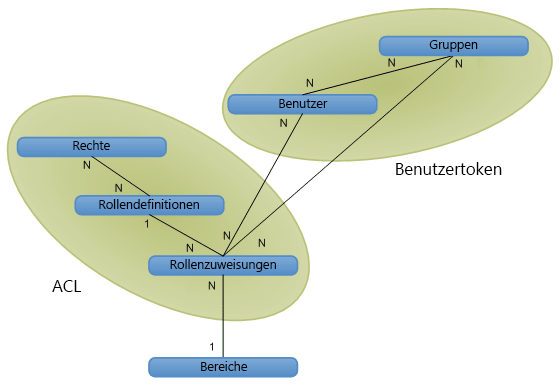

# Autorisierung, Benutzer, Gruppen und das Objektmodell in SharePointAuthorization, users, groups, and the object model in SharePoint

In SharePoint wird der Zugriff auf Websites, Listen, Ordner und Listenelemente über ein rollenbasiertes Mitgliedschaftssystem geregelt, das Benutzern Rollen zuweist und sie zum Zugriff auf SharePoint-Objekte autorisiert.In SharePoint, access to websites, lists, folders, and list items is controlled through a role-based membership system by which users are assigned to roles that authorize their access to SharePoint objects.
  
    
    

Wenn Sie einem Benutzer Zugriff auf ein Objekt erteilen möchten, fügen Sie den Benutzer zu einer Gruppe hinzu, die bereits Berechtigungen für das Objekt besitzt. Oder Sie können ein Rollenzuweisungsobjekt erstellen, den Benutzer für die Rollenzuweisung festlegen, die Rollenzuweisung optional an eine entsprechende Rollendefinition mit Basisberechtigungen binden und dann die Zuweisung der Auflistung der Rollenzuweisungen für das Listenelement, die Liste oder die Website hinzufügen. Wenn Sie während der Benutzerzuweisung die Rollenzuweisung nicht an eine Rollendefinition binden, erhält der Benutzer keine Berechtigungen. Es folgt eine Beschreibung der Verfahren, die SharePoint zur Steuerung des Zugriffs auf Objekte bereitstellt:To give a user access to an object, you can add the user to a group that already has permissions to the object, or you can create a role assignment object, set the user for the role assignment, optionally bind the role assignment to the appropriate role definition with base permissions, and then add the assignment to the collection of role assignments for the list item, folder, list, or website. If you do not bind the role assignment to a role definition when assigning a user to a role, the user has no permission. Following are ways that SharePoint provides to control access to its objects:
  
    
    

- Objekte können dieselben Berechtigungen wie die übergeordnete Website, Liste oder der übergeordnete Ordner haben (wobei sie die Rollen und Benutzer des übergeordneten Objekts erben), oder sie können einzigartige Berechtigungen haben.Objects can use the same permissions as the parent website, list, or folder (inheriting both the roles and users available on the parent object), or they can use unique permissions. 
    
  
- Websites, Listen, Ordner und Elemente stellen jeweils eigene Sammlungen mit Rollenzuweisungen bereit, sodass eine präzise Verwaltung des Benutzerzugriffs auf Objekte ermöglicht wird.Sites, lists, folders, and items each provide role assignment collections, enabling fine management of user access to objects.
    
  
- Gruppen bestehen aus Benutzern und können ggf. zu Rollen zugewiesen sein. SharePoint enthält standardmäßig drei Gruppen:Groups consist of users and may or may not be assigned to roles. SharePoint includes the following three groups by default:
    
  - **owners** (Administrator)**owners** (administrator)
    
  
  - **members** (Mitwirkender)**members** (contributor)
    
  
  - **visitors** (Leser)**visitors** (reader)
    
  

    Wenn Sie eine Website mit eindeutigen Berechtigungen über die Benutzeroberfläche erstellen, werden Sie zu einer Seite geleitet, auf der Sie als Teil der Websitebereitung Benutzer zu diesen Gruppen zuweisen können.When you create a website with unique permissions through the user interface, you are directed to a page where you can assign users to these groups as part of provisioning the site.
    
  
- Per anonymen Zugriff können Benutzer anonym Beiträge in Listen schreiben, an Umfragen teilnehmen oder Seiten anzeigen. Sie können auch „allen authentifizierten Benutzern" Zugriff erteilen, damit alle Mitglieder Ihrer Domäne eine Website öffnen können, ohne den anonymen Zugriff aktivieren zu müssen.Anonymous access allows users to contribute anonymously to lists and surveys, or to view pages anonymously. You can also grant access to "all authenticated users" to allow all members of your domain to access a website without having to enable anonymous access. 
    
  
- Berechtigungen zum Erstellen einer Website ( **CreateSSCSite** und **ManageSubwebs**) steuern, welche Benutzer Websites oberster Ebene, Unterwebsite oder Arbeitsbereiche erstellen dürfen.Site creation rights ( **CreateSSCSite** and **ManageSubwebs**) control whether users can create top-level websites, subsites, or workspaces.
    
  
Benutzer werden Mitglieder eines SharePoint-Objekts, und zwar entweder indirekt über eine Gruppe, die über eine Rollenzuweisung verfügt, oder direkt über eine Rollenzuweisung. Benutzer können auch Mitglieder einer Microsoft Windows NT-Domänengruppe sein, die einer Gruppe oder Rolle hinzugefügt wird. Durch eine Rollendefinition wird ein Benutzer oder eine Gruppe mit einem einzelnen Recht oder einem Satz von Rechten verknüpft, die den Werten der  [Microsoft.SharePoint.SPBasePermissions](https://msdn.microsoft.com/library/Microsoft.SharePoint.SPBasePermissions.aspx) -Enumeration entsprechen. Jeder Benutzer bzw. jede Gruppe verfügt über eine eindeutige Mitglieds- [ID](https://msdn.microsoft.com/library/Microsoft.SharePoint.SPMember.ID.aspx) .Mit dem Objektmodell können Sie Rollenzuweisungen und -definitionen auf andere Weise erstellen oder ändern als mit der Funktionalität der Dateien „addrole.aspx" und „editrole.aspx". Das Objektmodell setzt, anders als diese Seiten, die auf der Benutzeroberfläche verfügbar sind, keine Rechteabhängigkeit durch. Sie können also eine Rollendefinition mit einer beliebigen Rechtekombination erstellen. Sie sollten aber bei Verwendung des Objektmodells zur Anpassung von Rollendefinitionen und Berechtigungen sorgfältig planen, da eine schlecht geplante Rollendefinition und falsch zugewiesene Rechte zu weniger Benutzerfreundlichkeit führen können.Weitere Informationen zu SharePoint Rechten finden Sie unter  [SPBasePermissions](https://msdn.microsoft.com/library/Microsoft.SharePoint.SPBasePermissions.aspx) .Users become members of a SharePoint object indirectly through a group that has a role assignment, or directly through a role assignment. Users also can be members of a Microsoft Windows NT Domain Group that is added to a group or to a role. A role definition associates a user or group with a single right or set of rights corresponding to values of the  [Microsoft.SharePoint.SPBasePermissions](https://msdn.microsoft.com/library/Microsoft.SharePoint.SPBasePermissions.aspx) enumeration. Each user or group has a unique member [ID](https://msdn.microsoft.com/library/Microsoft.SharePoint.SPMember.ID.aspx) .You can use the object model to create or modify role assignments and definitions differently than the way you can through the functionality of the addrole.aspx file and the editrole.aspx file. Unlike these pages, which are presented in the user interface, the object model does not enforce rights dependency, so you can create a role definition with an arbitrary combination of rights. But, plan carefully when using the object model to customize role definitions and permissions, because a poorly planned role definition and inappropriately assigned rights can lead to a bad user experience.For more information about SharePoint rights, see  [SPBasePermissions](https://msdn.microsoft.com/library/Microsoft.SharePoint.SPBasePermissions.aspx) .
## SicherheitsrichtlinieSecurity policy

Anhand einer Sicherheitsrichtlinie kann einheitliche Sicherheit in allen Websitesammlungen innerhalb einer Webanwendung (virtueller Server) durchgesetzt werden. Mit der Richtlinie können Sie einzelnen SharePoint-Benutzern eine Rolle oder eine Sammlung von Rechten zuweisen sowie auch Domänengruppen, die Windows-Authentifizierung oder austauschbare Authentifizierungssysteme verwenden. Dies gilt aber nicht für SharePoint-Gruppen. Jeder Sicherheitseintrag gibt Rechte für einen Benutzer oder eine Gruppe in der Webanwendung an.A security policy provides a way to enforce uniform security throughout all site collections within a web application (virtual server). Through policy, you can assign a role, or collection of rights, to individual SharePoint users, and to domain groups using Windows authentication or pluggable authentication systems, but not to SharePoint groups. Each policy entry specifies rights for a user or group in the web application.
  
    
    
Die Richtlinie wird auf der logischen Webanwendungsebene oder auf der Zonenebene festgelegt. Ein Benutzer kann beispielsweise unterschiedliche Richtlinien für  `http://Server` und `http://Server.extranet.microsoft.com` haben, selbst wenn die beiden Webanwendungen gleiche Inhalte haben.Policy is set at the logical web application level or at the zone level. A user can have, for example, different policies on  `http://Server` and `http://Server.extranet.microsoft.com`, even if the two web applications have the same content.
  
    
    
Über Richtlinien können Rechte erteilt oder entzogen werden. Die Erteilung eines Rechts gibt dem Benutzer oder der Gruppe Zugriffsrechte auf alle geschützten Objekte in der Webanwendung, unabhängig von der lokalen Berechtigung für das Objekt. Der Entzug eines Rechts hat höhere Priorität als die Erteilung eines Rechts und sperrt aktiv das Recht des Benutzers oder der Gruppe auf Zugriff auf geschützte Objekte innerhalb der Webanwendung. Die Entziehung aller Rechte eines Benutzers hindert den Benutzer am Zugriff auf beliebige Inhalte, selbst wenn der Benutzer explizite Berechtigungen für bestimmte Inhalte hat. Die Richtlinie setzt Berechtigungen auf Websiteebene außer Kraft.Rights can be granted or denied through policy. Granting a right gives that right to the user or group on all secured objects within the web application, regardless of local permissions on the object. Denying a right is given a higher priority than granting the right, actively blocking that right for the user or group on all secured objects within the web application. Denying all for a user prevents that user from accessing any content, even if the user has explicit permissions on specific content: policy overrides site-level permissions.
  
    
    
In Richtlinienrollen werden Benutzer und Gruppen sowohl durch ihre Sicherheits-ID (SID) als auch durch ihren Anmelde- oder Benutzernamen. Die Zuweisung einer Richtlinienrolle ist ähnlich wie die Berechtigungsverwaltung für eine Website, eine Liste, einen Ordner oder ein Dokument. Sie fügen Benutzer oder Gruppen hinzu und weisen ihnen eine oder mehrere Rollendefinitionen zu. Jede Webanwendung hat eigene Richtlinienrollen. Ein weiterer Unterschied zwischen Richtlinienrollen und Berechtigungsverwaltung besteht darin, dass Zentraladministratoren Rechte eines Benutzers für die komplette Webanwendung entziehen können.In policy roles, the users and groups are identified by both their security identifier (SID) and their login or user name. Applying a policy role is similar to managing permissions for a website, list, folder, or document: You add users or groups and assign them to one or more role definitions. Each web application has its own policy roles. Another difference between policy roles and managing permissions is that central administrators can deny a right to a user throughout a web application.
  
    
    

> **Hinweis:** Richtlinienrollen in der Zentraladministration unterscheiden sich von den Rollendefinitionen für eine Websitesammlung.**Note** Central administration policy roles differ from the role definitions for a site collection. 
  
    
    

## Benutzer, Gruppen und PrinzipaleUsers, groups, and principals

Ein einzelner Benutzer ( [SPUser](https://msdn.microsoft.com/library/Microsoft.SharePoint.SPUser.aspx) ) hat Zugriff auf SharePoint-Objekte direkt über eine individuelle Rollenzuweisung oder indirekt über die Mitgliedschaft in einer Domänengruppen oder einer SharePoint-Gruppe ( [SPGroup](https://msdn.microsoft.com/library/Microsoft.SharePoint.SPGroup.aspx) ) mit Rollenzuweisung. Bei einer direkten Rollenzuweisung ist der Benutzer der Prinzipal ( [SPPrincipal](https://msdn.microsoft.com/library/Microsoft.SharePoint.SPPrincipal.aspx) ). In einer Domänengruppen- oder SharePoint-Gruppen-Rollenzuweisung ist die Domänengruppe oder die SharePoint-Gruppe der Prinzipal.An individual user ( [SPUser](https://msdn.microsoft.com/library/Microsoft.SharePoint.SPUser.aspx) ) gains access to a SharePoint object directly through an individual role assignment, or indirectly through membership in either a domain group or a SharePoint group ( [SPGroup](https://msdn.microsoft.com/library/Microsoft.SharePoint.SPGroup.aspx) ) that has a role assignment. In a direct role assignment, the user is the principal ( [SPPrincipal](https://msdn.microsoft.com/library/Microsoft.SharePoint.SPPrincipal.aspx) ). In a domain group or SharePoint group role assignment, the domain group or SharePoint group is the principal.
  
    
    
SharePoint Server unterstützt Windows-Benutzer (zum Beispiel  _DOMAIN_\\ _User_Alias_) und externe Benutzer (über austauschbare Authentifizierung). Die Benutzeridentität wird vom Identitätsverwaltungssystem gepflegt (wie den Active Directory-Verzeichnisdienst). Das Benutzerprofil (das den Anzeigenamen des Benutzers, seine E-Mail-Adresse und weitere Informationen enthält) ist auf den Ebenenbereich der Websitesammlung bezogen. Wird eine Anzeigename geändert, betrifft dies die gesamte Websitesammlung.SharePoint Server supports Windows users (for example,  _DOMAIN_\\ _User_Alias_) and external users (through pluggable authentication). The user identity is maintained by the identity management system (for example, the Active Directory directory service). The user profile (which includes the user's display name, email address, and other information) is scoped to the site-collection level. Changing a display name affects the entire site collection.
  
    
    
Eine Gruppe ist eine Sammlung von Benutzern, über die SharePoint Server die Sicherheit verwaltet. Eine benutzerbasierte Verwaltung ist problemlos bei einfachen Websites, wird aber kompliziert, sobald die Anzahl der eindeutig gesicherten Ressourcen anwächst. Beispiel: Ein Benutzer hat die **Contribute**-Rolle für Liste 1, die **Read**-Rolle für Liste 2 und die **Design**-Rolle für Liste 3. Dieses Modell nimmt keine Skalierung vor, wenn es beispielsweise 50.000 Benutzer gibt. Dieses Vorgehen würde zu Zugriffssteuerungslisten (Access Control Lists, ACLs) mit 50.000 Zugriffssteuerungseinträgen (Access Control Entries, ACEs) für jedes eindeutig gesicherte Objekt führen.A group is a collection of users through which SharePoint Server manages security. User-based management is straightforward for simple sites, but becomes more complex as the number of uniquely secured resources grows. For example, a user may have the **Contribute** role for list 1, the **Read** role for list 2, and the **Design** role for list 3. This model does not scale well if there are, for example, 50,000 users—which would result in access control lists (ACLs) being 50,000 access control entries (ACEs) long on every uniquely secured object.
  
    
    
Gruppen sind die Antwort auf Probleme bei Verwaltbarkeit und Skalierung einer benutzerbasierter Rechteverwaltung. Das Konzept einer gruppenbasierten Verwaltung mag abstrakter oder komplizierter klingen, aber es sorgt für eine einfachere Verwaltung komplexer Websites mit vielen eindeutig gesicherten Objekten. Beispiel: Der Fall, in dem Sie einen Benutzer zu einer Gruppe hinzufügen, der bereits die entsprechende Rolle für verschiedene Objekte im System zugewiesen wurde. Die Überprüfung von Gruppenberechtigungen lässt sich besser skalieren, da weniger Gruppen-ACEs gespeichert werden müssen.Groups provide an answer to the manageability and scale problems of user-based permissions management. Group-based management may be more abstract or more difficult to conceptualize, but it enables easier management of complex sites with many uniquely secured objects. For example, when adding a user to a group that has already been granted the appropriate role on various objects in the system. The permissions checking for groups scales better because far fewer group ACEs need to be stored.
  
    
    
SharePoint Server unterstützt zwei Gruppentypen: Domänengruppen und SharePoint-Gruppen. Domänengruppen liegen außerhalb der Kontrolle durch SharePoint Server; Benutzer können SharePoint Server nicht dazu verwenden, Domänengruppenmitgliedschaften zu definieren, zu durchsuchen oder zu ändern. SharePoint-Gruppen sind auf den Bereich der Websitesammlungsebene bezogen und können nur innerhalb der Websitesammlung verwendet werden. Domänengruppen können überall im Bereich des Active Directory-Verzeichnisdiensts verwendet werden.SharePoint Server supports two kinds of groups: domain groups and SharePoint groups. Domain groups remain outside SharePoint Server control; users cannot use SharePoint Server to define, browse, or modify domain group membership. SharePoint groups are scoped to the site-collection level, and they can be used only within the site collection. Domain groups can be used anywhere within the scope of the Active Directory directory service.
  
    
    
Ein Prinzipal ist ein Benutzer oder eine Gruppe, der bzw. die für die Verwaltung der Sicherheit verwendet wird. Wenn Sie einen Benutzer zu einer Website hinzufügen, ist der Benutzer der Prinzipal, wenn Sie aber der Website eine Gruppe hinzufügen, ist die Gruppe der Prinzipal. Der Schlüssel für eine Skalierung der Sicherheit in SharePoint Server ist, die Anzahl der Prinzipale pro Bereich möglichst gering zu halten. Mithilfe von Gruppen gibt es eine geringe Anzahl an Prinzipalen, die einer größeren Anzahl Benutzer Zugriff erteilen.A principal is a user or group that is used to control security. If you add a user to a site, the user is the principal, but if you add a group to the site, the group is the principal. The key to scaling security in SharePoint Server is to keep the number of principals per scope reasonable. By using groups, a smaller number of principals can be used to grant access to a much larger number of users.
  
    
    

## Ansicht der Objektbeziehungen - Bereiche, Benutzer, Gruppen und RollenHigh-level view of object relations—scopes, users, groups, and roles

Abbildung 1 zeigt einen Überblick des SharePoint Server-Sicherheitsverwaltungssystems in einem logischen Datenbankdiagramm. jedes Feld steht für ein Sicherheitsobjekt im System. Die Linien symbolisieren die Beziehungen zwischen den Objekten. Die Notationen **1** und **N** stehen für den Beziehungstyp. Die Abbildung zeigt, wie Berechtigungsdaten in einem Benutzertoken und in einer ACL strukturiert sind.Figure 1 shows a high-level view of the SharePoint Server security management system in a logical database diagram. Each box represents a security object in the system. The lines represent relationships between the objects. The **1** and **N** notation represents the type of relationship. The figure shows how permissions data is structured into a user token and an ACL.
  
    
    

**Abbildung 1: Autorisierungsobjektbeziehungen****Figure 1. Authorization object relations**

  
    
    

  
    
    

  
    
    
Ein Bereich steht für ein eindeutig gesichertes Objekt bzw. eine Objektgruppe. Ein Bereich kann eine Website, eine Liste, ein Ordner oder ein Element sein.A scope represents a uniquely secured object or set of objects. You can scope to site, list, folder or item level.
  
    
    
Benutzer und Gruppen haben eine Many-to-Many-Beziehung (N:N). Jeder Benutzer ( [SPUser](https://msdn.microsoft.com/library/Microsoft.SharePoint.SPUser.aspx) ) kann Mitglied mehrerer Gruppen sein, und jede Gruppe ( [SPGroup](https://msdn.microsoft.com/library/Microsoft.SharePoint.SPGroup.aspx) ) kann mehrere Benutzer haben.Users and groups have a many-to-many relationship (N to N). Each user ( [SPUser](https://msdn.microsoft.com/library/Microsoft.SharePoint.SPUser.aspx) ) can be a member of multiple groups, and each group ( [SPGroup](https://msdn.microsoft.com/library/Microsoft.SharePoint.SPGroup.aspx) ) can contain multiple users.
  
    
    
Rechte und Rollendefinitionen haben ebenfalls eine Many-to-Many-Beziehung (N:N). Jedes Recht ( [SPBasePermissions](https://msdn.microsoft.com/library/Microsoft.SharePoint.SPBasePermissions.aspx) ) kann Teil mehrerer Rollendefinitionen sein. Beispiel: Das **Insert List Items**-Recht ist mit eingeschlossen in die **Contributor**, **Designer**- und **Administrator**-Rollendefinitionen. Jede Rollendefinition ( [SPRoleDefinition](https://msdn.microsoft.com/library/Microsoft.SharePoint.SPRoleDefinition.aspx) ) kann mehrere Rechte beinhalten. Beispiel: **Contributor** beinhaltet das Recht zum Einfügen, Aktualisieren und Löschen von Listenelementen.Rights and role definitions also have a many-to-many relationship (N to N). Each right ( [SPBasePermissions](https://msdn.microsoft.com/library/Microsoft.SharePoint.SPBasePermissions.aspx) ) can be part of multiple role definitions. For example, the **Insert List Items** right is included in the **Contributor**, **Designer**, and **Administrator** role definitions. Each role definition ( [SPRoleDefinition](https://msdn.microsoft.com/library/Microsoft.SharePoint.SPRoleDefinition.aspx) ) can also contain multiple rights. For example, **Contributor** includes the rights for inserting, updating, and deleting list items.
  
    
    
Rollendefinitionen und Rollenzuweisungen ( [SPRoleAssignment](https://msdn.microsoft.com/library/Microsoft.SharePoint.SPRoleAssignment.aspx) ) haben eine One-to-Many-Beziehung (1:N). Jede Rollendefinition wird in mehreren Rollenzuweisungen verwendet. Die Leser in Liste 1 und die Leser in Liste 2 können unterschiedlich sein, aber ihre Rollenzuweisungen können eine gemeinsame Rollendefinition haben: **Reader**.Role definitions and role assignments ( [SPRoleAssignment](https://msdn.microsoft.com/library/Microsoft.SharePoint.SPRoleAssignment.aspx) ) have a one-to-many relationship (1 to N). Each role definition is used in multiple role assignments. The readers on list 1 and the readers on list 2 may be different, but their role assignments can share a single role definition: **Reader**.
  
    
    
Benutzer oder Gruppen und Rollenzuweisungen haben eine Many-to-Many-Beziehung (N:N). Jeder Benutzer bzw. jede Gruppe kann Mitglied mehrerer Rollenzuweisungen für ein bestimmtes Objekt sein. Beispiel: Ein Benutzer kann die Rolle **Designer** und die Rolle **Administrator** bei ein und demselben Objekt haben.Users or groups and role assignments have a many-to-many relationship (N to N). Each user or group can be a member of multiple role assignments on a given object. For example, a user may have both the **Designer** role and the **Administrator** role on the same object.
  
    
    
Bereiche und Rollenzuweisungen haben eine One-to-Many-Beziehung (1:N). Jeder Bereich hat mehrere Rollenzuweisungen, aber jede Rollenzuweisung hat nur einen Bereich. Beispiel: Ein Benutzer kann Leser der Liste „Veranstaltungen" sein, ein anderer Leser kann Mitwirkender der Liste „Veranstaltungen" sein, aber keine dieser Rollenzuweisungen gilt für die Liste „Ankündigungen". Die beiden Listen können nur dieselbe Rollenzuweisung haben, wenn sie ihre Berechtigungen vom übergeordneten Container erben. In diesem Fall ist der Sicherheitsbereich der Container und nicht die beiden Listen.Scopes and role assignments have a one-to-many relationship (1 to N). Each scope has multiple role assignments, but each role assignment has only one scope. For example, one user may be a reader on the Events list, and another user may be a contributor on the Events list, but neither of these role assignments applies to the Announcements list. The only way for two lists to share the same role assignment is by inheriting their permissions from the parent container, in which case the security scope is the container, not the two lists.
  
    
    

## Benutzertoken und ZugriffssteuerungslistenUser tokens and access control lists

SharePoint Server stellt Benutzertoken und ACLs in seinem Sicherheitsmodell bereit, um die Überprüfung der Berechtigungen zu beschleunigen. Das Benutzertoken identifiziert den Authentifizierungsvorgang des Benutzers. Ein Windows-Benutzer hat ein komplexes Token: eine eindeutige Zeichenfolge für den Benutzer (SID) und eine Liste aller Windows-Domänengruppen des Benutzers (Beispiel:  _DOMAIN_\\Department 15688). Ein Benutzer ohne Windows-Authentifizierung hat möglicherweise ein ganz einfaches Token mit einer eindeutigen Zeichenfolge für den Bennutzernamen oder ein komplexes Token mit Gruppen-/Rollenmitgliedschaft, das als Windows-Authentifizierung ausgedrückt wird. SharePoint-Gruppenmitgliedschaft für jeden Benutzer wird mit einem Benutzertoken ausgedrückt. Bei Lesen des Tokens identifiziert SharePoint Server alle Gruppen des aktuellen Benutzers.To make checking permissions faster, SharePoint Server implements user tokens and ACLs in its security model. The user token identifies the authentication process applied to a user. A Windows user has a complex token: a unique string for the user (SID) and a list of all the Windows domain groups for the user (for example,  _DOMAIN_\\Department 15688). A user who does not have Windows authentication may have a very simple token with a unique string for the user name, or a complex token with group/role membership just as expressed in Windows authentication. SharePoint group membership for each user is expressed through a user token so that, by reading the user token, SharePoint Server identifies all groups for the current user.
  
    
    
Eine ACL ist ein binäres Objekt, das die Rechte der Benutzer und Gruppen bezüglich eines bestimmten Objekts haben. Eine ACL besteht aus mehreren ACEs, wobei jeder Sicherheitsprinzipal (Benutzer oder Gruppe) ein ACE in der ACL ist. Rechte, Rollendefinitionen und Rollenzuweisungen werden in einer ACL für jeden Bereich strukturiert, so dass SharePoint Server erkennt, welcher Benutzer/welche Gruppe welche Aktionen im Bereich ausführen darf.An ACL is a binary object that determines the rights that users and groups have on a given object. An ACL consists of multiple ACEs, each security principal (user or group) being one ACE in the ACL. Rights, role definitions, and role assignments are structured into an ACL for each scope, so that SharePoint Server knows what each user or group is allowed to do within the given scope.
  
    
    

## Objektmodelländerungen: veraltete, aber abwärtskompatible SicherheitsobjekteObject model changes: obsolete but backward-compatible security objects

In SharePoint nutzen alle Objektbereiche dieselbe grundlegende Berechtigungsverwaltung gemeinsam. SharePoint verwaltet Berechtigungen über Rollendefinitionen, die auf Listen-, Ordner- und Elementebene eine konsistente Bedienerfreundlichkeit bieten. Die folgenden Sicherheitsobjekte in Windows SharePoint Services 2.0 sind veraltet, aber dienen immer noch der Rückwärtskompatibilität:In SharePoint, all object scopes share the same basic permissions management experience. SharePoint manages permissions through role definitions, which enable a consistent experience at the list, folder, and item level. The following security objects used in Windows SharePoint Services 2.0 are obsolete, but continue to function for backward-compatibility:
  
    
    

-  [Microsoft.SharePoint.SPPermissionMicrosoft.SharePoint.SPPermission](https://msdn.microsoft.com/library/Microsoft.SharePoint.SPPermission.aspx)
    
  
-  [Microsoft.SharePoint.SPPermissionCollectionMicrosoft.SharePoint.SPPermissionCollection](https://msdn.microsoft.com/library/Microsoft.SharePoint.SPPermissionCollection.aspx)
    
  
-  [Microsoft.SharePoint.SPRightsMicrosoft.SharePoint.SPRights](https://msdn.microsoft.com/library/Microsoft.SharePoint.SPRights.aspx)
    
  
-  [Microsoft.SharePoint.SPRoleMicrosoft.SharePoint.SPRole](https://msdn.microsoft.com/library/Microsoft.SharePoint.SPRole.aspx)
    
  
-  [Microsoft.SharePoint.SPRoleCollectionMicrosoft.SharePoint.SPRoleCollection](https://msdn.microsoft.com/library/Microsoft.SharePoint.SPRoleCollection.aspx)
    
  
Wenn Sie Benutzer zu Rollen zuweisen möchten, verwenden Sie die Elemente der  [Microsoft.SharePoint.SPRoleAssignment](https://msdn.microsoft.com/library/Microsoft.SharePoint.SPRoleAssignment.aspx) -Klasse und der [Microsoft.SharePoint.SPRoleAssignmentCollection](https://msdn.microsoft.com/library/Microsoft.SharePoint.SPRoleAssignmentCollection.aspx) -Klasse. Die [SPBasePermisssions](https://msdn.microsoft.com/de-de/library/office/microsoft.sharepoint.spbasepermissions.aspx) -Enumeration, die [SPRights](https://msdn.microsoft.com/library/Microsoft.SharePoint.SPRights.aspx) ersetzt, beinhaltet weitere Berechtigungen. Die [SPBasePermisssions](https://msdn.microsoft.com/de-de/library/office/microsoft.sharepoint.spbasepermissions.aspx) -Enumeration enthält auch ältere Berechtigungen, die zu denselben Konstantenwerten wie vorherige Berechtigungen in [SPRights](https://msdn.microsoft.com/library/Microsoft.SharePoint.SPRights.aspx) passen. Das SharePoint-Gruppenkonzept wird dem vorhandenen [SPGroup](https://msdn.microsoft.com/library/Microsoft.SharePoint.SPGroup.aspx) -Objekt und dem [SPGroupCollection](https://msdn.microsoft.com/library/Microsoft.SharePoint.SPGroupCollection.aspx) -Objekt, das für websiteübergreifende Gruppen steht, zugeordnet.To assign users to roles, use members of the  [Microsoft.SharePoint.SPRoleAssignment](https://msdn.microsoft.com/library/Microsoft.SharePoint.SPRoleAssignment.aspx) class and the [Microsoft.SharePoint.SPRoleAssignmentCollection](https://msdn.microsoft.com/library/Microsoft.SharePoint.SPRoleAssignmentCollection.aspx) class. The [SPBasePermisssions](https://msdn.microsoft.com/de-de/library/office/microsoft.sharepoint.spbasepermissions.aspx) enumeration, which replaced [SPRights](https://msdn.microsoft.com/library/Microsoft.SharePoint.SPRights.aspx) , includes additional permissions. The [SPBasePermisssions](https://msdn.microsoft.com/de-de/library/office/microsoft.sharepoint.spbasepermissions.aspx) enumeration also includes legacy permissions that map to the same constant values as previous permissions in [SPRights](https://msdn.microsoft.com/library/Microsoft.SharePoint.SPRights.aspx) . The SharePoint group concept maps to the existing [SPGroup](https://msdn.microsoft.com/library/Microsoft.SharePoint.SPGroup.aspx) object and [SPGroupCollection](https://msdn.microsoft.com/library/Microsoft.SharePoint.SPGroupCollection.aspx) object, which represent cross-site groups.
  
    
    

### Richtlinienrollen: Erstellen oder Ändern von Sicherheitsrichtlinien für URL-ZonenPolicy roles: create or modify security policies for URL zones

Wenn Sie Sicherheitsrichtlinien für URL-Zonen erstellen oder ändern möchten, verwenden Sie die folgenden Klassen und ihre Member:To create or modify security policies for URL zones, use the following classes and their members:
  
    
    

-  [Microsoft.SharePoint.Administration.SPPolicyMicrosoft.SharePoint.Administration.SPPolicy](https://msdn.microsoft.com/library/Microsoft.SharePoint.Administration.SPPolicy.aspx)
    
  
-  [Microsoft.SharePoint.Administration.SPPolicyCollectionMicrosoft.SharePoint.Administration.SPPolicyCollection](https://msdn.microsoft.com/library/Microsoft.SharePoint.Administration.SPPolicyCollection.aspx)
    
  
-  [Microsoft.SharePoint.Administration.SPPolicyRoleMicrosoft.SharePoint.Administration.SPPolicyRole](https://msdn.microsoft.com/library/Microsoft.SharePoint.Administration.SPPolicyRole.aspx)
    
  
-  [Microsoft.SharePoint.Administration.SPPolicyRoleCollectionMicrosoft.SharePoint.Administration.SPPolicyRoleCollection](https://msdn.microsoft.com/library/Microsoft.SharePoint.Administration.SPPolicyRoleCollection.aspx)
    
  
-  [Microsoft.SharePoint.Administration.SPPolicy.SPPolicyRoleBindingCollectionMicrosoft.SharePoint.Administration.SPPolicy.SPPolicyRoleBindingCollection](https://msdn.microsoft.com/library/Microsoft.SharePoint.Administration.SPPolicy.SPPolicyRoleBindingCollection.aspx)
    
  
-  [Microsoft.SharePoint.Administration.SPPolicyPermissionsMicrosoft.SharePoint.Administration.SPPolicyPermissions](https://msdn.microsoft.com/library/Microsoft.SharePoint.Administration.SPPolicyPermissions.aspx)
    
  

## Gastrollen (Beschränkter Zugriff) für eine Anpassung gemeinsam genutzter RessourcenGuest roles (Limited Access) to accommodate shared resources

Eine Gastrolle soll die gemeinsam auf der Plattform genutzten Ressourcen zu harmonisieren. Beispiel: Die Design- und Navigationsstruktur der Website dient zum Rendern der Seite in eine Listenansicht. Dieses Prinzip wird erweitert, um Berechtigungen auf Ordnerebene und Listenebene mit einzuschließen.The concept of a guest role is to accommodate the shared resources in the platform. For example, the theme and navigation structure of the website must be used to render the page for a list view. This concept is extended to include folder-level permissions and list-level permissions.
  
    
    
Das SharePoint-Objektmodell nennt dies weiterhin die **Guest**-Rolle für semantische Kompatibilität mit dem vorherigen Objektmodell, obwohl die Rolle in der Benutzeroberfläche jetzt **Beschränkter Zugriff** genannt wird.The SharePoint object model continues to call this the **Guest** role for semantic compatibility with the previous object model, although in the user interface the role is now called **Limited Access**. 
  
    
    

### Ordern- und ElementerweiterungenFolder and item extensions

Wenn einem Benutzer Berechtigungen für einen Ordner erteilt werden, erhält er ebenfalls die **Guest**-Rolle für die übergeordnete Liste dieses Ordners und für die übergeordnete Website dieser Liste, für jeden eindeutig gesicherten Bereich oberhalb des Ordners, bis hin zur ersten eindeutigen Vorgängerwebsite. Dies gilt auch für Listenelemente: Die Erteilung einer Benutzerberechtigung für ein Element gibt dem Benutzer auch die **Guest**-Rolle für alle übergeordneten Ordner, Listen und Website, bis hin zur ersten eindeutigen Vorgängerwebsite.When a user is granted permissions on a folder, they are also granted the **Guest** role on the parent list of that folder and on the parent website of that list—on every uniquely secured scope above the folder, all the way to the first unique ancestor website. This is also true for list items: granting a user permissions on an item also grants that user the **Guest** role on all parent folders, lists, and websites up to the first unique ancestor website.
  
    
    

## Entfernen von Benutzern aus einem Bereich oder aus allen BereichenRemoving users from a scope or from all scopes

Das Entfernen eines Benutzers aus einem Bereich entfernt ihn ebenfalls aus allen eindeutig gesicherten Bereich unterhalb des aktuellen Bereichs. Beispiel: Das Entfernen eines Benutzers von einer Website entfernt ihn auch aus den eindeutig gesicherten Listen auf der Website.Removing a user from a scope also removes that user from all uniquely secured scopes beneath the current scope. For example, removing a user from a website also removes that user from uniquely secured lists in the site.
  
    
    
Die einzige Möglichkeit, einen Benutzer aus allen Bereichen zu entfernen, ist, ihn aus der Websitesammlung zu entfernen. Diese Vorgehensweise entfernt den Benutzer aus allen Rollen für alle Bereiche in der Websitesammlung.The only way to remove a user from all scopes is to delete that user from the site collection, which removes the user from all roles in all scopes within the site collection.
  
    
    

## Zusätzliche RessourcenAdditional resources

-  [Authentifizierung, Autorisierung und Sicherheit in SharePointAuthentication, authorization, and security in SharePoint](authentication-authorization-and-security-in-sharepoint.md)
    
  
-  [Rolle, die Vererbung von, Erhöhung von Berechtigungen und Kennwortänderungen in SharePointRole, inheritance, elevation of privilege, and password changes in SharePoint](role-inheritance-elevation-of-privilege-and-password-changes-in-sharepoint.md)
    
  
-  [Anspruchsbasierte Identität in SharePointClaims-based identity in SharePoint](claims-based-identity-in-sharepoint.md)
    
  
-  [Anspruchsbasierte Identität und-Konzepte in SharePointClaims-based identity and concepts in SharePoint](claims-based-identity-and-concepts-in-sharepoint.md)
    
  
-  [Konfiguration, Verwaltung und Ressourcen in SharePointConfiguration, administration, and resources in SharePoint](configuration-administration-and-resources-in-sharepoint.md)
    
  

