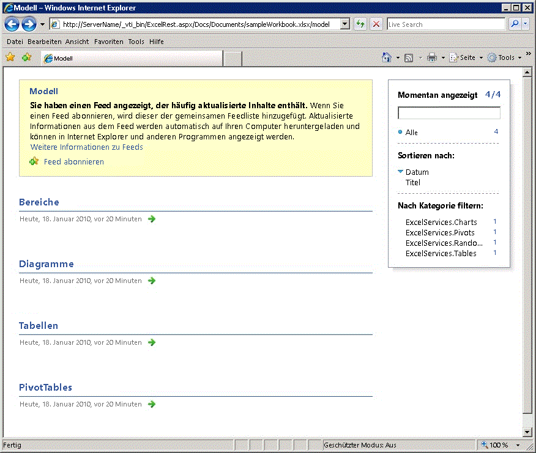

# <a name="basic-uri-structure-and-path"></a>Grundlegende URI-Struktur und Pfad

In diesem Thema wird erläutert, wie Sie die URI-Struktur und den Pfad für die Befehle des REST-Diensts in Excel Services erstellen.
  
> [!NOTE]
> 
> Die Excel Services-REST-API kann in lokalen Bereitstellungen von SharePoint und SharePoint 2016 verwendet werden. Für Office 365 Education-, Business- und Enterprise-Konten verwenden Sie die Excel-REST-APIs, die Bestandteil des [Microsoft Graph](http://graph.microsoft.io/en-us/docs/api-reference/v1.0/resources/excel
)-Endpunkts sind.
  
    
    


## <a name="basic-url-structure-and-path"></a>Grundlegende URL-Struktur und Pfad

Die REST-API in Excel Services ermöglicht den Zugriff auf Ressourcen wie Diagramme, PivotTables, Tabellen und benannte Bereiche in einer Arbeitsmappe direkt über eine URL. Jede REST-URL in Excel Services besteht aus drei Teilen. Im Anschluss finden Sie die grundlegende Struktur der URL für den Zugriff auf die Ressourcen in der Arbeitsmappe: 
  
    
    

1. **REST-URI zur ASPX-Seite** Der Einstiegspunkt zu einer ASPX-Seite
    
  
2. **Speicherort der Arbeitsmappe** Der Pfad zu der Arbeitsmappe
    
  
3. **Speicherort der Ressource** Der Pfad zu der angeforderten Ressource in der Arbeitsmappe
    
  
Es folgt das Konstrukt für die REST-URL für ein bestimmtes Element in einer Arbeitsmappe:
  
    
    


```

http://<ServerName>/_vti_bin/ExcelRest.aspx/<DocumentLibrary>/<FileName>/<ResourceLocation>
```

Es folgt ein Beispiel für eine REST-URL in Excel Services mit Kombination aller drei Teile. In diesem Beispiel greift die REST-URL auf eine Arbeitsmappe namens „sampleWorkbook.xlsx“ zu, die ein Diagramm namens „SampleChart“ enthält:
  
    
    


```
http://<ServerName>/_vti_bin/ExcelRest.aspx/Docs/Documents/sampleWorkbook.xlsx/model/Charts('SampleChart')
```

Die Arbeitsmappe ist in einer Dokumentbibliothek gespeichert. Der vollständige Pfad zur Arbeitsmappe lautet `http://` _<ServerName>_ `/Docs/Documents/sampleWorkbook.xlsx`.
  
    
    
Die drei Teile der REST-URL sind folgende:
  
    
    

1. **REST-URI zur ASPX-Seite**: `http://` _<ServerName>_ `/_vti_bin/ExcelRest.aspx`
    
  
2. **Speicherort der Arbeitsmappe**: `/Docs/Documents/sampleWorkbook.xlsx`
    
  
3. **Speicherort der Ressource**: `/model/Ranges('nameOfTheNamedRange')`
    
  

### <a name="accessing-by-using-the-discovery-user-interface"></a>Zugriff unter Verwendung der Discovery-Benutzeroberfläche

Sie können auf das Diagramm auch unter Verwendung der Discovery-Benutzeroberfläche zugreifen. Informationen dazu, wie Sie auf Ressourcen wie Diagramme, Tabellen, PivotTables und Bereiche unter Verwendung des im folgenden Screenshot dargestellten Ermittlungsmechanismus zugreifen, finden Sie unter  [Ermittlung in der Excel Services-REST-API](discovery-in-excel-services-rest-api.md).
  
    
    

  
    
    

  
    
    

  
    
    

  
    
    

  
    
    

### <a name="marker-path"></a>Markierungspfad

Nachfolgend sehen Sie die ASPX-Seite für den REST-Dienst in Excel Services:
  
    
    

```
http://<ServerName>/_vti_bin/ExcelRest.aspx
```

Um auf den REST-Dienst in Excel Services zuzugreifen, müssen Sie der URL `http://` _<ServerName>_ `/_vti_bin/ExcelRest.aspx` voranstellen.
  
    
    

### <a name="workbook-location"></a>Speicherort der Arbeitsmappe

Der Speicherort der Arbeitsmappe ist der relative Pfad zu der Arbeitsmappe, die die Ressourcen enthält, auf die Sie zugreifen möchten. Angenommen, Sie haben eine Arbeitsmappe mit dem Namen sampleWorkbook.xlsx, die in einer vertrauenswürdigen SharePoint-Dokumentbibliothek gespeichert ist. Für dieses Beispiel folgt im Anschluss der Pfad zu dem Speicherort von sampleWorkbook.xlsx:  
  
    
    

```
http://<ServerName>/Docs/Documents/sampleWorkbook.xlsx
```

Sie nehmen den relativen Pfad zu der Arbeitsmappe ( `Docs/Documents/sampleWorkbook.xlsx`) und hängen diesen an den Markierungspfad an. Im Anschluss finden Sie die URL mit angehängtem Markierungspfad und angehängtem Speicherort der Arbeitsmappe:
  
    
    


```
http://<ServerName>/_vti_bin/ExcelRest.aspx
```


### <a name="resource-location"></a>Speicherort der Ressource

Der Speicherort der Ressource ist der Pfad innerhalb der Arbeitsmappe zu dem gewünschten Element. Wenn Sie beispielsweise auf ein Diagramm zugreifen möchten, würde der Speicherort der Ressource in etwa folgendermaßen aussehen:  `/model/Charts('Chart 1')`.
  
    
    
Um die vollständige URL zu erhalten, hängen Sie dieses an den Markierungspfad und den relativen Pfad zu der Arbeitsmappe an. Die vollständige Beispiel-URL sieht dann folgendermaßen aus: :
  
    
    


```
http://<ServerName>/_vti_bin/ExcelRest.aspx/Docs/Documents/sampleWorkbook.xlsx/model/Charts('Chart 1')

```


## <a name="see-also"></a>Siehe auch


#### <a name="concepts"></a>Konzepte


  
    
    
 [Ressourcen-URI für die REST API in Excel Services](resources-uri-for-excel-services-rest-api.md)
  
    
    
 [Ermittlung in der Excel Services-REST-API](discovery-in-excel-services-rest-api.md)
