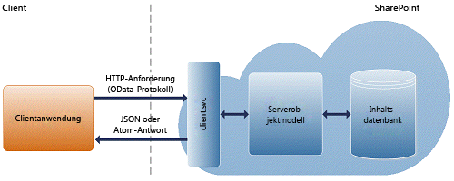

# Erstellen von Windows Phone-Apps, die auf SharePoint zugreifenBuild Windows Phone apps that access SharePoint
Erfahren Sie, wie Sie SharePoint-Add-Ins erstellen können, die SharePoint und mobilen Geräte integrieren, z. B. Windows Phone 8 und Windows Phone 7.Learn how to create SharePoint Add-ins that integrate SharePoint and mobile devices such as Windows Phone 8 and Windows Phone 7.
## Einführung in das Erstellen von mobilen Apps mit SharePointIntroduction to building mobile apps with SharePoint

SharePoint gibt Entwicklern die Möglichkeit, mobile Apps zu erstellen, die die Benutzer begleiten, attraktiv und interaktiv sowie immer und überall verfügbar sind, wenn die Benutzer mit ihnen arbeiten wollen. Sie können Windows Phone 8- und Windows Phone 7Anwendungen mit lokalen SharePoint-Diensten und -Anwendungen kombinieren oder mit SharePoint-Remotediensten und -anwendungen, die in der Cloud ausgeführt werden (z. B. solche, die SharePoint Online verwenden), um leistungsfähige Anwendungen zu erstellen, die die Funktionalität über den klassischen Desktop- oder Laptopcomputer hinaus in eine wirklich mobile und besser zugängliche Umgebung erweitern.SharePoint provides an exciting opportunity for developers to build mobile apps that travel with users, are interactive and attractive, and are available whenever and wherever users want to work with them. You can combine Windows Phone 8 and Windows Phone 7 applications with on-premises SharePoint services and applications, or with remote SharePoint services and applications that run in the cloud (such as those that use SharePoint Online) to create powerful applications that extend the functionality beyond the traditional desktop or laptop, and into a truly portable and much more accessible environment.
  
    
    
Die neuen von SharePoint bereitgestellten Mobilitätsfeatures basieren auf vorhandenen Microsoft-Tools und -Technologien wie SharePoint, Windows Phone, Visual Studio und Silverlight. Entwickler, die bereits mit diesen Technologien und deren zugehörigen Tools vertraut sind, können damit mobile Apps mit SharePoint für Windows Phone ohne Einarbeitungsphase erstellen. In diesem Abschnitt betrachten wir einige Arten von mobilen Apps mit SharePoint näher, die Sie für Windows Phone 8 und erstellen können, und sehen uns die häufigsten Möglichkeiten zum Anpassen dieser Anwendungen an. bietet ein Framework und Tools für Entwickler, einschließlich -Projektvorlagen, um mithilfe vonSharePoint Online mobile Lösungen zu erstellen, die mit SharePoint-Daten sowohl in lokalen SharePoint-Installationen als auch in der Cloud interagieren. Abbildung 1 zeigt, wie eine einfache Listenanwendung auf einem Windows Phone aussehen könnte.The new mobility features offered by SharePoint are built on existing Microsoft tools and technologies, such as SharePoint, Windows Phone, Visual Studio, and Silverlight. Developers who are already familiar with those technologies and their related tools will be able to create SharePoint-powered mobile apps for Windows Phone without a steep learning curve. In this section, we explore some of the types of SharePoint-powered mobile apps you can build for Windows Phone 8 and Windows Phone 7 and the most common ways to customize those applications. SharePoint provides a framework and tools for developers, including Visual Studio 2010 project templates, to create mobile solutions that interact with SharePoint data both in on-premises SharePoint installations and in the cloud, using SharePoint Online. Figure 1 shows how a simple list application could look on Windows Phone.
  
    
    

**Abbildung 1. SharePoint-Listenelemente in einer Windows Phone-App****Figure 1. SharePoint list items in a Windows Phone app**

  
    
    

  
    
    

  
    
    

  
    
    

  
    
    

## Welche Qualifikationen benötigen Sie zum Erstellen von mobilen Apps?What skills do you need to create mobile apps?

In diesem Abschnitt wird davon ausgegangen, dass Sie mit SharePoint, .NET Framework, dem Visual Studio-Entwicklungssystem und Visual C# vertraut sind. Es ist auch von Vorteil, wenn Sie über etwas Erfahrung mit der Windows Phone 8- oder Windows Phone 7-Anwendungsentwicklung mithilfe von Silverlight verfügen, und es ist hilfreich, wenn Sie mit XAML, dem StackPanel und Pivot-Steuerelementen für Windows Phone sowie mit Konzepten, wie z. B. Tombstoning, Silverlight-Datenbindung usw., vertraut sind. Wenn Sie noch nicht der Windows Phone-Anwendungsentwicklung mithilfe von Silverlight vertraut sind, empfehlen wir, dass Sie sich die folgenden Ressourcen ansehen.In this section, we assume that you're familiar with SharePoint, the .NET Framework, the Visual Studio development system, and Visual C#. It's also good to have some experience with Windows Phone 8 or Windows Phone 7 application development using Silverlight, and it helps to be familiar with XAML, the StackPanel and Pivot controls for Windows Phone, and concepts such as tombstoning, Silverlight data binding, and so on. If you are new to Windows Phone application development using Silverlight, we recommend that you check out the following resources.
  
    
    

-  [Entwickeln einer Windows Phone-Anwendung von Anfang bis EndeDeveloping a Windows Phone Application from Start to Finish](http://msdn.microsoft.com/en-us/library/gg680270%28v=pandp.11%29.aspx)
    
  
-  [Benutzeroberfläche für Windows PhoneUser interface for Windows Phone](http://msdn.microsoft.com/en-us/library/windowsphone/develop/ff967556%28v=vs.105%29.aspx)
    
  
-  [Schnellstart: Erstellen einer Benutzeroberfläche mit XAML für Windows PhoneQuickstart: Creating a user interface with XAML for Windows Phone](http://msdn.microsoft.com/en-us/library/windowsphone/develop/jj207025%28v=vs.105%29.aspx)
    
  
-  [Pivot-Steuerelementarchitektur für Windows PhonePivot control architecture for Windows Phone](http://msdn.microsoft.com/en-us/library/windowsphone/develop/ff941097%28v=vs.105%29.aspx)
    
  

## Entwicklungsübersicht für mobile Apps mithilfe von SharePointDevelopment overview for mobile apps using SharePoint

Sie können eine Vielzahl von mobilen Apps mithilfe von SharePoint erstellen. In diesem Abschnitt wird beschrieben, was in der Version SharePoint, die die Entwicklung mobiler Apps für Entwickler erleichtert, neu ist oder sich geändert hat.You can build a wide variety of mobile apps using SharePoint. This section describes what's new or changed in the SharePoint release that makes mobile app development simple for developers.
  
    
    

### Vorlage für Windows Phone SharePoint-AnwendungWindows Phone SharePoint Application template

Dies ist die einfachste Art von mobilen App, die Sie erstellen können, um eine normale Liste auf das Telefon zu bringen. SharePoint bietet eine Visual Studio-Vorlage, damit Sie schnell und einfach SharePoint-Listenanwendungen für Windows Phone erstellen können. Sie können z. B. eine Windows Phone-Anwendung in der Art einer "Aufgabenliste" erstellen, die Ihre Aufgabenliste aus SharePoint auf das Windows Phone bringt und Ihnen so ermöglicht, den Status einer Aufgabe mit Ihrem Telefon unterwegs zu aktualisieren. Ein weiteres Beispiel ist ein Produktkatalog für eine Bestandsliste in SharePoint, der für Vertriebsmitarbeiter auf dem Telefon verfügbar ist. Durch Installieren des Windows Phone SharePoint-SDKs erhalten Sie zwei Vorlagen für eine Windows Phone SharePoint-Anwendung in Visual Studio 2010 oder Visual Studio 2010 Express für Windows Phone. (Siehe  [Vorgehensweise: Einrichten einer Umgebung für die Entwicklung von mobilen Anwendungen für SharePoint](how-to-set-up-an-environment-for-developing-mobile-apps-for-sharepoint.md).) Mithilfe der Vorlage für die Windows Phone SharePoint-Anwendung können Sie den Schritten eines Assistenten zum Erstellen einer funktionalen Windows Phone-App folgen, die auf Daten in einer SharePoint-Liste zugreifen und diese bearbeiten dann.This is the simplest type of mobile app you can build to bring a regular list to the phone. SharePoint offers a Visual Studio template to enable you to quickly and easily create SharePoint list applications for the Windows Phone. For example, you can build a "To Do List"-type Windows Phone application that brings your task list from SharePoint into the Windows Phone and enables the you to use your phone to update the status of a task on the go. Another example is having the product catalog for an inventory list in SharePoint available on the phone for the sales people. Installing the Windows Phone SharePoint SDK makes two Windows Phone SharePoint Application templates available to you in Visual Studio 2010 or Visual Studio 2010 Express for Windows Phone. (See  [How to: Set up an environment for developing mobile apps for SharePoint](how-to-set-up-an-environment-for-developing-mobile-apps-for-sharepoint.md).) Using the Windows Phone SharePoint List Application template, you can follow the steps of a wizard to create a functional Windows Phone app that can access and manipulate data in a SharePoint list.
  
    
    

### Neues und verbessertes Mobilitätsobjektmodell in SharePointNew and enhanced mobility object model in SharePoint

SharePoint Fügt mehrere neue Klassen sowohl zu den Server- als auch zu den Clientobjektmodellen hinzu, um die weiter oben in diesem Artikel beschriebenen SharePoint-Mobilitätsszenarien zu ermöglichen.SharePoint adds several new classes to both the server and client object models to enable the SharePoint mobility scenarios that we described earlier in this article.
  
    
    
Um standortabhängige Apps zu aktivieren, gibt es neben mehreren zugeordneten Klassen zum Strukturieren des Werts von Ortsfeldern und deren Rendering eine neue systemeigene Feldtypklasse, **SPFieldGeoLocation**.To enable location-aware apps, there is a new native field type class, **SPFieldGeoLocation**, along with several associated classes for structuring the value of location fields and rendering them. Diese Klassen können auch im SharePoint-Clientobjektmodell für Silverlight aufgerufen werden.These classes are also callable in the SharePoint client object model for Silverlight. Der neue Feldtyp enthält auch eine Definition, die der standardmäßigen SharePoint-Datei „fldtypes.xml“ hinzugefügt wurde, und neue Benutzersteuerelemente zum Rendern des Felds auf den Anzeige-, Bearbeitungs- und neuen Formularen.The new field type also has a definition added to the standard SharePoint fldtypes.xml file and new user controls for rendering the field on the Display, Edit, and New forms. Eine Übersicht finden Sie unter[Integrieren von Standort- und Kartenfunktionen in SharePoint](integrating-location-and-map-functionality-in-sharepoint.md).For an overview, see  [Integrating location and map functionality in SharePoint](integrating-location-and-map-functionality-in-sharepoint.md). 
  
    
    
Um die SharePoint-Authentifizierung für Windows Phone-Benutzer zu ermöglichen, umfasst das Clientobjektmodell eine neue **Authenticator**-Klasse und mehrere verknüpfte Klassen. Eine Übersicht finden Sie unter  [Übersicht über das SharePoint-Objektmodell für die mobile Clientauthentifizierung](overview-of-the-sharepoint-mobile-client-authentication-object-model.md).To enable SharePoint authentication for Windows Phone users, the client object model includes a new **Authenticator** class and several associated classes. For an overview, see [Overview of the SharePoint mobile client authentication object model](overview-of-the-sharepoint-mobile-client-authentication-object-model.md).
  
    
    
Um automatische Benachrichtigungen für Windows Phone-Benutzer für Ereignisse auf einer SharePoint-Farm zu ermöglichen, enthält das Serverobjektmodell mehrere neue Klassen, von denen jede auch über das Clientobjektmodell aufgerufen werden kann. Zu diesen Klassen gehören Methoden, über die sich Telefon-Apps bei SharePoint-Server-Apps für Benachrichtigungen zu bestimmten Typen von Ereignissen registrieren können. Es gibt auch Methoden, die die Server-Apps verwenden, um Benachrichtigungen an registrierte Abonnenten zu senden. Eine Übersicht finden Sie unter  [Erstellen einer SharePoint-Listen-App für Windows Phone zum Empfangen von Pushbenachrichtigungen](how-to-configure-and-use-push-notifications-in-sharepoint-apps-for-windows.md#BKMK_NotificationPhoneApp).To enable automatic notifications to Windows Phone users of events on a SharePoint farm, the server object model includes several new classes, each of which is also callable from the client object model. These classes include methods that enable phone apps to register with SharePoint server apps for notifications about specified types of events. There are also methods that the server apps use to send notifications to registered subscribers. For an overview, see  [Create a Windows Phone SharePoint list app to receive push notifications](how-to-configure-and-use-push-notifications-in-sharepoint-apps-for-windows.md#BKMK_NotificationPhoneApp).
  
    
    
Mit SharePoint sind Sie nicht auf die Entwicklung mobiler Apps nur für Windows Phone 8 und Windows Phone 7 beschränkt. Mit der JavaScript-Programmierschnittstelle und der neuen REST-Programmierschnitstelle (Representational State Transfer), die von SharePoint bereitgestellt wird, können Sie Anwendungen für andere Geräte als Windows Phone-Geräte erstellen. Sie können mit SharePoint-Websites mithilfe von JavaScript interagieren, das wie Skripts im Browser ausgeführt wird, oder remote mithilfe einer beliebigen Technologie, die standardmäßige REST-Funktionen unterstützt. Der folgende Abschnitt enthält einen Überblick über die REST- und JavaScript-Programmierschnittstellen.With SharePoint, you're not limited to mobile app development just for Windows Phone 8 and Windows Phone 7. With the JavaScript programming interface and the new Representational State Transfer (REST) programming interface provided by SharePoint, you can create applications for non-Windows Phone mobile devices; you can interact with SharePoint sites by using JavaScript that executes as scripts in the browser, or remotely by using any technology that supports standard REST capabilities. The following section provides an overview of the REST and JavaScript programming interfaces.
  
    
    

#### Objektmodellarchitektur ECMAScript (JavaScript, JScript)ECMAScript (JavaScript, JScript) object model architecture

In SharePoint Foundation 2010 wurden die Clientobjektmodelle eingeführt, über die Entwickler eine Remotekommunikation mit SharePoint mithilfe einer Webprogrammiertechnologie ihrer Wahl ausführen konnten: .NET Framework, Silverlight oder JavaScript.SharePoint Foundation 2010 introduced the client object models, which enabled developers to perform remote communication with SharePoint by using the web programming technology of their choice: the .NET Framework, Silverlight, or JavaScript.
  
    
    
In SharePoint Foundation 2010 stellen die Clientobjektmodelle APIs bereit, mit denen Entwickler über ein Skript, das im Browser ausgeführt wird, über Code (basierend auf .NET Framework 3.5 oder höher), der in einer von .NET Framework verwalteten Anwendung ausgeführt wird, oder über Code, der in einer Silverlight 2.0-Anwendung ausgeführt wird, mit SharePoint-Websites interagieren können. Die Datei „proxy.js" und verwaltete DLL-Dateien, aus denen die Clientobjektmodelle bestehen, basieren auf dem client.svc-Webdienst und verarbeiten die effektive Batchverarbeitung, die Serialisierung von Anforderungen sowie die Analyse von Antworten. Abbildung 2 zeigt eine allgemeine Übersicht über die Architektur des SharePoint-Clientobjektmodells.In SharePoint Foundation 2010, the client object models provide APIs that enable developers to interact with SharePoint sites from script that executes in the browser, from code (based on the .NET Framework 3.5 or later) that executes in a .NET Framework-managed application, or from code that executes in a Silverlight 2.0 application. The proxy .js and managed .dll files that compose the client object models are built on the client.svc web service, and handle the effective batching, serialization of requests, and parsing of replies. Figure 2 shows a high-level view of the SharePoint client object model architecture.
  
    
    

**Abbildung 2. Architektur des SharePoint-Clientobjektmodells****Figure 2. SharePoint client object model architecture**

  
    
    

  
    
    

  
    
    
Informationen zum Verwenden des JavaScript-Clientobjektmodells mit SharePoint-Daten finden Sie unter  [ECMAScript-Clientobjektmodell](http://channel9.msdn.com/learn/courses/SharePoint2010Developer/ClientObjectModel/ECMAScriptClientObjectModel).To learn how to use the JavaScript client object model against SharePoint data, see  [ECMAScript Client Object Model](http://channel9.msdn.com/learn/courses/SharePoint2010Developer/ClientObjectModel/ECMAScriptClientObjectModel)
  
    
    

#### REST-Endpunkte in SharePointREST endpoints in SharePoint

Um die REST-Funktionen zu nutzen, die in SharePoint integriert sind, erstellen Sie mithilfe des OData-Standards (Open Data Protocol), welcher der Clientobjektmodell-API entspricht, die Sie verwenden möchten, eine RESTful-HTTP-Anforderung. Der client.svc-Webdienst verarbeitet die HTTP-Anforderung und liefert die entsprechende Antwort im Atom- oder JavaScript Object Notation (JSON)-Format. Die Clientanwendung muss diese Antwort dann analysieren. In Abbildung 3 ist eine allgemeine Ansicht der SharePoint-REST-Architektur dargestellt.To use the REST capabilities that are built into SharePoint, you can construct a RESTful HTTP request using the Open Data Protocol (OData) standard that corresponds to the desired client object model API. The client.svc web service handles the HTTP request and serves the appropriate response, in either Atom or JavaScript Object Notation (JSON) format. The client application must then parse that response. Figure 3 shows a high-level view of the SharePoint REST architecture.
  
    
    

**Abbildung 3. SharePoint-REST-Architektur****Figure 3. SharePoint REST architecture**

  
    
    

  
    
    

  
    
    
Derzeit ist der REST-Dienst in SharePoint schreibgeschützt. Dies bedeutet, dass nur REST-Endpunkte, die eine HTTP-GET-Operation darstellen, verfügbar sind.Currently, the REST service in SharePoint is read-only. That is, only REST endpoints that represent an HTTP GET operation are available
  
    
    
Standardmäßig werden die Antworten des SharePoint REST-Diensts mithilfe des Atom-Protokolls gemäß der OData-Spezifikation formatiert. Darüber hinaus unterstützt der REST-Dienst HTTP-Accept-Header, mit denen Entwickler angeben können, dass die Antwort im JSON-Format zurückgegeben wird. Weitere Informationen zur REST-Diensten in SharePoint finden Sie unter  [Programmieren mit dem SharePoint REST-Dienst](http://msdn.microsoft.com/library/d4b5c277-ed50-420c-8a9b-860342284b72%28Office.15%29.aspx).By default, the SharePoint REST service responses are formatted using the Atom protocol, according to the OData specification. In addition, the REST service supports HTTP Accept headers that enable developers to specify that the response is returned in JSON format. To learn more about REST services in SharePoint, see  [Use OData query operations in SharePoint REST requests](http://msdn.microsoft.com/library/d4b5c277-ed50-420c-8a9b-860342284b72%28Office.15%29.aspx).
  
    
    
Der SharePoint REST-Dienst unterstützt die folgenden OData-Abfrageoperatoren:The SharePoint REST service supports the following OData query operators:
  
    
    

- FilterFilter
    
  
- TakeTake
    
  
- ErweiternExpand
    
  

## Beginnen mit der Entwicklung von mobilen Apps für SharePointStart developing mobile apps for SharePoint

Die folgenden Vorgehensweisen und Übersichten befassen sich mit den spezifischen Informationen, die Sie benötigen, um mit der Entwicklung Ihrer mobilen Apps zu beginnen:The following how-tos and overviews delve into the specific information you need to start your mobile app development:
  
    
    

-  [Vorgehensweise: Einrichten einer Umgebung für die Entwicklung von mobilen Anwendungen für SharePointHow to: Set up an environment for developing mobile apps for SharePoint](how-to-set-up-an-environment-for-developing-mobile-apps-for-sharepoint.md)
    
  
-  [Überblick über Anwendungsvorlagen für Windows Phone SharePoint in Visual StudioOverview of Windows Phone SharePoint application templates in Visual Studio](overview-of-windows-phone-sharepoint-application-templates-in-visual-studio.md)
    
  
-  [Architektur der Vorlage Windows Phone SharePoint-Liste-AnwendungArchitecture of the Windows Phone SharePoint List Application template](architecture-of-the-windows-phone-sharepoint-list-application-template.md)
    
  
-  [Vorgehensweise: Erstellen eine Windows Phone SharePoint Liste appHow to: Create a Windows Phone SharePoint list app](how-to-create-a-windows-phone-sharepoint-list-app.md)
    
  
-  [Vorgehensweise: anmelden und Fortsetzen von Anrufen SharePoint Listenelementen auf einem Telefon mit WindowsHow to: Store and retrieve SharePoint list items on a Windows Phone](how-to-store-and-retrieve-sharepoint-list-items-on-a-windows-phone.md)
    
  
-  [Vorgehensweise: Implementieren von Validierung von Business Logik und die Daten in einem Windows Phone-app für SharePointHow to: Implement business logic and data validation in a Windows Phone app for SharePoint](how-to-implement-business-logic-and-data-validation-in-a-windows-phone-app-for-s.md)
    
  
-  [Vorgehensweise: Support- und konvertieren SharePoint FieldTypes für Windows Phone-appsHow to: Support and convert SharePoint field types for Windows Phone apps](how-to-support-and-convert-sharepoint-field-types-for-windows-phone-apps.md)
    
  
-  [Vorgehensweise: Anpassen der Liste Element Abfragen und Filtern von Daten für Windows Phone-appsHow to: Customize list item queries and filter data for Windows Phone apps](how-to-customize-list-item-queries-and-filter-data-for-windows-phone-apps.md)
    
  
-  [Gewusst wie: Anpassen der Benutzeroberfläche einer SharePoint-Listen-App für Windows PhoneHow to: Customize the user interface of a SharePoint list app for Windows Phone](how-to-customize-the-user-interface-of-a-sharepoint-list-app-for-windows-ph.md)
    
  
-  [Vorgehensweise: Verwenden mehrerer 2013 für SharePoint-in ein Windows Phone-app ListenHow to: Use multiple SharePoint lists in a Windows Phone app](how-to-use-multiple-sharepoint-lists-in-a-windows-phone-app.md)
    
  
-  [Vorgehensweise: Konfigurieren und Verwenden von Pushbenachrichtigungen in SharePoint-apps für Windows PhoneHow to: Configure and use push notifications in SharePoint apps for Windows Phone](how-to-configure-and-use-push-notifications-in-sharepoint-apps-for-windows.md)
    
  
-  [Integrieren von Standort- und Kartenfunktionen in SharePointIntegrating location and map functionality in SharePoint](integrating-location-and-map-functionality-in-sharepoint.md)
    
  
-  [Vorgehensweise: Erstellen eine mobile app in SharePoint, die Daten aus einer externen Datenquelle enthält.How to: Create a mobile app in SharePoint that contains data from an external data source](how-to-create-a-mobile-app-in-sharepoint-that-contains-data-from-an-externa.md)
    
  
-  [Vorgehensweise: Integrieren von Zuordnungen in Windows Phone-Anwendungen und SharePoint aufgelistetHow to: Integrate maps with Windows Phone apps and SharePoint lists](how-to-integrate-maps-with-windows-phone-apps-and-sharepoint-lists.md)
    
  
-  [Vorgehensweise: Erstellen Suchvorgänge gesteuerte mobile Anwendungen mit der Navigation und Ereignis protokollieren von REST-SchnittstellenHow to: Build search-driven mobile apps with the Navigation and Event Logging REST interfaces](how-to-build-search-driven-mobile-apps-with-the-navigation-and-event-logging-res.md)
    
  

## Zusätzliche RessourcenAdditional resources

  
    
    

-  [Programmiermodelle in SharePointProgramming models in SharePoint](programming-models-in-sharepoint.md)
    
  
-  [Vorgehensweise: Einrichten einer Umgebung für die Entwicklung von mobilen Anwendungen für SharePointHow to: Set up an environment for developing mobile apps for SharePoint](how-to-set-up-an-environment-for-developing-mobile-apps-for-sharepoint.md)
    
  
-  [Windows Phone SDK 8.0Windows Phone SDK 8.0](http://www.microsoft.com/en-us/download/details.aspx?id=35471)
    
  
-  [Microsoft SharePoint SDK für Windows Phone 8Microsoft SharePoint SDK for Windows Phone 8](http://www.microsoft.com/en-us/download/details.aspx?id=36818)
    
  
-  [Windows Phone SDK 7.1Windows Phone SDK 7.1](http://www.microsoft.com/en-us/download/details.aspx?id=27570)
    
  
-  [Microsoft SharePoint SDK für Windows Phone 7.1Microsoft SharePoint SDK for Windows Phone 7.1](http://www.microsoft.com/en-us/download/details.aspx?id=30476)
    
  
-  [Informationen zu Expression BlendAbout Expression Blend](http://msdn.microsoft.com/en-us/library/cc296376%28Expression.40%29.aspx)
    
  

