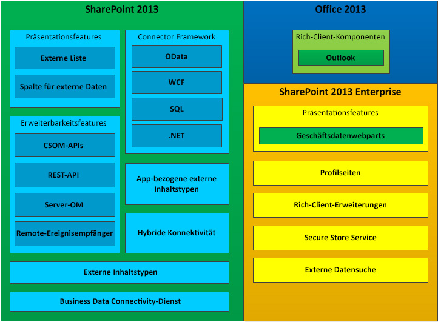

# Business Connectivity Services in SharePointBusiness Connectivity Services in SharePoint
Erfahren Sie, worum es sich bei Business Connectivity Services (BCS) handelt, welche Möglichkeiten es Ihnen bietet, und wie Sie in die Entwicklung von BCS-Anwendungen in SharePoint einsteigen. Sie können SharePoint als Zentrale für die Erstellung umfangreicher Produktivitäts- und Zusammenarbeitslösungen verwenden, die mit verschiedensten externen Systemen verwendet werden können. Business Connectivity Services (BCS) stellt die Infrastruktur bereit, die es SharePoint ermöglicht, Daten aus diesen externen Systemen in einem zentralen System zusammenzuführen. Die Tatsache, dass BCS eine flexible und umfassende Möglichkeit bietet, die externe Systemdatenquelle und die Interaktion mit dieser zu beschreiben, stellt ein überzeugendes Argument dafür dar, zusätzlich zu neuen SharePoint-Add-InsSharePoint als die zentrale Schnittstelle für die Arbeit mit Legacy-Geschäftssystemen zu verwenden.Learn what Business Connectivity Services (BCS) is, what you can do with it, and the information you need to get started developing BCS applications in SharePoint. You can use SharePoint as a hub for creating rich productivity and collaboration solutions that can work with a variety of external systems. Business Connectivity Services (BCS) provides the infrastructure that enables SharePoint to bring data from those external systems into a central system. By providing a flexible and extensible means to describe the external system data source and how to interact with it, BCS makes a compelling argument for using SharePoint as the central interface for working with legacy business systems in addition to new SharePoint Add-ins.
  
    
    

## Welche Möglichkeiten bietet BCS?What can BCS do?

BCS bietet Mechanismen, mit denen erfahrenen Benutzern und Entwicklern sowie IT-Experten der Unternehmenseinheit folgende Aufgaben problemlos ausführen können:BCS provides mechanisms to enable experienced users, developers, and business unit IT professionals to do the following much more easily:
  
    
    

- Offenlegen externer Daten aus Unternehmensanwendungen, Webdiensten und OData-Diensten in SharePoint und Rich-Client-Office-AnwendungenReveal external data from enterprise applications, web services, and OData services in SharePoint and in rich-client Office applications.
    
  
- Bereitstellen von Office-Verhaltensweisen (z. B. Kontakte, Aufgaben und Termine) und Funktionen für externe Daten und Dienste.Provide Office-type behaviors (such as Contacts, Tasks, and Appointments) and capabilities to external data and services.
    
  
- Bereitstellen uneingeschränkter Interaktion mit den Daten, einschließlich Zurückschreibfunktionen von Office-Anwendungen und SharePoint Server in die zugrunde liegenden externen Systemdaten und GeschäftsobjekteProvide complete interaction with the data, including write-back capabilities from Office applications and SharePoint Server to the underlying external system data and business objects.
    
  
- Aktivieren der Offlineverwendung von externen Daten und ProzessenEnable offline use of external data and processes.
    
  
- Überwinden der Kluft zwischen der Welt unstrukturierter Dokumente und Personen und den entsprechenden strukturierten Daten, die in externen Systemen unerreichbar sindBridge the unstructured world of documents and people and the appropriate structured data that is locked in external systems.
    
  

## Komponenten von BCSComponents of BCS

Abbildung 1 zeigt die Features, die in SharePoint und Office 2013 enthalten sind.Figure 1 shows the features that are included in SharePoint and Office 2013.
  
    
    

**Abbildung 1. Featuregruppe der Business Connectivity Services****Figure 1. Business Connectivity Services feature set**

  
    
    

  
    
    

  
    
    

  
    
    

  
    
    

## Verwenden externer Inhaltstypen in BCSUsing external content types in BCS

Externe Inhaltstypen sind der Kern von BCS. Sie können damit die Metadaten und Verhaltensweisen einer Geschäftseinheit (etwa eines Kunden oder einer Bestellung) an einem zentralen Ort verwalten und wiederverwenden. Sie ermöglichen Benutzern, mit diesen externen Daten zu interagieren und sie auf sinnvollere Weise zu verarbeiten.External content types are the core of BCS. They enable you to manage and reuse the metadata and behaviors of a business entity, such as Customer or Order, from a central location. They enable users to interact with that external data and process it in a more meaningful way.
  
    
    
Nehmen wir als Beispiel eine Geschäftsentität, etwa einen Kunden. Sie möchten in der Lage sein, aus Ihrer proprietären Datenbank Daten zu ziehen und damit in SharePoint zu arbeiten. Außerdem möchten Sie Ihren Außendienstmitarbeitern erlauben, Daten in Outlook 2013 offline zu nehmen. Es kann auch sein, dass Sie möchten, dass der Benutzer aus einer Liste von Kunden in einem Bestellvertragsdokument in Microsoft Word einen Kunden auswählen kann. Für all diese Aufgaben können Sie einen einzelnen externen Inhaltstypen erstellen und ihn dann überall wiederverwenden, wo Sie ihn benötigen.For example, consider a business entity, such as a customer. You want to be able to pull data from your proprietary database and work with it in SharePoint. You also want to be able to allow your field salespeople to take data offline in Outlook 2013. Or, you might want the user to be able to choose a customer from a list of customers in an orders contract document inside Microsoft Word. To make all this possible, you can create a single external content type and then reuse it anywhere you need it.
  
    
    
Weitere Informationen zur Verwendung externer Inhaltstypen in BCS finden Sie unter  [Externe Inhaltstypen in SharePoint](external-content-types-in-sharepoint.md).For more information about using external content types in BCS, see  [External content types in SharePoint](external-content-types-in-sharepoint.md).
  
    
    

## Entwickeln von Lösungen mit BCSDeveloping solutions using BCS

Sie können in SharePoint mit BCS eine breite Palette von Lösungen erstellen. Dazu zählen einfache Lösungen, die auf nativen Funktionen basieren, für die nur geringfügige oder keine Anpassungen erforderlich sind, mittlere Lösungen, für die Features in SharePoint und Office 2013 angepasst werden müssen, und erweiterte Lösungen, die komplexe Szenarios und reichhaltige Anwendungen ermöglichen, die deren Funktionsumfang erweitern. Für erweiterte Lösungen muss mithilfe von Visual Studio Code geschrieben werden. Dabei kann es sich entweder um vollständige End-to-End-Lösungen oder wiederverwendbare codebasierte Komponenten handeln, die in einer mittleren Lösung enthalten sind.You can build a broad spectrum of solutions in SharePoint by using BCS. These include simple solutions that rely on native capabilities with little or no customization, intermediate solutions that involve customizing features in SharePoint and Office 2013, and advanced solutions that enable complex scenarios and rich applications that extend their functionality. Advanced solutions involve writing code using Visual Studio. They can be either complete end-to-end solutions, or reusable code-based components that are included in an intermediate solution.
  
    
    
BCS ermöglicht Geschäftsbenutzern, mithilfe eines Webbrowers oder einer Microsoft Office-Clientanwendung wie Word oder Excel auf schnelle und einfache Weise ein breites Spektrum an Anforderungen bezüglicher externer Daten zu erfüllen. Benutzer können, ohne Code zu schreiben, mithilfe von BCS-Features wie externen Listen und Spalten für externe Daten und wiederverwendbaren BCS-Komponenten, die von Entwicklern erstellt und von der IT genehmigt werden, in Office-Clientanwendungen und SharePoint-Websites kombinierte Lösungen zusammenstellen. Diese Lösungen ermöglichen Geschäftsbenutzern (und ihren Teams), mit externen Daten so einfach wie mit SharePoint-Daten zu arbeiten - entweder offline oder verbunden oder direkt in Office 2013.BCS empowers business users to quickly and easily address a broad array of external data needs by using a web browser and a Microsoft Office client application, such as Word or Excel. Without writing code, users can assemble composite solutions by using BCS features, such as external lists and external data columns, and reusable BCS components, which are created by developers and approved by IT, in Office client applications and SharePoint sites. These solutions enable business users (and their teams) to work with external data as easily as with SharePoint data, either offline or connected, or directly in Office 2013.
  
    
    
Weitere Informationen zum Einstieg finden Sie unter  [Einrichten einer Entwicklungsumgebung für BCS in SharePoint](setting-up-a-development-environment-for-bcs-in-sharepoint.md).For information about how to get started, see  [Setting up a development environment for BCS in SharePoint](setting-up-a-development-environment-for-bcs-in-sharepoint.md).
  
    
    

## Verwenden von OData mit Business Connectivity Services in SharePointUsing OData with Business Connectivity Services in SharePoint

Das Open Data Protocol (OData) ist ein Webprotokoll, mit dem Sie mithilfe von Technologien wie HTTP, JavaScript Object Notation (JSON) und AtomPub dem Web Daten zur Verfügung stellen können. Der Zugriff auf die Daten erfolgt über speziell gestaltete URLs. Diese Architektur erlaubt Ihnen, über eine Vielzahl von Technologien mit Daten zu interagieren.The Open Data Protocol (OData) is a web protocol that lets you expose data to the web using technologies such as HTTP, JavaScript Object Notation (JSON), and AtomPub. Access to the data is through specially constructed URLs. This architecture lets you interact with data using a variety of technologies.
  
    
    
Weitere Informationen finden Sie unter  [Verwenden von OData-Quellen mit Business Connectivity Services in SharePoint](using-odata-sources-with-business-connectivity-services-in-sharepoint.md).For more information, see  [Using OData sources with Business Connectivity Services in SharePoint](using-odata-sources-with-business-connectivity-services-in-sharepoint.md).
  
    
    

## Inhalt dieses AbschnittsIn this section

-  [Was ist neu in Business Connectivity Services in SharePointWhat's new in Business Connectivity Services in SharePoint](what-s-new-in-business-connectivity-services-in-sharepoint.md)
    
  
-  [Erste Schritte mit den Business Connectivity Services in SharePointGet started with Business Connectivity Services in SharePoint](get-started-with-business-connectivity-services-in-sharepoint.md)
    
  
-  [Externe Inhaltstypen in SharePointExternal content types in SharePoint](external-content-types-in-sharepoint.md)
    
  
-  [Verwenden von OData-Quellen mit Business Connectivity Services in SharePointUsing OData sources with Business Connectivity Services in SharePoint](using-odata-sources-with-business-connectivity-services-in-sharepoint.md)
    
  
-  [Externe Ereignisse und Warnungen in SharePointExternal events and alerts in SharePoint](external-events-and-alerts-in-sharepoint.md)
    
  
-  [Add-in-bezogenen externen Inhaltstypen in SharePointAdd-in-scoped external content types in SharePoint](add-in-scoped-external-content-types-in-sharepoint.md)
    
  
-  [Erste Schritte der Verwendung des Clientobjektmodells mit externen Daten in SharePointGet started using the client object model with external data in SharePoint](get-started-using-the-client-object-model-with-external-data-in-sharepoint.md)
    
  
-  [Business Connectivity Services-Programmierreferenz für SharePointBusiness Connectivity Services programmers reference for SharePoint](business-connectivity-services-programmers-reference-for-sharepoint.md)
    
  

## Siehe auchSee also

-  [Hinzufügen von SharePoint-FunktionenAdd SharePoint capabilities](add-sharepoint-capabilities.md)
    
  
-  [Einrichten einer Entwicklungsumgebung für BCS in SharePointSetting up a development environment for BCS in SharePoint](setting-up-a-development-environment-for-bcs-in-sharepoint.md)
    
  
-  [Übersicht über die SharePoint-EntwicklungSharePoint development overview](sharepoint-development-overview.md)
    
  

