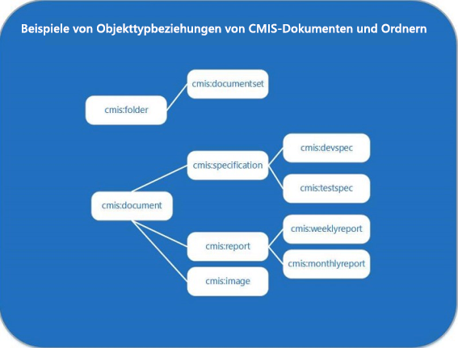

# CMIS (Content Management Interoperability Services) in SharePointContent Management Interoperability Services (CMIS) in SharePoint
In diesem Artikel erfahren Sie mehr über die SharePoint-Implementierung der Version 1.0 des CMIS-Standards (OASIS Content Management Interoperability Services)Learn about the SharePoint implementation of version 1.0 of the OASIS Content Management Interoperability Services (CMIS) standard.
## Einführung in CMIS in SharePointIntroduction to CMIS in SharePoint

Die SharePoint Server-Konformität mit Version 1.0 des  [CMIS-Standards (OASIS Content Management Interoperability Services)](https://www.oasis-open.org/committees/tc_home.php?wg_abbrev=cmis) ermöglicht die Integration von SharePoint Server-Inhaltsrepositorys und anderen ECM-Repositorys (Enterprise Content Management) in einem Unternehmen. CMIS bietet die Möglichkeit, Informationen über Internetprotokolle zwischen Dokumentsystemen, Herausgebern und Repositorys innerhalb des Unternehmens sowie zwischen Unternehmen zu teilen - all dies in einem anbieterneutralen Format. Der CMIS-Standard unterstützt grundlegende Dokumentverwaltungsvorgänge wie Lesen, Erstellen, Aktualisieren, Löschen sowie Ein- und Auschecken. Der Standard unterstützt außerdem das Verwalten von Dokumentversionen und deren Metadaten. CMIS ist auf jeder lokalen SharePoint-Website verfügbar, nachdem das Feature **Content Management Interoperability Services (CMIS) - Hersteller** im Abschnitt **Websitefeatures verwalten** der **Websiteeinstellungen** aktiviert wurde. In SharePoint ist der SharePoint-CMIS-Produzent verfügbar, aber standardmäßig auf allen lokalen Websites deaktiviert.SharePoint Server compliance with version 1.0 of the  [OASIS Content Management Interoperability Services (CMIS) standard](https://www.oasis-open.org/committees/tc_home.php?wg_abbrev=cmis) enables integration between SharePoint Server content repositories and other enterprise content management (ECM) repositories in an enterprise. CMIS enables information to be shared across Internet protocols among and between document systems, publishers, and repositories, within the enterprise, and between companies—all in a vendor-neutral format. The CMIS standard supports basic document management operations such as create, read, update, delete, check in, and check out. The standard supports managing versions of documents and their metadata. CMIS is available on any on-premises SharePoint site after the **Content Management Interoperability Services (CMIS) Producer** feature is activated in the **Manage Site Features** section of **Site Settings**. In SharePoint, the SharePoint CMIS Producer is available but turned off by default on all on-premises sites.
  
    
    
CMIS stellt Interoperabilität zwischen den APIs zur Verfügung, die den Standard unterstützen, ist jedoch kein Ersatz für systemeigene APIs. Die von CMIS unterstützten Objekte überschneiden sich mit Objekten, mit denen SharePoint Server-Entwickler üblicherweise interagieren, darunter auch Dokumente und Ordner. Entwickler, die Anwendungen mit CMIS-Unterstützung erstellen, müssen wahrscheinlich weiterhin benutzerdefinierten SharePoint Server-Code erstellen. Mit CMIS können 60 - 70 Prozent der Entwicklungszeit bei Lösungen eingespart werden, die den Standard implementieren - betrachten Sie es als ein weiteres Tool in der Toolbox für die Entwicklung.CMIS provides interoperability between the APIs that support it, but it is not a replacement for native APIs. The objects that CMIS supports intersect with objects that SharePoint Server developers commonly interact with, including documents and folders. But, developers writing applications that support CMIS will likely have to continue writing custom SharePoint Server code. CMIS can save 60-70 percent of development time for solutions that implement it—consider it yet another tool in the development toolbox.
  
    
    

## Eine ausführliche Betrachtung der CMIS-Implementierung in SharePointA detailed look at the CMIS implementation in SharePoint

Einige Teile der CMIS-Spezifikation sind obligatorisch, viele andere sind jedoch optional. Viele Anbieter, einschließlich Microsoft, implementieren die obligatorischen Anteile des Standards und einige seiner optionalen Komponenten. Abbildung 1 zeigt in der CMIS 1.0-Spezifikation angegebene Funktionen, die in SharePoint implementiert sind.Some parts of the CMIS spec are mandatory, but many others are optional. Many vendors, including Microsoft, implement the mandatory portions of the standard and some of its optional components. Figure 1 shows capabilities specified in the CMIS 1.0 specification that are implemented in SharePoint.
  
    
    
Abbildung 1: In SharePoint implementierte CMIS 1.0-FunktionenFigure 1. CMIS 1.0 capabilities implemented in SharePoint.
  
    
    

  
    
    

  
    
    
Das CMIS-Datenmodell definiert ein Repository, das die übrigen CMIS-Datentypen enthält, einschließlich Objekttypen, Versionsverwaltung, Dokumente und Ordner sowie Abfragefunktionen.The CMIS data model defines a repository that contains the other CMIS data types, including object-types, versioning, documents and folders, and query functionality.
  
    
    

### CMIS-Repositorys und SharePoint-DokumentbibliothekenCMIS repositories and SharePoint document libraries

Das CMIS-Repository ist der Container für den Rest des CMIS-Datenmodells. In SharePoint entspricht die Dokumentbibliothek dem CMIS-Repository (Listen werden im SharePoint-CMIS-Produzent nicht unterstützt). Der Zugriff auf das Repository ist in der Regel der Startpunkt für eine Clientanwendung. Beispiel: Ziehen Sie eine SharePoint Server-Website in Betracht, die mehrere Dokumentbibliotheken enthält, die den Repositorys in CMIS entsprechen. Die CMIS-Spezifikation beschreibt einen erforderlichen Dienst, **getRepositories**, der in SharePoint Server alle gültigen Repositorys (Dokumentbibliotheken) im aktuellen  [SPWeb](https://msdn.microsoft.com/library/Microsoft.SharePoint.SPWeb.aspx) -Objekt abruft. Ein Entwickler kann eine Verbindung zu den Repositorys herstellen, indem er entweder den **getRepositories**-Dienst oder den **getRepositoryInfo**-Dienst aufruft. Mit **getRepositoryInfo** wird das vom Entwickler angegebene Repository abgerufen.The CMIS repository is the container for the rest of the CMIS data model. In SharePoint, the document library is equivalent to the CMIS repository (lists are not supported in the SharePoint CMIS Producer). Accessing the repository is usually the launching point for a client application. For example, consider a SharePoint Server site that contains multiple document libraries, which are equivalent to repositories in CMIS. The CMIS specification describes a mandatory service, **getRepositories**, that in SharePoint Server obtains all of the valid repositories (document libraries) in the current  [SPWeb](https://msdn.microsoft.com/library/Microsoft.SharePoint.SPWeb.aspx) object. A developer can connect to repositories by calling either the **getRepositories** service or the **getRepositoryInfo** service; **getRepositoryInfo** obtains the repository specified by the developer.
  
    
    
Das CMIS-Repository enthält die anderen von SharePoint Server unterstützten CMIS-Funktionen, einschließlich der von CMIS festgelegten Dokument- und Ordnerobjekttypen, der CMIS-Versionsverwaltungsfunktionen (die die systemeigenen Versionsverwaltungsfunktionen in SharePoint Server spiegeln) und der CMIS-Abfragefunktion, die eine SQL-ähnliche Syntax verwendet, um bestimmte Daten in CMIS-Repositorys abzufragen.The CMIS repository contains the other CMIS capabilities that SharePoint Server supports, including the document and folder object-types specified by CMIS, CMIS versioning capabilities (which mirror the native versioning capabilities in SharePoint Server), and the CMIS query capability, which uses a SQL-like syntax to query CMIS repositories for specific data.
  
    
    

### CMIS-Dokumente, Ordner und andere ObjekttypenCMIS documents, folders, and other object types

CMIS definiert eine Objekttyp-Funktion, die der Idee der Inhaltstypen in SharePoint Server entspricht (insbesondere der  [SPContentType](https://msdn.microsoft.com/library/Microsoft.SharePoint.SPContentType.aspx) -Klasse). Jeder schreibgeschützte CMIS-Objekttyp besteht aus Attributen und Eigenschaftsdefinitionen. Über Attribute wird festgelegt, ob ein Objekt beispielsweise abgefragt werden kann oder ob seine Version angegeben werden kann. CMIS unterstützt Eigenschaftsdefinitionen für Eigenschaften, die äquivalenten Objekttypen in SharePoint zugeordnet werden, sofern möglich. Beispielsweise verfügt ein Dokumentobjekt oder ein Ordnerobjekt in CMIS möglicherweise über eine **LastModifiedBy**-Eigenschaft, für die die folgende Syntax gilt:  `cmis:LastModifiedBy`. Eine **Author**-Eigenschaft, die mit einem **Document**-Objekt verknüpft ist, wird als  `cmis:Author` erstellt. Der CMIS-Standard definiert vier Objekttypen, die als Basistypen dienen. In Tabelle 1 sind die CMIS-Objekttypen beschrieben, und es ist angegeben, ob sie in SharePoint unterstützt werden. Außerdem ist ihre entsprechende Funktion in SharePoint aufgeführt, sofern vorhanden.CMIS defines an object-type capability that is equivalent to the idea of content types in SharePoint Server (specifically, the [SPContentType](https://msdn.microsoft.com/library/Microsoft.SharePoint.SPContentType.aspx) class). Each read-only CMIS object-type consists of attributes and property definitions. Attributes define whether an object can be, for example, queried or versioned. CMIS supports property definitions for properties that are associated with equivalent object types in SharePoint, where applicable. For example, a document object or a folder object in CMIS may have a **LastModifiedBy** property, which uses this syntax: `cmis:LastModifiedBy`. An **Author** property associated with a **Document** object is written as `cmis:Author`. The CMIS standard defines four object-types, which serve as base types. Table 1 describes the CMIS object-types, whether they are supported in SharePoint, and their equivalent functionality in SharePoint, if any.
  
    
    

  
    
    

**Tabelle 1: CMIS-Objekttypwerte und ihre Entsprechungen in SharePoint****Table 1. CMIS object-type values and their SharePoint equivalents**

|**CMIS-Objekttyp****CMIS object-type**|**Unterstützt in SharePoint Server?****Supported in SharePoint Server?**|**Entsprechende Funktion in SharePoint****SharePoint equivalent functionality**|**Beschreibung****Description**|
|:-----|:-----|:-----|:-----|
|documentdocument    |jayes    |**Document**-Objekte**Document** objects   |Der CMIS-Dokumentobjekttyp wird direkt dem **Document**-Objekt in SharePoint Server zugeordnet.The CMIS document object-type maps directly to the **Document** object in SharePoint Server.   Dokumente weisen Eigenschaften auf und verfügen über einen angehängten Content Stream, sie können eine Versionsangabe enthalten und unterstützen die grundlegenden Vorgänge Erstellen, Lesen, Aktualisieren und Löschen (CRUD).Documents have properties and a content stream attached to them, can be versioned, and support basic create, read, update, and delete (CRUD) operations.    |
|folderfolder    |jayes    | [SPFolder](https://msdn.microsoft.com/library/Microsoft.SharePoint.SPFolder.aspx) -Objekte[SPFolder](https://msdn.microsoft.com/library/Microsoft.SharePoint.SPFolder.aspx) objects   |Der CMIS-Ordnerobjekttyp wird direkt dem **SPFolder**-Objekt in SharePoint Server zugeordnet.The CMIS folder object-type maps directly to the **SPFolder** object in SharePoint Server.   Ordner können Dokumente und andere Ordner enthalten und über einen einzelnen übergeordneten Ordner verfügen. Ordnern können Eigenschaften hinzugefügt werden, und sie unterstützen die gleichen CRUD-Vorgänge, die vom Dokumentobjekttyp unterstützt werden.  Folders can contain documents and other folders, and must have a single parent folder. Folders have properties attached to them, and they support the same CRUD operations that the document object supports.    Für CMIS-Ordner kann keine Versionsangabe festgelegt werden.CMIS folders cannot be versioned.    |
|Richtliniepolicy    |neinno    |keinenone    |Der CMIS-Richtlinienobjekttyp ist nicht gleichbedeutend mit dem Konzept der Richtlinien in SharePoint oder jeglichen im SharePoint-Objektmodell definierten Richtlinienobjekten.The CMIS policy object-type is not equivalent to the concept of policy in SharePoint, or to any policy objects defined in the SharePoint object model.    |
|Beziehungrelationship    |neinno    |keinenone    |Nicht unterstütztNot supported.    |
   

  
    
    
CMIS stellt keine Methoden zum Erstellen, Ändern oder Löschen von Objekttypen zur Verfügung. Entwickler, die einen SharePoint Server-Dokumentobjekttyp oder -Ordnerobjekttyp erstellen, ändern oder löschen möchten, können hierfür das proprietäre SharePoint Server-Objektmodell verwenden.CMIS does not provide methods for creating, modifying, or deleting object-types. Developers who want to create, modify, or delete a SharePoint Server document object-type or folder object-type can do so by using the proprietary SharePoint Server object model.
  
    
    
Abbildung 2 zeigt Beispielbeziehungen, die zwischen CMIS-Dokument- und -Ordnerobjekttypen bestehen können. In der Abbildung werden Bezeichnungen verwendet, die möglicherweise in einem SharePoint Server-Dokumentverwaltungsszenario zu finden sind. Beispiel: Ein CMIS-Objekttyp namens **cmis:folder** ist einem Objekttyp namens **cmis:documentset** übergeordnet. Der **cmis:documentset**-Objekttyp kann, muss jedoch nicht, Dokumentobjekte enthalten, die in einem  [DocumentSet](https://msdn.microsoft.com/library/Microsoft.Office.DocumentManagement.DocumentSets.DocumentSet.aspx) -Objekt organisiert sind.Figure 2 shows example relationships that can exist between CMIS document and folder object-types. The figure uses labels that one may find in a SharePoint Server document management scenario. For example, a CMIS object-type named **cmis:folder** is the parent of an object-type named **cmis:documentset**. The **cmis:documentset** can contain, but does not have to contain, document objects organized into a [DocumentSet](https://msdn.microsoft.com/library/Microsoft.Office.DocumentManagement.DocumentSets.DocumentSet.aspx) object.
  
    
    
Der CMIS-Dokumentobjekttyp unterstützt zudem Beziehungen zwischen übergeordneten und untergeordneten Elementen, wie hier gezeigt. Dabei ist der **cmis:document**-Objekttyp den **cmis:specification**-, **cmis:report**- und **cmis:image**-Dokumentobjekttypen übergeordnet. Es ist möglich, diese Dokumente in SharePoint Server-Dokumentenmappen zu organisieren, CMIS definiert ein solches Konstrukt jedoch nicht. Stattdessen erkennt CMIS einzelne Objekte als Dokumentobjekttyp oder Ordnerobjekttyp oder als eine Teilmenge eines dieser beiden Objekttypen.The CMIS document object-type also supports parent/child relationships, as shown here where the **cmis:document** object-type is a parent to the **cmis:specification**, **cmis:report**, and **cmis:image** document object-types. It is possible that these documents could be organized into SharePoint Server document sets, but CMIS does not define such a construct. Instead, CMIS recognizes individual objects as being of the document object-type or the folder object-type, or as a subset of either of those two object-types.
  
    
    
Abbildung 2: Beispiele des CMIS-Dokumentobjekttyps und des -OrdnerobjekttypsFigure 2. Examples of the CMIS document object-type and folder object-type
  
    
    

  
    
    

  
    
    

  
    
    

  
    
    

### CMIS-Abfrage in SharePointCMIS query in SharePoint

Die Abfrage ist ein optionaler Bestandteil der CMIS-Spezifikation, die SharePoint Server unterstützt. Bei der CMIS-Abfrage wird eine vereinfachte SQL-ähnliche Syntax verwendet. Jede Abfrage in CMIS ist einem Repository zugeordnet, sodass alle Abfrageergebnisse aus dem einzelnen Repository zurückgegeben werden, dem die Abfrage zugeordnet ist. Bei der Ausführung mehrerer Abfragen in mehreren Repositorys werden Ergebnisse aus einem Repository für jede ausgeführte Abfrage wiedergegeben. Dies führt dazu, dass Ergebnisse aus mehreren Repositorys zurückgegeben werden. Tabelle 2 enthält einige Beispiele für grundlegende CMIS-Abfrageanweisungen.Query is an optional part of the CMIS specification that SharePoint Server supports. The CMIS query uses a simplified, SQL-like syntax. Every query in CMIS is scoped to one repository, so all query results are returned from the single repository to which the query is scoped. Running multiple queries against multiple repositories returns results from one repository for each query that is run, which has the effect of returning results from multiple repositories. Table 2 presents some examples of basic CMIS query statements.
  
    
    

  
    
    

**Tabelle 2: CMIS-Abfragesyntax - Beispiele****Table 2. CMIS query syntax examples**

|**CMIS-Abfrageanweisung****CMIS query statement**|**Beschreibung****Description**|
|:-----|:-----|
| `SELECT * FROM cmis:document`   |Wählt alle Dokumente im Repository aus.Selects all documents in the repository.    |
| `SELECT cmis:name, cmis:author FROM cmis:document WHERE cmis:author='Tina Makovec'`   |Wählt den Namen und den Autor jedes Dokuments im Repository aus, bei dem der Name des Autors Tina Makovec ist.Selects the name and author of any document in the repository where the author is equal to Tina Makovec.    |
| `SELECT * FROM cmis:document WHERE CONTAINS('4Q13')`   |Dies ist ein Beispiel für eine Volltextsuche mithilfe von CONTAINS. Diese Abfrage gibt alle Dokumente im Repository zurück, die das Wort 4Q13 enthalten.This is an example of a full-text search using CONTAINS. This query returns any documents in the repository that contain the word 4Q13.    |
   

  
    
    
SharePoint Server unterstützt keine Verknüpfungen. Bei der CMIS 1.0-Spezifikation hingegen ist dies der Fall. Nicht-SharePoint-CMIS-Repositorys können Verknüpfungen in ihrer CMIS-Abfrageimplementierung unterstützen. Alle Repositorys, die die CMIS-Abfrage unterstützen, unterstützen die Sortierung, die Auswahl der zurückzugebenden Eigenschaften und Paging.SharePoint Server does not support joins, but the CMIS 1.0 specification does. Non-SharePoint CMIS repositories may support joins in their CMIS query implementation. All repositories that support CMIS query do support sorting, selecting which properties to return, and paging.
  
    
    

### CMIS-Versionsverwaltung und SharePoint-VersionsverwaltungCMIS versioning and SharePoint versioning

Die CMIS-Versionsverwaltung ist identisch mit der Versionsverwaltung für Dokumente in SharePoint Server. Haupt- und Nebenversionen sowie Ein- und Auscheckvorgänge werden in CMIS nur für Dokumente unterstützt.CMIS versioning is identical to document versioning in SharePoint Server—major and minor versioning and check in and check out operations are supported in CMIS for documents only.
  
    
    
Ordner können keine Versionsangabe enthalten.Folders cannot be versioned.
  
    
    

### CMIS-ÄnderungsprotokollunterstützungCMIS change log support

CMIS beinhaltet ein Änderungsprotokollkonzept. CMIS-Änderungsprotokolle unterstützen grundlegende Erstellungs-, Aktualisierungs- und Löschereignisse, die an eine Objekt-ID und Eigenschaften gebunden sind. Die Eigenschaften werden ausgelöst, wenn ein Erstellungs-, Aktualisierungs- oder Löschereignis eintritt. Das Änderungsprotokoll unterstützt Paging, sodass Entwickler ihr eigenes Änderungsprotokoll dort speichern können, wo sie möchten.CMIS specifies a change log concept. CMIS change logs support basic create, update, and delete events that are tied to an object ID and properties. The properties are triggered when a create, update, or delete event occurs. The change log supports paging, so developers can store their own change log where they want.
  
    
    

## Authentifizierung und CMIS in SharePointAuthentication and CMIS in SharePoint

Standardmäßig unterstützt SharePoint Server die Authentifizierung für Anonymous AuthN, Basic AuthN, NTLM AuthN, Digest AuthN, Kerberos-Protokollübergang/Eingeschränkte Delegierung, Windows-Forderungen, Claims MultiAuth, and Forderungen/gemischter Modus.By default, SharePoint Server supports authentication for Anonymous AuthN, Basic AuthN, NTLM AuthN, Digest AuthN, Kerberos Protocol Transitioning/Constrained Delegation, Windows-Claims, Claims MultiAuth, and Claims Mixed Mode.
  
    
    
Inbound OAuth wird nicht unterstützt.Inbound OAuth is not supported.
  
    
    

## Der CMIS-Produzent in SharePointThe CMIS Producer in SharePoint

Der CMIS-Produzent ist standardmäßig in SharePoint Server für lokale Bereitstellungen verfügbar. Der Prozent erstellt CMIS-konforme Endpunkte, mit denen CMIS-konforme Verbraucherwebdienste zusammenarbeiten können. CMIS-Unterstützung das Feature CMIS-Produzent sind für alle lokalen SharePoint Server-Implementierungen verfügbar, bei denen das Feature CMIS-Produzent aktiviert ist. CMIS wird in SharePoint Online nicht unterstützt.The CMIS Producer is available by default in SharePoint Server for on-premises deployment. The Producer creates CMIS-compliant endpoints with which CMIS-compliant consumer web services can interoperate. CMIS support and the CMIS Producer feature are available on any on-premises SharePoint Server implementation where the CMIS Producer feature is activated. CMIS is not supported in SharePoint Online.
  
    
    

## CMIS-Szenarien und AnwendungsideenCMIS scenarios and application ideas

Mit den CMIS-Funktionen in SharePoint können Entwickler Anwendungen erstellen, die CMIS-konforme Daten aus SharePoint Server und anderen CMIS-konformen Anwendungen einschließen. Da es sich bei CMIS um ein anbieterneutrales Format handelt, können Entwickler Code erstellen, der CMIS-konforme Endpunkte erzeugt, die mit CMIS-konformen Endverbraucheranwendungen geteilt werden können, ohne dass Code für die API der systemeigenen Anwendung erstellt werden muss. Beispielsweise kann der standardmäßige CMIS-Produzent von SharePoint ein CMIS-Repository (zum Beispiel eine SharePoint Server-Dokumentbibliothek) mit der Bildbearbeitungsanwendung eines anderen Anbieters teilen. Ein Benutzer kann eine Bilddatei öffnen, die im CMIS-Repository des Produzenten der Bildbearbeitungsanwendung gespeichert ist, und sie von der Bildbearbeitungsanwendung aus in SharePoint Server auschecken. Nachdem der Benutzer Änderungen durchgeführt und gespeichert hat, kann er von der Bildbearbeitungsanwendung aus die neueste Version in die SharePoint Server-Dokumentbibliothek einchecken. Da die CMIS-Spezifikation die Versionsverwaltung, was Haupt- und Nebenversionen angeht, auf die gleiche Weise definiert wie SharePoint, speichert der Benutzer der Bildbearbeitungsanwendung Änderungen in einer Version im CMIS-Repository mithilfe einer Versionsverwaltungslogik, die mit der Logik in SharePoint Server identisch ist.With CMIS capabilities in SharePoint, developers can create applications that incorporate CMIS-compliant data from both SharePoint Server and other CMIS-compliant applications. Because CMIS is a vendor-neutral format, developers can write code that produces CMIS-compliant endpoints that can be shared with CMIS-compliant consumer applications without having to write code against the native application's API. For example, the default SharePoint CMIS Producer can share a CMIS repository (for example, a SharePoint Server document library) with another vendor's photo-editing application. A user can open an image file that is stored in the photo-editing application producer's CMIS repository and check it out in SharePoint Server from within the photo-editing application. After making and saving changes, the user can, from the photo-editing application, check in the latest version into the SharePoint Server document library. Because the CMIS specification defines versioning in terms of major and minor versions the same way that SharePoint does, the photo-editing application user saves changes to a version in the CMIS repository using versioning logic identical to logic found in SharePoint Server.
  
    
    
Ziehen Sie beim Erstellen einer App Code in Erwägung, mit dem ein Verzeichnis implementiert wird, das alle Parameter initialisiert. Die Parameter werden zur Authentifizierung bei Repositorys verwendet und geben beispielsweise folgende Daten an: eine Bindung, die verwendet wird (zum Beispiel REST, AtomPub, SOAP), die URL des Servers für den Zugriff auf den REST-Endpunkt, den Benutzernamen, das Kennwort und die Klasse des Authentifizierungsanbieters (zum Beispiel Basic AuthN). Nachdem die Parameter eingerichtet wurden, kann der Entwickler über den **getRepositories**-Aufruf eine Verbindung zu jedem Repository herstellen.When creating an app, consider code that implements a dictionary that initializes all of the parameters. The parameters are used to authenticate to repositories, and specify data such as the binding that is in use (for example, REST, AtomPub, SOAP), the URL for the server to access the REST endpoint, user name, password, and the authentication provider class (for example, Basic AuthN). After the parameters have been set up, the developer can use the **getRepositories** call to connect to each repository.
  
    
    
CMIS unterstützt die Entwicklung einer breiten Palette von Anwendungen, die Daten von mehreren CMIS-Produzenten verarbeiten. CMIS wurde zur Unterstützung von Szenarien konzipiert, auf die Unternehmen in der Regel treffen, wenn sie Inhalte über mehrere Inhaltsverwaltungssysteme hinweg in umfassenden Hybridumgebungen verwalten. Dazu zählen:CMIS supports the development of a broad range of applications that consume data from multiple CMIS producers. CMIS is designed to support scenarios that enterprises commonly encounter when managing content across multiple content management systems in rich, hybrid environments, including: 
  
    
    

- Datenmigration zu und von Inhaltsverwaltungssystemen in einem UnternehmenData migration to and from content management systems in an enterprise.
    
  
- Grafische Benutzeroberflächen (GUIs) in Apps, die Daten aus mehreren Inhaltsrepositorys lesenGraphical user interfaces (GUIs) in apps that read data from multiple content repositories.
    
  
- Ein SharePoint-Webpart, das CMIS verwendet, um ein Rollup persönlicher Daten aus mehreren älteren Inhaltsverwaltungssystemen in einem Unternehmen auszuführenA SharePoint Web Part that uses CMIS to roll up personnel data from multiple legacy content management systems within an enterprise.
    
  
- Eine mobile Anwendung, die von einem beliebigen ECM-System aus auf Dokumente zugreifen kannA mobile application that can access documents from any ECM system.
    
  
- Eine Bildbearbeitungsanwendung, die Dateien in einem CMIS-Repository mit aktivierten ECM-Funktionen, wie beispielsweise der Möglichkeit, Dateien ein- und auszuschecken, speichertA photo-editing application that saves files to a CMIS repository with ECM features enabled, such as the ability to check in and check out files.
    
  
- Ein Branchensystem (LOB, Line-of-Business), das Berichtsdaten in ein ECM-Repository exportiertA line-of-business (LOB) system that exports report data to an ECM repository.
    
  
- Eine App zur Genehmigung von Verträgen, die Elemente der SharePoint-Benutzeroberfläche zur Verwaltung eines zentralen Genehmigungsprozesses nutzt, während die Möglichkeit bestehen bleibt, den Vertrag in verschiedenen Systemen zu veröffentlichenA contract-approval app that uses SharePoint user interface (UI) elements to manage a central approval process while still enabling the contract to be published to several different systems.
    
  

### Beispiel: Contoso Finances-AppExample: Contoso Finances app

Erwägen Sie als App ein SharePoint Server-Webpart, das Daten von mehreren CMIS-Datenanbietern verarbeitet - die Contoso Finances-App. Die Contoso Finances-App sammelt Finanzdaten und ordnet diese in Tabellen an und verteilt diese Daten dann über drei Server: einen IBM-Server, einen Server, auf dem SharePoint Server ausgeführt wird, und einen internen Contoso-Server. Die SharePoint Server-App nutzt ein Webpart, um Daten aus allen drei Datenquellen innerhalb einer beliebigen SharePoint Server-Seite anzuzeigen. Die App benötigt keinen benutzerdefinierten Code, der für eine Implementierung des CMIS-Repository (der SharePoint Server-Dokumentbibliothek) spezifisch ist.Consider as an app a SharePoint Server Web Part that consumes data from multiple CMIS data providers—the Contoso Finances app. The Contoso Finances app gathers and tabulates financial data that is distributed across three servers: an IBM server, a server running SharePoint Server, and an in-house Contoso server. The SharePoint Server app uses a Web Part to display data from all three data sources within any SharePoint Server page . The app does not require any custom code that is specific to any implementation of the CMIS repository (the SharePoint Server document library).
  
    
    

## CMIS und das SharePoint-ObjektmodellCMIS and the SharePoint object model

Das SharePoint-Objektmodell bietet Entwicklern zahlreiche Optionen für Erweiterungen, die nicht von CMIS unterstützt werden, einschließlich APIs zur Verwaltung von Objekttypen, Verwaltung der Website oder Repositoryspalten, Abfragen, die für SharePoint spezifische Schlüsselwörter und Syntax verwenden, Communitytags und Zugriffssteuerungseinträge (ACE).The SharePoint object model offers developers many extensibility options that are not supported by CMIS, including APIs for managing object-types, managing site or repository columns, queries that use keywords and syntax that are specific to SharePoint, social tagging, and access control entries (ACE). 
  
    
    
Die SharePoint Server-Implementierung von CMIS verwendet die  [BlockedFileExtensions](https://msdn.microsoft.com/library/Microsoft.SharePoint.Administration.SPWebApplication.BlockedFileExtensions.aspx) -Eigenschaft, um eine Liste der Dateierweiterungen abzurufen, die nicht auf Websites in der Webanwendung hochgeladen oder von diesen heruntergeladen werden können. CMIS respektiert die [von SharePoint standardmäßig blockierten Dateitypen](http://technet.microsoft.com/de-DE/library/cc262496.aspx).The SharePoint Server implementation of CMIS uses the  [BlockedFileExtensions](https://msdn.microsoft.com/library/Microsoft.SharePoint.Administration.SPWebApplication.BlockedFileExtensions.aspx) property to get a list of file extensions that cannot be uploaded or downloaded from sites in the Web application. CMIS respects the [file types that SharePoint blocks by default](http://technet.microsoft.com/de-DE/library/cc262496.aspx).
  
    
    
Entwickler können CMIS-Clients in jeder Sprache erstellen. Beispielsweise kann ein SharePoint-Entwickler das clientseitige .NET-Objektmodell (CSOM) oder das JavaScript-Objektmodell (JSOM) verwenden, um einen Client zu erstellen. Ein Entwickler kann auch serverseitigen Code verwenden, um eine SharePoint-Anwendung zu entwickeln, die automatisch auf Microsoft Azure gehostet oder auf einem beliebigen Server, einschließlich Internet Information Services (IIS) oder Microsoft Azure von Anbieter gehostet ist.Developers can write CMIS clients in any language. For example, a SharePoint developer can use the .NET client-side object model (CSOM) or the JavaScript object model (JSOM) to create a client. A developer could also use server-side code to develop a SharePoint application that is auto-hosted on Microsoft Azure or provider-hosted on any server, including Internet Information Services (IIS) or Microsoft Azure.
  
    
    

## Suche und Zusammenarbeit mit Open Source-CMIS-ImplementierungenFinding and interoperating with open source CMIS implementations

Es gibt viele Open Source-Projekte, die mit der SharePoint-Implementierung des CMIS 1.0-Standards getestet werden können. Beispiele sind das  [Apache Chemistry-Projekt](http://chemistry.apache.org) und das [Open CMIS-Projekt](http://chemistry.apache.org/java/opencmis.html), die beide Client- und Server-CMIS-Implementierungen mit Java testen, das Projekt  [DotCMIS](http://chemistry.apache.org/dotnet/dotcmisl) für .NET-Clients, das Projekt [cmislib, eine CMIS-Clientbibliothek für Python](http://chemistry.apache.org/python/cmislib.html) und das Projekt [phpclient, eine CMIS-Clientbibliothek für PHP](http://chemistry.apache.org/php/phpclient.html).Many open source projects exist and can be tested with the SharePoint implementation of the CMIS 1.0 standard. Some examples include the  [Apache Chemistry Project](http://chemistry.apache.org); the  [Open CMIS project](http://chemistry.apache.org/java/opencmis.html), which tests both client and server CMIS implementations with Java; the  [DotCMIS](http://chemistry.apache.org/dotnet/dotcmisl) project for .NET client, the [cmislib, a CMIS client library for Python](http://chemistry.apache.org/python/cmislib.html) project; and the [phpclient, a CMIS client library for PHP](http://chemistry.apache.org/php/phpclient.html).
  
    
    
Die  [CMIS Workbench](http://chemistry.apache.org/java/developing/tools/dev-tools-workbench.html) ist eine CMIS-Desktopclientanwendung für Entwickler, die die Navigation in CMIS-Repositorys und interaktive Tests von CMIS-Entwicklungsprojekten für Open CMIS unterstützt. Die Workbench ist über Systemeigenschaften konfigurierbar. Wenn sie das Anmeldedialogfeld für Experten verwenden, können Entwickler auch weitere Eigenschaften konfigurieren.The  [CMIS Workbench](http://chemistry.apache.org/java/developing/tools/dev-tools-workbench.html) is a CMIS desktop client application for developers that supports browsing CMIS repositories and interactively testing CMIS development projects for Open CMIS. The Workbench is configurable through system properties. Using the expert login dialog box, developers can also configure additional properties.
  
    
    

## CMIS 1.1-FeaturesCMIS 1.1 features

CMIS 1.1 wird in SharePoint nicht unterstützt. Die neuere Version der CMIS-Spezifikation enthält jedoch einige neue Features, bei denen es sich lohnt, sie kennenzulernen. Dabei sind die Folgenden hervorzuheben:CMIS 1.1 is not supported in SharePoint, but the newer version of the CMIS specification will include some new features that are worth being aware of. Some highlights include:
  
    
    

- **Type mutability**: Eine Funktion zum Erstellen und Ändern von Inhaltstypen**Type mutability**: Capability to create and modify content types.
    
  
- **Repository features**: Eine Funktion zum Erweitern des **getRepositoryInfo**-Diensts zum Veröffentlichen einer Liste der Erweiterungen für die unterstützten Standards**Repository features**: Capability to extend the **getRepositoryInfo** service to publish a list of extensions to the standards it supports.
    
  
- **Retention and hold**: Dienste, mit denen festgelegt werden kann, das ein Dokument für einen bestimmten Zeitraum oder unbeschränkte Zeit nicht gelöscht wird**Retention and hold**: Services for requiring a document to not be deleted for a period of time or indefinitely.
    
  
- **Browser binding**: Eine neue optionale Bindung, die speziell zur Unterstützung von Anwendungen konzipiert wurde, die in einem Webbrowser ausgeführt werden. Die Bindung nutzt JSON anstelle von XML und verwendet stets die HTTP GET- und POST-Befehle**Browser binding**: A new optional binding that is specifically designed to support applications that run in a Web browser. The binding uses JSON instead of XML, and it always uses the HTTP GET and POST commands.
    
  
- **Secondary object types**: Benannte Eigenschaftssätze, die dynamisch in CMIS-Projekten hinzugefügt bzw. daraus entfernt werden können.**Secondary object types**: Named sets of properties that can be dynamically added and removed from CMIS objects.
    
  
- **cmis:item type**: Neuer Datenmodelltyp der obersten Ebene für Repositorys, die Objekttypen über CMIS verfügbar machen müssen, die bezüglich Dokument-, Ordner- oder Richtlinienobjekttypen nicht in die Definition des CMIS-Modells passen**cmis:item type**: New top-level data model type for repositories that have to expose any object types via CMIS that do not fit the CMIS model's definition for document, folder, policy, or relationship object-types.
    
  
- **Bulk update properties**: Methode zur Unterstützung von Masseneigenschaftsupdates für eine Reihe von Objekten in einem einzelnen Dienstaufruf**Bulk update properties**: Method for supporting bulk property updates on a set of objects within a single service call.
    
  
- **Append to a stream**: Unterstützung beim Anfügen an einen Content Stream. Dieses Feature bietet Clients die Möglichkeit, sehr große Uploads von Dokumentinhalten in viele kleinere Aufrufe zu unterteilen.**Append to a stream**: Support for appending to a content stream. This feature enables clients to break very large uploads of document content into many smaller calls.
    
  

## Siehe auchSee also

-  [Hinzufügen von SharePoint-FunktionenAdd SharePoint capabilities](add-sharepoint-capabilities.md)
    
  
-  [Verwalten von gesperrten Dateitypen in SharePointManage blocked file types](http://technet.microsoft.com/de-DE/library/cc262496.aspx)
    
  
-  [OASIS Content Management Interoperability Specification (CMIS) Version 1.0OASIS Content Management Interoperability Specification (CMIS) version 1.0](http://docs.oasis-open.org/cmis/CMIS/v1.0/os/cmis-spec-v1.0.html)
    
  
-  [OASIS Content Management Interoperability Specification (CMIS) Version 1.1](http://docs.oasis-open.org/cmis/CMIS/v1.1/cs01/CMIS-v1.1-cs01.html) (in SharePoint nicht unterstützt)[OASIS Content Management Interoperability Specification (CMIS) version 1.1](http://docs.oasis-open.org/cmis/CMIS/v1.1/cs01/CMIS-v1.1-cs01.html) (not supported in SharePoint)
    
  

  
    
    

