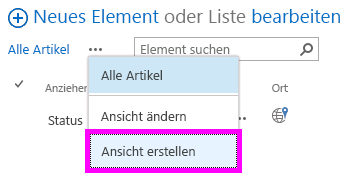
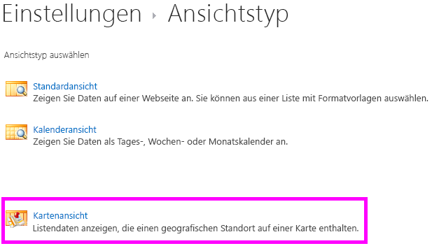
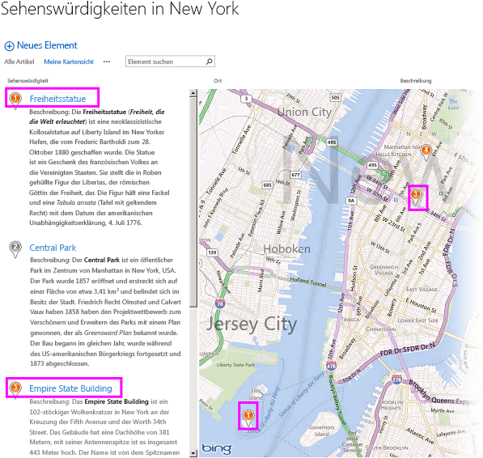
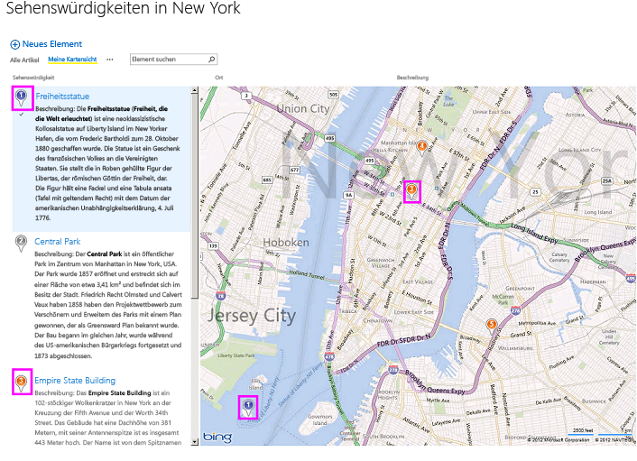
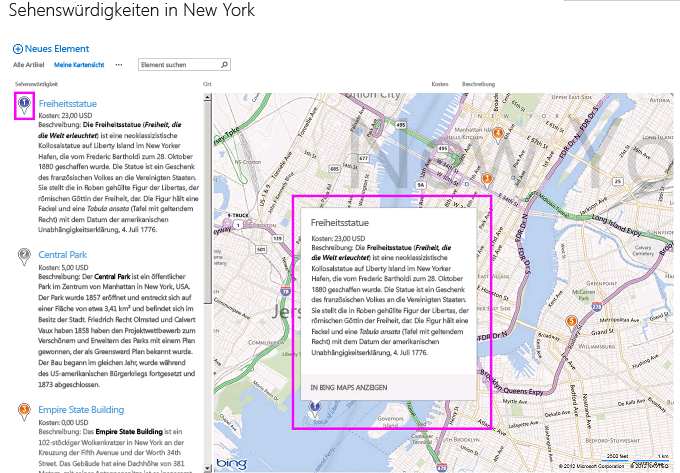

# <a name="create-a-map-view-for-the-geolocation-field-in-sharepoint"></a>Erstellen einer Kartenansicht für das Geolocation-Feld in SharePoint
Erfahren Sie, wie Standortinformationen mithilfe einer Kartenansicht in SharePoint Listen anzeigen. Sie können eine Kartenansicht über die SharePoint-Benutzeroberfläche (UI) manuell oder programmgesteuert mit den neuen Feldtyp für **Geolocation** erstellen. SharePoint führt einen neuen Feldtyp mit dem Namen **Geolocation**, die Ihnen das Hinzufügen von SharePoint-Listen mit Standortinformationen Anmerkungen ermöglicht. Beispielsweise können jetzt stellen "Standortbasierte" enthält und Breiten- und Längengrad Koordinaten über Bing Maps anzuzeigen. Ein Eintrag wird in der Regel als eine PIN auf einer Kartenansicht betrachtet.
  
    
    

Um einer Kartenansicht in einer SharePoint-Liste anzuzeigen, müssen Sie die Bing Maps-Dienste verwenden. Das **Geolocation** -Feld ist nicht verfügbar, wenn Sie eine Liste erstellen, über die Benutzeroberfläche. Dieses Feld muss stattdessen programmgesteuert eingefügt werden. Informationen zum Rendern und Programmgesteuertes Arbeiten mit diesen Datentyp finden Sie unter [Integrieren von Standort- und Kartenfunktionen in SharePoint](integrating-location-and-map-functionality-in-sharepoint.md). Das Feld **Geolocation** und Kartenansicht können Sie räumliche Kontext für alle Informationen bereitgestellt, durch die Integration von Daten aus SharePoint in einer Zuordnung in Web- und mobilen apps. In diesem Artikel wird nicht erläutert, wie das Feld **Geolocation** rendern oder enthalten Anleitungen für Entwickler zum Erstellen einer mobilen speicherortbasierte Anwendung; Es stellt Anweisung mithilfe von Bing Maps für Kartenansichten programmgesteuert zu erstellen und von der SharePoint-UI bereit.
  
    
    

Sie müssen ein MSI-Paket mit dem Namen "SQLSysClrTypes.msi" auf jedem SharePoint-Front-End-Webserver installieren, um **Geolocation**-Feldwerte oder -Daten in einer Liste anzuzeigen. Dieses Paket installiert Komponenten, welche die neuen Geometrie-, Geografie- und Hierarchie-ID-Typen in SQL Server 2008 implementieren. Diese Datei wird standardmäßig für SharePoint Online installiert. Für eine lokale Bereitstellung von SharePoint wird sie jedoch nicht installiert. Sie müssen Mitglied der Gruppe der Farmadministratoren sein, um diesen Vorgang ausführen zu können. Informationen zum Herunterladen von SQLSysClrTypes.msi finden Sie unter [Microsoft SQL Server 2008 R2 SP1 Feature Pack](http://www.microsoft.com/en-us/download/details.aspx?id=26728) für SQL Server 2008 oder unter [Microsoft SQL Server 2012 Feature Pack](http://www.microsoft.com/en-us/download/details.aspx?id=29065) für SQL Server 2012 im Microsoft Download Center.
## <a name="prerequisites-for-creating-a-map-view"></a>Voraussetzungen für das Erstellen einer Kartenansicht
<a name="SP15CreatingMapViews_Preqs"> </a>


- Zugriff auf eine Liste mit SharePoint, mit der ausreichenden Berechtigungen, um eine Ansicht zu erstellen.
    
  
- Eine Liste von SharePoint, die mit der **Geolocation** -Spalte enthält
    
  
- Ein gültiger Bing Karten-Schlüssel, festgelegt auf Farm- oder Webebene, der aus dem  [Bing Karten-Kontocenter]((http://www.bingmapsportal.com/)) abgerufen werden kann
    
    > **Wichtig:** Sie sind verantwortlich für die Einhaltung der für Ihre Nutzung des Bing Karten-Schlüssels anwendbaren Geschäftsbedingungen und alle erforderlichen Veröffentlichungen gegenüber Benutzern Ihrer Anwendung bezüglich an den Bing Daten-Dienst übermittelter Daten. 
- Visual Studio 2012 oder Visual Studio 2010
    
  

## <a name="what-is-a-map-view"></a>Was ist eine Kartenansicht?
<a name="SP15CreatingMapViews_AMapView"> </a>

Eine Kartenansicht ist eine SharePoint-Ansicht, die eine Zuordnung anzeigt (mit Daten aus der Bing Maps-Dienst), Länge und Breite Einträge aus der **Geolocation** -Feldtyp verwenden. Wenn der Feldtyp **Geolocation** auf der SharePoint-Liste verfügbar ist, kann eine Kartenansicht entweder programmgesteuert oder über die SharePoint-UI erstellt werden. Klicken Sie in der Liste zeigt SharePoint den Speicherort auf einer Karte unterstützt von Bing Maps. Darüber hinaus werden ein neuen Ansicht vom Typ mit dem Namen **Kartenansicht** die Listenelemente als Pins für eine Bing Maps-Ajax-Steuerelement, Version 7 mit den Listenelementen als Karten im linken Bereich angezeigt.
  
> [!NOTE]
> Jede SharePoint-Liste kann bis zu zwei **Geolocation**-Spalten enthalten. Sie können keine dritte **Geolocation**-Spalte in derselben Liste hinzufügen. Eine Kartenansicht kann nur eine **Geolocation**-Spalte enthalten. Sie können mehrere Kartenansichten mit unterschiedlichen **Geolocation**-Spalten erstellen.
  
    
    


## <a name="create-a-map-view-from-the-sharepoint-ui"></a>Erstellen einer Kartenansicht auf der SharePoint-Benutzeroberfläche
<a name="SP15CreatingMapViews_FromSharePointUI"> </a>

Die folgenden Schritte führen Sie zum Erstellen einer Kartenansicht aus der SharePoint Benutzeroberfläche vor.
  
    
    

1. Öffnen Sie die Liste SharePoint mit **Geolocation** -Spalte.
    
  
2. Wählen Sie im Menü (Edit Control Block) ECB **Ansicht erstellen**, wie in Abbildung 1 dargestellt.
    
   **Abbildung 1. Erstellen einer Ansicht aus dem ECB-Menü**

  

  
  

  

  
3. Wählen Sie auf der Seite **Auswählen einer Ansicht vom Typ** **Kartenansicht**, wie in Abbildung 2 dargestellt.
    
   **Abbildung 2. Auswählen eines Ansicht vom Typs**

  

  
  

  

  
4. Nach dem Auswählen eines Ansicht vom Typs können Sie verschiedene Felder zum Anzeigen in der Kartenansicht auswählen, wie in Abbildung 3 dargestellt.
    
   **Abbildung 3. Auswählen von Feldern für eine Kartenansicht**

  

  
  

    
    > [!NOTE]
    > Mindestens ein **Geolocation**-Feld ist erforderlich, um eine Kartenansicht zu erstellen. Sie können nicht mehrere **Geolocation**-Felder für eine Kartenansicht auswählen, aber Sie können zwei unterschiedliche Kartenansichten erstellen, die zwei unterschiedliche **Geolocation**-Felder verwenden.
5. Nach dem Hinzufügen der erforderlichen **Geolocation** dar und den anderen Feldern, die, den Sie benötigen, wählen Sie **OK**. Eine Kartenansicht wird erstellt, wie in Abbildung 4 dargestellt.
    
   **Abbildung 4. Vollständige Kartenansicht**

  

  
  

  

  

## <a name="create-a-map-view-programmatically"></a>Programmgesteuertes Erstellen einer Kartenansicht
<a name="SP15CreatingMapViews_ByProgramatically"> </a>

Befolgen Sie diese Schritte, um einer Kartenansicht für eine SharePoint-Liste programmgesteuert zu erstellen.
  
    
    

1. Starten Sie Visual Studio.
    
  
2. Wählen Sie auf der Menüleiste die Optionen Sie **Datei, neues Projekt** aus. Das Dialogfeld **Neues Projekt** wird geöffnet.
    
  
3. Klicken Sie im Dialogfeld **Neues Projekt** wählen Sie **c#** im Feld **Installierte Vorlagen**, und wählen Sie dann die Vorlage **Konsolenanwendung**.
    
  
4. Benennen Sie dem Projekt, und wählen Sie dann auf die Schaltfläche **OK**.
    
  
5. Visual Studio erstellt das Projekt. Fügen Sie einen Verweis auf die folgenden Assemblys hinzu, und wählen Sie **OK**.
    
  - Microsoft.SharePoint.Client.dll
    
  
  - Microsoft.SharePoint.Client.Runtime.dll
    
  
6. Fügen Sie eine Richtlinie **using** in der Standard-cs-Datei wie folgt.
    
     `using Microsoft.SharePoint.Client;`
    
  
7. Fügen Sie den folgenden Code zur **Main**-Methode in der CS-Datei hinzu.
    
    > [!NOTE]
    > Die JSLink-Eigenschaft wird nicht für Umfrage- oder Ereignislisten unterstützt. Ein SharePoint-Kalender ist eine Ereignisliste. 

```cs
  
class Program
    {
        static void Main(string[] args)
        {
            CreateMapView ();
            Console.WriteLine("A map view is created successfully");
        }
        private static void CreateMapView()
        { 
         // Replace <Site URL> and <List Title> with valid values.
            ClientContext context = new ClientContext("<Site Url>"); 
            List oList = context.Web.Lists.GetByTitle("<List Title>");
            ViewCreationInformation viewCreationinfo = new ViewCreationInformation();
         // Replace <View Name> with the name you want for your map view.
             viewCreationinfo.Title = "<View Name>";
             viewCreationinfo.ViewTypeKind = ViewType.Html;
             View oView = oList.Views.Add(viewCreationinfo);
             oView.JSLink = "mapviewtemplate.js";
            oView.Update();
            context.ExecuteQuery();
        } 
    }
```

8. Ersetzen Sie  _<Site Url>_ und _<List Title>_ durch gültige Werte.
    
  
9. Navigieren Sie zu der Liste. Sie sollten eine neu erstellte Ansicht sehen mit dem Namen, den Sie im vorherigen Code angegeben sein.
    
  

## <a name="understand-color-coded-pushpins-in-a-map-view"></a>Grundlegendes zu farbcodierten Reißzwecken in einer Kartenansicht
<a name="SP15CreatingMapViews_ColorCode"> </a>

Zeigen Sie eine Karte Providesthree Farben von Reißzwecken (wie in Abbildung 5 dargestellt), von die jedes eine Unterschied Benutzeroberfläche zur Verfügung stellt. Ein PIN auf der Karte hat die gleiche Farbe wie die PIN des übereinstimmenden Elements im linken Bereich.
  
    
    

- **Orange** Gibt an, dass das Feld **Geolocation** für das Element mit den Bing Maps-Diensten zugeordnet ist.
    
  
- **Grau** Gibt an, dass das Feld **Geolocation** für das Element leer ist. Das Element kann nicht mit Bing Maps-Services zugeordnet werden, sodass keine PIN für dieses Element auf der Karte angezeigt wird.
    
  
- **Blau** Wenn ein Benutzer hovert eines Listenelements ändert sich die PIN Farbe von Orange auf Blau festgelegt. Ändern die PIN im linken Bereich und den entsprechenden PIN auf der Karte Farbe
    
  

**Abbildung 5. Einer Kartenansicht mit verschiedenen PIN Farben**

  
    
    

  
    
    

  
    
    
Nachdem Sie eine Kartenansicht erstellt haben, werden alle Elemente als Pins angezeigt. Der Benutzer kann weitere Informationen zu einem Element abrufen, indem eine Reißzwecke hovert wie in Abbildung 6 dargestellt.
  
    
    

**Abbildung 6. Benutzerumgebung mit Reißzwecken in einer Kartenansicht**

  
    
    

  
    
    

  
    
    

  
    
    

  
    
    

## <a name="see-also"></a>Siehe auch
<a name="SP15CreatingMapViews_AdditionalResources"> </a>


-  [Integrieren von Standort- und Kartenfunktionen in SharePoint](integrating-location-and-map-functionality-in-sharepoint.md)
    
  
-  [Vorgehensweise: Hinzufügen einer Geolocation-Spalte einer Liste in SharePoint programmgesteuert](how-to-add-a-geolocation-column-to-a-list-programmatically-in-sharepoint.md)
    
  
-  [Vorgehensweise: Legen Sie die Bing Maps-Taste auf Ordnerebene Web und Farm in SharePoint](how-to-set-the-bing-maps-key-at-the-web-and-farm-level-in-sharepoint.md)
    
  
-  [Vorgehensweise: Integrieren von Zuordnungen in Windows Phone-Anwendungen und SharePoint aufgelistet](how-to-integrate-maps-with-windows-phone-apps-and-sharepoint-lists.md)
    
  
-  
  [Verwenden des Standortfeldtyps in mobilen Anwendungen für SharePoint](http://technet.microsoft.com/en-us/library/fp161355%28v=office.15%29.aspx)
    
  

