# <a name="create-a-sharepoint-workflow-app-using-visual-studio-2012"></a><span data-ttu-id="9c17f-102">Erstellen einer SharePoint-Workflow-App mit Visual Studio 2012</span><span class="sxs-lookup"><span data-stu-id="9c17f-102">Create a SharePoint workflow app using Visual Studio 2012</span></span>
<span data-ttu-id="9c17f-103">Exemplarische Vorgehensweise zum Erstellen einer Workflow-SharePoint-Add-In mit Microsoft Visual Studio 2012</span><span class="sxs-lookup"><span data-stu-id="9c17f-103">Walk through the process of creating a workflow SharePoint Add-in using Microsoft Visual Studio 2012.</span></span>
## <a name="prerequisites"></a><span data-ttu-id="9c17f-104">Voraussetzungen</span><span class="sxs-lookup"><span data-stu-id="9c17f-104">Prerequisites</span></span>
<span data-ttu-id="9c17f-105"><a name="bmPreReq"> </a></span><span class="sxs-lookup"><span data-stu-id="9c17f-105"><a name="bmPreReq"> </a></span></span>

<span data-ttu-id="9c17f-106">In diesem Entwicklungsszenario wird davon ausgegangen, dass eine SharePoint-Farm und eine Workflow-Manager 1.0-Farm installiert und verbunden sind.</span><span class="sxs-lookup"><span data-stu-id="9c17f-106">This development scenario presumes that a SharePoint farm and a Workflow Manager 1.0 farm are installed and paired.</span></span> <span data-ttu-id="9c17f-107">Diese beiden Farmen können sich auf demselben Computer oder auf separaten Servercomputern befinden.</span><span class="sxs-lookup"><span data-stu-id="9c17f-107">These two farms can be located on the same or on separate server computers.</span></span> <span data-ttu-id="9c17f-108">In diesem Szenario wird außerdem davon ausgegangen, dass die Workflowentwicklung remote stattfindet, d. h. auf einem Computer, der separat von einem der Servercomputer ist, und dass Microsoft Visual Studio 2012 oder höher verwendet wird.</span><span class="sxs-lookup"><span data-stu-id="9c17f-108">The scenario further presumes that workflow development is taking place remotely - that is, on a computer separate from either of the server computers - and is using Microsoft Visual Studio 2012 or later.</span></span>
  
    
    

- <span data-ttu-id="9c17f-109">Auf den Serverplattformen:</span><span class="sxs-lookup"><span data-stu-id="9c17f-109">On the server platforms:</span></span>
    
  - <span data-ttu-id="9c17f-110">Windows Server 2008 R2.</span><span class="sxs-lookup"><span data-stu-id="9c17f-110">Windows Server 2008 R2.</span></span>
    
  
  - <span data-ttu-id="9c17f-111">Microsoft SharePoint</span><span class="sxs-lookup"><span data-stu-id="9c17f-111">Microsoft SharePoint</span></span>
    
  
  - <span data-ttu-id="9c17f-112">Workflow-Manager 1.0</span><span class="sxs-lookup"><span data-stu-id="9c17f-112">Workflow Manager 1.0</span></span>
    
  
- <span data-ttu-id="9c17f-113">Auf der Entwicklungsplattform:</span><span class="sxs-lookup"><span data-stu-id="9c17f-113">On the development platform:</span></span>
    
  - <span data-ttu-id="9c17f-114">Microsoft Visual Studio 2012 oder höher</span><span class="sxs-lookup"><span data-stu-id="9c17f-114">Microsoft Visual Studio 2012 or later.</span></span>
    
  
  - <span data-ttu-id="9c17f-115">Office Developer Tools für Visual Studio 2013</span><span class="sxs-lookup"><span data-stu-id="9c17f-115">Office Developer Tools for Visual Studio 2013.</span></span>
    
    > [!NOTE]
    > <span data-ttu-id="9c17f-116">Office Developer Tools für Visual Studio 2013 ist nur erforderlich, wenn Sie Visual Studio 2012 verwenden.</span><span class="sxs-lookup"><span data-stu-id="9c17f-116">Note: Office Developer Tools for Visual Studio 2013 is only required when using Visual Studio 2012.</span></span> <span data-ttu-id="9c17f-117">Höhere Versionen von Visual Studio enthalten die Office Developer Tools.</span><span class="sxs-lookup"><span data-stu-id="9c17f-117">Later versions of Visual Studio include the Office Developer Tools.</span></span> <span data-ttu-id="9c17f-118">Hilfe beim Einrichten und Konfigurieren Ihrer SharePoint-Workflow-Entwicklungsumgebung finden Sie hier:</span><span class="sxs-lookup"><span data-stu-id="9c17f-118">For assistance setting up and configuring your SharePoint workflow development environment, see the following:</span></span>
  
    
    

-  [<span data-ttu-id="9c17f-119">Vorbereiten auf das Einrichten und Konfigurieren einer SharePoint-Workflowentwicklungsumgebung</span><span class="sxs-lookup"><span data-stu-id="9c17f-119">Prepare to set up and configure a SharePoint workflow development environment</span></span>](prepare-to-set-up-and-configure-a-sharepoint-workflow-development-environment.md)
    
  
-  [<span data-ttu-id="9c17f-120">Konfigurieren von Workflows in SharePoint</span><span class="sxs-lookup"><span data-stu-id="9c17f-120">Configure workflow in SharePoint</span></span>](http://technet.microsoft.com/de-DE/library/jj658586%28v=office.15%29)
    
  
-  [<span data-ttu-id="9c17f-121">Videoreihe: Installieren und Konfigurieren von Workflows in SharePoint</span><span class="sxs-lookup"><span data-stu-id="9c17f-121">Video series: Install and configure Workflow in SharePoint</span></span>](http://technet.microsoft.com/de-DE/library/dn201724%28v=office.15%29)
    
  

## <a name="get-started"></a><span data-ttu-id="9c17f-122">Erste Schritte</span><span class="sxs-lookup"><span data-stu-id="9c17f-122">Get started</span></span>
<span data-ttu-id="9c17f-123"><a name="bmGetStarted"> </a></span><span class="sxs-lookup"><span data-stu-id="9c17f-123"><a name="bmGetStarted"> </a></span></span>

<span data-ttu-id="9c17f-p103">Ein häufiges Szenario für Workflow in Geschäftsumgebungen ist der Prozess der Prüfung und Genehmigung von Dokumenten. In dieser exemplarischen Vorgehensweise erstellen wir eine SharePoint-Add-In, die Routing, Benachrichtigungen und Genehmigung (oder Ablehnung) eines Dokuments mithilfe eines SharePoint-Workflows automatisiert. Wir erstellen diesen Workflow mithilfe des SharePoint-Workflow-Designers in Microsoft Visual Studio 2012.</span><span class="sxs-lookup"><span data-stu-id="9c17f-p103">A common workflow scenario in business settings is the document review and approval process. In this walkthrough, we create an SharePoint Add-in that automates the routing, notifications, and approval (or rejection) of a document using a SharePoint workflow. We create this workflow using the SharePoint workflow designer in Microsoft Visual Studio 2012.</span></span>
  
    
    
<span data-ttu-id="9c17f-127">Hier ist ein Flussdiagramm, das den Ablauf des Workflows veranschaulicht, den wir erstellen möchten.</span><span class="sxs-lookup"><span data-stu-id="9c17f-127">Here's a flowchart that depicts the course of the workflow we're going to create.</span></span>
  
    
    

<span data-ttu-id="9c17f-128">**Abbildung 1. Flussdiagramm des Dokumentgenehmigungs-Workflows**</span><span class="sxs-lookup"><span data-stu-id="9c17f-128">**Figure 1. Flowchart depicting the document approval workflow.**</span></span>

  
    
    

  
    
    
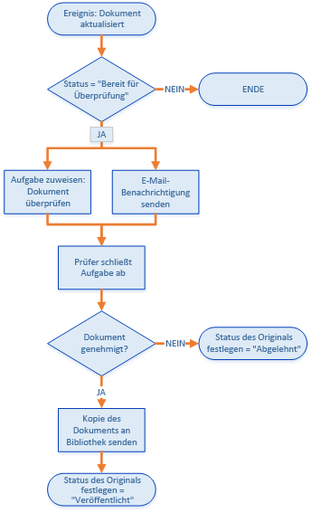
  
    
    
<span data-ttu-id="9c17f-130">Zusammengefasst führt der Workflow Folgendes aus:</span><span class="sxs-lookup"><span data-stu-id="9c17f-130">In summary, the workflow does the following:</span></span> 
  
    
    

  
    
    

1. <span data-ttu-id="9c17f-131">Ein Dokumentänderungsereignis, das einer bestimmten Dokumentbibliothek zugeordnet ist, startet die Workflowinstanz.</span><span class="sxs-lookup"><span data-stu-id="9c17f-131">A document change event associated with a specific document library launches the workflow instance.</span></span>
    
  
2. <span data-ttu-id="9c17f-132">Wenn der Status des Dokuments auf "Bereit zur Überprüfung" festgelegt ist, weist der Workflow einem vordefinierten Prüfer eine Aufgabe zu und sendet dann dem Prüfer eine E-Mail-Benachrichtigung über die Aufgabe.</span><span class="sxs-lookup"><span data-stu-id="9c17f-132">If the document's status is set to "Ready For Review," the workflow assigns a task to a prearranged reviewer, then sends the reviewer an email notification about the task.</span></span>
    
  
3. <span data-ttu-id="9c17f-133">Wenn der Prüfer das Dokument nicht genehmigt, bleibt die Dokumentdatei in der Bibliothek Entwurfsdokumente. Der Status des Dokuments wird jedoch auf "Abgelehnt" festgelegt.</span><span class="sxs-lookup"><span data-stu-id="9c17f-133">If the reviewer fails to approve the document, the document file remains in the Draft Documents library; however, the document status is set to "Rejected."</span></span>
    
  
4. <span data-ttu-id="9c17f-p104">Wenn der Prüfer das Dokument genehmigt, kopiert der Workflow das Dokument in eine Dokumentbibliothek Veröffentlichte Dokumente. Die Originaldatei bleibt in der Bibliothek Entwurfsdokumente, aber der Status wird auf "Veröffentlicht" festgelegt.</span><span class="sxs-lookup"><span data-stu-id="9c17f-p104">If the reviewer approves the document, the workflow copies the document into a Published Documents library. The original file remains in the Draft Documents library, but its status is set to "Published."</span></span>
    
  

    
> <span data-ttu-id="9c17f-136">**Wichtig:** Bevor Sie mit dieser exemplarischen Vorgehensweise beginnen, stellen Sie sicher, dass die Workflowentwicklungsumgebung korrekt installiert und konfiguriert ist.</span><span class="sxs-lookup"><span data-stu-id="9c17f-136">**Important:** Before you start this walkthrough, ensure that you have a properly installed and configured workflow development environment.</span></span> <span data-ttu-id="9c17f-137">Weitere Informationen finden Sie unter [Vorbereiten auf das Einrichten und Konfigurieren einer SharePoint-Workflowentwicklungsumgebung](prepare-to-set-up-and-configure-a-sharepoint-workflow-development-environment.md).</span><span class="sxs-lookup"><span data-stu-id="9c17f-137">For more information, see  [Prepare to set up and configure a SharePoint workflow development environment](prepare-to-set-up-and-configure-a-sharepoint-workflow-development-environment.md).</span></span> <span data-ttu-id="9c17f-138">Stellen Sie außerdem sicher, dass Sie über eine SharePoint-Instanz verfügen, mit der Sie Ihren Workflow entwickeln können.</span><span class="sxs-lookup"><span data-stu-id="9c17f-138">Also, ensure that you have a SharePoint instance that you can develop your workflow against.</span></span> <span data-ttu-id="9c17f-139">Weitere Informationen finden Sie unter [Installieren von SharePoint](http://technet.microsoft.com/de-DE/library/cc303424.aspx).</span><span class="sxs-lookup"><span data-stu-id="9c17f-139">For more information, see  [Install SharePoint](http://technet.microsoft.com/de-DE/library/cc303424.aspx).</span></span> 
  
    
    


## <a name="prepare-your-environment"></a><span data-ttu-id="9c17f-140">Vorbereiten der Umgebung</span><span class="sxs-lookup"><span data-stu-id="9c17f-140">Prepare your environment</span></span>
<span data-ttu-id="9c17f-141"><a name="bmPrepare"> </a></span><span class="sxs-lookup"><span data-stu-id="9c17f-141"><a name="bmPrepare"> </a></span></span>

<span data-ttu-id="9c17f-142">Im ersten Schritt wird die SharePoint-Website mit Dokumentbibliotheken vorbereitet, die im Workflow verwendet werden.</span><span class="sxs-lookup"><span data-stu-id="9c17f-142">The first step is preparing our SharePoint site with document libraries that our workflow will use.</span></span>
  
    
    

1. <span data-ttu-id="9c17f-143">Starten Sie Visual Studio 2012, und erstellen Sie ein neues Projekt unter Verwendung der Vorlage **App für SharePoint **, wie in Abbildung 2 dargestellt.</span><span class="sxs-lookup"><span data-stu-id="9c17f-143">Launch Visual Studio 2012 and create a new project using the **App for SharePoint** template, as depicted in Figure 2.</span></span>
    
    > [!NOTE]
    > <span data-ttu-id="9c17f-p106">In dieser exemplarischen Vorgehensweise wird die Lösungsdatei "DocApprovalWorkflow1" genannt. Es wird empfohlen, denselben Namen zu verwenden. Wenn Sie Ihre Lösung anders nennen, müssen Sie darauf achten, in den folgenden Anweisungen die nötigen Anpassungen vorzunehmen.</span><span class="sxs-lookup"><span data-stu-id="9c17f-p106">In this walkthrough, the solution file is named "DocApprovalWorkflow1". It is recommended that you use the same name. However, if you name your solution differently, be sure that you make necessary adjustments in the instructions that follow.</span></span> 

   <span data-ttu-id="9c17f-147">**Abbildung 2. Erstellen eines neuen Projekts in Visual Studio 2012**</span><span class="sxs-lookup"><span data-stu-id="9c17f-147">**Figure 2. Create new project in Visual Studio 2012**</span></span>

  

  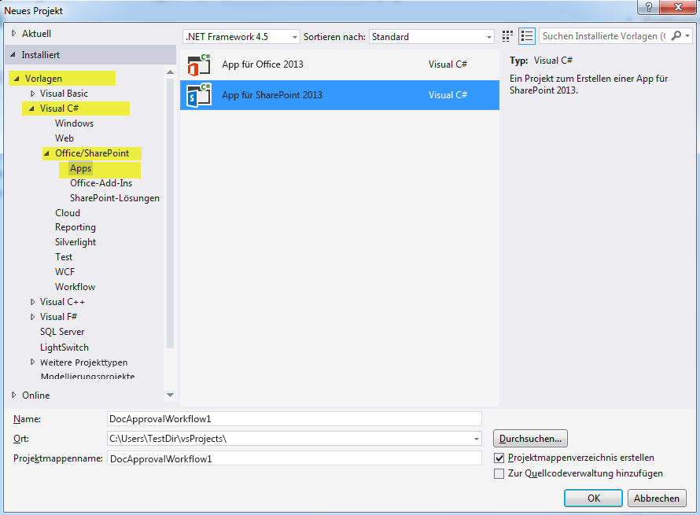
  

  

  
2. <span data-ttu-id="9c17f-149">Erstellen Sie auf Ihrer entsprechenden SharePoint-Website wie folgt zwei neue Dokumentbibliotheken:</span><span class="sxs-lookup"><span data-stu-id="9c17f-149">On your associated SharePoint site, create two new document libraries by doing the following:</span></span>
    
  - <span data-ttu-id="9c17f-150">Klicken Sie im **Projektmappen-Explorer** mit der rechten Maustaste auf das Symbol „DocApprovalWorkflow1“, und wählen Sie **Hinzufügen** > **Neues Element** und dann **Liste** aus.</span><span class="sxs-lookup"><span data-stu-id="9c17f-150">In **Solution Explorer**, right-click on the "DocApprovalWorkflow1" icon and select **Add** > **New Item** and then select **List**.</span></span>
    
  
  - <span data-ttu-id="9c17f-151">Geben Sie im resultierenden Assistenten zum Anpassen von SharePoint im Namenfeld Entwurfsdokumente ein. Wählen Sie dann in der Dropdownliste unter dem ersten Optionsfeld Dokumentbibliothek aus, wie in Abbildung 3 dargestellt.</span><span class="sxs-lookup"><span data-stu-id="9c17f-151">In the resulting **SharePoint Customization Wizard**, enter "Draft Documents" in the name field; then select "Document Library" in the drop-down under the first radio button, as depicted in Figure 3.</span></span> 
    
  
  - <span data-ttu-id="9c17f-152">Klicken Sie auf **Weiter**, übernehmen Sie die Standardeinstellungen, und klicken Sie dann auf **Fertig stellen**.</span><span class="sxs-lookup"><span data-stu-id="9c17f-152">Click **Next**, then take default settings, and then click **Finish**.</span></span>
    
   <span data-ttu-id="9c17f-153">**Abbildung 3. Assistent zum Anpassen von SharePoint für Listeneinstellungen**</span><span class="sxs-lookup"><span data-stu-id="9c17f-153">**Figure 3. SharePoint customization wizard for List settings.**</span></span>

  

  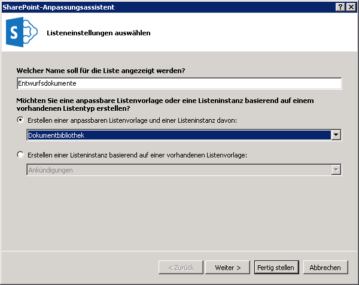
  

  

  
3. <span data-ttu-id="9c17f-155">Erstellen Sie die zweite Dokumentbibliothek mit den gleichen Schritten wie oben, aber nennen Sie diese zweite Bibliothek „Veröffentlichte Dokumente“.</span><span class="sxs-lookup"><span data-stu-id="9c17f-155">Create the second document library using the same steps as above, except name this second library "Published Documents".</span></span>
    
  
4. <span data-ttu-id="9c17f-156">Fügen Sie zwei benutzerdefinierte Spalten zu **beiden** neuen Dokumentbibliotheken hinzu, die Sie soeben erstellt haben:</span><span class="sxs-lookup"><span data-stu-id="9c17f-156">Add two custom columns to **both** of the new document libraries that you just created:</span></span>
    
  - <span data-ttu-id="9c17f-157">Erstellen Sie eine benutzerdefinierte Spalte namens „Genehmigende Person“ mit dem Listenspaltentyp **Person oder Gruppe**.</span><span class="sxs-lookup"><span data-stu-id="9c17f-157">Create a custom column named "Approver" and make it a **Person or Group** list column type.</span></span>
    
  
  - <span data-ttu-id="9c17f-158">Erstellen Sie eine benutzerdefinierte Spalte namens „Dokumentstatus“ mit dem Spaltentyp **Auswahlliste** (siehe Abbildung 4).</span><span class="sxs-lookup"><span data-stu-id="9c17f-158">Create a custom column named "Document Status" and make it a **Choice** list column type (see Figure 4).</span></span>
    
  
5. <span data-ttu-id="9c17f-p107">Fügen Sie in der Spalte **Dokumentstatus** fünf Auswahlmöglichkeiten hinzu, indem Sie die **Type**-Eigenschaft im Eigenschaftenraster erweitern und dann in der **Items**-Eigenschaft auf die Schaltfläche mit den Auslassungszeichen ( **…**) klicken. Geben Sie die Auswahlwerte im daraufhin angezeigten Dialogfeld ein, wie in Abbildung 4 dargestellt.</span><span class="sxs-lookup"><span data-stu-id="9c17f-p107">On the **Document Status** column, add five choices by expanding the **Type** property in the property grid, then clicking the ellipsis button ( **…**) on the **Items** property. Enter the choice values in the dialog box that appears, as shown in Figure 4.</span></span>
    
  - <span data-ttu-id="9c17f-161">Entwurf in Bearbeitung</span><span class="sxs-lookup"><span data-stu-id="9c17f-161">Draft in Progress</span></span>
    
  
  - <span data-ttu-id="9c17f-162">Bereit zur Überprüfung</span><span class="sxs-lookup"><span data-stu-id="9c17f-162">Ready for Review</span></span>
    
  
  - <span data-ttu-id="9c17f-163">Genehmigt zur Veröffentlichung</span><span class="sxs-lookup"><span data-stu-id="9c17f-163">Approved for Publishing</span></span>
    
  
  - <span data-ttu-id="9c17f-164">Abgelehnt</span><span class="sxs-lookup"><span data-stu-id="9c17f-164">Rejected</span></span>
    
  
  - <span data-ttu-id="9c17f-165">Veröffentlicht</span><span class="sxs-lookup"><span data-stu-id="9c17f-165">Published</span></span>
    
  

   

  

  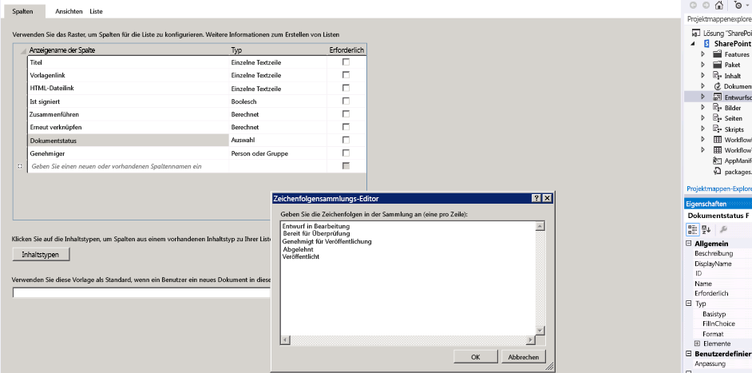
  

  

  

## <a name="create-the-basic-workflow"></a><span data-ttu-id="9c17f-167">Erstellen des grundlegenden Workflows</span><span class="sxs-lookup"><span data-stu-id="9c17f-167">Create the basic workflow</span></span>
<span data-ttu-id="9c17f-168"><a name="bmCreateWorkflow"> </a></span><span class="sxs-lookup"><span data-stu-id="9c17f-168"><a name="bmCreateWorkflow"> </a></span></span>

<span data-ttu-id="9c17f-169">Nun sind wir bereit, den Workflow selbst zu erstellen.</span><span class="sxs-lookup"><span data-stu-id="9c17f-169">Now we're ready to create the workflow itself.</span></span>
  
    
    

1. <span data-ttu-id="9c17f-170">Erstellen Sie in Visual Studio einen neuen Workflow, indem Sie (im **Projektmappen-Explorer**) mit der rechten Maustaste auf das Symbol **DocApprovalWorkflow1** klicken und **Hinzufügen** > **Neues Element** und dann **Workflow** auswählen (siehe Abbildung 5).</span><span class="sxs-lookup"><span data-stu-id="9c17f-170">In Visual Studio, create a new workflow by right-clicking on the **DocApprovalWorkflow1** icon (in **Solution Explorer**) and selecting **Add** > **New Item**, and then selecting **Workflow** (see Figure 5).</span></span>
    
   <span data-ttu-id="9c17f-171">**Abbildung 5. Neues Element hinzufügen > Workflow-Assistent**</span><span class="sxs-lookup"><span data-stu-id="9c17f-171">**Figure 5. Add New Item > Workflow wizard.**</span></span>

  

  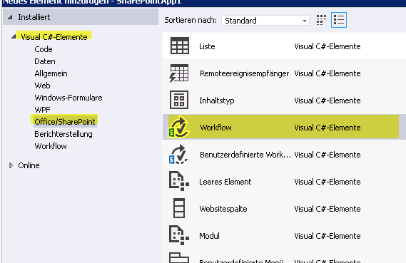
  

  

  
2. <span data-ttu-id="9c17f-173">Wenn Sie aufgefordert werden, nennen Sie den Workflow „DocumentApprovalWorkflow“, und wählen Sie **Listenworkflow** als Workflowtyp aus (siehe Abbildung 6).</span><span class="sxs-lookup"><span data-stu-id="9c17f-173">When prompted, name the workflow "DocumentApprovalWorkflow" and select **List Workflow** as the workflow type (see Figure 6).</span></span>
    
   <span data-ttu-id="9c17f-174">**Abbildung 6. Angeben von Workflowname und -typ**</span><span class="sxs-lookup"><span data-stu-id="9c17f-174">**Figure 6. Specify workflow name and type.**</span></span>

  

  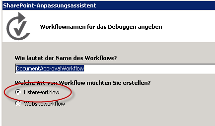
  

  

  
3. <span data-ttu-id="9c17f-176">Ordnen Sie im **Assistenten zum Anpassen von SharePoint** den neuen Workflow der Bibliothek Entwurfsdokumente zu. Wählen Sie dann die Option, eine neue Verlaufsliste und eine neue Workflowaufgabenliste zu erstellen, wie in Abbildung 7 dargestellt.</span><span class="sxs-lookup"><span data-stu-id="9c17f-176">In the **SharePoint Customization Wizard**, associate the new workflow with the Draft Document library; then, opt to create a new history list and a new workflow task list, as shown in Figure 7.</span></span> <span data-ttu-id="9c17f-177">Klicken Sie dann auf **Weiter**.</span><span class="sxs-lookup"><span data-stu-id="9c17f-177">Then click **Next**.</span></span>
    
   <span data-ttu-id="9c17f-178">**Abbildung 7. Abschließen des Assistenten zum Anpassen von SharePoint für den neuen Workflow**</span><span class="sxs-lookup"><span data-stu-id="9c17f-178">**Figure 7. Completing the SharePoint Customization Wizard for the new workflow.**</span></span>

  

  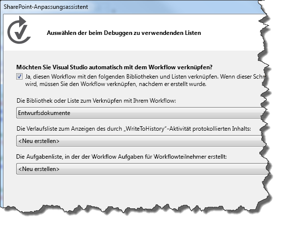
  

  

  
4. <span data-ttu-id="9c17f-p109">Legen Sie fest, dass der Workflow automatisch gestartet wird, wenn ein Element in der Bibliothek Entwurfsdokumente geändert wird. Sie können auch das Kontrollkästchen für manuelles Starten des Workflows aktiviert lassen. Dadurch können Sie den Workflow einfach testen, ohne ein Dokument zu ändern. Siehe Abbildung 8.</span><span class="sxs-lookup"><span data-stu-id="9c17f-p109">Set the workflow to start automatically when an item in the Draft Documents library is changed. You can also leave the check box for manually starting the workflow selected; this allows you to easily test the workflow without needing to change a document. See Figure 8.</span></span>
    
   <span data-ttu-id="9c17f-183">**Abbildung 8. Festlegen von Aktivierungsparametern für den Workflow**</span><span class="sxs-lookup"><span data-stu-id="9c17f-183">**Figure 8. Set the activation parameters for the workflow.**</span></span>

  

  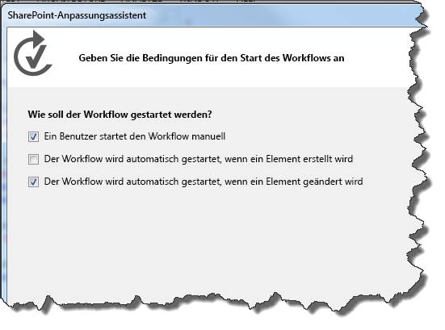
  

    
    > [!NOTE]
    > <span data-ttu-id="9c17f-185">Sie können den Workflowzuordnungstyp nach Erstellen des Workflows im Eigenschaftenraster ändern, während der Workflow im **Projektmappen-Explorer** ausgewählt ist (siehe Abbildung 9).</span><span class="sxs-lookup"><span data-stu-id="9c17f-185">Note: You can change the workflow association type after the workflow has been created by using the property grid with the workflow selected in **Solution Explorer** (see Figure 9).</span></span> <span data-ttu-id="9c17f-186">Klicken Sie dann auf **Fertig stellen**.</span><span class="sxs-lookup"><span data-stu-id="9c17f-186">Then click **Finish**.</span></span> 

   <span data-ttu-id="9c17f-187">**Abbildung 9. Das Eigenschaftsraster des Workflows**</span><span class="sxs-lookup"><span data-stu-id="9c17f-187">**Figure 9. The workflow property grid.**</span></span>

  

  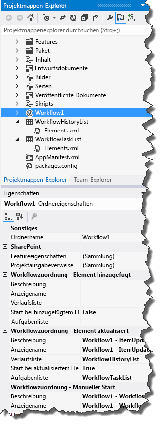
  

  

  
5. <span data-ttu-id="9c17f-p111">Konfigurieren Sie schließlich Ihren SharePoint Server für die Verwaltung ausgehender E-Mails über den SMTP-Dienst. Anweisungen finden Sie unter  [Konfigurieren ausgehender E-Mails für eine SharePoint-Farm](http://technet.microsoft.com/de-DE/library/cc263462.aspx). Dies ist nötig, damit vom Workflow E-Mail-Benachrichtigungen im Zusammenhang mit Workflowaufgaben gesendet werden können.</span><span class="sxs-lookup"><span data-stu-id="9c17f-p111">Finally, configure your SharePoint Server to manage outgoing email using the SMTP service. For instructions, see  [Configure outgoing email for a SharePoint farm](http://technet.microsoft.com/de-DE/library/cc263462.aspx). This is necessary to allow the workflow to send email notifications related to workflow tasks.</span></span>
    
  

## <a name="implement-the-workflow-logic"></a><span data-ttu-id="9c17f-192">Implementieren der Workflowlogik</span><span class="sxs-lookup"><span data-stu-id="9c17f-192">Implement the workflow logic</span></span>
<span data-ttu-id="9c17f-193"><a name="bmImplementLogic"> </a></span><span class="sxs-lookup"><span data-stu-id="9c17f-193"><a name="bmImplementLogic"> </a></span></span>

<span data-ttu-id="9c17f-194">Nachdem wir unseren SharePoint Server eingerichtet und den grundlegenden Workflow erstellt haben, können wir nun die Workflowlogik entwerfen.</span><span class="sxs-lookup"><span data-stu-id="9c17f-194">Now that we have our SharePoint Server set up and our basic workflow created, we can now design the workflow logic.</span></span>
  
    
    

1. <span data-ttu-id="9c17f-p112">Öffnen Sie den Workflow-Designer durch Doppelklicken auf das Workflow-Projektelement im **Projektmappen-Explorer**. Sie sehen die Workflow-Designeroberfläche (und die Workflow-Toolbox). Der Designer wird mit einer anfänglichen Workflowphase namens **Sequenz** aufgefüllt.</span><span class="sxs-lookup"><span data-stu-id="9c17f-p112">Open the workflow designer by double-clicking on the workflow project item in **Solution Explorer**. You will see the workflow designer surface (and the workflow toolbox); the designer is populated with an initial workflow stage named **Sequence**.</span></span>
    
  
2. <span data-ttu-id="9c17f-p113">Unser erster Schritt besteht darin, die **LookupSPListItem**-Aktivität aus der Toolbox (siehe Abbildung 10) in die Phase **Sequenz** auf der Designeroberfläche zu ziehen. Wir verwenden diese Aktivität, um zu einem beliebigen Zeitpunkt den Status des Dokuments abzurufen. Die **LookupSPListItem**-Aktivität gibt diesen als  [DynamicValue](http://msdn.microsoft.com/de-DE/library/windowsazure/microsoft.activities.dynamicvalue%28v=azure.10%29.aspx)-Objekt zurück, das einen Satz von SharePoint-Listenelementeigenschaften als Schlüssel-Wert-Paare enthält.</span><span class="sxs-lookup"><span data-stu-id="9c17f-p113">Our first step is to grab the **LookupSPListItem** activity from the toolbox (see Figure 10) and drop it in the **Sequence** stage on the designer surface. We use this activity to get the status of the document at any given time, which the **LookupSPListItem** activity returns as a [DynamicValue](http://msdn.microsoft.com/de-DE/library/windowsazure/microsoft.activities.dynamicvalue%28v=azure.10%29.aspx) object that contains a set of SharePoint list item properties as key-value pairs.</span></span>
    
   <span data-ttu-id="9c17f-199">**Abbildung 10. "LookupSPListItem"-Aktivitätsauswahl.**</span><span class="sxs-lookup"><span data-stu-id="9c17f-199">**Figure 10. LookupSPListItem activity selector.**</span></span>

  

  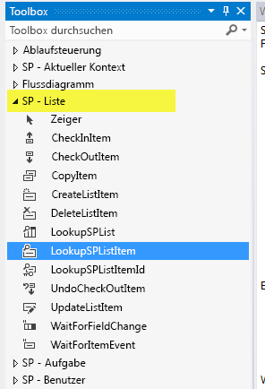
  

  

1. <span data-ttu-id="9c17f-p114">Zum Konfigurieren der **LookupSPListItem**-Aktivität klicken Sie zunächst im Designer darauf, um sie auszuwählen. Dadurch wird das Eigenschaftenraster für die Aktivität aktiviert.</span><span class="sxs-lookup"><span data-stu-id="9c17f-p114">To configure the **LookupSPListItem** activity, first click on it in the designer to select it. This activates the property grid for the activity.</span></span>
    
  
2. <span data-ttu-id="9c17f-203">Konfigurieren Sie die **LookupSPListItem**-Aktivität mithilfe der Kombinationsfelder im Eigenschaftenraster so, dass für **ItemId** das aktuelle Element und als **ListId** die aktuelle Liste verwendet wird, wie in Abbildung 11 dargestellt.</span><span class="sxs-lookup"><span data-stu-id="9c17f-203">Use the combo boxes in the property grid to configure the **LookupSPListItem** activity to use "current item" for **ItemId** and "current list" as **ListId**, as shown in Figure 11.</span></span>
    
   <span data-ttu-id="9c17f-204">**Abbildung 11. Konfigurieren von Eigenschaften von "LookupSPListItem"**</span><span class="sxs-lookup"><span data-stu-id="9c17f-204">**Figure 11. Configuring LookupSPListItem properties.**</span></span>

  

  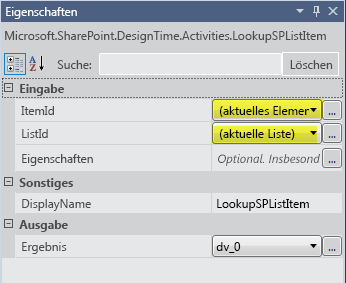
  

  

  
3. <span data-ttu-id="9c17f-p115">Klicken Sie auf der Kachel der **LookupSPListItem**-Aktivität auf den Link **Eigenschaften abrufen**. Dadurch werden zwei wichtige Schritte für Sie ausgeführt:</span><span class="sxs-lookup"><span data-stu-id="9c17f-p115">On the **LookupSPListItem** activity tile, click the **Get Properties** link. This completes two important steps for you:</span></span>
    
1. <span data-ttu-id="9c17f-p116">Erstens wird eine Variable vom Typ **DynamicValue** erstellt und an das Ausgabeargument (namens _Result_) der **LookupSPListItem**-Aktivität gebunden. In dieser Variablen werden die Eigenschaften des Listenelements gespeichert.</span><span class="sxs-lookup"><span data-stu-id="9c17f-p116">First, it creates a variable of type **DynamicValue** and binds it to the out-argument (named _Result_) of the of the **LookupSPListItem** activity. Properties of the list item are stored in this variable.</span></span>
    
  
2. <span data-ttu-id="9c17f-p117">Zweitens wird eine neue Aktivität namens **GetDynamicValueProperties** hinzugefügt (siehe Abbildung 12) und die neu erstellte Variable **DynamicValue** als Eingabeargument der neuen Aktivität festgelegt. Diese Aktivität ermöglicht das Extrahieren der Listenelementeigenschaften aus der **DynamicValue**-Variablen.</span><span class="sxs-lookup"><span data-stu-id="9c17f-p117">Second, it adds a new activity named **GetDynamicValueProperties** (see Figure 12) and sets the newly created **DynamicValue** variable as the in-argument of this new activity. This activity lets you extract the list item properties from the **DynamicValue** variable.</span></span>
    
  
4. <span data-ttu-id="9c17f-p118">Klicken Sie auf der **GetDynamicValueProperties**-Aktivität auf *Definieren…*, um ein Dialogfeld zur Auswahl der Eigenschaften zu öffnen, die Sie extrahieren möchten. Zur Auswahl von Eigenschaften finden Sie in Abbildung 12 einen Teil der Designeroberfläche, zusammen mit dem geöffneten Dialogfeld **Eigenschaften**.</span><span class="sxs-lookup"><span data-stu-id="9c17f-p118">On the **GetDynamicValueProperties** activity, click on *Define…*  to open a dialog box that lets you pick the properties you wish to extract. In selecting properties, refer to Figure 12, which shows a portion of the designer surface merged with the open **Properties** dialog box.</span></span>
    
   <span data-ttu-id="9c17f-215">**Abbildung 12. Auswählen der zu extrahierenden DynamicValue-Eigenschaften**</span><span class="sxs-lookup"><span data-stu-id="9c17f-215">**Figure 12. Selecting the DynamicValue properties that you wish to extract.**</span></span>

  

  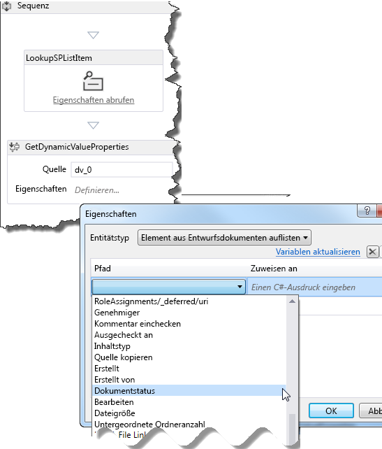
  

  

1. <span data-ttu-id="9c17f-217">Wählen Sie für **Entitätstyp** die Option **Listenelement von Entwurfsdokumenten** aus.</span><span class="sxs-lookup"><span data-stu-id="9c17f-217">For **Entity Type**, select **List Item of Draft Documents**.</span></span>
    
  
2. <span data-ttu-id="9c17f-218">Klicken Sie im Datenraster in der Spalte **Pfad** auf *Eigenschaft erstellen*, um ein Kombinationsfeld zu öffnen, das verfügbare Eigenschaften für Listenelemente in der Bibliothek „Entwurfsdokumente“ enthält.</span><span class="sxs-lookup"><span data-stu-id="9c17f-218">In the data grid, in the **Path** column, click *Create Property*  to open a combo box that contains available properties for list items in the Draft Documents library.</span></span> <span data-ttu-id="9c17f-219">Wählen Sie **Dokumentstatus** aus dem Kombinationsfeld aus.</span><span class="sxs-lookup"><span data-stu-id="9c17f-219">Select **Document Status** from the combo box.</span></span>
    
  
3. <span data-ttu-id="9c17f-220">Klicken Sie in der nächsten Zeile im Datenraster erneut auf *Eigenschaft erstellen*. Dieses Mal wählen Sie **Genehmigende Person** im Kombinationsfeld aus.</span><span class="sxs-lookup"><span data-stu-id="9c17f-220">On the next row in the data grid, click  *Create Property*  again; this time, select **Approver** from the combo box.</span></span>
    
  
4. <span data-ttu-id="9c17f-p120">Klicken Sie nun auf den Link **Variablen auffüllen** im Dialogfeld. Dies erstellt eine Variable vom entsprechenden Datentyp für jede Zeile und weist sie der **Zuweisen zu**-Spalte des Datenrasters zu, wie in Abbildung 13 dargestellt.</span><span class="sxs-lookup"><span data-stu-id="9c17f-p120">Now click the **Populate Variables** link on the dialog box. This creates a variable of the appropriate data type for each row and assigns it in the **Assign To** column of the data grid, as shown in Figure 13.</span></span>
    
   <span data-ttu-id="9c17f-223">**Abbildung 13. Abrufen der Eigenschaften "Dokumentstatus" und "Genehmigende Person"**</span><span class="sxs-lookup"><span data-stu-id="9c17f-223">**Figure 13. Get Document Status and Approver properties.**</span></span>

  

  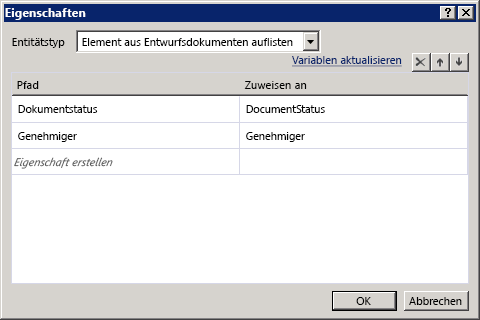
  

  

  
5. <span data-ttu-id="9c17f-p121">Wir haben nun die Listenelementwerte, die wir benötigen. Als Nächstes wird der Workflow dafür eingerichtet, zu überprüfen, ob das Dokument "Bereit zur Überprüfung" ist, und ggf. die entsprechenden Maßnahmen zu ergreifen.</span><span class="sxs-lookup"><span data-stu-id="9c17f-p121">We now have the list item values that we need. Next step is to set up the workflow to check whether the document is "ready for review" and to take the appropriate action when it is.</span></span>
    
1. <span data-ttu-id="9c17f-p122">Ziehen Sie die **If**-Aktivität aus der Toolbox auf die Oberfläche des Workflow-Designers. (Sie finden die **If**-Aktivität im Abschnitt **Ablaufsteuerung** der Toolbox.)</span><span class="sxs-lookup"><span data-stu-id="9c17f-p122">From the toolbox, drag the **If** activity onto the workflow designer surface. (You'll find the **If** activity in the **Control Flow** section of the toolbox.)</span></span>
    
  
2. <span data-ttu-id="9c17f-229">Legen Sie die **If**-Bedingung auf  `DocumentStatus.Equals("Ready for Review")` fest, wie in Abbildung 14 dargestellt.</span><span class="sxs-lookup"><span data-stu-id="9c17f-229">Set the **If** condition to `DocumentStatus.Equals("Ready for Review")`, as shown in Figure 14.</span></span>
    
   <span data-ttu-id="9c17f-230">**Abbildung 14. Erstellen einer WENN/DANN-Klausel zum Auslösen einer Aufgabe**</span><span class="sxs-lookup"><span data-stu-id="9c17f-230">**Figure 14. Creating an If/Then clause to trigger a task.**</span></span>

  

  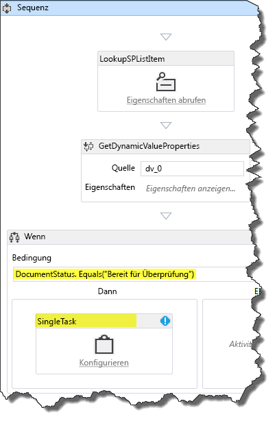
  

  

  
3. <span data-ttu-id="9c17f-p123">Als Nächstes ziehen Sie aus dem Abschnitt **SP - Aufgabe** der Toolbox eine **SingleTask**-Aktivität in das **Then**-Feld Ihrer **If**-Aktivität. Faktisch haben Sie den Workflow so konfiguriert, dass **If** das Dokument bereit zur Überprüfung ist, **Then** diese Aufgabe ausgeführt wird.</span><span class="sxs-lookup"><span data-stu-id="9c17f-p123">Next, from the **SP - Task** section of the toolbox, drag a **SingleTask** activity and drop it in the **Then** box of your **If** activity. In effect, you have configured the workflow such that **If** the document is ready for review, **Then** it will then complete this task.</span></span>
    
  
6. <span data-ttu-id="9c17f-234">Im nächsten Schritt wird die soeben erstellte Aufgabe mithilfe des Konfigurationsdialogfelds aus Abbildung 15 konfiguriert.</span><span class="sxs-lookup"><span data-stu-id="9c17f-234">Our next step is to configure the task that we just created using the configuration dialog box, shown in Figure 15.</span></span>
    
   <span data-ttu-id="9c17f-235">**Abbildung 15. Dialogfeld für die Aufgabenkonfiguration**</span><span class="sxs-lookup"><span data-stu-id="9c17f-235">**Figure 15. Task configuration dialog box.**</span></span>

  

  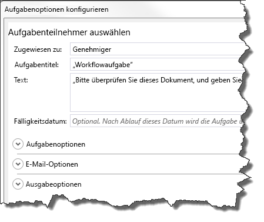
  

  

1. <span data-ttu-id="9c17f-p124">Zuerst weisen wir die Aufgabe einer genehmigenden Person zu. Klicken Sie hierzu auf den Link **Konfigurieren** in der **SingleTask**-Aktivitätskachel.</span><span class="sxs-lookup"><span data-stu-id="9c17f-p124">First, we assign the task to an approver. To do this, click the **Configure** link in the **SingleTask** activity tile.</span></span>
    
  
2. <span data-ttu-id="9c17f-239">Legen Sie das Feld **Zugewiesen zu:** auf „Genehmigende Person“ fest.</span><span class="sxs-lookup"><span data-stu-id="9c17f-239">Set the **Assigned to:** field to "Approver".</span></span>
    
  
3. <span data-ttu-id="9c17f-240">Beachten Sie, dass das Feld **Aufgabentitel:** automatisch mit „Workflowaufgabe“ ausgefüllt wird.</span><span class="sxs-lookup"><span data-stu-id="9c17f-240">Notice that the **Task title:** field is automatically populated with "Workflow task".</span></span>
    
  
4. <span data-ttu-id="9c17f-241">Geben Sie im Feld **Text:** eine einfache Nachricht mit Anweisungen für die genehmigende Person ein, wie z. B. "Bitte überprüfen Sie dieses Dokument, um seine Veröffentlichung zu genehmigen."</span><span class="sxs-lookup"><span data-stu-id="9c17f-241">In the **Body:** field, enter a simple message with instructions for the approver, such as "Please review this document for approval to publish."</span></span>
    
  
5. <span data-ttu-id="9c17f-242">Klicken Sie auf **OK**, um zu speichern.</span><span class="sxs-lookup"><span data-stu-id="9c17f-242">Click **OK** to save.</span></span>
    
  

    <span data-ttu-id="9c17f-p125">Beachten Sie, dass zu diesem Zeitpunkt ein Überprüfungsfehler für die **SingleTask**-Aktivität angezeigt wird. Sehen Sie, während die **SingleTask**-Kachel ausgewählt ist, die **AssignedTo**-Eigenschaft im Eigenschaftenraster an, und beachten Sie, dass sie ein Fehlersymbol aufweist. Zeigen Sie auf den Eigenschaftennamen, um eine QuickInfo anzuzeigen, die das Problem beschreibt. Wir sehen, dass die **AssignedTo**-Eigenschaft einen **String**-Wert erwartet, die Variable **Approver** jedoch vom Datentyp **Int32** ist.</span><span class="sxs-lookup"><span data-stu-id="9c17f-p125">Notice that at this point you have a validation error on the **SingleTask** activity. With the **SingleTask** tile selected, look at the **AssignedTo** property in the property grid and note that it has an error icon. Hover over the property name to see a tooltip that describes the problem. We see that the **AssignedTo** property expects a **String** value; however, the **Approver** variable is of **Int32** data type.</span></span>
    
    <span data-ttu-id="9c17f-247">Um diesen Fehler zu beheben, wandeln Sie die Variable in den Datentyp **String** um, indem Sie in der **AssignedTo**-Zeile des Eigenschaftenrasters ".ToString()" an "Approver" anfügen, wie in Abbildung 16 dargestellt.</span><span class="sxs-lookup"><span data-stu-id="9c17f-247">To correct this error, cast the variable to a **String** data type by appending ".ToString()" to "Approver" in the **AssignedTo** row on the property grid, as shown in Figure 16.</span></span>
    

   <span data-ttu-id="9c17f-248">**Abbildung 16. Umwandeln der Variablen "Approver" in den Datentyp "String" im Eigenschaftenraster**</span><span class="sxs-lookup"><span data-stu-id="9c17f-248">**Figure 16. Casting the "Approver" variable to string data type in the property grid.**</span></span>

  

  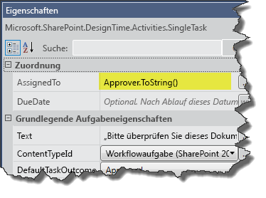
  

    <span data-ttu-id="9c17f-250">Zum gegenwärtigen Zeitpunkt in dieser exemplarischen Vorgehensweise haben Sie eine Workflowaufgabe erstellt und konfiguriert, die zwei Dinge umfasst: es wird ein zu überprüfendes Dokument festgelegt und eine E-Mail an den mit der Aufgabe Beauftragten (in diesem Fall "Genehmigende Person") gesendet, dass eine Aufgabe zugewiesen wurde und Aktionen erwartet werden.</span><span class="sxs-lookup"><span data-stu-id="9c17f-250">At the present point in this walkthrough you have created and configured a workflow task that does two things: It sets a document to be reviewed, but also sends an email to the task assignee (the "Approver" in this case) notifying him or her that a task has been assigned and is waiting for actions.</span></span>
    
  
7. <span data-ttu-id="9c17f-p126">Sehen wir uns das Eigenschaftenraster für die **SingleTask**-Aktivität an. Führen Sie einen Bildlauf zum Ende des Eigenschaftenrasters durch, und beachten Sie, dass der Abschnitt **Ausgabe** zwei Eigenschaften **Outcome** und **TaskItemId** enthält, die Ausgabeargumente sind.</span><span class="sxs-lookup"><span data-stu-id="9c17f-p126">Let's look at the property grid for the **SingleTask** activity. Scroll to the bottom of the property grid and note in the **Output** section there are two properties, **Outcome** and **TaskItemId**, which are out-arguments.</span></span>
    
    <span data-ttu-id="9c17f-p127">Notieren Sie den Namen der **Outcome**-Variablen:  _outcome_0_ (oder ähnlich). Wir verwenden diese Variable, um das Ergebnis des Vorgangs zu überprüfen - d. h., ob die genehmigende Person das Dokument genehmigt oder abgelehnt hat.</span><span class="sxs-lookup"><span data-stu-id="9c17f-p127">Note the name of the **Outcome** variable: _outcome_0_ (or similar). We use this variable to check the outcome of the task - that is, whether the approver has approved or rejected the document.</span></span>
    
    > [!NOTE]
    > <span data-ttu-id="9c17f-255">Das **Outcome**-Argument gibt einen **Int32**-Wert entsprechend dem Index des Ergebnisses zurück, d. h. **0** für „Genehmigt“ und **1** für „Abgelehnt“.</span><span class="sxs-lookup"><span data-stu-id="9c17f-255">Note: The **Outcome** out-argument returns an **Int32** value corresponding to the index of the outcome - that is, **0** for "Approved" and **1** for "Rejected".</span></span> <span data-ttu-id="9c17f-256">Diese ganze Zahlen sind die Standardwerte, die in der Out-Of-Box-SharePoint-Websitespalte mit dem Namen „Ergebnis der Aufgabe“ bereitgestellt werden.</span><span class="sxs-lookup"><span data-stu-id="9c17f-256">These integers are the default values provided in the out-of-box SharePoint site column named "Task Outcome."</span></span>
8. <span data-ttu-id="9c17f-p129">Damit der Workflow das Ergebnis des Vorgangs überprüft, müssen wir nun eine weitere **If**-Aktivität hinzufügen. Sie wird hinter der **SingleTask**-Aktivität, aber innerhalb des **Then**-Bereichs platziert, wie in Abbildung 17 dargestellt. Durch Festlegen der **If**-Bedingung auf " `outcome_0 == 0`" wird mitgeteilt, ob das Dokument genehmigt wurde.</span><span class="sxs-lookup"><span data-stu-id="9c17f-p129">Now, in order for the workflow to check the outcome of the task, we need to add another **If** activity and place it following the **SingleTask** activity, but inside the **Then** area, as shown in Figure 17. Setting the **If** condition to " `outcome_0 == 0`" tells us whether the document was approved.</span></span>
    
   <span data-ttu-id="9c17f-259">**Abbildung 17. Hinzufügen der IF-Aktivität zum Überprüfen des Aufgabenstatus**</span><span class="sxs-lookup"><span data-stu-id="9c17f-259">**Figure 17. Adding the IF activity to check the task status.**</span></span>

  

  
  

  

  
9. <span data-ttu-id="9c17f-p130">Wenn die genehmigende Person die Aufgabe auf "Genehmigt" festgelegt hat, aktualisieren wir den Dokumentstatus auf "Genehmigt zur Veröffentlichung" und kopieren die Dokumentdatei in die Bibliothek Veröffentlichte Dokumente. Wenn die genehmigende Person das Dokument dagegen abgelehnt hat, müssen wir den Dokumentstatus auf "Abgelehnt" festlegen.</span><span class="sxs-lookup"><span data-stu-id="9c17f-p130">If the approver has set the task to "Approved," we update the document status to "Approved for Publishing," then copy the document file to the Published Documents library. Alternatively, if the approver has rejected the document, we need to set the document status to "Rejected."</span></span>
    
1. <span data-ttu-id="9c17f-263">Ziehen Sie in dieser neuen **If**-Aktivität eine **UpdateListItem**-Aktivität in das **Then**-Feld.</span><span class="sxs-lookup"><span data-stu-id="9c17f-263">In this new **If** activity, drag an **UpdateListItem** activity into the **Then** box.</span></span>
    
  
2. <span data-ttu-id="9c17f-264">Konfigurieren Sie die **UpdateListItem**-Aktivität im zugehörigen Eigenschaftenraster so, dass **ItemId** auf "(Aktuelles Element)" und **ListId** auf "(Aktuelle Liste)" festgelegt wird, wie in Abbildung 18 dargestellt.</span><span class="sxs-lookup"><span data-stu-id="9c17f-264">Configure the **UpdateListItem** activity in its property grid such that **ItemId** is set to "(current item)" and **ListId** is set to "(current list)", as shown in Figure 18.</span></span>
    
  
3. <span data-ttu-id="9c17f-p131">Anschließend klicken Sie, während die **UpdateListItem**-Aktivität ausgewählt ist, auf die Schaltfläche mit den Auslassungszeichen ( **…**) neben dem **ListItemPropertiesDynamicValue**-Feld im Eigenschaftenraster. Dadurch wird ein Dialogfeld geöffnet, in dem Sie die Listenelementeigenschaften angeben können, die Sie aktualisieren möchten.</span><span class="sxs-lookup"><span data-stu-id="9c17f-p131">Next, with the **UpdateListItem** activity selected, click the ellipsis button ( **…**) adjacent to the **ListItemPropertiesDynamicValue** field in the property grid. This action opens a dialog box that allows you to specify which list item properties you want to update.</span></span>
    
   <span data-ttu-id="9c17f-267">**Abbildung 18. Festlegen der zu aktualisierenden Listenelementeigenschaften**</span><span class="sxs-lookup"><span data-stu-id="9c17f-267">**Figure 18. Setting the list item properties to update.**</span></span>

  

  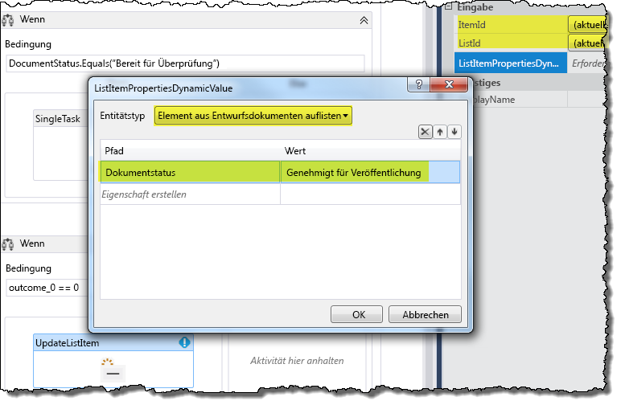
  

  

  
4. <span data-ttu-id="9c17f-269">Verwenden Sie im Dialogfeld zuerst das Kombinationsfeld, um **Entitätstyp** auf **Listenelement von Entwurfsdokumenten** (siehe Abbildung 18) festzulegen.</span><span class="sxs-lookup"><span data-stu-id="9c17f-269">In the dialog box, first use the combo box to set **Entity Type** to **List Item of Draft Documents** (shown in Figure 18).</span></span> <span data-ttu-id="9c17f-270">Klicken Sie dann im Datenraster auf **Eigenschaft erstellen**, und wählen Sie aus der Dropdownliste „Dokumentstatus“ aus.</span><span class="sxs-lookup"><span data-stu-id="9c17f-270">Then, in the data grid, click **Create Property** and from the drop-down list select "Document Status."</span></span> <span data-ttu-id="9c17f-271">Geben Sie dann in der Spalte **Wert** Spalte „Genehmigt zur Veröffentlichung“ (einschließlich der Anführungszeichen) ein, und klicken Sie auf **OK**.</span><span class="sxs-lookup"><span data-stu-id="9c17f-271">Then, under the **Value** column, type "Approved for Publication" (including quotation marks) and click **OK**.</span></span>
    
  
10. <span data-ttu-id="9c17f-272">Ziehen Sie aus dem **Then**-Bereich der aktuellen **If**-Aktivität eine **CopyItem**-Aktivität direkt unter die **UpdateListItem**-Aktivität, wie in Abbildung 19 dargestellt.</span><span class="sxs-lookup"><span data-stu-id="9c17f-272">In the **Then** area of the current **If** activity, drag a **CopyItem** activity and place it directly below the **UpdateListItem** activity, as shown in Figure 19.</span></span>
    
   <span data-ttu-id="9c17f-273">**Abbildung 19. Hinzufügen einer "CopyItem"-Aktivität zum Workflow**</span><span class="sxs-lookup"><span data-stu-id="9c17f-273">**Figure 19. Adding a CopyItem activity to the workflow.**</span></span>

  

  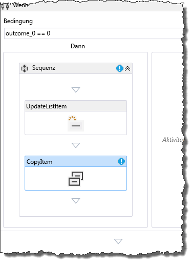
  

    <span data-ttu-id="9c17f-p133">Konfigurieren Sie dann die Eigenschaften der **CopyItem**-Aktivität im Eigenschaftenraster, wie in Abbildung 20 dargestellt. Eigenschaftswerte sind hervorgehoben.</span><span class="sxs-lookup"><span data-stu-id="9c17f-p133">Then, configure properties of the **CopyItem** activity in the property grid as depicted in Figure 20. Property values are highlighted.</span></span>
    

   <span data-ttu-id="9c17f-277">**Abbildung 20. Konfigurieren der "CopyItem"-Aktivität**</span><span class="sxs-lookup"><span data-stu-id="9c17f-277">**Figure 20. Configuring the CopyItem activity.**</span></span>

  

  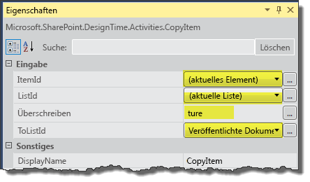
  

    
    > [!NOTE]
    > <span data-ttu-id="9c17f-279">Für diese exemplarische Vorgehensweise werden wir davon ausgehen, dass alle unsere veröffentlichten Dokumente aus der Bibliothek Entwurfsdokumente stammen. Daher müssen wir uns nicht um doppelte Dateinamen kümmern.</span><span class="sxs-lookup"><span data-stu-id="9c17f-279">For the purpose of this walkthrough we are going to assume that all of our published documents come out of the Draft Documents library; therefore, we do not need to worry about controlling for duplicate file names.</span></span> 
11. <span data-ttu-id="9c17f-p134">Schließlich müssen wir eine Aktivität hinzufügen, um den Fall zu behandeln, dass der Prüfer das Dokument ablehnt. Dazu fügen wir eine **UpdateListItem**-Aktivität im **Else**-Bereich der aktuellen **If**-Aktivität hinzu. Konfigurieren Sie diese **UpdateListItem**-Aktivität genau so wie die vorherige in Schritt 9(c), allerdings legen wir den Dokumentstatus jetzt auf "Abgelehnt" fest, wie in Abbildung 21 dargestellt.</span><span class="sxs-lookup"><span data-stu-id="9c17f-p134">Finally, we need to add an activity to handle the case where the reviewer rejects the document. We do this by adding an **UpdateListItem** activity to the **Else** area of our current **If** activity. Configure this **UpdateListItem** activity just as you did the prior one in step 9(c), except that now we want to set the document status to "Rejected," as shown in Figure 21.</span></span>
    
   <span data-ttu-id="9c17f-283">**Abbildung 21. Konfigurieren von Eigenschaften der "UpdateListItem"-Aktivität für abgelehnte Dokumente**</span><span class="sxs-lookup"><span data-stu-id="9c17f-283">**Figure 21. Configuring properties of UpdateListItem activity for rejected documents.**</span></span>

  

  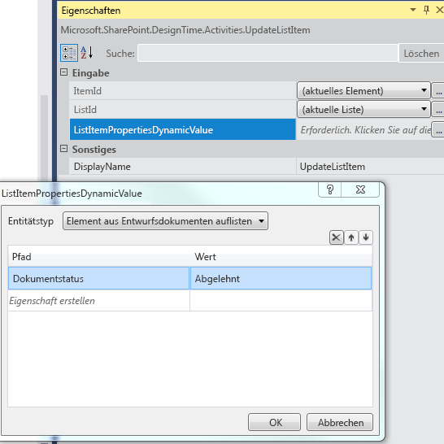
  

  

  
<span data-ttu-id="9c17f-p135">Damit ist das Erstellen eines SharePoint-Dokumentgenehmigungs-Workflows abgeschlossen. Der vollständige Workflow ist in Abbildung 22 dargestellt.</span><span class="sxs-lookup"><span data-stu-id="9c17f-p135">This completes "Creating a SharePoint document approval workflow." The completed workflow is shown in Figure 22.</span></span>
  
    
    

<span data-ttu-id="9c17f-287">**Abbildung 22. Abgeschlossener SharePoint-Dokumentgenehmigungs-Workflow**</span><span class="sxs-lookup"><span data-stu-id="9c17f-287">**Figure 22. Completed SharePoint document approval workflow.**</span></span>

  
    
    

  
    
    
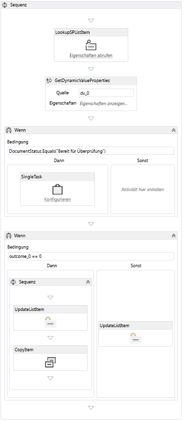
  
    
    

  
    
    

  
    
    

## <a name="package-and-deploy-the-workflow"></a><span data-ttu-id="9c17f-289">Packen und Bereitstellen des Workflows</span><span class="sxs-lookup"><span data-stu-id="9c17f-289">Package and deploy the workflow</span></span>
<span data-ttu-id="9c17f-290"><a name="bk_deploy"> </a></span><span class="sxs-lookup"><span data-stu-id="9c17f-290"><a name="bk_deploy"> </a></span></span>

<span data-ttu-id="9c17f-291">Die folgenden Ressourcen bieten Hilfestellung für das Packen und Bereitstellen Ihres Workflows als SharePoint-Add-In:</span><span class="sxs-lookup"><span data-stu-id="9c17f-291">Following are resources that provide guidance for packaging and deploying your workflow as an SharePoint Add-in:</span></span>
  
    
    

-  [<span data-ttu-id="9c17f-292">Bereitstellen und Installieren von Apps für SharePoint: Methoden und Optionen</span><span class="sxs-lookup"><span data-stu-id="9c17f-292">Deploying and installing apps for SharePoint: methods and options</span></span>](http://msdn.microsoft.com/de-DE/library/fp179933.aspx)
    
  
-  [<span data-ttu-id="9c17f-293">Veröffentlichen von Apps für SharePoint</span><span class="sxs-lookup"><span data-stu-id="9c17f-293">Publish apps for SharePoint</span></span>](http://msdn.microsoft.com/de-DE/library/jj164070.aspx)
    
  
-  <span data-ttu-id="9c17f-294">[Vorgehensweise: Erstellen und Bereitstellen deklarativer Workflows in Sandkastenlösungen (mithilfe von SharePoint Designer 2013](http://msdn.microsoft.com/de-DE/library/gg615452%28v=office.14%29.aspx)</span><span class="sxs-lookup"><span data-stu-id="9c17f-294">[How to: Create and Deploy Declarative Workflows in Sandboxed Solutions](http://msdn.microsoft.com/de-DE/library/gg615452%28v=office.14%29.aspx) (Using SharePoint Designer 2013)</span></span>
    
  

> <span data-ttu-id="9c17f-295">**Achtung:** SharePoint-Add-Ins mit integrierten Workflows (die Listen im übergeordneten Web zugeordnet sein können) werden von normalen Workflow-Apps unterschieden, indem das folgende Tag in der Datei `workflowmanifest.xml` im App-Paket in **true** geändert wird:</span><span class="sxs-lookup"><span data-stu-id="9c17f-295">**Caution:** SharePoint Add-ins that contain integrated workflows (which can be associated with lists on the parent web) are differentiated from normal workflow apps by changing the following tag to **true** in the `workflowmanifest.xml` file in the app package:</span></span>
  
    
    


```XML

<SPIntegratedWorkflow xmlns="http://schemas.microsoft.com/sharepoint/2014/app/integratedworkflow">
    <IntegratedApp>true</IntegratedApp>
</SPIntegratedWorkflow>

```


## <a name="see-also"></a><span data-ttu-id="9c17f-296">Siehe auch</span><span class="sxs-lookup"><span data-stu-id="9c17f-296">See also</span></span>
<span data-ttu-id="9c17f-297"><a name="bk_addresources"> </a></span><span class="sxs-lookup"><span data-stu-id="9c17f-297"><a name="bk_addresources"> </a></span></span>


-  [<span data-ttu-id="9c17f-298">Workflows in SharePoint</span><span class="sxs-lookup"><span data-stu-id="9c17f-298">Workflows in SharePoint</span></span>](workflows-in-sharepoint.md)
    
  
-  [<span data-ttu-id="9c17f-299">Vorbereiten auf das Einrichten und Konfigurieren einer SharePoint-Workflowentwicklungsumgebung</span><span class="sxs-lookup"><span data-stu-id="9c17f-299">Prepare to set up and configure a SharePoint workflow development environment</span></span>](prepare-to-set-up-and-configure-a-sharepoint-workflow-development-environment.md)
    
  
-  [<span data-ttu-id="9c17f-300">Bewährte Methoden für die SharePoint-Workflowentwicklung</span><span class="sxs-lookup"><span data-stu-id="9c17f-300">SharePoint workflow development best practices</span></span>](sharepoint-workflow-development-best-practices.md)
    
  
-  [<span data-ttu-id="9c17f-301">Entwickeln von SharePoint-Workflows mit Visual Studio</span><span class="sxs-lookup"><span data-stu-id="9c17f-301">Develop SharePoint workflows using Visual Studio</span></span>](develop-sharepoint-workflows-using-visual-studio.md)
    
  

  
    
    

