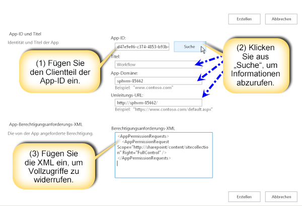
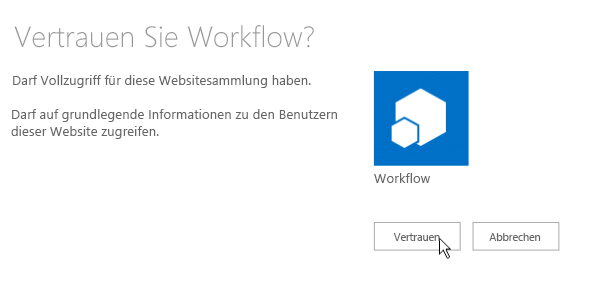
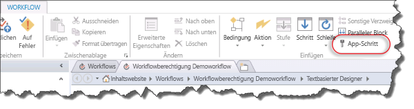
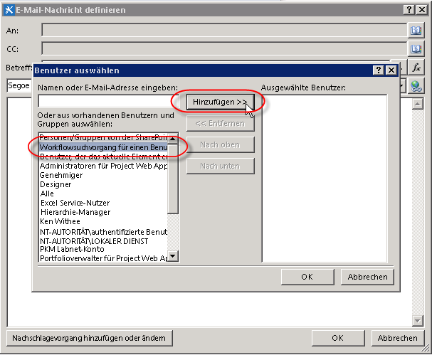
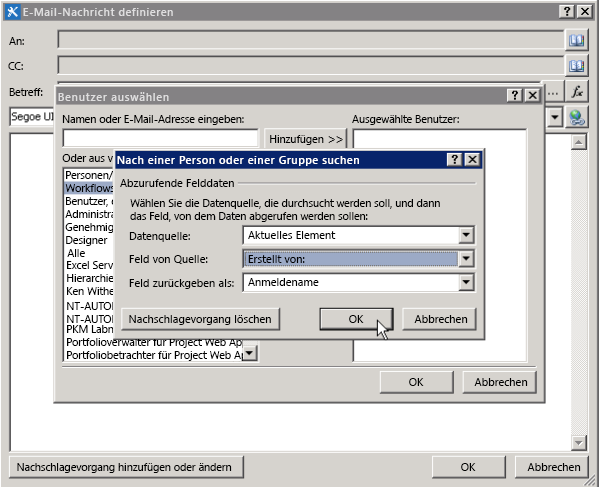

# <a name="create-a-workflow-with-elevated-permissions-by-using-the-sharepoint-workflow-platform"></a>Erstellen eines Workflows mit erweiterten Berechtigungen mithilfe der SharePoint-Workflow-Plattform
Erfahren Sie, wie Sie einen Workflow mit erweiterten Berechtigungen mithilfe der SharePoint-Workflow-Plattform erstellen.
## <a name="sharepoint-app-catalog-and-workflow"></a>SharePoint-App-Katalog und Workflow
<a name="section1"> </a>

Dieser Artikel beschreibt, wie Sie SharePoint-Workflows erstellen, die auf Objekte in SharePoint zugreifen, die erweiterte Berechtigungen erfordern. Diese Lösungen verwenden zwei Features: Erteilen von Berechtigungen für die Workflow-App und Umhüllen der Aktionen mit dem App-Schritt.
  
    
    

> **Wichtig:** In diesem Artikel wird davon ausgegangen, dass die SharePoint-Workflow-Plattform installiert und konfiguriert wurde und dass SharePoint für Apps konfiguriert wurde. Weitere Informationen zu SharePoint-Workflow und Apps für SharePoint, einschließlich Installation und Konfiguration, finden Sie unter [Workflow in SharePoint](http://technet.microsoft.com/sharepoint/jj556245.aspx) und [Installieren und Verwalten von Apps für SharePoint](http://msdn.microsoft.com/library/733647a3-a5d3-475b-967d-3bb627c2a0c2.aspx). 
  
    
    


### <a name="overview-of-creating-a-workflow-with-elevated-permissions"></a>Übersicht über das Erstellen eines Workflows mit erweiterten Berechtigungen

Stellen Sie sich vor, Sie möchten als SharePoint-Administrator einige Prozesse für die Verwaltung von Benutzeranforderungen für den Erwerb von Apps aus dem Office Store definieren. Im einfachsten Fall möchten Sie eine E-Mail zur Bestätigung senden, wenn ein Benutzer eine App anfordert. Darüber hinaus möchten Sie dem Anforderungsgenehmigungsprozess möglicherweise auch eine Struktur hinzufügen.
  
    
    
Standardmäßig verfügt der Workflow nicht über die Berechtigungen für den Zugriff auf den App-Anforderungskatalog. Die Kataloglisten in SharePoint erfordern Besitzerberechtigungen (Vollzugriff). Workflows werden im Allgemeinen auf einer Berechtigungsstufe ausgeführt, die der Schreibberechtigung gleicht. 
  
    
    
Um dies zu beheben, müssen Sie einen Workflow mit erweiterten Berechtigungen erstellen, indem Sie auf der Websitesammlungs-Website folgendermaßen vorgehen:
  
    
    

1. Gestatten Sie dem Workflow die Verwendung von App-Berechtigungen.
    
  
2. Erteilen Sie dem Workflow die Berechtigung für den Vollzugriff.
    
  
3. Entwickeln Sie den Workflow entsprechend, dass Aktionen innerhalb eines App-Schritts umhüllt werden.
    
  

### <a name="allowing-a-workflow-to-use-app-permissions-in-a-sharepoint-site"></a>Zulassen der Verwendung von App-Berechtigungen auf einer SharePoint-Website für Workflows

Der erste Schritt besteht darin, die Verwendung von App-Berechtigungen in Workflows zuzulassen. Sie konfigurieren Workflows zum Verwenden von App-Berechtigungen auf der Seite **Websiteeinstellungen** der SharePoint-Website, auf der der Workflow ausgeführt wird. Mit dem folgenden Verfahren wird die SharePoint-Website zum Verwenden von App-Berechtigungen in Workflows konfiguriert.
  
    
    

> **Wichtig:** Das Verfahren muss von einem Benutzer abgeschlossen werden, der über die **Websitebesitzer**-Berechtigungen verfügt.
  
    
    


### <a name="to-allow-workflow-to-use-app-permissions"></a>So gestatten Sie dem Workflow die Verwendung von App-Berechtigungen


1. Klicken Sie auf das Symbol **Einstellungen**, wie in der Abbildung gezeigt.
    
   **Abbildung: Öffnen der Seite "Websiteeinstellungen"**

  

  
  

  

  
2. Wechseln Sie zu **Websiteeinstellungen**.
    
  
3. Wählen Sie im Abschnitt **Websiteaktionen** die Option **Websitefeatures verwalten** aus.
    
  
4. Suchen Sie das Feature **Workflows dürfen App-Berechtigungen verwenden**, wie in der Abbildung gezeigt, und klicken Sie dann auf **Aktivieren**.
    
    > **Vorsicht:** Dieses Feature wird nicht aktiviert, sofern Sie die SharePoint-Workflow-Plattform und auch die Apps für SharePoint nicht ordnungsgemäß konfiguriert haben. 

   **Abbildung: Das Websitefeature "Workflows dürfen App-Berechtigungen verwenden"**

  

  
  

  

  

### <a name="granting-full-control-permission-to-a-workflow"></a>Erteilen der Berechtigung "Vollzugriff" für einen Workflow

Damit der Workflow ordnungsgemäß funktionieren kann, muss diesem die Berechtigung "Vollzugriff" auf der Website gewährt werden. Im folgenden Verfahren wird dem Workflow die Berechtigung "Vollzugriff" erteilt.
  
    
    

> **Wichtig:** Für das Verfahren wird Folgendes vorausgesetzt:> Das Verfahren muss von einem Benutzer abgeschlossen werden, der über die **Websitebesitzer**-Berechtigungen verfügt.> Der Workflow muss bereits auf der SharePoint-Website veröffentlicht worden sein.
  
    
    


### <a name="to-grant-full-control-permission-to-a-workflow"></a>So erteilen Sie einem Workflow die Berechtigung "Vollzugriff"


1. Klicken Sie auf das Symbol **Einstellungen**, wie in der Abbildung gezeigt.
    
   **Abbildung: Öffnen der Seite "Websiteeinstellungen"**

  

  
  

  

  
2. Wechseln Sie zu **Websiteeinstellungen**.
    
  
3. Wählen Sie im Abschnitt **Benutzer und Berechtigungen** die Option **Website-App-Berechtigungen** aus.
    
  
4. Kopieren Sie den Abschnitt **Client** der **App-ID**. Dies ist die ID zwischen dem letzten "|" und dem Zeichen "@", wie in der Abbildung gezeigt.
    
   **Abbildung: Auswählen der App-ID**

  

  
  

  

  
5. Navigieren Sie zur Seite **Einer App Berechtigungen erteilen**. Dazu müssen Sie zur Seite "appinv.aspx" der Website navigieren.
    
    Beispiel: http://{hostname}/{Websitesammlung}/_layouts/15/appinv.aspx. 
    
    > **Hinweis:** "App" bezieht sich in diesem Schritt auf die Workflow-App im Allgemeinen und nicht auf einen bestimmten Workflow. Der Zugriff auf einzelne Workflows kann nicht gesteuert werden. Wenn Sie App-Berechtigungen aktivieren, sind sie für alle Workflows in der Websitesammlung aktiviert. 

    Weitere Informationen zum Einrichten eines Workflows finden Sie unter  [Blogartikel von Sympraxis Consulting: Durchlaufen von Inhalten in einem Website-Workflow in SharePoint](http://sympmarc.com/2016/01/14/looping-through-content-in-a-sharepoint-site-workflow-part-1-introduction)
    
    Die folgende Abbildung zeigt ein Beispiel.
    

 **Abbildung: Beispiel für Seite "appinv.aspx" und URL**

  

  
  

  
6. Fügen Sie die Client-ID in das Feld **App-ID** ein, und klicken Sie dann auf **Nachschlagen**, wie in der Abbildung gezeigt.
    
  
7. Fügen Sie den folgenden XML-Code für **Berechtigungsanforderungen** ein, um die Berechtigung "Vollzugriff" zu erteilen.
    
``` xml 
<AppPermissionRequests>
    <AppPermissionRequest Scope="http://sharepoint/content/sitecollection/web" Right="FullControl" />
</AppPermissionRequests>

```


> **Vorsicht:** Der obige **Scope**-Wert enthält keine Platzhalter. Es ist ein Literalwert. Geben Sie ihn genau so ein, wie er hier dargestellt wird.

  Die folgende Abbildung zeigt ein Beispiel für die fertige Seite.
    

  **Abbildung: Nachschlagen eine App-ID**

  

  


8. Klicken Sie auf **Erstellen**.
    
  
9. Sie werden dann aufgefordert, der Workflow-App zu vertrauen, wie in der Abbildung gezeigt. Klicken Sie auf **Vertrauen**.
    
  **Abbildung: Der Workflow-App vertrauen**

  
  
### <a name="wrapping-actions-inside-an-app-step"></a>Umhüllen von Aktionen in App-Schritten

Abschließend müssen Sie die Workflowaktionen in einem App-Schritt umhüllen. Das folgende Verfahren umhüllt die Aktion **E-Mail senden** innerhalb eines App-Schritts. Der Workflow in diesem Beispiel sendet eine Bestätigungs-E-Mail aus einer benutzerdefinierten Liste.
  
    
    

### <a name="to-wrap-actions-inside-an-app-step"></a>So umhüllen Sie Aktionen innerhalb von App-Schritten


1. Öffnen Sie die App-Katalogwebsite in SharePoint Designer 2013 an.
    
  
2. Erstellen Sie eine neue benutzerdefinierte Liste für die Ausführung des Workflows. In diesem Beispiel wird der Listenname **App Demo** verwendet.
    
  
3. Klicken Sie im Navigationsfenster auf **Workflows**.
    
  
4. Erstellen Sie einen neuen Listenworkflow für die App Demo-Liste, wie in der Abbildung gezeigt.
    
  **Abbildung: Erstellen eines neuen Listenworkflows**

  

  
  

  

  
5. Fügen Sie einen **App-Schritt** hinzu, wie in der Abbildung gezeigt.
    
  **Abbildung: Hinzufügen eines App-Schritts**

  

  
  

  

  
6. Fügen Sie die Aktion **E-Mail senden** im **App-Schritt** ein.
    
  
7. Klicken Sie auf die Schaltfläche **Adressbuch**. Wählen Sie im Feld **An** die Option **Workflow-Nachschlagevorgang für einen Benutzer** aus, und klicken Sie dann auf **Hinzufügen**, wie in der Abbildung gezeigt.
    
  **Abbildung: Auswählen von "Workflow-Nachschlagevorgang für einen Benutzer"**

  
  

8. Geben Sie das Feld **Erstellt von** als Suchwert ein, wie in der Abbildung gezeigt.
    
  **Abbildung: Dialogfeld zum Suchen von Personen**

  
  
9. Geben Sie E-Mail von App Demo-Liste in den Nachrichtentext der E-Mail ein.
    
  
10. Klicken Sie auf **OK**, um zum Workflow zurückzukehren. Der fertige Workflow wird in der Abbildung veranschaulicht.
    
  **Abbildung: E-Mail-Aktion in App-Schritt**

  
    
11. Klicken Sie auf dem Menüband auf das Symbol **Workfloweinstellungen**, wie in der Abbildung gezeigt.
    
  **Abbildung: Symbol "Workfloweinstellungen" auf dem Menüband**

  

  
  

  

  
12. Deaktivieren Sie das Kontrollkästchen neben **Workflowstatus automatisch auf dem aktuellen Phasennamen aktualisieren**, und klicken Sie dann auf **Veröffentlichen**, wie in der Abbildung gezeigt.
    
  **Abbildung: Deaktivieren der automatischen Aktualisierung und anschließende Veröffentlichung**

  

  
  


## <a name="understanding-how-it-works"></a>Erläuterung der Funktionsweise
<a name="section2"> </a>

Um zu verstehen, warum das Erhöhen von Berechtigungen für einen Workflow erforderlich ist, berücksichtigen Sie, dass Workflows im Grunde Apps für SharePoint sind, die den gleichen Autorisierungsregeln des App-Modells folgen. Die Standardkonfiguration für den Workflow ist, dass die effektiven Berechtigungen des Workflows eine Schnittmenge von Benutzerberechtigungen und App-Berechtigungen sind, wie in der Abbildung gezeigt.
  
    
**Abbildung: Berechtigungsdiagramm**

  
    
    

  
    
    

  
    
    
Es gibt zwei Gründe, warum es erforderlich ist, die Berechtigungen zum Erstellen eines Workflows in der Liste der App-Anforderungen zu erhöhen. Dies sind:
  
    
    

- Standardmäßig verfügt der Workflow nur über die Schreibberechtigung.
    
  
- Der Benutzer verfügt über keine Berechtigungen.
    
  
Der erste Schritt zur Lösung dieses Problems besteht darin, der Anwendung die Autorisierung zu gestatten, indem nur ihre Identität verwendet und die Identität des Benutzers ignoriert wird. Dies erfolgt durch das Aktivieren des App-Schritt-Features. Im zweite Schritt wird dem Workflow der Vollzugriff gewährt. 
  
    
    
Das folgende Diagramm veranschaulicht die Änderung der Berechtigungen.
  
    
    

**Abbildung: Berechtigungsmatrix**

  
    
    

  
    
    

  
    
    

  
    
    

  
    
    

## <a name="additional-resources"></a>Zusätzliche Ressourcen
<a name="section3"> </a>


-  [Workflow in SharePoint ](http://technet.microsoft.com/en-us/sharepoint/jj556245.aspx)
    
  
-  [Installieren und Verwalten von Apps für SharePoint](http://msdn.microsoft.com/library/733647a3-a5d3-475b-967d-3bb627c2a0c2.aspx)
    
  
-  [Neuigkeiten im Workflow in SharePoint](http://msdn.microsoft.com/library/6ab8a28b-fa2f-4530-8b55-a7f663bf15ea.aspx)
    
  
-  [Erste Schritte mit SharePoint-Workflow](http://msdn.microsoft.com/library/cc73be76-a329-449f-90ab-86822b1c2ee8.aspx)
    
  
-  [Workflowentwicklung in SharePoint Designer und Visio](workflow-development-in-sharepoint-designer-and-visio.md)
    
  
-  [Kurzübersicht zu Workflowaktionen (SharePoint-Workflowplattform)](workflow-actions-quick-reference-sharepoint-workflow-platform.md)
    
  
-  [Blogartikel des SharePoint Designer-Teams: Verpackungs- und Bereitstellungsszenario für Workflows](http://blogs.msdn.com/b/sharepointdesigner/archive/2012/08/30/packaging-list-site-and-reusable-workflow-and-how-to-deploy-the-package.aspx)
    
  
-  [Blogartikel von Sympraxis Consulting: Durchlaufen von Inhalten in einem Website-Workflow in SharePoint](http://sympmarc.com/2016/01/14/looping-through-content-in-a-sharepoint-site-workflow-part-1-introduction)
    
  

