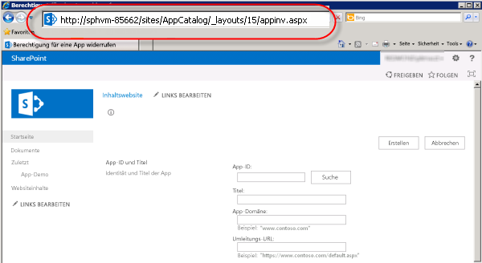
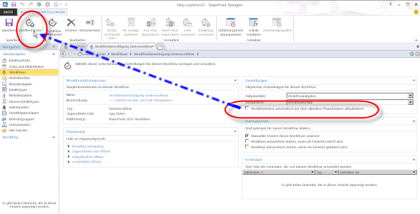

# <a name="create-a-workflow-with-elevated-permissions-by-using-the-sharepoint-workflow-platform"></a>Erstellen eines Workflows mit erweiterten Berechtigungen mithilfe der SharePoint-Workflow-Plattform

<a name="section1"> </a>

Dieser Artikel beschreibt, wie Sie SharePoint-Workflows erstellen, die auf Objekte in SharePoint zugreifen, die erweiterte Berechtigungen erfordern. Diese Lösungen verwenden zwei Features: Erteilen von Berechtigungen für die Workflow-App und Umhüllen der Aktionen mit dem App-Schritt.
  
> [!IMPORTANT] 
> In diesem Artikel wird davon ausgegangen, dass die SharePoint-Workflow-Plattform installiert und konfiguriert sowie SharePoint für Add-Ins konfiguriert wurde. Weitere Informationen zu SharePoint-Workflow und Add-Ins für SharePoint, einschließlich Installation und Konfiguration, finden Sie unter  [Workflow in SharePoint](workflows-in-sharepoint.md) und [Installieren und Verwalten von Apps für SharePoint](../sp-add-ins/sharepoint-add-ins.md). 

Angenommen Sie als SharePoint-Administrator möchten einige Prozesse zum Verwalten von Benutzeranforderungen zum Erwerb von Add-Ins aus dem Office Store definieren. Im einfachsten Fall möchten Sie eine Bestätigungs-E-Mail senden, wenn ein Benutzer ein Add-In anfordert. Außerdem möchten Sie dem Anforderungsgenehmigungsprozess vielleicht eine Struktur hinzufügen.
  
Standardmäßig verfügt der Workflow nicht über die Berechtigung zum Zugreifen auf den App-Katalog. Für Kataloglisten in SharePoint sind Besitzerberechtigungen (Vollzugriff) erforderlich. Workflows werden im Allgemeinen auf einer Berechtigungsstufe ausgeführt, die einer Schreibberechtigung entspricht. 
  
Um dies zu beheben, müssen Sie einen Workflow mit erweiterten Berechtigungen erstellen, indem Sie auf der Websitesammlungs-Website folgendermaßen vorgehen:

1. Lassen Sie zu, dass der Workflow Add-In-Berechtigungen verwendet.

2. Erteilen Sie dem Workflow die Berechtigung für den Vollzugriff.
 
3. Entwickeln Sie den Workflow entsprechend, dass Aktionen innerhalb eines App-Schritts umhüllt werden.

## <a name="allow-a-workflow-to-use-add-in-permissions-on-a-sharepoint-site"></a>Zulassen der Verwendung von Add-In-Berechtigungen auf einer SharePoint-Website für Workflows

Der erste Schritt besteht darin, die Verwendung von Add-In-Berechtigungen in Workflows zuzulassen. Sie konfigurieren Workflows zum Verwenden von Add-In-Berechtigungen auf der Seite **Websiteeinstellungen** der SharePoint-Website, auf der der Workflow ausgeführt wird. Mit dem folgenden Verfahren wird die SharePoint-Website zum Verwenden von Add-In-Berechtigungen in Workflows konfiguriert.
  
> [!IMPORTANT] 
> Das Verfahren muss von einem Benutzer abgeschlossen werden, der über die **Websitebesitzer**-Berechtigungen verfügt.

### <a name="to-allow-workflow-to-use-add-in-permissions"></a>So lassen Sie zu, dass der Workflow Add-In-Berechtigungen verwendet:

1. Wählen Sie das Symbol **Einstellungen**, wie in der Abbildung gezeigt, aus, um die Seite **Websiteeinstellungen** zu öffnen.

  

2. Wechseln Sie zu **Websiteeinstellungen**.
 
3. Wählen Sie im Abschnitt **Websiteaktionen** die Option **Websitefeatures verwalten** aus.

4. Suchen Sie das Feature **Workflows dürfen App-Berechtigungen verwenden**, wie in der Abbildung gezeigt, und klicken Sie dann auf **Aktivieren**.
    
  > [!WARNING] 
  > Dieses Feature wird nicht aktiviert, sofern Sie die SharePoint-Workflow-Plattform und auch die SharePoint-Add-Ins nicht ordnungsgemäß konfiguriert haben. 

  
  

## <a name="grant-full-control-permission-to-a-workflow"></a>Erteilen der Berechtigung „Vollzugriff“ für einen Workflow

Damit der Workflow ordnungsgemäß funktioniert, muss er über Vollzugriff auf die Website verfügen. Im folgenden Verfahren wir dem Workflow Vollzugriff gewährt.
  
> [!IMPORTANT] 
> Das Verfahren muss von einem Benutzer abgeschlossen werden, der über die **Websitebesitzer**-Berechtigungen verfügt. Der Workflow muss bereits auf der SharePoint-Website veröffentlicht worden sein.

### <a name="to-grant-full-control-permission-to-a-workflow"></a>So erteilen Sie einem Workflow die Berechtigung „Vollzugriff“

1. Klicken Sie auf das Symbol **Einstellungen**.
 
  

2. Wechseln Sie zu **Websiteeinstellungen**.    
  
3. Wählen Sie im Abschnitt **Benutzer und Berechtigungen** die Option **Website-App-Berechtigungen** aus.    
  
4. Kopieren Sie den Abschnitt **Client** der **App-ID**. Dies ist die ID zwischen dem letzten "|" und dem Zeichen "@", wie in der Abbildung gezeigt.
    
  

5. Wechseln Sie zur Seite **Einer App Berechtigungen erteilen**. Dies muss durch Navigieren zur Seite „appinv.aspx“ der Website erfolgen.
    
  Beispiel: `http://{hostname}/{the Site Collection}/_layouts/15/appinv.aspx`. 
    
  > [!NOTE]
  > Die „App“ bezieht sich in diesem Schritt auf das Workflow-Add-In im Allgemeinen und nicht auf einen bestimmten Workflow. Der Zugriff auf einzelne Workflows kann nicht gesteuert werden. Wenn Sie Add-In-Berechtigungen aktivieren, sind sie für alle Workflows in der Websitesammlung aktiviert. 

  Weitere Informationen zum Einrichten eines Workflows finden Sie unter  [Blogartikel von Sympraxis Consulting: Durchlaufen von Inhalten in einem Website-Workflow in SharePoint](http://sympmarc.com/series/looping-through-content-in-a-sharepoint-2013-site-workflow/)
    
  Die folgende Abbildung zeigt ein Beispiel.
 
  

6. Fügen Sie die Client-ID in das Feld **App-ID** ein, und klicken Sie dann auf **Nachschlagen**, wie in der vorherigen Abbildung gezeigt.

7. Fügen Sie den folgenden Code in das Feld **Berechtigungsanforderungs-XML** ein, um die Berechtigung „Vollzugriff“ zu erteilen *(Hinweis: Dieser Codeblock wurde am 29.12.2017 aktualisiert und enthält nun `AllowAppOnlyPolicy`)*.
    
  ```XML 
    <AppPermissionRequests AllowAppOnlyPolicy="true">
        <AppPermissionRequest Scope="http://sharepoint/content/sitecollection/web" Right="FullControl" />
    </AppPermissionRequests>

  ```

  > [!WARNING] 
  > Der **Scope**-Wert enthält keine Platzhalter. Es ist ein Literalwert. Geben Sie ihn genau so ein, wie er hier dargestellt wird.

  In der folgenden Abbildung ist ein Beispiel der abgeschlossenen Seite _ dargestellt (beachten Sie, dass der Code im Bereich **Berechtigungsanforderungs-XML** nicht das kürzliche Update am Code in Schritt 7 widerspiegelt_. 
  
  

8. Wählen Sie **Erstellen** aus.
    
9. Sie werden dann aufgefordert, dem Workflow-Add-In zu vertrauen, wie in der folgenden Abbildung dargestellt. Wählen Sie **Vertrauen** aus.
    
  
  

## <a name="wrap-actions-inside-an-app-step"></a>Umhüllen von Aktionen innerhalb eines App-Schritts

Abschließend müssen Sie die Workflowaktionen in einem App-Schritt umhüllen. Das folgende Verfahren umhüllt die Aktion **E-Mail senden** innerhalb eines App-Schritts. Der Workflow in diesem Beispiel sendet eine Bestätigungs-E-Mail aus einer benutzerdefinierten Liste.

### <a name="to-wrap-actions-inside-an-app-step"></a>So umhüllen Sie Aktionen innerhalb von App-Schritten

1. Öffnen Sie die App-Katalogwebsite in SharePoint Designer.    
  
2. Erstellen Sie eine benutzerdefinierte Liste, für die der Workflow ausgeführt werden soll. In diesem Beispiel ist der Listenname **App-Demo**.    
  
3. Klicken Sie im Navigationsfenster auf **Workflows**.    
  
4. Erstellen Sie einen neuen **Listenworkflow** für die Liste **App Demo**, wie in der Abbildung gezeigt.

  

5. Fügen Sie einen **App-Schritt** hinzu, wie in der Abbildung gezeigt.
    
  

6. Fügen Sie die Aktion **E-Mail senden** im **App-Schritt** ein.
 
7. Klicken Sie auf die Schaltfläche **Adressbuch**. Wählen Sie im Feld **An**  die Option **Workflow-Nachschlagevorgang für einen Benutzer** aus, und klicken Sie dann auf **Hinzufügen**, wie in der Abbildung gezeigt.

  
  
8. Geben Sie das Feld **Erstellt von** als Suchwert ein, wie in der Abbildung gezeigt.

  
  
9. Geben Sie** E-Mail** aus der Liste **App Demo** in den Nachrichtentext der E-Mail ein.
     
10. Klicken Sie auf **OK**, um zum Workflow zurückzukehren. Der abgeschlossene Workflow ist in der Abbildung dargestellt.

  
    
11. Klicken Sie auf dem Menüband auf das Symbol **Workfloweinstellungen**, wie in der Abbildung gezeigt.
    
  

12. Deaktivieren Sie das Kontrollkästchen neben **Workflowstatus automatisch auf dem aktuellen Phasennamen aktualisieren**, und klicken Sie dann auf **Veröffentlichen**.
    
  
  

<a name="section2"> </a>

## <a name="understand-how-it-works"></a>Erläuterung der Funktionsweise

Um zu verstehen, warum das Erhöhen von Berechtigungen für einen Workflow erforderlich ist, müssen Sie bedenken, dass Workflows im Grunde genommen Add-Ins für SharePoint sind und dass sie denselben Autorisierungsregeln des Add-In-Modells folgen. Die Standardkonfiguration für den Workflow besteht darin, dass effektive Berechtigungen des Workflows eine Schnittmenge von Benutzerberechtigungen und den Add-In-Berechtigungen sind, wie in der Abbildung dargestellt.
    

  
Es gibt zwei Gründe, warum es erforderlich ist, die Berechtigungen zum Erstellen eines Workflows in der Liste der App-Anforderungen zu erhöhen. Dies sind:

- Standardmäßig verfügt der Workflow nur über die Schreibberechtigung.

- Der Benutzer verfügt über keine Berechtigungen.
  
Der erste Schritt zur Lösung dieses Problems besteht darin, der Anwendung die Autorisierung zu gestatten, indem nur ihre Identität verwendet und die Identität des Benutzers ignoriert wird. Dies erfolgt durch das Aktivieren des App-Schritt-Features. Im zweite Schritt wird dem Workflow der Vollzugriff gewährt. 
  
Das folgende Diagramm veranschaulicht die Änderung der Berechtigungen.
  

  
<a name="section3"> </a>

## <a name="see-also"></a>Siehe auch

- [Blogartikel des SharePoint Designer-Teams: Verpackungs- und Bereitstellungsszenario für Workflows](https://blogs.msdn.microsoft.com/sharepointdesigner/2012/08/29/packaging-sharepoint-2013-list-site-and-reusable-workflow-and-how-to-deploy-the-package/)
- [Neuerungen bei SharePoint-Workflows](what-s-new-in-workflows-for-sharepoint.md)
- [Erste Schritte mit SharePoint-Workflows](get-started-with-workflows-in-sharepoint.md) 
- [Workflowaktions- und -aktivitätenreferenz für SharePoint](workflow-actions-and-activities-reference-for-sharepoint.md)
- [Workflowentwicklung in SharePoint Designer und Visio](workflow-development-in-sharepoint-designer-and-visio.md)

    
