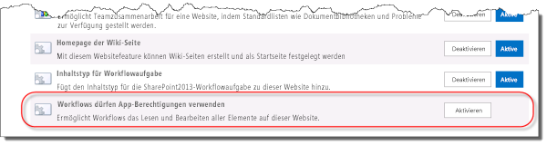
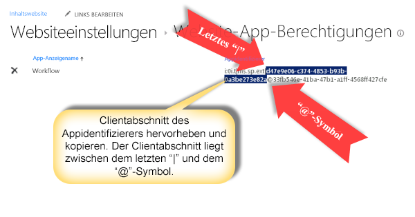
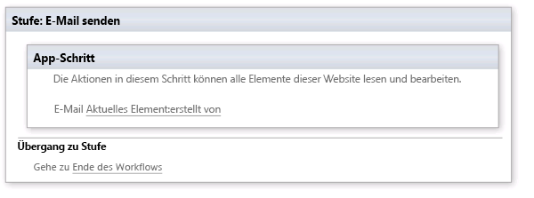

# <a name="create-a-workflow-with-elevated-permissions-by-using-the-sharepoint-workflow-platform"></a><span data-ttu-id="15c67-102">Erstellen eines Workflows mit erweiterten Berechtigungen mithilfe der SharePoint-Workflow-Plattform</span><span class="sxs-lookup"><span data-stu-id="15c67-102">Create a workflow with elevated permissions by using the SharePoint Workflow platform</span></span>
<span data-ttu-id="15c67-103">Erfahren Sie, wie Sie einen Workflow mit erweiterten Berechtigungen mithilfe der SharePoint-Workflow-Plattform erstellen.</span><span class="sxs-lookup"><span data-stu-id="15c67-103">Learn how to create a workflow with elevated permissions by using the SharePoint Workflow platform.</span></span>
## <a name="sharepoint-app-catalog-and-workflow"></a><span data-ttu-id="15c67-104">SharePoint-App-Katalog und Workflow</span><span class="sxs-lookup"><span data-stu-id="15c67-104">SharePoint Server 2013 App Catalog and workflow</span></span>
<span data-ttu-id="15c67-105"><a name="section1"> </a></span><span class="sxs-lookup"><span data-stu-id="15c67-105"></span></span>

<span data-ttu-id="15c67-p101">Dieser Artikel beschreibt, wie Sie SharePoint-Workflows erstellen, die auf Objekte in SharePoint zugreifen, die erweiterte Berechtigungen erfordern. Diese Lösungen verwenden zwei Features: Erteilen von Berechtigungen für die Workflow-App und Umhüllen der Aktionen mit dem App-Schritt.</span><span class="sxs-lookup"><span data-stu-id="15c67-p101">This article describes how to create SharePoint workflows that access objects in SharePoint that require elevated permissions. These solutions use two features: granting permissions to the workflow app and wrapping actions with the App Step.</span></span>
  
    
    

> <span data-ttu-id="15c67-108">**Wichtig:** In diesem Artikel wird davon ausgegangen, dass die SharePoint-Workflow-Plattform installiert und konfiguriert wurde und dass SharePoint für Apps konfiguriert wurde.</span><span class="sxs-lookup"><span data-stu-id="15c67-108">**Important** This article assumes that the SharePoint Workflow platform has been installed and configured and that SharePoint has been configured for apps. For more information on SharePoint Workflow and apps for SharePoint, including installation and configuration, see  Workflow in SharePoint and Install and manage apps for SharePoint.</span></span> <span data-ttu-id="15c67-109">Weitere Informationen zu SharePoint-Workflow und Apps für SharePoint, einschließlich Installation und Konfiguration, finden Sie unter [Workflow in SharePoint](http://technet.microsoft.com/sharepoint/jj556245.aspx) und [Installieren und Verwalten von Apps für SharePoint](http://msdn.microsoft.com/library/733647a3-a5d3-475b-967d-3bb627c2a0c2.aspx).</span><span class="sxs-lookup"><span data-stu-id="15c67-109">Important This article assumes that the SharePoint Workflow platform has been installed and configured and that SharePoint has been configured for apps. For more information on SharePoint Workflow and apps for SharePoint, including installation and configuration, see  [Workflow in SharePoint](http://technet.microsoft.com/sharepoint/jj556245.aspx) and [Install and manage apps for SharePoint](http://msdn.microsoft.com/library/733647a3-a5d3-475b-967d-3bb627c2a0c2.aspx).</span></span> 
  
    
    


### <a name="overview-of-creating-a-workflow-with-elevated-permissions"></a><span data-ttu-id="15c67-110">Übersicht über das Erstellen eines Workflows mit erweiterten Berechtigungen</span><span class="sxs-lookup"><span data-stu-id="15c67-110">Overview of creating a workflow with elevated permissions</span></span>

<span data-ttu-id="15c67-p103">Stellen Sie sich vor, Sie möchten als SharePoint-Administrator einige Prozesse für die Verwaltung von Benutzeranforderungen für den Erwerb von Apps aus dem Office Store definieren. Im einfachsten Fall möchten Sie eine E-Mail zur Bestätigung senden, wenn ein Benutzer eine App anfordert. Darüber hinaus möchten Sie dem Anforderungsgenehmigungsprozess möglicherweise auch eine Struktur hinzufügen.</span><span class="sxs-lookup"><span data-stu-id="15c67-p103">Imagine that as a SharePoint administrator, you would like to define some processes for managing user requests for purchases of apps from the Office Store. In the simplest case you want to send an acknowledgment email when a user requests an app. In addition, you could also want to add structure to the request approval process.</span></span>
  
    
    
<span data-ttu-id="15c67-p104">Standardmäßig verfügt der Workflow nicht über die Berechtigungen für den Zugriff auf den App-Anforderungskatalog. Die Kataloglisten in SharePoint erfordern Besitzerberechtigungen (Vollzugriff). Workflows werden im Allgemeinen auf einer Berechtigungsstufe ausgeführt, die der Schreibberechtigung gleicht.</span><span class="sxs-lookup"><span data-stu-id="15c67-p104">By default, workflow does not have permissions to access the app request catalog. Catalog lists in SharePoint require owner (full control) permissions. Workflows generally run at permission level equivalent to write.</span></span> 
  
    
    
<span data-ttu-id="15c67-117">Um dies zu beheben, müssen Sie einen Workflow mit erweiterten Berechtigungen erstellen, indem Sie auf der Websitesammlungs-Website folgendermaßen vorgehen:</span><span class="sxs-lookup"><span data-stu-id="15c67-117">To solve this, you have to create a workflow with elevated permissions by doing the following in the Site Collection site:</span></span>
  
    
    

1. <span data-ttu-id="15c67-118">Gestatten Sie dem Workflow die Verwendung von App-Berechtigungen.</span><span class="sxs-lookup"><span data-stu-id="15c67-118">Allow workflow to use app permissions.</span></span>
    
  
2. <span data-ttu-id="15c67-119">Erteilen Sie dem Workflow die Berechtigung für den Vollzugriff.</span><span class="sxs-lookup"><span data-stu-id="15c67-119">Grant full control permission to workflow.</span></span>
    
  
3. <span data-ttu-id="15c67-120">Entwickeln Sie den Workflow entsprechend, dass Aktionen innerhalb eines App-Schritts umhüllt werden.</span><span class="sxs-lookup"><span data-stu-id="15c67-120">Develop the workflow to wrap actions inside an App Step.</span></span>
    
  

### <a name="allowing-a-workflow-to-use-app-permissions-in-a-sharepoint-site"></a><span data-ttu-id="15c67-121">Zulassen der Verwendung von App-Berechtigungen auf einer SharePoint-Website für Workflows</span><span class="sxs-lookup"><span data-stu-id="15c67-121">Allowing a workflow to use app permissions in a SharePoint Server 2013 site</span></span>

<span data-ttu-id="15c67-122">Der erste Schritt besteht darin, die Verwendung von App-Berechtigungen in Workflows zuzulassen.</span><span class="sxs-lookup"><span data-stu-id="15c67-122">The first step is to allow workflow to use app permissions.</span></span> <span data-ttu-id="15c67-123">Sie konfigurieren Workflows zum Verwenden von App-Berechtigungen auf der Seite **Websiteeinstellungen** der SharePoint-Website, auf der der Workflow ausgeführt wird.</span><span class="sxs-lookup"><span data-stu-id="15c67-123">The first step is to allow workflow to use app permissions. You configure workflow to use app permissions on the **Site Settings** page of the SharePoint Server 2013 site where the workflow will run. The following procedure configures the SharePoint Server 2013 site to allow workflow to use app permissions.</span></span> <span data-ttu-id="15c67-124">Mit dem folgenden Verfahren wird die SharePoint-Website zum Verwenden von App-Berechtigungen in Workflows konfiguriert.</span><span class="sxs-lookup"><span data-stu-id="15c67-124">The following procedure configures the SharePoint site to allow workflow to use app permissions.</span></span>
  
    
    

> <span data-ttu-id="15c67-125">**Wichtig:** Das Verfahren muss von einem Benutzer abgeschlossen werden, der über die **Websitebesitzer**-Berechtigungen verfügt.</span><span class="sxs-lookup"><span data-stu-id="15c67-125">**Important** The procedure must be completed by a user that has **Site Owner** permissions.</span></span>
  
    
    


### <a name="to-allow-workflow-to-use-app-permissions"></a><span data-ttu-id="15c67-126">So gestatten Sie dem Workflow die Verwendung von App-Berechtigungen</span><span class="sxs-lookup"><span data-stu-id="15c67-126">To allow workflow to use app permissions</span></span>


1. <span data-ttu-id="15c67-127">Klicken Sie auf das Symbol **Einstellungen**, wie in der Abbildung gezeigt.</span><span class="sxs-lookup"><span data-stu-id="15c67-127">Click the **Settings** icon as shown in the figure.</span></span>
    
   <span data-ttu-id="15c67-128">**Abbildung: Öffnen der Seite "Websiteeinstellungen"**</span><span class="sxs-lookup"><span data-stu-id="15c67-128">**Figure: Opening the Site Settings page**</span></span>

  

  
  

  

  
2. <span data-ttu-id="15c67-130">Wechseln Sie zu **Websiteeinstellungen**.</span><span class="sxs-lookup"><span data-stu-id="15c67-130">Go to **Site Settings**.</span></span>
    
  
3. <span data-ttu-id="15c67-131">Wählen Sie im Abschnitt **Websiteaktionen** die Option **Websitefeatures verwalten** aus.</span><span class="sxs-lookup"><span data-stu-id="15c67-131">In the **Site Actions** section, select **Manage site features**.</span></span>
    
  
4. <span data-ttu-id="15c67-132">Suchen Sie das Feature **Workflows dürfen App-Berechtigungen verwenden**, wie in der Abbildung gezeigt, und klicken Sie dann auf **Aktivieren**.</span><span class="sxs-lookup"><span data-stu-id="15c67-132">Locate the feature called **Workflows can use app permissions**, as shown in the figure, and then click **Activate**.</span></span>
    
    > <span data-ttu-id="15c67-133">**Vorsicht:** Dieses Feature wird nicht aktiviert, sofern Sie die SharePoint-Workflow-Plattform und auch die Apps für SharePoint nicht ordnungsgemäß konfiguriert haben.</span><span class="sxs-lookup"><span data-stu-id="15c67-133">**Caution** This feature will not activate unless you have properly configured the SharePoint Workflow platform and also apps for SharePoint.</span></span> 

   <span data-ttu-id="15c67-134">**Abbildung: Das Websitefeature "Workflows dürfen App-Berechtigungen verwenden"**</span><span class="sxs-lookup"><span data-stu-id="15c67-134">**Figure: The site feature, 'Workflows can use app permissions'**</span></span>

  

  
  

  

  

### <a name="granting-full-control-permission-to-a-workflow"></a><span data-ttu-id="15c67-136">Erteilen der Berechtigung "Vollzugriff" für einen Workflow</span><span class="sxs-lookup"><span data-stu-id="15c67-136">Granting full control permission to a workflow</span></span>

<span data-ttu-id="15c67-p106">Damit der Workflow ordnungsgemäß funktionieren kann, muss diesem die Berechtigung "Vollzugriff" auf der Website gewährt werden. Im folgenden Verfahren wird dem Workflow die Berechtigung "Vollzugriff" erteilt.</span><span class="sxs-lookup"><span data-stu-id="15c67-p106">In order for the workflow to function properly it must be granted full control in the site. The following procedure grants the full control permission to the workflow.</span></span>
  
    
    

> <span data-ttu-id="15c67-139">**Wichtig:** Für das Verfahren wird Folgendes vorausgesetzt:> Das Verfahren muss von einem Benutzer abgeschlossen werden, der über die **Websitebesitzer**-Berechtigungen verfügt.> Der Workflow muss bereits auf der SharePoint-Website veröffentlicht worden sein.</span><span class="sxs-lookup"><span data-stu-id="15c67-139">**Important:** The procedure assumes the following:>  The procedure must be completed by a user that has **Site Owner** permissions.>  The workflow must already be published to the SharePoint site.</span></span>
  
    
    


### <a name="to-grant-full-control-permission-to-a-workflow"></a><span data-ttu-id="15c67-140">So erteilen Sie einem Workflow die Berechtigung "Vollzugriff"</span><span class="sxs-lookup"><span data-stu-id="15c67-140">To grant full control permission to a workflow</span></span>


1. <span data-ttu-id="15c67-141">Klicken Sie auf das Symbol **Einstellungen**, wie in der Abbildung gezeigt.</span><span class="sxs-lookup"><span data-stu-id="15c67-141">Click the **Settings** icon as shown in the figure.</span></span>
    
   <span data-ttu-id="15c67-142">**Abbildung: Öffnen der Seite "Websiteeinstellungen"**</span><span class="sxs-lookup"><span data-stu-id="15c67-142">**Figure: Opening the Site Settings page**</span></span>

  

  
  

  

  
2. <span data-ttu-id="15c67-144">Wechseln Sie zu **Websiteeinstellungen**.</span><span class="sxs-lookup"><span data-stu-id="15c67-144">Go to **Site Settings**.</span></span>
    
  
3. <span data-ttu-id="15c67-145">Wählen Sie im Abschnitt **Benutzer und Berechtigungen** die Option **Website-App-Berechtigungen** aus.</span><span class="sxs-lookup"><span data-stu-id="15c67-145">In the **Users and Permissions** section, select **Site app permissions**.</span></span>
    
  
4. <span data-ttu-id="15c67-p107">Kopieren Sie den Abschnitt **Client** der **App-ID**. Dies ist die ID zwischen dem letzten "|" und dem Zeichen "@", wie in der Abbildung gezeigt.</span><span class="sxs-lookup"><span data-stu-id="15c67-p107">Copy the **client** section of the **App Identifier**. This is the identifier between the last "|" and the "@" sign, as shown in the figure.</span></span>
    
   <span data-ttu-id="15c67-148">**Abbildung: Auswählen der App-ID**</span><span class="sxs-lookup"><span data-stu-id="15c67-148">**Figure: Selecting the App Identifier**</span></span>

  

  
  

  

  
5. <span data-ttu-id="15c67-p108">Navigieren Sie zur Seite **Einer App Berechtigungen erteilen**. Dazu müssen Sie zur Seite "appinv.aspx" der Website navigieren.</span><span class="sxs-lookup"><span data-stu-id="15c67-p108">Navigate to the **Grant permission to an app** page. This must be done by browsing to the appinv.aspx page of the site.</span></span>
    
    <span data-ttu-id="15c67-152">Beispiel: http://{hostname}/{Websitesammlung}/_layouts/15/appinv.aspx.</span><span class="sxs-lookup"><span data-stu-id="15c67-152">Example: http://{hostname}/{the Site Collection}/_layouts/15/appinv.aspx.</span></span> 
    
    > <span data-ttu-id="15c67-153">**Hinweis:** "App" bezieht sich in diesem Schritt auf die Workflow-App im Allgemeinen und nicht auf einen bestimmten Workflow.</span><span class="sxs-lookup"><span data-stu-id="15c67-153">**Note:** The 'app' in this step refers to the Workflow app in general and not just a specific workflow.</span></span> <span data-ttu-id="15c67-154">Der Zugriff auf einzelne Workflows kann nicht gesteuert werden.</span><span class="sxs-lookup"><span data-stu-id="15c67-154">Individual workflows cannot be access controlled.</span></span> <span data-ttu-id="15c67-155">Wenn Sie App-Berechtigungen aktivieren, sind sie für alle Workflows in der Websitesammlung aktiviert.</span><span class="sxs-lookup"><span data-stu-id="15c67-155">When you enable app permissions you are enabling for all workflows within the Site Collection.</span></span> 

    <span data-ttu-id="15c67-156">Weitere Informationen zum Einrichten eines Workflows finden Sie unter  [Blogartikel von Sympraxis Consulting: Durchlaufen von Inhalten in einem Website-Workflow in SharePoint](http://sympmarc.com/2016/01/14/looping-through-content-in-a-sharepoint-site-workflow-part-1-introduction)</span><span class="sxs-lookup"><span data-stu-id="15c67-156">For more information about setting up a workflow, see  [Blog article from Sympraxis Consulting: Looping Through Content in a SharePoint Site Workflow](http://sympmarc.com/2016/01/14/looping-through-content-in-a-sharepoint-site-workflow-part-1-introduction)</span></span>
    
    <span data-ttu-id="15c67-157">Die folgende Abbildung zeigt ein Beispiel.</span><span class="sxs-lookup"><span data-stu-id="15c67-157">The following figure shows an example.</span></span>
    

 <span data-ttu-id="15c67-158">**Abbildung: Beispiel für Seite "appinv.aspx" und URL**</span><span class="sxs-lookup"><span data-stu-id="15c67-158">**Figure: The appinv.aspx page and URL example**</span></span>

  

  
  

  
6. <span data-ttu-id="15c67-160">Fügen Sie die Client-ID in das Feld **App-ID** ein, und klicken Sie dann auf **Nachschlagen**, wie in der Abbildung gezeigt.</span><span class="sxs-lookup"><span data-stu-id="15c67-160">Paste the client id in the **App Id** field and then click **Lookup**, as shown in the figure.</span></span>
    
  
7. <span data-ttu-id="15c67-161">Fügen Sie den folgenden XML-Code für **Berechtigungsanforderungen** ein, um die Berechtigung "Vollzugriff" zu erteilen.</span><span class="sxs-lookup"><span data-stu-id="15c67-161">Paste the following **Permissions Request** XML to grant full control permission.</span></span>
    
``` xml 
<AppPermissionRequests>
    <AppPermissionRequest Scope="http://sharepoint/content/sitecollection/web" Right="FullControl" />
</AppPermissionRequests>

```


> <span data-ttu-id="15c67-162">**Vorsicht:** Der obige **Scope**-Wert enthält keine Platzhalter.</span><span class="sxs-lookup"><span data-stu-id="15c67-162">**Caution** There are no placeholders in the **Scope** value above. It is a literal value. Enter it exactly as it appears here.</span></span> <span data-ttu-id="15c67-163">Es ist ein Literalwert.</span><span class="sxs-lookup"><span data-stu-id="15c67-163">It is a literal value.</span></span> <span data-ttu-id="15c67-164">Geben Sie ihn genau so ein, wie er hier dargestellt wird.</span><span class="sxs-lookup"><span data-stu-id="15c67-164">Enter it exactly as it appears here.</span></span>

  <span data-ttu-id="15c67-165">Die folgende Abbildung zeigt ein Beispiel für die fertige Seite.</span><span class="sxs-lookup"><span data-stu-id="15c67-165">The following figure shows an example of the completed page.</span></span>
    

  <span data-ttu-id="15c67-166">**Abbildung: Nachschlagen eine App-ID**</span><span class="sxs-lookup"><span data-stu-id="15c67-166">**Figure: Looking up an App Id**</span></span>

  

  


8. <span data-ttu-id="15c67-168">Klicken Sie auf **Erstellen**.</span><span class="sxs-lookup"><span data-stu-id="15c67-168">Click **Create**.</span></span>
    
  
9. <span data-ttu-id="15c67-p111">Sie werden dann aufgefordert, der Workflow-App zu vertrauen, wie in der Abbildung gezeigt. Klicken Sie auf **Vertrauen**.</span><span class="sxs-lookup"><span data-stu-id="15c67-p111">You will then be asked to trust the Workflow app, as shown in the figure. Click **Trust It**.</span></span>
    
  <span data-ttu-id="15c67-171">**Abbildung: Der Workflow-App vertrauen**</span><span class="sxs-lookup"><span data-stu-id="15c67-171">**Figure: Trust the Workflow app**</span></span>

  
  
### <a name="wrapping-actions-inside-an-app-step"></a><span data-ttu-id="15c67-173">Umhüllen von Aktionen in App-Schritten</span><span class="sxs-lookup"><span data-stu-id="15c67-173">Wrapping actions inside an App Step</span></span>

<span data-ttu-id="15c67-p112">Abschließend müssen Sie die Workflowaktionen in einem App-Schritt umhüllen. Das folgende Verfahren umhüllt die Aktion **E-Mail senden** innerhalb eines App-Schritts. Der Workflow in diesem Beispiel sendet eine Bestätigungs-E-Mail aus einer benutzerdefinierten Liste.</span><span class="sxs-lookup"><span data-stu-id="15c67-p112">Finally, you need to wrap the workflow actions inside an App Step. The following procedure wraps a **Send an Email** action inside an App Step. The workflow in this example sends an acknowledgement email message from a custom list.</span></span>
  
    
    

### <a name="to-wrap-actions-inside-an-app-step"></a><span data-ttu-id="15c67-177">So umhüllen Sie Aktionen innerhalb von App-Schritten</span><span class="sxs-lookup"><span data-stu-id="15c67-177">To wrap actions inside an App Step</span></span>


1. <span data-ttu-id="15c67-178">Öffnen Sie die App-Katalogwebsite in SharePoint Designer 2013 an.</span><span class="sxs-lookup"><span data-stu-id="15c67-178">Open the App Catalog site in SharePoint Designer 2013.</span></span>
    
  
2. <span data-ttu-id="15c67-p113">Erstellen Sie eine neue benutzerdefinierte Liste für die Ausführung des Workflows. In diesem Beispiel wird der Listenname **App Demo** verwendet.</span><span class="sxs-lookup"><span data-stu-id="15c67-p113">Create a new Custom List on which to run the workflow. In this example the list name is **App Demo**.</span></span>
    
  
3. <span data-ttu-id="15c67-181">Klicken Sie im Navigationsfenster auf **Workflows**.</span><span class="sxs-lookup"><span data-stu-id="15c67-181">Click **Workflows** in the navigation window.</span></span>
    
  
4. <span data-ttu-id="15c67-182">Erstellen Sie einen neuen Listenworkflow für die App Demo-Liste, wie in der Abbildung gezeigt.</span><span class="sxs-lookup"><span data-stu-id="15c67-182">Create a new List Workflow for the App Demo list, as shown in the figure.</span></span>
    
  <span data-ttu-id="15c67-183">**Abbildung: Erstellen eines neuen Listenworkflows**</span><span class="sxs-lookup"><span data-stu-id="15c67-183">**Figure: Create a new List workflow**</span></span>

  

  
  

  

  
5. <span data-ttu-id="15c67-185">Fügen Sie einen **App-Schritt** hinzu, wie in der Abbildung gezeigt.</span><span class="sxs-lookup"><span data-stu-id="15c67-185">Insert an **App Step**, as shown in the figure.</span></span>
    
  <span data-ttu-id="15c67-186">**Abbildung: Hinzufügen eines App-Schritts**</span><span class="sxs-lookup"><span data-stu-id="15c67-186">**Figure: Add an App Step**</span></span>

  

  
  

  

  
6. <span data-ttu-id="15c67-188">Fügen Sie die Aktion **E-Mail senden** im **App-Schritt** ein.</span><span class="sxs-lookup"><span data-stu-id="15c67-188">Insert a **Send an Email** action in the **App Step**.</span></span>
    
  
7. <span data-ttu-id="15c67-p114">Klicken Sie auf die Schaltfläche **Adressbuch**. Wählen Sie im Feld **An** die Option **Workflow-Nachschlagevorgang für einen Benutzer** aus, und klicken Sie dann auf **Hinzufügen**, wie in der Abbildung gezeigt.</span><span class="sxs-lookup"><span data-stu-id="15c67-p114">Click the **address book** button. In the **To** field select **Workflow lookup for a user** and click **add** as shown in the figure.</span></span>
    
  <span data-ttu-id="15c67-191">**Abbildung: Auswählen von "Workflow-Nachschlagevorgang für einen Benutzer"**</span><span class="sxs-lookup"><span data-stu-id="15c67-191">**Figure: Select Workflow lookup for a user**</span></span>

  
  

8. <span data-ttu-id="15c67-193">Geben Sie das Feld **Erstellt von** als Suchwert ein, wie in der Abbildung gezeigt.</span><span class="sxs-lookup"><span data-stu-id="15c67-193">Enter the **Created By** field as the lookup value, as shown in the figure.</span></span>
    
  <span data-ttu-id="15c67-194">**Abbildung: Dialogfeld zum Suchen von Personen**</span><span class="sxs-lookup"><span data-stu-id="15c67-194">**Figure: Lookup for Person dialog box**</span></span>

  
  
9. <span data-ttu-id="15c67-196">Geben Sie E-Mail von App Demo-Liste in den Nachrichtentext der E-Mail ein.</span><span class="sxs-lookup"><span data-stu-id="15c67-196">Enter Email from App Demo list in the email message body.</span></span>
    
  
10. <span data-ttu-id="15c67-p115">Klicken Sie auf **OK**, um zum Workflow zurückzukehren. Der fertige Workflow wird in der Abbildung veranschaulicht.</span><span class="sxs-lookup"><span data-stu-id="15c67-p115">Click **OK** to return to the workflow. The completed workflow is shown in the figure.</span></span>
    
  <span data-ttu-id="15c67-199">**Abbildung: E-Mail-Aktion in App-Schritt**</span><span class="sxs-lookup"><span data-stu-id="15c67-199">**Figure: Email action in App Step**</span></span>

  
    
11. <span data-ttu-id="15c67-201">Klicken Sie auf dem Menüband auf das Symbol **Workfloweinstellungen**, wie in der Abbildung gezeigt.</span><span class="sxs-lookup"><span data-stu-id="15c67-201">Click the **Workflow Settings** icon in the ribbon, as shown in the figure.</span></span>
    
  <span data-ttu-id="15c67-202">**Abbildung: Symbol "Workfloweinstellungen" auf dem Menüband**</span><span class="sxs-lookup"><span data-stu-id="15c67-202">**Figure: Workflow Settings icon in ribbon**</span></span>

  

  
  

  

  
12. <span data-ttu-id="15c67-204">Deaktivieren Sie das Kontrollkästchen neben **Workflowstatus automatisch auf dem aktuellen Phasennamen aktualisieren**, und klicken Sie dann auf **Veröffentlichen**, wie in der Abbildung gezeigt.</span><span class="sxs-lookup"><span data-stu-id="15c67-204">Clear the check box next to **Automatic updates to workflow status to the current stage name**, and then click **Publish**, as shown in the figure.</span></span>
    
  <span data-ttu-id="15c67-205">**Abbildung: Deaktivieren der automatischen Aktualisierung und anschließende Veröffentlichung**</span><span class="sxs-lookup"><span data-stu-id="15c67-205">**Figure: Clear the automatic updates check mark and then publish**</span></span>

  

  
  


## <a name="understanding-how-it-works"></a><span data-ttu-id="15c67-207">Erläuterung der Funktionsweise</span><span class="sxs-lookup"><span data-stu-id="15c67-207">Understanding how it works</span></span>
<span data-ttu-id="15c67-208"><a name="section2"> </a></span><span class="sxs-lookup"><span data-stu-id="15c67-208"></span></span>

<span data-ttu-id="15c67-p116">Um zu verstehen, warum das Erhöhen von Berechtigungen für einen Workflow erforderlich ist, berücksichtigen Sie, dass Workflows im Grunde Apps für SharePoint sind, die den gleichen Autorisierungsregeln des App-Modells folgen. Die Standardkonfiguration für den Workflow ist, dass die effektiven Berechtigungen des Workflows eine Schnittmenge von Benutzerberechtigungen und App-Berechtigungen sind, wie in der Abbildung gezeigt.</span><span class="sxs-lookup"><span data-stu-id="15c67-p116">To understand why elevating permissions for a workflow is required, consider that workflows are fundamentally apps for SharePoint and they follow the same authorization rules of the app model. The default configuration for workflow is that the effective permissions of the workflow are an intersection of user permissions and the app permissions, as shown in the figure.</span></span>
  
    
<span data-ttu-id="15c67-211">**Abbildung: Berechtigungsdiagramm**</span><span class="sxs-lookup"><span data-stu-id="15c67-211">**Figure: Permissions diagram**</span></span>

  
    
    

  
    
    

  
    
    
<span data-ttu-id="15c67-p117">Es gibt zwei Gründe, warum es erforderlich ist, die Berechtigungen zum Erstellen eines Workflows in der Liste der App-Anforderungen zu erhöhen. Dies sind:</span><span class="sxs-lookup"><span data-stu-id="15c67-p117">There are two reasons why it is necessary to elevate permissions to create a workflow in the App Request list. These are:</span></span>
  
    
    

- <span data-ttu-id="15c67-215">Standardmäßig verfügt der Workflow nur über die Schreibberechtigung.</span><span class="sxs-lookup"><span data-stu-id="15c67-215">By default, workflow only has write permission.</span></span>
    
  
- <span data-ttu-id="15c67-216">Der Benutzer verfügt über keine Berechtigungen.</span><span class="sxs-lookup"><span data-stu-id="15c67-216">The user has no permissions.</span></span>
    
  
<span data-ttu-id="15c67-p118">Der erste Schritt zur Lösung dieses Problems besteht darin, der Anwendung die Autorisierung zu gestatten, indem nur ihre Identität verwendet und die Identität des Benutzers ignoriert wird. Dies erfolgt durch das Aktivieren des App-Schritt-Features. Im zweite Schritt wird dem Workflow der Vollzugriff gewährt.</span><span class="sxs-lookup"><span data-stu-id="15c67-p118">The first step to solve this problem is to allow the application to authorize by using only its identity and ignoring that of the user. This is done by enabling the App Step feature. The second step grants full control permission to the workflow.</span></span> 
  
    
    
<span data-ttu-id="15c67-220">Das folgende Diagramm veranschaulicht die Änderung der Berechtigungen.</span><span class="sxs-lookup"><span data-stu-id="15c67-220">The following diagram illustrates the change in permissions</span></span>
  
    
    

<span data-ttu-id="15c67-221">**Abbildung: Berechtigungsmatrix**</span><span class="sxs-lookup"><span data-stu-id="15c67-221">**Figure: Permissions matrix**</span></span>

  
    
    

  
    
    

  
    
    

  
    
    

  
    
    

## <a name="additional-resources"></a><span data-ttu-id="15c67-223">Zusätzliche Ressourcen</span><span class="sxs-lookup"><span data-stu-id="15c67-223">Additional resources</span></span>
<span data-ttu-id="15c67-224"><a name="section3"> </a></span><span class="sxs-lookup"><span data-stu-id="15c67-224"></span></span>


-  [<span data-ttu-id="15c67-225">Workflow in SharePoint </span><span class="sxs-lookup"><span data-stu-id="15c67-225">Workflow in SharePoint </span></span>](http://technet.microsoft.com/en-us/sharepoint/jj556245.aspx)
    
  
-  [<span data-ttu-id="15c67-226">Installieren und Verwalten von Apps für SharePoint</span><span class="sxs-lookup"><span data-stu-id="15c67-226">Install and manage apps for SharePoint</span></span>](http://msdn.microsoft.com/library/733647a3-a5d3-475b-967d-3bb627c2a0c2.aspx)
    
  
-  [<span data-ttu-id="15c67-227">Neuigkeiten im Workflow in SharePoint</span><span class="sxs-lookup"><span data-stu-id="15c67-227">What's new in workflow in SharePoint Server 2013</span></span>](http://msdn.microsoft.com/library/6ab8a28b-fa2f-4530-8b55-a7f663bf15ea.aspx)
    
  
-  [<span data-ttu-id="15c67-228">Erste Schritte mit SharePoint-Workflow</span><span class="sxs-lookup"><span data-stu-id="15c67-228">Getting started with SharePoint Server 2013 workflow</span></span>](http://msdn.microsoft.com/library/cc73be76-a329-449f-90ab-86822b1c2ee8.aspx)
    
  
-  [<span data-ttu-id="15c67-229">Workflowentwicklung in SharePoint Designer und Visio</span><span class="sxs-lookup"><span data-stu-id="15c67-229">Workflow development in SharePoint Designer and Visio</span></span>](workflow-development-in-sharepoint-designer-and-visio.md)
    
  
-  [<span data-ttu-id="15c67-230">Kurzübersicht zu Workflowaktionen (SharePoint-Workflowplattform)</span><span class="sxs-lookup"><span data-stu-id="15c67-230">Workflow actions quick reference (SharePoint Workflow platform)</span></span>](workflow-actions-quick-reference-sharepoint-workflow-platform.md)
    
  
-  [<span data-ttu-id="15c67-231">Blogartikel des SharePoint Designer-Teams: Verpackungs- und Bereitstellungsszenario für Workflows</span><span class="sxs-lookup"><span data-stu-id="15c67-231">Blog article from the SharePoint Designer team: Workflow package and deploy scenario</span></span>](http://blogs.msdn.com/b/sharepointdesigner/archive/2012/08/30/packaging-list-site-and-reusable-workflow-and-how-to-deploy-the-package.aspx)
    
  
-  [<span data-ttu-id="15c67-232">Blogartikel von Sympraxis Consulting: Durchlaufen von Inhalten in einem Website-Workflow in SharePoint</span><span class="sxs-lookup"><span data-stu-id="15c67-232">Blog article from Sympraxis Consulting: Looping Through Content in a SharePoint Site Workflow</span></span>](http://sympmarc.com/2016/01/14/looping-through-content-in-a-sharepoint-site-workflow-part-1-introduction)
    
  

