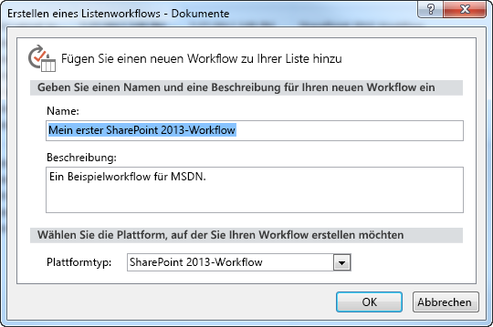

# Erstellen eines Workflows mithilfe von SharePoint Designer 2013 und der SharePoint-WorkflowplattformCreating a workflow by using SharePoint Designer 2013 and the SharePoint Workflow platform
Erfahren Sie, wie sie einen Workflow mit SharePoint Designer 2013 und der SharePoint-Workflow-Plattform installieren, öffnen und erstellen.Learn how to install, open, and create a workflow by using SharePoint Designer 2013 and the SharePoint Workflow platform. 
   

## Installieren von SharePoint Designer 2013Install SharePoint Designer 2013

SharePoint Designer 2013 ist ein kostenloser Download. Befolgen Sie diese Schritte, um SharePoint Designer 2013 herunterzuladen und zu installieren:SharePoint Designer 2013 is a free download. To download and install SharePoint Designer 2013 follow these steps: 
  
    
    

### So installieren Sie SharePoint Designer 2013To install SharePoint Designer 2013

1. Öffnen Sie Ihren Webbrowser und navigieren Sie zum Microsoft Download Center:  [http://www.microsoft.com/download/](http://www.microsoft.com/download.aspx).Open your web browser and navigate to the Microsoft Download Center:  [http://www.microsoft.com/download](http://www.microsoft.com/download.aspx). 
    
  
2. Geben Sie SharePoint Designer 2013 in das Suchfeld ein.Type SharePoint Designer 2013 in the search field.
    
  
3. Klicken Sie auf den Link „SharePoint Designer 2013".Click the link for "SharePoint Designer 2013". 
    
  
4. Lesen Sie den Überblick, die Systemanforderungen und die Installationsanweisungen. Stellen Sie sicher, dass Ihr System kompatibel ist.Read the overview, system requirements, and installation instructions. Make sure your system is compatible. 
    
  
5. Wählen Sie Ihren Plattformtypen aus: 64-Bit ( **x64**) oder 32-Bit ( **x86**), wie in der Abbildung dargestellt.Select your platform type: 64-bit ( **x64**) or 32-bit ( **x86**) as shown in the figure. 
    
  
6. Befolgen Sie die Anweisungen, um SharePoint Designer 2013 zu installieren.Follow the instructions to install SharePoint Designer 2013.
    
  

**Abbildung: SharePoint Designer 2013-Downloadseite****Figure: SharePoint Designer 2013 download page**

  
    
    

  
    
    

  
    
    

  
    
    

  
    
    

## Öffnen Sie SharePoint Designer 2013 und stellen Sie eine Verbindung zu einer SharePoint-Website herOpen SharePoint Designer 2013 and connect to a SharePoint site

SharePoint Designer 2013 wird als Office 2013-Anwendung installiert. Befolgen Sie diese Schritte, um SharePoint Designer 2013 zu öffnen und eine Verbindung zu einer SharePoint-Website herzustellen:SharePoint Designer 2013 installs as an Office 2013 application. To open SharePoint Designer 2013 and connect to a SharePoint site follow these steps: 
  
    
    

### So öffnen Sie SharePoint Designer 2013 und stellen Sie eine Verbindung zu einer SharePoint-Website herTo open SharePoint Designer 2013 and connect to a SharePoint site

1. Öffnen Sie SharePoint Designer 2013, indem Sie es im Menü **Start** auswählen. Klicken Sie auf das **Start**-Symbol, **Alle Programme**, **Microsoft Office 2013** und anschließend auf **SharePoint Designer 2013**.Open SharePoint Designer 2013 by selecting it on the **Start** menu. Click **Start** icon, click **All Programs**, click **Microsoft Office 2013**, and then click **SharePoint Designer 2013**. 
    
  
2. Klicken Sie auf der SharePoint Designer 2013-Startseite auf **Website öffnen**.Click **Open Site** on the SharePoint Designer 2013 start page.
    
  
3. Geben Sie die SharePoint-Website ein, mit der Sie eine Verbindung herstellen möchten. Beispielsweise http://www.contoso.com/sites/a-sharepoint-site.Enter the SharePoint site that you want to connect to. For example, http://www.contoso.com/sites/a-sharepoint-site.
    
  
4. Klicken Sie auf **Öffnen**, um die Website zu öffnen.Click **Open** to open the site.
    
  
5. Geben Sie bei Eingabeaufforderung Ihre Anmeldeinformationen ein. (Wenn auf dem Computer, an dem Sie sich angemeldet haben, keine Sicherheitsfunktionen integriert sind, werden Sie dazu aufgefordert, Ihre Anmeldeinformationen einzugeben). Stellen Sie sicher, dass Sie dazu Anmeldeinformationen verwenden, mit denen Sie Zugriff auf die SharePoint-Website haben.Enter your credentials, if prompted. (If security is not integrated with the computer you signed in on then you are prompted to enter your credentials.) Make sure to use credentials that have access to the SharePoint site.
    
  

## Erstellen Sie einen auf der SharePoint-Workflowplattform basierenden ListenworkflowCreate a List workflow based on the SharePoint Workflow platform

SharePoint Designer 2013 kann für viele wichtige Aufgaben verwendet werden. Der Navigationsbereich wird verwendet, um zwischen den verschiedenen Aspekten von SharePoint Designer 2013 zu wechseln. Befolgen Sie diese Schritte, um einen neuen Listenworkflow zu erstellen, der auf der SharePoint-Workflowplattform basiert:SharePoint Designer 2013 can be used for many important tasks. The navigational pane is used to switch between different aspects of SharePoint Designer 2013. To create a new List workflow based on the SharePoint Workflow platform, follow these steps:
  
    
    

### So erstellen Sie einen auf der SharePoint-Workflowplattform basierenden WorkflowTo create a workflow based on the SharePoint Workflow platform

1. Klicken Sie im Navigationsbereich auf den Workflowknoten.Click the Workflows node in the Navigation pane.
    
  
2. Klicken Sie im Bereich **Neu** des Menübands auf das Dropdownmenü **Listenworkflow**, wie in der Abbildung dargestellt.Click the **List Workflow** drop-down in the **New** section of the ribbon, as shown in the figure.
    
  
3. Wählen Sie die Liste aus, die Sie mit dem neuen Workflow verknüpfen möchten.Select the list that you want to associate with the new workflow.
    
  
4. Geben Sie im Dialogfeld **Listenworkflow erstellen** einen Namen und eine Beschreibung für den Workflow ein und vergewissern Sie sich dann, dass der **Plattformtyp** auf **SharePoint Workflow** eingestellt ist, wie in der Abbildung dargestellt.On the **Create List Workflow** dialog box, enter a name and description for the workflow and then make sure that the **Platform Type** is set to **SharePoint Workflow**, as shown in the figure.
    
    > **Hinweis:** Wenn Ihnen „SharePoint Workflow“ nicht als verfügbarer Plattformtyp angezeigt wird, dann ist Workflow-Manager nicht für die Verwendung mit der SharePoint-Farm konfiguriert.**Note** If you do not see SharePoint Workflow as an available platform type then Workflow Manager is not configured to work with the SharePoint Server 2013 farm. 
5. Klicken Sie auf **OK**, um den Workflow zu erstellen.Click **OK** to create the workflow.
    
  

**Abbildung: Die Menübandschaltfläche zum Erstellen eines neuen Listenworkflows****Figure: The ribbon button for creating a new list workflow**

  
    
    

  
    
    

  
    
    

  
    
    

  
    
    

**Abbildung: Dialogfeld "Listenworkflow erstellen"****Figure: Create List Workflow dialog box**

  
    
    

  
    
    

  
    
    

  
    
    

  
    
    
Nachdem der Workflow erstellt wurde, können Sie Aktionen, Bedingungen, Stufen, Schritte und Schleifen zum Erstellen Ihres Workflows hinzufügen. Diese Workflow-Komponenten sind im Menüband von SharePoint Designer 2013 verfügbar, wie in der Abbildung dargestellt.Now that the workflow is created, you can add Actions, Conditions, Stages, Steps, and Loops to build your workflow. These workflow components are available in the ribbon of SharePoint Designer 2013, as shown in the figure. 
  
    
    

**Abbildung: Workflowelemente für die SharePoint-Workflowplattform****Figure: Workflow items for the SharePoint Workflow platform**

  
    
    

  
    
    

  
    
    

    
> **Hinweis:** Die oben dargestellte Vorgehensweise wird zum Erstellen eines Listenworkflows verwendet.**Note:** The above procedure is used to create a List workflow. Ein wiederverwendbarer Workflow oder Websiteworkflow kann mithilfe derselben Vorgehensweise mit den folgenden Änderungen erstellt werden.A Reusable workflow or Site workflow can be created using the same procedure with the following modification. Wählen Sie im Menüband statt der Schaltfläche „Listenworkflow“ die Schaltfläche **Wiederverwendbarer Workflow** oder **Websiteworkflow**, wenn Sie den Workflow erstellen.The above procedure is used to create a List workflow. A Reusable workflow or Site workflow can be created using the same procedure with the following modification. Instead of selecting the List Workflow button in the ribbon select the **Reusable Workflow** or **Site Workflow** button when creating the workflow.
  
    
    

Weitere Informationen zu den verfügbaren Komponenten zur Entwicklung von Workflows finden Sie unter [Kurzübersicht zu Workflowaktionen (SharePoint-Workflowplattform)](workflow-actions-quick-reference-sharepoint-workflow-platform.md).To learn more about the available components of workflow development, see  [Workflow actions quick reference (SharePoint Workflow platform)](workflow-actions-quick-reference-sharepoint-workflow-platform.md).
  
    
    

## Zusätzliche RessourcenAdditional resources

-  [Neuigkeiten im Workflow in SharePointWhat's new in workflow in SharePoint Server 2013](http://msdn.microsoft.com/library/6ab8a28b-fa2f-4530-8b55-a7f663bf15ea.aspx)
    
  
-  [Erste Schritte mit SharePoint-WorkflowGetting started with SharePoint Server 2013 workflow](http://msdn.microsoft.com/library/cc73be76-a329-449f-90ab-86822b1c2ee8.aspx)
    
  
-  [Workflowentwicklung in SharePoint Designer und VisioWorkflow development in SharePoint Designer and Visio](workflow-development-in-sharepoint-designer-and-visio.md)
    
  

  
    
    

