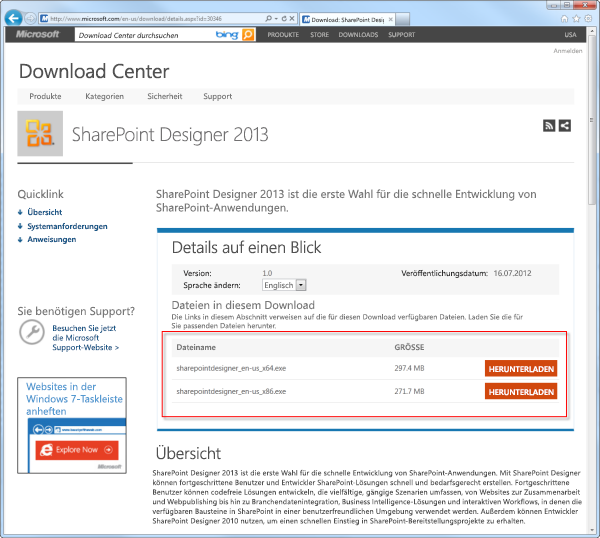

# Erstellen eines Workflows mithilfe von SharePoint Designer 2013 und der SharePoint-Workflowplattform
Erfahren Sie, wie sie einen Workflow mit SharePoint Designer 2013 und der SharePoint-Workflow-Plattform installieren, öffnen und erstellen. 
   

## Installieren von SharePoint Designer 2013

SharePoint Designer 2013 ist ein kostenloser Download. Befolgen Sie diese Schritte, um SharePoint Designer 2013 herunterzuladen und zu installieren: 
  
    
    

### So installieren Sie SharePoint Designer 2013

1. Öffnen Sie Ihren Webbrowser und navigieren Sie zum Microsoft Download Center:  [http://www.microsoft.com/download/](http://www.microsoft.com/download.aspx). 
    
  
2. Geben Sie SharePoint Designer 2013 in das Suchfeld ein.
    
  
3. Klicken Sie auf den Link „SharePoint Designer 2013". 
    
  
4. Lesen Sie den Überblick, die Systemanforderungen und die Installationsanweisungen. Stellen Sie sicher, dass Ihr System kompatibel ist. 
    
  
5. Wählen Sie Ihren Plattformtypen aus: 64-Bit ( **x64**) oder 32-Bit ( **x86**), wie in der Abbildung dargestellt. 
    
  
6. Befolgen Sie die Anweisungen, um SharePoint Designer 2013 zu installieren.
    
  

**Abbildung: SharePoint Designer 2013-Downloadseite**

  
    
    

  
    
    

  
    
    

  
    
    

  
    
    

## Öffnen Sie SharePoint Designer 2013 und stellen Sie eine Verbindung zu einer SharePoint-Website her

SharePoint Designer 2013 wird als Office 2013-Anwendung installiert. Befolgen Sie diese Schritte, um SharePoint Designer 2013 zu öffnen und eine Verbindung zu einer SharePoint-Website herzustellen: 
  
    
    

### So öffnen Sie SharePoint Designer 2013 und stellen Sie eine Verbindung zu einer SharePoint-Website her

1. Öffnen Sie SharePoint Designer 2013, indem Sie es im Menü **Start** auswählen. Klicken Sie auf das **Start**-Symbol, **Alle Programme**, **Microsoft Office 2013** und anschließend auf **SharePoint Designer 2013**. 
    
  
2. Klicken Sie auf der SharePoint Designer 2013-Startseite auf **Website öffnen**.
    
  
3. Geben Sie die SharePoint-Website ein, mit der Sie eine Verbindung herstellen möchten. Beispielsweise http://www.contoso.com/sites/a-sharepoint-site.
    
  
4. Klicken Sie auf **Öffnen**, um die Website zu öffnen.
    
  
5. Geben Sie bei Eingabeaufforderung Ihre Anmeldeinformationen ein. (Wenn auf dem Computer, an dem Sie sich angemeldet haben, keine Sicherheitsfunktionen integriert sind, werden Sie dazu aufgefordert, Ihre Anmeldeinformationen einzugeben). Stellen Sie sicher, dass Sie dazu Anmeldeinformationen verwenden, mit denen Sie Zugriff auf die SharePoint-Website haben.
    
  

## Erstellen Sie einen auf der SharePoint-Workflowplattform basierenden Listenworkflow

SharePoint Designer 2013 kann für viele wichtige Aufgaben verwendet werden. Der Navigationsbereich wird verwendet, um zwischen den verschiedenen Aspekten von SharePoint Designer 2013 zu wechseln. Befolgen Sie diese Schritte, um einen neuen Listenworkflow zu erstellen, der auf der SharePoint-Workflowplattform basiert:
  
    
    

### So erstellen Sie einen auf der SharePoint-Workflowplattform basierenden Workflow

1. Klicken Sie im Navigationsbereich auf den Workflowknoten.
    
  
2. Klicken Sie im Bereich **Neu** des Menübands auf das Dropdownmenü **Listenworkflow**, wie in der Abbildung dargestellt.
    
  
3. Wählen Sie die Liste aus, die Sie mit dem neuen Workflow verknüpfen möchten.
    
  
4. Geben Sie im Dialogfeld **Listenworkflow erstellen** einen Namen und eine Beschreibung für den Workflow ein und vergewissern Sie sich dann, dass der **Plattformtyp** auf **SharePoint Workflow** eingestellt ist, wie in der Abbildung dargestellt.
    
    > **Hinweis:** Wenn Ihnen „SharePoint Workflow“ nicht als verfügbarer Plattformtyp angezeigt wird, dann ist Workflow-Manager nicht für die Verwendung mit der SharePoint-Farm konfiguriert. 
5. Klicken Sie auf **OK**, um den Workflow zu erstellen.
    
  

**Abbildung: Die Menübandschaltfläche zum Erstellen eines neuen Listenworkflows**

  
    
    

  
    
    

  
    
    

  
    
    

  
    
    

**Abbildung: Dialogfeld "Listenworkflow erstellen"**

  
    
    

  
    
    

  
    
    

  
    
    

  
    
    
Nachdem der Workflow erstellt wurde, können Sie Aktionen, Bedingungen, Stufen, Schritte und Schleifen zum Erstellen Ihres Workflows hinzufügen. Diese Workflow-Komponenten sind im Menüband von SharePoint Designer 2013 verfügbar, wie in der Abbildung dargestellt. 
  
    
    

**Abbildung: Workflowelemente für die SharePoint-Workflowplattform**

  
    
    

  
    
    

  
    
    

    
> **Hinweis:** Die oben dargestellte Vorgehensweise wird zum Erstellen eines Listenworkflows verwendet. Ein wiederverwendbarer Workflow oder Websiteworkflow kann mithilfe derselben Vorgehensweise mit den folgenden Änderungen erstellt werden. Wählen Sie im Menüband statt der Schaltfläche „Listenworkflow“ die Schaltfläche **Wiederverwendbarer Workflow** oder **Websiteworkflow**, wenn Sie den Workflow erstellen.
  
    
    

Weitere Informationen zu den verfügbaren Komponenten zur Entwicklung von Workflows finden Sie unter [Kurzübersicht zu Workflowaktionen (SharePoint-Workflowplattform)](workflow-actions-quick-reference-sharepoint-workflow-platform.md).
  
    
    

## Zusätzliche Ressourcen

-  [Neuigkeiten im Workflow in SharePoint](http://msdn.microsoft.com/library/6ab8a28b-fa2f-4530-8b55-a7f663bf15ea.aspx)
    
  
-  [Erste Schritte mit SharePoint-Workflow](http://msdn.microsoft.com/library/cc73be76-a329-449f-90ab-86822b1c2ee8.aspx)
    
  
-  [Workflowentwicklung in SharePoint Designer und Visio](workflow-development-in-sharepoint-designer-and-visio.md)
    
  

  
    
    

