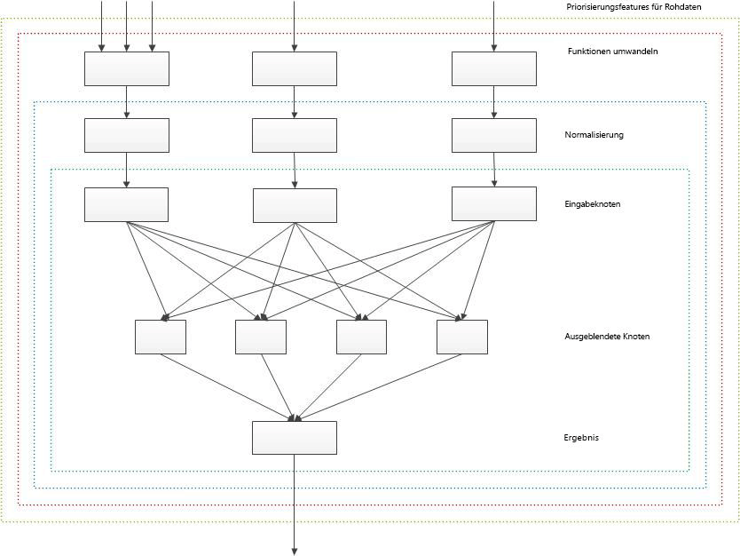

# <a name="customizing-ranking-models-to-improve-relevance-in-sharepoint"></a><span data-ttu-id="60df1-102">Anpassen von Bewertungsmodellen zur Verbesserung der Relevanz in SharePoint</span><span class="sxs-lookup"><span data-stu-id="60df1-102">Customizing ranking models to improve relevance in SharePoint</span></span>
<span data-ttu-id="60df1-103">Verbessern Sie die Suchrelevanz, indem Sie die Bewerungsmodelle so anpassen, dass das Bewertungsergebnis (Relevanzbewertung) mithilfe der Bewertungsfunktionen in SharePoint berechnet wird.</span><span class="sxs-lookup"><span data-stu-id="60df1-103">Improve search relevance by customizing ranking models to calculate rank scores (relevance rank) accurately using rank features in sps15short.</span></span>
<span data-ttu-id="60df1-104">Sie können [Suchergebnisse in SharePoint](sorting-search-results-in-sharepoint.md) auf vier verschiedene Arten sortieren, eine davon ist das Bewertungsergebnis.</span><span class="sxs-lookup"><span data-stu-id="60df1-104">You can [sort search results in SharePoint 2013](sorting-search-results-in-sharepoint.md) in four ways, one of which is by rank score. When you sort search results by rank score, sps15short places the most relevant results on top in the search result set.</span></span> <span data-ttu-id="60df1-105">Wenn Sie Suchergebnisse nach Bewertungsergebnis sortieren möchten, fügt SharePoint die relevantesten Suchergebnisse ganz oben im Suchergebnissatz ein.</span><span class="sxs-lookup"><span data-stu-id="60df1-105">You can sort search results in SharePoint 2013 in four ways, one of which is by rank score. When you sort search results by rank score, sps15short places the most relevant results on top in the search result set.</span></span>
  
    
    

<span data-ttu-id="60df1-p102">Ein Suchergebnis ist relevant, wenn es ein hohes Bewerungsergebnis erhält. Dabei handelt es sich um ein spezifisches numerisches Ergebnis, das vom Suchmodul eines Bewertungsmodells berechnet wird. Ein Bewertungsmodell ist eine Liste einer oder mehrerer Bewerungsstufen, die einen Satz Bewertungsfunktionen enthält. Das Bewertungsmodell definiert, wie das Suchmodul die Relevanzbewertung anhand verschiedener Faktoren berechnet, die im Bewerungsmodell als Bewertungsfunktionen dargestellt sind. Zu den für die Berechnung der Relevanzbewertung verwendeten Faktoren gehören folgende:</span><span class="sxs-lookup"><span data-stu-id="60df1-p102">A search result is relevant if it receives a high rank score, which is a specific numeric score calculated by the search engine using a ranking model. A ranking model is a list of one or more rank stages that contain a set of rank features. The ranking model defines how the search engine calculates the relevance rank using various factors, which are represented in the ranking model as rank features. Factors used to calculate the relevance rank include, but are not limited to, the following:</span></span>
  
    
    


- <span data-ttu-id="60df1-110">Die Darstellung der Abfragebegriffe im Fulltextindex, zu denen beispielsweise Informationen wie der Titel und Text eines Dokuments gehören.</span><span class="sxs-lookup"><span data-stu-id="60df1-110">The appearance of query terms in the full-text index, which includes information such as a document's title and body.</span></span>
    
  
- <span data-ttu-id="60df1-111">Die mit einem bestimmten Element verknüpften Metadaten, z. B. der Dateityp eines Dokuments oder die URL-Länge.</span><span class="sxs-lookup"><span data-stu-id="60df1-111">The metadata associated with a particular item, such as a document's file type or URL length.</span></span>
    
  
- <span data-ttu-id="60df1-112">Der mit den URL-Links verknüpfte Text, die auf ein bestimmtes Element verweist.</span><span class="sxs-lookup"><span data-stu-id="60df1-112">The anchor text associated with URL links that point to a particular item.</span></span>
    
  
- <span data-ttu-id="60df1-113">Die Informationen zu Benutzerklicks für jedes Element.</span><span class="sxs-lookup"><span data-stu-id="60df1-113">The information about user clicks for each item.</span></span>
    
  
- <span data-ttu-id="60df1-114">Die Annäherung an Abfragebegriffe im Text oder Titel eines Dokuments.</span><span class="sxs-lookup"><span data-stu-id="60df1-114">The proximity of query terms in a document's body or title.</span></span>
    
  

## <a name="start-your-ranking-model-customization-based-on-a-sharepoint-ranking-model-template"></a><span data-ttu-id="60df1-115">Starten der Bewertungsmodellanpassung basierend auf einer SharePoint-Bewertungsmodellvorlage</span><span class="sxs-lookup"><span data-stu-id="60df1-115">Start your ranking model customization based on a SharePoint ranking model template</span></span>
<span data-ttu-id="60df1-116"><a name="sp15_using_custom_ranking_model"> </a></span><span class="sxs-lookup"><span data-stu-id="60df1-116"></span></span>

<span data-ttu-id="60df1-117">Um die Anpassung einfacher zu gestalten, beginnen Sie damit, eine der Standard-Bewertungsmodelle in SharePoint als Vorlage zu verwenden.</span><span class="sxs-lookup"><span data-stu-id="60df1-117">To make your customization easier, start by using one of the default ranking models in SharePoint Server 2013 as a template. Then, modify that ranking model to suit your data set.</span></span> <span data-ttu-id="60df1-118">Passen Sie das Bewerungsmodell anschließend an Ihren Datensatz an.</span><span class="sxs-lookup"><span data-stu-id="60df1-118">Then, modify that ranking model to suit your data set.</span></span>
  
    
    
<span data-ttu-id="60df1-119">SharePoint enthält standardmäßig 14 Bewertungsmodelle.</span><span class="sxs-lookup"><span data-stu-id="60df1-119">SharePoint provides 14 ranking models by default.</span></span> <span data-ttu-id="60df1-120">Unter [Was ist ein Bewertungsmodell?](http://technet.microsoft.com/library/7c8ddec1-c8ff-4a90-afae-387b27a653f1.aspx#Ranking_Models)</span><span class="sxs-lookup"><span data-stu-id="60df1-120">See  [What is a ranking model?](http://technet.microsoft.com/library/7c8ddec1-c8ff-4a90-afae-387b27a653f1.aspx#Ranking_Models)</span></span> <span data-ttu-id="60df1-121">(auf TechNet) finden Sie ausführliche Informationen zu diesen Bewertungsmodellen und deren Zweck.</span><span class="sxs-lookup"><span data-stu-id="60df1-121">SharePoint Server 2013 provides 14 ranking models by default. See  What is a ranking model? (on TechNet) for detailed information about these ranking models and their purpose.</span></span>
  
    
    

> <span data-ttu-id="60df1-122">**Wichtig:** Wenn Sie das kumulative SharePoint-Update vom August 2013 installieren, sollten Sie das **Suchbewertungsmodell mit zwei linearen Stufen** als Basismodell für Ihr benutzerdefiniertes Bewertungsmodell verwenden.</span><span class="sxs-lookup"><span data-stu-id="60df1-122">**Important** If you install the SharePoint Server 2013 cumulative update of August 2013, we recommend using the **Search Ranking Model with Two Linear Stages** as the base model for your custom ranking model. The Search Ranking Model with Two Linear Stages is a copy of the Default Search Model with a linear second stage instead of a neural network second stage.</span></span> <span data-ttu-id="60df1-123">Das **Suchbewertungsmodell mit zwei linearen Stufen** ist eine Kopie des **Standardsuchmodells** mit einer linearen zweiten Stufe anstelle einer zweiten Stufe eines neuralen Netzwerks.</span><span class="sxs-lookup"><span data-stu-id="60df1-123">Important If you install the SharePoint Server 2013 cumulative update of August 2013, we recommend using the Search Ranking Model with Two Linear Stages as the base model for your custom ranking model. The **Search Ranking Model with Two Linear Stages** is a copy of the **Default Search Model** with a linear second stage instead of a neural network second stage.</span></span>
  
    
    

<span data-ttu-id="60df1-124">Verwenden Sie zum Anpassen von Bewertungsmodellen folgende Windows PowerShell-Cmdlets:</span><span class="sxs-lookup"><span data-stu-id="60df1-124">You use the following Windows PowerShell cmdlets to customize ranking models:</span></span>
  
    
    

-  <span data-ttu-id="60df1-125">
  [Get-SPEnterpriseSearchRankingModel](http://technet.microsoft.com/de-de/library/ff607990.aspx)</span><span class="sxs-lookup"><span data-stu-id="60df1-125">[Get-SPEnterpriseSearchRankingModel](http://technet.microsoft.com/de-de/library/ff607990.aspx)</span></span>
    
  
-  <span data-ttu-id="60df1-126">
  [New-SPEnterpriseSearchRankingModel](http://technet.microsoft.com/de-de/library/ff607980.aspx)</span><span class="sxs-lookup"><span data-stu-id="60df1-126">[New-SPEnterpriseSearchRankingModel](http://technet.microsoft.com/de-de/library/ff607980.aspx)</span></span>
    
  
-  <span data-ttu-id="60df1-127">
  [Remove-SPEnterpriseSearchRankingModel](http://technet.microsoft.com/de-de/library/ff608045.aspx)</span><span class="sxs-lookup"><span data-stu-id="60df1-127">[Remove-SPEnterpriseSearchRankingModel](http://technet.microsoft.com/de-de/library/ff608045.aspx)</span></span>
    
  
-  <span data-ttu-id="60df1-128">
  [Set-SPEnterpriseSearchRankingModel](http://technet.microsoft.com/de-de/library/ff607940.aspx)</span><span class="sxs-lookup"><span data-stu-id="60df1-128">[Set-SPEnterpriseSearchRankingModel](http://technet.microsoft.com/de-de/library/ff607940.aspx)</span></span>
    
  

### <a name="to-list-all-available-ranking-models"></a><span data-ttu-id="60df1-129">Auflisten aller verfügbaren Bewerungsmodelle</span><span class="sxs-lookup"><span data-stu-id="60df1-129">To list all available ranking models</span></span>


1. <span data-ttu-id="60df1-130">Öffnen Sie SharePoint-Verwaltungsshell als Administrator.</span><span class="sxs-lookup"><span data-stu-id="60df1-130">Open the SharePoint Management Shell as an Administrator.</span></span>
    
  
2. <span data-ttu-id="60df1-131">Führen Sie fogende Sequenz von Windows PowerShell-Cmdlets aus.</span><span class="sxs-lookup"><span data-stu-id="60df1-131">Run the following sequence of Windows PowerShell cmdlets.</span></span>
    
```powershell
  
$ssa = Get-SPEnterpriseSearchServiceApplication -Identity "Search Service Application"
$owner = Get-SPenterpriseSearchOwner -Level ssa
Get-SPEnterpriseSearchRankingModel -SearchApplication $ssa -Owner $owner
```


### <a name="to-retrieve-a-default-ranking-model-to-use-as-a-template"></a><span data-ttu-id="60df1-132">Aufrufen einer Standard-Bewerungsmodell zur Verwendung als Vorlage</span><span class="sxs-lookup"><span data-stu-id="60df1-132">To retrieve a default ranking model to use as a template</span></span>


1. <span data-ttu-id="60df1-133">Öffnen Sie SharePoint-Verwaltungsshell als Administrator.</span><span class="sxs-lookup"><span data-stu-id="60df1-133">Open the SharePoint Management Shell as an Administrator.</span></span>
    
  
2. <span data-ttu-id="60df1-134">Führen Sie folgende Sequenz von Windows PowerShell-Cmdlets aus;  *filename.xml*  ist der Name einer Datei, in der Sie das Bewertungsmodell speichern möchten.</span><span class="sxs-lookup"><span data-stu-id="60df1-134">Run the following sequence of Windows PowerShell cmdlets;  *filename.xml*  is the name of a file in which you want to save the ranking model.</span></span>
    
```powershell
  
$ssa = Get-SPEnterpriseSearchServiceApplication
$owner = Get-SPenterpriseSearchOwner -Level ssa
$defaultRankingModel = Get-SPEnterpriseSearchRankingModel -SearchApplication $ssa -Owner $owner | Where-Object { $_.IsDefault -eq $True }
$defaultRankingModel.RankingModelXML > filename.xml

```

<span data-ttu-id="60df1-135">Wenn Sie das kumulative Update von August 2013 für SharePoint installieren, können Sie folgendes Verfahren verwenden, um das Suchbewertungsmodell mit zwei linearen Stufen abzurufen, damit Sie es als Vorlage für Ihr benutzerdefiniertes Bewertungsmodell verwenden können.</span><span class="sxs-lookup"><span data-stu-id="60df1-135">If you install the SharePoint Server 2013 cumulative update of August 2013, you can use the following procedure to retrieve the search ranking model with two linear stages to use as a template for your custom ranking model.</span></span>
  
    
    

### <a name="to-retrieve-the-search-ranking-model-with-two-linear-stages-to-use-as-a-template"></a><span data-ttu-id="60df1-136">Aufrufen des Suchbewertungsmodells mit zwei linearen Stufen zur Verwendung als Vorlage</span><span class="sxs-lookup"><span data-stu-id="60df1-136">To retrieve the search ranking model with two linear stages to use as a template</span></span>


1. <span data-ttu-id="60df1-137">Öffnen Sie SharePoint-Verwaltungsshell als Administrator.</span><span class="sxs-lookup"><span data-stu-id="60df1-137">Open the SharePoint Management Shell as an Administrator.</span></span>
    
  
2. <span data-ttu-id="60df1-138">Führen Sie folgende Sequenz von Windows PowerShell-Cmdlets aus;  *filename.xml*  ist der Name einer Datei, in der Sie das Bewertungsmodell speichern möchten.</span><span class="sxs-lookup"><span data-stu-id="60df1-138">Run the following sequence of Windows PowerShell cmdlets;  *filename.xml*  is the name of a file in which you want to save the ranking model.</span></span>
    
```powershell
  
$ssa = Get-SPEnterpriseSearchServiceApplication
$owner = Get-SPenterpriseSearchOwner -Level ssa 
$twoLinearStagesRankingModel = Get-SPEnterpriseSearchRankingModel -SearchApplication $ssa -Owner $owner -Identity 5E9EE87D-4A68-420A-9D58-8913BEEAA6F2 
$twoLinearStagesRankingModel.RankingModelXML > filename.xml

```


### <a name="to-deploy-a-custom-ranking-model"></a><span data-ttu-id="60df1-139">Bereitstellen eines benutzerdefinierten Bewertungsmodells</span><span class="sxs-lookup"><span data-stu-id="60df1-139">To deploy a custom ranking model</span></span>


1. <span data-ttu-id="60df1-p106">Kopieren Sie aus der Liste der verfübaren Bewertungsmodelle die GUID des Bwertungsmodells, das Sie als Vorlage verwenden möchten. (Unter  [Auflisten aller verfügbaren Bewertungsmodelle](#sp15_list_available_ranking_models) finden Sie die Sequenz der zu verwendenden Windows PowerShell-Cmdlets).</span><span class="sxs-lookup"><span data-stu-id="60df1-p106">From the list of available ranking models, copy the GUID of the ranking model that you want to use as a template. (See  [To list all available ranking models](#sp15_list_available_ranking_models) for the sequence of Windows PowerShell cmdlets to use.)</span></span>
    
  
2. <span data-ttu-id="60df1-142">Führen Sie folgende Sequenz von Windows PowerShell-Cmdlets mithilfe der in Schritt für  _<GUID>_ kopierten GUID aus.</span><span class="sxs-lookup"><span data-stu-id="60df1-142">Run the following sequence of Windows PowerShell cmdlets using the GUID copied in step 1 for  _<GUID>_.</span></span>
    
```powershell
  
$ssa = Get-SPEnterpriseSearchServiceApplication
$owner = Get-SPenterpriseSearchOwner -Level ssa
$rm = Get-SPEnterpriseSearchRankingModel -Identity <GUID> -SearchApplication $ssa -Owner $owner
$rm.RankingModelXML > myrm.xml 

```

3. <span data-ttu-id="60df1-p107">Bearbeiten Sie die  `myrm.xml`-Datei in einem XML-Editor. Sie müssen neue GUID-Werte für die **id**-Attribute im  _RankModel2Stage_-Element und alle  _RankingModel2NN_-Elemente verwenden. Um einen neuen GUID-Wert abzurufen, können Sie beispielsweise folgenden Windows PowerShell-Befehl verwenden:  `[guid]::NewGuid()`</span><span class="sxs-lookup"><span data-stu-id="60df1-p107">Edit the  `myrm.xml` file in an XML editor. You must use new GUID values for the **id** attributes in _RankModel2Stage_ element and all _RankingModel2NN_ elements. To get a new GUID value you can for example use the following Windows PowerShell command: `[guid]::NewGuid()`</span></span>
    
  
4. <span data-ttu-id="60df1-146">Erstellen Sie ein neues Bewertungsmodell mit dem  [New-SPEnterpriseSearchRankingModel](http://technet.microsoft.com/de-de/library/ff607980.aspx)-Cmdlet, indem Sie folgende Befehle ausführen.</span><span class="sxs-lookup"><span data-stu-id="60df1-146">Create a new ranking model with the  [New-SPEnterpriseSearchRankingModel](http://technet.microsoft.com/de-de/library/ff607980.aspx) cmdlet by running the following commands.</span></span>
    
```powershell
  
$myRankingModel = Get-Content .\\myrm.xml
$myRankingModel = [String]$myRankingModel
$ssa = Get-SPEnterpriseSearchServiceApplication
$owner = Get-SPenterpriseSearchOwner -Level ssa
$newrm = New-SPEnterpriseSearchRankingModel -SearchApplication $ssa -Owner $owner -RankingModelXML $myRankingModel
```


### <a name="rank-detail"></a><span data-ttu-id="60df1-147">Bewertungsdetail</span><span class="sxs-lookup"><span data-stu-id="60df1-147">Rank detail</span></span>


> <span data-ttu-id="60df1-148">**Wichtig:** Die Bewertungsdetails und die begleitende ExplainRank-Seite werden hier der Einfachheit halber bereitgestellt, um Sie bei der Optimierung und beim Debuggen Ihrer eigenen benutzerdefinierten Bewertungsmodelle zu unterstützen.</span><span class="sxs-lookup"><span data-stu-id="60df1-148">**Important** We provide the rank detail and the accompanying ExplainRank page as a convenience and only to assist you in tuning and debugging your own custom ranking models. The contents of the rank detail and the accompanying ExplainRank page are not supported, and are subject to change without notice in future software patches and updates.</span></span> <span data-ttu-id="60df1-149">Die Inhalte der Bewertungsdetails und die begleitende ExplainRank-Seite werden nicht unterstützt und können ohne vorherige Ankündigung in künftigen Softwarepatches und -updates geändert werden.</span><span class="sxs-lookup"><span data-stu-id="60df1-149">Important We provide the rank detail and the accompanying ExplainRank page as a convenience and only to assist you in tuning and debugging your own custom ranking models. The contents of the rank detail and the accompanying ExplainRank page are not supported, and are subject to change without notice in future software patches and updates.</span></span> 
  
    
    

<span data-ttu-id="60df1-p109">Das Bewertungsdetail ist ein XML-Dokument, das detaillierte Informationen zur Berechnung des Bewertungsergebnisses für ein einzelnes Element bereitstellt, das mit einer angegebenen Benutzer-Abfrage übereinstimmt. Das Bewertungsdetail wird in einer speziell verwalteten Eigenschaft mit der Bezeichnung **rankdetail** gespeichert.</span><span class="sxs-lookup"><span data-stu-id="60df1-p109">The rank detail is an XML document that provides detailed information about rank score calculation for a single item that matches a given user query. The rank detail is stored in a special managed property, called **rankdetail**.</span></span> 
  
    
    
<span data-ttu-id="60df1-p110">Jede Bewertungsfunktion in einem Bewertungsmodell besitzt einen separaten XML-Knoten im Bewertungsdetail, das Details zur Berechnung des Bewertungsergebnisses beschreibt. Das Bewertungsdetail wird nur für Abfragen bereitgestellt, die Suchergebnisse mit höchstens 100 Elementen aufweisen.</span><span class="sxs-lookup"><span data-stu-id="60df1-p110">Each rank feature in a ranking model has a separate XML node in the rank detail that describes details of the rank score calculation. The rank detail is provided only for queries that have search results that don't exceed 100 items.</span></span>
  
    
    
<span data-ttu-id="60df1-154">Das Konzept des Gesamtformats des Bewertungsdetails ist im folgenden Beispiel dargestellt.</span><span class="sxs-lookup"><span data-stu-id="60df1-154">Conceptually, the overall format of the rank detail looks like the following example.</span></span>
  
    
    


```xml

<rank_log version='15.0.0000.1000' id='[internal guid of ranking model used for calculation]' >
    <query tree='[representation of user query used for ranking]'/>
    <stage type='linear'>
        [Details of rank calculation of the first ranking stage. One XML node for each rank feature.]
        <stage_model>
            [Definition of the first stage of the ranking model]
        </stage_model>
    </stage>
    <stage type='neural_net' >
        [Details of rank calculation of the second ranking stage. One XML node for each rank feature.]
        <stage_model>
            [Definition of the second stage of the ranking model]
        </stage_model>
    </stage>
</rank_log>
```

<span data-ttu-id="60df1-155">Um das Bewertungsdetail abzurufen, müssen Sie der Administrator der Suchdienstanwendung sein.</span><span class="sxs-lookup"><span data-stu-id="60df1-155">To retrieve the rank detail, you need to be the administrator of the Search service application (SSA).</span></span>
  
    
    

### <a name="to-retrieve-the-rank-detail"></a><span data-ttu-id="60df1-156">Abrufen des Bewertungsdetails</span><span class="sxs-lookup"><span data-stu-id="60df1-156">To retrieve the rank detail</span></span>
<span data-ttu-id="60df1-157"><a name="sp15_list_available_ranking_models"> </a></span><span class="sxs-lookup"><span data-stu-id="60df1-157"></span></span>

1. <span data-ttu-id="60df1-158">Öffnen Sie die SharePoint-Verwaltungsshell als Administrator.</span><span class="sxs-lookup"><span data-stu-id="60df1-158">Open the SharePoint Management Shell as an Administrator.</span></span>
    
  
2. <span data-ttu-id="60df1-159">Führen Sie folgende Sequenz von Windows PowerShell-Cmdlets aus und tauschen Sie  _<query_text>_ und _<url>_ durch tatsächliche Werte aus.</span><span class="sxs-lookup"><span data-stu-id="60df1-159">Run the following sequence of Windows PowerShell cmdlets, and substitute  _<query_text>_ and _<url>_ with actual values.</span></span>
    
```powershell
  
$app = Get-SPEnterpriseSearchServiceApplication
$searchAppProxy =  Get-spenterprisesearchserviceapplicationproxy | Where-Object { ($_.ServiceEndpointUri.PathAndQuery -like $app.Uri.PathAndQuery)}
$request = New-Object Microsoft.Office.Server.Search.Query.KeywordQuery($searchAppProxy)
$request.ResultTypes = [Microsoft.Office.Server.Search.Query.ResultType]::RelevantResults
$request.QueryText = "<query_text> AND path:""<url>"""
$request.SelectProperties.Add("rankdetail")
$searchexecutor = new-Object Microsoft.Office.Server.Search.Query.SearchExecutor 
$resultTables = $searchexecutor.ExecuteQuery($request) 
$resultTables[([Microsoft.Office.Server.Search.Query.ResultType]::RelevantResults)].Table

```


### <a name="understanding-the-rank-score-calculation-via-the-explainrank-page"></a><span data-ttu-id="60df1-160">Grundlegendes zur Berechnung des Bewertungsergebnisses über die ExplainRank-Seite</span><span class="sxs-lookup"><span data-stu-id="60df1-160">Understanding the rank score calculation via the ExplainRank page</span></span>

<span data-ttu-id="60df1-161">SharePoint stellt die **ExplainRank**-Seite bereit, die sich im Ordner „Layouts“ befindet (`<searchCenter>/_layouts/15/`).</span><span class="sxs-lookup"><span data-stu-id="60df1-161">SharePoint provides the **ExplainRank** page that is located in the layouts folder ( `<searchCenter>/_layouts/15/`).</span></span> <span data-ttu-id="60df1-162">Diese Seite enthält ausführliche Informationen zum Bewertungsergebnis für jede Bewertungsfunktion basierend auf einer bestimmten Suchabfrage, einer Dokument-ID und einer optionalen Bewertungsmodell-ID.</span><span class="sxs-lookup"><span data-stu-id="60df1-162">sps15short provides the ExplainRank page that is located in the layouts folder (<searchCenter>/_layouts/15/). This page contains detailed information on the rank score for each rank feature based on a given search query, a document ID, and an optional ranking model ID. The information is obtained and parsed from the rank detail.</span></span> <span data-ttu-id="60df1-163">Die Informationen werden aus dem Bewertungsdetail abgerufen und analysiert.</span><span class="sxs-lookup"><span data-stu-id="60df1-163">The information is obtained and parsed from the rank detail.</span></span>
  
    
    
<span data-ttu-id="60df1-164">Sie können über folgende URL auf die  **ExplainRank**-Seite zugreifen:</span><span class="sxs-lookup"><span data-stu-id="60df1-164">You can access the **ExplainRank** page with the following URL:</span></span>
  
    
    
 `http://<searchCenter>/_layouts/15/ExplainRank.aspx?q={x}&amp;d={y}&amp;rm={z}`
  
    
    
<span data-ttu-id="60df1-165">Dabei gilt Folgendes:</span><span class="sxs-lookup"><span data-stu-id="60df1-165">Where:</span></span>
  
    
    

-  <span data-ttu-id="60df1-166">*x*  ist die Suchabfrage.</span><span class="sxs-lookup"><span data-stu-id="60df1-166">*x*  is the search query.</span></span>
    
  
-  <span data-ttu-id="60df1-167">*y*  ist die Dokument-ID.</span><span class="sxs-lookup"><span data-stu-id="60df1-167">*y*  is the document ID.</span></span>
    
  
-  <span data-ttu-id="60df1-p112">*z*  ist die optionale Bewertungsmodell-ID. Wenn keine Bewertungsmodell-ID bereitgestellt wird, wird das Standard-Bewertungsmodell verwendet.</span><span class="sxs-lookup"><span data-stu-id="60df1-p112">*z*  is the optional ranking model ID. If no ranking model ID is provided, the default ranking model is used.</span></span>
    
  
<span data-ttu-id="60df1-170">Genau wie bei dem Bewertungsdetail müssen Sie auch zum Anzeigen der **ExplainRank**-Seite der Administrator der Suchdienstanwendung sein.</span><span class="sxs-lookup"><span data-stu-id="60df1-170">Just like with the rank detail, to view the **ExplainRank** page, you need to be the administrator of the Search service application (SSA).</span></span>
  
    
    

## <a name="tune-your-ranking-model-with-rank-features"></a><span data-ttu-id="60df1-171">Optimieren Ihres Bewertungsmodells mit Bewertungsfunktionen</span><span class="sxs-lookup"><span data-stu-id="60df1-171">Tune your ranking model with rank features</span></span>
<span data-ttu-id="60df1-172"><a name="sp15_rank_features"> </a></span><span class="sxs-lookup"><span data-stu-id="60df1-172"></span></span>

<span data-ttu-id="60df1-173">Bewertungsfunktionen funktionieren wie Optimierungsskalen für ein Bewertungsmodell. </span><span class="sxs-lookup"><span data-stu-id="60df1-173">Rank features work like tuning dials for a ranking model.</span></span> <span data-ttu-id="60df1-174">In den folgenden Abschnitten werden die Bewertungsfunktionen beschrieben, die im SharePoint-Standardbewertungsmodell verfügbar sind und welche Rolle Sie bei der Berechnung der Relevanzbewertung spielen.</span><span class="sxs-lookup"><span data-stu-id="60df1-174">Rank features work like tuning dials for a ranking model. The following sections describe the rank features that are available in the default SharePoint Server 2013 ranking model and how they contribute to relevance rank calculation.</span></span>
  
    
    

### <a name="bm25"></a><span data-ttu-id="60df1-175">BM25</span><span class="sxs-lookup"><span data-stu-id="60df1-175">BM25</span></span>

<span data-ttu-id="60df1-p114">Die BM25-Bewertungsfunktion bewertet Elemente basierend auf der Anzeige der Abfragebegriffe im Volltextindex. Die Eingabe in BM25 kann eine beliebige der verwalteten Eigenschaften im Volltextindex sein.</span><span class="sxs-lookup"><span data-stu-id="60df1-p114">The BM25 rank feature ranks items based on the appearance of query terms in the full-text index. The input to BM25 can be any of the managed properties in the full-text index.</span></span>
  
    
    

> <span data-ttu-id="60df1-178">**Hinweis:** Die in diesem Kontext verwendete BM25-Bewertungsfunktion ist die Feldversion BM25F.</span><span class="sxs-lookup"><span data-stu-id="60df1-178">**Note** The BM25 rank feature used in this context is the fielded version, BM25F.</span></span> 
  
    
    

<span data-ttu-id="60df1-179">Die BM25-Bewertungsfunktion berechnet das Relevanzbewertungsergebnis anhand der folgenden Formel.</span><span class="sxs-lookup"><span data-stu-id="60df1-179">The BM25 rank feature calculates the relevance rank score using the following formula.</span></span>
  
    
    

  
    
    

  
    
    
<span data-ttu-id="60df1-181">Dabei gilt Folgendes:</span><span class="sxs-lookup"><span data-stu-id="60df1-181">Where:</span></span>
  
    
    

-  <span data-ttu-id="60df1-182">_D_ ist ein Dokument, das als Liste von Textfeldern wie beispielsweise der Titel oder Text des Dokuments dargestellt wird.</span><span class="sxs-lookup"><span data-stu-id="60df1-182">_D_ is a document, represented as a list of textual fields such as the title or body.</span></span>
    
  
-  <span data-ttu-id="60df1-183">_Q_ ist die Benutzerabfrage, die als Liste von Abfragebegriffen dargestellt wird, _t_.</span><span class="sxs-lookup"><span data-stu-id="60df1-183">_Q_ is the user query, represented as a list of query terms, _t_.</span></span>
    
  
-  <span data-ttu-id="60df1-184">_S_ definiert die Liste von Feldern, die Anteil an der Relevanzbewertung haben; diese Liste wird durch das Bewertungsmodell definiert.</span><span class="sxs-lookup"><span data-stu-id="60df1-184">_S_ defines the list of fields that contribute to relevance ranking; this list is defined by the ranking model.</span></span>
    
  
-  <span data-ttu-id="60df1-185">_w_f ist ein numerischer Wert, der das relative Gewicht des Felds _f_ ???</span><span class="sxs-lookup"><span data-stu-id="60df1-185">_w_f is a numeric value that defines the relative weight of the field _f_ ∈ S; this value is defined by the ranking model.</span></span> <span data-ttu-id="60df1-186">_S_ definiert; dieser Wert wird durch das Bewertungsmodell definiert.</span><span class="sxs-lookup"><span data-stu-id="60df1-186">_S_; this value is defined by the ranking model.</span></span>
    
  
-  <span data-ttu-id="60df1-187">_b_f ist ein numerischer Wert, der die Dokumentlänge-Normalisierung für jedes Feld  _f_ ???</span><span class="sxs-lookup"><span data-stu-id="60df1-187">_b_f is a numeric value that defines the document length normalization for each field _f_ ∈ S.</span></span> <span data-ttu-id="60df1-188">_S_ definiert.</span><span class="sxs-lookup"><span data-stu-id="60df1-188">s</span></span>
    
  
-  <span data-ttu-id="60df1-189">_TF_f _(t,D)_ ist die Anzahl von Vorkommnissen des Abfragebegriffs _t_ im Feld _f_ des Dokuments _D_.</span><span class="sxs-lookup"><span data-stu-id="60df1-189">_TF_f _(t,D)_ is the number of occurrences of query term _t_ in the field _f_ of document _D_.</span></span>
    
  
-  <span data-ttu-id="60df1-190">_DL_f _(D)_ ist die Gesamtanzahl Wörter im Feld _f_ des Dokuments _D_.</span><span class="sxs-lookup"><span data-stu-id="60df1-190">_DL_f _(D)_ is the total number of words in field _f_ of document _D_.</span></span>
    
  
-  <span data-ttu-id="60df1-191">_N_ ist die Gesamtanzahl von Dokumenten im Index.</span><span class="sxs-lookup"><span data-stu-id="60df1-191">_N_ is the total amount of documents in the index.</span></span>
    
  
-  <span data-ttu-id="60df1-192">_n_tist eine Menge von Dokumenten, bei denen der Begriff  _t_ in mindestens einer der Eigenschaften enthalten ist.</span><span class="sxs-lookup"><span data-stu-id="60df1-192">_n_t is an amount of documents that have term _t_ in at least one of their properties.</span></span>
    
  
-  <span data-ttu-id="60df1-193">_AVDL_fist der der durchschnittliche  _DL_f _(D)_ aller indizierten Dokumente.</span><span class="sxs-lookup"><span data-stu-id="60df1-193">_AVDL_f is the average _DL_f _(D)_ across all indexed documents.</span></span>
    
  
-  <span data-ttu-id="60df1-194">_k_1ist ein skalierbarer Parameter; dieser Wert wird durch das Bewertungsmodell definiert.</span><span class="sxs-lookup"><span data-stu-id="60df1-194">_k_1 is a scalar parameter; this value is defined by the ranking model.</span></span>
    
  
<span data-ttu-id="60df1-195">Sie müssen dem Standard-Volltextindex die für die BM25-Bewertungsfunktion verwendeten verwalteten Eigenschaften im Benutzeroberflächen-Steuerelement **Erweiterte durchsuchbare Einstellungen auswählen** zuweisen.</span><span class="sxs-lookup"><span data-stu-id="60df1-195">You must map the managed properties used for the BM25 rank feature to the default full-text index in the **Choose advanced searchable settings** UI.</span></span>
  
    
    
<span data-ttu-id="60df1-196">Innerhalb einer Benutzerabfrage werden Abfragebegreiffe, die Teil der folgenden Operatoren sind, von den Relevanzbewertungsberechnungen ausgeschlossen:  `NOT(???)` in FQL, `NOT(???)` in KQL und `FILTER(???)` in FQL.</span><span class="sxs-lookup"><span data-stu-id="60df1-196">Within a user query, query terms that are part of the following operators are excluded from relevance rank calculations:  `NOT(???)` in FQL, `NOT(???)` in KQL, and `FILTER(???)` in FQL.</span></span>
  
    
    
<span data-ttu-id="60df1-197">Außerdem werden im Bereich liegende Abfragebegriffe, z. B.  `title:apple AND body:orange`, aus den Relevanzbewertungsberechnungen ausgeschlossen.</span><span class="sxs-lookup"><span data-stu-id="60df1-197">In addition, query terms that are under scope, for example,  `title:apple AND body:orange`, are excluded from relevance rank calculations.</span></span>
  
    
    
 <span data-ttu-id="60df1-198">**Beispieldefinition einer BM25-Bewertungsfunktion**</span><span class="sxs-lookup"><span data-stu-id="60df1-198">**Example BM25 rank feature definition**</span></span>
  
    
    


```xml

<BM25Main name="ContentRank" k1="1">
    <Layer1Weights>
        <Weight>0.26236235707678</Weight>
    </Layer1Weights>
    <Properties>
        <Property name="body" w="0.019391078235467" b="0.44402228898786156" propertyName="body" />
        <Property name="Title" w="0.36096989709360422" b="0.38179554361297785" propertyName="Title" />
        <Property name="Author" w="0.15808522836934547" b="0.13896219383271818" propertyName="Author" />
        <Property name="Filename" w="0.15115036355698144" b="0.96245017871125826" propertyName="Filename" />
        <Property name="QLogClickedText" w="0.3092664171701901" b="0.056446823262849853" propertyName="QLogClickedText" />
        <Property name="AnchorText" w="0.021768362296187508" b="0.74173561196103566" propertyName="AnchorText" />
        <Property name="SocialTag" w="0.10217215754116529" b="0.55968554315932328" propertyName="SocialTag" />
    </Properties>
</BM25Main>
```

 <span data-ttu-id="60df1-199">**Beispiel-Bewertungsdetail für das BM25-Bewertungsfunktion**</span><span class="sxs-lookup"><span data-stu-id="60df1-199">**Example rank detail for BM25 rank feature**</span></span>
  
    
    


```xml

<bm25 name='ContentRank'>
<schema pid_mapping='[1:content::7:%default] [2:content::1:%default] [3:content::5:%default] [56:content::2:%default] [100:content::3:link] [10:content::6:link] [264:content::14:link] ' pids_not_mapped=''/>
<query_term term='WORDS(content:integration, content:integrations, content:integrations)'>
    <index name='content' N='10035' n='8'
           avdl='1 2.98018 2.00427 1 1 2.39394 1 637.308 1 1 1 1 1 1 1 1 '>
        <group id='%default'
               ext_doc_id='55' int_doc_id='16' precalc='0' tf_prime='0.500486' weight='1'
               tf='0 1 1 0 0 0 0 11 0 0 0 0 0 0 0 0 '
               dl='0 4 9 0 0 2 0 1291 0 0 0 0 0 0 0 0 '/>
        <group id='link'/>
    </index>
    <rank score='2.37967' score_acc='2.37967' term_weight='7.13439'/>
</query_term>

<query_term term='WORDS(content:effort, content:efforts, content:efforts)'>
    <index name='content' N='10035' n='9'
           avdl='1 2.98018 2.00427 1 1 2.39394 1 637.308 1 1 1 1 1 1 1 1 '>
        <group id='%default'/>
        <group id='link'/>
    </index>
    <rank score='0' score_acc='2.37967' term_weight='7.01661'/>
</query_term>

<query_term term='PHRASE(content:fastserver, content:plugin)'>
    <index name='content' N='10035' n='3'
           avdl='1 2.98018 2.00427 1 1 2.39394 1 637.308 1 1 1 1 1 1 1 1 '>
        <group id='%default'
               ext_doc_id='55' int_doc_id='16' precalc='0' tf_prime='0.0399696' weight='1'
               tf='0 0 0 0 0 0 0 3 0 0 0 0 0 0 0 0 '
               dl='0 4 9 0 0 2 0 1291 0 0 0 0 0 0 0 0 '/>
        <group id='link'/>
    </index>
    <rank score='0.311896' score_acc='2.69157' term_weight='8.11522'/>
</query_term>
<final score='2.69157' transformed='2.69157' normalized='2.69157' hidden_nodes_adds='0.706166 '/>
</bm25>

```


#### <a name="weight-groups"></a><span data-ttu-id="60df1-200">Gewichtungsgruppen</span><span class="sxs-lookup"><span data-stu-id="60df1-200">Weight groups</span></span>

<span data-ttu-id="60df1-p117">In einem benutzerdefinierten Bewertungsmodell können Sie zwei oder mehr verwaltete Eigenschaften besitzen, die der gleichen Gewichtungsgruppe im Suchschema zugeordnet sind. In solchen Fällen werden die Inhalte dieser verwalteten Eigenschaften im Volltextindex kombiniert und können nicht separat in der BM25-Berechnung bewertet werden. Dieser Effekt entspricht dem Festlegen der gleichen Werte für den  _w_fund  _b_fParameter innerhalb der einzelnen Gruppen der verwalteten Eigenschaften, werden der gleichen Gewichtungsgruppe im Suchschema zugeordnet. Um dies zu verhindern, müssen Sie die verwalteten Eigenschaften einer der 16 verschiedenen Gewichtungsgruppen zuordnen, die im Suchschema verfügbar sind.</span><span class="sxs-lookup"><span data-stu-id="60df1-p117">In a custom ranking model, you can have two or more managed properties that are mapped to the same weight group in the search schema. In such cases, content of these managed properties is combined in the full-text index and can't be ranked separately in BM25 calculation. This effect is the same as setting equal values for the  _w_f and _b_f parameters within each group of managed properties, mapped to the same weight group in the search schema. To prevent this, map managed properties to one of the 16 different weight groups available in the search schema.</span></span>
  
    
    
<span data-ttu-id="60df1-p118">Gewichtungsgruppen werden auch als Kontext bezeichnet. Weitere Informationen zur Beziehung zwischen einer verwalteten Eigenschaft und ihrem Kontext finden Sie auf TechNet unter  [Beeinflussen der Bewerung von Suchergebnissen durch die Verwendung des Suchschemas](http://technet.microsoft.com/library/7c8ddec1-c8ff-4a90-afae-387b27a653f1.aspx#Ranking_Schema).</span><span class="sxs-lookup"><span data-stu-id="60df1-p118">Weight groups are also known as context. See  [Influencing the ranking of search results by using the search schema](http://technet.microsoft.com/library/7c8ddec1-c8ff-4a90-afae-387b27a653f1.aspx#Ranking_Schema) (on TechNet) for more information about the relationship between a managed property and its context.</span></span>
  
    
    

### <a name="static"></a><span data-ttu-id="60df1-207">Statisch</span><span class="sxs-lookup"><span data-stu-id="60df1-207">Static</span></span>

<span data-ttu-id="60df1-p119">Die statische Bewertungsfunktion bewertet die Elemente basierend auf numerischen verwalteten Eigenschaften, die im Suchindex gespeichert werden. Die zur Relevanzbewertungsberechnung in statischen Bewertungsfunktionen verwendeten numerischen verwalteten Eigenschaften müssen den Typ  [Integer](https://msdn.microsoft.com/library/System.Integer.aspx) besitzen und im Suchschema auf [Refinable](https://msdn.microsoft.com/library/Microsoft.Office.Server.Search.Administration.ManagedProperty.Refinable.aspx) oder [Sortable](https://msdn.microsoft.com/library/Microsoft.Office.Server.Search.Administration.ManagedProperty.Sortable.aspx) festgelegt sein. Sie können keine verwalteten Eigenschaften mit mehreren Werten in Kombination mit der statischen Bewertungsfunktion verwenden.</span><span class="sxs-lookup"><span data-stu-id="60df1-p119">The static rank feature ranks items based on numeric managed properties that are stored in the search index. The numeric managed properties used for relevance rank calculation in static rank features must be of type  [Integer](https://msdn.microsoft.com/library/System.Integer.aspx) and set to [Refinable](https://msdn.microsoft.com/library/Microsoft.Office.Server.Search.Administration.ManagedProperty.Refinable.aspx) or [Sortable](https://msdn.microsoft.com/library/Microsoft.Office.Server.Search.Administration.ManagedProperty.Sortable.aspx) in the search schema. You can't use multivalued managed properties in combination with the static rank feature.</span></span>
  
    
    
<span data-ttu-id="60df1-p120">Bevor die statische Bewertungsfunktion kann mit anderen Bewertungsfunktionen aggregiert werden, wird jede statische Bewertungsfunktion über eine einzelne Transformation vorverarbeitet. Tabelle 1 listet alle unterstützten Transformationsfunktionen auf.</span><span class="sxs-lookup"><span data-stu-id="60df1-p120">Before the static rank feature can be aggregated with other rank features, each static rank feature is preprocessed via a single transformation. Table 1 lists all supported transform functions.</span></span>
  
    
    

<span data-ttu-id="60df1-213">**Tabelle 1. Unterstützte Transformationsfunktionen für die statischen und Näherungsbewertungsfunktionen**</span><span class="sxs-lookup"><span data-stu-id="60df1-213">**Table 1. Supported transform functions for the static and proximity rank features**</span></span>

    
    

  
    
    
 <span data-ttu-id="60df1-215">**Beispieldefinition einer statischen Bewertungsfunktion**</span><span class="sxs-lookup"><span data-stu-id="60df1-215">**Example static rank feature definition**</span></span>
  
    
    


```xml

<Static name="clickdistance" default="5" propertyName="clickdistance">
    <Transform type="InvRational" k="0.27618729159042193" />
    <Layer1Weights>
        <Weight>0.616326852981262</Weight>
    </Layer1Weights>
</Static>

```

 <span data-ttu-id="60df1-216">**Beispiel-Bewertungsdetail für eine statische Bewertungsfunktion**</span><span class="sxs-lookup"><span data-stu-id="60df1-216">**Example rank detail for a static rank feature**</span></span>
  
    
    


```xml

<static_feature name='clickdistance' property_name='clickdistance'
    used_default='1' raw_value='5' raw_value_transformed='5' 
    transformed='0.420003' normalized='0.420003'
    hidden_nodes_adds='0.258859 '/>

```


### <a name="bucketed-static"></a><span data-ttu-id="60df1-217">Zusammengefasste Statik</span><span class="sxs-lookup"><span data-stu-id="60df1-217">Bucketed static</span></span>

<span data-ttu-id="60df1-p121">Die zusammengefasste Statik-Bewertungsfunktion bewertet Dokumente basierend auf dem Dateityp und der Sprache. Die Definition einer zusammengefassten Statik-Bewertungsfunktion innerhalb eines Bewertungsmodells hängt davon ab, ob die Bewertungsfunktion Teil eines linearen Modells oder neuralen Netzwerks ist. Die folgenden Beispiele gelten nur für lineare Modelle. Bei neuralen Netzwerken muss die Anzahl der  `<Add>`-Attribute für jeden Bucket mit der Anzahl der versteckten Knoten im neuralen Netzwerk übereinstimmen.</span><span class="sxs-lookup"><span data-stu-id="60df1-p121">The bucketed static rank feature ranks documents based on their file type and language. The definition of a bucketed static rank feature within a ranking model depends on whether the rank feature is part of a linear model or a neural network. The following examples apply only to linear models. For neural networks, the number of  `<Add>` attributes for each bucket must match the number of hidden nodes in the neural network.</span></span>
  
    
    
<span data-ttu-id="60df1-p122">Die zur Relevanzbewertungsberechnung verwendeten verwalteten Eigenschaften in den zusammengefassten Statik-Bewertungsfunktionen müssen den Typ  [Integer](https://msdn.microsoft.com/library/System.Integer.aspx) besitzen und im Suchschema auf [Refinable](https://msdn.microsoft.com/library/Microsoft.Office.Server.Search.Administration.ManagedProperty.Refinable.aspx) oder [Sortable](https://msdn.microsoft.com/library/Microsoft.Office.Server.Search.Administration.ManagedProperty.Sortable.aspx) festgelegt werden. Sie können keine verwalteten Eigenschaften mit mehreren Werten in Kombination mit der zusammengefassten Statik-Bewertungsfunktion verwenden.</span><span class="sxs-lookup"><span data-stu-id="60df1-p122">The managed properties used for relevance rank calculation in bucketed static rank features must be of type  [Integer](https://msdn.microsoft.com/library/System.Integer.aspx) and set to [Refinable](https://msdn.microsoft.com/library/Microsoft.Office.Server.Search.Administration.ManagedProperty.Refinable.aspx) or [Sortable](https://msdn.microsoft.com/library/Microsoft.Office.Server.Search.Administration.ManagedProperty.Sortable.aspx) in the search schema. You can't use multivalued managed properties in combination with the bucketed static rank feature.</span></span>
  
    
    
 <span data-ttu-id="60df1-224">**Beispieldefinition einer zusammengefassten Statik-Beweretungsfunktion für den Dateityp**</span><span class="sxs-lookup"><span data-stu-id="60df1-224">**Example bucketed static rank feature definition for file type**</span></span>
  
    
    
<span data-ttu-id="60df1-p123">Jedem Dokument ist ein Dateityp zugewiesen, den die Inhaltsverarbeitungskomponente erkennt und im Suchindex als nullbasierten Ganzzahlwert speichert. Wenn Sie die zusammengefasste Statik-Bewertungsfunktion verwenden, um Dokumente basierend auf den Dateitypen zu bewerten, erhält jeder Dokumenttyp ein bestimmte Relevanzbewertungsergebnis. In der folgenden Definition entspricht das Bucket beispielsweise **2** einem PPT-Dokument; der Knoten `<Add>0.680984743282165</Add>` definiert zusätzliche Bewertungspunkte, die für alle PPT-Dokumente zu den Relevanzbewertungsergebnissen hinzugefügt werden.</span><span class="sxs-lookup"><span data-stu-id="60df1-p123">Every document has an associated file type that the content processing component detects and stores in the search index as a zero-based integer value. When you use the bucketed static rank feature to rank documents based on their file types, each document type is associated with a specific relevance rank score. For example, in the following definition, the bucket **2** corresponds to a .ppt document; the node `<Add>0.680984743282165</Add>` defines additional rank points that are added to the relevance rank scores for all .ppt documents.</span></span>
  
    
    


```xml

<BucketedStatic name="InternalFileType" default="0" propertyName="InternalFileType">
    <Bucket name="Html" value="0">
        <HiddenNodesAdds>
            <Add>0.464062832328107</Add>
        </HiddenNodesAdds>
    </Bucket>
    <Bucket name="Doc" value="1">
        <HiddenNodesAdds>
            <Add>0.551558196047853</Add>
        </HiddenNodesAdds>
    </Bucket>
    <Bucket name="Ppt" value="2">
        <HiddenNodesAdds>
            <Add>0.680984743282165</Add>
        </HiddenNodesAdds>
    </Bucket>
    <Bucket name="Xls" value="3">
        <HiddenNodesAdds>
            <Add>-0.143152682829863</Add>
        </HiddenNodesAdds>
    </Bucket>
    <Bucket name="Xml" value="4">
        <HiddenNodesAdds>
            <Add>-1.29219869408375</Add>
        </HiddenNodesAdds>
    </Bucket>
    <Bucket name="Txt" value="5">
        <HiddenNodesAdds>
            <Add>-0.456669562992298</Add>
        </HiddenNodesAdds>
    </Bucket>
    <Bucket name="ListItems" value="6">
        <HiddenNodesAdds>
            <Add>0.170944938307345</Add>
        </HiddenNodesAdds>
    </Bucket>
    <Bucket name="Message" value="7">
        <HiddenNodesAdds>
            <Add>-0.0666769377412764</Add>
        </HiddenNodesAdds>
    </Bucket>
    <Bucket name="Image" value="8">
        <HiddenNodesAdds>
            <Add>0.106988843357609</Add>
        </HiddenNodesAdds>
    </Bucket>
</BucketedStatic>
```

 <span data-ttu-id="60df1-228">**Beispieldefinition einer zusammengefassten Statik-Bewertung für die Dokumentensprache**</span><span class="sxs-lookup"><span data-stu-id="60df1-228">**Example bucketed static rank feature definition for document language**</span></span>
  
    
    
<span data-ttu-id="60df1-p124">Die Inhaltsverarbeitungskomponente erkennt die Sprache für jedes Dokument automatisch, bevor es zum Suchindex hinzugefügt wird. Wenn Sie die zusammengefasste Statik-Bewertungsfunktion zum Bewerten von Dokumenten basierend auf der Sprache verwenden, können Sie definieren, wie das Bewertungsergebnis so berechnet werden kann, dass dabei basierend auf der Sprache des Dokuments, die automatisch erkannt wurde, berücksichtigt wird, ob sie mit der Sprache der Abfrage übereinstimmt.</span><span class="sxs-lookup"><span data-stu-id="60df1-p124">The content processing component detects the language for each document automatically before it's added to the search index. When you use the bucketed static rank feature to rank documents based on their language, you can define how to calculate the rank score based on whether the document's language that was automatically detected matches the query's language.</span></span>
  
    
    
<span data-ttu-id="60df1-231">Zum Abfragezeitpunkt werden Informationen über die Sprache des Benutzers als Abfrageeigenschaft in das Suchmodul geschrieben.</span><span class="sxs-lookup"><span data-stu-id="60df1-231">At query time, information about the user's language is written to the search engine as a query property.</span></span> 
  
    
    

### <a name="proximity"></a><span data-ttu-id="60df1-232">Näherung</span><span class="sxs-lookup"><span data-stu-id="60df1-232">Proximity</span></span>

<span data-ttu-id="60df1-233">Die Bewertungsfunktion „Näherung“ bewertet Elemente in Abhängigkeit von der Entfernung zwischen Abfrageausdrücken innerhalb des Volltextindex.</span><span class="sxs-lookup"><span data-stu-id="60df1-233">The proximity rank feature ranks items depending on the distance between query terms inside the full-text index.</span></span> <span data-ttu-id="60df1-234">Das Bewertungsergebnis wird erhöht, wenn zwei Abfrageausdrücke in denselben verwalteten Eigenschaften innerhalb des Volltextindex vorhanden sind.</span><span class="sxs-lookup"><span data-stu-id="60df1-234">The rank score is boosted if two query terms appear in the same managed properties within the full-text index.</span></span> <span data-ttu-id="60df1-235">Näherungsberechnungen sind im Hinblick auf Datenträgeraktivität und CPU-Verbrauch kostspielig. Eine Steigerung der Näherung wird daher nu während der zweiten Stufe des Standardbewertungsmodells von SharePoint (falls verfügbar) durchgeführt.</span><span class="sxs-lookup"><span data-stu-id="60df1-235">The proximity rank feature ranks items depending on the distance between query terms inside the full-text index. The rank score is boosted if two query terms appear in the same managed properties within the full-text index. Proximity calculations are expensive in terms of disk activity and CPU consumption; as a result, proximity boost is carried out only during the second stage of the default SharePoint Server 2013 rank model (if available).</span></span>
  
    
    
<span data-ttu-id="60df1-236">Sie können die Näherungsbewertungsfunktion bewerten, indem Sie verschiedenen Optionen verwenden, die durch die in Tabelle 2 gesteuert werden.</span><span class="sxs-lookup"><span data-stu-id="60df1-236">You can evaluate the proximity rank feature by using several different options, controlled by attributes described in Table 2.</span></span>
  
    
    

<span data-ttu-id="60df1-237">**Tabelle 2. Attribute zur Steuerung der Bewertung der Näherungsbewertungsfunktionen**</span><span class="sxs-lookup"><span data-stu-id="60df1-237">**Table 2. Attributes that control evaluation of proximity rank features**</span></span>


|<span data-ttu-id="60df1-238">**Attribute**</span><span class="sxs-lookup"><span data-stu-id="60df1-238">**Attributes**</span></span>|<span data-ttu-id="60df1-239">**Beschreibung**</span><span class="sxs-lookup"><span data-stu-id="60df1-239">**Description**</span></span>|
|:-----|:-----|
| `isExact=0` <br/> |<span data-ttu-id="60df1-240">In diesem Modus versucht der Näherungsalgorithmus, die minimale Spanne (Abstand) der Teilmenge der Abfragebegriffe in einem Dokument zu finden.</span><span class="sxs-lookup"><span data-stu-id="60df1-240">In this mode, the proximity algorithm attempts to find the minimal span (distance) of the subset of query terms in a document.</span></span>  <br/> <span data-ttu-id="60df1-p126">Der Näherungsalgorithmus berücksichtigt Fragmente, die Abfragebegriffe in der gleichen Reihenfolge enthält, wie es auch in der Benutzerabfrage der Fall ist. Wenn kein Fragment für alle Abfragebegriffe vorhanden ist, berücksichtigt der Näherungsalgorithmus Fragmente, die bis auf einen alle Abfragebegriffe enthalten. Dieser Prozess wird so oft bei verringerter Anzahl von Abfragebegriffen wiederholt, bis die Länge des Fragments  `maxMinSpan` überschreitet.</span><span class="sxs-lookup"><span data-stu-id="60df1-p126">The proximity algorithm considers fragments that contain query terms in the same orders as they appear in the user query. If no fragment exists for all of the query terms, then the proximity algorithm considers fragments that contain all but one of the query terms. This process is iterated with the number of query terms reduced each time, until the length of the fragment exceeds  `maxMinSpan`.  </span></span><br/>  <span data-ttu-id="60df1-244">`maxMinSpan` ist ein Attribut innerhalb der Näherungsbewertungsfunktion, die einen Schwellenwert angibt, der die maximale Länge eines Fragments definiert.</span><span class="sxs-lookup"><span data-stu-id="60df1-244">`maxMinSpan` is an attribute within the proximity rank feature that specifies a threshold defining the maximum length of a fragment.</span></span> <br/> <span data-ttu-id="60df1-245">Ein ideales Fragment enthält alle Abfragebegriffe, ist jedoch kleiner als  `maxMinSpan`.</span><span class="sxs-lookup"><span data-stu-id="60df1-245">An ideal fragment is one that contains all query terms but is less than  `maxMinSpan`.</span></span>  <br/> |
| `isExact=1` <br/> |<span data-ttu-id="60df1-246">In diesem Modus versucht der Näherungsalgorithmus einen aufeinanderfolgenden Codeabschnitt eines Dokuments zu finden, der alle Abfragebegriffe (oder den Abfrageausdruck) enthält.</span><span class="sxs-lookup"><span data-stu-id="60df1-246">In this mode, the proximity algorithm attempts to find a consecutive snippet of document that contains all of the query terms (or query phrase).</span></span>  <br/> |
| `isDiscounted` <br/> |<span data-ttu-id="60df1-p127">Dieses Attribut gilt für  `isExact=1` und `isExact=0`. Wenn  `isDiscounted` aktiviert ist, wird der Näherungswert mit diesem Teil multipliziert: (Anzahl von Vorkommen des besten Fragments oder exakter Treffer) dividiert durch (Anzahl von Vorkommen des seltensten Abfragebegriffs in diesem Kontext). </span><span class="sxs-lookup"><span data-stu-id="60df1-p127">This attribute is applicable to both  `isExact=1` and `isExact=0`. When  `isDiscounted` is enabled, the proximity value is multiplied by this fraction: (number of occurrences of the best fragment or exact hits) divided by (number of occurrences of the rarest query term in this context). </span></span><br/> |
| `proximity="complete"` <br/> |<span data-ttu-id="60df1-249">In diesem Modus verstärkt die Näherungsbewertungsfunktion nur Dokumente, in denen der gesamte Abfragetext des Benutzers innerhalb einer bestimmten verwalteten Eigenschaft vorkommt.</span><span class="sxs-lookup"><span data-stu-id="60df1-249">In this mode, the proximity rank feature only boosts documents where the whole user query text occurs within a specific managed property.</span></span>  <br/> |
| `proximity="perfect"` <br/> |<span data-ttu-id="60df1-p128">Dieser Modus ist ähnlich wie der  `complete`-Modus, wird jedoch auf kurze Felder angewendet z. B. **title**. Die Näherungsbewertungsfunktion verstärkt nur Dokumente, in denen der gesamte Abfragetext des Benutzers mit einem exakten **title** innerhalb einer bestimmten verwalteten Eigenschaft übereinstimmt. Wenn der **title** außerhalb der Benutzerabfrage zusätzliche Begriffe enthält, wird das Element nicht vom Näherungsalgorithmus berücksichtigt. </span><span class="sxs-lookup"><span data-stu-id="60df1-p128">This mode is similar to  `complete` mode, but is applied to short fields, such as **title**. The proximity rank feature only boosts documents where the whole user query text matches an exact **title** within a specific managed property. If the **title** contains additional terms outside of the user query, the item isn't considered by the proximity algorithm. </span></span><br/> |
| `default` <br/> |<span data-ttu-id="60df1-p129">Dieses Attribut gilt nur für Abfragen mit einem einzelnen Begriff. Bei Elementen, die den Abfragebegriff enthalten, wird der  `default`-Wert von der Näherungsbewertungsfunktion als Bewertungsergebnis-Ausgabe verwendet.</span><span class="sxs-lookup"><span data-stu-id="60df1-p129">This attribute applies only to single-term queries. For items that contain the query term, the  `default` value is used as the rank score output by the proximity rank feature. </span></span><br/> <span data-ttu-id="60df1-p130"> Die  `perfect` Näherung ist eine Ausnahme dieser Regel. Bei der `perfect` Näherung wird der Standardwert niemals verwendet. Stattdessen werden Abfragen mit einem einzelnen Begriff genauso verarbeitet wie andere Abfragen. </span><span class="sxs-lookup"><span data-stu-id="60df1-p130">The  `perfect` proximity is an exception to this rule. For `perfect` proximity, the default value is never used. Instead, single-term queries are processed in the same way as other queries. </span></span><br/> |
   
 <span data-ttu-id="60df1-258">**Beispieldefinition der Näherungsbewertungsfunktion**</span><span class="sxs-lookup"><span data-stu-id="60df1-258">**Example proximity rank feature definition**</span></span>
  
    
    
<span data-ttu-id="60df1-259">Das folgende Beispiel ist ein Auszug aus dem Standardbewertungsmodell in SharePoint.</span><span class="sxs-lookup"><span data-stu-id="60df1-259">The following example is an excerpt from the default SharePoint rank model.</span></span> <span data-ttu-id="60df1-260">In diesem Modell ist die Näherungsfunktion nur Teil der Berechnung der zweiten Stufe, die ein neurales Netzwerk umfasst.</span><span class="sxs-lookup"><span data-stu-id="60df1-260">In this model, the proximity feature is only part of the second stage calculation, which involves a neural network.</span></span> <span data-ttu-id="60df1-261">Das Beispiel enthält daher mehrere Gewichtungselemente, `<LayerWeights>`, die der Anzahl von Neuronen in der ausgeblendeten Ebene des neuralen Netzwerks entsprechen.</span><span class="sxs-lookup"><span data-stu-id="60df1-261">Therefore, the example contains multiple weight elements,  `<LayerWeights>`, which correspond to the number of neurons in the hidden layer of the neural network.</span></span>
  
    
    


```xml

<MinSpan name="Title_MinSpanExactDiscounted" default="0.43654446989518952" maxMinSpan="1" isExact="1" isDiscounted="1" propertyName="Title">
    <Normalize SDev="0.20833333333333334" Mean="0.375" />
    <Transform type="Linear" a="1" b="0" maxx="10000" />
    <Layer1Weights>
        <Weight>0.0399835450090479</Weight>
        <Weight>-0.00693681478614802</Weight>
        <Weight>0.0286196612755843</Weight>
        <Weight>0.11775902923563</Weight>
        <Weight>0.0885860088190342</Weight>
        <Weight>0.102859503886488</Weight>
    </Layer1Weights>
</MinSpan>

```

<span data-ttu-id="60df1-262">Sie müssen die in den Näherungsbewertungsfunktionen verwendeten verwalteten Eigenschaften dem Standard-Volltextindex im Suchschema zuordnen.</span><span class="sxs-lookup"><span data-stu-id="60df1-262">You must map the managed properties used in proximity rank features to the default full-text index in search schema.</span></span> 
  
    
    
 <span data-ttu-id="60df1-263">**Beispiel-Bewertungsdetail für die Näherungsbewertungsfunktion**</span><span class="sxs-lookup"><span data-stu-id="60df1-263">**Example rank detail for proximity rank feature**</span></span>
  
    
    


```xml

<proximity_feature name='Title_MinSpanExactDiscounted' pid='2'
                   proximity_type='exact_discounted' 
                   used_default='0' raw_value='0' transformed='0'
                   normalized='-1.8' 
                   hidden_nodes_adds='-0.0719704 0.0124863 -0.0515154 -0.211966 -0.159455 -0.185147 ' />

```


### <a name="dynamic"></a><span data-ttu-id="60df1-264">Dynamisch</span><span class="sxs-lookup"><span data-stu-id="60df1-264">Dynamic</span></span>

<span data-ttu-id="60df1-p132">Die dynamische Bewertungsfunktion bewert ein Element abhängig davon, ob die Abfrageeigenschaft mit einer angegebenen verwalteten Eigenschaft übereinstimmt. Wenn es eine Übereinstimmung gibt, wird das Bewertungsergebnis des Elements mit einem bestimmten Wert multipliziert, um das Element zu ermitteln. Das Gewichtungsattribut wird verwendet, um zu steuern, welche Auswirkungen diese Funktion auf das Gesamtbewertungsergebnis hat.</span><span class="sxs-lookup"><span data-stu-id="60df1-p132">The dynamic rank feature ranks an item depending on whether the query property matches a given managed property. If there is a match, the item's rank score is multiplied with a specific value to distinguish that particular item. The weight attribute is used to control how much this feature affects the overall rank score.</span></span>
  
    
    

> <span data-ttu-id="60df1-268">**Hinweis:** Die dynamische Bewertungsfunktion kann nicht angepasst werden und dient nur zu internen Zwecken.</span><span class="sxs-lookup"><span data-stu-id="60df1-268">**Note:** The dynamic rank feature is not customizable; it's for internal use only.</span></span> <span data-ttu-id="60df1-269">Wenn Sie jedoch das kumulative Update von August 2013 für SharePoint installieren, ist die AnchortextComplete-Bewertungsfunktion eine anpassbare dynamische Bewertungsfunktion, die Teil des Standardbewertungsmodells ist.</span><span class="sxs-lookup"><span data-stu-id="60df1-269">Note The dynamic rank feature is not customizable; it's for internal use only. However, if you install the SharePoint Server 2013 cumulative update of August 2013, the AnchortextComplete rank feature is a customizable dynamic rank feature that is part of the default ranking model.</span></span> 
  
    
    

 <span data-ttu-id="60df1-270">**Beispieldefinition einer dynamischen Bewertungsfunktion**</span><span class="sxs-lookup"><span data-stu-id="60df1-270">**Example dynamic rank feature definition**</span></span>
  
    
    


```xml

<Dynamic name="AnchortextComplete" pid="501" default="0" property="AnchortextCompleteQueryProperty">
    <Transform type="Rational" k="0.91495552365614574" />
        <Layer1Weights>
            <Weight>0.715419978898093</Weight>
        </Layer1Weights>
</Dynamic>
```


### <a name="freshness"></a><span data-ttu-id="60df1-271">Aktualität</span><span class="sxs-lookup"><span data-stu-id="60df1-271">Freshness</span></span>

<span data-ttu-id="60df1-p134">Das SharePoint-Standardbewertungsmodell verstärkt die Bewertung der Suchergebnisse nicht nach Aktualität. Fügen Sie dazu eine neue Statik-Bewertungsfunktion hinzu, die Informationen mithilfe der Aktualitätstransformationsfunktion aus der verwalteten **LastModifiedTime**-Eigenschaft mit der **DateTimeUtcNow**-Abfrageeigenschaft kombiniert. Die Aktualitätstransformationsfunktion ist die einzige Transformation, die Sie für diese Aktualitätsbewertungsfunktion verwenden können, da sie das Alter des Elements einer aus einer internen Darstellung in Tage konvertiert.</span><span class="sxs-lookup"><span data-stu-id="60df1-p134">The default SharePoint ranking model doesn't boost the rank of search results based on their freshness. You can achieve this by adding a new static rank feature that combines information from the **LastModifiedTime** managed property with the **DateTimeUtcNow** query property, using the freshness transform function. The freshness transform function is the only transform that you can use for this freshness rank feature, because it converts the age of the item from an internal representation into days.</span></span>
  
    
    
<span data-ttu-id="60df1-275">Die Aktualitätstransformation basiert auf der folgenden Formel:</span><span class="sxs-lookup"><span data-stu-id="60df1-275">The freshness transform is based on the following formula:</span></span>
  
    
    

  
    
    

  
    
    
<span data-ttu-id="60df1-277">Dabei gilt Folgendes:</span><span class="sxs-lookup"><span data-stu-id="60df1-277">Where:</span></span>
  
    
    

-  <span data-ttu-id="60df1-278">_c_ und _y_zukünftigewerden im Rangfolgemodell definiert.</span><span class="sxs-lookup"><span data-stu-id="60df1-278">_c_ and _y_future are defined in the ranking model.</span></span>
    
  
-  <span data-ttu-id="60df1-279">_x_ ist das Alter eines Elements in Tagen.</span><span class="sxs-lookup"><span data-stu-id="60df1-279">_x_ is the age of an item in days.</span></span>
    
  
- <span data-ttu-id="60df1-280">Der Wert von  _y_zukünftigendefiniert die Aktualitätsverstärkung für Elemente, bei denen **LastModifiedTime** größer istal das aktuelle Datum und die aktuelle Uhrzeit.</span><span class="sxs-lookup"><span data-stu-id="60df1-280">The value of  _y_future defines the freshness boost for items that have **LastModifiedTime** greater than the current date and time.</span></span>
    
  
 <span data-ttu-id="60df1-281">**Beispieldefinition der Aktualitätsbewertungsfunktion**</span><span class="sxs-lookup"><span data-stu-id="60df1-281">**Example freshness rank feature definition**</span></span>
  
    
    


```xml

<Static name='freshboost' propertyName='LastModifiedTime' default='-1' convertPropertyToDatetime='1' rawValueTransform='compare' property='DateTimeUtcNow'>
    <Transform type="Freshness" constant="0.0333" futureValue="2" />
    <Layer1Weights>
        <Weight>1.0</Weight>
    </Layer1Weights>
</Static>
```

 <span data-ttu-id="60df1-282">**Beispiel-Bewertungsdetail für die Aktualitätsbewertungsfunktion unter Verwendung eines alten Dokuments (ca. 580 Tage alt)**</span><span class="sxs-lookup"><span data-stu-id="60df1-282">**Example rank detail for freshness rank feature using an old document (approximately 580 days old)**</span></span>
  
    
    


```xml

<static_feature name='freshboost' property_name='LastModifiedTime' raw_value_transform='compare' used_default='0' property_value_found='1' property_value='9807115930137649186' raw_value='9.80661e+018' raw_value_transformed='-5.03135e+014' transformed='0.0490396' normalized='0.0490396' hidden_nodes_adds='0.0490396 '/>

```

 <span data-ttu-id="60df1-283">**Beispiel-Bewertungsdetail für die Aktualitätsbewertungsfunktion unter Verwendung eines neuen Dokuments (<1 Tag alt)**</span><span class="sxs-lookup"><span data-stu-id="60df1-283">**Example rank detail for freshness rank feature using a new document (<1 day old)**</span></span>
  
    
    


```xml

<static_feature name='freshboost' property_name='LastModifiedTime' raw_value_transform='compare' used_default='0' property_value_found='1' property_value='9807115934928966979' raw_value='9.80712e+018' raw_value_transformed='-2.55529e+011' transformed='0.990248' normalized='0.990248'hidden_nodes_adds='0.990248 '/>

```


## <a name="aggregation-of-rank-features"></a><span data-ttu-id="60df1-284">Aggregation von Bewertungsfunktionen</span><span class="sxs-lookup"><span data-stu-id="60df1-284">Aggregation of rank features</span></span>
<span data-ttu-id="60df1-285"><a name="sp15_aggregation_of_rank_features"> </a></span><span class="sxs-lookup"><span data-stu-id="60df1-285"></span></span>

<span data-ttu-id="60df1-286">Ein Bewertungsmodell besteht aus verschiedenen Bewertungsfunktionen, die zusammen zur Berechnung eines Bewertungsergebnisses dienen.</span><span class="sxs-lookup"><span data-stu-id="60df1-286">A ranking model consists of various rank features that are considered together to calculate a rank score.</span></span>
  
    
    

### <a name="two-stage-ranking-models"></a><span data-ttu-id="60df1-287">Zweistufige Bewertungsmodelle</span><span class="sxs-lookup"><span data-stu-id="60df1-287">Two-stage ranking models</span></span>

<span data-ttu-id="60df1-p135">Ein Bewertungsmodell kann zwei Bewertungsstufen besitzen. In der ersten Stufe wendet das Bewertungsmodell relativ einfache Bewertungsfunktionen an, um eine Bruttobewertung der Ergebnisse abzurufen. In der zweiten Stufe wendet das Bewertungsmodell zusätzliche und komplexere Bewertungsfunktionen auf die Elemente mit dem höchsten Bewertungsergebnis an.</span><span class="sxs-lookup"><span data-stu-id="60df1-p135">A ranking model can have two rank stages. In the first stage, the ranking model applies relatively inexpensive rank features to get a gross ranking of the results. In the second stage, the ranking model applies additional and more expensive rank features to the items with the highest rank scores.</span></span>
  
    
    
<span data-ttu-id="60df1-291">Das Standardbewertungsmodell in SharePoint ist ein Beispiel für ein zweistufiges Bewertungsmodell.</span><span class="sxs-lookup"><span data-stu-id="60df1-291">The SharePoint default ranking model is an example of two-stage ranking model.</span></span> <span data-ttu-id="60df1-292">In diesem Modell arbeitet die zweite Stufe mit den Top 1000-Elementen mit dem höchsten Bewertungsergebnis aus der ersten Stufe.</span><span class="sxs-lookup"><span data-stu-id="60df1-292">The sps15short default ranking model is an example of two-stage ranking model. In this model, the second stage works with the top 1000 items with the highest rank score that result from the first stage.</span></span>
  
    
    
<span data-ttu-id="60df1-p137">Nachdem der Bewertungsvorgang in der ersten Stufe abgeschlossen ist, sortiert das Suchmodul alle Elemente, inklusive der aus der zweiten Stufe augeschlossenen Elemente. Das führt in der Regel dazu, dass Elemente aus der zweiten Stufe im Vergleich zu den Elementen aus der ersten Stufe ein niedrigeren Bewertungsergebnis aufweisen.</span><span class="sxs-lookup"><span data-stu-id="60df1-p137">When the ranking process in the first stage is complete, the search engine re-sorts all of the items, including the items that were excluded from the second stage. This usually results in items from the second stage having a lower rank score when compared to items in the first stage.</span></span>
  
    
    
<span data-ttu-id="60df1-p138">Um jedoch gewährleisten zu können, dass das Suchmodul die Elemente genau sortiert, müssen Elemente aus der zweiten Stufe ein höheres Bewertungsergebnis aufweisen als die Elemente aus der ersten Stufe. Um dieses Problem zu lösen, werden die Bewertungsergebnisse der zweiten Stufe verstärkt. Das Suchmodul führt diese Berechnung basierend auf einer Kombination von Bewertungsfunktionen automatisch durch.</span><span class="sxs-lookup"><span data-stu-id="60df1-p138">However, to ensure that the search engine re-sorts the items accurately, items from the second stage must have a higher rank score than items from the first stage. To solve this dilemma, the rank scores of the second stage are boosted. The search engine performs this calculation automatically, based on a combination of rank features.</span></span>
  
    
    

> <span data-ttu-id="60df1-298">**Hinweis:** Wenn Sie das kumulative Update vom August 2013 für SharePoint installieren, verwendet das Standardbewertungsmodell eine lineare erste Stufe und eine zweite Stufe eines neuralen Netzwerks.</span><span class="sxs-lookup"><span data-stu-id="60df1-298">**Note:** If you install the SharePoint cumulative update of August 2013, the default ranking model uses a linear first stage and a neural network second stage.</span></span> <span data-ttu-id="60df1-299">Das **Suchbewertungsmodell mit zwei linearen Stufen** ist eine Kopie des **Standardsuchmodells** mit zwei linearen Stufen.</span><span class="sxs-lookup"><span data-stu-id="60df1-299">**The Search Ranking Model with Two Linear Stages** is a copy of the **Default Search Model** with two linear stages.</span></span> <span data-ttu-id="60df1-300">Es wird empfohlen, dieses Modell als Basismodell für Ihr benutzerdefiniertes Bewertungsmodell zu verwenden, da es einfacher ist, ein lineares Modell anstelle eines Modells mit einem neuralen Netzwerk zu optimieren.</span><span class="sxs-lookup"><span data-stu-id="60df1-300">We recommend using this model as the base model for your custom ranking model because it is easier to tune a linear model than a model containing a neural network.</span></span>
  
    
    


#### <a name="linear-model"></a><span data-ttu-id="60df1-301">Lineares Modell</span><span class="sxs-lookup"><span data-stu-id="60df1-301">Linear model</span></span>

<span data-ttu-id="60df1-302">Das lineare Modell definiert eine lineare Kombination von Bewertungsergebnissen aus Bewertungsfunktionen.</span><span class="sxs-lookup"><span data-stu-id="60df1-302">The liner model defines a linear combination of rank scores from rank features.</span></span>
  
    
    
<span data-ttu-id="60df1-303">Das von den linearen Modellen bereitgestellte Bewertungsergebnis wird mithilfe folgender Formel berechnet:</span><span class="sxs-lookup"><span data-stu-id="60df1-303">The rank score provided by linear models is computed using the following formula:</span></span>
  
    
    

  
    
    

  
    
    

  
    
    

  
    
    
<span data-ttu-id="60df1-305">Dabei gilt Folgendes:</span><span class="sxs-lookup"><span data-stu-id="60df1-305">Where:</span></span>
  
    
    

-  <span data-ttu-id="60df1-306">_score_ ist das vom linearen Modell erzeugte Ausgabebewertungsergebnis.</span><span class="sxs-lookup"><span data-stu-id="60df1-306">_score_ is the output rank score produced by the linear model.</span></span>
    
  
-  <span data-ttu-id="60df1-307">_M_ ist die Anzahl der Bewertungsfunktionen ohne zusammengefasste Statik-Bewertungsfunktionen.</span><span class="sxs-lookup"><span data-stu-id="60df1-307">_M_ is the number of rank features excluding bucketed static rank features.</span></span>
    
  
-  <span data-ttu-id="60df1-308">_K_ ist die Anzahl der zusammengefassten Statik-Bewertungsfunktionen.</span><span class="sxs-lookup"><span data-stu-id="60df1-308">_K_ is the number of bucketed static rank features.</span></span>
    
  
-  <span data-ttu-id="60df1-309">_f_j ist der Wert der _j_n-Funktion nach der Transformation.</span><span class="sxs-lookup"><span data-stu-id="60df1-309">_f_j is the value of _j_th feature after transformation.</span></span>
    
  
-  <span data-ttu-id="60df1-310">_w_j ist die Beitragsgewichtung der _j_n-Funktion für die lineare Kombination</span><span class="sxs-lookup"><span data-stu-id="60df1-310">_w_j is the contribution weight of _j_th feature to the linear combination.</span></span>
    
  

#### <a name="neural-network"></a><span data-ttu-id="60df1-311">Neurales Netzwerk</span><span class="sxs-lookup"><span data-stu-id="60df1-311">Neural network</span></span>

<span data-ttu-id="60df1-312">Das neurale Netzwerk definiert eine nichtlineare Kombination von Bewertungsergebnissen aus Bewertungsfunktionen.</span><span class="sxs-lookup"><span data-stu-id="60df1-312">The liner model defines a linear combination of rank scores from rank features.</span></span> <span data-ttu-id="60df1-313">SharePoint unterstützt derzeit neurale Netzwerke, die auf eine ausgeblendete Ebene mit bis zu acht Neuronen beschränkt sind.</span><span class="sxs-lookup"><span data-stu-id="60df1-313">The neural network defines a nonlinear combination of rank scores from rank features. Currently, SharePoint Server 2013 supports neural networks that are limited to one hidden layer with up to eight neurons.</span></span>
  
    
    
<span data-ttu-id="60df1-314">Das von einem neuralen Netzwerk erzeugte Bewertungsergebnis wird mithilfe folgender Formel berechnet:</span><span class="sxs-lookup"><span data-stu-id="60df1-314">The ranking score produced by a neural network is computed using the following formula:</span></span>
  
    
    

  
    
    

  
    
    

  
    
    

  
    
    
<span data-ttu-id="60df1-316">Dabei gilt Folgendes:</span><span class="sxs-lookup"><span data-stu-id="60df1-316">Where:</span></span>
  
    
    

-  <span data-ttu-id="60df1-317">_score_ ist das vom neuralen Netzwerk erzeugte Ausgabe-Bewertungsergebnis.</span><span class="sxs-lookup"><span data-stu-id="60df1-317">_score_ is the output rank score produced by the neural network.</span></span>
    
  
-  <span data-ttu-id="60df1-318">_N_ ist die Anzahl der Neuronen auf der versteckten Ebene des neuralen Netzwerks.</span><span class="sxs-lookup"><span data-stu-id="60df1-318">_N_ is the number of neurons in the hidden layer of the neural network.</span></span>
    
  
-  <span data-ttu-id="60df1-319">_M_ ist die Anzahl der Bewertungsfunktionen ohne zusammengefasste Statik-Bewertungsfunktionen.</span><span class="sxs-lookup"><span data-stu-id="60df1-319">_M_ is the number of rank features, excluding bucketed static rank features.</span></span>
    
  
-  <span data-ttu-id="60df1-320">_K_ ist die Anzahl der zusammengefassten Statik-Bewertungsfunktionen.</span><span class="sxs-lookup"><span data-stu-id="60df1-320">_K_ is the number of bucketed static rank features.</span></span>
    
  
-  <span data-ttu-id="60df1-321">_W_i ist die Beitragsgewichtung des versteckten _i_n-Neurons.</span><span class="sxs-lookup"><span data-stu-id="60df1-321">_W_i is the contribution weight of _i_th hidden neuron.</span></span>
    
  
-  <span data-ttu-id="60df1-322">_t_i ist der Schwellenwert des versteckten _i_n-Neurons.</span><span class="sxs-lookup"><span data-stu-id="60df1-322">_t_i is the threshold of _i_th hidden neuron.</span></span>
    
  
-  <span data-ttu-id="60df1-323">_W_i,j ist die Beitragsgewichtung der _j_n-Funktion für das versteckten  _i_n-Neuron.</span><span class="sxs-lookup"><span data-stu-id="60df1-323">_W_i,j is the contribution weight of _j_th feature to _i_th hidden neuron.</span></span>
    
  
-  <span data-ttu-id="60df1-324">_b_i,k ist der Zusatz aus der zusammengefassten _k_n-Statistikfunktion für das versteckte  _i_n-Neuron.</span><span class="sxs-lookup"><span data-stu-id="60df1-324">_b_i,k is the addition from the _k_th bucketed static feature to _i_th hidden neuron.</span></span>
    
  
<span data-ttu-id="60df1-p141">Das Gesamtschema der Bewertungsergebnisberechnung mit einem neuralen Netzwerk mit zwei Ebenen wird in folgendem Diagramm dargestellt. Dieses Diagramm berücksichtigt nicht die zusammengefasste Statik-Bewertungsfunktion, die an neuralen Netzwerken beteiligt ist, indem es benutzerdefinierte Werte ohne Transformation oder Normalisierung direkt in versteckten Knoten hinzufügt.</span><span class="sxs-lookup"><span data-stu-id="60df1-p141">The overall schema of rank score computation with a two-layer neural network is represented in the following diagram. This diagram doesn't consider the bucketed static rank feature that contributes to neural networks by adding custom values directly into hidden nodes, without any transformation or normalization.</span></span>
  
    
    

<span data-ttu-id="60df1-327">**Abbildung 1. Gesamtschema der Bewertungsergebnisberechnung mit einem neuralen Netzwerk mit zwei Ebenen**</span><span class="sxs-lookup"><span data-stu-id="60df1-327">**Figure 1. Overall schema of rank score computation with a two-layer neural network**</span></span>

  
    
    

  
    
    

  
    
    

  
    
    

  
    
    

## <a name="precalculation-in-bm25-and-static-rank-features"></a><span data-ttu-id="60df1-329">Vorberechnung in BM25 und Statik-Bewertungsfunktionen</span><span class="sxs-lookup"><span data-stu-id="60df1-329">Precalculation in BM25 and static rank features</span></span>
<span data-ttu-id="60df1-330"><a name="sp15_precalculation_BM25_static_rank_features"> </a></span><span class="sxs-lookup"><span data-stu-id="60df1-330"></span></span>

<span data-ttu-id="60df1-p142">In einem Bewertungsmodell können BM25 und Statik-Bewertungsfunktionen Vorberechnungen nutzen, um die Abfragelatenz für Abfragebegriffe zu verbessern, die häufig in Elementen vorkommen. Bei dieser Abfragelatenzverbesserung entstehen durch zusätzliche Indizierung Kosten, sowohl hinsichtlich des verbrauchten Speicherplatzes durch den Suchindex als auch der CPU-Auslastung.</span><span class="sxs-lookup"><span data-stu-id="60df1-p142">In a ranking model, BM25 and static rank features can benefit from precalculations to improve query latency for query terms that frequently occur in items. This query latency improvement is achieved with the cost of additional indexing, both in terms of disk space used by the search index and CPU consumption.</span></span>
  
    
    
<span data-ttu-id="60df1-p143">Sie sollten die Vorberechnung nur bei der ersten Stufe des Bewertungsmodells nutzen. Dementsprechend ist das Bewertungsdetail der ersten Stufe bei aktivierter Vorberechnung nicht vollständig.</span><span class="sxs-lookup"><span data-stu-id="60df1-p143">You should use precalculation only in the first stage of a ranking model. Consequently, if precalculation is enabled, the rank detail of the first stage will not be complete.</span></span>
  
    
    
<span data-ttu-id="60df1-p144">Um die Vorberechnung zu aktivieren, müssen Sie das  `precalcEnabled`-Attribut in der Bewerungsstufendefinition auf **1** setzen. Sie können Vorberechnungen nur einmal in einem Bewertunsgmodell verwenden.</span><span class="sxs-lookup"><span data-stu-id="60df1-p144">To enable precalculation, set the  `precalcEnabled` attribute to **1** in the rank stage definition. You can only use precalculation once in a ranking model.</span></span>
  
    
    

## <a name="query-properties"></a><span data-ttu-id="60df1-337">Abfrageeigenschaften</span><span class="sxs-lookup"><span data-stu-id="60df1-337">Query properties</span></span>
<span data-ttu-id="60df1-338"><a name="sp15_query_properties_ranking"> </a></span><span class="sxs-lookup"><span data-stu-id="60df1-338"></span></span>

<span data-ttu-id="60df1-p145">Abfrageeigenschaften sind ein Bewertungsmechanismus, der zusätzliche Informationen einpflegt, die nützlich für die Bewertungsergebnis-Berechnung sind. Abfrageeigenschaften sind beispielsweise die Uhrzeit und das Datum der Ausführung der Abfrage, die von der Aktualitätsbewertungsfunktion verwendet werden können. Tabelle 3 listet die zur Bewertung verfügbaren Eigenschaften auf. Sie können Abfrageeigenschaften nicht konfigurieren.</span><span class="sxs-lookup"><span data-stu-id="60df1-p145">Query properties is a ranking mechanism that populates additional information useful for rank score calculation. For example, query properties can be the time and date when the query was run, which can be used by the freshness rank feature. Table 3 lists the query properties available for ranking. You can't configure query properties.</span></span>
  
    
    

<span data-ttu-id="60df1-343">**Tabelle 3. Abfrageeigenschaften zur Bewertung**</span><span class="sxs-lookup"><span data-stu-id="60df1-343">**Table 3. Query properties for ranking**</span></span>


|<span data-ttu-id="60df1-344">**Abfrageeigenschaft**</span><span class="sxs-lookup"><span data-stu-id="60df1-344">**Query property**</span></span>|<span data-ttu-id="60df1-345">**Beschreibung**</span><span class="sxs-lookup"><span data-stu-id="60df1-345">**Description**</span></span>|
|:-----|:-----|
|<span data-ttu-id="60df1-346">AnchortextCompleteQueryProperty</span><span class="sxs-lookup"><span data-stu-id="60df1-346">AnchortextCompleteQueryProperty</span></span>  <br/> |<span data-ttu-id="60df1-347">Erhöht den kompletten Ankertext.</span><span class="sxs-lookup"><span data-stu-id="60df1-347">Boosts complete anchor text.</span></span>  <br/> |
|<span data-ttu-id="60df1-348">DateTimeUtcNow</span><span class="sxs-lookup"><span data-stu-id="60df1-348">DateTimeUtcNow</span></span>  <br/> |<span data-ttu-id="60df1-p146">Aktuelles Datum und Uhrzeit. Diese Abfrageeigenschaft kann von der Aktualitätsbewertungsfunktion verwendet werden.</span><span class="sxs-lookup"><span data-stu-id="60df1-p146">Current date and time. This query property can be used by the freshness rank feature.</span></span>  <br/> |
|<span data-ttu-id="60df1-351">DetectedLanguageRanking</span><span class="sxs-lookup"><span data-stu-id="60df1-351">DetectedLanguageRanking</span></span>  <br/> |<span data-ttu-id="60df1-p147">ID der Abfragesprache. Diese Abfrageeigenschaft wird von der **DetectedLanguageRanking**-Bewertungsfunktion verwendet.</span><span class="sxs-lookup"><span data-stu-id="60df1-p147">ID of the query language. This query property is used by the **DetectedLanguageRanking** rank feature. </span></span><br/> |
|<span data-ttu-id="60df1-354">PersonalizationData</span><span class="sxs-lookup"><span data-stu-id="60df1-354">PersonalizationData</span></span>  <br/> |<span data-ttu-id="60df1-355">Bewertet personalisierte Daten.</span><span class="sxs-lookup"><span data-stu-id="60df1-355">Ranks personalized data.</span></span>  <br/> |
|<span data-ttu-id="60df1-356">RecommendedforQueryProperty</span><span class="sxs-lookup"><span data-stu-id="60df1-356">RecommendedforQueryProperty</span></span>  <br/> |<span data-ttu-id="60df1-357">Bewertungsempfehlungen.</span><span class="sxs-lookup"><span data-stu-id="60df1-357">Ranks recommendations.</span></span>  <br/> |
   

## <a name="example-1-basic-ranking-model-with-one-linear-stage-containing-a-single-static-rank-feature"></a><span data-ttu-id="60df1-358">Beipsiel 1: Einfaches Bewertungsmodell mit einer linearen Stufe, die eine einzelne Statik-Bewertungsfunktion enthält</span><span class="sxs-lookup"><span data-stu-id="60df1-358">Example 1: Basic ranking model with one linear stage containing a single static rank feature</span></span>
<span data-ttu-id="60df1-359"><a name="sp15_example_1_ranking"> </a></span><span class="sxs-lookup"><span data-stu-id="60df1-359"></span></span>

<span data-ttu-id="60df1-p148">Dieses Bewertungsmodell geht davon aus, dass der Kunde eine verwaltete Eigenschaft mit der Bezeichnung **CustomRating** erstellt hat. Bei der Statik-Bewerungsfunktion muss **CustomRating** den Datentyp [Integer](https://msdn.microsoft.com/library/System.Integer.aspx) besitzen und im Suchschema als [Sortable](https://msdn.microsoft.com/library/Microsoft.Office.Server.Search.Administration.ManagedProperty.Sortable.aspx) oder [Refinable](https://msdn.microsoft.com/library/Microsoft.Office.Server.Search.Administration.ManagedProperty.Refinable.aspx) konfiguriert sein. Für jedes Dokument inder Ergebnisgruppe entspricht das durch dieses Bewertungsmodell erzeugte Beweretungsergebnis dem Wert von **CustomRating** für das Dokument. Der Effekt dieses Modells ähnelt dem Sortieren aller Suchergebnisse in absteigender Reihenfolge mit der **CustomRating** verwalteten Eigenschaft.</span><span class="sxs-lookup"><span data-stu-id="60df1-p148">This ranking model assumes that the customer has created a managed property named **CustomRating**. The static rank feature requires **CustomRating** to be of [Integer](https://msdn.microsoft.com/library/System.Integer.aspx) data type and to be configured as [Sortable](https://msdn.microsoft.com/library/Microsoft.Office.Server.Search.Administration.ManagedProperty.Sortable.aspx) or [Refinable](https://msdn.microsoft.com/library/Microsoft.Office.Server.Search.Administration.ManagedProperty.Refinable.aspx) in the search schema. For each document in the result set, the rank score produced by this ranking model is equal to the value of **CustomRating** for that document. The effect of this model is similar to sorting all search results, descending, with the **CustomRating** managed property.</span></span>
  
    
    

```xml

<?xml version="1.0"?>
<RankingModel2Stage name="RankModel1"
    description="Rank model -- example 1"
    id="D3FAF680-D213-4916-A95A-0409031643F8"
    xmlns="urn:Microsoft.Search.Ranking.Model.2NN">
    <RankingModel2NN id="619F2ECD-24F7-41CD-824C-234FC2EFDDCA" precalcEnabled="0" >
        <HiddenNodes count="1">
            <Thresholds>
                <Threshold>0</Threshold>
            </Thresholds>
            <Layer2Weights>
                <Weight>1</Weight>
            </Layer2Weights>
        </HiddenNodes>
        <RankingFeatures>
            <Static name="CustomRating" propertyName="CustomRating" default="0.0">
                <Transform type="Linear" a="1" b="0" maxx="1000"/>
                    <Layer1Weights>
                        <Weight>1.0</Weight>
                    </Layer1Weights>
            </Static>
        </RankingFeatures>
    </RankingModel2NN>
</RankingModel2Stage>
```


## <a name="example-2-more-complex-ranking-model-with-one-linear-stage-and-four-rank-features"></a><span data-ttu-id="60df1-364">Beispiel 2: Komplexeres Bewertungsmodell mit einer linearen Stufe und vier Bewertungsfunktionen</span><span class="sxs-lookup"><span data-stu-id="60df1-364">Example 2: More complex ranking model with one linear stage and four rank features</span></span>
<span data-ttu-id="60df1-365"><a name="sp15_example_2_ranking"> </a></span><span class="sxs-lookup"><span data-stu-id="60df1-365"></span></span>

<span data-ttu-id="60df1-366">Dieses Bewertungsmodell mit einer linearen Stufe enthält vier Bewertungsfunktionen:</span><span class="sxs-lookup"><span data-stu-id="60df1-366">This ranking model with one linear stage contains these four rank features:</span></span> 
  
    
    

-  <span data-ttu-id="60df1-367">`BM25` Diese Bewertungsfunktion basiert auf den verwalteten Eigenschaften **Title** und **body**; das  `w`-Attribut für **title** wird so festgelegt, dass Treffer der Abfragebegriffe in **Title** zweimal (2x) wichtiger sind, als Treffer der Abfragetreffer in **body**.</span><span class="sxs-lookup"><span data-stu-id="60df1-367">`BM25` This rank feature is based on managed properties **Title** and **body**; the  `w` attribute for **title** is set so that hits of query terms in **Title** are two times (2x) more important than hits of query terms in **body**.</span></span>
    
  
-  <span data-ttu-id="60df1-p149">`UrlDepth` Diese Bewertungsfunktion basiert auf der verwalteten Eigenschaft **UrlDepth**, die standardmäßig bei SharePoint-Installationen verfügbar ist. **UrlDepth** enthält die Anzahl der umgekehrten Schrägstriche (\\) in der URL eines Dokuments. Die inverse rationale ( `InvRational`) Transformation gewährleistet, das Dokumente mit kürzeren URLs erhalten höhere Bewertungsergebnisse.</span><span class="sxs-lookup"><span data-stu-id="60df1-p149">`UrlDepth` This rank feature is based on the **UrlDepth** managed property, which is available by default in SharePoint installations. **UrlDepth** contains the number of backslashes (\\) in the URL of a document. The inverse rational ( `InvRational`) transform ensures that documents with shorter URLs receive higher rank scores.</span></span>
    
  
-  <span data-ttu-id="60df1-371">`TitleProximity` Diese Bewertungsfunktion erhöht Dokumente, wenn einige der Abfragebegriffe nah beieinander im **title** dieser Dokumente vorkommen.</span><span class="sxs-lookup"><span data-stu-id="60df1-371">`TitleProximity` This rank feature boosts documents if some of the query terms occur close to each other in the **title** of these documents.</span></span>
    
  
-  <span data-ttu-id="60df1-p150">`InternalFileType` Diese Bewertungsfunktion erhöht Dokumente des Typs HTML, DOC, XLS oder PPT. Die Namen der Buckets in der Definition des Bewertungsmodells dienen nur der einfacheren Lesbarkeit.</span><span class="sxs-lookup"><span data-stu-id="60df1-p150">`InternalFileType` This rank feature boosts documents of type HTML, DOC, XLS, or PPT. The names of the buckets in the definition of the rank model are provided for readability only.</span></span>
    
    > <span data-ttu-id="60df1-374">Hinweis: Die verwaltete Eigenschaft , die standardmäßig verfügbar ist, verwendet den Wert 0 (), um HTML-Dokumente zu codieren, den Wert  für DOC und den Wert `2` für XLS usw.</span><span class="sxs-lookup"><span data-stu-id="60df1-374">**Note** The  `InternalFileType` managed property, available by default, uses the value zero ( `0`) to encode HTML documents, value  `1` for DOC, value `2` for XLS and so on. See the definition of the Default SharePoint rank model for a list of all file types used for the FileType managed property.</span></span> <span data-ttu-id="60df1-375">Eine Liste aller Dateitypen, die für die verwaltete Eigenschaft**FileType** verwendet werden, finden Sie in der Definition des Standardbewertungsmodells in SharePoint.</span><span class="sxs-lookup"><span data-stu-id="60df1-375">Note The   managed property, available by default, uses the value zero ( ) to encode HTML documents, value   for DOC, value  for XLS and so on. See the definition of the Default SharePoint rank model for a list of all file types used for the **FileType** managed property.</span></span>

```xml

<?xml version="1.0"?>
<RankingModel2Stage name=" RankModel2"
                    description="Rank model -- example 2"
                    id="DE48A3A1-67CE-44A2-9712-E8A5128787CF"
                    xmlns="urn:Microsoft.Search.Ranking.Model.2NN">
    <RankingModel2NN id="A0A030D1-805D-437E-A001-CC151ED7473A" precalcEnabled="0">
        <HiddenNodes count="1">
            <Thresholds>
                <Threshold>0</Threshold>
            </Thresholds>
            <Layer2Weights>
                <Weight>1</Weight>
            </Layer2Weights>
        </HiddenNodes>
        <RankingFeatures>
            <BM25Main name="BM25" k1="1">
                <Layer1Weights>
                    <Weight>1</Weight>
                </Layer1Weights>
                <Properties>
                    <Property name="Title" propertyName="Title" w="2" b="0.5" />
                    <Property name="body" propertyName="body" w="1" b="0.5" />
                </Properties>
            </BM25Main>
            <Static name="UrlDepth" propertyName="UrlDepth" default="1">
                <Transform type="InvRational" k="1.5"/>
                <Layer1Weights>
                    <Weight>0.5</Weight>
                </Layer1Weights>
            </Static>
            <MinSpan name="TitleProximity" propertyName="Title" default="0" maxMinSpan="1" isExact="0" isDiscounted="0">
                <Normalize SDev="1" Mean="0"/>
                <Transform type="Linear" a="1" b="-0.5" maxx="2"/>
                <Layer1Weights>
                    <Weight>1.2</Weight>
                </Layer1Weights>
            </MinSpan>
            <BucketedStatic name="InternalFileType" propertyName="InternalFileType" default="0">
                <Bucket name="http" value="0">
                    <HiddenNodesAdds>
                        <Add>1.5</Add>
                    </HiddenNodesAdds>
                </Bucket>
                <Bucket name="doc" value="1">
                    <HiddenNodesAdds>
                        <Add>2.5</Add>
                    </HiddenNodesAdds>
                </Bucket>
                <Bucket name="ppt" value="2">
                    <HiddenNodesAdds>
                        <Add>0.5</Add>
                    </HiddenNodesAdds>
                </Bucket>
                <Bucket name="xls" value="3">
                    <HiddenNodesAdds>
                        <Add>-3.5</Add>
                    </HiddenNodesAdds>
                </Bucket>
            </BucketedStatic>
        </RankingFeatures>
    </RankingModel2NN>
</RankingModel2Stage>

```


## <a name="additional-resources"></a><span data-ttu-id="60df1-376">Zusätzliche Ressourcen</span><span class="sxs-lookup"><span data-stu-id="60df1-376">Additional resources</span></span>
<span data-ttu-id="60df1-377"><a name="bk_addresources"> </a></span><span class="sxs-lookup"><span data-stu-id="60df1-377"></span></span>


-  [<span data-ttu-id="60df1-378">Suche in SharePoint</span><span class="sxs-lookup"><span data-stu-id="60df1-378">Search in SharePoint</span></span>](search-in-sharepoint.md)
    
  
-  [<span data-ttu-id="60df1-379">Syntaxreferenz für die Keyword Query Language (KQL)</span><span class="sxs-lookup"><span data-stu-id="60df1-379">Keyword Query Language (KQL) syntax reference</span></span>](keyword-query-language-kql-syntax-reference.md)
    
  
-  [<span data-ttu-id="60df1-380">Syntaxreferenz für die FAST Query Language (FQL)</span><span class="sxs-lookup"><span data-stu-id="60df1-380">FAST Query Language (FQL) syntax reference</span></span>](fast-query-language-fql-syntax-reference.md)
    
  
-  [<span data-ttu-id="60df1-381">Übersicht über die Bewertung von Suchergebnissen in SharePoint</span><span class="sxs-lookup"><span data-stu-id="60df1-381">Overview of search result ranking in SharePoint Server 2013</span></span>](http://technet.microsoft.com/library/7c8ddec1-c8ff-4a90-afae-387b27a653f1.aspx)
    
  
-  [<span data-ttu-id="60df1-382">Erstellen eines benutzerdefinierten Bewertungsmodell durch die Verwendung der Bewertungsmodelltuning-App</span><span class="sxs-lookup"><span data-stu-id="60df1-382">Create a custom ranking model by using the Ranking Model Tuning App</span></span>](http://office.microsoft.com/en-us/office365-sharepoint-online-enterprise-help/create-a-custom-ranking-model-by-using-the-ranking-model-tuning-app-HA104104860.aspx?CTT=1)
    
  

  
    
    

