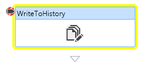
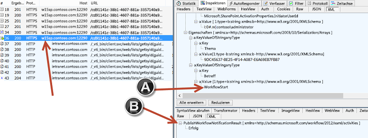
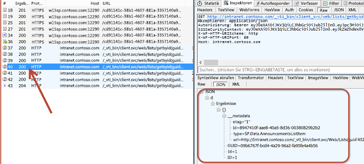
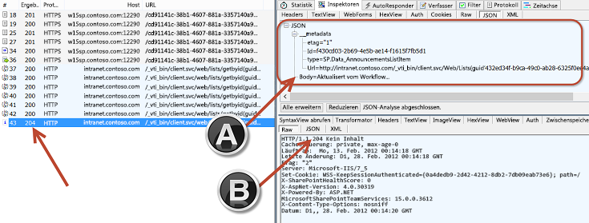

# <a name="debugging-sharepoint-workflows"></a>Debuggen von SharePoint-Workflows
Hier finden Sie Erläuterungen dazu, wie SharePoint jetzt Workflow-Manager 1.0 für die Workflowverarbeitung und -verwaltung nutzt. Außerdem werden die Debugoptionen vorgestellt.
 **Bereitgestellt von:** [Andrew Connell](http://social.msdn.microsoft.com/profile/andrew%20connell%20%5bmvp%5d/), [www.AndrewConnell.com](http://www.andrewconnell.com)
  
    

Microsoft setzt in SharePoint auf einen anderen Ansatz als in früheren Versionen von SharePoint. Das Workflow-Team hat mit dem Azure-Team gearbeitet, um ein neues Produkt namens „Workflow-Manager“ zu erstellen. Workflow-Manager hostet die neueste Version der Windows Workflow Foundation-Laufzeit und alle erforderlichen Dienste auf verfügbare und skalierbare Weise. Er nutzt die den Microsoft Azure Service Bus für Leistung und Skalierbarkeit und führt bei Bereitstellung genau die gleiche lokale Bereitstellung wie in der Cloud aus, ähnlich wie Office 365. SharePoint wird dann verbunden und so konfiguriert, dass die gesamte Workflowausführung sowie zugehörige Aufgaben an die Workflow-Manager-Farm übergeben werden.
  
    
    
Diese Änderung in der Architektur erfordert einige Änderungen an den beiden primären Workflow-Erstellungstools (SharePoint Designer 2013 und Visual Studio 2012), mit denen Kunden benutzerdefinierte Workflows erstellten. Die von Entwicklern in SharePoint 2007 und SharePoint 2010 verwendeten Debugging-Techniken gelten jedoch weiterhin. Die neue Architektur ermöglicht eine neue Option für Workflows, die mithilfe von SharePoint Designer 2013 oder Visual Studio 2012 erstellt wurden, dahingehend, dass Fiddler zum Überwachen des Verkehrs zwischen SharePoint und Workflow-Manager verwendet werden kann.
  
    
    

## <a name="sharepoint-workflow-debugging-overview"></a>Überblick über das Workflowdebugging in SharePoint

Das Debuggen benutzerdefinierter Workflows, die für SharePoint erstellt wurden, funktioniert auf die gleiche Weise wie in früheren Versionen, einschließlich SharePoint 2010 und SharePoint 2007.  Welche Debuggingoptionen verfügbar sind, hängt von dem Tool ab, das zum Erstellen des Workflows verwendet wird (SharePoint Designer 2013 oder Visual Studio 2012), sowie von der Art der SharePoint-Bereitstellung, ob lokal oder Office 365 (gehostet).
  
    
    
Es gibt vier Verfahren zum Debuggen von Workflows, die Workflowautoren nutzen können:
  
    
    

- Protokollieren in der Workflowverlaufsliste
    
  
- Setzen von Haltepunkten
    
  
- Senden von Debugmeldungen an die Konsole
    
  
- Überwachen des Verkehrs zwischen SharePoint und Workflow-Manager mit Fiddler
    
  
Jede Option hat ihre Vor- und Nachteile. Es ist hilfreich, wenn Sie wissen, was jeweils mit den beiden Workflowerstellungstools (SharePoint Designer 2013 oder Visual Studio 2012) sowie mit dem Typ der Workflowbereitstellung (lokal oder Office 365) möglich ist. Die folgende Tabelle zeigt eine Matrix der Erstellungstools, Bereitstellungsziele und der für die das jeweilige Szenario verfügbaren Optionen.
  
    
    


||**SharePoint lokal**|**Office 365 SharePoint Online**|
|:-----|:-----|:-----|
|SharePoint Designer 2013, SharePoint Online  <br/> | Protokollieren In Verlaufsliste <br/>  Fiddler <br/> | Protokollieren In Verlaufsliste <br/> |
|Visual Studio 2012  <br/> | Protokollieren In Verlaufsliste <br/>  Haltepunkte <br/>  Debugmeldungen in Konsole <br/>  Fiddler <br/> | Protokollieren in Verlaufsliste <br/>  Haltepunkte <br/> |
   

## <a name="debugging-with-the-workflow-history-list"></a>Debuggen mit der Workflowverlaufsliste

Die einzige Debugoption, die in jeder SharePoint-Bereitstellung verfügbar ist, ist das Schreiben von Protokollmeldungen in die Workflowverlaufsliste. Mit dieser Methode können Sie entweder die Aktion **In Verlaufsliste protokollieren** in SharePoint Designer 2013 oder die Aktivität **WriteToHistory** in Visual Studio 2012 verwenden, um eine Zeichenfolgenmeldung als neues Element zur Liste hinzuzufügen, die in der Workflowzuordnung angegeben ist. Hierbei handelt es sich um den Container für alle Verlaufsprotokollmeldungen. Es kann sich um einfache Zeichenfolgen oder eine Zusammensetzung aus dem Variableninhalt im Workflow handeln.
  
    
    
Es ist nicht ideal, die Verlaufsliste als Debugtool zu verwenden, da die Benutzer die Meldungen sehen können. Daher muss der Workflowentwickler nach Abschluss der Debugsitzung und Freigabe des Workflows für die Produktion diese Meldungen entfernen, sodass zwischen dem Debuggen und der Bereitstellung ein weiterer Arbeitsschritt anfällt. Dies bleibt jedoch weiterhin die einzige Option, die für jedes Szenario verfügbar ist, unabhägig von dem Tool, das zum Erstellen des Workflows verwendet wurde oder um welchen Typ von SharePoint-Bereitstellung es sich handelt.
  
    
    

## <a name="debugging-using-visual-studio-2012-breakpoints"></a>Debuggen mit Visual Studio 2012-Haltepunkten

Eine weitere Debugoption ist die Nutzung von Haltepunkten. Haltepunkte sind nur für Workflows verfügbar, die mit Visual Studio 2012 erstellt wurden, da in SharePoint Designer 2013 keine Möglichkeit zum Setzen von Haltepunkten oder zum Anfügen eines Debuggers an den laufenden Prozess verfügbar ist. Diese Möglichkeiten sind sowohl in lokalen SharePoint- als auch in gehosteten Bereitstellungen wie Office 365 verfügbar. In diesem Szenario setzen Sie einen Haltepunkt für eine Aktivität im Workflow und starten den Workflow dann im Debugmodus.
  
    
    

**Abbildung 1: Starten des Workflows**

  
    
    

  
    
    

  
    
    
Visual Studio stellt den Workflow in der SharePoint-Zielumgebung bereit und fügt einen Debugger an. Wenn der Workflowprozess die Aktivität mit dem Haltepunkt erreicht, wird Visual Studio wieder aufgerufen, sodass Sie die Werte der Workflowvariablen überprüfen und die einzelnen Aktivitäten über Visual Studio 2012 durchgehen können, wie in der folgenden Abbildung dargestellt.
  
    
    

**Abbildung 2: Workflow-Haltepunkt**

  
    
    

  
    
    

  
    
    

  
    
    

  
    
    

## <a name="debugging-workflows-using-debug-messages-and-the-test-service-host"></a>Debuggen von Workflows mithilfe von Debugmeldungen und des Testdiensthosts

Mit der Einführung von Workflow-Manager in SharePoint-Workflows stehen nun zwei neue Debugoptionen zur Verfügung, wenn Sie benutzerdefinierte Workflows mit Visual Studio 2012 erstellen und sie in einer lokalen Bereitstellung testen. Visual Studio 2012 umfasst eine **WriteLine** -Aktivität, die eine einzelne, zeichenfolgenbasierte Meldung als Eingabe akzeptiert.
  
    
    

**Abbildung 3: WriteLine-Aktivität**

  
    
    

  
    
    

  
    
    
Diese Aktivität schreibt die Meldung, die die **System.Diagnostics.Debug.WriteLine()**-Methode darstellt, in eine standardmäßige .NET-Windows-Konsolenanwendung. Das Workflow-Manager 1.0-Entwicklungstool beinhaltet das Konsolendienstprogramm **Test Service Host**, das von Visual Studio 2012 beim Starten einer neuen Debugsitzung und beim Testen mit einer lokalen SharePoint-Bereitstellung geöffnet wird. Dieses Konsolendienstprogramm, **Microsoft.Workflow.TestServiceHost.exe** in **C:\\Program Files (x86)\\Workflow Manager Tools\\1.0**, wird an die registrierte Workflow-Manager-Instanz angefügt und überwacht Meldungen, die von der **WriteLine**-Aktivität ausgegeben werden, wie in der folgenden Abbildung dargestellt.
  
    
    

**Abbildung 4: Meldungen für WriteLine-Aktivität**

  
    
    

  
    
    

  
    
    
Diese Meldungen sehen aus wie Codekommentare oder Debugmeldungen in einer Konsolenanwendung. Im Gegensatz zum Schreiben in die Workflowverlaufsliste müssen Sie diese nicht entfernen, bevor Sie den Workflow in der Produktionsumgebung bereitstellen. Solange das **Test Service Host**-Dienstprogramm nicht mit Workflow-Manager verbunden ist, sind die Meldungen nicht von Bedeutung.
  
    
    
Diese Debugoption ist nicht für Workflows verfügbar, die mit SharePoint Designer 2013 erstellt wurden, da keine Aktion vorhanden ist, die der **WriteLine**-Aktivität zugeordnet ist. Diese Debugoption steht leider nur für lokale SharePoint-Installationen zur Verfügung, da auf den vom Test Service Host-Dienstprogramm verwendeten Port normalerweise nicht von außerhalb des lokalen Netzwerks öffentlich zugegriffen werden kann. Dies gilt auch für Office 365. Die Ports, die SharePoint für die Verbindung mit Workflow-Manager verwendet, sind die gleichen, die der Test Service Host verwendet. Auf sie kann nur innerhalb des vertrauenswürdigen Netzwerks zugegriffen werden. Dies bedeutet jedoch nicht, dass Sie die Workflows ändern müssen, um **WriteLine**-Aktivitäten vor der Bereitstellung in Office 365 zu entfernen. Diese Aktivitäten können im Workflow verbleiben, da sie nicht sichtbar sind, solange der **Test Service Host** nicht mit Workflow-Manager verbunden ist.
  
    
    

## <a name="debugging-using-fiddler-to-monitor-http-traffic"></a>Debuggen mit Fiddler zum Überwachen des HTTP-Datenverkehrs

Die letzte Option zum Debuggen von SharePoint-Workflows ist eine neue Ergänzung für Workflowentwickler aufgrund der Änderung bei der Verarbeitung von Workflows in der aktuellen Plattform. Bedenken Sie, dass in SharePoint der gesamte Workflowprozess an ein externes Produkt übergeben wird, und zwar Workflow Manager 1.0 Wenn ein Workflow mit SharePoint kommunizieren muss, z. B. beim Aktualisieren des aktuellen Status des Workflows, beim Sammeln von Daten aus Elementen oder Benutzern oder beim Arbeiten mit Aufgaben, nutzen Aktivitäten von Workflow-Manager die SharePoint-REST-API für diese Vorgänge. SharePoint kommuniziert mit Workflow-Manager über eine Clientbibliothek, die als Proxy für REST-Dienste dient, die von Workflow-Manager verfügbar gemacht werden. Sowohl SharePoint als auch Workflow-Manager kommunizieren über die Standard-HTTP- und -HTTPS-Protokolle miteinander.
  
    
    
Diese Architektur bietet Workflowerstellern eine neue Debugoption. Mithilfe des HTTP-Debugproxytools Fiddler können Sie alle Anforderungen und die entsprechenden Antworten zwischen den beiden Produkten überwachen. Darüber hinaus können auch alle benutzerdefinierten Dienste, die von den benutzerdefinierten Workflows mit der **HttpSend**-Aktivität in Visual Studio 2012 oder der entsprechenden **Call HTTP Web Service**-Aktion in SharePoint Designer 2013 aufgerufen werden, ebenso mit Fiddler überwacht und geprüft werden. Dieses Debugmodell ist unabhängig von dem Tool verfügbar, das Sie zum Erstellen von benutzerdefinierten Workflows verwenden (SharePoint Designer 2013 oder Visual Studio 2012).
  
    
    
Diese Option ist nur dann nicht verfügbar, wenn Sie Workflows mithilfe einer Office 365-Bereitstellung von SharePoint testen. Da der gesamte Datenverkehr zwischen SharePoint und Workflow-Manager serverseitig auftritt, ist es nicht möglich, eine Verbindung mit einem der Server in Office 365 herzustellen und Fiddler über die Konsole zu starten.
  
    
    
Diese Option bietet eine Transparenz und Einblicke in das Workflowmodul, die beim Entwickeln von Workflows in SharePoint-Versionen vor SharePoint nicht möglich waren. 
  
    
    
Sie können beispielsweise die unformatierten Antworten sehen, die von Workflow-Manager oder SharePoint in einem Webdienstaufruf zurückkommen. Manchmal antwortet Workflow-Manager mit einer bestimmten Fehlermeldung. SharePoint umfasst benutzerfreundliche Fehlermeldungen, diese sind aber möglicherweise nicht ausreichend spezifisch. Mithilfe von Fiddler können Sie die genaue Fehlermeldung sehen, die zur Problembehandlung zurückgegeben wird. 
  
    
    
Ein anderer Anwendungsfall ist das Untersuchen der Antwort eines erfolgreichen Webdienstaufrufs. Wenn Sie Webdienste in Workflows verwenden, müssen Sie unabhängig vom Erstellungstool den genauen Eigenschaftennamen (und den Pfad, wenn es sich um eine komplexe Antwort handelt) für einen in einer Antwort enthaltenen Wert kennen. Mit Fiddler werden Ihnen die gesamten Antwortdaten angezeigt.
  
    
    

### <a name="understanding-sharepoint-and-workflow-manager-for-debugging-with-fiddler"></a>Grundlegendes zu SharePoint und Workflow Manager für das Debuggen mit Fiddler

Um Workflows in SharePoint und Workflow-Manager 1.0 mit Fiddler debuggen zu können, müssen Sie vor dem Debuggen in einer Entwicklungsumgebung einige Konfigurations- und Einrichtungsschritte durchführen. Bevor Sie diese Schritte durchführen, ist es nützlich, die Funktionsweise von Fiddler sowie die Funktionsweise von Workflows in SharePoint zu kennen.
  
    
    

#### <a name="fiddler-can-only-inspect-traffic-from-the-local-server"></a>Fiddler kann nur Datenverkehr vom lokalen Server überprüfen

Der einzige Datenverkehr, den Fiddler abfangen und überprüfen kann, sind Anforderungen, die vom lokalen Server stammen, auf dem Fiddler gestartet wurde. Dies kann eine Herausforderung darstellen, wenn Fiddler als Debugging-Tool für SharePoint-Workflows verwendet wird. 
  
    
    
Wenn SharePoint und Workflow Manager 1.0 auf unterschiedlichen Servern installiert sind und Fiddler von SharePoint Server gestartet wird, zeigt Fiddler nur den Datenverkehr an, wenn die Anforderung von SharePoint ausging. Der Datenverkehr, der von Workflow Manager 1.0 ausgeht, wird nicht abgefangen, selbst wenn sein Ziel SharePoint Server ist.
  
    
    
Daher ist es beim Entwickeln von Workflows einfacher, sie zu debuggen, wenn sowohl SharePoint als auch Workflow Manager 1.0 auf demselben Server installiert sind.  Beachten Sie, dass dies keine Voraussetzung ist. Sie können Fiddler sowohl auf SharePoint Server- als auch Workflow Manager-Servern starten, wobei es jedoch komplizierter ist, zwei Instanzen auf zwei Servern für den gleichen Workflowprozess zu überwachen.
  
    
    

#### <a name="fiddler-can-only-inspect-traffic-from-the-current-logged-on-user"></a>Fiddler kann nur Datenverkehr des aktuell angemeldeten Benutzers überprüfen

 Fiddler kann nur den Datenverkehr des aktuell angemeldeten Benutzers abfangen und den Datenverkehr dieses Benutzers überprüfen. Um von SharePoint ausgehenden Datenverkehr anzuzeigen, müssen Sie sich bei SharePoint Server mit dem Windows-Konto anmelden, das als Identität für den Anwendungspool konfiguriert ist, der die Webanwendung für die SharePoint-Website hostet, von der der Workflow ausgeht.
  
    
    
Dies gilt auch für Workflow-Manager. Um von Workflow-Manager ausgehenden Datenverkehr abfangen und überprüfen zu können, müssen Sie sich mit der Windows-Identität anmelden, die bei der Bereitstellung der Workflow-Manager-Farm als Dienstkonto für Workflow-Manager konfiguriert wurde.
  
    
    
Bei der Verwendung von Fiddler zum Debuggen von Workflows ist das Debuggen nicht nur dann einfacher, wenn Workflow-Manager und SharePoint auf demselben Server installiert und konfiguriert sind, sondern wenn sie auch die gleiche Windows-Identität wie das Dienstkonto verwenden. Der gesamte Datenverkehr von Workflow-Manager und SharePoint kann von Fiddler abgefangen und überprüft werden.
  
    
    

#### <a name="sharepoint-must-trust-fiddlers-certificate"></a>SharePoint muss dem Fiddler-Zertifikat vertrauen

Bevor Sie Fiddler zum Debuggen von SharePoint-Workflows verwenden, müssen Sie verstehen, wie verschlüsselter Datenverkehr behandelt wird. Verschlüsselter Datenverkehr über HTTP, der als HTTPS bezeichnet wird, wird mithilfe eines privaten Schlüssels eines Zertifikats implementiert, um einige Daten zu verschlüsseln und diese dann an einen anderen Empfänger zu senden. Der Empfänger hat den öffentlichen Schlüssel des Zertifikats, das mit dem privaten Schlüssel verbunden ist. Wenn eine Anforderung vom Empfänger empfangen wird, kann der Empfänger überprüfen, dass die Anforderung vom Absender stammte, da die Signatur des verschlüsselten Inhalts mit dem öffentlichen Schlüssel übereinstimmt, was nur dann der Fall sein kann, wenn dieser mit dem privaten Schlüssel des Zertifikats verschlüsselt wurde.
  
    
    
Fiddler kann HTTPS-Verkehr abfangen und zum Entschlüsseln dieses Verkehrs konfiguriert werden, sodass ein lesbares Format zur Überprüfung im Tool entsteht. Nach der Anzeige der Anforderung verwendet Fiddler dann sein eigenes Zertifikat, um den Verkehr wieder zu verschlüsseln und ihn an den gewünschten Empfänger zu senden. Dies kann zu einem Problem führen, da der Empfänger jetzt die ursprüngliche Antwort erhalten hat, diese jedoch nicht mithilfe des Zertifikats vom ursprünglichen Absender gesichert wurde. Dies kann beim Debuggen von SharePoint-Workflows ein Problem sein, da SharePoint dem Zertifikat von Fiddler nicht vertraut. Um Fiddler zum Abfangen und Überprüfen von HTTPS-Verkehr zwischen SharePoint und Workflow-Manager zu verwenden, muss das Fiddler-Zertifikat für SharePoint vertrauenswürdig sein.
  
    
    

### <a name="configure-sharepoint-and-workflow-manager-10-for-workflow-debugging-with-fiddler"></a>Konfigurieren von SharePoint und Workflow-Manager 1.0 für das Workflowdebugging mit Fiddler

In den folgenden Abschnitten wird erläutert, wie Sie Fiddler und SharePoint für das Workflowdebugging konfigurieren.
  
    
    

#### <a name="configure-the-net-framework-default-proxy-configuration"></a>.NET Framework-Standardproxykonfiguration konfigurieren

Der erste Schritt besteht darin, die Standardproxykonfiguration für .NET Framework zu definieren. Aufgrund dieser Änderungen kann Fiddler den Datenverkehr sowohl von SharePoint als auch von Workflow-Manager abfangen. Öffnen Sie die Datei **machine.config** an den folgenden beiden Speicherorten:
  
    
    

-  `%systemdrive%\\Windows\\Microsoft.NET\\Framework\\v4.0.30319\\Config\\machine.config`
    
  
-  `%systemdrive%\\Windows\\Microsoft.NET\\Framework64\\v4.0.30319\\Config\\machine.config`
    
  
Fügen Sie als Nächstes das folgende Markup unten in jeder Datei hinzu, bevor Sie das **<configuration>**-Element schließen:
  
    
    


```xml

<system.net>
  <defaultProxy enabled="true">
    <proxy bypassonlocal="false" usesystemdefault="true" />
  </defaultProxy>
</system.net>
```

Speichern Sie die Änderungen, und schließen Sie die Dateien.
  
    
    

#### <a name="configure-fiddler-to-intercept-and-inspect-https-traffic"></a>Fiddler zum Abfangen und Überprüfen von HTTPS-Datenverkehr konfigurieren

Als Nächstes müssen Sie Fiddler zum Abfangen von verschlüsseltem Datenverkehr und zum Entschlüsseln konfigurieren.
  
    
    

1. Starten Sie Fiddler.
    
  
2. Wenn Sie die lokale HOSTS-Datei verwenden, stellen Sie sicher, dass die Einträge in Fiddler enthalten sind. Wählen Sie hierzu die Menüoption **Tools -> HOSTS**.
    
  
3. Aktivieren Sie die Option **Enable remapping of requests for one host to a different host or IP, overriding DNS**,
    
  
4. Klicken Sie auf **Import Windows Hosts File**, und klicken Sie dann auf **Save**.
    
  

**Abbildung 5: Hostneuzuordnung**

  
    
    

  
    
    

  
    
    
Als Nächstes konfigurieren Sie die Verbindungsoptionen von Fiddler. 
  
    
    

  
    
    

1. Wählen Sie die Menüoption **Tools -> Fiddler Options**.
    
  
2. Klicken Sie auf die Registerkarte **Verbindungen**.
    
  
3. Heben Sie die Auswahl von **Chain to upstream gateway proxy** auf.
    
  
4. Wählen Sie die Optionen **Act as system proxy on startup** und **Monitor all connections** aus, wie in der folgenden Abbildung dargestellt.
    
   **Abbildung 6: Fiddler-Verbindungsoptionen**

  

  
  

  

  
5. Wählen Sie die Registerkarte **HTTPS** im Dialogfeld **Fiddler Options**.
    
  
6. Aktivieren Sie das Kontrollkästchen **Capture HTTPS CONNECTs**.
    
  
7. Wählen Sie **Decrypt HTTPS Traffic** aus.
    
  
8. Wählen Sie **… from all processes** aus.
    
  
9. Aktivieren Sie das Kontrollkästchen **Ignore server certificate errors**.
    
  
10. Klicken Sie auf **Export Root Certificate to Desktop**.
    
  
11. Wenn eine Warnmeldung angezeigt wird, klicken Sie auf **Yes**, um **Trust the Fiddler Root certificate** zu bestätigen.
    
  
Hierdurch wird das Zertifikat in Windows als vertrauenswürdig konfiguriert, obwohl es in SharePoint noch nicht als vertrauenswürdig eingestuft wird.
  
    
    

**Abbildung 7: HTTPS-Registerkarte**

  
    
    

  
    
    

  
    
    
 >**Hinweis**: Wenn eine Sicherheitswarnung angezeigt wird, dass dem Fiddler-Zertifikat nicht vertraut werden sollte, klicken Sie auf **Ja**, um mit der Installation des Zertifikats fortzufahren.
  
    
    

#### <a name="configure-sharepoint-to-trust-the-certificate"></a>SharePoint konfigurieren, das Zertifikat als vertrauenswürdig einzustufen

Als letzten Schritt müssen Sie SharePoint so konfigurieren, dass das im vorherigen Schritt exportierte Fiddler-Zertifikat als vertrauenswürdig eingestuft wird. 
  
    
    

1. Melden Sie sich als Farmadministrator bei SharePoint an.
    
  
2. Starten Sie die SharePoint-Verwaltungsshell.
    
  
3. Ladne Sie das SharePoint-Snap-In.
    
```powershell
  
PS C:\\> Add-PSSnapIn Microsoft.SharePoint.PowerShell
```

4. Installieren Sie mithilfe des Zertifikatdienstprogramms das Fiddler-Zertifikat.
    
```powershell
  PS C:\\> $fidderCertificatePath = [full path to exported FiddlerRoot.cer certificate file]
PS C:\\> certutil.exe -addstore -enterprise -f -v root $fidderCertificatePath
PS C:\\> $fiddlerCertificate = Get-PfxCertificate -FilePath $fidderCertificatePath
PS C:\\> New-SPTrustedRootAuthority -Name "Fiddler" -Certificate $fiddlerCertificate

```

5. Führen Sie IISRESET aus, um sicherzusstellen, dass SharePoint die Änderung hinsichtlich der Vertrauenswürdigkeit des Zertifikats übernommen hat.
    
  

### <a name="walkthrough-debugging-a-sharepoint-workflow-with-fiddler"></a>Exemplarische Vorgehensweise: Debuggen eines SharePoint-Workflows mit Fiddler

In dieser einfachen exemplarischen Vorgehensweise wird die Verwendung von Fiddler zum Debuggen eines SharePoint-Workflows mithilfe von Visual Studio 2012 veranschaulicht. Wenn der Workflow gestartet wird, wird eine Kunden-ID aus einem Feld in einer benutzerdefinierten Liste abgerufen. Diese Kunden-ID dient zum Abfragen eines öffentlich zugänglich Diensts, um weitere Details über den Kunden abzurufen. Dann werden diese Werte zum Aktualisieren des ursprünglichen Listenelements verwendet. Der Workflow ist im folgenden MSDN-Codebeispiel zu finden: [SharePoint-Workflow: Aufrufen eines externen Webdiensts](http://code.msdn.microsoft.com/officeapps/SharePoint-workflow-48ea87d4.aspx).
  
    
    
Für diese exemplarische Vorgehensweise gelten die folgenden Voraussetzungen:
  
    
    

- SharePoint und Workflow-Manager 1.0 müssen auf dem gleichen Server installiert sein.
    
  
- Die Windows-Identität **CONTOSO\\SP_Content** ist für die Anwendungspoolidentität konfiguriert, die die Webanwendung für die SharePoint-Website hostet, von der der Workflow gestartet wird.
    
  
- Die SharePoint-Website, von der der Workflow gestartet wird, ist **http://intranet.contoso.com**.
    
  
- Der Workflow Manager 1.0-Farmendpunkt ist **w15sp.contoso.com**.
    
  
- SharePoint und Workflow-Manager 1.0 sind so konfiguriert, dass sie OAuth über HTTP zulassen.
    
    > **Vorsicht:** Die sollte nie auf einem Produktionsserver durchgeführt werden, sondern nur zum Testen und Debuggen. 

1. Melden Sie sich bei dem Server an, auf dem Workflow Manager und SharePoint installiert sind, wobei die Windows-Identität als Workflow-Manager 1.0-Farmkonto und SharePoint-Anwendungspoolidentität konfiguriert ist.
    
  
2. Starten Sie Fiddler. Fiddler fängt nun den Datenverkehr vom aktuellen Benutzer ab. Wenn bereits Verbindungen vorhanden sind oder Prozesse ausgeführt werden, werden diese möglicherweise nicht von Fiddler abgefangen, da Fiddler beim Herstellen der Verbindungen noch nicht ausgeführt wurde. Um sowohl Workflow Manager als auch den SharePoint-Server zurückzusetzen und zu veranlassen, dass ihr Datenverkehr von Fiddler abgefangen wird, setzen Sie SharePoint mit IISRESET zurück, und setzen Sie Workflow Manager zurück, indem Sie den Windows-Dienst **Workflow Manager Backend** anhalten und neu starten. Verwenden Sie hierzu die folgenden beiden Befehle an einer administrativen Eingabeaufforderung.
    
```powershell  
PS C:\\> IISRESET
PS C:\\> net stop WorkflowServiceBackend
PS C:\\> net start WorkflowServiceBackend
```

3. Starten Sie den Workflow.
    
  
Beachten Sie in der Abbildung unten, dass die Sitzungen 18-36 von SharePoint stammen und die Sitzungen 37-43 von Workflow-Manager.
  
    
    

**Abbildung 8: Starten des Workflows**

  
    
    

  
    
    

  
    
    
Beachten Sie in Sitzung 36, dass SharePoint eine Anforderung an Workflow-Manager zum Starten eines Workflows richtet (in der Abbildung durch [A] gekennzeichnet). Workflow-Manager antwortet mit einer Erfolgsmeldung (in der Abbildung durch [B] gekennzeichnet):
  
    
    

**Abbildung 9: Erfolgsmeldung**

  
    
    

  
    
    

  
    
    
In Sitzung 40 ruft Workflow-Manager die Listenelement-ID und -GUID von SharePoint ab.
  
    
    

**Abbildung 11: Abrufen der ID und GUID des Elements**

  
    
    

  
    
    

  
    
    
In Sitzung 43 aktualisiert Workflow-Manager das Listenelement in SharePoint mit einem neuen Wert für das Feld **Body** des Ankündigungselements, indem er ein JavaScript Object Notation (JSON)-Objekt (in der Abbildung durch [A] gekennzeichnet) als Nutzlast weitergibt. SharePoint antwortet mit dem HTTP-Status 204, der darauf hinweist, dass die Anforderung erfolgreich verarbeitet wurde. Die Antwort enthält jedoch keine Meldung.
  
    
    

**Abbildung 11: Aktualisieren des Listenelements**

  
    
    

  
    
    

  
    
    

  
    
    

  
    
    

## <a name="conclusion"></a>Schlussbemerkung

Durch den Workflow-Textabschnitt in der SharePoint-Version wurde eine neue Abstraktionsebene eingeführt: Workflow-Manager 1.0. Durch diese neue Architektur wurde geändert, wie Workflows verarbeitet werden. SharePoint nutzt jetzt Workflow-Manager 1.0 für die gesamte Workflowverarbeitung und -verwaltung.
  
    
    
Eine Aufgabe, die Sie beim Erstellen von benutzerdefinierten Anwendungen und Geschäftsprozessen in Workflows ausführen müssen, ist das Debuggen Ihrer Arbeit. Die neue Workflowarchitektur von SharePoint bietet dieselben Optionen zum Debuggen, die in früheren Versionen von SharePoint vorhanden waren. Die neue Architektur bietet jedoch zwei neue Optionen beim Erstellen von benutzerdefinierten Workflows mithilfe der neuen Architektur. In diesem Artikel werden die älteren Debugging-Optionen sowie die neuen Optionen mithilfe der **WriteLine**-Aktivität und die Verwendung von Fiddler zum Abfangen und Überprüfen von Datenverkehr zwischen SharePoint und Workflow-Manager 1.0 erläutert.
  
    
    

## <a name="additional-resources"></a>Zusätzliche Ressourcen
<a name="bk_addresources"> </a>


-  [Fiddler](http://fiddler2.com/home)
    
  

  
    
    

