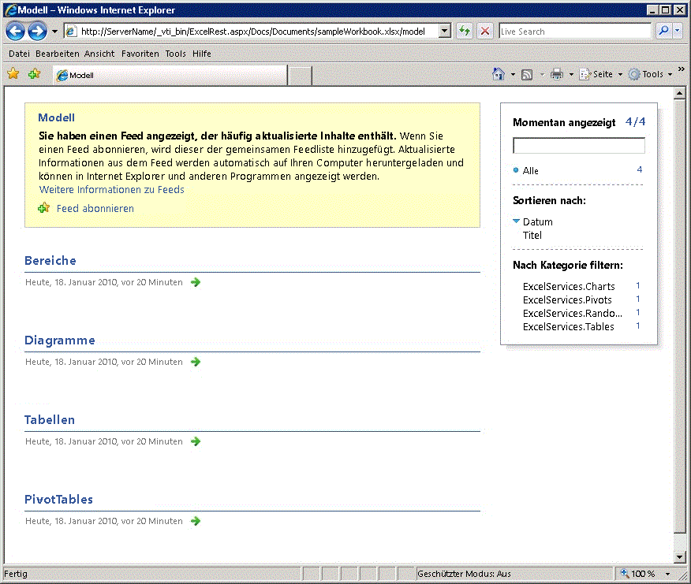
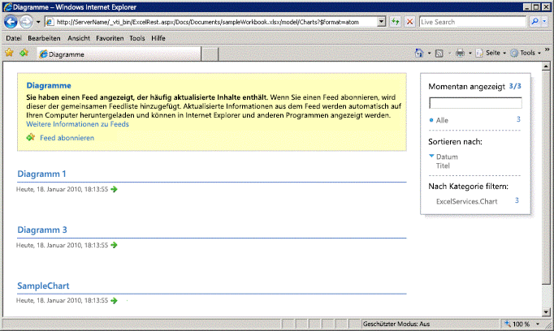
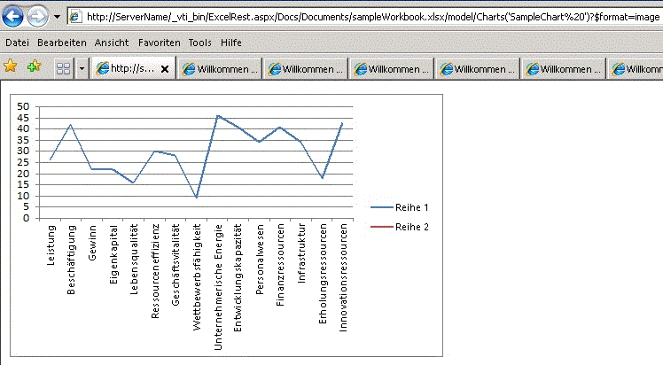

# <a name="discovery-in-excel-services-rest-api"></a><span data-ttu-id="82e43-102">Suche in Excel Services-REST-API</span><span class="sxs-lookup"><span data-stu-id="82e43-102">Discovery in Excel Services REST API</span></span>

<span data-ttu-id="82e43-103">Dieses Thema behandelt die Ermittlungsmechanismen, die in der Excel Services-REST-API integriert sind.</span><span class="sxs-lookup"><span data-stu-id="82e43-103">This topic discusses the discovery mechanisms built into the Excel Services REST API.</span></span>
  
    
    


> <span data-ttu-id="82e43-104">**Hinweis:** Die Excel Services-REST-API bezieht sich auf SharePoint und SharePoint 2016 (lokal).</span><span class="sxs-lookup"><span data-stu-id="82e43-104">**Note:** The Excel Services REST API applies to SharePoint and SharePoint 2016 on-premises.</span></span> <span data-ttu-id="82e43-105">Für Office 365 Education-, Business- und Enterprise-Konten verwenden Sie die Excel-REST-APIs, die Bestandteil des [Microsoft Graph](http://graph.microsoft.io/en-us/docs/api-reference/v1.0/resources/excel
> )-Endpunkts sind.</span><span class="sxs-lookup"><span data-stu-id="82e43-105">Note The Excel Services REST API applies to SharePoint and SharePoint 2016 on-premises. For Office 365 Education, Business, and Enterprise accounts, use the Excel REST APIs that are part of the  [Microsoft Graph](http://graph.microsoft.io/en-us/docs/api-reference/v1.0/resources/excel
) endpoint.</span></span>
  
    
    


## <a name="discovery-base-url-and-discovery-example"></a><span data-ttu-id="82e43-106">Beispiel für Ermittlung der Basis-URL und Ermittlung</span><span class="sxs-lookup"><span data-stu-id="82e43-106">Discovery Base URL and Discovery Example</span></span>

<span data-ttu-id="82e43-p102">Mithilfe der Ermittlung können Entwickler und Benutzer Informationen über und den Inhalt einer Arbeitsmappe manuell oder programmgesteuert ermitteln. Der Ermittlungsmechanismus stellt den  [Atom](http://tools.ietf.org/html/rfc4287)-Feed bereit, der Informationen über die Ressourcen in einer Arbeitsmappe enthält. Sie können mithilfe der Ermittlung die Ressourcen in der Arbeitsmappe erkunden und anzeigen. Hierzu gehören Bereiche, Diagramme, Tabellen und PivotTables.</span><span class="sxs-lookup"><span data-stu-id="82e43-p102">Discovery enables developers and users to discover information about and the content of a workbook manually or programmatically. The discovery mechanism supplies the  [Atom](http://tools.ietf.org/html/rfc4287) feed that contains information about the resources in a workbook. By using discovery, you can explore and view the resources in the workbook. Resources that you can explore and access are ranges, charts, tables, and PivotTables.</span></span>
  
    
    
<span data-ttu-id="82e43-111">Im Folgenden das Konstrukt der REST-URL zu einem einzelnen Element in einer Arbeitsmappe:</span><span class="sxs-lookup"><span data-stu-id="82e43-111">Following is the construct of the REST URL to a specific element in a workbook:</span></span>
  
    
    


```

http://<ServerName>/_vti_bin/ExcelRest.aspx/<DocumentLibrary>/<FileName>/<ResourceLocation>
```

<span data-ttu-id="82e43-112">Wie im Thema  [Grundlegende URI-Struktur und Pfad](basic-uri-structure-and-path.md) beschrieben, sehen Sie im Folgenden die REST-URL für den Zugriff auf die Arbeitsmappe **sampleWorkbook.xlsx** und die Anzeige des Diagramms **SampleChart**:</span><span class="sxs-lookup"><span data-stu-id="82e43-112">As described in the  [Basic URI Structure and Path](basic-uri-structure-and-path.md) topic, following is the REST URL to access a workbook named **sampleWorkbook.xlsx** and further view the chart called **SampleChart**:</span></span> 
  
    
    


```
http://<ServerName>/_vti_bin/ExcelRest.aspx/Docs/Documents/sampleWorkbook.xlsx/model/Charts('SampleChart')
```

<span data-ttu-id="82e43-113">Zum Starten und Erkunden der Ressourcen in der Arbeitsmappe und zum Anzeigen der Ressourcen mithilfe der Ermittlung navigieren Sie mithilfe einer URL, die folgendem Beispiel entspricht, zur Modellseite:</span><span class="sxs-lookup"><span data-stu-id="82e43-113">To start and explore the resources in the workbook and view the resources by using discovery, go to the model page by using a URI that follows this example:</span></span>
  
    
    


```
http://<ServerName>/_vti_bin/ExcelRest.aspx/<DocumentLibrary>/<FileName>/model
```

<span data-ttu-id="82e43-114">Wird die Beispielarbeitsmappe sampleWorkbook.xlsx verwendet, lautet der URI wie folgt:</span><span class="sxs-lookup"><span data-stu-id="82e43-114">Using the “sampleWorkbook.xlsx” example, following is the URI:</span></span>
  
    
    


```
http://<ServerName>/_vti_bin/ExcelRest.aspx/Docs/Documents/sampleWorkbook.xlsx/model
```

<span data-ttu-id="82e43-115">Im Folgenden ein Screenshot der Modellseite.</span><span class="sxs-lookup"><span data-stu-id="82e43-115">Following is a screen shot of the model page.</span></span>
  
    
    

<span data-ttu-id="82e43-116">**Excel Services REST-Modell-URL**</span><span class="sxs-lookup"><span data-stu-id="82e43-116">**Excel Services REST model URL**</span></span>

  
    
    

  
    
    

  
    
    
<span data-ttu-id="82e43-p103">Die URL zur Modellseite ist der Ausgangspunkt der Ermittlung. Auf der Modellseite werden vier Ressourcenauflistungen angezeigt, die derzeit von der Excel Services-REST-API unterstützt werden. Die Ressourcenauflistungen sind Bereiche, Diagramme, Tabellen oder PivotTables. Sie können diese Ressourcen in einer bestimmten Arbeitsmappe erkunden, indem Sie auf der Modellseite auf **Bereiche**, **Diagramme**, **Tabellen** oder **PivotTables** klicken.</span><span class="sxs-lookup"><span data-stu-id="82e43-p103">The URL to the model page is where you start the discovery. The model page displays four resource collections that the Excel Services REST API currently supports. The resource collections are ranges, charts, tables, or PivotTables. You can explore those resources in a particular workbook by clicking **Ranges**, **Charts**, **Tables**, or **PivotTables** on the model page.</span></span>
  
    
    
<span data-ttu-id="82e43-122">Führen Sie für den Zugriff auf das Diagramm in der Arbeitsmappe mithilfe von Ermittlung z. B. die folgenden Schritte durch:</span><span class="sxs-lookup"><span data-stu-id="82e43-122">For example, to access the chart in the workbook by using discovery, do the following:</span></span> 
  
    
    

  
    
    

1. <span data-ttu-id="82e43-123">Klicken Sie auf der Modellseite auf **Diagramme**.</span><span class="sxs-lookup"><span data-stu-id="82e43-123">On the model page, click **Charts**.</span></span> <span data-ttu-id="82e43-124">Beim Klicken auf den Link **Diagramme** wird ein weiteres Atom-Feed geöffnet. Dieses Feed enthält alle Diagramme, die in der Beispielarbeitsmappe sampleWorkbook.xlsx verfügbar sind.</span><span class="sxs-lookup"><span data-stu-id="82e43-124">Clicking the **Charts** link brings another Atom feed—this resulting feed lists all the charts that are available in the sampleWorkbook.xlsx workbook.</span></span> <span data-ttu-id="82e43-125">Die Beispielarbeitsmappe sampleWorkbook.xlsx enthält drei Diagramme: **Diagramm 1**, **Diagramm 3** und **SampleChart**.</span><span class="sxs-lookup"><span data-stu-id="82e43-125">The sampleWorkbook.xlsx workbook contains three charts named **Chart 1**, **Chart 3**, and **SampleChart**.</span></span> <span data-ttu-id="82e43-126">Aus diesem Grund werden drei Diagrammnamen aufgelistet, wie im folgenden Screenshot dargestellt.</span><span class="sxs-lookup"><span data-stu-id="82e43-126">Therefore, three chart names are listed, as seen in the following screen shot.</span></span>
    
   <span data-ttu-id="82e43-127">**Diagrammliste der Excel Services REST-Ermittlung**</span><span class="sxs-lookup"><span data-stu-id="82e43-127">**Excel Services REST discovery chart list**</span></span>

  

  
  

  

  
2. <span data-ttu-id="82e43-p105">Klicken Sie auf der Modellseite auf **SampleChart**. Dadurch wird das Diagramm namens **SampleChart** angezeigt, das sich in der Arbeitsmappe **sampleWorkbook.xlsx** befindet, wie im folgenden Screenshot gezeigt.</span><span class="sxs-lookup"><span data-stu-id="82e43-p105">On the model page, click **SampleChart**. This displays the chart named **SampleChart** that resides in **sampleWorkbook.xlsx**, as shown in the following screen shot.</span></span> 
    
   <span data-ttu-id="82e43-131">**Anzeigen von Diagrammen mit REST**</span><span class="sxs-lookup"><span data-stu-id="82e43-131">**Viewing chart using REST**</span></span>

  

  
  

  

  
3. <span data-ttu-id="82e43-p106">Auf gleiche Weise wird durch Klicken auf **Chart 1** oder **Chart 3** das entsprechende Diagramm angezeigt. Wenn Sie auf **SampleChart** klicken, wird zur tatsächlichen URL des Diagramms navigiert. Im Folgenden die URL zum **SampleChart**-Bild (wie im folgenden Screenshot gezeigt):</span><span class="sxs-lookup"><span data-stu-id="82e43-p106">Similarly, clicking **Chart 1** or **Chart 3** displays the chart with the corresponding name. Clicking **SampleChart** navigates to the actual chart URL. Following is the URL to the **SampleChart** image (as can be seen in the screen shot):</span></span>
    
```
  http://<ServerName>/_vti_bin/ExcelRest.aspx/Docs/Documents/sampleWorkbook.xlsx/model/Charts('SampleChart%20')?$format=image
```


## <a name="atom-feed"></a><span data-ttu-id="82e43-136">Atom-Feed</span><span class="sxs-lookup"><span data-stu-id="82e43-136">Atom Feed</span></span>

<span data-ttu-id="82e43-p107">Mithilfe des von der REST-API bereitgestellten  [Atom](http://tools.ietf.org/html/rfc4287)-Feeds können Sie einfacher auf die Daten zugreifen ,die für Sie von Interesse sind. Wenn Sie die Quelle der Webseite anzeigen, erhalten Sie den XML-Code. Ein Beispiel aus den Diagrammen in **sampleWorkbook.xlsx** sehen Sie unten.</span><span class="sxs-lookup"><span data-stu-id="82e43-p107">Using the  [Atom](http://tools.ietf.org/html/rfc4287) feed provided by the REST API gives you an easier way of getting to the data that you are interested in. If you view the source of the Web page, you get the XML. An example from the charts in **sampleWorkbook.xlsx** is shown below.</span></span>
  
    
    
<span data-ttu-id="82e43-p108">Wie aus dem XML-Code ersichtlich ist, enthält der Feed überquerbare Elemente, anhand derer der Code ermitteln kann, welche Elemente in der Arbeitsmappe vorhanden sind. Jeder Atom-Eintrag entspricht einem Diagramm, auf das Sie zugreifen können. Dieser Mechanismus gilt in gleicher Weise für die Ermittlung von Bereichen, Tabellen und PivotTables.</span><span class="sxs-lookup"><span data-stu-id="82e43-p108">As can be seen in the XML, the feed contains traversable elements that enable code to discover what elements exist in the workbook. Each Atom entry corresponds to a chart that can be accessed. This same mechanism applies to discovering ranges, tables, and PivotTables.</span></span>
  
    
    


```XML
<?xml version="1.0" encoding="utf-8" standalone="yes"?>
<feed xmlns="http://www.w3.org/2005/Atom" xmlns:x="http://schemas.microsoft.com/office/2008/07/excelservices/rest" xmlns:d="http://schemas.microsoft.com/ado/2007/08/dataservice" xmlns:m="http://schemas.microsoft.com/ado/2007/08/dataservices/metadata">
  <title type="text">Charts</title>
  <id>http://ServerName/_vti_bin/ExcelRest.aspx/Docs/Documents/sampleWorkbook.xlsx/model/Charts</id>
  <updated>2010-01-19T19:32:53Z</updated>
  <author>
    <name />
  </author>
  <link rel="self" href="http://ServerName/_vti_bin/ExcelRest.aspx/Docs/Documents/sampleWorkbook.xlsx/model/Charts?$format=atom" title="Charts" />
  <entry>
    <category term="ExcelServices.Chart" scheme="http://schemas.microsoft.com/ado/2007/08/dataservices/scheme" />
    <title>Chart 1</title>
    <id>http://ServerName/_vti_bin/ExcelRest.aspx/Docs/Documents/sampleWorkbook.xlsx/model/Charts('Chart%201')</id>
    <updated>2010-01-19T19:32:53Z</updated>
    <author>
      <name />
    </author>
    <link rel="alternate" title="Chart 1" href="http://ServerName/_vti_bin/ExcelRest.aspx/Docs/Documents/sampleWorkbook.xlsx/model/Charts('Chart%201')?$format=image" />
    <content type="image/png" src="http://ServerName/_vti_bin/ExcelRest.aspx/Docs/Documents/sampleWorkbook.xlsx/model/Charts('Chart%201')?$format=image" />
  </entry>
  <entry>
    <category term="ExcelServices.Chart" scheme="http://schemas.microsoft.com/ado/2007/08/dataservices/scheme" />
    <title>Chart 3</title>
    <id>http://ServerName/_vti_bin/ExcelRest.aspx/Docs/Documents/sampleWorkbook.xlsx/model/Charts('Chart%203')</id>
    <updated>2010-01-19T19:32:53Z</updated>
    <author>
      <name />
    </author>
    <link rel="alternate" title="Chart 3" href="http://ServerName/_vti_bin/ExcelRest.aspx/Docs/Documents/sampleWorkbook.xlsx/model/Charts('Chart%203')?$format=image" />
    <content type="image/png" src="http://ServerName/_vti_bin/ExcelRest.aspx/Docs/Documents/sampleWorkbook.xlsx/model/Charts('Chart%203')?$format=image" />
  </entry>
  <entry>
    <category term="ExcelServices.Chart" scheme="http://schemas.microsoft.com/ado/2007/08/dataservices/scheme" />
    <title>SampleChart </title>
    <id>http://ServerName/_vti_bin/ExcelRest.aspx/Docs/Documents/sampleWorkbook.xlsx/model/Charts('SampleChart%20')</id>
    <updated>2010-01-19T19:32:53Z</updated>
    <author>
      <name />
    </author>
    <link rel="alternate" title="SampleChart" href="http://ServerName/_vti_bin/ExcelRest.aspx/Docs/Documents/sampleWorkbook.xlsx/model/Charts('SampleChart%20')?$format=image" />
    <content type="image/png" src="http://ServerName/_vti_bin/ExcelRest.aspx/Docs/Documents/sampleWorkbook.xlsx/model/Charts('SampleChart%20')?$format=image" />
  </entry>
</feed>
```


## <a name="see-also"></a><span data-ttu-id="82e43-143">Siehe auch</span><span class="sxs-lookup"><span data-stu-id="82e43-143">See also</span></span>


#### <a name="concepts"></a><span data-ttu-id="82e43-144">Konzepte</span><span class="sxs-lookup"><span data-stu-id="82e43-144">Concepts</span></span>


  
    
    
 [<span data-ttu-id="82e43-145">Ressourcen-URI für die REST API in Excel Services</span><span class="sxs-lookup"><span data-stu-id="82e43-145">Resources URI for Excel Services REST API</span></span>](resources-uri-for-excel-services-rest-api.md)
