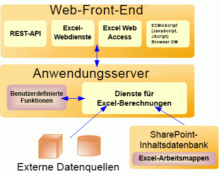

# Excel Services-ArchitekturExcel Services Architecture

Excel Services ist Bestandteil von Microsoft SharePoint Server 2010. Excel Services basiert auf ASP.NET- und SharePoint Foundation-Technologien. Im Anschluss finden Sie die Hauptkomponenten in Excel Services:Excel Services is part of Microsoft SharePoint Server 2010. Excel Services is built on ASP.NET and SharePoint Foundation technologies. Following are the core components in Excel Services:
  
    
    

- Excel Web AccessExcel Web Access
    
  
- Excel-WebdiensteExcel Web Services
    
  
- Benutzerdefinierte Funktionen (User-Defined Functions, UDFs)User-defined functions (UDFs)
    
  
- ECMAScript (JavaScript, JScript)ECMAScript (JavaScript, JScript)
    
  
- REST (Representational State Transfer)-DienstRepresentational State Transfer (REST) service
    
  
- Dienste für Excel-BerechnungenExcel Calculation Services
    
> [!NOTE]
> In Microsoft Excel Online, Bestandteil von Office Online, werden auch Excel-Arbeitsmappen im Browser unterstützt.Microsoft Excel Online, part of Office Online, also supports Excel workbooks in the browser. Weitere Informationen zu Excel Online finden Sie in der [Dokumentation zu Office Web Apps](https://technet.microsoft.com/de-DE/library/ee855124.aspx).For more information about Excel Online, see  [documentation about Office Web Apps](https://technet.microsoft.com/de-DE/library/ee855124.aspx). 
  
    
    

Die Komponenten von Excel Web Access, Excel Web Services, UDFs, JavaScript, des REST-Diensts und von Dienste für Excel-Berechnungen können in zwei Hauptgruppen unterteilt werden: die Komponenten auf einem Front-End-Server (auch als "Web-Front-End" bezeichnet) und die Komponente auf einem Back-End-Anwendungsserver. **Komponenten auf einem Web-Front-End und auf einem Back-End-Anwendungsserver**The Excel Web Access, Excel Web Services, UDFs, JavaScript, the REST service, and Excel Calculation Services components can be divided into two major groups: the components on a front-end server (also known as the "Web front end") and the component on a back-end application server. **Components of a Web front end and a back-end application server**

  
    
    

  
    
    

  
    
    

  
    
    

  
    
    

## Web-Front-End-Server und Back-End-AnwendungsserverWeb Front-End Servers and Back-End Application Servers

Die Komponenten von Excel Web Access, Excel Web Services, UDFs, JavaScript, des REST-Diensts und von Dienste für Excel-Berechnungen können in Komponenten auf dem Web-Front-End-Server und Komponenten unterteilt werden, die auf einem Back-End-Anwendungsserver gespeichert sind. Zu den Komponenten auf dem Web-Front-End gehören Excel Web Access, JavaScript, der REST-Dienst und Excel Web Services. Die Dienste für Excel-Berechnungen-Komponente befindet sich auf dem Back-End-Anwendungsserver, zusammen mit allen UDF-Assemblies, die von einem Administrator hinzugefügt wurden.The Excel Web Access, Excel Web Services, UDFs, JavaScript, the REST service, and Excel Calculation Services components can be divided into components on the Web front-end server and components that live on a back-end application server. The Web front end includes Excel Web Access, JavaScript, the REST service, and Excel Web Services. The Excel Calculation Services component resides on the back-end application server, alongside any UDF assemblies that an administrator has added.
  
    
    
In der einfachsten Konfiguration in SharePoint Server 2010, das heißt, auf einem einzelnen Computer, auf dem SharePoint Server 2010 als eigenständige Installation ausgeführt wird, werden alle fünf Komponenten auf dem gleichen Computer installiert. In einer typischen Unternehmensumgebung mit zahlreichen Benutzern befinden sich die Komponenten auf dem Web-Front-End-Server und die Komponenten auf dem Back-End-Anwendungsserver jedoch auf unterschiedlichen Computern in einer Farmkonfiguration. Es besteht die Möglichkeit, den Web-Front-End-Server unabhängig vom Back-End-Anwendungsserver zu skalieren. So können Sie beispielsweise die Anzahl der Web-Front-End-Server oder der Back-End-Anwendungsserver in Abhängigkeit von den Anforderungen Ihres Unternehmens erhöhen.In the simplest configuration in SharePoint Server 2010—that is, a single computer running SharePoint Server 2010 as a stand-alone installation—all five components are installed on the same computer. However, in a typical enterprise environment with a large number of users, the components on the Web front-end server and the components on the back-end application server are on different computers in a farm configuration. It is possible to scale out the Web front-end server independently from the back-end application server. For example, you can have more Web front-end servers or more back-end application servers, depending on your organizational needs.
  
    
    
Informationen zu Excel Services Topologie, Skalierbarkeit, Leistung und Sicherheit finden Sie unter der SharePoint Server 2010-Dokumentation auf  [TechNet](http://technet.microsoft.com/de-DE/library/cc303422%28office.14%29.aspx).For information about Excel Services topology, scalability, performance, and security, see the SharePoint Server 2010 documentation on  [TechNet](http://technet.microsoft.com/de-DE/library/cc303422%28office.14%29.aspx). 
  
    
    

## Excel Web AccessExcel Web Access

Excel Web Access ist eine Anzeigeseite und ein Excel Services-Webpart, die einer beliebigen Webpart-Seite in SharePoint Server 2010 hinzugefügt werden können. Excel Web Access rendert (in anderen Worten erstellt den HTML-Code für) aktive Excel-Arbeitsmappen auf einer Webseite und ermöglicht dem Benutzer, mit diesen Arbeitsmappen zu interagieren und diese zu durchsuchen. Excel Web Access ist die sichtbare Excel Services-Komponente für den Benutzer. Sie können Excel Web Access wie alle anderen Webparts in SharePoint Server 2010 verwenden. Excel Web Access erfordert keinerlei Installation auf dem Clientcomputer.Excel Web Access is a viewer page and an Excel Services Web Part that you can add to any Web Parts page in SharePoint Server 2010. Excel Web Access renders (in other words, creates the HTML for) live Excel workbooks on a Web page, and enables the user to interact with those workbooks and explore them. Excel Web Access is the visible Excel Services component for the user. You can use Excel Web Access like any other Web Part in SharePoint Server 2010. Excel Web Access does not require the user to install anything on the client computer.
  
    
    
Die Eigenschaften des Excel Web Access-Webparts können auch angepasst werden.The Excel Web Access Web Part properties are also customizable. Weitere Informationen finden Sie in der Referenzdokumentation zum Namespace **Microsoft.Office.Excel.Server.WebUI**.For more information, see the **Microsoft.Office.Excel.Server.WebUI** namespace reference documentation.
  
    
    

## Excel Web ServicesExcel Web Services

Excel Web Services ist die Excel Services-Komponente, die programmgesteuerten Zugriff auf seinen Webdienst bereitstellt. Sie können Anwendungen entwickeln, die Excel Web Services aufrufen, um Werte aus Arbeitsmappen zu berechnen, festzulegen und zu extrahieren und um externe Datenverbindungen zu aktualisieren. Wenn Sie Excel Web Services verwenden, können Sie serverseitige Arbeitsmappenlogik in eine Anwendung integrieren, die Aktualisierung von Excel-Arbeitsmappen automatisieren und anwendungsspezifische Benutzeroberflächen für serverseitige Excel-Berechnungen erstellen.Excel Web Services is the Excel Services component that provides programmatic access to its Web service. You can develop applications that call Excel Web Services to calculate, set, and extract values from workbooks, and to refresh external data connections. By using Excel Web Services, you can incorporate server-side workbook logic into an application, automate the updating of Excel workbooks, and create application-specific user interfaces around server-side Excel calculation. 
  
> [!NOTE]
> Wenn Sie Änderungen an einer Arbeitsmappe vornehmen, z. B. durch Festlegen von Werten für einen Bereich mithilfe von Excel Web Services, bleiben die Änderungen an der Arbeitsmappe nur für die jeweilige Sitzung erhalten.Note: When you make changes to a workbook—for example, by setting values to a range by using Excel Web Services—the changes to the workbook are preserved only for that session. Die Änderungen werden nicht in der ursprünglichen Arbeitsmappe gespeichert oder persistent gemacht.The changes are not saved or persisted back to the original workbook. Wenn die aktuelle Arbeitsmappensitzung endet (z. B. beim Aufruf der Methode **CloseWorkbook** oder bei einem Sitzungstimeout), gehen die vorgenommenen Änderungen verloren. Wenn Sie Änderungen speichern möchten, die Sie an einer Arbeitsmappe vornehmen, können Sie die Methode **GetWorkbook** verwenden und die Arbeitsmappe dann speichern.When the current workbook session ends (for example, when you call the **CloseWorkbook** method, or when the session times out), the changes that you made are lost.> If you want to save changes that you make to a workbook, you can use the **GetWorkbook** method, and then save the workbook. Weitere Informationen finden Sie unter [Microsoft.Office.Excel.Server.WebServices](https://msdn.microsoft.com/library/Microsoft.Office.Excel.Server.WebServices.aspx) .For more information, see [Microsoft.Office.Excel.Server.WebServices](https://msdn.microsoft.com/library/Microsoft.Office.Excel.Server.WebServices.aspx) . Sie können die Arbeitsmappe auch im Bearbeitungsmodus öffnen und die Änderungen speichern.You can also open the workbook in edit mode and save the changes.
  
    
    

Weitere Informationen zu Excel Web Services finden Sie unter [Excel Services-Entwicklungsroadmap](excel-services-development-roadmap.md).For more information about Excel Web Services, see  [Excel Services Development Roadmap](excel-services-development-roadmap.md).
  
    
    

## Benutzerdefinierte Funktionen (User-Defined Functions, UDFs)User-Defined Functions (UDFs)

Excel Services-UDFs ermöglichen Ihnen die Verwendung von Formeln in Zellen zum Aufrufen von benutzerdefinierten Funktionen, die in verwaltetem Code geschrieben und in SharePoint Server 2010 bereitgestellt werden. Weitere Informationen zu UDFs in Excel Services finden Sie unter  [Understanding Excel Services UDFs](understanding-excel-services-udfs.md).Excel Services UDFs enable you to use formulas in a cell to call custom functions that are written in managed code and deployed to SharePoint Server 2010. For more information about UDFs in Excel Services, see  [Understanding Excel Services UDFs](understanding-excel-services-udfs.md).
  
    
    

## ECMAScript (JavaScript, JScript)ECMAScript (JavaScript, JScript)

Das JavaScript-Objektmodell in Excel Services ermöglicht Entwicklern, die Excel Web Access-Webpartsteuerung auf einer Seite anzupassen, zu automatisieren und auszuführen. Durch die Verwendung des JavaScript-Objektmodells können Sie Mashups und andere integrierte Lösungen erstellen, die mit einem oder mehreren Excel Web Access-Webpart-Steuerelementen auf einer Seite oder in einem **iframe** mit Skript auf der Seite interagieren. Sie haben auch die Möglichkeit, Ihren Arbeitsmappen und dem umgebenden Code weitere Funktionen hinzuzufügen.The JavaScript object model in Excel Services enables developers to customize, automate, and drive the Excel Web Access Web Part control on a page. By using the JavaScript object model, you can build mashups and other integrated solutions that interact with one or more Excel Web Access Web Part controls on a page or an **iframe** with script on the page. It also enables you to add more capabilities to your workbooks and code around them.
  
    
    
For more information about the JavaScript object model in Excel Services, see the  [Ewa](http://msdn.microsoft.com/library/6fe73191-3213-b986-1ad6-2c3b918a2241%28Office.15%29.aspx) namespace reference documentation.For more information about the JavaScript object model in Excel Services, see the  [Ewa](http://msdn.microsoft.com/library/6fe73191-3213-b986-1ad6-2c3b918a2241%28Office.15%29.aspx) namespace reference documentation.
  
    
    

## REST-APIREST API

Mithilfe der REST-API in Excel Services können Sie direkt über eine URL auf Arbeitsmappenteile oder -elemente zugreifen.The REST API in Excel Services enables you to access workbook parts or elements directly through a URL. Die URL enthält einen „Markierungspfad“, bei dem es sich um den Einstiegspunkt zu einer ASPX-Seite, zum Speicherort der Arbeitsmappendatei und zum Pfad zum angeforderten Element in der Arbeitsmappe handelt.The URL contains a "marker" path, which is the entry point to an .aspx page, to the workbook file location, and to the path to the requested element inside the workbook. 
  
    
    
Der in der Excel Services-REST-API integrierte Ermittlungsmechanismus ermöglicht Entwicklern und Benutzern, den Inhalt einer Arbeitsmappe manuell oder programmgesteuert zu durchsuchen.The discovery mechanisms built into the Excel Services REST API enables developers and users to explore the content of a workbook manually or programmatically. 
  
    
    
Weitere Informationen zur REST-API in Excel Services finden Sie unter  [Excel Services-REST-API](excel-services-rest-api.md).For more information about the REST API in Excel Services, see  [Excel Services REST API](excel-services-rest-api.md). 
  
    
    

## Dienste für Excel-BerechnungenExcel Calculation Services

Die Aufgabe von Dienste für Excel-Berechnungen ist das Laden von Arbeitsmappen, die Berechung von Arbeitsmappen, das Aufrufen von benutzerdefiniertem Code (UDFs) und die Aktualisierung von externen Daten. Diese halten auch den Sitzungsstatus für die Interaktivität aufrecht. Dienste für Excel-Berechnungen hält eine Sitzung für die Dauer der Interaktionen mit der gleichen Arbeitsmappe durch einen Benutzer oder Aufrufer aufrecht. Eine Sitzung wird geschlossen, wenn diese vom Aufrufer explizit geschlossen wird, oder wenn die Sitzung das Zeitlimit auf dem Server überschreitet. Excel Services führt zur Leistungsverbesserung bei einem Zugriff von mehreren Benutzern auf den gleichen Arbeitsmappensatz eine Zwischenspeicherung der geöffneten Excel-Arbeitsmappen aus, berechnen den Status und externe Datenabfrageergebnisse.The role of Excel Calculation Services is to load workbooks, calculate workbooks, call custom code (UDFs), and refresh external data. It also maintains the session state for interactivity. Excel Calculation Services maintains a session for the duration of interactions with the same workbook by a user or caller. A session is closed when the caller explicitly closes it or when the session times out on the server. Excel Services caches the opened Excel workbooks, calculation states, and external data query results, for improved performance when multiple users access the same set of workbooks.
  
    
    

## LastenausgleichLoad-Balancing

In Konfigurationen mit mehreren Servern führt Excel Services eine Lastausgleich für Anforderungen über mehrere Dienste für Excel-Berechnungen-Vorkommen in einer Farmkonfiguration aus. Wenn Ihre Installation mehrere Anwendungsserver enthält, gleicht Excel Services die Last aus, um sicherzustellen, dass kein einzelner Anwendungsserver durch Anforderungen überlastet wird.In multiple-server configurations, Excel Services load-balances requests across multiple Excel Calculation Services occurrences in a farm configuration. If your installation includes multiple application servers, Excel Services will balance the load in an attempt to help ensure that no single application server is overloaded by requests.
  
    
    
Das Lastausgleichsverhalten kann von Administratoren konfiguriert werden.Administrators can configure the load-balancing behavior.
  
    
    

## Siehe auchSee also

#### KonzepteConcepts

  
    
    
 [Excel Services (Übersicht)Excel Services Overview](excel-services-overview.md)
  
    
    
 [Excel Services Development RoadmapExcel Services Development Roadmap](excel-services-development-roadmap.md)
  
    
    
 [Unterstützte und nicht unterstützte FeaturesSupported and Unsupported Features](supported-and-unsupported-features.md)
#### Sonstige RessourcenOther resources

  
    
    
 [Walkthrough: Developing a Custom Application Using Excel Web ServicesWalkthrough: Developing a Custom Application Using Excel Web Services](walkthrough-developing-a-custom-application-using-excel-web-services.md)
