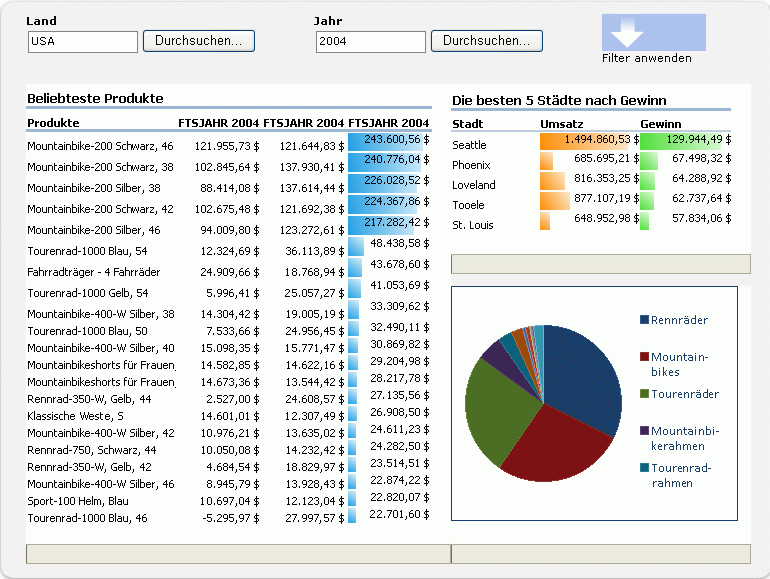

# Übersicht über Excel ServicesExcel Services Overview

Excel Services ist eine Dienstanwendung, mit der Sie Microsoft Excel-Arbeitsmappen in Microsoft SharePoint laden, berechnen und anzeigen können. Excel Services wurde in Microsoft Office SharePoint Server 2007 eingeführt.Excel Services is a service application that enables you to load, calculate, and display Microsoft Excel workbooks on Microsoft SharePoint. Excel Services was first introduced in Microsoft Office SharePoint Server 2007.
  
    
    

Mit Excel Services können Excel-Arbeitsmappen auf SharePoint-Portalen und -Dashboards wiederverwendet und gemeinsam genutzt werden. Beispielsweise können Finanzanalysten, Unternehmensplaner oder Ingenieure Inhalte in Excel erstellen und für andere Benutzer über ein SharePoint-Portal und -Dashboard freigeben, ohne benutzerdefinierten Code zu schreiben. Sie können bestimmen, welche Daten angezeigt werden, und können eine einzige Version Ihrer Excel-Arbeitsmappe verwalten. Es gibt vier primäre Schnittstellen für Excel Services:By using Excel Services, you can reuse and share Excel workbooks on SharePoint portals and dashboards. For example, financial analysts, business planners, or engineers can create content in Excel and share it with others by using an SharePoint portal and dashboard—without writing custom code. You can control what data is displayed, and you can maintain a single version of your Excel workbook. There are four primary interfaces for Excel Services: 
  
    
    

- Ein Excel Web Access-Webpart, mit dem Sie eine aktive Arbeitsmappe in einem Browser anzeigen und mit dieser kommunizieren könnenAn Excel Web Access Web Part, which enables you to view and interact with a live workbook by using a browser 
    
  
- Excel Web Services für den programmgesteuerten ZugriffExcel Web Services for programmatic access
    
  
- Ein ECMAScript (JavaScript, JScript)-Objektmodell zum Automatisieren, Anpassen und Steuern des Excel Web Access-Steuerelements, um das Erstellen ansprechender, integrierter Lösungen zu unterstützen, und mit der Möglichkeit, das ECMAScript (JavaScript, JScript)-Objektmodell um benutzerdefinierte Funktionen zu erweiternAn ECMAScript (JavaScript, JScript) object model for automating and customizing, and to drive the Excel Web Access control and help build more compelling, integrated solutions as well as the ability to user user-defined functions to extend the ECMAScript (JavaScript, JScript) object model
    
  
- Eine REST-API (Representational State Transfer) für den direkten Zugriff auf Arbeitsmappenteile über eine URLA Representational State Transfer (REST) API for accessing workbook parts directly through a URL
    
  

> **Hinweis:** Das Feature „Interaktive Excel-Ansicht“ wurde deaktiviert.**Note:** The Excel Interactive View feature has been disabled. Informationen zum Entfernen dieses Features von Ihrer Website finden Sie unter  [Entfernen der interaktiven Excel-Ansicht von einer Webseite](removing-excel-interactive-view-from-a-webpage.md).Note The Excel Interactive View feature has been disabled. For information about removing this feature from your website, see  [Removing Excel Interactive View from a webpage](removing-excel-interactive-view-from-a-webpage.md). 
  
    
    

Sie können die Dienste für Excel Berechnungen auch mithilfe von benutzerdefinierten Funktionen (User-defined Functions, UDFs) erweitern.You can also extend Excel Calculation Services by using user-defined functions (UDFs).
> **Hinweis:** Weitere Informationen zu den Diensten für Excel-Berechnungen finden Sie unter  [Excel Services-Architektur](excel-services-architecture.md).**Note** For more information about Excel Calculation Services, see  [Excel Services Architecture](excel-services-architecture.md). 
  
    
    

Mit Excel Services können Sie interaktive Live-Arbeitsmappen lediglich mithilfe eines Browsers anzeigen. Das heißt, Sie können Excel-Arbeitsmappen speichern und damit auf Portalwebsites interagieren.Darüber hinaus können Sie mit Excel-basierten Daten interagieren, indem Sie PivotTables sortieren, filtern, erweitern oder reduzieren und indem Sie Parameter übergeben. Dies ermöglicht das Analysieren von veröffentlichten Arbeitsmappen. Sie können mit einer Arbeitsmappe interagieren, ohne die veröffentlichte Arbeitsmappe zu ändern. Dies ist für Berichtsautoren und Berichtsconsumer hilfreich.Excel Services unterstützt Arbeitsmappen, die mit externen Datenquellen verbunden sind. Sie können Verbindungszeichenfolgen für externe Datenquellen in die Arbeitsmappe einbetten oder die Verbindungszeichenfolgen zentral in einer Datenverbindungsbibliothek-Datei speichern.Darüber hinaus können Zellen in Arbeitsmappen bearbeitbar gemacht werden, indem sie als benannte Bereiche (Parameter) festgelegt werden. Elemente, die Sie beim Speichern in Excel Services als sichtbar festlegen, werden im Bereich **Parameter** in Excel Web Access angezeigt. Sie können die Werte dieser benannten Bereiche im Bereich **Parameter** ändern und die Arbeitsmappe aktualisieren. Außerdem können Sie mit dem Filter-Webpart des Portals mehrere Webparts (Excel Web Access-Webparts und andere Arten von Webparts) gemeinsam filtern.Es ist jedoch nicht möglich, mit Excel Services neue Arbeitsmappen zu erstellen oder vorhandene Arbeitsmappen zu bearbeiten. Verwenden Sie Microsoft Excel 2013, um eine Arbeitsmappe für die Verwendung mit Excel Services zu erstellen.By using Excel Services, you can view live, interactive workbooks by using only a browser. This means that you can save Excel workbooks and interact with them from within portal sites.You can also interact with Excel-based data by sorting, filtering, expanding, or collapsing PivotTables, and by passing in parameters; this provides the ability to perform analysis on published workbooks. You can interact with a workbook without changing the published workbook—which is valuable for report authors and report consumers.Excel Services supports workbooks that are connected to external data sources. You can embed connection strings to external data sources in the workbook or save them centrally in a data connection library file.You can also make selected cells in worksheets editable by making them named ranges (parameters). Items that you choose to make viewable, when you save to Excel Services, appear in the **Parameters** pane in Excel Web Access. You can change the values of these named ranges in the **Parameters** pane and refresh the workbook. You can also use the portal's filter Web Part to filter several Web Parts (Excel Web Access and other types of Web Parts) together.However, you cannot use Excel Services to create new workbooks or to edit existing workbooks. To author a workbook for use with Excel Services, you can use Microsoft Excel 2013.
> **Hinweis:** In Microsoft Excel Online, Bestandteil von Office Online, werden auch Excel-Arbeitsmappen im Browser unterstützt.Microsoft Excel Online, part of Office Online, also supports Excel workbooks in the browser. Weitere Informationen zu Excel Online finden Sie unter [Erste Schritte mit dem neuen Office](http://office.microsoft.com/en-us/support/getting-started-with-office-FX102809998.aspx).Note Microsoft Excel Online, part of Office Online, also supports Excel workbooks in the browser. For more information about Excel Online, see  [Get started with the new Office](http://office.microsoft.com/en-us/support/getting-started-with-office-FX102809998.aspx). 
  
    
    

Excel Services weist auch einen Webdienst auf. Mit Excel Web Services können Sie Arbeitsmappen laden, Werte in Zellen und Bereichen festlegen, externe Datenverbindungen aktualisieren, Arbeitsmappen berechnen und berechnete Ergebnisse extrahieren (einschließlich Zellwerten, der gesamten berechneten Arbeitsmappe oder einer Momentaufnahme der Arbeitsmappe). In SharePoint können Sie mit Excel Web Services auch speichern, eine Kopie speichern und an gemeinsamen Bearbeitungssitzungen teilnehmen.Excel Services also has a Web service. You can use Excel Web Services to load workbooks, set values in cells and ranges, refresh external data connections, calculate worksheets, and extract calculated results (including cell values, the entire calculated workbook, or a snapshot of the workbook). In SharePoint, you can also save, save a copy, and participate in collaborative editing sessions by using Excel Web Services.
> **Hinweis:** Weitere Informationen zu Momentaufnahmen finden Sie unter  [Vorgehensweise: Abrufen einer kompletten Arbeitsmappe oder einer Momentaufnahme](how-to-get-an-entire-workbook-or-a-snapshot.md).**Note** For more information about snapshots, see  [How to: Get an Entire Workbook or a Snapshot](how-to-get-an-entire-workbook-or-a-snapshot.md). 
  
    
    

Excel Services unterstützt UDFs, mit denen Sie den Funktionsumfang von Dienste für Excel-Berechnungen erweitern können. Beispielsweise, um benutzerdefinierte Berechnungsbibliotheken zu implementieren oder um Daten in Webdiensten und Datenquellen zu lesen, die systemintern von Excel Services nicht unterstützt werden.Excel Services wurde als skalierbarer, leistungsfähiger Enterprise-Server entwickelt, der Feature- und Berechnungsgenauigkeit mit Excel bietet.Excel Services supports UDFs, which you can use to extend the capabilities of Excel Calculation Services—for example, to implement custom calculation libraries or to read data from Web services and data sources that are not natively supported by Excel Services.Excel Services is designed to be a scalable, robust, enterprise-class server that provides feature and calculation fidelity with Excel.
## Szenarien und FeaturesScenarios and Features

Excel Services unterstützt viele verschiedenen Szenarien und Features, von denen einige in diesem Abschnitt beschrieben werden.Excel Services supports many different scenarios and features, some of which are described in this section. 
  
    
    

### Business Intelligence-Portal und ArbeitsmappenanalyseBusiness Intelligence Portal and Workbook Analysis

In einem Business Intelligence-Portal werden Scorecards und Berichte angezeigt, und Benutzer können Daten lediglich mit einem Browser anzeigen. Das **Business Intelligence Center**-Feature in SharePoint Server weist ein Business Intelligence-Portal und Dashboardfunktionen auf. In Abbildung 1 ist ein Berichtscenterdashboard mit einer Berichtsbibliothek, einem Diagramm und bereits eingerichteten Key Performance Indicators (KPIs) dargestellt.A business intelligence portal displays scorecards and reports, and enables users to explore data by using only a browser. The **BI Center** feature in SharePoint Server includes a business intelligence portal and dashboard functionalities. Figure 1 shows a report center dashboard with a library of reports, a chart, and Key Performance Indicators (KPIs) already set up.
  
    
    
Mit Excel Services können Sie auch Daten auf dem Server berechnen. Excel Services ist am **Business Intelligence Center** beteiligt, indem es die Möglichkeit bietet, Excel-basierte Inhalte in integrierten BI-Dashboards zu berechnen und verfügbar zu machen. Sie können eine Excel-Arbeitsmappe mithilfe des Excel Web Access-Webparts anzeigen, eine Verbindung mit externen Datenquellen herstellen und mit den Daten in der Arbeitsmappe weiter interagieren.Excel Services also enables you to calculate data on the server. Excel Services participates in the **BI Center** by providing the ability to calculate and expose Excel-based content on integrated BI dashboards.You can display an Excel workbook by using the Excel Web Access Web Part, connect to external data sources, and further interact with the data in the workbook.
  
    
    
 In Abbildung 1 sehen Sie ein Dashboard mit einem Filter-Webpart sowie Excel-Arbeitsmappen, die mithilfe der Excel Web Access-Webparts angezeigt werden.Figure 1 shows a dashboard with a filter Web Part, and Excel workbooks displayed by using Excel Web Access Web Parts.
  
    
    

**Abbildung 1. Dashboard mit Filter und Excel-Inhalt****Figure 1. Dashboard with filtering and Excel content**

  
    
    

  
    
    

  
    
    
Neben der Beteiligung an integrierten Dashboards können mit Excel Services auch Excel-Arbeitsmappen vollständig oder teilweise angezeigt werden, damit Benutzer mit diesem Inhalt in der vertrauten Excel-Benutzeroberfläche interagieren können. In Abbildung 2 sehen Sie einen dargestellten Bereich und Zellen, die für die Benutzereingabe über Parameter verfügbar gemacht werden. Durch die Festlegung bestimmter Zellen als Parameter können Benutzer mithilfe der Bearbeitungsfelder im rechten Bereich Werte in diesen Zellen einer Arbeitsmappe ändern. Die Arbeitsmappe wird dann von Excel Services anhand der neuen Werte neu berechnet.In addition to participating in integrated dashboards, Excel Services can also be used to display all or part of Excel workbooks to enable users to interact with that content in the familiar Excel user interface. Figure 2 shows a range being displayed, and cells being exposed for user input through parameters. Designating specific cells as parameters enables users to change values in those cells in a worksheet by using the edit boxes in the right pane. Excel Services then recalculates the worksheet based on the new values.
  
    
    
Wenn Sie bestimmte Funktionen in Excel verwenden oder eine Arbeitsmappe mithilfe aller Excel-Funktionen analysieren möchten, können Sie durch Klicken auf **In Excel öffnen** eine Arbeitsmappe in Excel öffnen. Eine Arbeitsmappe können Sie auch in Excel öffnen, um sie zu drucken und um offline zu arbeiten.If you want to use certain functionalities in Excel or if you want to analyze a workbook by using all Excel functionalities, you can open a workbook in Excel by clicking **Open in Excel**. You can also open a workbook in Excel to print it and to work offline.
  
    
    

    
> **Hinweis:** Zum Öffnen einer Arbeitsmappe mit dem Befehl **In Excel öffnen** müssen Sie über die Berechtigung "Öffnen" verfügen.**Note:** To open a workbook by using the **Open in Excel** command, you must have "open" rights. Weitere Informationen finden Sie im nächsten Abschnitt **Verwalten von Arbeitsmappen** und unter [Benutzerberechtigungen und Berechtigungsstufen](http://technet.microsoft.com/de-de/library/cc721640%28office.14%29.aspx) auf [TechNet](http://technet.microsoft.com/de-de/library/cc263215%28office.14%29.aspx).For more information, see the next section, **Managing Workbooks**, and  [User Permissions and Permission Levels](http://technet.microsoft.com/de-de/library/cc721640%28office.14%29.aspx) on [TechNet](http://technet.microsoft.com/de-de/library/cc263215%28office.14%29.aspx). Benutzer, die nicht über die Berechtigung "Öffnen" verfügen, können dennoch eine Momentaufnahme in Excel öffnen.Users who do not have "open" rights can still open a snapshot in Excel. 
  
    
    

**Abbildung 2. Verwenden des Parameterbereichs****Figure 2. Using the Parameters pane**

  
    
    

  
    
    

  
    
    
Mit Excel Web Access können Sie auch Daten analysieren, pivotieren und mit diesen interagieren.You can also analyze, pivot, and interact with data by using Excel Web Access.
  
    
    
Weitere Informationen zu Excel Services und zu den Business Intelligence-Funktionen in SharePoint finden Sie in der Business Intelligence-Dokumentation in der Hilfe zu SharePoint Server.For more information about Excel Services and business intelligence capability in SharePoint, see the business intelligence documentation in SharePoint Server Help. 
  
    
    

### Verwalten von ArbeitsmappenManaging Workbooks

Die Arbeitsmappenverwaltungs- und Sperrfunktionen von Excel Services ermöglichen Folgendes:The workbook management and lockdown capabilities of Excel Services enable you to:
  
    
    

- Verwalten einer einzigen Arbeitsmappenkopie, die von einem vertrauenswürdigen Autor an einem zentralen, sicheren Ort erstellt und geändert wird, anstatt mehrere Kopien auf dem Computer jedes Benutzers zu verwalten. Die richtige Version der Arbeitsmappe ist dadurch in Excel, SharePoint und anderen Anwendungen leichter zu finden, gemeinsam zu nutzen und zu verwenden.Maintain only one copy of a workbook, that is created and changed by a trusted author in a central, secure place, instead of maintaining multiple copies on each user's computer. The correct version of the worksheet is easier to find, share, and use from within Excel, SharePoint, and other applications. 
    
  
- Sichern und Schützen der Arbeitsmappenmodelle und Back-End-Daten. Sie können Benutzern nur das Recht zum Anzeigen erteilen, um den Zugriff auf die Arbeitsmappe zu beschränken. Beispielsweise können Sie Benutzer am Öffnen einer Arbeitsmappe mit Excel hindern, oder aber steuern, was sie in einer Arbeitsmappe anzeigen dürfen. Benutzer können browserbasierten Zugriff auf den Inhalt in einer Arbeitsmappe haben, den der Autor freigeben möchte, aber nicht berechtigt sein, die Arbeitsmappe im Excel-Client zu öffnen, Formeln anzuzeigen oder unterstützende Inhalte und sonstiges geistiges Eigentum aus der Arbeitsmappe anzuzeigen.Secure and protect workbook models and back-end data. You can give users view-only rights to limit access to the workbook. For example, you can prevent users from opening a workbook by using Excel or you can control what they are allowed to view in a workbook. Users can have browser-based access to the content in a workbook that the author wants to share, but no ability to open the workbook in the Excel client, view formulas, or view supporting content or other intellectual property that may be in the workbook. 
    
  
- Erstellen von Momentaufnahmen einer Arbeitsmappe.Create snapshots of a workbook.
    
  
Excel Services ist für viele Benutzer und viele Arbeitsmappen optimiert. Hiermit können auch Berechnungsvorgänge auf die Serverfarm verteilt werden.Excel Services is optimized for many users and many workbooks. It can also help load-balance calculation across the server farm.
  
    
    
Weitere Informationen zum Verwalten von Arbeitsmappen mithilfe von Excel Services finden Sie in der SharePoint Server-Dokumentation auf  [TechNet](http://technet.microsoft.com/de-de/library/ee424405%28office.14%29.aspx) oder in der Hilfe zu SharePoint Server.For more information about managing workbooks by using Excel Services, see the SharePoint Server documentation on  [TechNet](http://technet.microsoft.com/de-de/library/ee424405%28office.14%29.aspx) or SharePoint Server Help.
  
    
    

### Programmgesteuerter Zugriff über benutzerdefinierte .NET-AnwendungenProgrammatic Access through Custom .NET Applications

Sie können benutzerdefinierte Anwendungen wie z. B. ASP.NET-Anwendungen für folgende Aktionen erstellen:You can create custom applications—for example, ASP.NET applications—that:
  
    
    

- Aufrufen von Excel Web Services, um Arbeitsmappen zu parametrisieren, zu berechnen und darauf zuzugreifen.Call Excel Web Services to access, parameterize, and calculate workbooks.
    
  
- Öffnen, Aktualisieren externer Daten, Festlegen von Zellen oder Bereichen, Neuberechnen, Teilnehmen an gemeinsamen Bearbeitungssitzungen mit anderen Anwendungen oder Personen, Speichern und Speichern unter.Open, refresh external data, set cells or ranges, recalculate, participate in collaborative editing sessions with other applications or people, save, and save as. 
    
  
- Planen von Berechnungsvorgängen oder Senden von E-Mail-Benachrichtigungen mithilfe benutzerdefinierter Workflows (hierfür werden SharePoint-Funktionen verwendet, die nicht Bestandteil von Excel Services sind).Use custom workflows to schedule calculation operations or send e-mail notifications. (This uses SharePoint capabilities and is not a native part of Excel Services.)
    
  

### Benutzerdefinierte Funktionen (User-Defined Functions, UDFs)User-Defined Functions (UDFs)

Excel Services-UDFs ermöglichen Ihnen die Verwendung von Formeln in Zellen zum Aufrufen von benutzerdefinierten Funktionen, die in verwaltetem Code geschrieben und in SharePoint Server bereitgestellt wurden.You can also use Excel Services UDFs, which enable you to use formulas in a cell to call custom functions that are written in managed code and deployed to SharePoint Server.
  
    
    
Weitere Informationen zu UDFs in Excel Services finden Sie unter  [Understanding Excel Services UDFs](understanding-excel-services-udfs.md).For more information about UDFs in Excel Services, see  [Understanding Excel Services UDFs](understanding-excel-services-udfs.md).
  
    
    

### ECMAScript (JavaScript, JScript)ECMAScript (JavaScript, JScript)

Mit dem JavaScript-Objektmodell in Excel Services können Sie das Excel Web Access-Webpart-Steuerelement automatisieren, anpassen und damit interagieren. Verwenden Sie das JavaScript-Objektmodell, um ansprechende, integrierte Lösungen zu erstellen.You can also use the JavaScript object model in Excel Services to automate, customize, and drive the Excel Web Access Web Part control. You can use the JavaScript object model to build more compelling and integrated solutions.
  
    
    

### Benutzerdefinierte JavaScript-Funktionen (UDFs)JavaScript user-defined functions (UDFs)

In Microsoft Excel Services und Microsoft SharePoint können Sie nun mithilfe von ECMAScript (JavaScript, JScript)-UDFs (User-Defined Functions) benutzerdefinierte Funktionen zu Excel hinzufügen, wenn Sie eine eingebettete Excel-Arbeitsmappe mit OneDrive oder ein Excel Web AccessExcel Web Access-Webpart in SharePoint verwenden. Neben den integrierten Funktionen, die Sie in Excel verwenden, können Sie mithilfe von JavaScript-UDFs eigene benutzerdefinierte Funktionen hinzufügen, die Sie in in Formeln aufrufen können.New in Microsoft Excel Services and Microsoft SharePoint, ECMAScript (JavaScript, JScript) UDFs enable you to add custom functions to Excel when you are using an embedded Excel workbook with OneDrive or an Excel Web AccessExcel Web Access Web Part in SharePoint. Besides the built-in functions that you use in Excel, you can add your own, custom functions using JavaScript UDFs that you can call from inside formulas in .
  
    
    
JavaScript-UDFs ähneln  [UDFs](http://msdn.microsoft.com/de-de/library/ms499792.aspx), die Sie für Microsoft Excel erstellen können. Der Unterschied besteht darin, dass JavaScript-UDFs nur in Arbeitsmappen verwendet werden, die in eine Webseite eingebettet sind, und nur auf dieser Webseite vorhanden sind.JavaScript UDFs are similar to  [UDFs](http://msdn.microsoft.com/de-de/library/ms499792.aspx) that you can create for Microsoft Excel. The difference is that JavaScript UDFs are only used in workbooks embedded in a webpage and only exist on that web page.
  
    
    

### JavaScript-ObjektmodellJavaScript Object Model

Die JSOM-API der Excel Services umfasst jetzt Folgendes:The Excel Services JSOM API now includes the following:
  
    
    

- Die Möglichkeit, die eingebettete Arbeitsmappe erneut zu laden. Jetzt können Sie die eingebettete Arbeitsmappe auf die Daten in der zugrunde liegenden Arbeitsmappendatei zurücksetzen.The ability to reload the embedded workbook. Now you can reset the embedded workbook to the data in the underlying workbook file.
    
  
- Vom Benutzer erstellte unverankerte Objekte. Das EwaControl-Objekt verfügt über neue Methoden, mit denen Sie selbst erstellte unverankerte Objekte hinzufügen oder entfernen können.User-created floating objects. The EwaControl object has new methods that let you add/remove floating objects that you create.
    
  
- Mehr Kontrolle über den sichtbaren Bereich des EWA-Steuerelements.More control over viewable area of the Ewa control.
    
  
- SheetChanged-Ereignis. Dieses Ereignis wird auslöst, wenn in einem Arbeitsblatt Änderungen erfolgen, z. B. Aktualisieren von Zellen, Löschen oder Entfernen von Zellen, Kopieren, Ausschneiden oder Einfügen von Bereichen und Rückgängig-/Wiederholen-Aktionen.SheetChanged Event. This event raises when something changes on a sheet, such as updating cells, deleting or clearing cells, copying, cutting or pasting ranges, and undo/redo actions.
    
  
- Aktivieren der Datenüberprüfung. Sie können nun Daten überprüfen, die von einem Benutzer eingegeben wurden.Enabling data validation. You can now validate data that is entered by a user.
    
  

### REST-APIREST API

Mit der REST-API in Excel Services können Sie direkt über eine URL auf Arbeitsmappenkomponenten oder -elemente zugreifen. Mit den in die REST-API von Excel Services integrierten Ermittlungsmechanismen können Entwickler und Benutzer den Inhalt einer Arbeitsmappe manuell oder programmgesteuert durchsuchen.You can use the REST API in Excel Services to access workbook parts or elements directly through a URL. The discovery mechanisms built into the Excel Services REST API enable developers and users to explore the content of the workbook manually or programmatically. 
  
    
    
Weitere Informationen zur REST-API in Excel Services finden Sie unter  [Excel Services-REST-API](excel-services-rest-api.md).For more information about the REST API in Excel Services, see  [Excel Services REST API](excel-services-rest-api.md).
  
    
    

### REST ODATAREST ODATA

In Microsoft Excel Services und Microsoft SharePoint können Sie jetzt mit der neuen OData-Funktionalität in der Excel Services REST-API die Tabellen in einer Excel-Arbeitsmappe als OData anfordern.New in Microsoft Excel Services and Microsoft SharePoint, by using the new OData functionality in the Excel Services REST API, you can request the tables inside an Excel workbook as OData. Beispiel: Verwenden Sie die folgende Syntax, um Excel-Metadaten zu den verfügbaren Ressourcen in der Arbeitsmappe „SampleWorkbook.xlsx“ mithilfe eines REST-Aufrufs anzufordern.For example, to request Excel metadata about available resources in the SampleWorkbook.xlsx workbook using a REST call, you use the following syntax.
  
    
    
http://\<ServerName\>/_vti_bin/ExcelRest.aspx/Docs/Documents/SampleWorkbook.xlsx/model. Weitere Informationen zur REST-API finden Sie in derhttp://\</_vti_bin/ExcelRest.aspx/Docs/Documents/SampleWorkbook.xlsx/model For more information about the REST API, see the 
  
    
    
 Dokumentation zur [Excel Services 2010 REST-API](http://msdn.microsoft.com/de-de/library/ee556413.aspx) in der Dokumentation zum SharePoint SDK.[Excel Services 2010 REST API](http://msdn.microsoft.com/de-de/library/ee556413.aspx) documentation in the SharePoint SDK documentation.
  
    
    
Um Metadaten zu den verfügbaren Ressourcen in der Arbeitsmappe "SampleWorkbook.xlsx" mithilfe von OData anzufordern, verwenden Sie die gleiche REST-Syntax, ersetzen jedoch "/Model" durch "/Odata", wie der folgenden Anforderung.To request metadata about available resources in the SampleWorkbook.xlsx workbook using OData, use the same REST syntax, except replace /Model with /Odata as in the following request. 
  
    
    
http://\<ServerName\>/_vti_bin/ExcelRest.aspx/Docs/Documents/sampleWorkbook.xlsx/ODatahttp://\<ServerName\>/_vti_bin/ExcelRest.aspx/Docs/Documents/sampleWorkbook.xlsx/OData
  
    
    
Von dort aus können Sie OData-Systemabfrageoptionen verwenden, um spezielle Informationen zu Tabellen in der Arbeitsmappe zu erhalten.From there you can use OData system query options to get specific information about tables inside the workbook.
  
    
    

## Zusätzliche RessourcenAdditional resources

-  [Excel Services Development RoadmapExcel Services Development Roadmap](excel-services-development-roadmap.md)
    
  
-  [Excel Services-ArchitekturExcel Services Architecture](excel-services-architecture.md)
    
  
-  [Benutzerdefinierte JavaScript-Funktionen (Übersicht)JavaScript user-defined functions overview](javascript-user-defined-functions-overview.md)
    
  
-  [Verwenden von OData mit Excel Services-REST in SharePointUsing OData with Excel Services REST in SharePoint](using-odata-with-excel-services-rest-in-sharepoint.md)
    
  
-  [Walkthrough: Developing a Custom Application Using Excel Web ServicesWalkthrough: Developing a Custom Application Using Excel Web Services](walkthrough-developing-a-custom-application-using-excel-web-services.md)
    
  
-  [Frequently Asked Questions About Excel Services UDFsFrequently Asked Questions About Excel Services UDFs](frequently-asked-questions-about-excel-services-udfs.md)
    
  
-  [Unsupported Features in Excel ServicesUnsupported Features in Excel Services](http://msdn.microsoft.com/library/5868e672-4786-4fed-9168-07ff538f6f5c%28Office.15%29.aspx)
    
  
-  [Excel Services - Blogs, Foren und RessourcenExcel Services Blogs, Forums, and Resources](excel-services-blogs-forums-and-resources.md)
    
  

