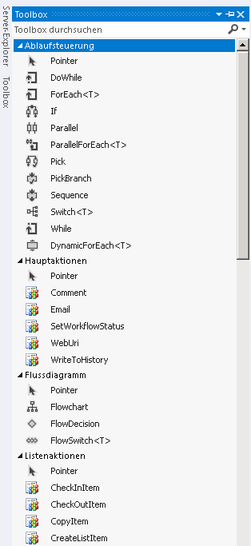

# Erste Schritte mit Workflows in SharePoint
Informationen zum neu entwickelten Workflow-Manager-Client 1.0, der die Infrastruktur für Workflows in SharePoint bereitstellt, und zur Integration von SharePoint-Workflows mit dem neuen Modell für SharePoint-Add-Ins.
> **Wichtig:** Anweisungen zum Einrichten und Konfigurieren von SharePoint und Microsoft Azure finden Sie unter  [Einrichten und Konfigurieren von SharePoint-Workflow-Manager](set-up-and-configure-sharepoint-workflow-manager.md). 
  
    
    

## Übersicht über Workflows in SharePoint

Workflows in SharePoint ermöglichen Ihnen das Entwickeln und Automatisieren von Geschäftsprozessen. Bei diesen Geschäftsprozessen kann es sich um einen einfachen Genehmigungsprozess für Dokumente mit einer einzelnen genehmigenden Person (siehe Abbildung 1), um einen komplexen Prozess mit einem Produktkatalog für Kunden unter Verwendung von Webdienstaufrufen und mit Datenbankunterstützung oder praktisch um jede Art von anspruchsvollem, strukturiertem Geschäftsprozess mit einer Vielzahl von Bedingungen, Schleifen, Benutzereingaben, Aufgaben und benutzerdefinierten Aktionen handeln.
  
    
    

**Abbildung 1. Einfacher SharePoint-Workflow**

  
    
    

  
    
    

  
    
    

  
    
    
SharePoint zeichnet sich durch die Einführung von Workflow-Manager-Client 1.0 als neues leistungsstarkes Fundament für Visual Studio-Workflows aus. Basierend auf Windows Workflow Foundation 4 bietet Workflow-Manager-Client 1.0 Vorteile gegenüber Vorversionen, die die Weiterentwicklung von SharePoint in Bezug auf das Modell für SharePoint-Add-Ins und das Cloud Computing zum Ausdruck bringen. Einzelheiten zu diesen Änderungen finden Sie unter  [Neuerungen in Workflows für SharePoint](what-s-new-in-workflows-for-sharepoint.md) und [Grundlegendes zu SharePoint-Workflows](sharepoint-workflow-fundamentals.md).
  
    
    
Für Workflowersteller vielleicht am wichtigsten ist, dass die Einrichtung von Workflows umfassend verbessert und vereinfacht wurde. Workflows sind mittlerweile nicht nur gänzlich deklarativ (d. h. designerbasiert und ohne Codierung), sondern auch die primären Umgebungen zum Erstellen von Workflows, sowohl Visual Studio 2012 als auch SharePoint Designer 2013, wurden vereinfacht und optimiert.
  
    
    
Nachfolgend werden die wichtigsten Weiterentwicklungen an Workflows in SharePoint vorgestellt. Eine detailliertere Übersicht der Neuerungen in Workflows für SharePoint finden Sie unter  [Neuerungen in Workflows für SharePoint](what-s-new-in-workflows-for-sharepoint.md).
  
    
    

- Verbesserte Verbindungsmöglichkeiten zum Ermöglichen einer cloudbasierten Ausführung von Workflows. In der Tat sind in SharePoint lokale und Office 365-basierte Workflows zu 100 % gleichranging.
    
  
- Es gibt eine vollständige Interoperabilität in SharePoint mit SharePoint 2010-Workflows, die durch die  [SharePoint-Workflowinteroperabilität ](sharepoint-workflow-fundamentals.md#bkm_InteropBridge) ermöglicht wird.
    
  
- Verbesserte Möglichkeiten zur Einrichtung von Workflows mithilfe von Visual Studio-Ereignissen und Aktionen, Webdiensten und klassischen Programmierungsstrukturen, alles in einer deklarativen codierungslosen Umgebung.
    
  
- Skalierbarkeit und Zuverlässigkeit im Einklang mit Anforderungen an Office 365 und das Cloud-App-Modell.
    
  
- Bessere Verbindungsmöglichkeiten zum Fördern integrierter Systeme mit hoher Funktionalität. Sie können Ihre Workflows auf beliebigen externen Systemen aufrufen und steuern. Darüber hinaus können Ihre Workflows Webdienstaufrufe an beliebige Streams und Datenquellen richten, wozu gängige Protokolle wie HTTP, SOAP, Odata (Open Data) und REST (Representational State Transfer) zum Einsatz kommen.
    
  
- Optimierte Erstellungsfunktionen für Nichtentwickler in SharePoint Designer 2013 und die Möglichkeit, Workflowlogik in Visio zu entwickeln.
    
  
- Optimierte, dennoch vereinfachte Workflowentwicklung in Visual Studio, einschließlich Unterstützung für benutzerdefinierte Workflowaktionen, schnelle Entwicklung in einer deklarativen Umgebung, Bereitstellung in einem Schritt und Unterstützung für die Entwicklung von SharePoint-Add-Ins.
    
  
- Vollständige Unterstützung für workflowgestützte SharePoint-Add-Ins, bei den Workflows als mittlere Ebene für die Verwaltung von Geschäftsprozessen dienen.
    
  

## Workflow-Manager-Client 1.0 und das Modell für SharePoint-Add-Ins

Visual Studio 2012 ist für die Entwicklung workflowgesteuerter SharePoint-Add-Ins und die Ausnutzung der enormen Leistungsfähigkeit und Flexibilität des Modell für SharePoint-Add-Ins optimiert. Sie können mithilfe des Objektmodells für SharePoint-Workflows die Workflowlogik hinter einer SharePoint-App so aktivieren, dass Endbenutzern die App-Oberfläche selbst gezeigt wird, während darunter die App von Ihrer Workflowlogik gesteuert wird.
  
    
    
Darüber hinaus eignet sich Visual Studio 2012 ideal für die Entwicklung von Office-Add-Ins, die Workflows innerhalb einer Microsoft Office-Anwendung ausführen können.
  
    
    

## Erstellen von SharePoint-Workflows

Es gibt zwei primäre Erstellungsumgebungen für Workflow-Manager-Client 1.0: SharePoint Designer 2013 und Visual Studio. Darüber hinaus können kaufmännisch orientierte Mitarbeiter Visio zum Erstellen von Workflowlogik nutzen, die Sie anschließend in SharePoint Designer importieren und in ein SharePoint-Workflowprojekt integrieren können.
  
    
    
Die primären Erstellungsumgebungen sind jedoch Visual Studio 2012 und SharePoint Designer 2013. Damit Sie bestimmen können, welche für Ihre Zwecke am besten geeignet ist, konsultieren Sie die Entscheidungsmatrix in  [Vergleich zwischen SharePoint Designer und Visual Studio](develop-sharepoint-workflows-using-visual-studio.md#bkm_Comparing).
  
    
    

## SharePoint Designer 2013 als Tool zur Erstellung von Workflows

In vielerlei Hinsicht ist SharePoint Designer 2013 für SharePoint-Workflows das beste Erstellungstool. Wenngleich einige erweiterte Aufgaben (z. B. das Erstellen benutzerdefinierter Aktionen) das Eingreifen eines Entwicklers mit Visual Studio erfordern, bietet SharePoint Designer 2013 einer breiten Palette von Workflowerstellern den flexibelsten Zugriff für die Workflowentwicklung.
  
    
    

## Erstellen eines Workflows mit Visual Studio 2012

In Visual Studio 2012 sind SharePoint-Workflowprojekttypen integriert. Befolgen Sie zum Erstellen eines SharePoint-Workflowprojekts in Visual Studio die folgenden Schritte.
  
    
    

### So erstellen Sie einen Workflow mithilfe von Visual Studio

1. Öffnen Sie Visual Studio 2012, und erstellen Sie ein neues Projekt. Wählen Sie im Dialogfeld **Neues Projekt** nacheinander **Vorlagen**, **Visual C#**, **Office SharePoint**, **SharePoint-Lösungen** und **SharePoint-Projekt** (siehe Abbildung 2).
    
   **Abbildung 2. Dialogfeld "Neues Projekt"**

  

  
  

  

  
2. Wählen Sie nach dem Erstellen des Projekts im Menü **Projekt** den Befehl **Neues Element hinzufügen** und anschließend unter dem Element **Office SharePoint** den Eintrag **Workflow** (siehe Abbildung 3).
    
   **Abbildung 3. Dialogfeld "Neues Element hinzufügen"**

  

  
  

  

  
3. Nach der Erstellung des Workflowprojekts wird Ihnen eine Designeroberfläche angezeigt, auf der Sie Ihren Workflow erstellen können. Zur Umgebung für die Workflowentwicklung gehört eine benutzerdefinierte Toolbox mit einer großen Palette von Elementen zur Erstellung von Workflows.
    
   **Abbildung 4. Visual Studio-Toolbox für die Erstellung von Workflows**

  

  
  

  

  

## Siehe auch

Weitere Informationen zu **SharePoint-Add-Ins** erhalten Sie unter den folgenden Themen:
  
    
    

-  [SharePoint-Add-Ins](http://msdn.microsoft.com/library/cd1eda9e-8e54-4223-93a9-a6ea0d18df70%28Office.15%29.aspx)
    
  
-  [Drei Ansätze, um Entwurfsentscheidungen für SharePoint-Add-Ins zu treffen](http://msdn.microsoft.com/library/0942fdce-3227-496a-8873-399fc1dbb72c%28Office.15%29.aspx)
    
  
-  [Wichtige Aspekte der Architektur und Entwicklungslandschaft von Add-Ins für SharePoint](http://msdn.microsoft.com/library/ae96572b-8f06-4fd3-854f-fc312f7f2d88%28Office.15%29.aspx)
    
  
-  [Arbeiten mit externen Daten in SharePoint](http://msdn.microsoft.com/library/1534a5f4-1d83-45b4-9714-3a1995677d85%28Office.15%29.aspx)
    
  
Weitere Informationen zum Entwickeln von Workflows mit **Visual Studio 2012** und **SharePoint Designer 2013** erhalten Sie unter den folgenden Themen:
  
    
    

-  [Entwickeln von SharePoint-Workflows mit Visual Studio](develop-sharepoint-workflows-using-visual-studio.md)
    
  
-  [Workflowentwicklung in SharePoint Designer und Visio](workflow-development-in-sharepoint-designer-and-visio.md)
    
  
Weitere Informationen zu Windows Workflow Foundation 4 erhalten Sie unter den folgenden Themen: 
  
    
    

-  [Einführung für Entwickler für Windows Workflow Foundation (WF) in .NET 4](http://msdn.microsoft.com/de-DE/library/ee342461.aspx)
    
  
-  [Neues in Windows Workflow Foundation](http://msdn.microsoft.com/de-DE/library/dd489410%28v=vs.110%29.aspx)
    
  
-  [Handbuch für Anfänger mit Windows Workflow Foundation](http://msdn.microsoft.com/de-DE/netframework/first-steps-with-wf.aspx)
    
  
-  [Grundlegendes zu Windows Workflow Foundation](http://msdn.microsoft.com/de-DE/library/dd851337.aspx)
    
  
-  [Einführung in das Regelmodul für Windows Workflow Foundation](http://msdn.microsoft.com/de-DE/library/dd554919.aspx)
    
  
-  [Integration von Windows Workflow Foundation mit Windows Communication Foundation](http://msdn.microsoft.com/de-DE/library/cc626077.aspx)
    
  

