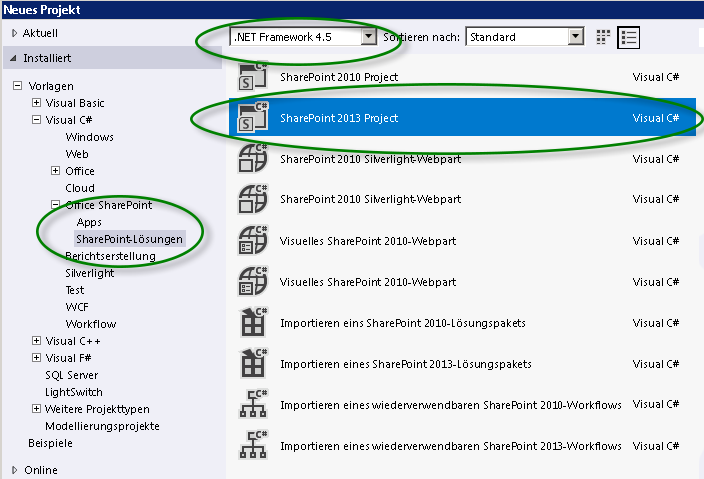

# Erste Schritte mit Workflows in SharePointGet started with workflows in SharePoint
Informationen zum neu entwickelten Workflow-Manager-Client 1.0, der die Infrastruktur für Workflows in SharePoint bereitstellt, und zur Integration von SharePoint-Workflows mit dem neuen Modell für SharePoint-Add-Ins.Learn about the newly engineered Workflow Manager Client 1.0, which provides the infrastructure for workflows in SharePoint, and how SharePoint workflows are integrated with the new model for SharePoint Add-ins.
> **Wichtig:** Anweisungen zum Einrichten und Konfigurieren von SharePoint und Microsoft Azure finden Sie unter  [Einrichten und Konfigurieren von SharePoint-Workflow-Manager](set-up-and-configure-sharepoint-workflow-manager.md).**Important** For instructions on setting up and configuring SharePoint Server 2013 and Microsoft Azure, see  [Set up and configure SharePoint Workflow Manager](set-up-and-configure-sharepoint-workflow-manager.md). 
  
    
    

## Übersicht über Workflows in SharePointOverview of workflows in SharePoint

Workflows in SharePoint ermöglichen Ihnen das Entwickeln und Automatisieren von Geschäftsprozessen. Bei diesen Geschäftsprozessen kann es sich um einen einfachen Genehmigungsprozess für Dokumente mit einer einzelnen genehmigenden Person (siehe Abbildung 1), um einen komplexen Prozess mit einem Produktkatalog für Kunden unter Verwendung von Webdienstaufrufen und mit Datenbankunterstützung oder praktisch um jede Art von anspruchsvollem, strukturiertem Geschäftsprozess mit einer Vielzahl von Bedingungen, Schleifen, Benutzereingaben, Aufgaben und benutzerdefinierten Aktionen handeln.Workflows in SharePoint allow you to model and automate business processes. These business processes can be as simple as a document approval process with a single approver (shown in Figure 1), as complex as customer-facing product catalog using web service calls and database support, or as formidable as virtually any structured business process, full of conditions, loops, user inputs, tasks, and custom actions.
  
    
    

**Abbildung 1. Einfacher SharePoint-Workflow****Figure 1. Simple SharePoint workflow**

  
    
    

  
    
    

  
    
    

  
    
    
SharePoint zeichnet sich durch die Einführung von Workflow-Manager-Client 1.0 als neues leistungsstarkes Fundament für Visual Studio-Workflows aus. Basierend auf Windows Workflow Foundation 4 bietet Workflow-Manager-Client 1.0 Vorteile gegenüber Vorversionen, die die Weiterentwicklung von SharePoint in Bezug auf das Modell für SharePoint-Add-Ins und das Cloud Computing zum Ausdruck bringen. Einzelheiten zu diesen Änderungen finden Sie unter  [Neuerungen in Workflows für SharePoint](what-s-new-in-workflows-for-sharepoint.md) und [Grundlegendes zu SharePoint-Workflows](sharepoint-workflow-fundamentals.md).SharePoint marks the introduction of Workflow Manager Client 1.0 as the powerful new foundation for Visual Studio workflows. Build on Windows Workflow Foundation 4, Workflow Manager Client 1.0 provides advantages over previous versions that reflect the commitment of SharePoint to the model for SharePoint Add-ins and cloud-based computing. For details of these changes, see  [What's new in workflows for SharePoint](what-s-new-in-workflows-for-sharepoint.md) and [SharePoint workflow fundamentals](sharepoint-workflow-fundamentals.md).
  
    
    
Für Workflowersteller vielleicht am wichtigsten ist, dass die Einrichtung von Workflows umfassend verbessert und vereinfacht wurde. Workflows sind mittlerweile nicht nur gänzlich deklarativ (d. h. designerbasiert und ohne Codierung), sondern auch die primären Umgebungen zum Erstellen von Workflows, sowohl Visual Studio 2012 als auch SharePoint Designer 2013, wurden vereinfacht und optimiert.Perhaps most importantly for workflow authors, the way that your create workflows has been vastly improved and simplified. Not only are workflows now entirely declarative (that is, designer-based, no-code workflows), but the primary workflow authoring environments, both Visual Studio 2012 and SharePoint Designer 2013, have been simplified and streamlined.
  
    
    
Nachfolgend werden die wichtigsten Weiterentwicklungen an Workflows in SharePoint vorgestellt. Eine detailliertere Übersicht der Neuerungen in Workflows für SharePoint finden Sie unter  [Neuerungen in Workflows für SharePoint](what-s-new-in-workflows-for-sharepoint.md).The key enhancements to workflows in SharePoint include the following. For a more detail overview of what's new in workflows for SharePoint, see  [What's new in workflows for SharePoint](what-s-new-in-workflows-for-sharepoint.md).
  
    
    

- Verbesserte Verbindungsmöglichkeiten zum Ermöglichen einer cloudbasierten Ausführung von Workflows. In der Tat sind in SharePoint lokale und Office 365-basierte Workflows zu 100 % gleichranging.Enhanced connectivity to enable cloud-based execution of workflows. In fact, there is 100 percent parity in SharePoint between on-premises and Office 365 -based workflows.
    
  
- Es gibt eine vollständige Interoperabilität in SharePoint mit SharePoint 2010-Workflows, die durch die  [SharePoint-Workflowinteroperabilität ](sharepoint-workflow-fundamentals.md#bkm_InteropBridge) ermöglicht wird.There is full interoperability in SharePoint with SharePoint 2010 workflows, which is enabled by using the  [SharePoint workflow interop ](sharepoint-workflow-fundamentals.md#bkm_InteropBridge).
    
  
- Verbesserte Möglichkeiten zur Einrichtung von Workflows mithilfe von Visual Studio-Ereignissen und Aktionen, Webdiensten und klassischen Programmierungsstrukturen, alles in einer deklarativen codierungslosen Umgebung.Enhanced authoring expressiveness by using Visual Studio events and action, web services, and classic programming structures, all in a declarative, no-code environment.
    
  
- Skalierbarkeit und Zuverlässigkeit im Einklang mit Anforderungen an Office 365 und das Cloud-App-Modell.Scalability and robustness that is consistent with requirements for Office 365 and the Cloud App Model.
    
  
- Bessere Verbindungsmöglichkeiten zum Fördern integrierter Systeme mit hoher Funktionalität. Sie können Ihre Workflows auf beliebigen externen Systemen aufrufen und steuern. Darüber hinaus können Ihre Workflows Webdienstaufrufe an beliebige Streams und Datenquellen richten, wozu gängige Protokolle wie HTTP, SOAP, Odata (Open Data) und REST (Representational State Transfer) zum Einsatz kommen.Enhanced connectivity to promote highly functional integrated systems. You can call and control your workflows from any external system. Additionally, your workflow can make web service calls to any stream or data source using common protocols like HTTP, SOAP, the Open Data protocol (OData), and Representational State Transfer (REST).
    
  
- Optimierte Erstellungsfunktionen für Nichtentwickler in SharePoint Designer 2013 und die Möglichkeit, Workflowlogik in Visio zu entwickeln.Enhanced authoring capabilities for the non-developer in SharePoint Designer 2013, and the ability to compose workflow logic in Visio.
    
  
- Optimierte, dennoch vereinfachte Workflowentwicklung in Visual Studio, einschließlich Unterstützung für benutzerdefinierte Workflowaktionen, schnelle Entwicklung in einer deklarativen Umgebung, Bereitstellung in einem Schritt und Unterstützung für die Entwicklung von SharePoint-Add-Ins.Enhanced, and yet simplified, workflow development in Visual Studio, including support for custom workflow actions, rapid development in a declarative environment, single-step deployment, and support for developing SharePoint Add-ins.
    
  
- Vollständige Unterstützung für workflowgestützte SharePoint-Add-Ins, bei den Workflows als mittlere Ebene für die Verwaltung von Geschäftsprozessen dienen.Full support for workflow-powered SharePoint Add-ins, where workflows function as the middle tier for business process management.
    
  

## Workflow-Manager-Client 1.0 und das Modell für SharePoint-Add-InsWorkflow Manager Client 1.0 and the model for SharePoint Add-ins

Visual Studio 2012 ist für die Entwicklung workflowgesteuerter SharePoint-Add-Ins und die Ausnutzung der enormen Leistungsfähigkeit und Flexibilität des Modell für SharePoint-Add-Ins optimiert. Sie können mithilfe des Objektmodells für SharePoint-Workflows die Workflowlogik hinter einer SharePoint-App so aktivieren, dass Endbenutzern die App-Oberfläche selbst gezeigt wird, während darunter die App von Ihrer Workflowlogik gesteuert wird.Visual Studio 2012 is optimized for developing workflow-driven SharePoint Add-ins and for exploiting the enormous power and flexibility of the model for SharePoint Add-ins. You can use the SharePoint workflow object model to enable workflow logic underneath a SharePoint app in such a way that end users experience the app surface itself while underneath the app is driven by your workflow logic.
  
    
    
Darüber hinaus eignet sich Visual Studio 2012 ideal für die Entwicklung von Office-Add-Ins, die Workflows innerhalb einer Microsoft Office-Anwendung ausführen können.Additionally, Visual Studio 2012 is ideal for developing Office Add-ins, which can run workflows from inside a Microsoft Office application.
  
    
    

## Erstellen von SharePoint-WorkflowsAuthoring SharePoint workflows

Es gibt zwei primäre Erstellungsumgebungen für Workflow-Manager-Client 1.0: SharePoint Designer 2013 und Visual Studio. Darüber hinaus können kaufmännisch orientierte Mitarbeiter Visio zum Erstellen von Workflowlogik nutzen, die Sie anschließend in SharePoint Designer importieren und in ein SharePoint-Workflowprojekt integrieren können.There are two primary authoring environments for Workflow Manager Client 1.0: SharePoint Designer 2013 and Visual Studio. Additionally, non-technical information workers can use Visio to construct workflow logic that you can then import into SharePoint Designer and assemble into a SharePoint workflow project.
  
    
    
Die primären Erstellungsumgebungen sind jedoch Visual Studio 2012 und SharePoint Designer 2013. Damit Sie bestimmen können, welche für Ihre Zwecke am besten geeignet ist, konsultieren Sie die Entscheidungsmatrix in  [Vergleich zwischen SharePoint Designer und Visual Studio](develop-sharepoint-workflows-using-visual-studio.md#bkm_Comparing).However, the primary authoring environments are Visual Studio 2012 and SharePoint Designer 2013. To help you decide which of these best suits your needs, see the decision matrix in  [Comparing SharePoint Designer with Visual Studio](develop-sharepoint-workflows-using-visual-studio.md#bkm_Comparing).
  
    
    

## SharePoint Designer 2013 als Tool zur Erstellung von WorkflowsSharePoint Designer 2013 as workflow authoring tool

In vielerlei Hinsicht ist SharePoint Designer 2013 für SharePoint-Workflows das beste Erstellungstool. Wenngleich einige erweiterte Aufgaben (z. B. das Erstellen benutzerdefinierter Aktionen) das Eingreifen eines Entwicklers mit Visual Studio erfordern, bietet SharePoint Designer 2013 einer breiten Palette von Workflowerstellern den flexibelsten Zugriff für die Workflowentwicklung.In many respects, SharePoint Designer 2013 is the authoring tool of choice for SharePoint workflows. Although some advanced tasks (like creating custom actions, for example) require the intervention of a developer using Visual Studio, SharePoint Designer 2013 provides the most flexible access to workflow development to the widest range of workflow authors.
  
    
    

## Erstellen eines Workflows mit Visual Studio 2012Create a workflow using Visual Studio 2012

In Visual Studio 2012 sind SharePoint-Workflowprojekttypen integriert. Befolgen Sie zum Erstellen eines SharePoint-Workflowprojekts in Visual Studio die folgenden Schritte.Visual Studio 2012 has SharePoint workflow project types built in. To create a SharePoint workflow project in Visual Studio, follow these steps.
  
    
    

### So erstellen Sie einen Workflow mithilfe von Visual StudioTo create a workflow using Visual Studio

1. Öffnen Sie Visual Studio 2012, und erstellen Sie ein neues Projekt. Wählen Sie im Dialogfeld **Neues Projekt** nacheinander **Vorlagen**, **Visual C#**, **Office SharePoint**, **SharePoint-Lösungen** und **SharePoint-Projekt** (siehe Abbildung 2).Open Visual Studio 2012 and create a new project. In the **New Project** dialog box, choose **Templates**, **Visual C#**, **Office SharePoint**, **SharePoint Solutions**, and **SharePoint Project**, as shown in Figure 2.
    
   **Abbildung 2. Dialogfeld "Neues Projekt"****Figure 2. New Project dialog box**

  

  
  

  

  
2. Wählen Sie nach dem Erstellen des Projekts im Menü **Projekt** den Befehl **Neues Element hinzufügen** und anschließend unter dem Element **Office SharePoint** den Eintrag **Workflow** (siehe Abbildung 3).With the project created, choose **Add New Item** on the **Project** menu, and then choose **Workflow** under the **Office SharePoint** item, as shown in Figure 3.
    
   **Abbildung 3. Dialogfeld "Neues Element hinzufügen"****Figure 3. Add New Item dialog box**

  

  
  

  

  
3. Nach der Erstellung des Workflowprojekts wird Ihnen eine Designeroberfläche angezeigt, auf der Sie Ihren Workflow erstellen können. Zur Umgebung für die Workflowentwicklung gehört eine benutzerdefinierte Toolbox mit einer großen Palette von Elementen zur Erstellung von Workflows.After the workflow project is created, you are presented with a designer surface on which to create your workflow. The workflow development environment includes a custom toolbox with a large palette of workflow authoring elements.
    
   **Abbildung 4. Visual Studio-Toolbox für die Erstellung von Workflows****Figure 4. Visual Studio workflow authoring toolbox**

  

  
  

  

  

## Zusätzliche RessourcenAdditional resources

Weitere Informationen zu **SharePoint-Add-Ins** erhalten Sie unter den folgenden Themen:For more information about **SharePoint Add-ins**, see the following:
  
    
    

-  [SharePoint-Add-InsSharePoint Add-ins](http://msdn.microsoft.com/library/cd1eda9e-8e54-4223-93a9-a6ea0d18df70%28Office.15%29.aspx)
    
  
-  [Drei Ansätze, um Entwurfsentscheidungen für SharePoint-Add-Ins zu treffenThree ways to think about design options for SharePoint Add-ins](http://msdn.microsoft.com/library/0942fdce-3227-496a-8873-399fc1dbb72c%28Office.15%29.aspx)
    
  
-  [Wichtige Aspekte der Architektur und Entwicklungslandschaft von Add-Ins für SharePointImportant aspects of the SharePoint Add-in architecture and development landscape](http://msdn.microsoft.com/library/ae96572b-8f06-4fd3-854f-fc312f7f2d88%28Office.15%29.aspx)
    
  
-  [Arbeiten mit externen Daten in SharePointWork with external data in SharePoint](http://msdn.microsoft.com/library/1534a5f4-1d83-45b4-9714-3a1995677d85%28Office.15%29.aspx)
    
  
Weitere Informationen zum Entwickeln von Workflows mit **Visual Studio 2012** und **SharePoint Designer 2013** erhalten Sie unter den folgenden Themen:For more information about developing workflows using **Visual Studio 2012** and **SharePoint Designer 2013**, see the following:
  
    
    

-  [Entwickeln von SharePoint-Workflows mit Visual StudioDevelop SharePoint workflows using Visual Studio](develop-sharepoint-workflows-using-visual-studio.md)
    
  
-  [Workflowentwicklung in SharePoint Designer und VisioWorkflow development in SharePoint Designer and Visio](workflow-development-in-sharepoint-designer-and-visio.md)
    
  
Weitere Informationen zu Windows Workflow Foundation 4 erhalten Sie unter den folgenden Themen:For more information about Windows Workflow Foundation 4, see the following: 
  
    
    

-  
  [Einführung für Entwickler für Windows Workflow Foundation (WF) in .NET 4](http://msdn.microsoft.com/de-de/library/ee342461.aspx)[A Developer's Introduction to Windows Workflow Foundation (WF) in .NET 4](http://msdn.microsoft.com/de-de/library/ee342461.aspx)
    
  
-  
  [Neues in Windows Workflow Foundation](http://msdn.microsoft.com/de-de/library/dd489410%28v=vs.110%29.aspx)[What's New in Windows Workflow Foundation](http://msdn.microsoft.com/de-de/library/dd489410%28v=vs.110%29.aspx)
    
  
-  [Handbuch für Anfänger mit Windows Workflow FoundationBeginner's Guide to Windows Workflow Foundation](http://msdn.microsoft.com/en-us/netframework/first-steps-with-wf.aspx)
    
  
-  
  [Grundlegendes zu Windows Workflow Foundation](http://msdn.microsoft.com/de-de/library/dd851337.aspx)[The Workflow Way: Understanding Windows Workflow Foundation](http://msdn.microsoft.com/de-de/library/dd851337.aspx)
    
  
-  
  [Einführung in das Regelmodul für Windows Workflow Foundation](http://msdn.microsoft.com/de-de/library/dd554919.aspx)[Introduction to the Windows Workflow Foundation Rules Engine](http://msdn.microsoft.com/de-de/library/dd554919.aspx)
    
  
-  
  [Integration von Windows Workflow Foundation mit Windows Communication Foundation](http://msdn.microsoft.com/de-de/library/cc626077.aspx)[Windows Workflow Foundation integration with Windows Communication Foundation](http://msdn.microsoft.com/de-de/library/cc626077.aspx)
    
  

