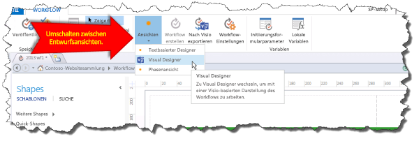

# Vertraut werden mit Visual Designer für Workflows in SharePoint Designer 2013Getting familiar with Visual Designer for workflow in SharePoint Designer 2013
Lernen Sie die grundlegenden Funktionen des visuellen Designers in SharePoint Designer 2013.Learn the basic features of the Visual Designer in SharePoint Designer 2013.
## Übersicht über den Visual Designer in SharePoint Designer 2013Overview of the Visual Designer in SharePoint Designer 2013

SharePoint Designer 2013 enthält eine neue Workflowentwurfsoberfläche Visual Designer aufgerufen. Verwenden Sie Visual Designer zum Entwickeln eines Workflows durch Ziehen von Shapes auf die Entwurfsoberfläche.SharePoint Designer 2013 includes a new workflow design surface called Visual Designer. You use Visual Designer to develop a workflow by dragging shapes onto the design surface.
  
    
    

> **Wichtig:** Zum Arbeiten mit dem Visual Designer muss Visio Professional 2013 auf demselben Computer wie SharePoint Designer 2013 installiert sein.**Important** In order to work with the Visual Designer, you must have Visio Professional 2013 installed on the same computer as SharePoint Designer 2013. If you do not have Visio installed you will receive an error, as shown in the figure. Wenn Visio nicht installiert ist, wird eine Fehlermeldung angezeigt, wie in der Abbildung dargestellt.If you do not have Visio installed you will receive an error, as shown in the figure. 
  
    
    

**Abbildung: Visio Professional 2013 ist zum Arbeiten mit Visual Designer erforderlich****Figure: Visio 2013 Professional is required to work with Visual Designer**

  
    
    

  
    
    

  
    
    
Der Bereich **Shapes** auf der linken Seite enthält die Workflow-Shapes, die Sie auf die Entwurfsoberfläche ziehen können, um den Workflow zu erstellen. Im folgenden werden die drei Kategorien von Formen zum Erstellen eines Workflows zur Verfügung.The **Shapes** pane on the left contains workflow shapes that you can drag to the design surface in order to create the workflow. Following are the three categories of shapes available for building a workflow.
  
    
    

- **Aktionen:** Bestimmte Aktionen, die vom Workflow ausgeführt werden können. Einige Beispiele sind einen HTTP-Webdienst aufrufen, einen Kommentar hinzufügen und eine Liste aktualisieren.**Actions:** Specific actions that can be performed by the workflow. Some examples include calling an HTTP web service, adding a comment, and updating a list.
    
  
- **Komponenten:** Allgemeine Komponenten, die hinzugefügt werden können, um eine strukturierte Umgebung für Workflowaktionen bereitzustellen. Einige Beispiele sind ein Container für die Phase, eine Schleife mit Bedingungen und ein Anfangs-Workflow-Shape.**Components:** General components that can be added to provide a structured environment for workflow actions. Some examples include a stage container, a loop with conditions, and a start workflow shape.
    
  
- **Bedingungen:** Bedingte Logik-Shapes, die verwendet werden können, um einen Workflow Pfad anhand bestimmter Kriterien bereitzustellen. Beispiele wird überprüft, ob ein Wert einen anderen Wert entspricht, wird überprüft, ob eine Person ein gültiger SharePoint-Benutzer ist und überprüft, ob ein Element in einem bestimmten Datumsbereich erstellt wird.**Conditions:** Conditional logic shapes that can be used to provide a workflow path based on specific criteria. Some examples include checking if one value equals another value, checking if a person is a valid SharePoint user, and checking if an item is created within a specific date range.
    
  

    
> **Tipp** Eine vollständige Liste der in SharePoint Designer 2013 verfügbaren Shapes finden Sie unter [Shapes in der SharePoint Server-Workflowvorlage in Visio](shapes-in-the-sharepoint-server-workflow-template-in-visio.md).**TIP** For a complete list of shapes available in SharePoint Designer 2013, see  [Shapes in the SharePoint Server workflow template in Visio](shapes-in-the-sharepoint-server-workflow-template-in-visio.md)
  
    
    

Die Abbildung zeigt einen Workflow in Visual Designer.The figure shows a workflow in Visual Designer.
  
    
    

**Visual Designer in SharePoint Designer 2013****Visual Designer in SharePoint Designer 2013**

  
    
    

  
    
    

  
    
    

  
    
    

  
    
    

## Mithilfe des visuellen Designers in SharePointUsing the Visual Designer in SharePoint

Der Zugriff auf des visuellen Designers in SharePoint Designer 2013 erfolgt über die Dropdown-Menü Ansichten der Registerkarte **Workflow**. Es gibt drei verschiedene Ansichten, die für die Entwicklung von einem Workflow verwendet werden können:The Visual Designer in SharePoint Designer 2013 is accessed through the Views drop-down menu of the **Workflow** tab. There are three different views that can be used for developing a workflow:
  
    
    

- **Textbasierter Designer:** Ein textbasierter Workflow-Entwicklungsumgebung.**Text-Based Designer:** A text-based workflow development environment.
    
  
- **Visual Designer:** Ein Workflow in visual-Entwicklungsumgebung, in denen Shapes auf die Entwurfsoberfläche gezogen werden kann, um den Workflow zu entwickeln. (Visio Professional 2013 erforderlich)**Visual Designer:** A visual workflow development environment where shapes can be dragged onto the design surface in order to develop the workflow. (Requires Visio Professional 2013)
    
  
- **Phase Ansicht:** Bietet eine grundlegende Übersicht über die visuelle Entwurfsoberfläche wie folgt Zusammenspiel Phasen des Workflows. Ähnelt der **Visual Designer**-Ansicht, aber es wird nicht angezeigt, die Details die Shape-Ebene. (Visio Professional 2013 erforderlich)**Stage View:** Provides a high-level view of the visual design surface by showing how stages of the workflow fit together. It is similar to the **Visual Designer** view but it does not show the shape-level detail. (Requires Visio Professional 2013)
    
  
Sie können zwischen **Ansichten** im Abschnitt **Verwalten** des Menübands **Workflow** wechseln, wie in der Abbildung dargestellt.You can switch between **Views** in the **Manage** portion of the **Workflow** ribbon as shown in the figure.
  
    
    

**Umschalten zwischen Entwurfsansichten in SharePoint Designer 2013****Switching between design views in SharePoint Designer 2013**

  
    
    

  
    
    

  
    
    
Ein Workflow kann in entweder die textbasierte Designer oder des visuellen Designers oder beide entwickelt werden. Wenn Sie einen Workflow mithilfe des Designers textbasierte entwickeln können Sie beispielsweise die Ansicht an den visuellen Designer wechseln und weiterhin im selben Workflow entwickeln. Sie können auch Entwickeln eines Workflows mithilfe des visuellen Designers beginnen und klicken Sie dann wechseln die Ansicht zu der textbasierten ebenso weiterhin im selben Workflow entwickeln. Verschieben und zurückblättert zwischen Ansichten bietet größere Flexibilität beim Entwickeln von Workflows.A workflow can be developed in either the Text-Based Designer or the Visual Designer or both. For example, if you are developing a workflow by using the Text-Based Designer you can switch the view to the Visual Designer and continue to develop the same workflow. Likewise, you can also begin developing a workflow by using the Visual Designer and then switch the view to the Text-Based Designer and continue to develop the same workflow. Moving back and forth between views provides flexibility in workflow development.
  
    
    

## Zusätzliche RessourcenAdditional resources

-  [Workflow in SharePoint Workflow in SharePoint ](http://technet.microsoft.com/de-de/sharepoint/jj556245.aspx)
    
  
-  [Neuigkeiten im Workflow in SharePointWhat's new in workflow in SharePoint Server 2013](http://msdn.microsoft.com/library/6ab8a28b-fa2f-4530-8b55-a7f663bf15ea.aspx)
    
  
-  [Erste Schritte mit SharePoint-WorkflowGetting started with SharePoint Server 2013 workflow](http://msdn.microsoft.com/library/cc73be76-a329-449f-90ab-86822b1c2ee8.aspx)
    
  
-  [Workflowentwicklung in SharePoint Designer und VisioWorkflow development in SharePoint Designer and Visio](workflow-development-in-sharepoint-designer-and-visio.md)
    
  
-  [Kurzübersicht zu Workflowaktionen (SharePoint-Workflowplattform)Workflow actions quick reference (SharePoint Workflow platform)](workflow-actions-quick-reference-sharepoint-workflow-platform.md)
    
  

