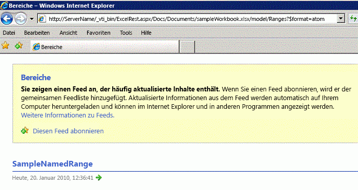
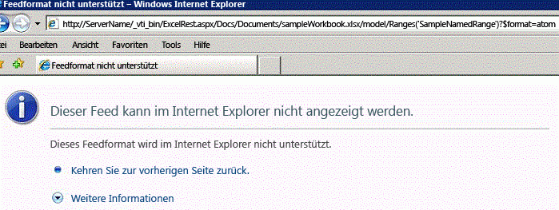
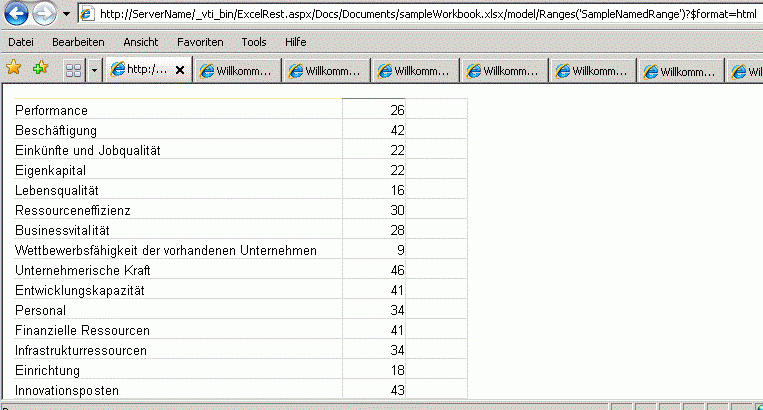

# <a name="getting-ranges-using-atom-feed-and-html-fragment"></a><span data-ttu-id="0f144-102">Abrufen von Bereichen mithilfe von Atom-Feed und HTML-Fragment</span><span class="sxs-lookup"><span data-stu-id="0f144-102">Getting Ranges Using Atom Feed and HTML Fragment</span></span>

<span data-ttu-id="0f144-103">In diesem Thema werden zwei Methoden zum Zugreifen auf Bereiche beschrieben: Atom-Feed und HTML-Fragment unter Verwendung der REST-API in Excel Services.</span><span class="sxs-lookup"><span data-stu-id="0f144-103">This topic describes two ways to access ranges—Atom feed and HTML fragment, by using the REST API in Excel Services.</span></span>
  
    
    


> <span data-ttu-id="0f144-104">**Hinweis:** Die Excel Services-REST-API bezieht sich auf SharePoint und SharePoint 2016 (lokal).</span><span class="sxs-lookup"><span data-stu-id="0f144-104">**Note:** The Excel Services REST API applies to SharePoint and SharePoint 2016 on-premises.</span></span> <span data-ttu-id="0f144-105">Für Office 365 Education-, Business- und Enterprise-Konten verwenden Sie die Excel-REST-APIs, die Bestandteil des [Microsoft Graph](http://graph.microsoft.io/en-us/docs/api-reference/v1.0/resources/excel
> )-Endpunkts sind.</span><span class="sxs-lookup"><span data-stu-id="0f144-105">Note The Excel Services REST API applies to SharePoint and SharePoint 2016 on-premises. For Office 365 Education, Business, and Enterprise accounts, use the Excel REST APIs that are part of the  [Microsoft Graph](http://graph.microsoft.io/en-us/docs/api-reference/v1.0/resources/excel
) endpoint.</span></span>
  
    
    


## <a name="accessing-ranges"></a><span data-ttu-id="0f144-106">Zugreifen auf Bereiche</span><span class="sxs-lookup"><span data-stu-id="0f144-106">Accessing Ranges</span></span>

<span data-ttu-id="0f144-p102">Die REST-API in Excel Services unterstützt zwei Mechanismen für den Zugriff auf Bereiche. Mit dem ersten Mechanismus können Anwendungen in erster Linie auf die Rohdaten einer Arbeitsmappe zugreifen, d. h., die Rohzahlen oder -werte in einem Arbeitsblatt. Mit dem zweiten Mechanismus kann in einem Browser auf HTML-Fragmente zugegriffen werden.</span><span class="sxs-lookup"><span data-stu-id="0f144-p102">The REST API in Excel Services supports two mechanisms for getting ranges. The first is used mainly to enable applications to get to the raw-data of a workbook, that is, the raw numbers or values from a worksheet. The second is to get HTML fragments from inside a browser.</span></span>
  
    
    
<span data-ttu-id="0f144-110">Entsprechend der Beschreibung im Thema [Ermittlung in der Excel Services-REST-API](discovery-in-excel-services-rest-api.md) lautet die REST-URL zur Modellseite mit Ermittlung wie folgt:</span><span class="sxs-lookup"><span data-stu-id="0f144-110">As described in the  [Discovery in Excel Services REST API](discovery-in-excel-services-rest-api.md) topic, the REST URL to the model page using discovery is:</span></span>
  
    
    


```

http://<ServerName>/_vti_bin/ExcelRest.aspx/<DocumentLibrary>/<FileName>/model
```

<span data-ttu-id="0f144-111">Für eine Arbeitsmappe mit dem Dateinamen **sampleWorkbook.xlsx**, die im Ordner <code>http://<i>\<ServerName\></i>/Docs/Documents/sampleWorkbook.xlsx</code> gespeichert ist, lautet der URI zur Modellseite daher wie folgt:</span><span class="sxs-lookup"><span data-stu-id="0f144-111">Therefore, for a workbook with the file name sampleWorkbook.xlsx that is saved to     , following is the URI to the model page:</span></span>
  
    
    


```
http://<ServerName>/_vti_bin/ExcelRest.aspx/Docs/Documents/sampleWorkbook.xlsx/model
```

<span data-ttu-id="0f144-112">Wenn Sie den im Thema [Ermittlung in der Excel Services-REST-API](discovery-in-excel-services-rest-api.md) beschriebenen Ermittlungsmechanismus verwenden und auf der Modellseite auf dem Server (`http://`_<ServerName>_ `/_vti_bin/ExcelRest.aspx/Docs/Documents/sampleWorkbook.xlsx/model`) auf den Atom-Feed **Bereiche** klicken, wird eine Seite mit allen benannten Bereichen in der Arbeitsmappe angezeigt.</span><span class="sxs-lookup"><span data-stu-id="0f144-112">Using the discovery mechanism described in Discovery in Excel Services REST AP, if you click on the Ranges Atom feed on the model page on the server, (http:// <ServerName> /_vti_bin/ExcelRest.aspx/Docs/Documents/sampleWorkbook.xlsx/model), it displays a page that shows all the named ranges in the workbook. The sampleWorkbook.xlsx contains one named range, SampleNamedRange, as shown in the following screen shot:</span></span> <span data-ttu-id="0f144-113">Die Arbeitsmappe „sampleWorkbook.xlsx“ enthält einen benannten Bereich, **SampleNamedRange**, wie im folgenden Screenshot gezeigt:</span><span class="sxs-lookup"><span data-stu-id="0f144-113">The sampleWorkbook.xlsx contains one named range, **SampleNamedRange**, as shown in the following screen shot:</span></span> 
  
    
    

> <span data-ttu-id="0f144-114">**Wichtig:** Sie können auch beliebige Bereiche angeben, nicht nur die von der Suche zurückgegebenen Bereiche.</span><span class="sxs-lookup"><span data-stu-id="0f144-114">**Important** You can also specify arbitrary ranges, and not just the ranges returned by discovery. Colon ":" must be replaced with "|". For example use "A1|G5" instead of "A1:G5".</span></span> <span data-ttu-id="0f144-115">Der Doppelpunkt „:“ muss durch „|“ ersetzt werden.</span><span class="sxs-lookup"><span data-stu-id="0f144-115">Colon ":" must be replaced with "|".</span></span> <span data-ttu-id="0f144-116">Verwenden Sie z. B. „A1|G5“ anstelle von „A1:G5“.</span><span class="sxs-lookup"><span data-stu-id="0f144-116">For example use "A1|G5" instead of "A1:G5".</span></span> 
  
    
    


> <span data-ttu-id="0f144-117">**Hinweis:** Zeichen wie „?“ und „#“ werden nicht unterstützt.</span><span class="sxs-lookup"><span data-stu-id="0f144-117">**Note:** Characters like "?" and "#" are unsupported.</span></span> <span data-ttu-id="0f144-118">Um ordnungsgemäß auf Blattnamen zu verweisen, die Sonderzeichen enthalten, gilt die Grundregel „Feststellen, was der Excel-Client macht“, wenn Sie in einer Formel auf ein Blatt mit Sonderzeichen verweisen, und diesem Beispiel folgen.</span><span class="sxs-lookup"><span data-stu-id="0f144-118">Special characters. Characters like "?" and "#" are unsupported. To correctly reference sheet names that contain special characters, the basic guideline is "see what the Excel client does" when referencing a formula to a sheet with special characters and follow that example.</span></span> 
  
    
    


<span data-ttu-id="0f144-119">**Ermittlung benannter Excel Services REST-Bereiche**</span><span class="sxs-lookup"><span data-stu-id="0f144-119">**Excel Services REST named range discovery**</span></span>

  
    
    

  
    
    

  
    
    

### <a name="accessing-ranges-by-using-an-atom-feed"></a><span data-ttu-id="0f144-121">Zugreifen auf Bereiche mithilfe eines ATOM-Feeds</span><span class="sxs-lookup"><span data-stu-id="0f144-121">Accessing Ranges by Using an Atom Feed</span></span>

<span data-ttu-id="0f144-122">Wenn Sie auf der Bereichsermittlungsseite auf **SampleNamedRange** klicken, navigieren Sie zur folgenden URL:</span><span class="sxs-lookup"><span data-stu-id="0f144-122">If you click **SampleNamedRange** in the range discovery page, you navigate to the following URL:</span></span>
  
    
    

```
http://<ServerName>/_vti_bin/ExcelRest.aspx/Docs/Documents/sampleWorkbook.xlsx/model/Ranges('SampleNamedRange')?$format=atom
```

<span data-ttu-id="0f144-123">Beachten Sie, dass wie im folgenden Bildschirmfoto dargestellt die resultierende Seite in Internet Explorer fehlerhaft aussieht.</span><span class="sxs-lookup"><span data-stu-id="0f144-123">Note that, in Internet Explorer, the resulting page looks like an error, as shown in the following screen shot.</span></span>
  
    
    

<span data-ttu-id="0f144-124">**Ermittlung von Excel Services REST-Bereichen mithilfe von ATOM**</span><span class="sxs-lookup"><span data-stu-id="0f144-124">**Excel Services REST range discovery using Atom**</span></span>

  
    
    

  
    
    

  
    
    
<span data-ttu-id="0f144-p106">In Internet Explorer kann ein ATOM-Feedelement mit einem einzelnen Eintrag nicht angezeigt werden. Beim Anzeigen des Quellcodes der Seite ist jedoch das XML des Feedelements sichtbar:</span><span class="sxs-lookup"><span data-stu-id="0f144-p106">Internet Explorer cannot show a single-entry Atom feed item. But viewing the source of the page shows the XML that the feed item contains:</span></span>
  
    
    


```XML
<?xml version="1.0" encoding="utf-8"?>
<entry xmlns:x="http://schemas.microsoft.com/office/2008/07/excelservices/rest" xmlns:d="http://schemas.microsoft.com/ado/2007/08/dataservice" xmlns:m="http://schemas.microsoft.com/ado/2007/08/dataservices/metadata" xmlns="http://www.w3.org/2005/Atom">
  <title type="text">SampleNamedRange</title>
  <id>http://ServerName/_vti_bin/ExcelRest.aspx/Docs/Documents/sampleWorkbook.xlsx/model/Ranges('SampleNamedRange')</id>
  <updated>2010-01-20T21:28:10Z</updated>
  <author>
    <name />
  </author>
  <link rel="self" href="http://ServerName/_vti_bin/ExcelRest.aspx/Docs/Documents/sampleWorkbook.xlsx/model/Ranges('SampleNamedRange')?$format=atom" title="SampleNamedRange" />
  <category term="ExcelServices.Range" scheme="http://schemas.microsoft.com/ado/2007/08/dataservices/scheme" />
  <content type="application/xml">
    <x:range name="SampleNamedRange">
      <x:row>
        <x:c>
          <x:fv>Performance</x:fv>
        </x:c>
        <x:c>
          <x:v>26</x:v>
          <x:fv>26</x:fv>
        </x:c>
        <x:c />
      </x:row>
      <x:row>
        <x:c>
          <x:fv>Employment</x:fv>
        </x:c>
        <x:c>
          <x:v>42</x:v>
          <x:fv>42</x:fv>
        </x:c>
        <x:c />
      </x:row>
      <x:row>
        <x:c>
          <x:fv>Earnings And Job Quality</x:fv>
        </x:c>
        <x:c>
          <x:v>22</x:v>
          <x:fv>22</x:fv>
        </x:c>
        <x:c />
      </x:row>
    ... XML truncated for brevity. 
      <x:row>
        <x:c>
          <x:fv>Innovation Assets</x:fv>
        </x:c>
        <x:c>
          <x:v>43</x:v>
          <x:fv>43</x:fv>
        </x:c>
        <x:c />
      </x:row>
      <x:row>
        <x:c />
        <x:c>
          <x:fv>State</x:fv>
        </x:c>
        <x:c />
      </x:row>
    </x:range>
  </content>
</entry>
```

<span data-ttu-id="0f144-p107">Das Feedelement enthält XML für die Daten innerhalb des Bereichs. Die folgenden XML-Elemente sind interessant:</span><span class="sxs-lookup"><span data-stu-id="0f144-p107">The feed item contains XML that represents the data inside the range. Following are the XML elements of interest:</span></span> 
  
    
    

- <span data-ttu-id="0f144-p108">**<range>** Das Bereichselement. Stellt den Container des zurückgegebenen Bereichs dar.</span><span class="sxs-lookup"><span data-stu-id="0f144-p108">**<range>** The range element. Represents the container of the returned range.</span></span>
    
  
- <span data-ttu-id="0f144-p109">**<row>** Das Zeilenelement. Stellt die einzelnen Zeilen im Bereich dar.</span><span class="sxs-lookup"><span data-stu-id="0f144-p109">**<row>** The row element. Represents each row in the range.</span></span>
    
  
- <span data-ttu-id="0f144-p110">**<c>** Das Zellenelement. Stellt die einzelnen Zellen in einer Zeile dar.</span><span class="sxs-lookup"><span data-stu-id="0f144-p110">**<c>** The cell element. Represents each cell in a row.</span></span>
    
  
- <span data-ttu-id="0f144-136">**<fv>** Das formatierte Wertelement.</span><span class="sxs-lookup"><span data-stu-id="0f144-136">**<fv>** The formatted value element.</span></span> <span data-ttu-id="0f144-137">Stellt den Wert so dar, wie er von Excel formatiert wird.</span><span class="sxs-lookup"><span data-stu-id="0f144-137">Represents the value as it is formatted by Excel.</span></span> <span data-ttu-id="0f144-138">Wenn der Wert in der Arbeitsmappe den Typ „Zeichenfolge“ aufweist, ist das formatierte Wertelement das einzige Element unter **<c>**.</span><span class="sxs-lookup"><span data-stu-id="0f144-138"><fv>  The formatted value element. Represents the value as it is formatted by Excel. If the value is of type string in the workbook, the formatted value element is the only element under <c>.</span></span> 
    
  
- <span data-ttu-id="0f144-p112">**<v>** Das Wertelement. Stellt einen Zahlenwert dar. Wenn der Wert in der Zelle keine Zeichenfolge, sondern eine Zahl ist, enthält das Wertelement diese Information.</span><span class="sxs-lookup"><span data-stu-id="0f144-p112">**<v>** The value element. Represents a number value. If the value in the cell is a number instead of a string, the value element contains that information.</span></span>
    
  
<span data-ttu-id="0f144-142">Die Verwendung von XML stellt eine einfachere Möglichkeit für den Zugriff auf Daten in einem Excel-Bereich dar. Sie können diese Methode deshalb in Ihrer Anwendung verwenden.</span><span class="sxs-lookup"><span data-stu-id="0f144-142">Using XML gives you an easier way to get data out of an Excel range so that you can use it in your application.</span></span> 
  
    
    

### <a name="accessing-ranges-by-using-html"></a><span data-ttu-id="0f144-143">Zugreifen auf Bereiche mithilfe von HTML</span><span class="sxs-lookup"><span data-stu-id="0f144-143">Accessing Ranges by Using HTML</span></span>

<span data-ttu-id="0f144-p113">Der letzte Teil der URL für den Zugriff auf einen benannten Bereich mithilfe eines ATOM-Feeds enthält den Parameter  `$format`, der auf  `atom` festgelegt ist. Dieser Parameter kann auch den Wert `html` aufweisen. Wenn Sie den `atom` in `html` ändern, gibt die URL ein HTML-Fragment anstelle eines ATOM-Feeds zurück. Es folgt ein Beispiel für die URL:</span><span class="sxs-lookup"><span data-stu-id="0f144-p113">If you look at the URL to access a named range by using Atom feed, note that the final part of the URL contains a parameter called  `$format`, which is set to  `atom`. This parameter can also take the value of  `html`. If you change the  `atom` value to `html`, the URL returns an HTML fragment instead of an Atom feed. Following is an example of the URL:</span></span>
  
    
    

```

http://<ServerName>/_vti_bin/ExcelRest.aspx/Docs/Documents/sampleWorkbook.xlsx/model/Ranges('SampleNamedRange')?$format=html
```

<span data-ttu-id="0f144-148">In Internet Explorer ähnelt die Seite der folgenden Abbildung.</span><span class="sxs-lookup"><span data-stu-id="0f144-148">In Internet Explorer, the page looks similar to the following figure.</span></span>
  
    
    

> <span data-ttu-id="0f144-149">**Hinweis:** Dieser HTML-Code kann in einem **IFRAME**-Element direkt genutzt werden. Sie können ihn aber auch in JavaScript verwenden, um ein nahtloses Arbeiten zu ermöglichen.</span><span class="sxs-lookup"><span data-stu-id="0f144-149">**Note** This HTML can be directly consumed in an **IFRAME**, or it can be used in JavaScript to create a more seamless experience.</span></span> 
  
    
    


  
    
    

  
    
    

  
    
    

  
    
    

## <a name="see-also"></a><span data-ttu-id="0f144-151">Siehe auch</span><span class="sxs-lookup"><span data-stu-id="0f144-151">See also</span></span>


#### <a name="concepts"></a><span data-ttu-id="0f144-152">Konzepte</span><span class="sxs-lookup"><span data-stu-id="0f144-152">Concepts</span></span>


  
    
    
 [<span data-ttu-id="0f144-153">Ressourcen-URI für die REST API in Excel Services</span><span class="sxs-lookup"><span data-stu-id="0f144-153">Resources URI for Excel Services REST API</span></span>](resources-uri-for-excel-services-rest-api.md)
