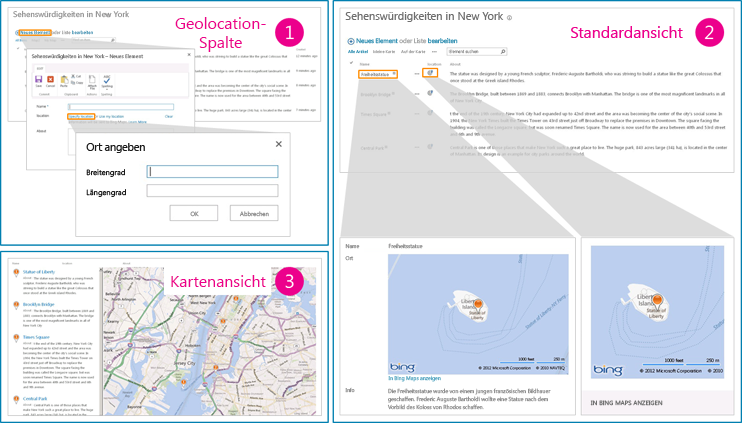

# <a name="add-a-geolocation-column-to-a-list-programmatically-in-sharepoint"></a>Programmgesteuertes Hinzufügen einer Geolocation-Spalte zu einer Liste in SharePoint
In diesem Artikel erfahren Sie, wie Sie programmgesteuert eine Geolocation-Spalte einer Liste in SharePoint hinzufügen. Sie können Standortinformationen und Karten in SharePoint-Listen und standortbasierten Websites mithilfe des neuen Geolocation-Felds hinzufügen, indem Sie Ihren eigenen Geolocation-basierten Feldtyp erstellen.
  
    
    

Sie müssen ein MSI-Paket mit dem Namen "SQLSysClrTypes.msi" auf jedem SharePoint-Front-End-Webserver installieren, um Geolocation-Feldwerte oder -Daten in einer Liste anzuzeigen. Dieses Paket installiert Komponenten, welche die neuen Geometrie-, Geografie- und Hierarchie-ID-Typen in SQL Server 2008 implementieren. Für SharePoint Online wird diese Datei standardmäßig installiert. Dies gilt jedoch nicht für lokale Bereitstellungen von SharePoint. Sie müssen Mitglied der Gruppe „Farmadministratoren“ sein, um diesen Vorgang ausführen zu können. Informationen zum Herunterladen von SQLSysClrTypes.msi finden Sie unter [Microsoft SQL Server 2008 R2 SP1 Feature Pack](http://www.microsoft.com/en-us/download/details.aspx?id=26728) für SQL Server 2008 oder unter [Microsoft SQL Server 2012 Feature Pack](http://www.microsoft.com/en-us/download/details.aspx?id=29065) für SQL Server 2012 im Microsoft Download Center.
## <a name="prerequisites-for-adding-a-geolocation-column"></a>Voraussetzungen für das Hinzufügen einer Geolocation-Spalte
<a name="SP15addgeo_prereq"> </a>


  
    
    

- Zugriff auf eine Liste von SharePoint, mit der ausreichenden Berechtigungen, um eine Spalte hinzuzufügen.
    
  
- Ein gültiger Bing Karten-Schlüssel muss auf Farm- oder Webebene festgelegt sein. Dieser kann aus dem [Bing Karten-Kontocenter](https://www.bingmapsportal.com/) abgerufen werden.
    
    > **Wichtig:** Bitte beachten Sie, dass Sie für die Einhaltung der für Ihre Nutzung des Bing Karten-Schlüssels anwendbaren Geschäftsbedingungen und alle erforderlichen Veröffentlichungen gegenüber Benutzern Ihrer Anwendung bezüglich an den Bing Daten-Dienst übermittelter Daten verantwortlich sind. 
- Visual Studio 2010.
    
  

## <a name="code-example-add-a-geolocation-column-to-a-list-programmatically"></a>Codebeispiel: Programmgesteuertes Hinzufügen eine Geolocation-Spalte zu einer Liste
<a name="SP15addgeo_addcolumn"> </a>

Gehen folgendermaßen Sie vor, um die Geolocation-Spalte zu einer Liste mithilfe des Clientobjektmodells SharePoint hinzuzufügen.
  
    
    

### <a name="to-add-the-geolocation-column-to-a-list-using-the-client-object-model"></a>So fügen Sie der Geolocation-Spalte zu einer Liste mithilfe des Clientobjektmodells hinzu


1. Starten Sie Visual Studio.
    
  
2. Wählen Sie auf der Menüleiste die Optionen Sie **Datei, neues Projekt** aus. Das Dialogfeld **Neues Projekt** wird geöffnet.
    
  
3. Klicken Sie im Dialogfeld **Neues Projekt** wählen Sie **c#** im Feld **Installierte Vorlagen**, und wählen Sie dann die Vorlage **Konsolenanwendung**.
    
  
4. Benennen Sie dem Projekt, und wählen Sie dann auf die Schaltfläche **OK**.
    
  
5. Visual Studio erstellt das Projekt. Fügen Sie einen Verweis auf die folgenden Assemblys hinzu, und wählen Sie **OK**.
    
    Microsoft.SharePoint.Client.dll
    
    Microsoft.SharePoint.Client.Runtime.dll
    
  
6. Fügen Sie eine Richtlinie **using** in der Standard-cs-Datei wie folgt.
    
     `using Microsoft.SharePoint.Client;`
    
  
7. Fügen Sie den folgenden Code zur **Main**-Methode in der CS-Datei hinzu.
    
```cs
  
class Program
    {
        static void Main(string[] args)
        {
            AddGeolocationField();
            Console.WriteLine("Location field added successfully");
        }
        private static void AddGeolocationField()
        { 
         // Replace site URL and List Title with Valid values.
            ClientContext context = new ClientContext("<Site Url>"); 
            List oList = context.Web.Lists.GetByTitle("<List Title>");
            oList.Fields.AddFieldAsXml("<Field Type='Geolocation' DisplayName='Location'/>",true, AddFieldOptions.AddToAllContentTypes);                                        
            oList.Update();
            context.ExecuteQuery();
        } 
    }
```

8. Ersetzen Sie \<Site Url\> und \<List Title\> durch gültige Werte.
    
  
9.  Legen Sie das Zielframework in den Projekteigenschaften als .NET Framework 4.0 oder 3.5 fest, und führen Sie das Beispiel aus.
    
  
10. Navigieren Sie zu der Liste. Sie sollten eine Spalte mit dem Namen **Speicherort** vom Typ Geolocation in der Liste anzeigen können. Sie können nun einige Werte und erleben. Abbildung 1 zeigt den Standardspeicherort und Map-Features, die Sie erwarten können, finden in der Liste.
    
   **Abbildung 1. Übersicht der standardmäßige Standort- und Karten-features**

  

  
  

  

  

## <a name="add-a-list-item-with-the-geolocation-field-value-to-a-sharepoint-list-programmatically"></a>Programmgesteuertes Hinzufügen eines Listenelements mit dem Wert des Geolocation-Feld zu einer SharePoint-Liste
<a name="SP15addgeo_addlistitem"> </a>

Nach der Geolocation wird Feld hinzugefügt, einer SharePoint-Liste der Entwickler das Listenelement programmgesteuert zur Liste hinzufügen kann. Es gibt zwei Methoden, um das Listenelement programmgesteuert hinzufügen:, indem Sie auf das Geolocation-Feld **komplexer FieldGeolocationValue**-Objekt übergeben und von Geolocation-Feld **Roh-Wert** übergeben.
  
    
    

### <a name="method-a-pass-the-fieldgeolocationvalue-object-to-the-geolocation-field"></a>Methode A: übergeben Sie komplexer FieldGeolocationValue-Objekt an die Geolocation-Feld


- Die folgende Methode fügt ein Listenelement, indem Sie als ein Objekt den Geolocation-Wert übergeben.
    
```cs
  
private void AddListItem()
        {   // Replace site URL and List Title with Valid values.
            ClientContext context = new ClientContext("<Site Url>");
            List oList = context.Web.Lists.GetByTitle("<List Name>");

            ListItemCreationInformation itemCreationInfo = new ListItemCreationInformation();
            ListItem oListItem = oList.AddItem(itemCreationInfo);

            oListItem["Title"] = "New Title";

            FieldGeolocationValue oGeolocationValue = new FieldGeolocationValue();
            oGeolocationValue.Latitude = (double)17.4;
            oGeolocationValue.Longitude = (double)78.4;
            oListItem["location"] = oGeolocationValue;

            oListItem.Update();
            context.ExecuteQuery();
        }

```


### <a name="method-b-pass-a-raw-value-to-the-geolocation-field"></a>Methode B: übergeben Sie unformatierten Wert an die Geolocation-Feld


- Die folgende Methode fügt ein Listenelement zur SharePoint-Liste, indem Sie auf das Geolocation-Feld unformatierte Werte übergeben.
    
```cs
  
private void AddListItem()
        {   // Replace site URL and List Title with Valid values.
            ClientContext context = new ClientContext("<Site Url>");
            List oList = context.Web.Lists.GetByTitle("<List Name>");

            ListItemCreationInformation itemCreationInfo = new ListItemCreationInformation();
            ListItem oListItem = oList.AddItem(itemCreationInfo);

            oListItem["Title"] = "New Title";
             // Data in WKT (World Known Text) format.
            oListItem["location"] = "POINT (78.4 17.4)" ; 

            oListItem.Update();
            context.ExecuteQuery();
        }

```


## <a name="see-also"></a>Siehe auch
<a name="SP15addgeo_addlresources"> </a>


-  [Integrieren von Standort- und Kartenfunktionen in SharePoint](integrating-location-and-map-functionality-in-sharepoint.md)
    
  
-  [Vorgehensweise: Legen Sie die Bing Maps-Taste auf Ordnerebene Web und Farm in SharePoint](how-to-set-the-bing-maps-key-at-the-web-and-farm-level-in-sharepoint.md)
    
  
-  [Vorgehensweise: erweitern den Geolocation-Feldtyp verwenden clientseitiges Rendering](how-to-extend-the-geolocation-field-type-using-client-side-rendering.md)
    
  
-  [Erstellen einer Kartenansicht für Geolocation-Feld in SharePoint](create-a-map-view-for-the-geolocation-field-in-sharepoint.md)
    
  
-  [Vorgehensweise: Integrieren von Zuordnungen in Windows Phone-Anwendungen und SharePoint aufgelistet](how-to-integrate-maps-with-windows-phone-apps-and-sharepoint-lists.md)
    
  
-  [Verwenden des Standortfeldtyps in mobilen Anwendungen für SharePoint](http://technet.microsoft.com/de-DE/library/fp161355%28v=office.15%29.aspx)
    
  

