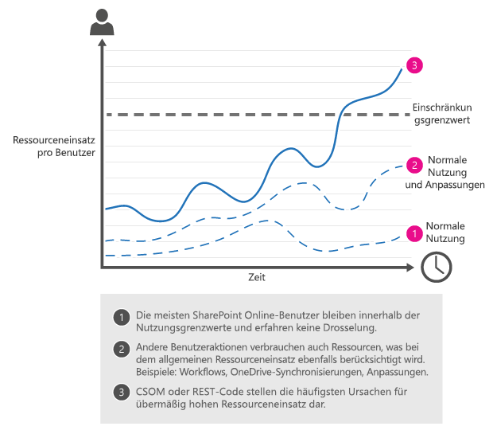
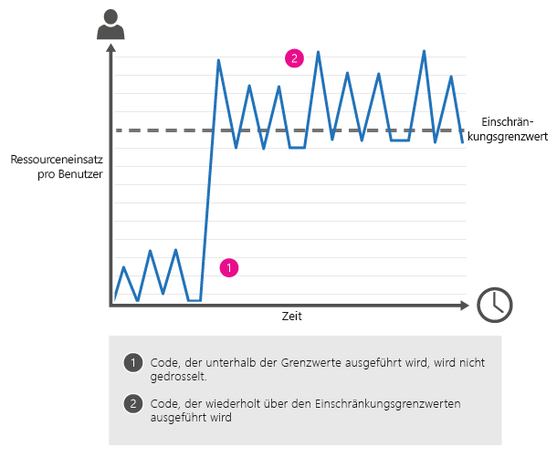
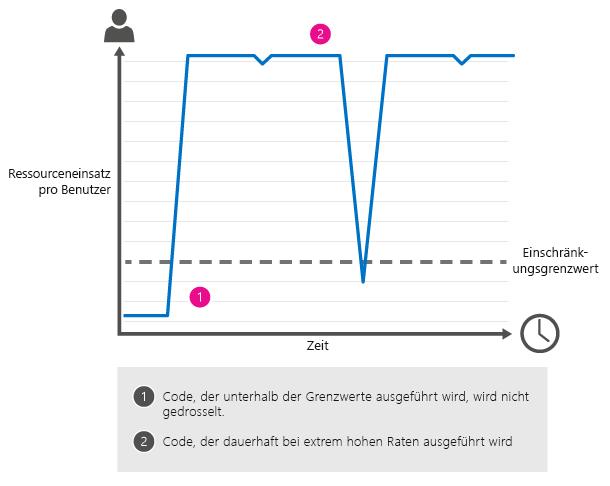

# <a name="avoid-getting-throttled-or-blocked-in-sharepoint-online"></a><span data-ttu-id="eca5c-102">Vermeiden von Einschränkungen oder Sperren in SharePoint Online</span><span class="sxs-lookup"><span data-stu-id="eca5c-102">How to: Avoid getting throttled or blocked in SharePoint Online</span></span>
<span data-ttu-id="eca5c-103">In diesem Artikel erfahren Sie mehr über das Thema Drosselung in SharePoint Online. Außerdem erläutern wir Ihnen, wie Sie eine Drosselung oder Sperre vermeiden können,</span><span class="sxs-lookup"><span data-stu-id="eca5c-103">Find out about throttling in SharePoint Online, and learn how to avoid being throttled or blocked.</span></span> <span data-ttu-id="eca5c-104">und stellen Ihnen CSOM- und REST-Beispielcode bereit, mit denen Sie die nötigen Aufgaben leichter umsetzen können.</span><span class="sxs-lookup"><span data-stu-id="eca5c-104">Includes sample CSOM and REST code you can use to make your task easier.</span></span>

-  [<span data-ttu-id="eca5c-105">Was bedeutet Drosselung?</span><span class="sxs-lookup"><span data-stu-id="eca5c-105">What is throttling?</span></span>](how-to-avoid-getting-throttled-or-blocked-in-sharepoint-online.md#BKMK_Whatisthrottling)

-  [<span data-ttu-id="eca5c-106">Drosselung Standardszenarien SharePoint Online</span><span class="sxs-lookup"><span data-stu-id="eca5c-106">Common throttling scenarios in SharePoint Online</span></span>](how-to-avoid-getting-throttled-or-blocked-in-sharepoint-online.md#BKMK_Commonthrottlingscenarios)

-  [<span data-ttu-id="eca5c-107">Warum teilt können nicht Sie nur die Grenzwerte für die genauen Drosselung mir?</span><span class="sxs-lookup"><span data-stu-id="eca5c-107">Why can't you just tell me the exact throttling limits?</span></span>](how-to-avoid-getting-throttled-or-blocked-in-sharepoint-online.md#BKMK_Whycantyoujusttellmetheexactthrottlinglimits)

-  [<span data-ttu-id="eca5c-108">Bewährte Methoden für die Vermeidung von Drosselung</span><span class="sxs-lookup"><span data-stu-id="eca5c-108">Best practices to handle throttling</span></span>](how-to-avoid-getting-throttled-or-blocked-in-sharepoint-online.md#BKMK_Bestpracticestohandlethrottling)
    
- [<span data-ttu-id="eca5c-109">Ausgestalten von Datenverkehr zur Vermeidung von Drosselung</span><span class="sxs-lookup"><span data-stu-id="eca5c-109">How to decorate your traffic to avoid getting throttled?</span></span>](how-to-avoid-getting-throttled-or-blocked-in-sharepoint-online.md#BKMK_DecorateSharePointOnlineThrottling)
  
-  [<span data-ttu-id="eca5c-110">CSOM-Codebeispiele in GitHub: SharePoint Online-Drosselung</span><span class="sxs-lookup"><span data-stu-id="eca5c-110">GitHub CSOM code samples: SharePoint Online Throttling</span></span>](how-to-avoid-getting-throttled-or-blocked-in-sharepoint-online.md#BKMK_GitHubCSOMandRESTcodesamplesSharePointOnlineThrottling)
    
  
-  [<span data-ttu-id="eca5c-111">Was sollten Sie tun, wenn Sie in SharePoint Online blockiert werden?</span><span class="sxs-lookup"><span data-stu-id="eca5c-111">What should you do if you get blocked in SharePoint Online?</span></span>](how-to-avoid-getting-throttled-or-blocked-in-sharepoint-online.md#BKMK_Whatshouldyoudoifyougetblocked)
    
  
-  [<span data-ttu-id="eca5c-112">Zusätzliche Ressourcen</span><span class="sxs-lookup"><span data-stu-id="eca5c-112">Additional resources</span></span>](how-to-avoid-getting-throttled-or-blocked-in-sharepoint-online.md#BKMK_Additionalresources)

<span data-ttu-id="eca5c-p102">Kommt diese bekannt? Sie sind einen CSOM Prozess - beispielsweise Informationen zum Migrieren von Dateien in SharePoint Online - ausführen, aber Sie gedrosselt erste beibehalten. Oder sogar schlechter erhalten Sie vollständig ausgeschlossen. Was geschieht, und was können Sie tun, sodass sie beenden?</span><span class="sxs-lookup"><span data-stu-id="eca5c-p102">Does this sound familiar? You're running a CSOM process - for example, to migrate files in SharePoint Online - but you keep getting throttled. Or even worse, you get completely blocked. What's going on and what can you do to make it stop?</span></span>
  
## <a name="what-is-throttling"></a><span data-ttu-id="eca5c-117">Was ist Drosselung bzw. Einschränkung?</span><span class="sxs-lookup"><span data-stu-id="eca5c-117">What is throttling?</span></span>
<span data-ttu-id="eca5c-118"><a name="BKMK_Whatisthrottling"> </a></span><span class="sxs-lookup"><span data-stu-id="eca5c-118"><a name="BKMK_Whatisthrottling"> </a></span></span>

<span data-ttu-id="eca5c-p103">SharePoint Online verwendet Einschränkung, um eine optimale Leistung und Zuverlässigkeit des Diensts SharePoint Online verwalten. Einschränkungsgrenzwerte Ruft die Anzahl von Aktionen eines Benutzers oder gleichzeitige (von Code- oder Skriptblock), um Ressourcen zu verhindern.</span><span class="sxs-lookup"><span data-stu-id="eca5c-p103">SharePoint Online uses throttling to maintain optimal performance and reliability of the SharePoint Online service. Throttling limits the number of user actions or concurrent calls (by script or code) to prevent overuse of resources.</span></span>
  
<span data-ttu-id="eca5c-p104">Dies bedeutet, dass es in SharePoint Online gedrosselt erhalten Benutzer äußerst selten ist. Der Dienst ist robuste und sehr große Menge behandeln soll. Wenn Sie die Schritte aus gedrosselt erhalten möchten, 99 % der Zeit aufgrund von benutzerdefiniertem Code ist. Keine bedeutet, dass keine andere Möglichkeiten zum Abrufen gedrosselt, einfach, dass sie weniger häufig sind vorhanden sind. Beispiel 10 Computer hochfahren und einen Sync-Client auf alle 10 haben. Synchronisieren Sie auf jedem 1TB von Inhalten. Dies wird wahrscheinlich gedrosselt angezeigt.</span><span class="sxs-lookup"><span data-stu-id="eca5c-p104">That said, it is extremely rare for a user to get throttled in SharePoint Online. The service is robust, and it is designed to handle very high volume. If you do get throttled, 99% of the time it is because of custom code. That doesn't mean that there aren't other ways to get throttled, just that they are less common. For example you spin up 10 machines and have a sync client going on all 10. On each sync 1TB of content. This would likely get you throttled.</span></span>
  


  
### <a name="what-happens-when-you-get-throttled-in-sharepoint-online"></a><span data-ttu-id="eca5c-129">Was geschieht, wenn Sie in SharePoint Online gedrosselt abrufen?</span><span class="sxs-lookup"><span data-stu-id="eca5c-129">What happens when you get throttled in SharePoint Online?</span></span>

<span data-ttu-id="eca5c-p105">Wenn ein Benutzer Einschränkungen überschreitet, anforderungsdrosselungen SharePoint Online keine weiteren Anforderungen von mit dem Benutzerkonto für kurze Zeit. Alle Benutzeraktionen Drosselungen während der Drosselung aktiviert ist.</span><span class="sxs-lookup"><span data-stu-id="eca5c-p105">When a user exceeds usage limits, SharePoint Online throttles any further requests from that user account for a short period. All user actions are throttled while the throttle is in effect.</span></span>
  
- <span data-ttu-id="eca5c-132">Bei Anforderungen, die ein Benutzer direkt im Browser ausführt, wird er von SharePoint Online zu einer Seite mit Informationen zur Einschränkung weitergeleitet. Die Anforderungen schlagen fehl.</span><span class="sxs-lookup"><span data-stu-id="eca5c-132">For requests that a user performs directly in the browser, SharePoint Online redirects you to the throttling information page, and the requests fail.</span></span>
  
- <span data-ttu-id="eca5c-133">Für alle anderen Anforderungen, einschließlich CSOM oder REST-Aufrufe SharePoint Online gibt den HTTP-Statuscode 429 ("zu viele Anforderungen"), und die Anforderungen fehl.</span><span class="sxs-lookup"><span data-stu-id="eca5c-133">For all other requests, including CSOM or REST calls, SharePoint Online returns HTTP status code 429 ("Too many requests"), and the requests fail.</span></span>
  
<span data-ttu-id="eca5c-p106">Wenn der problematische Prozess Usage Grenzwerte überschreitet weiterhin, möglicherweise SharePoint Online den Vorgang vollständig blockieren; in diesem Fall mangelndes HTTP-Statuscode 503 ("Dienst nicht verfügbar"), und benachrichtigen wir Sie den Block in Office 365 Message Center. Die Fehlermeldung ist unten aufgeführt:</span><span class="sxs-lookup"><span data-stu-id="eca5c-p106">If the offending process continues to exceed usage limits, SharePoint Online might completely block the process; in this case, you may see HTTP status code 503 ("Service unavailable"), and we'll notify you of the block in the Office 365 Message Center. The error message is shown below:</span></span>
      

      
<span data-ttu-id="eca5c-137">503 Servermeldung nicht verfügbar.</span><span class="sxs-lookup"><span data-stu-id="eca5c-137">503 Server unavailable message.</span></span>

## <a name="common-throttling-scenarios-in-sharepoint-online"></a><span data-ttu-id="eca5c-138">Drosselung Standardszenarien SharePoint Online</span><span class="sxs-lookup"><span data-stu-id="eca5c-138">Common throttling scenarios in SharePoint Online</span></span>
<span data-ttu-id="eca5c-139"><a name="BKMK_Commonthrottlingscenarios"> </a></span><span class="sxs-lookup"><span data-stu-id="eca5c-139"><a name="BKMK_Commonthrottlingscenarios"> </a></span></span>

<span data-ttu-id="eca5c-140">Die häufigsten Ursachen für Drosselungen in SharePoint Online pro Benutzer werden mithilfe der clientseitigen Objektmodell (CSOM) oder Representational State Transfer (REST) Code, der zu häufig zu viele Aktionen ausführt.</span><span class="sxs-lookup"><span data-stu-id="eca5c-140">The most common causes of per-user throttling in SharePoint Online are client-side object model (CSOM) or Representational State Transfer (REST) code that performs too many actions too frequently.</span></span>
    

- <span data-ttu-id="eca5c-141">**Bewusst Datenverkehr**</span><span class="sxs-lookup"><span data-stu-id="eca5c-141">**Sporadic traffic**</span></span>
    
    <span data-ttu-id="eca5c-142">Nicht viel des Datenverkehrs an jedem beliebigen Zeitpunkt aber genug über einen Zeitraum, den Sie innerhalb und außerhalb der Drosselung episodische Weise ausführen.</span><span class="sxs-lookup"><span data-stu-id="eca5c-142">Not a lot of traffic at any one time, but enough over time that you run in and out of throttling in an episodic way.</span></span>
    
  - <span data-ttu-id="eca5c-p107">Beispielsweise nach dem Migrieren von Dateien zum SharePoint Online, Ausführung ein benutzerdefiniertes CSOM oder REST-Skripts, um Metadaten für die Dateien zu aktualisieren. Das Skript CSOM/REST wird eine große Anzahl von Dateien mit einer sehr großer Häufigkeit aktualisiert das Drosselung auslöst. In ähnlicher Weise kann auch ein AutoVervollständigen-UI-Widget mit REST-Diensten zu viele Aufrufe an Listen während jeder Endbenutzer-Operation verursachen Drosselung, je nachdem, welche anderen Vorgängen Ressourcen zur selben Zeit in Anspruch nehmen.</span><span class="sxs-lookup"><span data-stu-id="eca5c-p107">For example, after migrating files to SharePoint Online, you run a custom CSOM or REST script to update metadata on the files. The CSOM/REST script is updating a large number of files at a very high frequency, which triggers throttling. Similarly, an autocomplete UI widget using REST services, making too many calls to lists during each end user operation, may also cause throttling, depending on what other operations are consuming resources at the same time.</span></span>
    
  
  
- <span data-ttu-id="eca5c-147">**Overwhelming Datenverkehr**</span><span class="sxs-lookup"><span data-stu-id="eca5c-147">**Overwhelming traffic**</span></span>
    
    <span data-ttu-id="eca5c-148">Ein einzelner Prozess überschreitet erheblich Drosselung Grenzwerte ständig, über einen längeren Zeitraum Zeitraum.</span><span class="sxs-lookup"><span data-stu-id="eca5c-148">A single process dramatically exceeds throttling limits, continually, over a long time period.</span></span>
    
  - <span data-ttu-id="eca5c-p108">Sie verwendet Webdienste zum Erstellen eines Tools zum Synchronisieren von Benutzerprofileigenschaften haben. Das Tool aktualisiert Benutzerprofileigenschaften basierend auf Informationen aus der Line-of-Business (LOB) Personalabteilung (HR)-System. Das Tool führt Aufrufe Zeitabständen zu hoch.</span><span class="sxs-lookup"><span data-stu-id="eca5c-p108">You used web services to build a tool to synchronize user profile properties. The tool updates user profile properties based on information from your line-of-business (LOB) human resources (HR) system. The tool makes calls at too high a frequency.</span></span>
  
  - <span data-ttu-id="eca5c-p109">Sie sind ein Auslastungstests Skript auf SharePoint Online ausgeführt, und Sie erhalten gedrosselt. Auslastungstests ist SharePoint Online nicht zulässig.</span><span class="sxs-lookup"><span data-stu-id="eca5c-p109">You're running a load-testing script on SharePoint Online and you get throttled. Load testing is not allowed on SharePoint Online.</span></span>
  
  - <span data-ttu-id="eca5c-p110">Sie haben Ihre Teamwebsite auf SharePoint Online, beispielsweise durch Hinzufügen einer Statusanzeige auf der Homepage angepasst. Dieser Statusindikator aktualisiert häufig, die bewirkt, dass der Seite zu viele Aufrufe an den Dienst SharePoint Online - dieser Einschränkung ausgelöst.</span><span class="sxs-lookup"><span data-stu-id="eca5c-p110">You customized your team site on SharePoint Online, for example, by adding a status indicator on the Home page. This status indicator updates frequently, which causes the page to make too many calls to the SharePoint Online service - this triggered throttling.</span></span>
    
  
  
## <a name="why-cant-you-just-tell-me-the-exact-throttling-limits"></a><span data-ttu-id="eca5c-157">Warum teilt können nicht Sie nur die Grenzwerte für die genauen Drosselung mir?</span><span class="sxs-lookup"><span data-stu-id="eca5c-157">Why can't you just tell me the exact throttling limits?</span></span>
<span data-ttu-id="eca5c-158"><a name="BKMK_Whycantyoujusttellmetheexactthrottlinglimits"> </a></span><span class="sxs-lookup"><span data-stu-id="eca5c-158"><a name="BKMK_Whycantyoujusttellmetheexactthrottlinglimits"> </a></span></span>

<span data-ttu-id="eca5c-p111">Festlegen und Veröffentlichen von genauen Einschränkung beschränkt Sounds ganz einfach, aber es ist tatsächlich nicht die beste Möglichkeit zum wechseln. Wir überwachen ständig der Ressourcenverwendung auf SharePoint Online. Je nach Verwendung optimieren wir Schwellenwerte, damit Benutzer die maximale Anzahl von Ressourcen verbraucht werden können, ohne Beeinträchtigung der Zuverlässigkeit und Leistung von SharePoint Online. Deshalb ist es ist also wichtig für den CSOM oder REST Einbeziehung inkrementelle Back deaktiviert zum Verarbeiten von Beschränkung; auf diese Weise können Code auf jedem beliebigen Tag so schnell wie möglich ausgeführt, und es Codes wieder aus "nur genügend" kann, wenn es Drosselung Grenzwerte besucht. Die folgenden Codebeispiele weiter unten in diesem Artikel zeigen, wie verwenden inkrementeller wieder aus.</span><span class="sxs-lookup"><span data-stu-id="eca5c-p111">Setting and publishing exact throttling limits sounds very straightforward, but in fact, it's not the best way to go. We continually monitor resource usage on SharePoint Online. Depending on usage, we fine-tune thresholds so users can consume the maximum number of resources without degrading the reliability and performance of SharePoint Online. That's why it's so important for your CSOM or REST code to include incremental back off to handle throttling; this lets your code run as fast as possible on any given day, and it lets your code back off "just enough" if it hits throttling limits. The code samples later in this article show you how to use incremental back off.</span></span>

## <a name="best-practices-to-handle-throttling"></a><span data-ttu-id="eca5c-164">Bewährte Methoden zum Behandeln der Einschränkungen</span><span class="sxs-lookup"><span data-stu-id="eca5c-164">Best practices to handle throttling</span></span>
<span data-ttu-id="eca5c-165"><a name="BKMK_Bestpracticestohandlethrottling"> </a></span><span class="sxs-lookup"><span data-stu-id="eca5c-165"><a name="BKMK_Bestpracticestohandlethrottling"> </a></span></span>

- <span data-ttu-id="eca5c-166">Reduzieren Sie die Anzahl der Vorgänge pro Anforderung</span><span class="sxs-lookup"><span data-stu-id="eca5c-166">Reduce the number of operations per request</span></span>
    
- <span data-ttu-id="eca5c-167">Reduzieren Sie die Aufrufhäufigkeit.</span><span class="sxs-lookup"><span data-stu-id="eca5c-167">Reduce the frequency of calls</span></span>
    
- <span data-ttu-id="eca5c-168">Gestalten Sie Ihren Datenverkehr so aus, dass Ihre Identität ersichtlich ist (siehe Abschnitt mit den bewährten Methoden zur Datenverkehrsausgestaltung weiter unten).</span><span class="sxs-lookup"><span data-stu-id="eca5c-168">Decorate your traffic so we know who you are (see section on traffic decoration best practice more on that below)</span></span>
    
<span data-ttu-id="eca5c-169">Falls es doch zu einer Drosselung kommt, empfehlen wir einen inkrementellen Backoff zur Reduzierung der Anzahl und der Häufigkeit von Aufrufen, so lange, bis keine Drosselung mehr vorgenommen wird.</span><span class="sxs-lookup"><span data-stu-id="eca5c-169">If you do run into throttling, we recommend incremental back off to reduce the number and frequency of calls until no more throttling occurs.</span></span>

<span data-ttu-id="eca5c-p112">Inkrementelle Back deaktiviert Verwendungsmöglichkeiten stetig länger wartet zwischen den versuchen, bevor Sie erneut versuchen, den Code auszuführen, der gedrosselt wurde. Die Codebeispiele GitHub können weiter unten in diesem Artikel als Erweiterungsmethoden, Sie inkrementelle Back aus dem Code hinzufügen.</span><span class="sxs-lookup"><span data-stu-id="eca5c-p112">Incremental back off uses progressively longer waits between retries before trying again to run the code that was throttled. You can use the GitHub code samples, later in this article, written as extension methods, to add incremental back off to your code.</span></span>
    
<span data-ttu-id="eca5c-p113">Sichern deaktiviert, ist die schnellste Methode zum Verarbeiten, da die Ressource: Einsatz melden, während ein Benutzer gedrosselt wird weiterhin SharePoint Online gedrosselt wird. Anders ausgedrückt, arbeiten aggressive Wiederholungsversuche gegen Sie, da, obwohl die Anrufe ausfallen, diese weiterhin vor Ihrer Verwendung Grenzwerte anfallen. Schneller dem Sichern deaktiviert, schneller Sie nicht mehr Usage überschreiten.</span><span class="sxs-lookup"><span data-stu-id="eca5c-p113">Backing off is the fastest way to handle being throttled because SharePoint Online continues to log resource usage while a user is being throttled. In other words, aggressive retries work against you because even though the calls fail, they still accrue against your usage limits. The faster you back off, the faster you'll stop exceeding usage limits.</span></span> 

<span data-ttu-id="eca5c-175">For information about ways to monitor your SharePoint Online activity, see  [Diagnosing performance issues with SharePoint Online](https://support.office.com/de-DE/article/3c364f9e-b9f6-4da4-a792-c8e8c8cd2e86).</span><span class="sxs-lookup"><span data-stu-id="eca5c-175">For information about ways to monitor your SharePoint Online activity, see  [Diagnosing performance issues with SharePoint Online](https://support.office.com/de-DE/article/3c364f9e-b9f6-4da4-a792-c8e8c8cd2e86).</span></span>

<span data-ttu-id="eca5c-176">Eine ausführlichere Erläuterung zum Thema Drosselung in der Microsoft Cloud finden Sie unter [Throttling Pattern](http://msdn.microsoft.com/library/4baf5af2-32fc-47ab-8569-3e5c59a5ebd5.aspx).</span><span class="sxs-lookup"><span data-stu-id="eca5c-176">For a broader discussion of throttling on the Microsoft Cloud, see  [Throttling Pattern](http://msdn.microsoft.com/library/4baf5af2-32fc-47ab-8569-3e5c59a5ebd5.aspx).</span></span>

## <a name="how-to-decorate-your-http-traffic-to-avoid-throttling"></a><span data-ttu-id="eca5c-177">Ausgestalten von HTTP-Datenverkehr zur Vermeidung von Drosselung</span><span class="sxs-lookup"><span data-stu-id="eca5c-177">How to decorate your http traffic to avoid throttling?</span></span>
<span data-ttu-id="eca5c-178"><a name="BKMK_DecorateSharePointOnlineThrottling"> </a></span><span class="sxs-lookup"><span data-stu-id="eca5c-178"><a name="BKMK_DecorateSharePointOnlineThrottling"> </a></span></span>

<span data-ttu-id="eca5c-179">Unter Umständen wird bestimmter Datenverkehr gedrosselt, um hohe Verfügbarkeit sicherzustellen.</span><span class="sxs-lookup"><span data-stu-id="eca5c-179">To ensure and maintain high-availability, some traffic may be throttled.</span></span> <span data-ttu-id="eca5c-180">Gedrosselt wird, wenn die Systemintegrität gefährdet ist. Ein Kriterium für die Drosselung ist dabei die Ausgestaltung des Datenverkehrs. Sie wirkt sich unmittelbar auf die Datenverkehrspriorisierung aus.</span><span class="sxs-lookup"><span data-stu-id="eca5c-180">Throttling happens when system health is at stake and one of the criteria used for throttling is traffic decoration, which impacts directly on the prioritization of the traffic.</span></span> <span data-ttu-id="eca5c-181">Korrekt ausgestalteter Datenverkehr hat Vorrang vor nicht korrekt ausgestaltetem Datenverkehr.</span><span class="sxs-lookup"><span data-stu-id="eca5c-181">Well decorated traffic will be prioritized over traffic which is not properly decorated.</span></span>
 
<span data-ttu-id="eca5c-182">Wann gilt Datenverkehr als nicht ausgestaltet?</span><span class="sxs-lookup"><span data-stu-id="eca5c-182">What is definition of undecorated traffic?</span></span>

- <span data-ttu-id="eca5c-183">Datenverkehr gilt als nicht ausgestaltet, wenn im SharePoint-Aufruf der CSOM-API oder der REST-API keine Zeichenfolge des Typs „AppID“/„AppTitle“ oder des Typs „UserAgent“ enthalten ist.</span><span class="sxs-lookup"><span data-stu-id="eca5c-183">Traffic is undecorated if there is no AppID/AppTitle or User Agent string in CSOM or REST API call to SharePoint Online.</span></span>

<span data-ttu-id="eca5c-184">Was empfiehlt Microsoft?</span><span class="sxs-lookup"><span data-stu-id="eca5c-184">What are the recommendation?</span></span>

- <span data-ttu-id="eca5c-185">Wenn Sie eine Anwendung erstellt haben, sollten Sie sie registrieren und die Zeichenfolgen „AppID“ und „AppTitle“ verwenden. Das gewährleistet eine optimale Benutzererfahrung und zügige Fehlerbehebung.</span><span class="sxs-lookup"><span data-stu-id="eca5c-185">If you have created an application, recommendation is to register and use  AppID and AppTitle – This will ensure the best overall experience and best path for any future issue resolution.</span></span> <span data-ttu-id="eca5c-186">Sie sollten zudem die Zeichenfolge des Benutzer-Agenten einfügen, wie im nachfolgenden Beispiel beschrieben.</span><span class="sxs-lookup"><span data-stu-id="eca5c-186">Include also the User Agent string information as defined in following step.</span></span>

- <span data-ttu-id="eca5c-187">Verwenden Sie für die Zeichenfolge des Benutzer-Agenten im API-Aufruf auf jeden Fall die folgende Namenskonvention:</span><span class="sxs-lookup"><span data-stu-id="eca5c-187">Make sure to include User Agent string in your API call to SharePoint with following naming convention</span></span>

| <span data-ttu-id="eca5c-188">Typ</span><span class="sxs-lookup"><span data-stu-id="eca5c-188">Type</span></span>  | <span data-ttu-id="eca5c-189">Benutzer-Agent</span><span class="sxs-lookup"><span data-stu-id="eca5c-189">User Agent</span></span>  | <span data-ttu-id="eca5c-190">Beschreibung</span><span class="sxs-lookup"><span data-stu-id="eca5c-190">Description</span></span>   |
|---|---|---|
| <span data-ttu-id="eca5c-191">ISV-Anwendung</span><span class="sxs-lookup"><span data-stu-id="eca5c-191">ISV Application</span></span> | <span data-ttu-id="eca5c-192">ISV&#124;CompanyName&#124;AppName/Version</span><span class="sxs-lookup"><span data-stu-id="eca5c-192">ISV&#124;CompanyName&#124;AppName/Version</span></span> | <span data-ttu-id="eca5c-193">Diese Zeichenfolge identifiziert Sie als „ISV“ und enthält den Namen Ihres Unternehmens sowie den Namen der App, alles jeweils getrennt durch einen senkrechten Strich und gefolgt von einem Schrägstrich und der Versionsnummer.</span><span class="sxs-lookup"><span data-stu-id="eca5c-193">Identify as ISV and include Company Name, App Name separated by a pipe character and then adding Version number separated with a slash character</span></span>  |
| <span data-ttu-id="eca5c-194">Unternehmensanwendung</span><span class="sxs-lookup"><span data-stu-id="eca5c-194">Enterprise application</span></span> | <span data-ttu-id="eca5c-195">NONISV&#124;CompanyName&#124;AppName/Version</span><span class="sxs-lookup"><span data-stu-id="eca5c-195">NONISV&#124;CompanyName&#124;AppName/Version</span></span> | <span data-ttu-id="eca5c-196">Diese Zeichenfolge identifiziert Sie als „NONISV“ und enthält den Namen Ihres Unternehmens sowie den Namen der App, alles jeweils getrennt durch einen senkrechten Strich und gefolgt von einem Schrägstrich und der Versionsnummer.</span><span class="sxs-lookup"><span data-stu-id="eca5c-196">Identify as NONISV and include Company Name, App Name separated by a pipe character and then adding Version number separated with a slash character</span></span> |

- <span data-ttu-id="eca5c-197">Wenn Sie eigene JavaScript-Bibliotheken erstellen, die für Aufrufe von SharePoint Online-APIs verwendet werden, müssen Sie die Benutzer-Agent-Informationen in Ihre HTTP-Anforderung aufnehmen. Möglicherweise müssen Sie Ihre Webanwendung außerdem als Anwendung registrieren.</span><span class="sxs-lookup"><span data-stu-id="eca5c-197">If you are building your own JavaScript libraries, which are used to call SharePoint Online APIs, make sure that you include the User Agent information to your http request and potentially register your web application also as an Application, where suitable.</span></span>

> [!NOTE]
> <span data-ttu-id="eca5c-198">Das Format der Benutzer-Agent-Zeichenfolge muss dem Standard [RFC2616](http://www.ietf.org/rfc/rfc2616.txt) entsprechen. Informieren Sie sich also über die korrekten Trennzeichen.</span><span class="sxs-lookup"><span data-stu-id="eca5c-198">Format of the  user agent string is expected to follow [RFC2616](http://www.ietf.org/rfc/rfc2616.txt), so please follow up on the above guidance on the right separators.</span></span> <span data-ttu-id="eca5c-199">Sie können die erforderlichen Informationen auch an bereits vorhandene Benutzer-Agent-Zeichenfolgen anfügen.</span><span class="sxs-lookup"><span data-stu-id="eca5c-199">It is also fine to append existing user agent string with the requested information.</span></span>

### <a name="example-of-decorating-traffic-with-user-agent-when-using-client-side-object-model-csom"></a><span data-ttu-id="eca5c-200">Beispiel für die Ausgestaltung von Datenverkehr mit einem Benutzer-Agenten bei Verwendung des clientseitigen Objektmodells (CSOM)</span><span class="sxs-lookup"><span data-stu-id="eca5c-200">Example of decorating traffic with User agent when using Client Side Object Model (CSOM)</span></span>

```cs
// Get access to source site
using (var ctx = new ClientContext("https://contoso.sharepoint.com/sites/team"))
{
    //Provide account and pwd for connecting to SharePoint Online
    var passWord = new SecureString();
    foreach (char c in pwd.ToCharArray()) passWord.AppendChar(c);
    ctx.Credentials = new SharePointOnlineCredentials("contoso@contoso.onmicrosoft.com", passWord);

    // Add our User Agent information
    ctx.ExecutingWebRequest += delegate (object sender, WebRequestEventArgs e)
    {
        e.WebRequestExecutor.WebRequest.UserAgent = "NONISV|Contoso|GovernanceCheck/1.0";
    };
                
    // Normal CSOM Call with custom User-Agent information
    Web site = ctx.Web;
    ctx.Load(site);
    ctx.ExecuteQuery();
}
```

### <a name="example-of-decorating-traffic-with-user-agent-when-using-rest-apis"></a><span data-ttu-id="eca5c-201">Beispiel für die Ausgestaltung von Datenverkehr mit einem Benutzer-Agenten bei Verwendung von REST-APIs</span><span class="sxs-lookup"><span data-stu-id="eca5c-201">Example of decorating traffic with User agent when using REST APIs</span></span>

<span data-ttu-id="eca5c-202">Das folgende Beispiel verwendet das C#-Format. Dasselbe Format sollte auch für Benutzer-Agent-Informationen in JavaScript-Bibliotheken verwendet werden, die Sie auf SharePoint Online-Seiten verwenden.</span><span class="sxs-lookup"><span data-stu-id="eca5c-202">Following sample is in c# format, but the similar User Agent information is recommended to be used even for the JavaScript libraries used in the SharePoint Online pages.</span></span>

```cs
HttpWebRequest endpointRequest = (HttpWebRequest)HttpWebRequest.Create(sharepointUrl.ToString() + "/_api/web/lists");
endpointRequest.Method = "GET";
endpointRequest.UserAgent = "NONISV|Contoso|GovernanceCheck/1.0";
endpointRequest.Accept = "application/json;odata=verbose";
endpointRequest.Headers.Add("Authorization", "Bearer " + accessToken);
HttpWebResponse endpointResponse = (HttpWebResponse)endpointRequest.GetResponse();
```


## <a name="github-csom-code-samples-sharepoint-online-throttling"></a><span data-ttu-id="eca5c-203">CSOM-Codebeispiele in GitHub: SharePoint Online-Drosselung</span><span class="sxs-lookup"><span data-stu-id="eca5c-203">GitHub CSOM code samples: SharePoint Online Throttling</span></span>
<span data-ttu-id="eca5c-204"><a name="BKMK_GitHubCSOMandRESTcodesamplesSharePointOnlineThrottling"> </a></span><span class="sxs-lookup"><span data-stu-id="eca5c-204"><a name="BKMK_GitHubCSOMandRESTcodesamplesSharePointOnlineThrottling"> </a></span></span>

 <span data-ttu-id="eca5c-p117">[CoreThrottling](https://github.com/OfficeDev/PnP/tree/dev/Samples/Core.Throttling) in der [Office 365 Developer Mustern und Methoden Repository ](http://github.com/OfficeDev/PnP) ist ein Codebeispiel, das die inkrementelle Back deaktiviert Verfahren veranschaulicht. Diese Vorgehensweise erfordert minimale Änderungen am Code.</span><span class="sxs-lookup"><span data-stu-id="eca5c-p117">[CoreThrottling](https://github.com/OfficeDev/PnP/tree/dev/Samples/Core.Throttling) in the [Office 365 Developer Patterns and Practices repository ](http://github.com/OfficeDev/PnP) is a code sample that demonstrates the incremental back off technique. The technique requires minimal changes to your code.</span></span>
  
    
    
<span data-ttu-id="eca5c-207">Bevor Sie dieses Codebeispiel ausführen:</span><span class="sxs-lookup"><span data-stu-id="eca5c-207">Before you run this code sample:</span></span>
  
    
    

- <span data-ttu-id="eca5c-208">Öffnen Sie **Program.cs**, und geben Sie die folgende Informationen in der **Main** -Methode:</span><span class="sxs-lookup"><span data-stu-id="eca5c-208">Open **Program.cs** and enter the following information in the **Main** method:</span></span>
    
  - <span data-ttu-id="eca5c-209">Die Anmeldeinformationen Ihres Office 365 Developer-Kontos.</span><span class="sxs-lookup"><span data-stu-id="eca5c-209">Your Office 365 Developer account credentials.</span></span>
    
  
  - <span data-ttu-id="eca5c-210">Die URL der Ihrer Office 365 Developer Site.</span><span class="sxs-lookup"><span data-stu-id="eca5c-210">The URL of your Office 365 Developer Site.</span></span>
    
  
  - <span data-ttu-id="eca5c-211">Der Name einer Test-Dokumentbibliothek auf Ihrer Office 365 Developer Site.</span><span class="sxs-lookup"><span data-stu-id="eca5c-211">The name of a test document library on your Office 365 Developer Site.</span></span>
    
  
- <span data-ttu-id="eca5c-212">Wenn Sie eine Fehlermeldung besagt erhalten, dass die Datei **' App.config '** ungültig ist, wechseln Sie auf den **Projektmappen-Explorer**, **App.config** Rechtsklick, und wählen Sie **Aus Projekt ausschließen**.</span><span class="sxs-lookup"><span data-stu-id="eca5c-212">If you receive an error stating that the **App.Config** file is invalid, go to **Solution Explorer**, right click **App.config**, and choose **Exclude From Project**.</span></span>
    
  
 <span data-ttu-id="eca5c-p118">**Core.Throttling** ausgeführt wird, als eine Konsolenanwendung, die mit einer Autorisierungsrichtlinie nur-, was bedeutet, dass in diesem Codebeispiel wird die Berechtigungen des aktuellen Benutzers verwendet. In der **Main** -Methode in Program.cs, eine While-Schleife wiederholt erstellt neue Ordner in der testdokumentbibliothek. Klicken Sie dann auf **Ctx aufgerufen. ExecuteQueryWithExponentialRetry**, die CSOM zum Ausführen der **ExecuteQuery** -Methode verwendet. **ExecuteQueryWithExponentialRetry** ist eine Erweiterungsmethode für das [ClientContext](https://msdn.microsoft.com/library/office/microsoft.sharepoint.client.clientcontext%28v=office.15%29.aspx) -Objekt, und im **ClientContextExtension.cs** definiert ist.</span><span class="sxs-lookup"><span data-stu-id="eca5c-p118">**Core.Throttling** runs as a console application using a user-only authorization policy, which means this code sample uses the permissions of the current user. In the **Main** method in Program.cs, a while loop repeatedly creates new folders in the test document library. A call is then made to **ctx.ExecuteQueryWithExponentialRetry**, which uses CSOM to perform the **ExecuteQuery** method. **ExecuteQueryWithExponentialRetry** is an extension method on the [ClientContext](https://msdn.microsoft.com/library/office/microsoft.sharepoint.client.clientcontext%28v=office.15%29.aspx) object, and is defined in **ClientContextExtension.cs**.</span></span>
  

<span data-ttu-id="eca5c-217">**ExecuteQueryWithIncrementalRetry** beginnt SharePoint Online die **"ExecuteQuery"** -Anweisung anforderungsdrosselungen, die inkrementelle Back deaktiviert Verfahren durch:</span><span class="sxs-lookup"><span data-stu-id="eca5c-217">If SharePoint Online throttles the **ExecuteQuery** statement, **ExecuteQueryWithIncrementalRetry** starts the incremental back off technique by:</span></span>

- <span data-ttu-id="eca5c-p119">Abfangen von eine **WebException** sowie zum Überprüfen der **HttpWebResponse.StatusCode**. Wenn SharePoint Online die Anweisung **ExecuteQuery** gedrosselt werden, ist die **HttpWebResponse.StatusCode** 429.</span><span class="sxs-lookup"><span data-stu-id="eca5c-p119">Catching a **WebException** and checking the **HttpWebResponse.StatusCode**. If SharePoint Online throttled the **ExecuteQuery** statement, the **HttpWebResponse.StatusCode** is 429.</span></span>

- <span data-ttu-id="eca5c-220">Der aktuelle Thread wird für den Zeitraum in **BackoffInterval** angegebenen angehalten.</span><span class="sxs-lookup"><span data-stu-id="eca5c-220">The current thread is suspended for the period specified in **backoffInterval**.</span></span>

- <span data-ttu-id="eca5c-p120">Der aktuelle Thread fortgesetzt, die **BackoffInterval** verdoppelt und die Anzahl der Wiederholungsversuche ausgeführt ( **RetryAttempts** ) wird erhöht. Durch verdoppeln **BackoffInterval** hält Ihr Code Aktivität für einen längeren Zeitraum vor der Wiederholung des Codes, die durch SharePoint Online gedrosselt wurde.</span><span class="sxs-lookup"><span data-stu-id="eca5c-p120">When the current thread resumes, the **backoffInterval** is doubled and the number of retries performed ( **retryAttempts** ) is incremented. By doubling **backoffInterval** your code suspends activity for a longer period of time before retrying the code that was throttled by SharePoint Online.</span></span>

- <span data-ttu-id="eca5c-223">Der Vorgang wird wiederholt, bis die Anweisung **ExecuteQuery** erfolgreich ist, oder die Anzahl der zulässigen Versuche ( **RetryCount** ) überschritten wird.</span><span class="sxs-lookup"><span data-stu-id="eca5c-223">The process is repeated until either the **ExecuteQuery** statement is successful, or the number of allowed retries ( **retryCount** ) is exceeded.</span></span>

### <a name="csom-code-sample-incremental-back-off-and-retry-calls-executequerywithincrementalretry-method-later-in-this-article"></a><span data-ttu-id="eca5c-224">CSOM-Codebeispiel: inkrementelle Back deaktiviert und "Wiederholen" (ruft ExecuteQueryWithIncrementalRetry-Methode, weiter unten in diesem Artikel)</span><span class="sxs-lookup"><span data-stu-id="eca5c-224">CSOM Code sample: Incremental back off and retry (calls ExecuteQueryWithIncrementalRetry method, later in this article)</span></span>

```

using (var ctx = new ClientContext(serverUrl))
       {
           //Provide account and pwd for connecting to the source
           var passWord = new SecureString();
           foreach (char c in password.ToCharArray()) passWord.AppendChar(c);
           ctx.Credentials = new SharePointOnlineCredentials(login, passWord);
            try
           {
               int number = 0;
               // This loop will be executed 1000 times, which will cause throttling to occur
               while (number < 1000)
               {
                   // Try to create new folder based on Ticks to the given list as an example process
                   var folder = ctx.Site.RootWeb.GetFolderByServerRelativeUrl(listUrlName);
                   ctx.Load(folder);
                   folder = folder.Folders.Add(DateTime.Now.Ticks.ToString());
                   // Extension method for executing query with throttling checks
                   ctx.ExecuteQueryWithIncrementalRetry(5, 30000); //5 retries, with a base delay of 30 secs.
                   // Status indication for execution.
                   Console.WriteLine("CSOM request successful.");
                   // For loop handling.
                   number = number + 1;
               }
           }
           catch (MaximumRetryAttemptedException mex)
           {
               // Exception handling for the Maximum Retry Attempted
               Console.WriteLine(mex.Message);
           }
       }

```


### <a name="csom-code-sample-executequerywithincrementalretry-method"></a><span data-ttu-id="eca5c-225">CSOM-Codebeispiel: ExecuteQueryWithIncrementalRetry-Methode</span><span class="sxs-lookup"><span data-stu-id="eca5c-225">CSOM Code sample: ExecuteQueryWithIncrementalRetry method</span></span>


```

public static void ExecuteQueryWithIncrementalRetry(this ClientContext context, int retryCount, int delay)
        {
            int retryAttempts = 0;
            int backoffInterval = delay;
            if (retryCount <= 0)
                throw new ArgumentException("Provide a retry count greater than zero.");
           if (delay <= 0)
                throw new ArgumentException("Provide a delay greater than zero.");
           while (retryAttempts < retryCount)
            {
                try
                {
                    context.ExecuteQuery();
                    return;
                }
                catch (WebException wex)
                {
                    var response = wex.Response as HttpWebResponse;
                    if (response != null &amp;&amp; response.StatusCode == (HttpStatusCode)429)
                    {
                        Console.WriteLine(string.Format("CSOM request exceeded usage limits. Sleeping for {0} seconds before retrying.", backoffInterval));
                        //Add delay.
                        System.Threading.Thread.Sleep(backoffInterval);
                        //Add to retry count and increase delay.
                        retryAttempts++;
                        backoffInterval = backoffInterval * 2;
                    }
                    else
                    {
                        throw;
                    }
                }
            }
            throw new MaximumRetryAttemptedException(string.Format("Maximum retry attempts {0}, have been attempted.", retryCount));
       }

```


## <a name="what-should-you-do-if-you-get-blocked-in-sharepoint-online"></a><span data-ttu-id="eca5c-226">Was sollten Sie tun, wenn Sie in SharePoint Online blockiert werden?</span><span class="sxs-lookup"><span data-stu-id="eca5c-226">What should you do if you get blocked in SharePoint Online?</span></span>
<span data-ttu-id="eca5c-227"><a name="BKMK_Whatshouldyoudoifyougetblocked"> </a></span><span class="sxs-lookup"><span data-stu-id="eca5c-227"><a name="BKMK_Whatshouldyoudoifyougetblocked"> </a></span></span>

<span data-ttu-id="eca5c-p121">Blockieren ist die äußerste Form der Einschränkung. Wir blockiert selten jemals einen Mandanten, sofern es langfristige, extrem übermäßig viele Datenverkehr zu erkennen, die die allgemeine Integrität des Diensts SharePoint Online gefährden kann. Wir setzen Blöcke, um zu verhindern, dass übermäßig viele Datenverkehr beeinträchtigt die Leistung und Zuverlässigkeit von SharePoint Online. Ein Block - die in der Regel auf der Ebene der Instanz platziert wird - verhindert, dass den problematischen Prozess ausgeführt, bis Sie das Problem zu beheben. Wenn Ihr Abonnement blockiert werden, müssen Sie Aktion die problematischen Prozesse ändern, bevor der Block entfernt werden kann.</span><span class="sxs-lookup"><span data-stu-id="eca5c-p121">Blocking is the most extreme form of throttling. We rarely ever block a tenant, unless we detect long-term, extremely excessive traffic that may threaten the overall health of the SharePoint Online service. We apply blocks to prevent excessive traffic from degrading the performance and reliability of SharePoint Online. A block - which is usually placed at the tenancy level - prevents the offending process from running until you fix the problem. If we block your subscription, you must take action to modify the offending processes before the block can be removed.</span></span>
  
<span data-ttu-id="eca5c-p122">Wenn wir Ihr Abonnement zu blockieren, sehen Sie die HTTP-Statuscode 503 und benachrichtigen wir Sie den Block in Office 365 Message Center. Die Nachricht wird beschrieben, was die Optionen blockieren verursacht, enthält Anleitungen zur Behebung des Problems problematischen und informiert Sie, wer kontaktieren, um den Block abrufen entfernt.</span><span class="sxs-lookup"><span data-stu-id="eca5c-p122">If we block your subscription, you'll see HTTP status code 503, and we'll notify you of the block in the Office 365 Message Center. The message describes what caused the block, provides guidance on how to resolve the offending issue, and tells you who to contact to get the block removed.</span></span>
  
## <a name="additional-resources"></a><span data-ttu-id="eca5c-235">Zusätzliche Ressourcen</span><span class="sxs-lookup"><span data-stu-id="eca5c-235">Additional resources</span></span>
<span data-ttu-id="eca5c-236"><a name="BKMK_Additionalresources"> </a></span><span class="sxs-lookup"><span data-stu-id="eca5c-236"><a name="BKMK_Additionalresources"> </a></span></span>

-  [<span data-ttu-id="eca5c-237">Diagnosing performance issues with SharePoint Online</span><span class="sxs-lookup"><span data-stu-id="eca5c-237">Diagnosing performance issues with SharePoint Online</span></span>](https://support.office.com/de-DE/article/3c364f9e-b9f6-4da4-a792-c8e8c8cd2e86)
  
-  [<span data-ttu-id="eca5c-238">Capacity planning and load testing SharePoint Online</span><span class="sxs-lookup"><span data-stu-id="eca5c-238">Capacity planning and load testing SharePoint Online</span></span>](http://msdn.microsoft.com/library/22fa7e7e-7554-4987-b56f-b39bbf303a0a.aspx)
  
-  [<span data-ttu-id="eca5c-239">GitHub: Codebeispiel für SharePoint Online-Einschränkung </span><span class="sxs-lookup"><span data-stu-id="eca5c-239">GitHub: SharePoint Online Throttling code sample</span></span>](https://github.com/OfficeDev/PnP/tree/dev/Samples/Core.Throttling)
