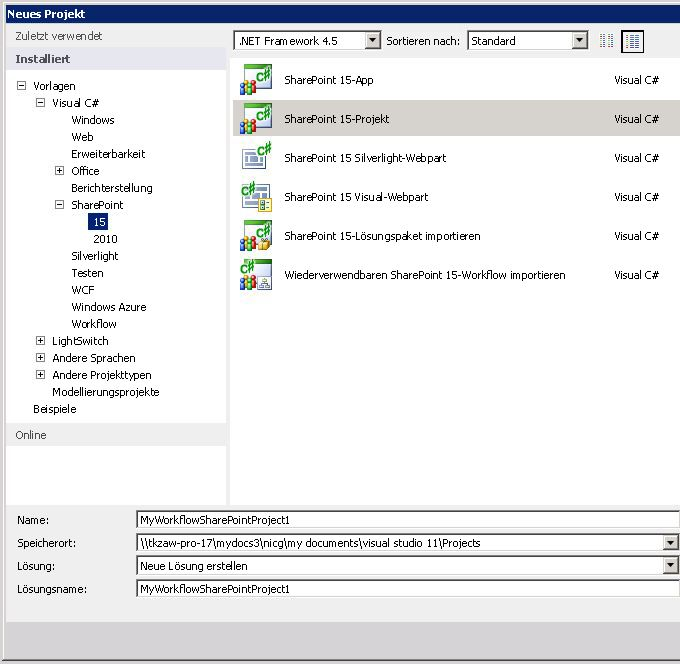
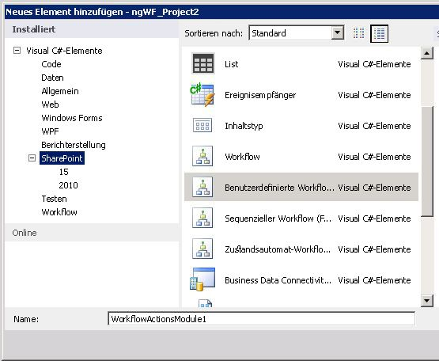
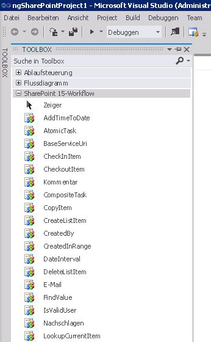

# Vorgehensweise: Erstellen und POST von benutzerdefinierten Workflowaktionen
In diesem Artikel erfahren Sie, wie Sie Geschäftsprozesse entwickeln, deren Anforderungen von der vorhandenen Bibliothek mit Workflowaktionen in SharePoint Designer nicht erfüllt werden, indem Sie benutzerdefinierte Workflowaktionen in SharePoint erstellen. SharePoint Designer enthält eine Auflistung von Workflowaktionen, die über die Workflow-Designer-Benutzeroberfläche (UI) verfügbar sind. Obwohl Bereich von Workflowaktionen, die in SharePoint Designer enthaltenen) ist umfassende, es ist jedoch begrenzt. In einigen Fällen müssen Sie einen Geschäftsprozess modellieren, deren nicht von der vorhandenen Workflowaktionen-Bibliothek erfüllt sind, die in SharePoint Designer verfügbar sind.
  
    
    

Erkennen, dass Geschäftsprozesse häufig Anforderungen spezielle, können SharePoint Sie benutzerdefinierte Workflowaktionen erstellen. Entwickeln von benutzerdefinierten Aktionen mithilfe von Visual Studio, und klicken Sie dann zu packen, und stellen diese in SharePoint. An dieser Stelle wird die benutzerdefinierte Aktion für Autoren von Workflow in SharePoint Designer, genau wie wäre es zwischen der Bibliothek vorhandener Aktivitäten verfügbar. Diese Funktion können Sie die Funktionalität in Ihrer Umgebung der Workflow authoring keines der spezielle Geschäftsprozesse entsprechend anpassen.
> **Hinweis:** Es wird ein Beispiel für das Erstellen einer benutzerdefinierten Aktion bereitgestellt. Das Beispiel und eine Readme-Datei sind hier verfügbar:  [SharePoint-Workflow: Erstellen einer benutzerdefinierten Aktion](http://code.msdn.microsoft.com/SharePoint-workflow-41e5c0f9) (http://code.msdn.microsoft.com/SharePoint-workflow-41e5c0f9).
  
    
    

## Kernszenario für benutzerdefinierte Workflowaktionen

Das Core Szenario für benutzerdefinierte Workflowaktionen werden in der folgenden Zeile verbale erfasst:
  
    
    

1. Business Analyst oder für andere technischen Information Worker ist SharePoint Designer verwenden, um einen Workflow, um einen internen Geschäftsprozess modellieren erstellen - beispielsweise eine Dokument-Genehmigungsprozess. Jedoch ist in das Unternehmen, der letzte Schritt des Prozesses, nach der endgültigen Genehmigung automatisch das Dokument auf eine externe Drucker senden, die gedruckt und bindet eine angegebene Anzahl von Kopien des Dokuments. 
    
  
2. Keine Workflowaktion, die in SharePoint Designer 2013 enthalten ist unterstützt ein Dokument an eine externe Drucker weiterleitet. Entscheiden daher Managern des Unternehmens investieren bei der Bereitstellung der benutzerdefinierten Aktion (sie rufen sie als die Aktion "Dateien zu Drucker senden") für das Unternehmen Information Worker.
    
  
3. Anbieter stellen Druck-Webdienste zur Verfügung. Um davon zu profitieren, erstellt ein Entwickler eine benutzerdefinierte Aktion zum **Senden der Dateien an den Drucker** mit dem Namen **SendFilesToPrinter**. Der Entwickler erstellt hier eine deklarative Workflowaktivität. Der Entwickler erstellt dann die Workflowaktion zum Bereitstellen der Drag & Drop-Benutzeroberfläche für die Aktion in SharePoint Designer.
    
  
4. Der Entwickler Pakete, die Aktivität **SendFilesToPrinter** und die **Dateien an Drucker senden** -Aktion in einer SharePoint-Lösungspaketdatei (.wsp) und als Websitesammlungs-Feature zur SharePoint-Farm bereitgestellt.
    
  
5. Nachdem das Feature bereitgestellt und aktiviert ist, wird der Information Worker erhält die neue benutzerdefinierte Aktion, **Dateien an Drucker senden**, in der Benutzeroberfläche zusammen mit allen normalerweise Aktionen SharePoint Designer und es genau wie alle anderen verwenden kann.
    
  

## Übersicht über benutzerdefinierte Aktionen

Eine Aktion ist ein Wrapper, der die Funktionalität der zugrunde liegenden Aktivität in SharePoint Designer abstrahiert. Zur Laufzeit wird die zugrunde liegende Aktivität, nicht die Aktion selbst, in der Windows Server AppFabric ausgeführt. In diesem Sinne sind Aktionen nur Entwurfszeit Abstraktionen der zugrunde liegenden Funktionen im SharePoint Designer Workflow authoring-Umgebung (zusätzlich zum werden Elemente der SharePoint Designer Schnittstelle verwenden.
  
    
    
Benutzerdefinierte Aktionen sind wie alle Aktionen "Webbereich" - d. h., sie werden auf der Ebene der SharePoint-Website oder **SharePoint.SPWeb** -Instanz aktiviert.
  
    
    
Aktionen sind in XML-Definitionsdateien definiert, die die Erweiterung .actions4 aufweisen. Die zugrunde liegende Aktivität (oder Aktivitäten) sind andererseits, in eine XAML-Datei definiert.
  
    
    

## Schreiben von benutzerdefinierten Aktivitäten in Visual Studio 2012

Visual Studio 2012 bietet nun einen "benutzerdefinierten Workflowaktivität" Elementtyp innerhalb von SharePoint-Projekten. Den Elementtyp können Sie eine benutzerdefinierte Aktivität erstellen, die Sie als benutzerdefinierte Aktion in SharePoint Designer 2013 dann importieren können.
  
    
    

## Beispiel:-Paket zu erstellen und Bereitstellen einer benutzerdefinierten Aktivitätsfeeds

### Erstellen eine benutzerdefinierten Workflowaktivität

1. Beginnen Sie mit dem Visual Studio 2012 öffnen und erstellen ein neues Visual C#-Projekt vom Typ **SharePoint-Projekts**, wie in Abbildung 1 dargestellt.
    
   **Abbildung 1. Dialogfeld "Neues Projekt"**

  

  
  

  

  
2. Im **Projektmappen-Explorer** mit der rechten Maustaste in des Name-Projektknoten, und wählen Sie **Hinzufügen** und **Neues Element**. Daraufhin wird das Dialogfeld **Neues Element hinzufügen**, wie in Abbildung 2 dargestellt.
    
   **Abbildung 2. Im Dialogfeld Neues Element hinzufügen**

  

  
  

    
    
  
3. Klicken Sie im Dialogfeld **Neues Element hinzufügen** wählen Sie den Elementtyp für **Benutzerdefinierte Workflowaktivität aus**, und weisen Sie ihr einen aussagekräftigen Namen. In der Abbildung ist der Name "WorkflowActionsModule1". Wählen Sie dann **Hinzufügen** aus. Das neue Element wird erstellt, und Sie werden mit der Entwurfsoberfläche Aktivität bearbeitet.
    
  
4. Die **Toolbox**-Registerkarte nicht bereits angezeigt wird, klicken Sie darauf, um die Knoten Toolbox verfügbar zu machen. Klicken Sie auf der **SharePoint-Workflow**-Knoten, um den Workflow Development-Objekte anzuzeigen. Es wird eine partielle Ansicht der Objekte in der Workflowtoolbox in Abbildung 3.
    
   **Abbildung 3. Partielle Ansicht der SharePoint-Workflow-toolbox**

  

  
  

    
    
  
5. Fügen Sie neue Aktion (.actions4) und Dateien des Vorgangs (XAML hinzu) Ihrem Workflow-Modul nach Bedarf. Um diese Dateien hinzuzufügen, mit der rechten Maustaste in des Symbols Aktionen Modul im **Projektmappen-Explorer**, wählen Sie **Hinzufügen** und wählen Sie dann nach Bedarf **Aktion hinzufügen** (zum Hinzufügen einer neuen action4-Datei) oder **Neue Aktivität** (um eine neue Aktivität hinzuzufügen).
    
  
Nachdem Sie Ihre Aktionen Modul erstellen und der Aktion und der Aktivität Dateien hinzufügen, sollte Ihr Projekt etwa, abgebildeten in Abbildung 5 aussehen. Sie können eine .actions4-Datei für die einzelnen Aktionen, die Sie hinzugefügt und eine XAML-Datei für jede Aktivität werden angezeigt. Darüber hinaus müssen Sie eine Datei "Elements.xml" und das Modul XAML-Datei.
  
    
    

**Abbildung 5. Workflow Aktionen Modul im Projektmappen-Explorer**

  
    
    

  
    
    

  
    
    
Nachdem Sie Ihre benutzerdefinierten Workflowaktivität erstellt haben, können Sie und klicken Sie dann zu packen und bereitstellen. Nach der Bereitstellung ist, kann die benutzerdefinierte Aktivität als benutzerdefinierte Aktion von SharePoint Designer 2013 genutzt werden.
  
    
    
Benutzerdefinierte Aktionen sind gepackt und als SharePoint-Features in SharePoint-Lösungspaket (.wsp) Lösungsdateien bereitgestellt. Das Lösungspaket enthält ein Modul benutzerdefinierte Aktionen, also eine Reihe von Dateien, die in SharePoint bereitgestellt werden. In diesem Modul kann eine beliebige Anzahl von Workflow-Aktivitäten-Definitionen enthalten, von denen jedes eine XAML-Datei ist. Das Modul enthält außerdem Aktionen (.actions4) Dateien. Jede Actions-Datei enthält mehrere Aktionen, die verweisen, um die Aktivitäten im Modul oder systemeigene Aktivitäten, die auf einer SharePoint-Standardinstallation verfügbar sind.
  
    
    
Nach eine Lösungspaketdatei (.wsp) hochgeladen und auf der Zielwebsite (d. h., die SharePoint-Websitesammlung) aktiviert ist, sind die Features, die im Paket enthalten sind, installiert und bereit zur Aktivierung. Nachdem die benutzerdefinierten Aktionen aktiviert sind, sind sie für die Verwendung in einem Workflow verfügbar. 
  
    
    

## Aktualisieren und Löschen von benutzerdefinierten Aktionen

Nach dem die benutzerdefinierte Aktion bereitgestellt wird, können Sie zu aktualisieren oder leicht zu entfernen. Haben Sie tun ist, öffnen Sie das Aktivitätsprojekt in Visual Studio, stellen Sie die Änderungen, die Sie möchten, und klicken Sie dann Verpacken und erneut bereitstellen, wie im vorherigen Verfahren beschrieben. Wenn die benutzerdefinierte Aktion entfernen möchten, können Sie einfach das Feature für die Ziel-Websitesammlung deinstallieren.
  
    
    

### Aktivierung des Features

Aktivieren ein benutzerdefiniertes Feature für eine Websitesammlung (d. h., in einer Instanz **SPWeb** ) nur erfolgreich, wenn die Azure / Workflow-Manager-Client 1.0 (mandantenfähigen Workflowmodul) ordnungsgemäß konfiguriert ist. Zwei Hinweise zur Problembehandlung, die dazu beitragen können eine korrekte Konfiguration umfassen:
  
    
    

- Aufrufen der Seite Websitefeatures und sicherstellen, dass das Feature mit der benutzerdefinierten Aktion aus aktiviert ist.
    
  
- Abfragen der Workflow-Manager-Client 1.0-Datenbank, um sicherzustellen, dass die Aktivität erfolgreich bereitgestellt wird.
    
  

## Zusätzliche Ressourcen

-  [Grundlegendes zu SharePoint-Workflows](sharepoint-workflow-fundamentals.md)
    
  
-  [Workflowaktions- und -aktivitätenreferenz für SharePoint](workflow-actions-and-activities-reference-for-sharepoint.md)
    
  
-  [Entwickeln von SharePoint-Workflows mit Visual Studio](develop-sharepoint-workflows-using-visual-studio.md)
    
  

