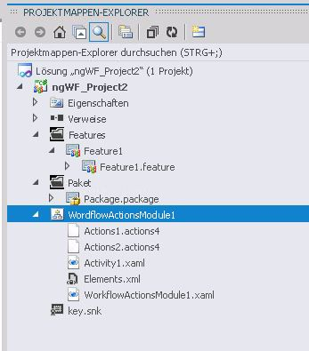

# Vorgehensweise: Erstellen und POST von benutzerdefinierten WorkflowaktionenHow to: Build and deploy workflow custom actions
In diesem Artikel erfahren Sie, wie Sie Geschäftsprozesse entwickeln, deren Anforderungen von der vorhandenen Bibliothek mit Workflowaktionen in SharePoint Designer nicht erfüllt werden, indem Sie benutzerdefinierte Workflowaktionen in SharePoint erstellen. SharePoint Designer enthält eine Auflistung von Workflowaktionen, die über die Workflow-Designer-Benutzeroberfläche (UI) verfügbar sind. Obwohl Bereich von Workflowaktionen, die in SharePoint Designer enthaltenen) ist umfassende, es ist jedoch begrenzt. In einigen Fällen müssen Sie einen Geschäftsprozess modellieren, deren nicht von der vorhandenen Workflowaktionen-Bibliothek erfüllt sind, die in SharePoint Designer verfügbar sind.Learn how to model business processes whose requirements are not met by the existing library of workflow actions in SharePoint Designer by creating custom workflow actions in SharePoint. SharePoint Designer provides a collection of workflow actions that are available through the Workflow Designer user interface (UI). Although the range of workflow actions that are included in SharePoint Designer) is extensive, it is nevertheless finite. In some cases, you may need to model a business process whose requirements are not met by the existing library of workflow actions that are available in SharePoint Designer.
  
    
    

Erkennen, dass Geschäftsprozesse häufig Anforderungen spezielle, können SharePoint Sie benutzerdefinierte Workflowaktionen erstellen. Entwickeln von benutzerdefinierten Aktionen mithilfe von Visual Studio, und klicken Sie dann zu packen, und stellen diese in SharePoint. An dieser Stelle wird die benutzerdefinierte Aktion für Autoren von Workflow in SharePoint Designer, genau wie wäre es zwischen der Bibliothek vorhandener Aktivitäten verfügbar. Diese Funktion können Sie die Funktionalität in Ihrer Umgebung der Workflow authoring keines der spezielle Geschäftsprozesse entsprechend anpassen.Recognizing that business processes often have specialized requirements, SharePoint lets you create custom workflow actions. You can develop these custom actions by using Visual Studio, and then package and deploy them to SharePoint. At that point, the custom action becomes available to workflow authors in SharePoint Designer, exactly as if it were among the library of existing actions. This capability lets you customize the functionality in your workflow authoring environment to match any of your specialized business processes.
> **Hinweis:** Es wird ein Beispiel für das Erstellen einer benutzerdefinierten Aktion bereitgestellt.**Note:** A sample is provided that illustrates creating a custom action. Das Beispiel und eine Readme-Datei sind hier verfügbar:  [SharePoint-Workflow: Erstellen einer benutzerdefinierten Aktion](http://code.msdn.microsoft.com/SharePoint-workflow-41e5c0f9) (http://code.msdn.microsoft.com/SharePoint-workflow-41e5c0f9).The sample, along with a readme file, is available here:  SharePoint 2013 workflow: Create a custom action http://code.msdn.microsoft.com/SharePoint-2013-workflow-41e5c0f9 
  
    
    

## Kernszenario für benutzerdefinierte WorkflowaktionenCore scenario for custom workflow actions

Das Core Szenario für benutzerdefinierte Workflowaktionen werden in der folgenden Zeile verbale erfasst:The core scenario for custom workflow actions is captured in the following narrative line:
  
    
    

1. Business Analyst oder für andere technischen Information Worker ist SharePoint Designer verwenden, um einen Workflow, um einen internen Geschäftsprozess modellieren erstellen - beispielsweise eine Dokument-Genehmigungsprozess. Jedoch ist in das Unternehmen, der letzte Schritt des Prozesses, nach der endgültigen Genehmigung automatisch das Dokument auf eine externe Drucker senden, die gedruckt und bindet eine angegebene Anzahl von Kopien des Dokuments.A business analyst or other non-technical information worker is using SharePoint Designer to author a workflow to model an internal business process—for example, a document-approval process. However, in this company, the final step of the process is, upon final approval, to automatically dispatch the document to an external printer who prints and binds a specified number of copies of the document. 
    
  
2. Keine Workflowaktion, die in SharePoint Designer 2013 enthalten ist unterstützt ein Dokument an eine externe Drucker weiterleitet. Entscheiden daher Managern des Unternehmens investieren bei der Bereitstellung der benutzerdefinierten Aktion (sie rufen sie als die Aktion "Dateien zu Drucker senden") für das Unternehmen Information Worker.No workflow action that is included in SharePoint Designer 2013 supports dispatching a document to an external printer. Therefore, the company managers decide to invest in providing this custom action (they call it the "Send Files to Printer" action) for the company's information workers.
    
  
3. Anbieter stellen Druck-Webdienste zur Verfügung.Vendors expose printing web services. Um davon zu profitieren, erstellt ein Entwickler eine benutzerdefinierte Aktion zum **Senden der Dateien an den Drucker** mit dem Namen **SendFilesToPrinter**.To capitalize, a developer creates a custom **Send Files to Printer** action, named **SendFilesToPrinter**. Der Entwickler erstellt hier eine deklarative Workflowaktivität.What the developer creates is a declarative workflow activity. Der Entwickler erstellt dann die Workflowaktion zum Bereitstellen der Drag & Drop-Benutzeroberfläche für die Aktion in SharePoint Designer.The developer also, then, creates the workflow action to provide the drag-and-drop UI for the action in SharePoint Designer.
    
  
4. Der Entwickler Pakete, die Aktivität **SendFilesToPrinter** und die **Dateien an Drucker senden** -Aktion in einer SharePoint-Lösungspaketdatei (.wsp) und als Websitesammlungs-Feature zur SharePoint-Farm bereitgestellt.The developer packages both the **SendFilesToPrinter** activity and the **Send Files to Printer** action in a SharePoint solution package (.wsp) file and deploys it as a site collection feature to the SharePoint farm.
    
  
5. Nachdem das Feature bereitgestellt und aktiviert ist, wird der Information Worker erhält die neue benutzerdefinierte Aktion, **Dateien an Drucker senden**, in der Benutzeroberfläche zusammen mit allen normalerweise Aktionen SharePoint Designer und es genau wie alle anderen verwenden kann.After the feature is deployed and activated, the information worker sees the new custom action, **Send Files to Printer**, in the SharePoint Designer UI along with all of the normally included actions and can use it just like all the others.
    
  

## Übersicht über benutzerdefinierte AktionenOverview of custom actions

Eine Aktion ist ein Wrapper, der die Funktionalität der zugrunde liegenden Aktivität in SharePoint Designer abstrahiert. Zur Laufzeit wird die zugrunde liegende Aktivität, nicht die Aktion selbst, in der Windows Server AppFabric ausgeführt. In diesem Sinne sind Aktionen nur Entwurfszeit Abstraktionen der zugrunde liegenden Funktionen im SharePoint Designer Workflow authoring-Umgebung (zusätzlich zum werden Elemente der SharePoint Designer Schnittstelle verwenden.An action is a wrapper that abstracts the functionality of its underlying activity in SharePoint Designer. At run time, the underlying activity, not the action itself, is executed in the Windows Server AppFabric. In this sense, actions are just design-time abstractions of underlying functions in the SharePoint Designer workflow authoring environment (in addition to being elements of the SharePoint Designer using interface.
  
    
    
Benutzerdefinierte Aktionen sind wie alle Aktionen "Webbereich" - d. h., sie werden auf der Ebene der SharePoint-Website oder **SharePoint.SPWeb** -Instanz aktiviert.Like all actions, custom actions are "web scoped"—that is, they are activated at the level of the SharePoint website, or **SharePoint.SPWeb** instance.
  
    
    
Aktionen sind in XML-Definitionsdateien definiert, die die Erweiterung .actions4 aufweisen. Die zugrunde liegende Aktivität (oder Aktivitäten) sind andererseits, in eine XAML-Datei definiert.Actions are defined in XML definition files that have the .actions4 file name extension. The underlying activity (or activities), on the other hand, are defined in a XAML file.
  
    
    

## Schreiben von benutzerdefinierten Aktivitäten in Visual Studio 2012Writing custom activities in Visual Studio 2012

Visual Studio 2012 bietet nun einen "benutzerdefinierten Workflowaktivität" Elementtyp innerhalb von SharePoint-Projekten. Den Elementtyp können Sie eine benutzerdefinierte Aktivität erstellen, die Sie als benutzerdefinierte Aktion in SharePoint Designer 2013 dann importieren können.Visual Studio 2012 now provides a "workflow custom activity" item type within SharePoint projects. You can use the item type to create a custom activity that you can then import as a custom action in SharePoint Designer 2013.
  
    
    

## Beispiel:-Paket zu erstellen und Bereitstellen einer benutzerdefinierten AktivitätsfeedsExample: Create, package, and deploy a custom activity

### Erstellen eine benutzerdefinierten WorkflowaktivitätTo create a workflow custom activity

1. Beginnen Sie mit dem Visual Studio 2012 öffnen und erstellen ein neues Visual C#-Projekt vom Typ **SharePoint-Projekts**, wie in Abbildung 1 dargestellt.Begin by opening Visual Studio 2012 and creating a new Visual C# project of type **SharePoint Project**, as shown in Figure 1.
    
   **Abbildung 1. Dialogfeld "Neues Projekt"****Figure 1. New Project dialog box**

  

  
  

  

  
2. Im **Projektmappen-Explorer** mit der rechten Maustaste in des Name-Projektknoten, und wählen Sie **Hinzufügen** und **Neues Element**. Daraufhin wird das Dialogfeld **Neues Element hinzufügen**, wie in Abbildung 2 dargestellt.In **Solution Explorer**, right-click the project name node, and choose **Add**, **New Item**. This opens the **Add New Item** dialog box, as shown in Figure 2.
    
   **Abbildung 2. Im Dialogfeld Neues Element hinzufügen****Figure 2. Add New Item dialog box**

  

  
  

    
    
  
3. Klicken Sie im Dialogfeld **Neues Element hinzufügen** wählen Sie den Elementtyp für **Benutzerdefinierte Workflowaktivität aus**, und weisen Sie ihr einen aussagekräftigen Namen. In der Abbildung ist der Name "WorkflowActionsModule1". Wählen Sie dann **Hinzufügen** aus. Das neue Element wird erstellt, und Sie werden mit der Entwurfsoberfläche Aktivität bearbeitet.In the **Add New Item** dialog box, choose the **Workflow Custom Activity** item type and give it a meaningful name. In the illustration, the name is "WorkflowActionsModule1". Then choose **Add**. The new item is created, and you are presented with the activity design surface.
    
  
4. Die **Toolbox**-Registerkarte nicht bereits angezeigt wird, klicken Sie darauf, um die Knoten Toolbox verfügbar zu machen. Klicken Sie auf der **SharePoint-Workflow**-Knoten, um den Workflow Development-Objekte anzuzeigen. Es wird eine partielle Ansicht der Objekte in der Workflowtoolbox in Abbildung 3.If the **Toolbox** tab is not already showing, click it to expose the toolbox nodes. Click the **SharePoint Workflow** node to show the workflow development objects. There is a partial view of objects in the workflow toolbox in Figure 3.
    
   **Abbildung 3. Partielle Ansicht der SharePoint-Workflow-toolbox****Figure 3. Partial view of SharePoint workflow toolbox**

  

  
  

    
    
  
5. Fügen Sie neue Aktion (.actions4) und Dateien des Vorgangs (XAML hinzu) Ihrem Workflow-Modul nach Bedarf. Um diese Dateien hinzuzufügen, mit der rechten Maustaste in des Symbols Aktionen Modul im **Projektmappen-Explorer**, wählen Sie **Hinzufügen** und wählen Sie dann nach Bedarf **Aktion hinzufügen** (zum Hinzufügen einer neuen action4-Datei) oder **Neue Aktivität** (um eine neue Aktivität hinzuzufügen).Add new action (.actions4) and activity (.xaml) files to your workflow module, as needed. To add these files, right-click the actions module icon in **Solution Explorer**, choose **Add**, and then choose either **Add Action** (to add a new action4 file) or **New Activity** (to add a new activity), as appropriate.
    
  
Nachdem Sie Ihre Aktionen Modul erstellen und der Aktion und der Aktivität Dateien hinzufügen, sollte Ihr Projekt etwa, abgebildeten in Abbildung 5 aussehen. Sie können eine .actions4-Datei für die einzelnen Aktionen, die Sie hinzugefügt und eine XAML-Datei für jede Aktivität werden angezeigt. Darüber hinaus müssen Sie eine Datei "Elements.xml" und das Modul XAML-Datei.After you create your actions module and add your action and activity files, your project should look something like that depicted in Figure 5. You will see one .actions4 file for each action that you added, and one .xaml file for each activity. Additionally, you will have an Elements.xml file and the module's .xaml file.
  
    
    

**Abbildung 5. Workflow Aktionen Modul im Projektmappen-Explorer****Figure 5. Workflow actions module in Solution Explorer**

  
    
    

  
    
    

  
    
    
Nachdem Sie Ihre benutzerdefinierten Workflowaktivität erstellt haben, können Sie und klicken Sie dann zu packen und bereitstellen. Nach der Bereitstellung ist, kann die benutzerdefinierte Aktivität als benutzerdefinierte Aktion von SharePoint Designer 2013 genutzt werden.After you create your custom workflow activity, you can then package and deploy it. After it is deployed, the custom activity can be consumed by SharePoint Designer 2013 as a custom action.
  
    
    
Benutzerdefinierte Aktionen sind gepackt und als SharePoint-Features in SharePoint-Lösungspaket (.wsp) Lösungsdateien bereitgestellt. Das Lösungspaket enthält ein Modul benutzerdefinierte Aktionen, also eine Reihe von Dateien, die in SharePoint bereitgestellt werden. In diesem Modul kann eine beliebige Anzahl von Workflow-Aktivitäten-Definitionen enthalten, von denen jedes eine XAML-Datei ist. Das Modul enthält außerdem Aktionen (.actions4) Dateien. Jede Actions-Datei enthält mehrere Aktionen, die verweisen, um die Aktivitäten im Modul oder systemeigene Aktivitäten, die auf einer SharePoint-Standardinstallation verfügbar sind.Custom actions are packaged and deployed as SharePoint Features in SharePoint solution package (.wsp) files. The solution package contains a custom actions module, which is a set of files that are deployed on SharePoint. This module can contain any number of workflow activity definitions, each of which is a .xaml file. The module also contains actions (.actions4) files. Each actions file contains multiple actions that refer to the activities in the module, or to native activities that are available on a default SharePoint installation.
  
    
    
Nach eine Lösungspaketdatei (.wsp) hochgeladen und auf der Zielwebsite (d. h., die SharePoint-Websitesammlung) aktiviert ist, sind die Features, die im Paket enthalten sind, installiert und bereit zur Aktivierung. Nachdem die benutzerdefinierten Aktionen aktiviert sind, sind sie für die Verwendung in einem Workflow verfügbar.After a solution package (.wsp) file is uploaded and activated on the target website (that is, the SharePoint site collection), the features that are contained in the package are installed and available for activation. After the custom actions are activated, they are available for use in a workflow. 
  
    
    

## Aktualisieren und Löschen von benutzerdefinierten AktionenUpdating and deleting custom actions

Nach dem die benutzerdefinierte Aktion bereitgestellt wird, können Sie zu aktualisieren oder leicht zu entfernen. Haben Sie tun ist, öffnen Sie das Aktivitätsprojekt in Visual Studio, stellen Sie die Änderungen, die Sie möchten, und klicken Sie dann Verpacken und erneut bereitstellen, wie im vorherigen Verfahren beschrieben. Wenn die benutzerdefinierte Aktion entfernen möchten, können Sie einfach das Feature für die Ziel-Websitesammlung deinstallieren.After your custom action is deployed, you can update or remove it very easily. All you have to do is open the activity project in Visual Studio, make the changes that you want, and then package and redeploy as described in the preceding procedure. To remove the custom action, you can just uninstall the feature on the target site collection.
  
    
    

### Aktivierung des FeaturesFeature activation

Aktivieren ein benutzerdefiniertes Feature für eine Websitesammlung (d. h., in einer Instanz **SPWeb** ) nur erfolgreich, wenn die Azure / Workflow-Manager-Client 1.0 (mandantenfähigen Workflowmodul) ordnungsgemäß konfiguriert ist. Zwei Hinweise zur Problembehandlung, die dazu beitragen können eine korrekte Konfiguration umfassen:Activating a custom action feature on a site collection (that is, on an **SPWeb** instance) succeeds only if the Azure/ Workflow Manager Client 1.0 (the multitenant workflow engine) is correctly configured. Two troubleshooting hints that may help ensure a correct configuration include:
  
    
    

- Aufrufen der Seite Websitefeatures und sicherstellen, dass das Feature mit der benutzerdefinierten Aktion aus aktiviert ist.Going to the Site Features page and ensuring that the feature that contains the custom action is activated.
    
  
- Abfragen der Workflow-Manager-Client 1.0-Datenbank, um sicherzustellen, dass die Aktivität erfolgreich bereitgestellt wird.Querying the Workflow Manager Client 1.0 database to ensure that the activity is successfully deployed.
    
  

## Zusätzliche RessourcenAdditional resources

-  [Grundlegendes zu SharePoint-WorkflowsSharePoint workflow fundamentals](sharepoint-workflow-fundamentals.md)
    
  
-  [Workflowaktions- und -aktivitätenreferenz für SharePointWorkflow actions and activities reference for SharePoint](workflow-actions-and-activities-reference-for-sharepoint.md)
    
  
-  [Entwickeln von SharePoint-Workflows mit Visual StudioDevelop SharePoint workflows using Visual Studio](develop-sharepoint-workflows-using-visual-studio.md)
    
  

