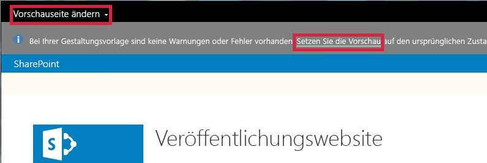

# Vorgehensweise: ändern die Vorschauseite in SharePoint-Design-Manager
Informationen Sie zum Festlegen, erstellen und Ändern der Vorschauseite im Entwurfs-Manager in SharePoint. Die Vorschauseite ist die Seite der Website, mit denen Sie Ihren Entwurf aussehen. Sie können entweder eine bestimmte Seite innerhalb Ihrer Website oder eine generische Vorschau die Vorschauseite festlegen. Wenn Sie die generische Vorschau auswählen, sehen Sie die Masterseite mit nur einem Platzhalter für Inhalt. Auch sehen eine Nachricht im Banner Sie, dass aktuell die Gestaltungsvorlage ohne Inhalt in der Vorschau angezeigt werden. Wenn Sie eine bestimmte Seite auswählen, sehen Sie sich, dass der Seiteninhalt mit dem Master Seite und das entsprechende Seitenlayout gerendert.
  
    
    

Wie Sie mit der Seite interagieren, können Sie etwas, das bewirkt, SharePoint dass Verschiebung aus der Vorschau. Beispielsweise bei Auswahl von **Speichern** auf dem Menüband SharePoint speichert die Seite, und klicken Sie dann die liveversion der Seite angezeigt. (Die liveversion der Seite verwendet die live Gestaltungsvorlage, nicht die Gestaltungsvorlage, die Sie entwerfen.) Sie können zur Vorschauseite zurückgeben, indem Sie auf **die Vorschau zurücksetzen**.
  
    
    

  
    
    

  
    
    

  
    
    

## Festlegen der Vorschauseite im Entwurfs-Manager

Verwenden Sie dieses Verfahren, um die Vorschauseite festzulegen.
  
    
    

### So legen Sie die Vorschauseite fest

1. Wählen Sie im Banner am Anfang des Webbrowsers **Vorschauseite ändern**.
    
  
2. Wählen Sie **Vorhandenes auswählen**.
    
  
3. Wählen Sie für die Verwendung einer generischen Vorschauseite **Generische Vorschau**.
    
  
4. Um eine bestimmte Seite als der Vorschauseite verwenden möchten, wählen Sie **URL** aus, und geben Sie die URL der Seite.
    
  
5. Wählen Sie **OK** aus.
    
  

## Erstellen einer neuen Vorschauseite im Entwurfs-Manager

Verwenden Sie dieses Verfahren zum Erstellen einer Seite, und legen Sie es als der Vorschauseite.
  
    
    

### Zum Erstellen einer neuen Vorschauseite

1. Wählen Sie im Banner am Anfang des Webbrowsers **Vorschauseite ändern**.
    
  
2. Wählen Sie **neu erstellen**.
    
  
3. Geben Sie einen Namen für die Seite, und klicken Sie dann auf **Erstellen**.
    
    Die Seite erstellt wird, und Sie getroffen werden, um eine Ansicht aus der Sie die neue Seite Inhalte hinzufügen können.
    
  

## Zurück zu der Vorschauseite im Entwurfs-Manager

Verwenden Sie dieses Verfahren, um zur Seite Preview zurückzugeben.
  
    
    

### Zurückkehren zu der Vorschauseite

- Wählen Sie in der Nachricht Informationen am oberen Rand der Web-Browser **die Vorschau zurücksetzen** aus.
    
  

## Zusätzliche Ressourcen

-  [Gestaltungsvorlagen, der Gestaltungsvorlagenkatalog und Seitenlayouts in SharePoint](master-pages-the-master-page-gallery-and-page-layouts-in-sharepoint.md)
    
  
-  [Entwickeln des Website-Designs in SharePoint](develop-the-site-design-in-sharepoint.md)
    
  
-  [Gewusst wie: Zuordnen eines Netzlaufwerks zum SharePoint-Gestaltungsvorlagenkatalog](how-to-map-a-network-drive-to-the-sharepoint-master-page-gallery.md)
    
  
-  [SharePoint-Design-Manager-Gerätekanäle](sharepoint-design-manager-device-channels.md)
    
  
-  [SharePoint Design Manager - Bilddarstellungen](sharepoint-design-manager-image-renditions.md)
    
  

