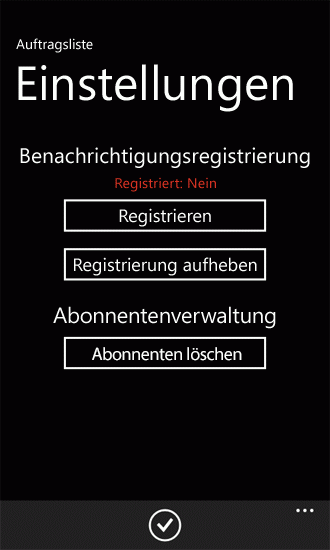
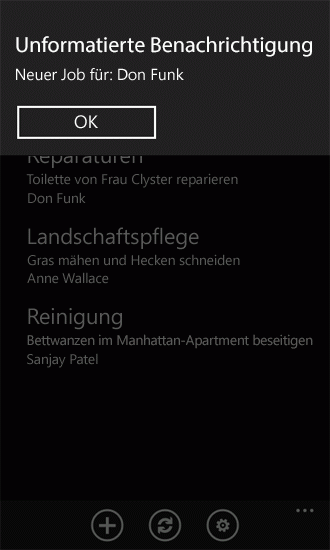

# <a name="configure-and-use-push-notifications-in-sharepoint-apps-for-windows-phone"></a><span data-ttu-id="575ac-102">Konfigurieren und Verwenden von Pushbenachrichtigungen in SharePoint-Apps für Windows Phone</span><span class="sxs-lookup"><span data-stu-id="575ac-102">Configure and use push notifications in SharePoint apps for Windows Phone</span></span>

<span data-ttu-id="575ac-p101">Erstellen Sie eine Lösung in SharePoint Server, um Pushbenachrichtigungen zu senden, und entwickeln Sie eine Windows Phone-App, um die Benachrichtigungen zu empfangen. Verwenden die Microsoft Push Notification Service (MPNS), können Windows Phone-apps Benachrichtigungen über das Internet über Ereignisse ausgelöst werden auf Microsoft SharePoint Server empfangen. Phone-app keinen Server für Änderungen an, beispielsweise die Elemente in einer Liste die Abfragen auf der Phone-app basiert. Die app Erhalt von Benachrichtigungen auf dem Server registriert werden, und ein Ereignisempfänger initiieren Sie eine Benachrichtigung und senden Sie sie an die empfangende app für die Behandlung von kann. Das Push Notification wird an der Windows Phone-Geräten von MPNS weitergeleitet.</span><span class="sxs-lookup"><span data-stu-id="575ac-p101">Create a solution in SharePoint Server for sending push notifications and develop a Windows Phone app for receiving the notifications. Using the Microsoft Push Notification Service (MPNS), Windows Phone apps can receive notifications through the Internet of events triggered on Microsoft SharePoint Server. The phone app doesn't have to poll the server for changes to, for example, the items in a list on which the phone app is based. The app can be registered to receive notifications from the server, and an event receiver can initiate a notification and send it to the receiving app for handling. The push notification is relayed to Windows Phone devices by MPNS.</span></span>
  
    
    

<span data-ttu-id="575ac-p102">Windows Phone 7 unterstützt nicht mehrere apps gleichzeitig ausgeführt. Als die Komponenten des Betriebssystems Windows Phone (OS) selbst kann nur eine app auf dem Telefon zu einem Zeitpunkt ausgeführt werden. Ein Ereignis, die einer bestimmten Phone-app für die Überprüfung relevante auftreten (z. B., beispielsweise ein Listenelement zu einer Liste hinzugefügte) Wenn die app auf dem Telefon im Vordergrund ausgeführt nicht zur Verfügung (d. h., wenn die app veraltete oder geschlossen ist). Konnten Sie einen Hintergrunddienst auf dem Telefon mit einem periodischen Vorgang, der Überprüfung auf Änderungen an der Liste auf dem Server möglicherweise entwickeln, aber diese Vorgehensweise würde Ressourcen (z. B. Netzwerk Bandbreite und Batterie Power) auf dem Telefon nutzen. Mit MPNS und die Komponenten, die in der Windows Phone 7-Betriebssystem integrierten Benachrichtigungen zu unterstützen, kann das Telefon selbst eine Benachrichtigung, die über eine bestimmte app für den Kontext relevant empfangen - selbst wenn diese app ausgeführt wird nicht - der Benutzer die Möglichkeit zum Starten der relevanten app als Antwort auf die Benachrichtigung gewährt werden kann. (Weitere Informationen zu Pushbenachrichtigungen, finden Sie unter  [Push Notifications Overview for Windows Phone](http://msdn.microsoft.com/de-DE/library/ff402558%28VS.92%29.aspx) in der MSDN Library). In diesem Thema erstellen Sie eine serverseitige Lösung zum Senden von Pushbenachrichtigungen zu einer Phone-app basierend auf eine Änderung in der Liste auf der die app basiert. Erstellen Sie dann die Phone-app für den Empfang von diese Benachrichtigungen.</span><span class="sxs-lookup"><span data-stu-id="575ac-p102">Windows Phone 7 doesn't support running multiple apps simultaneously. Other than the components of the Windows Phone operating system (OS) itself, only one app can be running on the phone at a time. An event relevant to a given phone app might occur (such as, for example, a list item being added to a list) when the app isn't running in the foreground on the phone (that is, when the app is tombstoned or closed). You could develop a background service on the phone with a periodic task that might check for changes to the list on the server, but this approach would consume resources (such as network bandwidth and battery power) on the phone. With MPNS and the components that support notifications built into the Windows Phone 7 OS, the phone itself can receive a notification relevant to the context of a given app—even when that app isn't running—and the user can be given the opportunity to start the relevant app in response to the notification. (For more information about push notifications, see  [Push Notifications Overview for Windows Phone](http://msdn.microsoft.com/de-DE/library/ff402558%28VS.92%29.aspx) in the MSDN Library.) In this topic, you create a server-side solution for sending push notifications to a phone app based on a change in the list on which the app is based. You will then create the phone app for receiving these notifications.</span></span>
  
    
    


## <a name="create-a-server-side-solution-to-send-push-notifications-based-on-a-list-item-event"></a><span data-ttu-id="575ac-115">Erstellen Sie eine serverseitige Lösung zum Senden von Pushbenachrichtigungen basierend auf einer listenelementereignis</span><span class="sxs-lookup"><span data-stu-id="575ac-115">Create a server-side solution to send push notifications based on a list item event</span></span>
<span data-ttu-id="575ac-116"><a name="BKMK_ServerSideSolution"> </a></span><span class="sxs-lookup"><span data-stu-id="575ac-116"><a name="BKMK_ServerSideSolution"> </a></span></span>

<span data-ttu-id="575ac-p103">Die serverseitige Lösung kann es sich entweder einer SharePoint-app in einem isolierten **SPWeb** -Objekt bereitgestellt oder einer SharePoint-Farm-Lösung verpackt als ein SharePoint-Lösungspaket (d. h., eine WSP-Datei), die ein Feature mit Web-Bereich enthält. In den Verfahren in diesem Abschnitt entwickeln Sie eine einfache SharePoint-Lösung, die eine Zielliste von einer Windows Phone-app verwendet werden erstellt und, Push-Notification-Mechanismus auf dem Server aktiviert. Im nachfolgenden Abschnitt wird die Windows Phone-app zum Empfang von Benachrichtigungen aus der serverseitigen Lösung entwickelt.</span><span class="sxs-lookup"><span data-stu-id="575ac-p103">The server-side solution can be either a SharePoint app deployed in an isolated **SPWeb** object, or a SharePoint farm solution packaged as a SharePoint solution package (that is, a .wsp file) that contains a Web-scoped Feature. In the procedures in this section, you will develop a simple SharePoint solution that creates a target list to be used by a Windows Phone app and that activates the push notification mechanism on the server. In the subsequent section, you will develop the Windows Phone app for receiving notifications from the server-side solution.</span></span>
  
    
    

### <a name="to-create-the-server-side-project"></a><span data-ttu-id="575ac-120">So erstellen Sie das serverseitige Projekt</span><span class="sxs-lookup"><span data-stu-id="575ac-120">To create the server-side project</span></span>


1. <span data-ttu-id="575ac-121">Starten Sie Visual Studio 2012 mit der Option **Als Administrator ausführen**.</span><span class="sxs-lookup"><span data-stu-id="575ac-121">Start Visual Studio 2012 by using the **Run as Administrator** option.</span></span>
    
  
2. <span data-ttu-id="575ac-122">Klicken Sie auf **Datei**, **Neu**, **Projekt**.</span><span class="sxs-lookup"><span data-stu-id="575ac-122">Choose **File**, **New**, **Project**.</span></span>
    
    <span data-ttu-id="575ac-123">Das Dialogfeld **Neues Projekt** wird angezeigt.</span><span class="sxs-lookup"><span data-stu-id="575ac-123">The **New Project** dialog box appears.</span></span>
    
  
3. <span data-ttu-id="575ac-124">Klicken Sie im Dialogfeld **Neues Projekt** den Knoten **SharePoint** unter **Visual c#**, und wählen Sie dann den Knoten **15**.</span><span class="sxs-lookup"><span data-stu-id="575ac-124">In the **New Project** dialog box, expand the **SharePoint** node under **Visual C#**, and then choose the **15** node.</span></span>
    
  
4. <span data-ttu-id="575ac-125">Wählen Sie im Bereich **Vorlagen** **SharePoint-Projekts** aus, und geben Sie einen Namen für das Projekt, wie etwaPushNotificationsList.</span><span class="sxs-lookup"><span data-stu-id="575ac-125">In the **Templates** pane, select **SharePoint Project** and specify a name for the project, such asPushNotificationsList.</span></span>
    
  
5. <span data-ttu-id="575ac-p104">Wählen Sie die Schaltfläche **OK**. Im Assistenten zum Anpassen von SharePoint wird angezeigt. Mit diesem Assistenten können Sie die Zielwebsite für das Entwickeln und Debuggen des Projekts und die Vertrauensebene der Lösung auswählen.</span><span class="sxs-lookup"><span data-stu-id="575ac-p104">Choose the **OK** button. The SharePoint Customization Wizard appears. This wizard enables you to select the target site for developing and debugging the project and the trust level of the solution.</span></span>
    
  
6. <span data-ttu-id="575ac-p105">Geben Sie die URL einer Website SharePoint Server. Wählen Sie eine Website, die Sie später in die Entwicklung von SharePoint-Listen-app für Windows Phone verwendet werden.</span><span class="sxs-lookup"><span data-stu-id="575ac-p105">Specify the URL of a SharePoint Server site. Select a site that you will be able to use later in the development of the SharePoint list app for Windows Phone.</span></span>
    
  
7. <span data-ttu-id="575ac-131">Wählen Sie **als farmlösung bereitstellen** aus, und klicken Sie dann auf **Fertig stellen**, um das Projekt zu erstellen.</span><span class="sxs-lookup"><span data-stu-id="575ac-131">Select **Deploy as a farm solution**, and then click **Finish** to create the project.</span></span>
    
  
<span data-ttu-id="575ac-132">Im nächsten Schritt fügen Sie dem Projekt eine Klassendatei hinzu, und erstellen Sie eine Reihe von Klassen zum Kapseln und Verwalten von Pushbenachrichtigungen.</span><span class="sxs-lookup"><span data-stu-id="575ac-132">Next, add a class file to the project and create a couple of classes to encapsulate and manage push notifications.</span></span>
  
    
    

### <a name="to-create-the-classes-for-managing-push-notifications"></a><span data-ttu-id="575ac-133">So erstellen Sie die Klassen für die Verwaltung von Pushbenachrichtigungen</span><span class="sxs-lookup"><span data-stu-id="575ac-133">To create the classes for managing push notifications</span></span>


1. <span data-ttu-id="575ac-134">Wählen Sie im **Projektmappen-Explorer** den Knoten ab, das Projekt (mit dem NamenPushNotificationsList , wenn Sie die Namenskonventionen in diesen Verfahren befolgen).</span><span class="sxs-lookup"><span data-stu-id="575ac-134">In **Solution Explorer**, choose the node representing the project (named PushNotificationsList if you follow the naming convention used in these procedures).</span></span>
    
  
2. <span data-ttu-id="575ac-p106">Klicken Sie im Menü **Projekt** auf **Klasse hinzufügen**. Das Dialogfeld **Neues Element hinzufügen** wird angezeigt. Die C#-Vorlage **Klasse** ist bereits ausgewählt.</span><span class="sxs-lookup"><span data-stu-id="575ac-p106">On the **Project** menu, choose **Add Class**. The **Add New Item** dialog box appears with the C# **Class** template already selected.</span></span>
    
  
3. <span data-ttu-id="575ac-p107">Geben Sie PushNotification.cs als Namen der Datei, und klicken Sie auf **Hinzufügen**. Die Klassendatei ist die Lösung hinzugefügt und zur Bearbeitung geöffnet.</span><span class="sxs-lookup"><span data-stu-id="575ac-p107">Specify PushNotification.cs as the name of the file and click **Add**. The class file is added to the solution and opened for editing.</span></span>
    
  
4. <span data-ttu-id="575ac-139">Ersetzen Sie den Inhalt der Datei durch den folgenden Code:</span><span class="sxs-lookup"><span data-stu-id="575ac-139">Replace the contents of the file with the following code.</span></span>
    
```cs
  
using System;
using System.Collections.Generic;
using System.IO;
using System.Linq;
using System.Net;
using System.Text;
using Microsoft.SharePoint;

namespace PushNotificationsList
{
    internal static class WP7Constants
    {
        internal static readonly string[] WP_RESPONSE_HEADERS = 
            {
                "X-MessageID",
                "X-DeviceConnectionStatus",
                "X-SubscriptionStatus",
                "X-NotificationStatus"
            };
    }

    public enum TileIntervalValuesEnum
    {
        ImmediateTile = 1,
        Delay450SecondsTile = 11,
        Delay900SecondsTile = 21,
    }

    public enum ToastIntervalValuesEnum
    {
        ImmediateToast = 2,
        Delay450SecondsToast = 12,
        Delay900SecondsToast = 22,
    }

    public enum RawIntervalValuesEnum
    {
        ImmediateRaw = 3,
        Delay450SecondsRaw = 13,
        Delay900SecondsRaw = 23
    }

    public enum NotificationTypeEnum
    {
        Tile = 1,
        Toast = 2,
        Raw = 3
    }

    class PushNotification
    {
        public PushNotificationResponse PushToast(SPPushNotificationSubscriber subscriber, string toastTitle, string toastMessage, string toastParam, ToastIntervalValuesEnum intervalValue)
        {
            // Construct toast notification message from parameter values.
            string toastNotification = "<?xml version=\\"1.0\\" encoding=\\"utf-8\\"?>" +
            "<wp:Notification xmlns:wp=\\"WPNotification\\">" +
               "<wp:Toast>" +
                    "<wp:Text1>" + toastTitle + "</wp:Text1>" +
                    "<wp:Text2>" + toastMessage + "</wp:Text2>" +
                    "<wp:Param>" + toastParam + "</wp:Param>" +
               "</wp:Toast> " +
            "</wp:Notification>";

            return SendPushNotification(NotificationTypeEnum.Toast, subscriber, toastNotification, (int)intervalValue);
        }

        public PushNotificationResponse PushRaw(SPPushNotificationSubscriber subscriber, string rawMessage, RawIntervalValuesEnum intervalValue)
        {
            return SendPushNotification(NotificationTypeEnum.Raw, subscriber, rawMessage, (int)intervalValue);
        }

        private PushNotificationResponse SendPushNotification(NotificationTypeEnum notificationType, SPPushNotificationSubscriber subscriber, string message, int intervalValue)
        {
            // Create HTTP Web Request object.
            string subscriptionUri = subscriber.ServiceToken;
            HttpWebRequest sendNotificationRequest = (HttpWebRequest)WebRequest.Create(subscriptionUri);

            // MPNS expects a byte array, so convert message accordingly.
            byte[] notificationMessage = Encoding.Default.GetBytes(message);
            
            // Set the notification request properties.
            sendNotificationRequest.Method = WebRequestMethods.Http.Post;
            sendNotificationRequest.ContentLength = notificationMessage.Length;
            sendNotificationRequest.ContentType = "text/xml";
            sendNotificationRequest.Headers.Add("X-MessageID", Guid.NewGuid().ToString());

            switch (notificationType)
            {
                case NotificationTypeEnum.Tile:
                    sendNotificationRequest.Headers.Add("X-WindowsPhone-Target", "token");
                    break;
                case NotificationTypeEnum.Toast:
                    sendNotificationRequest.Headers.Add("X-WindowsPhone-Target", "toast");
                    break;
                case NotificationTypeEnum.Raw:
                    // A value for the X-WindowsPhone-Target header is not specified for raw notifications.
                    break;
            }            

            sendNotificationRequest.Headers.Add("X-NotificationClass", intervalValue.ToString());

            // Merge byte array payload with headers.
            using (Stream requestStream = sendNotificationRequest.GetRequestStream())
            {
                requestStream.Write(notificationMessage, 0, notificationMessage.Length);
            }

            string statCode = string.Empty;
            PushNotificationResponse notificationResponse;

            try
            {
                // Send the notification and get the response.
                HttpWebResponse response = (HttpWebResponse)sendNotificationRequest.GetResponse();
                statCode = Enum.GetName(typeof(HttpStatusCode), response.StatusCode);

                // Create PushNotificationResponse object.
                notificationResponse = new PushNotificationResponse((int)intervalValue, subscriber.ServiceToken);
                notificationResponse.StatusCode = statCode;
                foreach (string header in WP7Constants.WP_RESPONSE_HEADERS)
                {
                    notificationResponse.Properties[header] = response.Headers[header];
                }                
            }
            catch (Exception ex)
            {
                statCode = ex.Message;
                notificationResponse = new PushNotificationResponse((int)intervalValue, subscriber.ServiceToken);
                notificationResponse.StatusCode = statCode;
            }

            return notificationResponse;
        }
    }     

    /// <summary>
    /// Object used for returning notification request results.
    /// </summary>
    class PushNotificationResponse
    {
        private DateTime timestamp;
        private int notificationIntervalValue;
        private string statusCode = string.Empty;
        private string serviceToken;
        private Dictionary<string, string> properties;

        public PushNotificationResponse(int numericalIntervalValue, string srvcToken)
        {
            timestamp = DateTime.UtcNow;
            notificationIntervalValue = numericalIntervalValue;
            serviceToken = srvcToken;
            properties = new Dictionary<string, string>();
        }

        public DateTime TimeStamp
        {
            get { return timestamp; }
        }

        public int NotificationIntervalValue
        {
            get { return notificationIntervalValue; }
        }

        public string StatusCode
        {
            get { return statusCode; }
            set { statusCode = value; }
        }

        public string ServiceToken
        {
            get { return serviceToken; }
        }

        public Dictionary<string, string> Properties
        {
            get { return properties; }
        }
    }
}
```

5. <span data-ttu-id="575ac-140">Speichern Sie die Datei.</span><span class="sxs-lookup"><span data-stu-id="575ac-140">Save the file.</span></span>
    
  
<span data-ttu-id="575ac-p108">In diesem Code Argumente die Methoden **PushToast** und **PushRaw** Parameter für den angegebenen Typ der Benachrichtigung zu senden, diese Argumente verarbeiten, und rufen Sie dann die **SendPushNotification** -Methode, die die senden die Benachrichtigung mit der Microsoft-Pushbenachrichtigungsdienst funktioniert. (In diesen Beispielcode wurde eine Methode zum Senden von Benachrichtigungen Kachel nicht implementiert.) Die **PushNotificationResponse** -Klasse ist einfach ein Mechanismus zum Kapseln des Ergebnis aus der Benachrichtigung Anforderung empfangen hat. Die Klasse fügt hier einige Informationen auf das Objekt (Cast als Objekt **HttpWebResponse** ) von der **GetResponse** -Methode des **HttpWebRequest** -Objekts zurückgegeben. Der Ereignisempfänger, den Sie in der folgenden Prozedur erstellen verwendet diese **PushNotificationResponse** -Klasse, um eine Ergebnisliste Benachrichtigungen auf dem Server zu aktualisieren.</span><span class="sxs-lookup"><span data-stu-id="575ac-p108">In this code, the **PushToast** and **PushRaw** methods take parameter arguments appropriate for the given type of notification to send, process those arguments, and then call the **SendPushNotification** method, which does the work of sending the notification using the Microsoft Push Notification Service. (In this sample code, a method for sending tile notifications has not been implemented.) The **PushNotificationResponse** class is simply a mechanism for encapsulating the result received from the notification request. Here, the class adds some information to the object (cast as an **HttpWebResponse** object) returned by the **GetResponse** method of the **HttpWebRequest** object. The event receiver you create in the following procedure uses this **PushNotificationResponse** class to update a notifications results list on the server.</span></span>
  
    
    
<span data-ttu-id="575ac-p109">Nun Erstellen einer Ereignisempfängerklasse, die Pushbenachrichtigungen an Geräte senden, die erfasst wurden, um sie zu erhalten. (Dieser Ereignisempfänger binden zu der Liste der Projekte, die in einem späteren Verfahren erstellt wird.)</span><span class="sxs-lookup"><span data-stu-id="575ac-p109">Now create an event receiver class that will send push notifications to devices that have been registered to receive them. (You will bind this event receiver to the Jobs list that is created in a later procedure.)</span></span>
  
    
    

### <a name="to-create-the-event-receiver-class-for-a-list"></a><span data-ttu-id="575ac-147">Eine Liste die Ereignisempfängerklasse erstellen</span><span class="sxs-lookup"><span data-stu-id="575ac-147">To create the event receiver class for a list</span></span>


1. <span data-ttu-id="575ac-148">Wählen Sie im **Projektmappen-Explorer** den Knoten ab, das Projekt aus.</span><span class="sxs-lookup"><span data-stu-id="575ac-148">In **Solution Explorer**, choose the node representing the project.</span></span>
    
  
2. <span data-ttu-id="575ac-p110">Klicken Sie im Menü **Projekt** auf **Klasse hinzufügen**. Das Dialogfeld **Neues Element hinzufügen** wird angezeigt, mit der C#- **Klasse** Vorlage bereits ausgewählt.</span><span class="sxs-lookup"><span data-stu-id="575ac-p110">On the **Project** menu, click **Add Class**. The **Add New Item** dialog box appears with the C# **Class** template already selected.</span></span>
    
  
3. <span data-ttu-id="575ac-p111">Geben Sie ListItemEventReceiver.cs als Namen der Datei, und klicken Sie auf **Hinzufügen**. Die Klassendatei ist die Lösung hinzugefügt und zur Bearbeitung geöffnet.</span><span class="sxs-lookup"><span data-stu-id="575ac-p111">Specify ListItemEventReceiver.cs as the name of the file and click **Add**. The class file is added to the solution and opened for editing.</span></span>
    
  
4. <span data-ttu-id="575ac-153">Ersetzen Sie den Inhalt der Datei durch den folgenden Code:</span><span class="sxs-lookup"><span data-stu-id="575ac-153">Replace the contents of the file with the following code.</span></span>
    
```cs
  
using System;
using System.Security.Permissions;
using System.Text;
using Microsoft.SharePoint;
using Microsoft.SharePoint.Utilities;

namespace PushNotificationsList
{
    /// <summary>
    /// List Item Events
    /// </summary>
    public class ListItemEventReceiver : SPItemEventReceiver
    {
        internal static string ResultsList = "Push Notification Results";

        /// <summary>
        /// An item was added.
        /// </summary>
        public override void ItemAdded(SPItemEventProperties properties)
        {
            SPWeb spWeb = properties.Web;
            SPPushNotificationSubscriberCollection pushSubscribers = spWeb.PushNotificationSubscribers;
            PushNotification pushNotification = new PushNotification();

            SPListItem listItem = properties.ListItem;

            string jobAssignment = "[Unassigned]";

            // This event receiver is intended to be associated with a specific list,
            // but the list may not have an "AssignedTo" field, so using try/catch here.
            try
            {
                jobAssignment = listItem["AssignedTo"].ToString();
            }
            catch { }

            PushNotificationResponse pushResponse = null;

            foreach (SPPushNotificationSubscriber ps in pushSubscribers)
            {
                // Send a toast notification to be displayed on subscribed phones on which the app is not running.
                pushResponse = pushNotification.PushToast(ps, "New job for:", jobAssignment, string.Empty, ToastIntervalValuesEnum.ImmediateToast);
                UpdateNotificationResultsList(spWeb, ps.User.Name, pushResponse);

                // Also send a raw notification to be displayed on subscribed phones on which the app is running when the item is added.
                pushResponse = pushNotification.PushRaw(ps, string.Format("New job for: {0}", jobAssignment), RawIntervalValuesEnum.ImmediateRaw);
                UpdateNotificationResultsList(spWeb, ps.User.Name, pushResponse);
            }

            base.ItemAdded(properties);
        }

        private void UpdateNotificationResultsList(SPWeb spWeb, string subscriberName, PushNotificationResponse pushResponse)
        {
            SPList resultsList = spWeb.Lists.TryGetList(ResultsList);

            if (resultsList == null)
                return;

            try
            {
                SPListItem resultItem = resultsList.Items.Add();
                resultItem["Title"] = subscriberName;
                resultItem["Notification Time"] = pushResponse.TimeStamp;
                resultItem["Status Code"] = pushResponse.StatusCode;
                resultItem["Service Token"] = pushResponse.ServiceToken;

                StringBuilder builder = new StringBuilder();
                foreach (string key in pushResponse.Properties.Keys)
                {
                    builder.AppendFormat("{0}: {1}; ", key, pushResponse.Properties[key]);
                }
                resultItem["Headers"] = builder.ToString();

                resultItem["Interval Value"] = pushResponse.NotificationIntervalValue;
                resultItem.Update();
            }
            catch
            {
                // Could log to ULS here if adding list item fails.
            }
        }
    }
}
```

5. <span data-ttu-id="575ac-154">Speichern Sie die Datei.</span><span class="sxs-lookup"><span data-stu-id="575ac-154">Save the file.</span></span>
    
  
<span data-ttu-id="575ac-p112">In diesem Code nach der Liste ein Element hinzugefügt wird, der der Ereignisempfänger gebunden ist, werden Pushbenachrichtigungen an Abonnenten gesendet, die Erhalt von Benachrichtigungen registriert haben. Der Wert des Felds AssignedTo aus dem hinzugefügten Listenelement ist in der Benachrichtigung an Abonnenten gesendet enthalten. Für die Toast-Benachrichtigung werden die Werte des Parameters **toastTitle** (für die **PushToast** -Methode definiert, die im vorhergehenden Verfahren) und der Parameter **toastMessage** festgelegt. Diese Werte entsprechen den Eigenschaften **Text1** und **Text2** im XML-Schema, das Toast-Benachrichtigung definiert.</span><span class="sxs-lookup"><span data-stu-id="575ac-p112">In this code, after an item is added to the list to which the event receiver is bound, push notifications are sent to subscribers that have registered to receive notifications. The value of the AssignedTo field from the added list item is included in the notification message sent to subscribers. For the toast notification, the values of the **toastTitle** parameter (for the **PushToast** method defined in the preceding procedure) and the **toastMessage** parameter are set. These values correspond to the **Text1** and **Text2** properties in the XML schema that defines toast notifications.</span></span>
  
    
    
<span data-ttu-id="575ac-p113">Eine leere Zeichenfolge ist einfach als Wert des Parameters **toastParam** übergeben wird, der die **Param** -Eigenschaft im XML-Schema für Toast-Benachrichtigung entspricht. Sie können diesen Parameter verwenden, an, beispielsweise eine Seite mit den Phone-app zu öffnen, wenn der Benutzer auf die Benachrichtigung in das Telefon klickt. In der Beispiel-app entwickelt, die weiter unten in diesem Thema für diese Benachrichtigungen werden vom Server empfangen wurde wird die **Param** -Eigenschaft nicht verwendet. Im Formular List (List.xaml) in der app ist einfach geöffnet, wenn der Benutzer auf die Benachrichtigung klickt.</span><span class="sxs-lookup"><span data-stu-id="575ac-p113">An empty string is simply being passed as the value of the **toastParam** parameter, which corresponds to the **Param** property in the XML schema for toast notifications. You could use this parameter to specify, for example, a page of the phone app to open when the user clicks the notification in the phone. In the sample phone app developed later in this topic for receiving these notifications from the server, the **Param** property is not used. The List form (List.xaml) in the app is simply opened when the user clicks the notification.</span></span>
  
> [!NOTE]
> <span data-ttu-id="575ac-163">Die **Param**-Eigenschaft für Toast-Benachrichtigung wird nur in Windows Phone OS Version 7.1 oder höher unterstützt.</span><span class="sxs-lookup"><span data-stu-id="575ac-163">**Note:** The Param property for toast notifications is supported only in Windows Phone OS version 7.1 or greater.</span></span>
  
    
    

<span data-ttu-id="575ac-164">Für die unformatierte Benachrichtigung in diesem Beispiel wird eine Zeichenfolge übergeben, die den Wert des Felds AssignedTo aus dem hinzugefügten Listenelement enthält.</span><span class="sxs-lookup"><span data-stu-id="575ac-164">For the raw notification in this sample, a string is passed that contains the value of the AssignedTo field from the added list item.</span></span>
  
    
    
<span data-ttu-id="575ac-p114">Notiz, die auf die Toast-Benachrichtigung angezeigt wird abonniert Telefone (wenn die Phone-app für die die Benachrichtigung vorgesehen ist nicht ausgeführt wird), und die angezeigte Meldung wird abgeschnitten werden, wenn es ungefähr 41 Zeichen nicht überschreitet. Unformatierte Benachrichtigung in MPNS sind auf 1024 Byte (1 KB) beschränkt. (Die genaue Anzahl von Zeichen, die gesendet werden können hinsichtlich des Typs der verwendet wird, wie beispielsweise UTF-8-Codierung ist). Kachel Benachrichtigungen werden auch Größe Einschränkungen. Große Datenmengen können nicht mit einer der Typen Benachrichtigungen gesendet werden. Verwenden des diese Benachrichtigungen ist nicht als einen Mechanismus zum Übertragen von Daten, aber als eine Möglichkeit zum Senden von kurzer Nachrichten abonniert Telefone, damit bestimmte Aktionen auf dem Telefon durchgeführt werden können. Diese Aktionen wie das Aktualisieren einer Liste auf das Telefon mit Daten aus dem Server können größere Datenmengen, je nach den Entwurf der Windows Phone-app umfassen.</span><span class="sxs-lookup"><span data-stu-id="575ac-p114">Note that the toast notification will be displayed on subscribed phones (if the phone app for which the notification is intended is not running), and the message displayed will be truncated if it is longer than approximately 41 characters. Raw notifications in MPNS are limited to 1024 bytes (1 kilobyte). (The exact number of characters that can be sent depends on the kind of encoding used, such as UTF-8). Tile notifications are also subject to size limitations. Large amounts of data can't be sent using any of the notifications types. The best use of these notifications is not as a mechanism for transferring data, but as a way to send short messages to subscribed phones so that certain actions can be taken on the phone. Those actions, such as refreshing a list on the phone with data from the server, may involve larger amounts of data, depending on the design of the Windows Phone app.</span></span>
  
    
    
<span data-ttu-id="575ac-p115">Das **PushNotificationResponse** -Objekt, das von einer Benachrichtigung zurückgegeben wird, wird an die **UpdateNotificationResultsList** -Methode übergeben. Diese Methode fügt Informationen über die Anforderung an eine SharePoint-Liste mit dem Namen Push Notification Ergebnisse (falls die Liste vorhanden ist). Dies ist einfach eine Möglichkeit, verwenden Sie das zurückgegebene Objekt veranschaulicht. Sie können in einer produktionslösung anspruchsvollere verwendet das zurückgegebene Objekt einfügen. Sie können beispielsweise das zurückgegebene Objekt für bestimmte Statuscodes untersuchen, wenn eine Benachrichtigung an einem bestimmten Benutzer (wie der Benutzer für die Zuordnung im Feld AssignedTo festgelegte) gesendet wird und die entsprechende Aktion. In einer Anwendung Produktion würde nicht Sie wahrscheinlich alle diese Informationen in einer Liste auf dem Server speichern. Die Informationen werden hier, um die MPNS Benachrichtigungen zugeordneten Eigenschaften Verständnis gespeichert wird.</span><span class="sxs-lookup"><span data-stu-id="575ac-p115">The **PushNotificationResponse** object that is returned from a notification request is passed to the **UpdateNotificationResultsList** method. This method adds information about the request to a SharePoint list named Push Notification Results (if the list exists). This is simply a demonstration of one way to use the returned object. You can put the returned object to more sophisticated uses in a production solution. You might, for example, examine the returned object for particular status codes when a notification is sent to a given user (such as the user designated for the assignment in the AssignedTo field) and take the appropriate action. In a production application, you probably wouldn't store all of this information in a list on the server. The information is being stored here to help you understand the properties associated with MPNS notifications.</span></span>
  
    
    
<span data-ttu-id="575ac-p116">Im nächsten Schritt erstellen Sie eine einfache SharePoint Liste, mit dem Namen Aufträge, mit einer Kategorie, eine Beschreibung der einen Auftrag und die Person, die der Auftrag zugewiesen ist. Darüber hinaus erstellen Sie eine Hilfs Liste, mit dem Namen Push Notification Ergebnisse zum Speichern von Informationen im Zusammenhang mit pushbenachrichtigungsanforderungen Abonnement Telefone gesendet.</span><span class="sxs-lookup"><span data-stu-id="575ac-p116">Next, you create a simple SharePoint list, named Jobs, that contains a job category, a description of a job, and the person to whom the job is assigned. Also, you create an auxiliary list, named Push Notification Results, for storing information related to notification requests sent to subscribing phones.</span></span>
  
    
    
<span data-ttu-id="575ac-p117">Im folgenden Verfahren erstellen Sie eine Klasse, **ListCreator**, die umfasst eine **CreateJobsList** -Methode zum Erstellen und konfigurieren die Liste der Projekte auf dem Server, wenn die Lösung aktiviert ist. Die Klasse fügt auch den **ItemAdded** Ereignisempfänger (weiter oben in der **ListItemEventReceiver** -Klasse erstellt) der **EventReceivers** -Auflistung der Liste zugeordnet. Die **ListCreator** -Klasse enthält auch eine Methode zum Erstellen der Push Notification Ergebnisse SharePoint-Liste.</span><span class="sxs-lookup"><span data-stu-id="575ac-p117">In the following procedure, you create a class, **ListCreator**, that includes a **CreateJobsList** method for creating and configuring the Jobs list when the solution is activated on the server. The class also adds the **ItemAdded** event receiver (created earlier in the **ListItemEventReceiver** class) to the **EventReceivers** collection associated with the list. The **ListCreator** class also includes a method for creating the Push Notification Results SharePoint list.</span></span>
  
    
    

### <a name="to-create-a-class-for-adding-and-configuring-the-lists"></a><span data-ttu-id="575ac-184">Erstellen eine Klasse zum Hinzufügen und Konfigurieren der Listen</span><span class="sxs-lookup"><span data-stu-id="575ac-184">To create a class for adding and configuring the lists</span></span>


1. <span data-ttu-id="575ac-185">Wählen Sie im **Projektmappen-Explorer** den Knoten ab, das Projekt (erneut, benanntePushNotificationsList Wenn Sie die Namenskonventionen in diesen Verfahren befolgen).</span><span class="sxs-lookup"><span data-stu-id="575ac-185">In **Solution Explorer**, choose the node representing the project (again, named PushNotificationsList if you follow the naming convention used in these procedures).</span></span>
    
  
2. <span data-ttu-id="575ac-p118">Klicken Sie im Menü **Projekt** auf **Klasse hinzufügen**. Das Dialogfeld **Neues Element hinzufügen** wird angezeigt, mit der C#- **Klasse** Vorlage bereits ausgewählt.</span><span class="sxs-lookup"><span data-stu-id="575ac-p118">On the **Project** menu, click **Add Class**. The **Add New Item** dialog box appears with the C# **Class** template already selected.</span></span>
    
  
3. <span data-ttu-id="575ac-p119">Geben Sie ListCreator.cs als Namen der Datei, und klicken Sie auf **Hinzufügen**. Die Klassendatei ist die Lösung hinzugefügt und zur Bearbeitung geöffnet.</span><span class="sxs-lookup"><span data-stu-id="575ac-p119">Specify ListCreator.cs as the name of the file and click **Add**. The class file is added to the solution and opened for editing.</span></span>
    
  
4. <span data-ttu-id="575ac-190">Ersetzen Sie den Inhalt der Datei durch den folgenden Code:</span><span class="sxs-lookup"><span data-stu-id="575ac-190">Replace the contents of the file with the following code.</span></span>
    
```cs
  
using System;
using System.Collections.Generic;
using System.Linq;
using System.Text;
using System.Xml;
using Microsoft.SharePoint;

namespace PushNotificationsList
{
    class ListCreator
    {
        internal void CreateJobsList(SPWeb spWeb)
        {
            string listTitle = "Jobs";
            string listDescription = "List of jobs and assignments.";
            Dictionary<string, SPFieldType> columns = new Dictionary<string, SPFieldType>();

            // The "Title" column will be added based on the GenericList template. That field
            // will be used as the category name for the job (e.g., Shopping), so only need to add
            // the remaining fields.
            columns.Add("Description", SPFieldType.Text);
            columns.Add("AssignedTo", SPFieldType.Text);

            // Creating list (or retrieving GUID for list if it already exists).
            Guid listId = CreateCustomList(spWeb, listTitle, listDescription, columns, false);
            if (listId.Equals(Guid.Empty))
                return;

            SPList list = spWeb.Lists[listId];

            // Add event receiver (if the current Jobs list is not already associated with the receiver).
            bool ReceiverExists = false;
            string receiverClassName = "PushNotificationsList.ListItemEventReceiver";

            for (int i = 0; i < list.EventReceivers.Count; i++)
            {
                SPEventReceiverDefinition rd = list.EventReceivers[i];
                if (rd.Class == receiverClassName &amp;&amp; rd.Type == SPEventReceiverType.ItemAdded)
                {
                    ReceiverExists = true;
                    break;
                }
            }

            if (ReceiverExists == false)
            {
                SPEventReceiverDefinition eventReceiver = list.EventReceivers.Add();
                // Must specify information here for this specific assembly.
                eventReceiver.Assembly = "PushNotificationsList,
                    Version=1.0.0.0, Culture=Neutral,
                    PublicKeyToken=[YOUR TOKEN VALUE HERE]";
                eventReceiver.Class = receiverClassName;
                eventReceiver.Name = "ItemAdded Event";
                eventReceiver.Type = SPEventReceiverType.ItemAdded;
                eventReceiver.SequenceNumber = 10000;
                eventReceiver.Synchronization = SPEventReceiverSynchronization.Synchronous;
                eventReceiver.Update();
            }
        }

        internal void CreateNotificationResultsList(SPWeb spWeb)
        {
            string listTitle = "Push Notification Results";
            string listDescription = "List for results from push notification operations.";

            Dictionary<string, SPFieldType> columns = new Dictionary<string, SPFieldType>();
            columns.Add("Notification Time", SPFieldType.Text);
            columns.Add("Status Code", SPFieldType.Text);
            columns.Add("Service Token", SPFieldType.Text);
            columns.Add("Headers", SPFieldType.Text);
            columns.Add("Interval Value", SPFieldType.Integer);

            // Creating the list for storing notification results.
            CreateCustomList(spWeb, listTitle, listDescription, columns, true);
        }

        /// <summary>
        /// Creates a SharePoint list (based on the Generic List template).
        /// </summary>
        /// <param name="spWeb">The target Web site for the list.</param>
        /// <param name="listTitle">The title of the list.</param>
        /// <param name="listDescription">A description for the list.</param>
        /// <param name="columns">A Dictionary object containing field names and types.</param>
        /// <param name="replaceExistingList">Indicates whether to overwrite an existing list of the same name on the site.</param>
        /// <returns>A GUID for the created (or existing) list.</returns>
        internal Guid CreateCustomList(SPWeb spWeb, string listTitle, string listDescription, Dictionary<string, SPFieldType> columns, bool replaceExistingList)
        {
            SPList list = spWeb.Lists.TryGetList(listTitle);

            if (list != null)
            {
                if (replaceExistingList == true)
                {
                    try
                    {
                        list.Delete();
                    }
                    catch
                    {
                        return Guid.Empty;
                    }
                }
                else
                {
                    return list.ID;
                }
            }

            try
            {
                Guid listId = spWeb.Lists.Add(listTitle, listDescription, SPListTemplateType.GenericList);
                list = spWeb.Lists[listId];
                SPView view = list.DefaultView;

                foreach (string key in columns.Keys)
                {
                    list.Fields.Add(key, columns[key], false);
                    view.ViewFields.Add(key);
                }
                
                list.Update();
                view.Update();

                return listId;
            }
            catch
            {
                return Guid.Empty;
            }
        }
    }
}
```


    Be sure to specify the appropriate Public Key Token value for particular your assembly. To add a tool to Visual Studio for getting the Public Key Token value for your assembly, see  [How to: Create a Tool to Get the Public Key of an Assembly](http://msdn.microsoft.com/en-us/library/ee539398.aspx) in the MSDN Library. Note that you will have to compile your project at least once to be able to get the Public Key Token value for your output assembly.
    
  
5. <span data-ttu-id="575ac-191">Speichern Sie die Datei.</span><span class="sxs-lookup"><span data-stu-id="575ac-191">Save the file.</span></span>
    
  
<span data-ttu-id="575ac-p120">In diesem Code die **CreateJobsList**-Methode der **ListCreator**-Klasse erstellt die Liste (oder ruft die Liste ab, wenn sie auf dem Server vorhanden ist) und bindet den Ereignisempfänger erstellt in einem früheren Verfahren zur Liste der Liste zugeordneten **EventReceivers**-Klasse hinzu. Die **CreateNotificationResultsList** -Methode erstellt der Push Notification Ergebnisliste aus.</span><span class="sxs-lookup"><span data-stu-id="575ac-p120">In this code, the **CreateJobsList** method of the **ListCreator** class creates the list (or gets the list if it exists on the server) and binds the event receiver created in an earlier procedure to the list by adding it to the **EventReceivers** class associated with the list. The **CreateNotificationResultsList** method creates the Push Notification Results list.</span></span>
  
    
    
<span data-ttu-id="575ac-p121">Fügen Sie anschließend ein Feature auf das Projekt, um die Initialisierungsvorgänge auf dem Server ausführen, wenn die Lösung bereitgestellt und aktiviert ist. Das Feature zum Verarbeiten von Ereignissen der **FeatureActivated** und **FeatureDeactivating** hinzugefügt eine Ereignisempfängerklasse.</span><span class="sxs-lookup"><span data-stu-id="575ac-p121">Next you add a Feature to your project in order to perform initialization operations on the server when your solution is deployed and activated. You add an event receiver class to the Feature to handle the **FeatureActivated** and **FeatureDeactivating** events.</span></span>
  
    
    

### <a name="to-add-a-feature-to-your-project"></a><span data-ttu-id="575ac-196">So fügen Sie dem Projekt ein Feature hinzu</span><span class="sxs-lookup"><span data-stu-id="575ac-196">To add a Feature to your project</span></span>


1. <span data-ttu-id="575ac-197">Zeigen Sie in Visual Studio 2012 im Menü **Ansicht** auf **Weitere Fenster**, und klicken Sie dann auf **Paket-Explorer**.</span><span class="sxs-lookup"><span data-stu-id="575ac-197">In Visual Studio 2012, on the **View** menu, point to **Other Windows** and then click **Packaging Explorer**.</span></span>
    
  
2. <span data-ttu-id="575ac-p122">Im **Paket-Explorer** mit der rechten Maustaste in des Knotens ab, das Projekt, und klicken Sie auf **Funktion hinzufügen**. Projekt unter einem **Features**-Knoten (im **Projektmappen-Explorer** ) wird ein neues Feature (namens "Feature1" standardmäßig) hinzugefügt.</span><span class="sxs-lookup"><span data-stu-id="575ac-p122">In the **Packaging Explorer**, right-click the node representing your project and click **Add Feature**. A new Feature (named "Feature1" by default) is added to your project, under a **Features** node (in **Solution Explorer**).</span></span>
    
  
3. <span data-ttu-id="575ac-p123">Nun, klicken Sie im **Projektmappen-Explorer** unter dem Knoten **Funktionen** mit der rechten Maustaste des neu hinzugefügten Features (d. h., **Feature1** ), und klicken Sie auf **Ereignisempfänger hinzufügen**. Ein Ereignis empfängerklassendatei (Feature1.EventReceiver.cs) ist das Feature hinzugefügt und zur Bearbeitung geöffnet.</span><span class="sxs-lookup"><span data-stu-id="575ac-p123">Now, in **Solution Explorer**, under the **Features** node, right-click the newly added Feature (that is, **Feature1**), and click **Add Event Receiver**. An event receiver class file (Feature1.EventReceiver.cs) is added to the Feature and opened for editing.</span></span>
    
  
4. <span data-ttu-id="575ac-202">Fügen Sie in der Implementierung (abgegrenzt öffnenden und schließenden geschweiften Klammern) der **Feature1EventReceiver** -Klasse den folgenden Code ein.</span><span class="sxs-lookup"><span data-stu-id="575ac-202">Within the implementation (demarcated by opening and closing braces) of the **Feature1EventReceiver** class, add the following code.</span></span>
    
```cs
  
internal const string PushNotificationFeatureId = "41E1D4BF-B1A2-47F7-AB80-D5D6CBBA3092";
```


    This string variable stores the identifier for the Push Notification Feature on the server.
    
    > **Tip:**
      > You can obtain a list of unique identifiers for the Features on a SharePoint Server by executing the following Windows PowerShell cmdlet: >  `Get-SPFeature | Sort -Property DisplayName`> The Push Notification Feature appears as "PhonePNSubscriber" in the results returned by this cmdlet. 
5. <span data-ttu-id="575ac-p124">Das Ereignis empfängerklassendatei wird mit einige Standard-Methodendeklarationen für die Ereignisbehandlung Feature erstellt. Die Methodendeklarationen in der Datei werden zunächst auskommentiert. Ersetzen Sie die **FeatureActivated** -Methode in der Datei durch den folgenden Code ein.</span><span class="sxs-lookup"><span data-stu-id="575ac-p124">The event receiver class file is created with some default method declarations for handling Feature events. The method declarations in the file are initially commented out. Replace the **FeatureActivated** method in the file with the following code.</span></span>
    
```cs
  public override void FeatureActivated(SPFeatureReceiverProperties properties)
{
    base.FeatureActivated(properties);
    SPWeb spWeb = (SPWeb)properties.Feature.Parent;

    ListCreator listCreator = new ListCreator();
    listCreator.CreateJobsList(spWeb);
    listCreator.CreateNotificationResultsList(spWeb);

    // Then activate the Push Notification Feature on the server.
    // The Push Notification Feature is not activated by default in a SharePoint Server installation.
    spWeb.Features.Add(new Guid(PushNotificationFeatureId), false);
}
```

6. <span data-ttu-id="575ac-205">Ersetzen Sie die **FeatureDeactivating** -Methode in der Datei durch den folgenden Code ein.</span><span class="sxs-lookup"><span data-stu-id="575ac-205">Replace the **FeatureDeactivating** method in the file with the following code.</span></span>
    
```cs
  
public override void FeatureDeactivating(SPFeatureReceiverProperties properties)
{
    base.FeatureDeactivating(properties);
    SPWeb spWeb = (SPWeb)properties.Feature.Parent;

    // Deactivate the Push Notification Feature on the server
    // when the PushNotificationsList Feature is deactivated.
    spWeb.Features.Remove(new Guid(PushNotificationFeatureId), false);
}
```

7. <span data-ttu-id="575ac-206">Speichern Sie die Datei.</span><span class="sxs-lookup"><span data-stu-id="575ac-206">Save the file.</span></span>
    
  
<span data-ttu-id="575ac-p125">In der Implementierung der **FeatureActivated** -Ereignishandler wird eine Instanz der **ListCreator** -Klasse instanziiert und dessen Methoden **CreateJobsList** und **CreateNotificationResultsList** aufgerufen, mit **SPWeb**, in dem das Feature bereitgestellt und aktiviert wird, als den Speicherort, in dem die Listen erstellt werden. Darüber hinaus, da Push Notification Funktionalität, die standardmäßig in einer Standardinstallation von SharePoint Server nicht aktiviert ist, wird der Ereignishandler des Pushbenachrichtigungsfeatures auf dem Server aktiviert. In den **FeatureDeactivating** -Ereignishandler ist Push Notification Funktionalität deaktiviert, wenn die Anwendung deaktiviert wurde. Es ist nicht erforderlich, dieses Ereignis behandeln. Sie können oder möchten möglicherweise nicht Pushbenachrichtigungen auf dem Server deaktivieren, wenn die Anwendung deaktiviert wird, verwenden Sie je nach den von der Installation und gibt an, ob andere Anwendungen auf dem Ziel-stellen Website von Pushbenachrichtigungen.</span><span class="sxs-lookup"><span data-stu-id="575ac-p125">In the implementation of the **FeatureActivated** event handler here, an instance of the **ListCreator** class is instantiated and its **CreateJobsList** and **CreateNotificationResultsList** methods are called, using the **SPWeb** where the Feature is deployed and activated as the location in which the lists will be created. In addition, because push notification functionality is not enabled by default in a standard installation of SharePoint Server, the event handler activates the Push Notification Feature on the server. In the **FeatureDeactivating** event handler, push notification functionality is deactivated when the application has been deactivated. It isn't necessary to handle this event. You may or may not want to deactivate push notifications on the server when the application is deactivated, depending on the circumstances of your installation and whether other applications on the target site make use of push notifications.</span></span>
  
    
    

## <a name="create-a-windows-phone-sharepoint-list-app-to-receive-push-notifications"></a><span data-ttu-id="575ac-212">Erstellen einer SharePoint-Listen-App für Windows Phone zum Empfangen von Pushbenachrichtigungen</span><span class="sxs-lookup"><span data-stu-id="575ac-212">Create a Windows Phone SharePoint list app to receive push notifications</span></span>
<span data-ttu-id="575ac-213"><a name="BKMK_NotificationPhoneApp"> </a></span><span class="sxs-lookup"><span data-stu-id="575ac-213"><a name="BKMK_NotificationPhoneApp"> </a></span></span>

<span data-ttu-id="575ac-p126">In diesem Abschnitt erstellen Sie eine Windows Phone-app aus der Vorlage Windows Phone SharePoint List Application angeben der SharePoint-Liste als der Zielliste für die app im vorherigen Abschnitt erstellt. Sie entwickeln, klicken Sie dann eine **Notifications** -Klasse für das abonnieren, um Benachrichtigungen zu verschieben, Handler für Benachrichtigungsereignisse implementieren und Speichern von Informationen im Zusammenhang mit der Benachrichtigungen auf dem Telefon. Sie hinzufügen können Ihre app mit Steuerelementen, damit Benutzer registrieren oder Aufheben der Registrierung für Pushbenachrichtigungen eine XAML-Seite.</span><span class="sxs-lookup"><span data-stu-id="575ac-p126">In this section, you create a Windows Phone app from the Windows Phone SharePoint List Application template, specifying the SharePoint list created in the preceding section as the target list for the app. You then develop a **Notifications** class for subscribing to push notifications, implementing handlers for notification events, and storing information related to notifications on the phone. You also add a XAML page to your app with controls to allow users to register or unregister for push notifications.</span></span>
  
    
    
<span data-ttu-id="575ac-p127">Um die Verfahren in diesem Abschnitt befolgen, führen Sie zuerst die Schritte im Verfahren beschrieben in  [Vorgehensweise: Erstellen eine Windows Phone SharePoint Liste app](how-to-create-a-windows-phone-sharepoint-list-app.md) zum Erstellen eines Visual Studio-Projekts aus der Vorlage für Windows Phone SharePoint List Application, mit der Liste der Projekte als SharePoint-Zielliste für das Projekt im vorherigen Abschnitt erstellt. Die Verfahren in diesem Abschnitt wird davon ausgegangen, dass der angegebene Name für das ProjektSPListAppForNotificationsist.</span><span class="sxs-lookup"><span data-stu-id="575ac-p127">To follow the procedures in this section, first perform the steps in the procedure described in  [How to: Create a Windows Phone SharePoint list app](how-to-create-a-windows-phone-sharepoint-list-app.md) to create a Visual Studio project from the Windows Phone SharePoint List Application template, using the Jobs list created in the preceding section as the target SharePoint list for the project. For the purposes of the procedures in this section, it is assumed that the name specified for the project isSPListAppForNotifications.</span></span>
  
    
    

### <a name="to-create-the-class-for-managing-subscriptions-and-received-notifications"></a><span data-ttu-id="575ac-219">So erstellen Sie die Klasse zum Verwalten von Abonnements und empfangenen Benachrichtigungen</span><span class="sxs-lookup"><span data-stu-id="575ac-219">To create the class for managing subscriptions and received notifications</span></span>


1. <span data-ttu-id="575ac-220">Wählen Sie im **Projektmappen-Explorer** den Knoten, der das Projekt (mit dem NamenSPListAppForNotifications) darstellt.</span><span class="sxs-lookup"><span data-stu-id="575ac-220">In **Solution Explorer**, choose the node representing the project (named SPListAppForNotifications).</span></span>
    
  
2. <span data-ttu-id="575ac-p128">Klicken Sie im Menü **Projekt** auf **Klasse hinzufügen**. Das Dialogfeld **Neues Element hinzufügen** wird angezeigt, mit der C#- **Klasse** Vorlage bereits ausgewählt.</span><span class="sxs-lookup"><span data-stu-id="575ac-p128">On the **Project** menu, click **Add Class**. The **Add New Item** dialog box appears with the C# **Class** template already selected.</span></span>
    
  
3. <span data-ttu-id="575ac-p129">Geben Sie "Notifications.cs" als den Namen der Datei, und klicken Sie auf **Hinzufügen**. Die Klassendatei ist die Lösung hinzugefügt und zur Bearbeitung geöffnet.</span><span class="sxs-lookup"><span data-stu-id="575ac-p129">Specify "Notifications.cs" as the name of the file and click **Add**. The class file is added to the solution and opened for editing.</span></span>
    
  
4. <span data-ttu-id="575ac-225">Ersetzen Sie den Inhalt der Datei durch den folgenden Code:</span><span class="sxs-lookup"><span data-stu-id="575ac-225">Replace the contents of the file with the following code.</span></span>
    
```cs
  
using System;
using System.Linq;
using System.Net;
using System.Windows;
using Microsoft.Phone.Notification;
using Microsoft.SharePoint.Client;
using System.Diagnostics;
using System.Collections.Generic;
using Microsoft.Phone.Shell;
using System.IO;
using System.IO.IsolatedStorage;

namespace SPListAppForNotifications
{
    public class Notifications
    {
        static HttpNotificationChannel httpChannel;
        private const string RegStatusKey = "RegistrationStatus";
        public static string DeviceAppIdKey = "DeviceAppInstanceId";
        public static string ChannelName = "JobsListNotificationChannel";
        public static ClientContext Context { get; set; }

        public static void OpenNotificationChannel(bool isInitialRegistration)
        {
            try
            {
                // Get channel if it was created in a previous session of the app.
                httpChannel = HttpNotificationChannel.Find(ChannelName);

                // If channel is not found, create one.
                if (httpChannel == null)
                {
                    httpChannel = new HttpNotificationChannel(ChannelName);

                    // Add event handlers. When the Open method is called, the ChannelUriUpdated event will fire.
                    // A call is made to the SubscribeToService method in the ChannelUriUpdated event handler.                    
                    AddChannelEventHandlers();
                    httpChannel.Open();
                }
                else
                {
                    // The channel exists and is already open. Add handlers for channel events.
                    // The ChannelUriUpdated event won't fire in this case.
                    AddChannelEventHandlers();

                    // If app instance is registering for first time
                    // (instead of just starting up again), then call SubscribeToService.
                    if (isInitialRegistration)
                    {
                        SubscribeToService();
                    }
                }
            }
            catch (Exception ex)
            {                
                ShowMessage(ex.Message, "Error Opening Channel");
                CloseChannel();
            }
        }

        private static void AddChannelEventHandlers()
        {
            httpChannel.ChannelUriUpdated += new EventHandler<NotificationChannelUriEventArgs>(httpChannel_ChannelUriUpdated);
            httpChannel.ErrorOccurred += new EventHandler<NotificationChannelErrorEventArgs>(httpChannel_ExceptionOccurred);
            httpChannel.ShellToastNotificationReceived += new EventHandler<NotificationEventArgs>(httpChannel_ShellToastNotificationReceived);
            httpChannel.HttpNotificationReceived += new EventHandler<HttpNotificationEventArgs>(httpChannel_HttpNotificationReceived);
        }

        private static void httpChannel_ChannelUriUpdated(object sender, NotificationChannelUriEventArgs e)
        {
            UpdateChannelUriOnServer();
            SubscribeToService();
        }

        private static void httpChannel_ExceptionOccurred(object sender, NotificationChannelErrorEventArgs e)
        {
            // Simply showing the exception error.
            ShowMessage(e.Message, "Channel Event Error");
        }

        static void httpChannel_ShellToastNotificationReceived(object sender, NotificationEventArgs e)
        {
            if (e.Collection != null)
            {
                Dictionary<string, string> collection = (Dictionary<string, string>)e.Collection;
                ShellToast toast = new ShellToast();
                toast.Title = collection["wp:Text1"];
                toast.Content = collection["wp:Text2"];

                // Note that the Show method for a toast notification won't
                // display the notification in the UI of the phone when the app
                // that calls the method is running (as the foreground app on the phone).
                // toast.Show();
               //Toast and Raw notification will be displayed if user is running the app. Be default only Toast notification
               // will be displayed when the app is tombstoned                                               

                // Showing the toast notification with the ShowMessage method.
                ShowMessage(string.Format("Title: {0}\\r\\nContent: {1}", toast.Title, toast.Content), "Toast Notification");
            }
        }

        static void httpChannel_HttpNotificationReceived(object sender, HttpNotificationEventArgs e)
        {
            Stream messageStream = e.Notification.Body;
            string message = string.Empty;

            // Replacing NULL characters in stream.
            using (var reader = new StreamReader(messageStream))
            {
                message = reader.ReadToEnd().Replace('\\0', ' ');
            }

            // Simply displaying the raw notification.
            ShowMessage(message, "Raw Notification");
        }

        private static void SubscribeToService()
        {
            Guid deviceAppInstanceId = GetSettingValue<Guid>(DeviceAppIdKey, false);

            Context.Load(Context.Web, w => w.Title, w => w.Description);

            PushNotificationSubscriber pushSubscriber = Context.Web.RegisterPushNotificationSubscriber(deviceAppInstanceId, httpChannel.ChannelUri.AbsoluteUri);

            Context.Load(pushSubscriber);

            Context.ExecuteQueryAsync
                (
                    (object sender, ClientRequestSucceededEventArgs args) =>
                        {
                            SetRegistrationStatus(true);

                            // Indicate that tile and toast notifications can be
                            // received by phone shell when phone app is not running.
                            if (!httpChannel.IsShellTileBound)
                                httpChannel.BindToShellTile();

                            if (!httpChannel.IsShellToastBound)
                                httpChannel.BindToShellToast();

                            ShowMessage(
                                string.Format("Subscriber successfully registered: {0}", pushSubscriber.User.LoginName),
                                "Success");
                        },
                    (object sender, ClientRequestFailedEventArgs args) =>
                        {
                            ShowMessage(args.Exception.Message, "Error Subscribing");
                        });
        }

        private static void UpdateChannelUriOnServer()
        {
            Guid deviceAppInstanceId = GetSettingValue<Guid>(DeviceAppIdKey, false);

            Context.Load(Context.Web, w => w.Title, w => w.Description);            

            PushNotificationSubscriber subscriber = Context.Web.GetPushNotificationSubscriber(deviceAppInstanceId);

            Context.Load(subscriber);

            Context.ExecuteQueryAsync(
                    (object sender1, ClientRequestSucceededEventArgs args1) =>
                    {
                        subscriber.ServiceToken = httpChannel.ChannelUri.AbsolutePath;
                        subscriber.Update();
                        Context.ExecuteQueryAsync(
                            (object sender2, ClientRequestSucceededEventArgs args2) =>
                                {
                                    ShowMessage("Channel URI updated on server.", "Success");
                                },
                            (object sender2, ClientRequestFailedEventArgs args2) =>
                                {
                                    ShowMessage(args2.Exception.Message, "Error Upating Channel URI");
                                });
                    },
                   (object sender1, ClientRequestFailedEventArgs args1) =>
                   {
                       // This condition can be ignored. Getting to this point means the subscriber
                       // doesn't yet exist on the server, so updating the Channel URI is unnecessary.
                       //ShowMessage("Subscriber doesn't exist on server.", "DEBUG");
                   });
        }

        public static void UnSubscribe()
        {
            Context.Load(Context.Web, w => w.Title, w => w.Description);
            Guid deviceAppInstanceId = GetSettingValue<Guid>(DeviceAppIdKey, false);

            Context.Web.UnregisterPushNotificationSubscriber(deviceAppInstanceId);

            Context.ExecuteQueryAsync
                (
                    (object sender, ClientRequestSucceededEventArgs args) =>
                    {
                        CloseChannel();
                        SetRegistrationStatus(false);
                        //SetInitializationStatus(false);
                        ShowMessage("Subscriber successfully unregistered.", "Success");
                    },
                    (object sender, ClientRequestFailedEventArgs args) =>
                    {
                        ShowMessage(args.Exception.Message, "Error Unsubscribing");
                    });
        }

        public static void ClearSubscriptionStore()
        {
            Context.Load(Context.Web, w => w.Title, w => w.Description);
            List subscriptionStore = Context.Web.Lists.GetByTitle("Push Notification Subscription Store");
            Context.Load(subscriptionStore);
            ListItemCollection listItems = subscriptionStore.GetItems(new CamlQuery());
            Context.Load(listItems);

            Context.ExecuteQueryAsync
                (
                    (object sender1, ClientRequestSucceededEventArgs args1) =>
                    {
                        foreach (ListItem listItem in listItems.ToList())
                        {
                            listItem.DeleteObject();                            
                        }                        
                        Context.ExecuteQueryAsync(
                                (object sender2, ClientRequestSucceededEventArgs args2) =>
                                {
                                    // Close channel if open and set registration status for current app instance.
                                    CloseChannel();
                                    SetRegistrationStatus(false);

                                    ShowMessage("Subscriber store cleared.", "Success");
                                },
                                (object sender2, ClientRequestFailedEventArgs args2) =>
                                {
                                    ShowMessage(args2.Exception.Message, "Error Deleting Subscribers");
                                });
                    },
                    (object sender1, ClientRequestFailedEventArgs args1) =>
                    {
                        ShowMessage(args1.Exception.Message, "Error Loading Subscribers List");
                    });
        }

        private static void CloseChannel()
        {
            if (httpChannel == null) return;
            try
            {
                httpChannel.UnbindToShellTile();
                httpChannel.UnbindToShellToast();
                httpChannel.Close();
            }
            catch (Exception ex)
            {
                ShowMessage(ex.Message, "Error Closing Channel");
            }
        }

        public static void SaveDeviceAppIdToStorage()
        {
            if (!IsolatedStorageSettings.ApplicationSettings.Contains(DeviceAppIdKey))
            {
                Guid DeviceAppId = Guid.NewGuid();
                SetSettingValue<Guid>(DeviceAppIdKey, DeviceAppId, false);
            }
        }

        public static bool GetRegistrationStatus()
        {
            bool status = GetSettingValue<bool>(RegStatusKey, false);
            return status;
        }

        private static void SetRegistrationStatus(bool isRegistered)
        {
            SetSettingValue<bool>(RegStatusKey, isRegistered, false);
        }

        private static T GetSettingValue<T>(string key, bool fromTransientStorage)
        {
            if (fromTransientStorage == false)
            {
                if (IsolatedStorageSettings.ApplicationSettings.Contains(key))
                    return (T)IsolatedStorageSettings.ApplicationSettings[key];
                return default(T);
            }

            if (PhoneApplicationService.Current.State.ContainsKey(key))
                return (T)PhoneApplicationService.Current.State[key];
            return default(T);
        }

        private static void SetSettingValue<T>(string key, T value, bool toTransientStorage)
        {
            if (toTransientStorage == false)
            {
                if (IsolatedStorageSettings.ApplicationSettings.Contains(key))
                    IsolatedStorageSettings.ApplicationSettings[key] = value;
                else
                    IsolatedStorageSettings.ApplicationSettings.Add(key, value);

                IsolatedStorageSettings.ApplicationSettings.Save();
            }
            else
            {
                if (PhoneApplicationService.Current.State.ContainsKey(key))
                    PhoneApplicationService.Current.State[key] = value;
                else
                    PhoneApplicationService.Current.State.Add(key, value);
            }
        }

        // Method for showing messages on UI thread coming from a different originating thread.
        private static void ShowMessage(string message, string caption)
        {
            Deployment.Current.Dispatcher.BeginInvoke(() =>
            {
                MessageBox.Show(message, caption, MessageBoxButton.OK);
            });
        }
    }
}
```

5. <span data-ttu-id="575ac-226">Speichern Sie die Datei.</span><span class="sxs-lookup"><span data-stu-id="575ac-226">Save the file.</span></span>
    
  
<span data-ttu-id="575ac-p130">In diesem Code wird die **OpenNotificationChannel** Benachrichtigung bereitgestellt für den Empfang von Benachrichtigungen aus MPNS erstellt. Ereignishandler werden auf das Channelobjekt für den Umgang mit Benachrichtigungsereignisse, und klicken Sie dann auf der DDE-Kanal geöffnet wird. In diesem Beispiel wird das Ereignis **HttpNotificationReceived** (für den Empfang von Rohdaten Benachrichtigungen) implementiert. Nur, wenn die Phone-app ausgeführt wird, können Rohdaten Benachrichtigungen empfangen werden. Der Ereignishandler für das **ShellToastNotificationReceived** -Ereignis (für den Empfang von Benachrichtigungen Toast) wird auch hier implementiert, um ihre Verwendung. Kachel Benachrichtigungen können nur, wenn die Abonnement Phone-app nicht ausgeführt wird, also keine Notwendigkeit besteht implementieren Sie einen Ereignishandler in der app zum Empfang von Benachrichtigungen Kachel empfangen werden.</span><span class="sxs-lookup"><span data-stu-id="575ac-p130">In this code, the **OpenNotificationChannel** creates a notification channel for receiving notifications from MPNS. Event handlers are attached to the channel object for dealing with notification events, and then the channel is opened. In this sample, the **HttpNotificationReceived** event (for receiving raw notifications) is implemented. Raw notifications can be received only when the phone app is running. The handler for the **ShellToastNotificationReceived** event (for receiving toast notifications) is also implemented here to demonstrate its use. Tile notifications can be received only when the subscribing phone app is not running, so there's no need to implement an event handler in the app for receiving tile notifications.</span></span>
  
    
    
<span data-ttu-id="575ac-p131">Die **SubscribeToService** -Methode führt die **RegisterPushNotificationSubscriber** -Methode des Objekts **SPWeb** asynchron (übergeben Sie einen Wert zum Identifizieren der Phone-app und einen URI-Wert mit dem Kanal Benachrichtigung zugeordnet) mit der SharePoint Server zum Empfangen von Pushbenachrichtigungen zu registrieren. Wenn die Registrierung erfolgreich ist, wird der Windows Phone-Shell festgelegt ist, empfangen (und angezeigt) erachten und Kachel Benachrichtigungen auf die Benachrichtigung Kanal mit der SharePoint Server registriert werden, wenn die Phone-app selbst nicht ausgeführt wird.</span><span class="sxs-lookup"><span data-stu-id="575ac-p131">The **SubscribeToService** method executes the **RegisterPushNotificationSubscriber** method of the **SPWeb** object asynchronously (passing a value to identify the phone app and a URI value associated with the notification channel) to register with the SharePoint Server to receive push notifications. If the registration is successful, the Windows Phone shell is set to receive (and display) toast and tile notifications on the particular notification channel registered with the SharePoint Server when the phone app itself is not running.</span></span>
  
    
    
<span data-ttu-id="575ac-p132">Die **UnSubscribe** -Methode in diesem Code Ruft die **UnregisterPushNotificationSubscriber** -Methode des SPWeb-Objekts. Die Richtlinien für die Entwicklung für Windows Phone-apps wird empfohlen, dass Benutzer zugelassen werden, ob Sie abonnieren, um Benachrichtigungen oder nicht verschieben möchten. In einem späteren Verfahren fügen Sie einen Mechanismus für den Benutzer registrieren oder Aufheben der Registrierung für Benachrichtigungen und diesem Zustand Registrierung wird zwischen der app, leicht nicht erforderlich, bitten Sie registrieren bei jedem Start die app-Sitzungen beibehalten. Die **GetRegistrationStatus** -Methode wird zur Verfügung gestellt, damit die Phone-app ermitteln kann, ob der Benutzer (in einer früheren Sitzung) zum Empfangen von Pushbenachrichtigungen registriert und anschließend der Benachrichtigung DDE-Kanal geöffnet wird hat. Die **SaveDeviceAppIdToStorage** speichert den Bezeichner (dargestellt als GUID) für die app-Instanz auf einem bestimmten Windows Phone isolierten Speicher.</span><span class="sxs-lookup"><span data-stu-id="575ac-p132">The **UnSubscribe** method in this code calls the **UnregisterPushNotificationSubscriber** method of the SPWeb object. The development guidelines for Windows Phone apps recommend that users be allowed to choose whether to subscribe to push notifications or not. In a later procedure, you will add a mechanism for the user to register or unregister for notifications and that registration state is preserved between sessions of the app, making it unnecessary to ask to register every time the app is started. The **GetRegistrationStatus** method is made available so that the phone app can determine whether the user has registered (in an earlier session) to receive push notifications and the notification channel is subsequently opened. The **SaveDeviceAppIdToStorage** saves the identifier (represented as a GUID) for the app instance on a given Windows Phone to isolated storage.</span></span>
  
    
    
<span data-ttu-id="575ac-p133">Die **ClearSubscriptionStore** -Methode ist hier als Beispiel für eine Möglichkeit, die Abonnenten aus dem Abonnementspeicher auf die SharePoint Server deaktivieren. Abonnenten für Pushbenachrichtigungen werden in einer SharePoint-Liste mit dem Namen "Pushbenachrichtigungs-Abonnementspeichers" gespeichert. Eine Schaltfläche zum Aufrufen dieser Methode der **Notifications** -Klasse wird zur Einstellungsseite Benachrichtigungen, die app in einem späteren Verfahren hinzugefügt wurde hinzugefügt.</span><span class="sxs-lookup"><span data-stu-id="575ac-p133">The **ClearSubscriptionStore** method is included here as a demonstration of one way of clearing the subscribers from the subscription store on the SharePoint Server. Subscribers to push notifications are stored in a SharePoint list named "Push Notification Subscription Store". A button for calling this method of the **Notifications** class is added to the notifications settings page added to the app in a later procedure.</span></span>
  
    
    
<span data-ttu-id="575ac-p134">Beachten Sie, dass Vorgänge, bei denen Zugriff auf die SharePoint Server zum Konfigurieren von Einstellungen oder Benachrichtigungen (beispielsweise die Methode **RegisterPushNotificationSubscriber** ) vorbereiten, je nach den Bedingungen des Netzwerks und der Zugriff auf dem Server dauern können. Diese Vorgänge sind daher asynchron ausgeführt (insbesondere mithilfe der **ExecuteQueryAsync** -Methode eines Objekts **ClientContext** ) um die app weiterhin andere Prozesse und die Benutzeroberfläche für den Benutzer schnell bleibt zu ermöglichen.</span><span class="sxs-lookup"><span data-stu-id="575ac-p134">Note that the operations that involve accessing the SharePoint Server to configure settings or prepare for notifications (such as the **RegisterPushNotificationSubscriber** method) can take time to complete, depending on the conditions of the network and the accessibility of the server. These operations are therefore executed asynchronously (specifically, by using the **ExecuteQueryAsync** method of a **ClientContext** object) to allow the app to continue other processes and to keep the UI responsive to the user.</span></span>
  
    
    
<span data-ttu-id="575ac-245">Im nächsten Schritt fügen Sie eine Seite, auf der app mit Steuerelementen, mit denen einen Benutzer für registrieren oder Aufheben der Registrierung von Pushbenachrichtigungen vom Server.</span><span class="sxs-lookup"><span data-stu-id="575ac-245">Next, add a page to the app with controls that allow a user to register for or unregister from push notifications from the server.</span></span>
  
    
    

### <a name="to-add-a-notification-settings-page-to-the-app"></a><span data-ttu-id="575ac-246">Hinzufügen eine Benachrichtigung Einstellungsseite für die app</span><span class="sxs-lookup"><span data-stu-id="575ac-246">To add a notification settings page to the app</span></span>


1. <span data-ttu-id="575ac-247">Wählen Sie im **Projektmappen-Explorer** den Knoten ab, das Projekt (mit dem NamenSPListAppForNotifications , wenn Sie die Benennungskonvention in diesen Verfahren befolgen).</span><span class="sxs-lookup"><span data-stu-id="575ac-247">In **Solution Explorer**, choose the node representing the project (named SPListAppForNotifications if you follow the naming convention in these procedures).</span></span>
    
  
2. <span data-ttu-id="575ac-p135">Klicken Sie im Menü **Projekt** auf **Neues Element hinzufügen**. Das Dialogfeld **Neues Element hinzufügen** wird angezeigt.</span><span class="sxs-lookup"><span data-stu-id="575ac-p135">On the **Project** menu, click **Add New Item**. The **Add New Item** dialog box appears.</span></span>
    
  
3. <span data-ttu-id="575ac-p136">Wählen Sie im Bereich **Vorlagen** Seitenvorlage für **Windows Phone Hochformat**. Geben Sie Settings.xaml als Namen der Datei für die Seite, und klicken Sie auf **Hinzufügen**. Die Seite wird dem Projekt hinzugefügt und zur Bearbeitung geöffnet.</span><span class="sxs-lookup"><span data-stu-id="575ac-p136">In the **Templates** pane, choose **Windows Phone Portrait Page** template. SpecifySettings.xaml as the name of the file for the page and click **Add**. The page is added to the project and opened for editing.</span></span>
    
  
4. <span data-ttu-id="575ac-253">Ersetzen Sie in der XAML-Ansicht für die Seite des Inhalts für die schließende Klammer des XML-Tags, die das **PhoneApplicationPage** -Element definiert und dem schließenden-Tag des Elements ( `</phone:PhoneApplicationPage>`), durch das folgende Markup.</span><span class="sxs-lookup"><span data-stu-id="575ac-253">In the XAML view for the page, replace the content between the closing bracket of the XML tag that defines the **PhoneApplicationPage** element and the closing tag of the element ( `</phone:PhoneApplicationPage>`), with the following markup.</span></span>
    
```
  
<Grid x:Name="LayoutRoot" Background="Transparent">
    <Grid.RowDefinitions>
        <RowDefinition Height="Auto"/>
        <RowDefinition Height="*"/>
    </Grid.RowDefinitions>

    <!--TitlePanel contains the name of the application and page title-->
    <StackPanel x:Name="TitlePanel" Grid.Row="0" Margin="12,17,0,28">
        <TextBlock x:Name="ApplicationTitle" Text="JOBS LIST" Style="{StaticResource PhoneTextNormalStyle}"/>
        <TextBlock x:Name="PageTitle" Text="Settings" Margin="9,-7,0,0" Style="{StaticResource PhoneTextTitle1Style}"/>
    </StackPanel>

    <!--ContentPanel - place additional content here-->
    <Grid x:Name="ContentPanel" Grid.Row="1" Margin="12,0,12,0">
        <StackPanel Margin="0,5,0,5">
            <StackPanel Orientation="Vertical" Margin="0,5,0,5">
                <TextBlock TextWrapping="Wrap" HorizontalAlignment="Center" Style="{StaticResource PhoneTextTitle2Style}">Notification Registration</TextBlock>
                <StackPanel Orientation="Vertical" Margin="0,5,0,5">
                    <TextBlock x:Name="txtRegistrationStatus" TextWrapping="Wrap" HorizontalAlignment="Center" Text="Registered: No" Style="{StaticResource PhoneTextAccentStyle}" Foreground="{StaticResource PhoneAccentBrush}" />
                    <Button x:Name="btnRegister" Content="Register" Height="71" Width="260" Click="OnRegisterButtonClick" />
                    <Button x:Name="btnUnregister" Content="Unregister" Height="71" Width="260" Click="OnUnregisterButtonClick" />
                </StackPanel>
            </StackPanel>
            <StackPanel Orientation="Vertical" Margin="0,5,0,5">
                <TextBlock TextWrapping="Wrap" HorizontalAlignment="Center" Style="{StaticResource PhoneTextTitle2Style}">Subscriber Management</TextBlock>
                <Button x:Name="btnDeleteSubscribers" Content="Delete Subscribers" Height="71" Width="260" Click="OnDeleteSubscribersButtonClick" />
            </StackPanel>
        </StackPanel>
    </Grid>
</Grid>
 
<!--Sample code showing usage of ApplicationBar-->
<phone:PhoneApplicationPage.ApplicationBar>
    <shell:ApplicationBar IsVisible="True" IsMenuEnabled="False">
        <shell:ApplicationBarIconButton x:Name="btnOK" IconUri="/Images/appbar.check.rest.png" Text="OK" Click="OnOKButtonClick" />
    </shell:ApplicationBar>
</phone:PhoneApplicationPage.ApplicationBar>
```

5. <span data-ttu-id="575ac-254">Die Settings.xaml-Datei im **Projektmappen-Explorer** ausgewählt und drücken SieF7um seine zugeordnete Code-Behind-Datei Settings.xaml.cs, zur Bearbeitung zu öffnen.</span><span class="sxs-lookup"><span data-stu-id="575ac-254">With the Settings.xaml file selected in **Solution Explorer**, press F7 to open its associated code-behind file, Settings.xaml.cs, for editing.</span></span>
    
  
6. <span data-ttu-id="575ac-255">Ersetzen Sie den Inhalt der CodeBehind-Datei durch den folgenden Code ein.</span><span class="sxs-lookup"><span data-stu-id="575ac-255">Replace the contents of the code-behind file with the following code.</span></span>
    
```cs
  
using System;
using System.Collections.Generic;
using System.Linq;
using System.Net;
using System.Windows;
using Microsoft.Phone.Controls;
using Microsoft.SharePoint.Client;

namespace SPListAppForNotifications
{
    public partial class Settings : PhoneApplicationPage
    {
        private const string RegisteredYesText = "Registered: Yes";
        private const string RegisteredNoText = "Registered: No";

        public Settings()
        {
            InitializeComponent();
        }

        protected override void OnNavigatedTo(System.Windows.Navigation.NavigationEventArgs e)
        {
            this.txtRegistrationStatus.Text = (Notifications.GetRegistrationStatus()) ? RegisteredYesText : RegisteredNoText;
        }

        private void OnOKButtonClick(object sender, EventArgs e)
        {
            NavigationService.Navigate(new Uri("/Views/List.xaml", UriKind.Relative));
        }

        private void OnRegisterButtonClick(object sender, RoutedEventArgs e)
        {
            Notifications.OpenNotificationChannel(true);
            // Navigating back to List form. User will be notified when process is complete.
            NavigationService.Navigate(new Uri("/Views/List.xaml", UriKind.Relative));
        }

        private void OnUnregisterButtonClick(object sender, RoutedEventArgs e)
        {
            Notifications.UnSubscribe();
            // Navigating back to List form. User will be notified when process is complete.
            NavigationService.Navigate(new Uri("/Views/List.xaml", UriKind.Relative));
        }

        private void OnDeleteSubscribersButtonClick(object sender, RoutedEventArgs e)
        {            
            Notifications.ClearSubscriptionStore();
            // Navigating back to List form. User will be notified when process is complete.
            NavigationService.Navigate(new Uri("/Views/List.xaml", UriKind.Relative));
        }
    }
}
```

7. <span data-ttu-id="575ac-256">Speichern Sie die Datei.</span><span class="sxs-lookup"><span data-stu-id="575ac-256">Save the file.</span></span>
    
  
8. <span data-ttu-id="575ac-257">Um Sie dem Projekt die Bilddatei (appbar.check.rest.png) für die Schaltfläche **ApplicationBar** (BtnOK) in der Datei Settings.xaml deklarierten hinzuzufügen, wählen Sie im **Projektmappen-Explorer** den Knoten Bilder Ordner.</span><span class="sxs-lookup"><span data-stu-id="575ac-257">To add to your project the image file (appbar.check.rest.png) for the **ApplicationBar** button (btnOK) declared in the Settings.xaml file, choose the Images folder node in **Solution Explorer**.</span></span>
    
  
9. <span data-ttu-id="575ac-p137">Klicken Sie im Menü **Projekt** auf **Vorhandenes Element hinzufügen**. Das Fenster **Dateibrowser** wird geöffnet.</span><span class="sxs-lookup"><span data-stu-id="575ac-p137">On the **Project** menu, click **Add Existing Item**. A **File Browser** window opens.</span></span>
    
  
10. <span data-ttu-id="575ac-260">Navigieren Sie zu dem Ordner, in dem die standardmäßigen Windows Phone-Symbolbilder durch den Windows Phone SDK 7.1 installiert wurden.</span><span class="sxs-lookup"><span data-stu-id="575ac-260">Navigate to the folder in which the standard Windows Phone icon images were installed by the Windows Phone SDK 7.1.</span></span>
    
    > [!NOTE]
    > <span data-ttu-id="575ac-261">Die Bilder mit einem hellen Vorder- und ein dunkler Hintergrund sind in % Programme %(x86) \\Microsoft SDKs\\Windows Phone\\v7.1\\Icons\\dark in einer Standardinstallation des SDK enthalten.</span><span class="sxs-lookup"><span data-stu-id="575ac-261">\\ The images with a light foreground and a dark background are in %PROGRAMFILES%(x86)\\Microsoft SDKs\\Windows Phone\\v7.1\\Iconsdark in a standard installation of the SDK.</span></span> 

11. <span data-ttu-id="575ac-p138">Wählen Sie die Bilddatei "appbar.check.rest.png" und klicken Sie auf **Hinzufügen**. Das Bild wird unter dem Bilderknoten zum Projekt hinzugefügt.</span><span class="sxs-lookup"><span data-stu-id="575ac-p138">Choose the image file named appbar.check.rest.png and click **Add**. The image is added is added to the project under the Images node.</span></span>
    
  
12. <span data-ttu-id="575ac-264">Wählen Sie im **Projektmappen-Explorer** die Bilddatei gerade hinzugefügt, und legen im **Eigenschaftenfenster** für die Datei, die Eigenschaft **Buildvorgang** für die Bilddatei, die "Content" und legen Sie die Eigenschaft " **In Ausgabeverzeichnis kopieren** ", "Kopieren, wenn neuer" aus.</span><span class="sxs-lookup"><span data-stu-id="575ac-264">In **Solution Explorer**, choose the image file just added and in the **Properties Window** for the file, set the **Build Action** property for the image file to "Content" and set the **Copy to Output Directory** property to "Copy if newer".</span></span>
    
  
<span data-ttu-id="575ac-p139">Im nächsten Schritt fügen Sie eine Schaltfläche zum Listenformular (List.xaml) in das Projekt, und implementieren Sie den **Click** -Ereignishandler der Schaltfläche zum Navigieren zu der Seite Einstellungen in den vorherigen Schritten erstellte. Ändern Sie auch den **OnViewModelInitialization** -Ereignishandler, um eine Benachrichtigung Kanal öffnen (wenn der Benutzer sich entschieden hat, um Pushbenachrichtigungen zu abonnieren).</span><span class="sxs-lookup"><span data-stu-id="575ac-p139">Next, add a button to the List form (List.xaml) in the project and implement the **Click** event handler of the button to navigate to the Settings page created in the preceding steps. Also modify the **OnViewModelInitialization** event handler to open a notification channel (if the user has chosen to subscribe to push notifications).</span></span>
  
    
    

### <a name="to-modify-the-list-form"></a><span data-ttu-id="575ac-267">So ändern Sie das Listenformular</span><span class="sxs-lookup"><span data-stu-id="575ac-267">To modify the List form</span></span>


1. <span data-ttu-id="575ac-p140">Doppelklicken Sie im **Projektmappen-Explorer** unter dem Knoten **Ansichten** auf die Datei List.xaml. Die Datei wird zur Bearbeitung geöffnet.</span><span class="sxs-lookup"><span data-stu-id="575ac-p140">In **Solution Explorer**, under the **Views** node, double-click the List.xaml file. The file is opened for editing.</span></span>
    
  
2. <span data-ttu-id="575ac-270">Fügen Sie Markup um eine weitere Schaltfläche im **ApplicationBar** -Element der Datei, wie im folgenden Beispiel zu deklarieren.</span><span class="sxs-lookup"><span data-stu-id="575ac-270">Add markup to declare an additional button in the **ApplicationBar** element of the file, as in the following example.</span></span>
    
```
  
...
    <phone:PhoneApplicationPage.ApplicationBar>
        <shell:ApplicationBar IsVisible="True" IsMenuEnabled="True">
            <shell:ApplicationBarIconButton x:Name="btnNew" 
                   IconUri="/Images/appbar.new.rest.png" Text="New" 
                    Click="OnNewButtonClick" />
            <shell:ApplicationBarIconButton x:Name="btnRefresh" 
                    IconUri="/Images/appbar.refresh.rest.png" Text="Refresh" IsEnabled="True" 
                    Click="OnRefreshButtonClick" />
            <shell:ApplicationBarIconButton x:Name="btnSettings" IconUri="/Images/appbar.feature.settings.rest.png" Text="Settings" IsEnabled="True" Click="OnSettingsButtonClick" />
        </shell:ApplicationBar>
    </phone:PhoneApplicationPage.ApplicationBar>
...
```

3. <span data-ttu-id="575ac-271">Die List.xaml-Datei im **Projektmappen-Explorer** ausgewählt und drücken SieF7um seine zugeordnete Code-Behind-Datei List.xaml.cs, zur Bearbeitung zu öffnen.</span><span class="sxs-lookup"><span data-stu-id="575ac-271">With the List.xaml file selected in **Solution Explorer**, press F7 to open its associated code-behind file, List.xaml.cs, for editing.</span></span>
    
  
4. <span data-ttu-id="575ac-272">Innerhalb der Codeblock (abgegrenzt durch öffnende und schließende geschweifte Klammern), der die partiellen Klasse **ListForm** implementiert wird, fügen Sie in der Datei den folgenden Ereignishandler hinzu.</span><span class="sxs-lookup"><span data-stu-id="575ac-272">Within the code block (demarcated by opening and closing braces) that implements the **ListForm** partial class, add the following event handler to the file.</span></span>
    
```cs
  
private void OnSettingsButtonClick(object sender, EventArgs e)
{
    NavigationService.Navigate(new Uri("/Settings.xaml", UriKind.Relative));
}
```

5. <span data-ttu-id="575ac-p141">Suchen Sie die **OnViewModelInitialization** in der List.xaml.cs-Datei, und fügen Sie einen Anruf an die **OpenNotificationChannel** -Methode der zuvor erstellten **Notifications** -Klasse. Die geänderte Implementierung der Handler sollte dem folgenden Code ähneln.</span><span class="sxs-lookup"><span data-stu-id="575ac-p141">Locate the **OnViewModelInitialization** in the List.xaml.cs file and add a call to the **OpenNotificationChannel** method of the **Notifications** class created earlier. The modified implementation of the handler should resemble the following code.</span></span>
    
```cs
  
private void OnViewModelInitialization(object sender, InitializationCompletedEventArgs e)
{
    this.Dispatcher.BeginInvoke(() =>
    {
        //If initialization has failed, show error message and return
        if (e.Error != null)
        {
            MessageBox.Show(e.Error.Message, e.Error.GetType().Name, MessageBoxButton.OK);
            return;
        }

        App.MainViewModel.LoadData(((PivotItem)Views.SelectedItem).Name);
        this.DataContext = (sender as ListViewModel);
    });

    // Open notification channel here if user has chosen to subscribe to notifications.
    if (Notifications.GetRegistrationStatus() == true)
        Notifications.OpenNotificationChannel(false);
}
```

6. <span data-ttu-id="575ac-275">Speichern Sie die Datei.</span><span class="sxs-lookup"><span data-stu-id="575ac-275">Save the file.</span></span>
    
  
7. <span data-ttu-id="575ac-276">Um Sie dem Projekt die Bilddatei (appbar.feature.settings.rest.png) für die Schaltfläche **ApplicationBar** (BtnSettings) in der Datei List.xaml deklarierten hinzuzufügen, wählen Sie im **Projektmappen-Explorer** den Knoten Bilder Ordner.</span><span class="sxs-lookup"><span data-stu-id="575ac-276">To add to your project the image file (appbar.feature.settings.rest.png) for the **ApplicationBar** button (btnSettings) declared in the List.xaml file, choose the Images folder node in **Solution Explorer**.</span></span>
    
  
8. <span data-ttu-id="575ac-p142">Klicken Sie im Menü **Projekt** auf **Vorhandenes Element hinzufügen**. Das Fenster **Dateibrowser** wird geöffnet.</span><span class="sxs-lookup"><span data-stu-id="575ac-p142">On the **Project** menu, click **Add Existing Item**. A **File Browser** window opens.</span></span>
    
  
9. <span data-ttu-id="575ac-p143">Navigieren Sie zu dem Ordner, in dem die standardmäßigen Windows Phone Symbolbilder durch die Windows Phone SDK 7.1 installiert wurden. (Siehe die Anmerkung im vorherigen Verfahren für den Speicherort der Bilddateien in einer Standardinstallation des SDK).</span><span class="sxs-lookup"><span data-stu-id="575ac-p143">Navigate to the folder in which the standard Windows Phone icon images were installed by the Windows Phone SDK 7.1. (See the note in the previous procedure for the location of the image files in a standard installation of the SDK.)</span></span>
    
  
10. <span data-ttu-id="575ac-p144">Wählen Sie die Datei mit dem Namen appbar.feature.settings.rest.png, und klicken Sie auf **Hinzufügen**. Das Bild wird dem Projekt unter dem Knoten Bilder hinzugefügt wird hinzugefügt.</span><span class="sxs-lookup"><span data-stu-id="575ac-p144">Choose the image file named appbar.feature.settings.rest.png and click **Add**. The image is added is added to the project under the Images node.</span></span>
    
  
11. <span data-ttu-id="575ac-283">Wählen Sie im **Projektmappen-Explorer** die Bilddatei gerade hinzugefügt, und legen im **Eigenschaftenfenster** für die Datei, die Eigenschaft **Buildvorgang** für die Bilddatei, die "Content" und legen Sie die Eigenschaft " **In Ausgabeverzeichnis kopieren** ", "Kopieren, wenn neuer" aus.</span><span class="sxs-lookup"><span data-stu-id="575ac-283">In **Solution Explorer**, choose the image file just added and in the **Properties Window** for the file, set the **Build Action** property for the image file to "Content" and set the **Copy to Output Directory** property to "Copy if newer".</span></span>
    
  
<span data-ttu-id="575ac-284">Fügen Sie abschließend Code hinzu der **Application_Launching** -Ereignishandler in der Datei App.xaml.cs, um die app zum Empfangen von Pushbenachrichtigungen, mithilfe der Eigenschaften und Methoden der zuvor erstellten **Notifications** -Klasse vorzubereiten.</span><span class="sxs-lookup"><span data-stu-id="575ac-284">Finally, add code to the **Application_Launching** event hander in the App.xaml.cs file to prepare the app for receiving push notifications, using properties and methods of the **Notifications** class created earlier.</span></span>
  
    
    

### <a name="to-add-code-to-the-appxamlcs-file"></a><span data-ttu-id="575ac-285">So fügen Sie Code in die Datei App.xaml.cs hinzu</span><span class="sxs-lookup"><span data-stu-id="575ac-285">To add code to the App.xaml.cs file</span></span>


1. <span data-ttu-id="575ac-286">Wählen Sie im **Projektmappen-Explorer** unter dem Knoten, der das Projekt Objektebene aus.</span><span class="sxs-lookup"><span data-stu-id="575ac-286">In **Solution Explorer**, under the node representing the project, choose the App.xaml file.</span></span>
    
  
2. <span data-ttu-id="575ac-287">Drücken SieF7um seine zugeordnete Code-Behind-Datei App.xaml.cs, zur Bearbeitung zu öffnen.</span><span class="sxs-lookup"><span data-stu-id="575ac-287">Press F7 to open its associated code-behind file, App.xaml.cs, for editing.</span></span>
    
  
3. <span data-ttu-id="575ac-p145">Suchen Sie den **Application_Launching** -Ereignishandler in der Datei. (Für neue Projekte aus der Vorlage für Windows Phone SharePoint List Application erstellt, die Signatur für die Methode, die für die Ereignisbehandlung **Application_Launching** enthalten ist, aber keine Logik in der-Methode implementiert ist.)</span><span class="sxs-lookup"><span data-stu-id="575ac-p145">Locate the **Application_Launching** event handler in the file. (For new projects created from the Windows Phone SharePoint List Application template, the signature for the method that handles the **Application_Launching** event is included but no logic is implemented in the method.)</span></span>
    
  
4. <span data-ttu-id="575ac-290">Ersetzen Sie den **Application_Launching** -Ereignishandler durch den folgenden Code ein.</span><span class="sxs-lookup"><span data-stu-id="575ac-290">Replace the **Application_Launching** event handler with the following code.</span></span>
    
```cs
  
private void Application_Launching(object sender, LaunchingEventArgs e)
{
    // Get set up for notifications.
    Notifications.Context = App.DataProvider.Context;
    Notifications.SaveDeviceAppIdToStorage();
}
```

5. <span data-ttu-id="575ac-291">Speichern Sie die Datei.</span><span class="sxs-lookup"><span data-stu-id="575ac-291">Save the file.</span></span>
    
  
<span data-ttu-id="575ac-292">Wenn Sie das Projekt kompilieren und die app in der Windows Phone-Emulator bereitstellen, um Sie auszuführen, können Sie durch Klicken auf die Schaltfläche **Einstellungen** in der **Anwendungsleiste** zum Anzeigen einer Seite, aus der Sie für Pushbenachrichtigungen (Abbildung 1) registrieren können.</span><span class="sxs-lookup"><span data-stu-id="575ac-292">If you compile the project and deploy the app to the Windows Phone Emulator to run it, you can click the **Settings** button on the **Application Bar** to display a page from which you can register for push notifications (Figure 1).</span></span>
  
    
    

<span data-ttu-id="575ac-293">**Abbildung 1. Einstellungsseite für benachrichtigungsregistrierung**</span><span class="sxs-lookup"><span data-stu-id="575ac-293">**Figure 1. Settings page for notification registration**</span></span>

  
    
    

  
    
    

  
    
    
<span data-ttu-id="575ac-295">Wenn bereitgestellt und aktiviert die PushNotificationsList -Lösung (entwickelt im Abschnitt [Erstellen Sie eine serverseitige Lösung zum Senden von Pushbenachrichtigungen basierend auf einer listenelementereignis](#BKMK_ServerSideSolution) weiter oben in diesem Thema) zu Ihrer Ziel SharePoint Server und Registrierung auf dem Telefon für Benachrichtigungen erfolgreich ist, können Sie der Liste der Projekte auf dem Server ein Element hinzugefügt, und Sie erhalten beide eine Toast-Benachrichtigung (Abbildung 2) und , wenn die app auf dem Telefon ausgeführt wird, wenn Sie eine unformatierte Benachrichtigung (Abbildung 3) in der Liste das Element hinzugefügt wird.</span><span class="sxs-lookup"><span data-stu-id="575ac-295">If you have deployed and activated the PushNotificationsList solution (developed in the section [Create a server-side solution to send push notifications based on a list item event](#BKMK_ServerSideSolution) earlier in this topic) to your target SharePoint Server, and if registration from the phone for notifications is successful, you can add an item to the Jobs list on the server and you should receive both a toast notification (Figure 2) and, if the app is running on the phone when the item is added to the list, a raw notification (Figure 3).</span></span>
  
    
    

<span data-ttu-id="575ac-296">**Abbildung 2. Popupbenachrichtigung (ausgeführte app)**</span><span class="sxs-lookup"><span data-stu-id="575ac-296">**Figure 2. Toast notification (app running)**</span></span>

  
    
    

  
    
    

  
    
    
<span data-ttu-id="575ac-p146">Die Meldung angezeigt, wenn Ihre app eine Toast-Benachrichtigung empfangen, während er ausgeführt wird, hängt davon ab, wie Sie den **ShellToastNotificationReceived** -Ereignishandler in Ihrer app implementiert haben. In der **Notifications** -Klasse für in diesem Beispiel werden der Titel und Inhalt der Nachricht einfach an den Benutzer angezeigt.</span><span class="sxs-lookup"><span data-stu-id="575ac-p146">The message displayed when your app received a toast notification while it's running depends on how you've implemented the **ShellToastNotificationReceived** event handler in your app. In the **Notifications** class for this sample, the title and content of the message are simply displayed to the user.</span></span>
  
    
    

<span data-ttu-id="575ac-300">**Abbildung 3. Unformatierte Benachrichtigung**</span><span class="sxs-lookup"><span data-stu-id="575ac-300">**Figure 3. Raw notification**</span></span>

  
    
    

  
    
    

  
    
    
<span data-ttu-id="575ac-302">Wenn die app nicht ausgeführt wird, wenn das Element der Liste hinzugefügt wird, sollte das Telefon noch eine Toast-Benachrichtigung (Abbildung 4) angezeigt werden.</span><span class="sxs-lookup"><span data-stu-id="575ac-302">If the app is not running when the item is added to the list, the phone should still display a toast notification (Figure 4).</span></span>
  
    
    

<span data-ttu-id="575ac-303">**Abbildung 4. Toast-Benachrichtigung (app läuft nicht)**</span><span class="sxs-lookup"><span data-stu-id="575ac-303">**Figure 4. Toast notification (app not running)**</span></span>

  
    
    

  
    
    

  
    
    
<span data-ttu-id="575ac-p147">Wenn Sie ein Element der Aufträge SharePoint-Liste, den Code hinzufügen in der Ereignisprozedur Receiver Zusammenhang mit der Liste versucht zum Senden von Benachrichtigungen mithilfe von MPNS auf Telefonen abonniert, jedoch je nach netzwerkbedingungen und anderen Faktoren, möglicherweise eine bestimmte Benachrichtigung nicht von einem Telefon empfangen werden. Sie können auf dem Server, insbesondere die Werte in den Spalten Statuscode und Header, um den Status und die Ergebnisse im Zusammenhang mit der einzelnen Benachrichtigungen zu bestimmen der Push Notification Ergebnisliste anzeigen.</span><span class="sxs-lookup"><span data-stu-id="575ac-p147">When you add an item to the Jobs SharePoint list, the code in the event receiver associated with the list attempts to send notifications using MPNS to subscribed phones, but, depending on network conditions and other factors, a given notification may not be received by a phone. You can look at the Push Notification Results list on the server, especially the values in the Status Code and Headers columns, to determine the status and results related to individual notifications.</span></span>
  
    
    

## <a name="see-also"></a><span data-ttu-id="575ac-307">Siehe auch</span><span class="sxs-lookup"><span data-stu-id="575ac-307">See also</span></span>
<span data-ttu-id="575ac-308"><a name="SP15Configurepushnot_addlresources"> </a></span><span class="sxs-lookup"><span data-stu-id="575ac-308"><a name="SP15Configurepushnot_addlresources"> </a></span></span>


-  [<span data-ttu-id="575ac-309">Erstellen von Windows Phone-Apps, die auf SharePoint zugreifen</span><span class="sxs-lookup"><span data-stu-id="575ac-309">Build Windows Phone apps that access SharePoint</span></span>](build-windows-phone-apps-that-access-sharepoint.md)
    
  
-  <span data-ttu-id="575ac-310">[Push Notifications-Übersicht für Windows Phone](http://msdn.microsoft.com/de-DE/library/ff402558%28VS.92%29.aspx)</span><span class="sxs-lookup"><span data-stu-id="575ac-310">[Push Notifications Overview for Windows Phone](http://msdn.microsoft.com/de-DE/library/ff402558%28VS.92%29.aspx)</span></span>
    
  
-  [<span data-ttu-id="575ac-311">Vorgehensweise: Einrichten einer Umgebung für die Entwicklung von mobilen Anwendungen für SharePoint</span><span class="sxs-lookup"><span data-stu-id="575ac-311">How to: Set up an environment for developing mobile apps for SharePoint</span></span>](how-to-set-up-an-environment-for-developing-mobile-apps-for-sharepoint.md)
    
  
-  [<span data-ttu-id="575ac-312">Windows Phone SDK 8.0</span><span class="sxs-lookup"><span data-stu-id="575ac-312">Windows Phone SDK 8.0</span></span>](http://www.microsoft.com/en-us/download/details.aspx?id=35471)
    
  
-  [<span data-ttu-id="575ac-313">Microsoft SharePoint SDK für Windows Phone 8</span><span class="sxs-lookup"><span data-stu-id="575ac-313">Microsoft SharePoint SDK for Windows Phone 8</span></span>](http://www.microsoft.com/en-us/download/details.aspx?id=36818)
    
  
-  [<span data-ttu-id="575ac-314">Windows Phone SDK 7.1</span><span class="sxs-lookup"><span data-stu-id="575ac-314">Windows Phone SDK 7.1</span></span>](http://www.microsoft.com/en-us/download/details.aspx?id=27570)
    
  
-  [<span data-ttu-id="575ac-315">Microsoft SharePoint SDK für Windows Phone 7.1</span><span class="sxs-lookup"><span data-stu-id="575ac-315">Microsoft SharePoint SDK for Windows Phone 7.1</span></span>](http://www.microsoft.com/en-us/download/details.aspx?id=30476)
    
  

