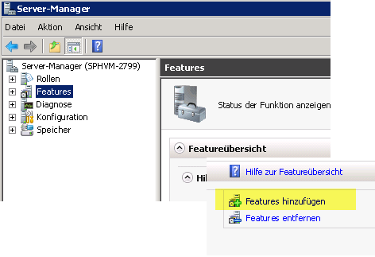
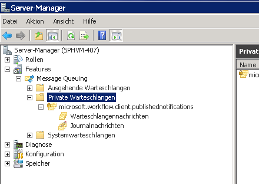

# <a name="how-to-configure-msmq-for-sharepoint-workflows"></a>Vorgehensweise: Konfigurieren von MSMQ für SharePoint-Workflows
Informationen Sie zum Konfigurieren von Microsoft Message Queuing (MSMQ) in SharePoint asynchrones Ereignis messaging in SharePoint-Workflows unterstützen. 
## <a name="enabling-msmq"></a>Aktivieren von MSMQ

MSMQ ist ein Windows Server-Feature, das Sie auf Ihrem Computer SharePoint Server aktivieren können, um asynchrones Ereignis messaging in SharePoint-Workflows zu ermöglichen. Um asynchrones Ereignis messaging unterstützen möchten, müssen Sie MSMQ auf Ihrem Computer SharePoint Server aktivieren.
  
    
    
MSMQ wird als „Feature“ in Windows Server bereitgestellt. Wenn Sie MSMQ aktivieren möchten, gehen Sie folgendermaßen vor:
  
    
    

> **Wichtig:** Die Screenshots in diesem Artikel stammen aus Windows Server 2008 R2. In Windows Server 2012 kann die Benutzeroberfläche zum Aktivieren dieses Features anders aussehen. 
  
    
    


1. Öffnen Sie auf Ihrem SharePoint Server-Computer die Komponente **Server-Manager**.
    
  
2. Wählen Sie im linken Bereich der **Features**-Symbol aus, und wählen Sie dann **Features hinzufügen**, wie in Abbildung 1 dargestellt.
    
   **Abbildung 1: Hinzufügen des Message Queuing-Features.**

  

  
  

  

  
3. Wählen Sie im **Assistenten zum Hinzufügen von Features**, die angezeigt wird, **Message Queuing**. Akzeptieren Sie die Standardauswahl, und klicken Sie dann klicken Sie auf **Weiter** und dann auf **Installieren**.
    
  
4. Jetzt müssen Sie den Computer neu starten.
    
  
5. Nach dem Neustart, öffnen Sie den **Server Manager**, und öffnen Sie **Message Queuing-** Symbol im linken Bereich. Beachten Sie, dass sie jetzt eine **Message Queuing-** Ordner und seiner Unterverzeichnisse enthält, wie in Abbildung 2 dargestellt.
    
    > **Hinweis:** In Windows Server 2012 befinden sich die Warteschlangen nicht unter **Server-Manager**. Wechseln Sie stattdessen zu **Computerverwaltung**, und wählen Sie dann **Dienste und Anwendungen** aus. 
6. Wählen Sie das Unterverzeichnis namens **Private Warteschlangen** aus. Dies ist das Verzeichnis, in dem Ihre Workflow-Ereignisnachrichten gespeichert werden.
    
   **Abbildung 2. Das Feature für die Message Queuing-zu-Server-Manager hinzugefügt.**

  

  
  

    
    
    
    > **Hinweis:** Beim ersten Hinzufügen des Features **Message Queuing** ist der Ordner **Private Warteschlangen** leer. Nach der Ausführung eines Workflows, der ein Ereignis ausgelöst (oder eines Workflows, der durch Ausführung eines SharePoint-Inhaltsänderungsereignisses ausgelöst wird), ist der Ordner **Private Warteschlangen** wie in Abbildung 2 dargestellt gefüllt.
7. Um die Installation abzuschließen, müssen Sie die **SPWorkflowServiceApplicationProxy.AllowQueue** -Eigenschaft auf **true** mithilfe eines Skripts Windows PowerShell festlegen. Führen Sie in der **SharePoint-Zentraladministration Shell** folgenden Befehl:
    
```
  
$proxy = Get-SPWorkflowServiceApplicationProxy
$proxy.AllowQueue = $true;
$proxy.Update();

```


## <a name="troubleshooting-msmq"></a>Problembehandlung bei MSMQ

Windows-Entwicklercenter bietet ausführliche Dokumentation von MSMQ. Es folgen einige nützlichen Ressourcen:
  
    
    

-  
  [Zu Message Queuing](http://msdn.microsoft.com/en-us/library/windows/desktop/ms706032%28v=vs.85%29.aspx)
    
  
-  
  [Message Queuing-Referenz (engl.)](http://msdn.microsoft.com/en-us/library/windows/desktop/ms700112%28v=vs.85%29.aspx)
    
  
-  
  [Message Queuing-Fehler und Codes für Statusangaben](http://msdn.microsoft.com/en-us/library/windows/desktop/ms700106%28v=vs.85%29.aspx)
    
  

## <a name="additional-resources"></a>Zusätzliche Ressourcen
<a name="bk_addresources"> </a>


-  
  [Message Queuing (MSMQ)](http://msdn.microsoft.com/en-us/library/windows/desktop/ms711472%28v=vs.85%29.aspx)
    
  

  
    
    

