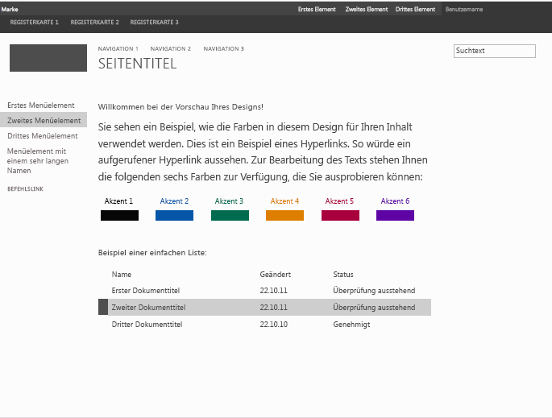

# <a name="how-to-create-a-master-page-preview-file-in-sharepoint"></a>Gewusst wie: Erstellen einer Gestaltungsvorlagen-Vorschaudatei in SharePoint
Informationen zum Erstellen von Gestaltungsvorlagen-Vorschaudateien, die auf der SharePoint-Designoberfläche verwendet werden, um eine Vorschau ausgewählter Designkomponenten anzuzeigen. Der Assistent **Aussehen ändern** bietet den Einstiegspunkt in die Designoberfläche von SharePoint. Die Design Gallery ist die erste Seite im Assistenten **Aussehen ändern**. Sie enthält eine Miniaturansicht sämtlicher verfügbarer Designs. Benutzer wählen ein Design für ihre Website aus und können dieses dann auf der nächsten Seite anpassen. Anschließend können Benutzer eine Vorschau der Website anzeigen, bevor sie das Design auf ihre Website anwenden. Die Gestaltungsvorlagen-Vorschaudatei wird zur Generierung der Miniaturansichten und der Vorschaubilder verwendet. Wenn eine Gestaltungsvorlage nicht über eine zugehörige Vorschaudatei verfügt, kann sie nicht auf der Designoberfläche verwendet werden.
  
    
    

Weitere Informationen finden Sie unter  [Übersicht über Designs für SharePoint](themes-overview-for-sharepoint.md).
## <a name="core-concepts-to-know-for-working-with-master-page-preview-files"></a>Kernkonzepte für die Verwendung von Gestaltungsvorlagen-Vorschaudateien
<a name="Introduction"> </a>

Tabelle 1 enthält Artikel, die die Kernkonzepte für die Verwendung von Gestaltungsvorlagen-Vorschaudateien erläutern.
  
    
    

**Tabelle 1. Kernkonzepte für die Verwendung von Gestaltungsvorlagen-Vorschaudateien**


|**Titel des Artikels**|**Beschreibung**|
|:-----|:-----|
| [Übersicht über Designs für SharePoint](themes-overview-for-sharepoint.md) <br/> |Informationen zur Designoberfläche in SharePoint.  <br/> |
| [Auswählen eines Designs für Ihre Veröffentlichungswebsite](http://office.microsoft.com/en-us/office365-sharepoint-online-enterprise-help/choose-a-theme-for-your-publishing-site-HA102891580.aspx) <br/> |Erfahren Sie, wie Sie das Aussehen und Verhalten einer SharePoint-Website mithilfe des Assistenten **Aussehen ändern** ändern können. <br/> |
   

## <a name="what-is-a-master-page-preview-file"></a>Was ist eine Gestaltungsvorlagen-Vorschaudatei?
<a name="section1"> </a>

Vorschaudateien für Masterseiten (.preview-Dateien) sind speziell formatierte Dateien mit Abschnitten für die Standardfarbpalette, das Standardschriftartenschema, die Token-CSS sowie die Token-HTML. Die Vorschaudatei für die Masterseite muss denselben Namen (ohne Erweiterung) wie die entsprechende Masterseite verwenden. Wenn Sie eine beispielsweise eine Masterseite mit dem Namen „article.master“ haben, weist die entsprechende Vorschaudatei der Masterseite den Namen „article.preview“ auf. Masterseiten und Vorschauen für Masterseiten werden im Masterseitenkatalog gespeichert.
  
    
    
Eine Vorschaudatei für eine Masterseite weist die folgende Struktur auf:
  
    
    


```HTML
Default color palette
[SECTION]
Default font scheme
[SECTION]
CSS
[SECTION]
HTML
```

In der Gestaltungsvorlagenkatalog-Vorschaudatei:
  
    
    

-  _Standardfarbpalette_ ist die SPCOLOR-Datei im Designkatalog (http:// _SiteColltionName_/_catalogs/theme/15/), die Sie als Standard verwenden möchten. Die Standardfarbpalette entspricht den Farben, die in der Standardeinstellung in der Gestaltungsvorlage verwendet werden. Das heißt, bevor ein Benutzer eine Farbpalette im Assistenten **Aussehen ändern** ausgewählt hat.
    
  
-  _Standardschriftartenschema_ ist die SPFONT-Datei im Designkatalog (http:// _SiteCollectionName_/_catalogs/theme/15/), die Sie als Standard verwenden möchten. Das Standardschriftartenschema entspricht den Schriftarten, die in der Standardeinstellung in der Gestaltungsvorlage verwendet werden. Das heißt, bevor ein Benutzer ein Schriftartenschema im Assistenten **Aussehen ändern** ausgewählt hat.
    
  
-  _CSS_ ist der Abschnitt, der Cascading Stylesheets (CSS) enthält. Allen CSS-Klassen muss[ID] vorangestellt werden. Das folgende Beispiel zeigt einen Teil des CSS-Abschnitts in einer Gestaltungsvorlagen-Vorschaudatei.
    
```
  
[ID] #dgp-pageContainer
{
    background-color: [T_THEME_COLOR_PAGEBACKGROUND];
    color: [T_THEME_COLOR_BODYTEXT];
    width: 100%;
    height:100%;     
    background-image: url('[T_IMAGE]');       
    background-size: cover;
    font-family: [T_BODY_FONT];   
}
```

-  _HTML_ ist der HTML-Abschnitt, der die HTML-Struktur der Vorschau definiert.
    
  

> **Hinweis:** Alle Dimensionswerte sollten als relative Einheiten in der Vorschaudatei der Masterseite angegeben werden. Beispielsweise können Dimensionswerte als Prozentsatz oder als em-Maßeinheit angegeben werden. Weitere Informationen zu em-Maßeinheiten finden Sie im Abschnitt [5.1.1. Font-relative lengths: the 'em', 'ex', 'ch', 'rem' units](http://www.w3.org/TR/2012/WD-css3-values-20120308/#font-relative-lengths) im Arbeitsentwurf „W3C CSS Values and Units Module Level 3“.
  
    
    

Token werden in der gesamten Gestaltungsvorlagen-Vorschaudatei verwendet. Token sind Zeichenfolgenwerte, die in der generierten Vorschau durch Text, Farbwerte oder Schriftartenwerte ersetzt werden. In den folgenden Abschnitten werden die verfügbaren Token und deren Verwendung beschrieben.
  
    
    

### <a name="miscellaneous-tokens"></a>Verschiedene Token

Die verschiedenen Token werden in der Vorschau durch die angegebenen Höhen- und Breitenwerte ersetzt.
  
    
    

**Tabelle 2. Verschiedene Token**


|**Tokenname**|**Beschreibung**|
|:-----|:-----|
|[T_HEIGHT]  <br/> |Die Höhe der Vorschau.  <br/> |
|[T_WIDTH]  <br/> |Die Breite der Vorschau.  <br/> |
|[T_IMAGE]  <br/> |Die URL eines optionalen Hintergrundbilds.  <br/> |
|[T_IMGHEIGHT]  <br/> |Ggf. die Höhe des Bilds.  <br/> |
|[T_IMGWIDTH]  <br/> |Ggf. die Breite des Bilds.  <br/> |
   

### <a name="color-tokens"></a>Farbtoken

Farbtoken werden im Vorschaubild durch Farbwerte ersetzt. In Tabelle 3 werden zwei Formate für Farbtoken beschrieben. Ersetzen Sie  _ColorSlot_ durch den Anmerkungsnamen des Farbplatzes. Die Farbtoken müssen in Großbuchstaben angeben werden (z. B. [T_THEME_COLOR_PAGEBACKGROUND]). Die Liste der verfügbaren Farbtoken finden Sie im Abschnitt [Zuordnen von Farbplätzen](color-palettes-and-fonts-in-sharepoint.md#colorSlots) in [Farbpaletten und Schriftarten in SharePoint](color-palettes-and-fonts-in-sharepoint.md).
  
    
    

**Tabelle 3. Farbtoken**


|**Tokenname**|**Beschreibung**|
|:-----|:-----|
|[T_THEME_COLOR_ _ColorSlot_]  <br/> |Verwenden Sie dieses Format, wenn Sie den Farbwert für den Farbplatz benötigen.  <br/> |
|[T_THEME_COLOR_ _ColorSlot__AA]  <br/> |Verwenden Sie dieses Format, wenn Sie den 8-stelligen Hexadezimalwert des Farbplatzes benötigen. Dieses Format ist nützlich für Filterwerte, um Deckkraft und Farbverläufe in Internet Explorer zu aktivieren.  <br/> |
   

### <a name="font-tokens"></a>Schriftarttoken

Die Schriftarttoken werden im Vorschaubild durch Schriftartenwerte ersetzt.
  
    
    

- [T_ _SlotName__FONT]
    
  
Ersetzen Sie  _SlotName_ durch den Namen des Schriftartenplatzes. Die Schriftarttoken müssen in Großbuchstaben angegeben werden (z. B. [T_BODY_FONT]). Die Liste der Schriftartenplätze und ihre Verwendung auf einer Seite finden Sie im Abschnitt [Schriftartenplätze](color-palettes-and-fonts-in-sharepoint.md#fontSlot) in [Farbpaletten und Schriftarten in SharePoint](color-palettes-and-fonts-in-sharepoint.md).
  
    
    

### <a name="text-content-tokens"></a>Textinhaltstoken

Die in Tabelle 4 aufgeführten Token werden im HTML-Abschnitt der Gestaltungsvorlagen-Vorschaudatei verwendet. Die Token werden im Vorschaubild in der Design Gallery durch Beispieltext ersetzt. Der Beispieltext wird in der gleichen Sprache wie der Rest der Website angezeigt.
  
    
    

**Tabelle 4. Textinhaltstoken**


|**Tokenname**|**Beschreibung**|
|:-----|:-----|
|[BRANDSTRING]  <br/> |Der Markentext, der auf der Seite angezeigt wird. In den vorinstallierten Designs wird er in der linken oberen Ecke als "Marke" angezeigt.  <br/> |
|[SUITELINK1]  <br/> [SUITELINK2]  <br/> [SUITELINK3]  <br/> |Die Suitenlinks, die in der Suitenleiste angezeigt werden. Siehe "Erstes Element", "Zweites Element", "Drittes Element" in Abbildung 1.  <br/> |
|[WELCOME]  <br/> |Der Benutzernamentext. Siehe "Benutzername" in Abbildung 1.  <br/> |
|[RIBBONTAB1]  <br/> [RIBBONTAB2]  <br/> [RIBBONTAB3]  <br/> |Die Namen der Registerkarten des Menübands. Siehe "Registerkarte 1", "Registerkarte 2", "Registerkarte 3" in Abbildung 1.  <br/> |
|[SEARCHBOX]  <br/> |Der Text im Suchfeld. Siehe "Suchtext" in Abbildung 1.  <br/> |
|[TN1]  <br/> [TN2]  <br/> [TN3]  <br/> |Die horizontalen Navigationselemente. "NAVIGATION 1", "NAVIGATION 2", "NAVIGATION 3".  <br/> |
|[TITLE]  <br/> |Der Titel der Seite. "Seitentitel".  <br/> |
|[QL1]  <br/> [QL2]  <br/> [QL3]  <br/> [QL4]  <br/> |Die vertikalen Navigationselemente. "Erstes Menüelement", "Zweites Menüelement", "Drittes Menüelement".  <br/> |
|[QLADD]  <br/> |Der Link unter den vertikalen Navigationselementen. Siehe "BEFEHLSLINK" in Abbildung 1.  <br/> |
|[CA TABLE HEADER]  <br/> |Die Überschrift über dem Seitentext. In Abbildung 1: "Willkommen bei der Vorschau Ihres Designs".  <br/> |
|[CA TABLE DESCRIPTION]  <br/> |Der Beschreibungstext. In Abbildung 1: "Hier sehen Sie ein Beispiel, wie die Farben in diesem Design für Ihre Inhalte verwendet werden. Dies ist ein Beispiel für…".  <br/> |
|[CA ACCENT COLORS]  <br/> |Die Liste der Akzentfarben und -blöcke.  <br/> |
|[CA LIST TITLE]  <br/> |Die Überschrift der Liste. In Abbildung 1: "Beispiel einer Liste".  <br/> |
|[CA TABLE]  <br/> |Die Beispielliste.  <br/> |
|[SITETITLE]  <br/> |Der Titel der Website. Siehe "Websitetitel" in Abbildung 1.  <br/> |
   

**Abbildung 1: Vorinstalliertes Design mit Beispieltext**

  
    
    

  
    
    

  
    
    

  
    
    

  
    
    

## <a name="create-a-master-page-preview-file"></a>Erstellen einer Gestaltungsvorlagen-Vorschaudatei
<a name="section2"> </a>

Um eine Gestaltungsvorlagen-Vorschaudatei zu erstellen, verwenden Sie eine vorhandene Gestaltungsvorlagenvorschau als Ausgangspunkt.
  
    
    

### <a name="to-create-a-master-page-preview"></a>So erstellen Sie eine Masterseiten-Vorschau


1. Erstellen Sie eine Kopie einer Masterseiten-Vorschau. SharePoint enthält „oslo.preview“ und „seattle.preview“.
    
  
2. Benennen Sie die Kopie der Masterseiten-Vorschau so um, dass diese der entsprechenden Masterseite entspricht. Wenn die Masterseite beispielsweise „article.master“ benannt wird, benennen Sie die Masterseiten-Vorschau in „article.preview“ um.
    
  
3. Verwenden Sie einen HTML-Editor, um die Gestaltungsvorlagen-Vorschaudatei zu bearbeiten. Aktualisieren Sie die Datei, um das Layout und die Darstellung der Gestaltungsvorlage wiederzugeben.
    
    > **Tipp:** Dimensionswerte werden in der Vorschaudatei für die Masterseite als Prozentsätze angegeben. Im folgenden Beispiel ist eine Methode zum Konvertieren einer absoluten Maßeinheit (Pixel) in eine relative Maßeinheit (Prozentsatz) angegeben. Angenommen, Sie haben einen Browser in der Größe 1024x768. Wenn die Masterseite eine Elementhöhe von 32 Pixel aufweist und das übergeordnete Element der Textkörper der Seite ist, berechnen Sie den Prozentsatz, indem Sie die Elementhöhe durch die Browserhöhe dividieren. Die relativeMaßeinheit beträgt 4 % (32/768). 
4. Laden Sie die Vorschaudatei der Masterseite in den Masterseitenkatalog hoch.
    
  
5. Verwenden Sie den Assistenten **Erscheinungsbild ändern**, um die Vorschau der Masterseite mit Ihrem Websiteinhalt zu testen.
    
    > **Hinweis:** Sie können auch ein Design erstellen, das die neue Masterseite verwendet, indem Sie der Liste „Zusammengesetzte Designs“ ein Element hinzufügen. Das Design steht in der Design Gallery (die erste Seite des Assistenten **Erscheinungsbild ändern**) zur Verfügung. Weitere Informationen finden Sie im Verfahren[Bereitstellen eines Designs mithilfe der Benutzeroberfläche](how-to-deploy-a-custom-theme-in-sharepoint.md#section2) in [Vorgehensweise: Bereitstellen eines benutzerdefinierten Designs in SharePoint](how-to-deploy-a-custom-theme-in-sharepoint.md). 
6. Wiederholen Sie die Schritte 3 bis 5, falls erforderlich.
    
  

## <a name="additional-resources"></a>Zusätzliche Ressourcen
<a name="bk_addresources"> </a>


-  [Entwickeln des Website-Designs in SharePoint](develop-the-site-design-in-sharepoint.md)
    
  
-  [Vorgehensweise: Bereitstellen eines benutzerdefinierten Designs in SharePoint](how-to-deploy-a-custom-theme-in-sharepoint.md)
    
  
-  [Farbpaletten und Schriftarten in SharePoint](color-palettes-and-fonts-in-sharepoint.md)
    
  
-  [SharePoint-Teamblog: Beweisen Sie Stil mit SharePoint-Designs](http://blogs.office.com/b/sharepoint/archive/2012/10/29/show-off-your-style-with-sharepoint-theming.aspx)
    
  

