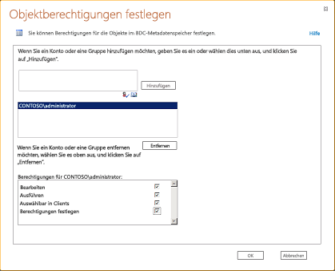

# Vorgehensweise: Erstellen eine mobile app in SharePoint, die Daten aus einer externen Datenquelle enthält.How to: Create a mobile app in SharePoint that contains data from an external data source
Hier erfahren Sie, wie Sie eine einfache mobile app in SharePoint erstellen, die Daten aus externen Datenquelle enthält, indem Sie mithilfe von Business Connectivity Services und Herstellen einer Verbindung mit einer externen Liste. SharePoint ermöglicht Ihnen, mobile Anwendungen zu erstellen, mit die externe Daten in Datenbanken, Unternehmensanwendungen und Web 2.0-Diensten mithilfe von Business Connectivity Services zugreifen können. Sie können auch vollständigen Interaktion mit den externen Daten einschließlich rückschreibfunktionen aus dem mobilen Gerät bereitstellen. Zu diesem Zweck erstellen von apps, die mit externen Listen, die einen besonderen Typ von Listen in SharePoint sind herzustellen, die basieren auf externe Inhaltstypen und Daten aus externen Systemen enthalten. Die neue SharePoint-Liste für Windows Phone-Vorlage in Visual Studio 2010 Express können Sie schnell und problemlos Erstellen von apps für Windows Phone, die mit externen Listen eine Verbindung herstellt. Beispielsweise können Sie eine Windows Phone-app erstellen, die den Produktkatalog für eine Inventarliste in SharePoint auf das Telefon für die Vertriebsmitarbeiter bereitstellt. In diesem Thema wird das Erstellen einer Windows Phone-app, die externe Daten aus der Northwind-Beispieldatenbank anzeigt, indem es eine Verbindung mit einer externen Liste in SharePoint. Beachten Sie, dass in diesem Beispiel wird die externe Liste zu Northwind-Datenbank mit einer benutzerdefinierten OData-Dienst herstellt. Es ist jedoch möglich, Verbinden mit Datenbanken direkt als auch für alle externen Systeme, die von Business Connectivity Services, mithilfe von externen Listen unterstützt wird. Mit der neuen SharePoint-Liste Vorlage in Visual Studio erstellen Sie eine mobile app, die auf eine externe Liste auf einer SharePoint-Website zugreifen können. Dieser Artikel enthält eine schrittweise Anleitung, die mit einer externen Business Data Connectivity (BDC)-Dienst Modell hochladen beginnt und endet mit der neuen mobilen Anwendung zu testen.Learn how to create a simple mobile app in SharePoint that contains data from external data source by using Business Connectivity Services and connecting to an external list. SharePoint enables you to build mobile applications that can access external data from databases, enterprise applications, and Web 2.0 services using Business Connectivity Services. You can also provide complete interaction with the external data including write-back capabilities from your mobile device. You do this by creating apps that connect to external lists, which are a special type of lists in SharePoint that are based on external content types and contain data from an external system. The new Windows Phone SharePoint List template in Visual Studio 2010 Express enables you to quickly and easily create apps for the Windows Phone that connects to external lists. For example, you can build a Windows phone app that brings the product catalog for an inventory list in SharePoint to the phone for the sales people. This topic shows how to create a Windows Phone app that displays external data from the Northwind sample database by connecting to an external list in SharePoint. Notice that in this example, the external list connects to the Northwind database using a custom OData service; however, it's possible to connect to databases directly as well as any external system that is supported by Business Connectivity Services, using external lists. With the new SharePoint List template in Visual Studio, you can create a mobile app that can access an external list on a SharePoint site. This article provides a step-by-step procedure that begins with uploading an external Business Data Connectivity (BDC) service model and ends with testing your new mobile app.
  
    
    

> **Wichtig:** Wenn Sie eine App für Windows Phone 8 entwickeln, müssen Sie Visual Studio Express 2012 anstelle von Visual Studio 2010 Express verwenden.**Important** If you are developing an app for Windows Phone 8, you must use Visual Studio Express 2012 instead of Visual Studio 2010 Express. Except for the development environment, all information in this article applies to creating apps for both Windows Phone 8 and Windows Phone 7. Mit Ausnahme der Entwicklungsumgebung gelten alle Informationen in diesem Artikel für das Erstellen von Apps sowohl auf Windows Phone 8 als auch auf Windows Phone 7.Important If you are developing an app for Windows Phone 8, you must use Visual Studio Express 2012 instead of Visual Studio 2010 Express. Except for the development environment, all information in this article applies to creating apps for both Windows Phone 8 and Windows Phone 7. Weitere Informationen finden Sie unter [Vorgehensweise: Einrichten einer Umgebung für die Entwicklung mobiler Apps für SharePoint](how-to-set-up-an-environment-for-developing-mobile-apps-for-sharepoint.md).For more information, see  [How to: Set up an environment for developing mobile apps for SharePoint](how-to-set-up-an-environment-for-developing-mobile-apps-for-sharepoint.md). 
  
    
    

## Voraussetzungen für die Erstellung einer mobilen App, die externe Daten enthältPrerequisites for creating a mobile app that contains external data

- Eine SharePoint Installation mit Administratorrechten zum Hochladen des BDC-Modells für die Northwind-Datenbank und einer SharePoint-Website, in dem Sie die externe Liste erstellenA SharePoint installation with administrative privileges to upload the BDC model for the Northwind database and a SharePoint site where you create the external list
    
  
- Microsoft Visual Studio Express mit den neuen SharePoint phonevorlagen aus  [Microsoft SharePoint SDK for Windows Phone 7.1](http://www.microsoft.com/en-us/download/details.aspx?id=30476)Microsoft Visual Studio Express with the new SharePoint phone templates from  [Microsoft SharePoint SDK for Windows Phone 7.1](http://www.microsoft.com/en-us/download/details.aspx?id=30476)
    
  
- Das BDC-Modell für unsere exampleNorthwind_oData.bdmc (Laden von  [SharePoint: erstellen eine einfachen externen listenbasierten Phone-app](http://code.msdn.microsoft.com/sharepoint/SharePoint-Create-a-88800202))The BDC model for our exampleNorthwind_oData.bdmc (download from  [SharePoint: Create a simple external list-based phone app](http://code.msdn.microsoft.com/sharepoint/SharePoint-Create-a-88800202))
    
  
- Eine SharePoint Installation mit Administratorrechten zum Hochladen des BDC-Modells für die Northwind-Datenbank und einer SharePoint-Website, in dem Sie die externe Liste erstellenA SharePoint installation with administrative privileges to upload the BDC model for the Northwind database and a SharePoint site where you create the external list
    
  

## Schritt 1: Hochladen einer BDC-MetadatenmodellStep 1: Upload a BDC metadata model

Ein BDC-Modell ist das Herzstück von Business Connectivity Services. Es ist eine XML-Datei, die Datenstrukturen wie **Entity** (externer Inhaltstyp) und **-Methode** wird verwendet, um die abstrakten komplexen Details über das externe System. Es wird automatisch generierten beim Erstellen eines externen Inhaltstyps mit SharePoint Designer und für einige Datenquellentypen solche .NET und OData-Quellen, Sie das BDC-Modell manuell oder mithilfe von Visual Studio erstellen müssen. Wenn Sie ein BDC-Modell für den BDC-Metadatenspeicher mithilfe der SharePoint-Zentraladministration hochladen, können die externen Inhaltstypen im Modell definierten verwendet werden, zum Erstellen von externer Listen in SharePoint Listen darstellen, die Daten aus dem zugrunde liegenden externen System anzeigen. In diesem Schritt werden das Northwind-Beispiel BDC-Modell für den Metadatenspeicher hochladen mithilfe der SharePoint-Zentraladministration.A BDC model is the core of Business Connectivity Services. It's an XML file that uses data structures such as **Entity** (external content type) and **Method** to abstract out complex details about the external system. It's auto-generated when you create an external content type using SharePoint Designer and for some data source types such .NET and OData sources, you need to create the BDC model manually or by using Visual Studio. When you upload a BDC model to the BDC metadata store using SharePoint Central Administration, the external content types defined in the model can be used to create external lists in SharePoint which are lists that display data from the underlying external system. In this step, you'll upload the Northwind sample BDC model to the Metadata Store using SharePoint Central Administration.
  
    
    

1. Navigieren Sie zur Zentraladministration.Navigate to Central Administration.
    
  
2. Wählen Sie **Anwendungsverwaltung**, und wählen Sie dann auf **Dienstanwendungen verwalten**.Choose **Application Management**, and then choose **Manage Service Applications**.
    
  
3. Wählen Sie auf der Seite „Dienstanwendung“ **Business Data Connectivity-Dienst** aus.On the Service Application page, choose **Business Data Connectivity Service**.
    
  
4. Wählen Sie im Menüband in der BDC-Dienstanwendung **Importieren**.On the ribbon in the BDC Service application, choose **Import**.
    
  
5. Wählen Sie auf der Seite BDC-Modell importieren **Business Data Connectivity-Dienst**.On the Import BDC Model page, choose **Business Data Connectivity Service**.
    
  
6. Wählen Sie auf dem Menüband in der BDC-Dienstanwendung **Importieren**.On the ribbon in the BDC Service application, choose **Import**.
    
  
7. Wählen Sie **Durchsuchen** aus, auf der Seite BDC-Modell importieren.On the Import BDC Model page, choose **Browse**.
    
  
8. Klicken Sie im Dialogfeld **Datei zum Hochladen auswählen** suchen Sie die Datei Northwind_oData.bdcm, und wählen Sie dann auf **Öffnen**.In the **Choose a File to upload** dialog box, browse to the Northwind_oData.bdcm file, and then choose **Open**.
    
  
9. Nachdem die Datei importiert wurde, wählen Sie die Schaltfläche **OK**.After the file is imported, choose the **OK** button.
    
  

## Schritt 2: Gewähren von BerechtigungenStep 2: Grant permissions

Als Nächstes müssen Sie zum Festlegen von Berechtigungen für das BDC-Modell, um anzugeben, die im Modell beschriebenen Methoden ausgeführt werden kann. Dies ist ein erforderlicher Schritt. Es wird empfohlen, dass Sie bestimmte Berechtigungen, jedem Benutzer oder Gruppe, die sie so benötigt erteilen, dass die Anmeldeinformationen der geringsten Rechte zum Ausführen der erforderlichen Aufgaben erforderlich. Weitere Informationen zum Festlegen von Berechtigungen finden Sie unter Übersicht über Business Connectivity Service-Berechtigungen in  [Business Connectivity Services-Sicherheit (Übersicht) (SharePoint Server 2010)](http://technet.microsoft.com/de-de/library/ee661740.aspx). In diesem Schritt erteilen Sie die Berechtigung an sich selbst zum Ausführen der Methods beschrieben, die in der Northwind-Beispiel BDC-Modell.Next you need to set permissions on the BDC model to specify who can execute the methods described in the model. This is a required step. We recommend that you give specific permissions to each user or group that needs them, in such a way that the credentials provide the least privilege necessary to perform the needed tasks. For more information about setting permissions, see Business Connectivity Service permissions overview in  [Business Connectivity Services security overview (SharePoint Server 2010)](http://technet.microsoft.com/de-de/library/ee661740.aspx). In this step, you give permission to yourself to execute the methods described in the Northwind sample BDC model.
  
    
    

1. Navigieren Sie zur Zentraladministration.Navigate to Central Administration.
    
  
2. Wählen Sie **Anwendungsverwaltung**, und wählen Sie dann auf **Dienstanwendungen verwalten**.Choose **Application Management**, and then choose **Manage Service Applications**.
    
  
3. Wählen Sie auf der Seite Dienstanwendungen die **Business Data Connectivity-Dienst**.On the Service Application page, choose **Business Data Connectivity Service**.
    
  
4. Wählen Sie im Menüband der Dropdown Liste in der Gruppe **Ansicht** **BDC-Modelle**.In the ribbon, choose **BDC Models** from the drop-down list in the **View** group.
    
  
5. In der Liste der BDC-Modelle mit dem Mauszeiger Northwind_oData.bdcm, und wählen Sie **Berechtigungen festlegen**, wie in Abbildung 1 dargestellt.In the list of BDC models, hover over Northwind_oData.bdcm and choose **Set Permissions**, as shown in Figure 1.
    
   **Abbildung 1. Auswahl von Berechtigungen für BDC-Modell****Figure 1. Choosing permissions for BDC model**

  

  
  

  

  
6. Wählen Sie die Schaltfläche **Durchsuchen**, klicken Sie im Dialogfeld **Objektberechtigungen festlegen**.In the **Set Object Permissions** dialog box, choose the **Browse** button.
    
  
7. Klicken Sie im Dialogfeld **Personen und Gruppen auswählen** für Ihr Konto zu suchen Sie, und wählen Sie die Schaltfläche **OK**.In the **Select People and Groups** dialog box, search for your account and choose the **OK** button.
    
  
8. Wählen Sie die Berechtigungen für das **Bearbeiten**, **Ausführen**, **Auswählbar In Clients** und **Berechtigungen festlegen**, wie in Abbildung 2 dargestellt.Select the permissions for **Edit**, **Execute**, **Selectable In Clients**, and **Set Permissions**, as shown in Figure 2.
    
   **Abbildung 2. Festlegen von Berechtigungen für Gruppenrichtlinienobjekte****Figure 2. Setting object permissions**

  

  
  

  

  
9. Klicken Sie auf **OK**.Choose the **OK** button.
    
  
10. Wählen Sie im Menüband **Externe Inhaltstypen** aus der Dropdown Liste in der Gruppe **Ansicht**.In the ribbon, select **External Content Types** from the drop-down list in the **View** group.
    
  
11. In der Liste der externen Inhaltstypen mit dem Mauszeiger **Kunden**, und wählen Sie dann auf **Berechtigungen festlegen**.In the list of external content types, hover over **Customer**, and then choose **Set Permissions**.
    
  
12. Wählen Sie die Schaltfläche **Durchsuchen**, und suchen Sie nach Ihrem Konto, klicken Sie im Dialogfeld **Objektberechtigungen festlegen**.In the **Set Object Permissions** dialog box, choose the **Browse** button and search for your account.
    
  
13. Klicken Sie im Dialogfeld **Objektberechtigungen festlegen** auf **Hinzufügen**, und wählen Sie die Berechtigungen für das **Bearbeiten**, **Ausführen**, **Auswählbar In Clients** und **Berechtigungen festlegen**.In the **Set Object Permissions** dialog box, choose **Add** and select the permissions for **Edit**, **Execute**, **Selectable In Clients**, and **Set Permissions**.
    
  
14. Stellen Sie sicher, dass das Kontrollkästchen **Berechtigungen weitergeben** aktiviert ist.Ensure that the **Propagate Permissions** box is selected.
    
  
15. Klicken Sie auf **OK**.Choose the **OK** button.
    
  

## Schritt 3: Erstellen einer externen ListeStep 3: Create an external list

Nun, dass Sie das BDC-Modell hochgeladen und Festlegen von Berechtigungen haben, können Sie eine externe Liste basierend auf den externen Inhaltstyp definiert im BDC-Modell erstellen. In diesem Schritt erstellen Sie eine externe Liste basierend auf den externen Inhaltstyp Customer definiert, in der Northwind-BDC-Modell, die, das Sie in  [Schritt 1: Hochladen einer BDC-Metadatenmodell](how-to-create-a-mobile-app-in-sharepoint-that-contains-data-from-an-externa.md#HowToCreateSimpleExternalListBasedPhoneApp_Step1)hochgeladen.Now that you've uploaded the BDC model and set permissions, you can create an external list based on the external content type defined in the BDC model. In this step, you will create an external list based on the Customer external content type defined in the Northwind BDC model you uploaded in  [Step 1: Upload a BDC metadata model](how-to-create-a-mobile-app-in-sharepoint-that-contains-data-from-an-externa.md#HowToCreateSimpleExternalListBasedPhoneApp_Step1).
  
    
    

1. Navigieren Sie zu der SharePoint-Website, in dem die neue Liste angezeigt werden soll.Navigate to the SharePoint site where you want the new list.
    
  
2. Wählen Sie auf der Homepage der Website **Weitere**.On the home page of the site, choose **More**.
    
  
3. Wählen Sie auf der Seite Apps **Hinzufügen einer App**.On the Apps page, choose **Add an App**.
    
  
4. Klicken Sie auf der appseite hinzufügen bewegen Sie den Mauszeiger über die **Externe Liste**, und wählen Sie **Hinzufügen**.On the Add an App page, hover over **External List** and choose **Add it**.
    
  
5. Geben Sie im Dialogfeld **Hinzufügen einer externen Liste** einen Namen wie „Customers“ in das Feld **Name** ein.In the **Adding an External List** dialog box, enter a name such asCustomers in the **Name** field.
    
  
6. Geben Sie im Feld **Externer Inhaltstyp** die externe Datenquelle an, die Sie in Schritt 1 hochgeladen haben.In the **External Content Type** box, specify the external data source that you uploaded in step 1.
    
  
7. Klicken Sie auf **OK**.Choose the **OK** button.
    
  
8. Wählen Sie auf der Seite Apps **Kundenliste** zum Anzeigen der Liste aus.On the Apps page, choose **Customers List** to view the list.
    
  

## Schritt 4: Erstellen einer mobilen app mithilfe der Windows Phone SharePoint List Application-VorlageStep 4: Create a mobile app using the Windows Phone SharePoint List Application template

Die externe Liste bereit ist, und Sie können nun eine Windows Phone 7-app, die für die externe Liste verbindet Sie erstellt, in das  [Schritt 3: Erstellen einer externen Liste](how-to-create-a-mobile-app-in-sharepoint-that-contains-data-from-an-externa.md#HowToCreateSimpleExternalListBasedPhoneApp_Step3) erstellen und Anzeigen von Kundendaten aus der Northwind-Datenbank.Your external list is ready and you can now create a Windows Phone 7 app that connects to the external list you created in  [Step 3: Create an external list](how-to-create-a-mobile-app-in-sharepoint-that-contains-data-from-an-externa.md#HowToCreateSimpleExternalListBasedPhoneApp_Step3) and display Customer data from the Northwind database.
  
    
    

1. Starten Sie Visual Studio 2010 Express.Start Visual Studio 2010 Express.
    
  
2. Wählen Sie auf der Menüleiste **Datei**, **Neues Projekt** aus. Das Dialogfeld **Neues Projekt** wird geöffnet.On the menu bar, choose **File**, **New Project**. The **New Project** dialog box opens.
    
  
3. Klicken Sie im Dialogfeld **Neues Projekt** Wählen Sie **Visual c#**, wählen Sie **Silverlight für Windows Phone**, und wählen Sie dann auf **Windows Phone SharePoint List Application**.In the **New Project** dialog box, choose **Visual C#**, choose **Silverlight for Windows Phone**, and then choose **Windows Phone SharePoint List Application**.
    
  
4. Geben Sie einen Namen für das Projekt. Wir verwenden in diesem Beispiel CustomerApp , wie in Abbildung 3 dargestellt.Specify a name for the project. We use CustomerApp in this example, as shown in Figure 3.
    
   **Abbildung 3. Auswählen der Windows Phone SharePoint List Application-Vorlage in Visual Studio****Figure 3. Selecting the Windows Phone SharePoint List Application template in Visual Studio**

  

  
  

  

  
5. Klicken Sie auf **OK**.Choose the **OK** button.
    
  
6. Geben Sie in der **SharePoint-Phone-Anwendungs-Assistent** die URL der SharePoint-Website, in der Sie die externe Liste erstellt haben.In the **SharePoint Phone Application Wizard**, enter the URL of the SharePoint site in which you created the external list.
    
  
7. Wählen Sie die Liste der **Kunden** aus, und wählen Sie **Weiter**.Choose the **Customers** list, and choose **Next**.
    
  
8. Auf dem Bildschirm **Wählen Sie Ansichten** **Kundenliste Lese-** und wählen Sie **Weiter**.On the **Choose Views** screen, select **Customer Read List** and choose **Next**.
    
  
9. **Wählen Sie** auf dem Bildschirm **Wählen Sie Vorgänge**, und wählen Sie dann auf **Weiter**.On the **Choose Operations** screen, choose **Display**, and then choose **Next**.
    
  
10. Klicken Sie auf dem Bildschirm **Wählen Sie Felder** Wählen Sie die Felder, die Sie verwenden oder in Ihre mobile app anzeigen möchten, und wählen Sie dann auf **Weiter**.On the **Choose Fields** screen, select the fields you want to use or display in your mobile app, and then choose **Next**.
    
  
11. Ordnen Sie auf dem Bildschirm **Reihenfolge Felder** die Felder bei Bedarf neu an, und wählen Sie dann auf **Fertig stellen**.On the **Order Fields** screen, reorder the fields if needed, and then choose **Finish**.
    
  
12. Sie haben nun erfolgreich die app erstellt, die für die externe Liste verbindet.You've now successfully created the app that connects to the external list.
    
  

## Führen Sie aus und Testen Sie Ihrer appRun and test your app

Nun, dass die app ausgeführt werden kann, können Sie ihn mit Phone-Emulator testen.Now that the app is ready to run, you can test it using phone emulator.
  
    
    

1. Wählen Sie in Visual Studio **Debuggen**, und klicken Sie dann Debuggen Sie **Starten**, oder drücken Sie F5.In Visual Studio, choose **Debug**, and then choose **Start Debugging**, or press F5.
    
  
2. Wenn Sie aufgefordert werden, melden Sie sich mit den gleichen Benutzernamen und das Kennwort, das Sie zur Anmeldung bei der SharePoint-Website verwendet. Stellen Sie sicher, dass Sie über Administratorrechte verfügen.When prompted, log in by using the same username and password that you used to log in to the SharePoint site. Ensure that you have admin rights.
    
  
3. Navigieren Sie in der Ergebnisliste Kunden wie in Abbildung 4 dargestellt.Scroll through the resulting Customers list, as shown in Figure 4.
    
   **Abbildung 4. Mobile app Anzeigen von externen SharePoint-Liste****Figure 4. Mobile app displaying SharePoint external list**

  

  
  

  

  

> **Hinweis:** Bei Verwendung des Assistenten für SharePoint-Listenvorlagen zum Erstellen einer mobilen App für eine externe Liste, die schreibgeschützte Felder enthält, lässt der vom Assistenten generierte Code nicht zu, dass Benutzer Elemente erstellen oder bearbeiten.**Note** When you use the SharePoint List Template wizard to create a mobile app for an external list that has read-only fields, the code that is generated by the wizard does not allow users to create or edit items. 
  
    
    

## Zusätzliche RessourcenAdditional resources

  
    
    

-  [Erstellen von Windows Phone-Apps, die auf SharePoint zugreifenBuild Windows Phone apps that access SharePoint](build-windows-phone-apps-that-access-sharepoint.md)
    
  
-  [Überblick über Anwendungsvorlagen für Windows Phone SharePoint in Visual StudioOverview of Windows Phone SharePoint application templates in Visual Studio](overview-of-windows-phone-sharepoint-application-templates-in-visual-studio.md)
    
  
-  
  [Vorgehensweise: Erstellen externer Listen in SharePoint](http://msdn.microsoft.com/de-de/library/ee558778.aspx)[How to: Create External Lists in SharePoint](http://msdn.microsoft.com/de-de/library/ee558778.aspx)
    
  
-  [Vorgehensweise: Erstellen eine Windows Phone SharePoint Liste appHow to: Create a Windows Phone SharePoint list app](how-to-create-a-windows-phone-sharepoint-list-app.md)
    
  
-  [Vorgehensweise: Einrichten einer Umgebung für die Entwicklung von mobilen Anwendungen für SharePointHow to: Set up an environment for developing mobile apps for SharePoint](how-to-set-up-an-environment-for-developing-mobile-apps-for-sharepoint.md)
    
  
-  [Windows Phone SDK 7.1Windows Phone SDK 7.1](http://www.microsoft.com/en-us/download/details.aspx?id=27570)
    
  
-  [Microsoft SharePoint SDK für Windows Phone 7.1Microsoft SharePoint SDK for Windows Phone 7.1](http://www.microsoft.com/en-us/download/details.aspx?id=30476)
    
  

