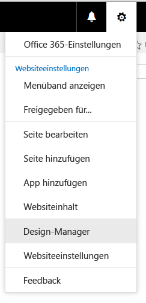

# <a name="how-to-create-a-page-layout-in-sharepoint"></a><span data-ttu-id="9d9bb-102">Vorgehensweise: Erstellen eines Seitenlayouts in SharePoint</span><span class="sxs-lookup"><span data-stu-id="9d9bb-102">How to: Create a page layout in SharePoint</span></span>
<span data-ttu-id="9d9bb-p101">Wenn Sie den Entwurfs-Manager zum Erstellen eines Seitenlayouts verwenden, werden zwei Dateien erstellt: eine .aspx-Datei, die SharePoint verwendet, und eine HTML-Version dieses Seitenlayouts, die Sie in Ihrem HTML-Editor bearbeiten können. Die HTML-Datei und das HTML-Seitenlayout sind verknüpft, sodass Ihre Änderungen mit dem entsprechenden Seitenlayout synchronisiert werden, wenn Sie die HTML-Datei bearbeiten und speichern.</span><span class="sxs-lookup"><span data-stu-id="9d9bb-p101">When you use Design Manager to create a page layout, two files are created: an .aspx file that SharePoint uses, and an HTML version of that page layout that you can edit in your HTML editor. The HTML file and page layout are associated, so that whenever you edit and save the HTML file, your changes are synced to the associated page layout.</span></span>
## <a name="introduction-to-page-layouts"></a><span data-ttu-id="9d9bb-105">Einführung in Seitenlayouts</span><span class="sxs-lookup"><span data-stu-id="9d9bb-105">Introduction to page layouts</span></span>
<span data-ttu-id="9d9bb-106"><a name="Introduction"> </a></span><span class="sxs-lookup"><span data-stu-id="9d9bb-106"></span></span>

<span data-ttu-id="9d9bb-p102">Wenn Sie den Entwurfs-Manager zum Erstellen eines Seitenlayouts verwenden, werden zwei Dateien erstellt: eine .aspx-Datei, die SharePoint verwendet, und eine HTML-Version dieses Seitenlayouts, die Sie in Ihrem HTML-Editor bearbeiten können. Die HTML-Datei und das HTML-Seitenlayout sind verknüpft, sodass Ihre Änderungen mit dem entsprechenden Seitenlayout synchronisiert werden, wenn Sie die HTML-Datei bearbeiten und speichern.</span><span class="sxs-lookup"><span data-stu-id="9d9bb-p102">When you use Design Manager to create a page layout, two files are created: an .aspx file that SharePoint uses, and an HTML version of that page layout that you can edit in your HTML editor. The HTML file and page layout are associated, so that whenever you edit and save the HTML file, your changes are synced to the associated page layout.</span></span>
  
    
    
<span data-ttu-id="9d9bb-p103">Wenn Sie eine Gestaltungsvorlage erstellen, laden Sie eine HTML-Datei hoch und wandeln sie direkt in eine Gestaltungsvorlage um. Eine HTML-Datei wandeln Sie jedoch nicht direkt in ein Seitenlayout um. Der Grund dafür ist, dass der Hauptzweck eines Seitenlayouts ist, Seitenfelder zu enthalten, und diese Seitenfelder müssen hinzugefügt werden, wenn das Seitenlayout im Entwurfs-Manager erstellt wird.</span><span class="sxs-lookup"><span data-stu-id="9d9bb-p103">When you create a master page, you upload and convert an HTML file directly into a master page. But, unlike a master page, you do not directly convert an HTML file into a page layout. This is because the primary purpose of a page layout is to contain page fields, and these page fields must get added when the page layout is created in Design Manager.</span></span>
  
    
    
<span data-ttu-id="9d9bb-112">Bei der Erstellung eines Seitenlayouts geschieht Folgendes:</span><span class="sxs-lookup"><span data-stu-id="9d9bb-112">When you create a page layout:</span></span>
  
    
    

- <span data-ttu-id="9d9bb-113">Im Gestaltungsvorlagenkatalog werden eine .aspx-Datei und eine HTML-Datei mit dem gleichen Namen erstellt.</span><span class="sxs-lookup"><span data-stu-id="9d9bb-113">An .aspx file and an HTML file with the same name are created in the Master Page Gallery.</span></span>
    
  
- <span data-ttu-id="9d9bb-114">Sämtliches Markup, das von SharePoint benötigt wird, wird der .aspx-Datei hinzugefügt, damit das Seitenlayout korrekt gerendert wird.</span><span class="sxs-lookup"><span data-stu-id="9d9bb-114">All markup required by SharePoint is added to the .aspx file so that the page layout renders correctly.</span></span>
    
  
- <span data-ttu-id="9d9bb-115">Sonstiges Markup wie Kommentare, **<div>**-Tags, Codeausschnitte und Inhaltsplatzhalter werden der HTML-Datei hinzugefügt.</span><span class="sxs-lookup"><span data-stu-id="9d9bb-115">Other markup such as comments, **<div>** tags, snippets, and content placeholders are added to the HTML file.</span></span>
    
  
- <span data-ttu-id="9d9bb-p104">Seitenfelder, die für den Inhaltstyp einzigartig sind, werden dem Seitenlayout automatisch hinzugefügt. Andere Seitenfelder können über das Menüband im Codeausschnittkatalog hinzugefügt werden.</span><span class="sxs-lookup"><span data-stu-id="9d9bb-p104">Page fields unique to the content type are added automatically to the page layout. Other page fields are available to be added from the ribbon in the Snippet Gallery.</span></span>
    
  
- <span data-ttu-id="9d9bb-p105">Die HTML-Datei und die .aspx-Datei sind verknüpft, sodass spätere Bearbeitungen an der HTML-Datei mit der .aspx-Datei synchronisiert werden, wenn die HTML-Datei gespeichert wird. Sonstiges Markup wie Kommentare, **<div>**-Tags, Codeausschnitte und Inhaltsplatzhalter werden der HTML-Datei hinzugefügt.</span><span class="sxs-lookup"><span data-stu-id="9d9bb-p105">The HTML file and the .aspx file are associated, so that any later edits to the HTML file are synced to the .aspx file whenever the HTML file is saved. Other markup such as comments, **<div>** tags, snippets, and content placeholders are added to the HTML file.</span></span>
    
  

> <span data-ttu-id="9d9bb-120">**Hinweis:** Die Synchronisierung erfolgt nur in eine Richtung.</span><span class="sxs-lookup"><span data-stu-id="9d9bb-120">**Note:** The syncing goes in one direction only.</span></span> <span data-ttu-id="9d9bb-121">Änderungen am HTML-Seitenlayout werden mit der zugehörigen ASPX-Datei synchronisiert, aber wenn Sie die ASPX-Datei direkt bearbeiten, werden diese Änderungen nicht mit der HTML-Datei synchronisiert.</span><span class="sxs-lookup"><span data-stu-id="9d9bb-121">Note The syncing goes in one direction only. Changes to the HTML page layout are synced to the associated .aspx file, but if you choose to edit the .aspx file directly, those changes are not synced to the HTML file. Every HTML page layout (and every HTML master page) has a property named Associated File that is set to True by default, which creates the association and syncing between files.</span></span> <span data-ttu-id="9d9bb-122">Jedes HTML-Seitenlayout (und jede HTML-Gestaltungsvorlage) verfügt über eine Eigenschaft mit dem Namen **Zugeordnete Datei**, die standardmäßig auf **True** festgelegt ist und mit deren Hilfe die Zuordnung und die Synchronisierung zwischen Dateien eingerichtet wird.</span><span class="sxs-lookup"><span data-stu-id="9d9bb-122">Note The syncing goes in one direction only. Changes to the HTML page layout are synced to the associated .aspx file, but if you choose to edit the .aspx file directly, those changes are not synced to the HTML file. Every HTML page layout (and every HTML master page) has a property named **Associated File** that is set to **True** by default, which creates the association and syncing between files.</span></span>
  
    
    

<span data-ttu-id="9d9bb-p107">Wenn Sie z. B. ein Paar verknüpfter Dateien (HTML und .aspx) haben und die .aspx-Datei bearbeiten, ohne die Verknüpfung aufzuheben, werden die Änderungen an der .aspx-Datei gespeichert. Sie können die .aspx-Datei aber nicht einchecken oder veröffentlichen, sodass diese Änderungen nicht sinnvoll gespeichert werden. Die .aspx-Datei wird mit Änderungen in der HTML-Datei überschrieben. Wenn Sie die HTML-Datei einchecken oder veröffentlichen, werden alle an der .aspx-Datei vorgenommenen Änderungen mit den Änderungen an der HTML-Datei überschrieben. Die Änderungen an der .aspx-Datei gehen verloren.</span><span class="sxs-lookup"><span data-stu-id="9d9bb-p107">For example, if you have a pair of associated files (HTML and .aspx) and you edit the .aspx file without breaking the association,the .aspx file changesare saved, but you can't check in or publish the .aspx file, so those changes are not saved in a meaningful way. Any changes to the HTML file override the .aspx file. If you check in or publish the HTML file, the HTML file changes override any changes that were made to the .aspx file. The .aspx file changes are lost.</span></span>
  
    
    
<span data-ttu-id="9d9bb-p108">Wenn Sie als Webentwickler mit ASP.NET vertraut sind, können Sie nur mit der .aspx-Datei arbeiten, indem Sie die Verknüpfung zwischen den Dateien aufheben. Um die Verknüpfung zwischen der HTML-Datei und der .aspx-Datei aufzuheben, wählen Sie im Entwurfs-Manager bei der HTML-Datei **Eigenschaften bearbeiten** aus, und deaktivieren Sie dann das Kontrollkästchen **Zugeordnete Datei**. Sie können die Verknüpfung später wieder erstellen, indem Sie die Eigenschaften bearbeiten und dieses Kontrollkästchen aktivieren. Die .aspx-Datei wird dann wieder mit in der HTML-Datei gespeicherten Änderungen überschrieben.</span><span class="sxs-lookup"><span data-stu-id="9d9bb-p108">If you're a developer comfortable working with ASP.NET, you can choose to work only with the .aspx file by breaking the association between the files. To break the association between the HTML file and .aspx file, in Design Manager, choose **Edit Properties** for the HTML file, and then clear the **Associated File** check box. You can later re-associate the files by editing the properties and selecting this check box, in which case changes saved in the HTML file will again overwrite the .aspx file.</span></span>
  
    
    

## <a name="understanding-the-relationship-between-page-fields-and-a-content-type"></a><span data-ttu-id="9d9bb-130">Grundlegendes zur Beziehung zwischen Seitenfeldern und einem Inhaltstyp</span><span class="sxs-lookup"><span data-stu-id="9d9bb-130">Understanding the relationship between page fields and a content type</span></span>
<span data-ttu-id="9d9bb-131"><a name="UnderstandingPageFields"> </a></span><span class="sxs-lookup"><span data-stu-id="9d9bb-131"></span></span>

<span data-ttu-id="9d9bb-p109">Jedes Seitenlayout ist mit einem Inhaltstyp verknüpft. Dabei handelt es sich normalerweise um einen der Inhaltstypen in der Seitenlayoutgruppe. So ist z. B. der Inhaltstyp "Artikelseite" mit dem Seitenlayout "Artikelseite" verknüpft, wobei beide in einer Veröffentlichungswebsite enthalten sind.</span><span class="sxs-lookup"><span data-stu-id="9d9bb-p109">Every page layout is associated with a content type, typically one of the content types in the Page Layout group. For example, the Article Page content type that is associated with the Article Page page layout, both of which are included in a publishing site.</span></span>
  
    
    
<span data-ttu-id="9d9bb-p110">Ein Inhaltstyp besteht aus Websitespalten, die zusammen ein Schema zugelassener Datentypen definieren. Daran, dass die Spalte "Quelle" leer ist, können Sie erkennen, dass es die Websitespalten nur für den aktuellen Inhaltstyp gibt. Das bedeutet, dass diese Websitespalten durch den aktuellen Inhaltstyp definiert sind und nicht vom übergeordneten Inhaltstyp geerbt werden.</span><span class="sxs-lookup"><span data-stu-id="9d9bb-p110">A content type is made of site columns, which together define a schema of allowed data types. You can tell that site columns are unique to the current content type because the Source column is blank—this means that these site columns are defined by the current content type, and are not inherited from a parent content type.</span></span>
  
    
    
<span data-ttu-id="9d9bb-p111">Bei einem bestimmten Seitenlayout entsprechen die Websitespalten, die den Inhaltstyp darstellen, direkt den Seitenfeldern, die für das Seitenlayout verfügbar sind. Die erste Gruppe von Seitenfeldern auf dem Menüband sind Seitenfelder, die dem Seitenlayout automatisch hinzugefügt werden, wenn Sie es erstellen. SharePoint fügt diese Felder automatisch hinzu, da sie für diesen Inhaltstyp einzigartig sind, und somit ist es wahrscheinlich, dass diese Felder speziell dazu erstellt wurden, um vom Seitenlayout verwendet zu werden, und keine allgemeinen SharePoint-Metadaten darstellen.</span><span class="sxs-lookup"><span data-stu-id="9d9bb-p111">For any given page layout, the site columns that make up the content type correspond directly to the page fields that are available for that page layout. The first group of page fields on the ribbon is page fields that get automatically added to the page layout when you create it. SharePoint adds these fields automatically because they're unique to this content type, and so it's likely that these fields were created specifically to be used by the page layout, as opposed to being general SharePoint metadata.</span></span>
  
    
    
<span data-ttu-id="9d9bb-139">Bevor Sie ein Seitenlayout im Entwurfs-Manager erstellen, müssen Sie möglicherweise zuerst einen Inhaltstyp erstellen, der die Seitenfelder definiert, die Sie für dieses Seitenlayout verwenden möchten.</span><span class="sxs-lookup"><span data-stu-id="9d9bb-139">Before you create a page layout in Design Manager, you may first have to create a content type that defines the page fields that you want for that page layout</span></span>
  
    
    

## <a name="understanding-the-relationship-between-content-placeholders-on-a-page-layout-and-master-page"></a><span data-ttu-id="9d9bb-140">Grundlegendes zur Beziehung zwischen Inhaltsplatzhaltern in einem Seitenlayout und einer Gestaltungsvorlage</span><span class="sxs-lookup"><span data-stu-id="9d9bb-140">Understanding the relationship between content placeholders on a page layout and master page</span></span>
<span data-ttu-id="9d9bb-141"><a name="UnderstandingContentPlaceholders"> </a></span><span class="sxs-lookup"><span data-stu-id="9d9bb-141"></span></span>

<span data-ttu-id="9d9bb-p112">Ein Seitenlayout und eine Gestaltungsvorlage müssen den gleichen Satz von Inhaltsplatzhaltern aufweisen, damit das Seitenlayout korrekt gerendert wird. Dies ist kein Problem, wenn Sie zum Erstellen von Gestaltungsvorlagen und Seitenlayouts den Entwurfs-Manager verwenden, da jeder Datei bei deren Erstellung der korrekte Satz von Inhaltsplatzhaltern hinzugefügt wird. Dadurch wird sichergestellt, dass jedes Seitenlayout in jedem Kanal verwendet werden kann, der eine andere Gestaltungsvorlage verwendet. Sie müssen die meisten dieser Inhaltsplatzhalter nicht kennen oder verwenden. Sie sind vorhanden, weil sie von SharePoint zum korrekten Rendern der Seite benötigt werden.</span><span class="sxs-lookup"><span data-stu-id="9d9bb-p112">A page layout and a master page must have the identical set of content placeholders for the page layout to render correctly. This is not a problem if you use Design Manager to create master pages and page layouts, because the correct set of content placeholders is added to every file when you create it. This ensures that every page layout works across every channel that uses a different master page. You don't have to know about or work with most of these content placeholders. They exist because they're required by SharePoint to render the page correctly.</span></span>
  
    
    
<span data-ttu-id="9d9bb-p113">Wenn Sie aber ein HTML-Seitenlayout bearbeiten und einen Inhaltsplatzhalter manuell hinzufügen, sollten Sie den gleichen Inhaltsplatzhalter jeder Gestaltungsvorlage hinzufügen, die dieses Seitenlayout verwenden soll. Dieses Szenario kommt selten vor.</span><span class="sxs-lookup"><span data-stu-id="9d9bb-p113">But, if you edit an HTML page layout and manually add a content placeholder, you should add that same content placeholder to every master page that needs to work with that page layout. This is not a common scenario.</span></span>
  
    
    
<span data-ttu-id="9d9bb-149">Wenn Sie zum Erstellen von Seitenlayouts und Gestaltungsvorlagen den Entwurfs-Manager verwenden, arbeiten Sie wahrscheinlich nur mit den folgenden Inhaltsplatzhaltern:</span><span class="sxs-lookup"><span data-stu-id="9d9bb-149">If you're using Design Manager to create page layouts and master pages, the most common scenario is that you're working with only the following content placeholders:</span></span>
  
    
    

- <span data-ttu-id="9d9bb-p114">**PlaceHolderMain** Die Gestaltungsvorlage enthält einen Inhaltsplatzhalter mit `ID="PlaceholderMain"`, der das **DefaultContentBlock** **<div>**-Tag mit dem gelben Feld enthält, in dem **Dieser Bereich wird durch Inhalt gefüllt, den Sie in Ihren Seitenlayouts erstellen** steht. In der Gestaltungsvorlage sollten Sie diesen Platzhalter nicht mit Inhalt füllen. Das Seitenlayout enthält einen Inhaltsplatzhalter mit der gleichen ID. Sie sollten Markup in einem Seitenlayout nur in diesen Platzhalter einfügen und kein Markup außerhalb dieses Platzhalters platzieren. Die IDs für die zwei Platzhalter ( **PlaceholderMain**) sollten identisch sein.</span><span class="sxs-lookup"><span data-stu-id="9d9bb-p114">**PlaceHolderMain** The master page contains a content placeholder with `ID="PlaceholderMain"`, which contains the **DefaultContentBlock** **<div>** tag with the yellow box that shows **This area will be filled in by content you create in your page layouts.** You should not put any content inside this placeholder on the master page. The page layout contains a content placeholder with the same ID. You should put markup only inside this placeholder, and put no markup outside this placeholder, on a page layout. The IDs for the two placeholders ( **PlaceholderMain**) should match.</span></span>
    
  
- <span data-ttu-id="9d9bb-p115">**PlaceHolderAdditionalPageHead** Wenn Sie mit einem Seitenlayout arbeiten, fügen Sie in das **<head>**-Tag des Seitenlayouts normalerweise keine Elemente ein. Stattdessen fügen Sie Elemente dem Inhaltsplatzhalter mit  `id="PlaceHolderAdditionalPageHead"` hinzu. Wenn eine Inhaltsseite im Browser gerendert wird, wird diese zusätzliche Kopfzeile mit dem Ende der Kopfzeile der Gestaltungsvorlage zusammengeführt.</span><span class="sxs-lookup"><span data-stu-id="9d9bb-p115">**PlaceHolderAdditionalPageHead** When you work with a page layout, you typically don't insert elements into the **<head>** tag of the page layout. Instead, you add elements to the content placeholder with `id="PlaceHolderAdditionalPageHead"`. When a content page is rendered in the browser, this additional page head gets merged into the end of the head of the master page.</span></span> 
    
  

## <a name="create-a-page-layout"></a><span data-ttu-id="9d9bb-158">Erstellen eines Seitenlayouts</span><span class="sxs-lookup"><span data-stu-id="9d9bb-158">Create a page layout</span></span>
<span data-ttu-id="9d9bb-159"><a name="CreatePageLayout"> </a></span><span class="sxs-lookup"><span data-stu-id="9d9bb-159"></span></span>

<span data-ttu-id="9d9bb-160">Bevor Sie beginnen, müssen Sie wissen, mit welchem Inhaltstyp und welcher Gestaltungsvorlage das Seitenlayout verknüpft wird.</span><span class="sxs-lookup"><span data-stu-id="9d9bb-160">Before you begin, you need to know which content type and master page the page layout will be associated with.</span></span>
  
    
    

### <a name="to-create-a-page-layout"></a><span data-ttu-id="9d9bb-161">So erstellen Sie ein Seitenlayout</span><span class="sxs-lookup"><span data-stu-id="9d9bb-161">To create a page layout</span></span>


1. <span data-ttu-id="9d9bb-162">Wechseln Sie zu Ihrer Veröffentlichungswebsite.</span><span class="sxs-lookup"><span data-stu-id="9d9bb-162">Browse to your publishing site.</span></span>
    
  
2. <span data-ttu-id="9d9bb-163">Wählen Sie oben rechts auf der Seite das Zahnradsymbol und dann **Entwurfs-Manager** aus.</span><span class="sxs-lookup"><span data-stu-id="9d9bb-163">In the upper-right corner of the page, choose the gear icon, and then choose **Design Manager**.</span></span>
    
   <span data-ttu-id="9d9bb-164">**Menü mit Zahnradsymbol**</span><span class="sxs-lookup"><span data-stu-id="9d9bb-164">**Gear icon menu**</span></span>

  

  
  

  

  
3. <span data-ttu-id="9d9bb-167">Wählen Sie im Entwurfs-Manager im linken Navigationsbereich **Seitenlayouts bearbeiten** aus.</span><span class="sxs-lookup"><span data-stu-id="9d9bb-167">In Design Manager, in the left navigation pane, choose **Edit Page Layouts**.</span></span>
    
  
4. <span data-ttu-id="9d9bb-168">Wählen Sie **Seitenlayout erstellen** aus.</span><span class="sxs-lookup"><span data-stu-id="9d9bb-168">Choose **Create a page layout**.</span></span>
    
  
5. <span data-ttu-id="9d9bb-169">Geben Sie im Dialogfeld **Seitenlayout erstellen** einen Namen für Ihr Seitenlayout ein.</span><span class="sxs-lookup"><span data-stu-id="9d9bb-169">In the **Create a Page Layout** dialog box, enter a name for your page layout.</span></span>
    
  
6. <span data-ttu-id="9d9bb-170">Wählen Sie eine Gestaltungsvorlage aus.</span><span class="sxs-lookup"><span data-stu-id="9d9bb-170">Select a master page.</span></span>
    
    <span data-ttu-id="9d9bb-p117">Die hier von Ihnen gewählte Gestaltungsvorlage wird in der Vorschau für dieses Seitenlayout angezeigt. Von dieser Gestaltungsvorlage hängt auch ab, welche Inhaltsplatzhalter dem Seitenlayout hinzugefügt werden.</span><span class="sxs-lookup"><span data-stu-id="9d9bb-p117">The master page that you choose here will be shown in the preview for this page layout. This master page also determines what content placeholders get added to the page layout.</span></span>
    
    > <span data-ttu-id="9d9bb-173">**Hinweis:** Nachdem Sie diese Gestaltungsvorlage ausgewählt haben, können Sie keine Vorschau des Seitenlayouts mit einer anderen Gestaltungsvorlage anzeigen. Dies gilt auch dann, wenn Sie auf die Live-Website eine andere Gestaltungsvorlage angewendet haben.</span><span class="sxs-lookup"><span data-stu-id="9d9bb-173">**Note** After you choose this master page, you cannot preview the page layout with a different master page, even after you apply a different master page to the live site.</span></span> 
7. <span data-ttu-id="9d9bb-p118">Wählen Sie einen Inhaltstyp aus. Vom Inhaltstyp für dieses Seitenlayout hängt ab, welche Seitenfelder für dieses Seitenlayout in der Codeausschnittgalerie verfügbar sind.</span><span class="sxs-lookup"><span data-stu-id="9d9bb-p118">Select a content type. The content type for this page layout determines what page fields will be available for this page layout in the Snippet Gallery.</span></span>
    
  
8. <span data-ttu-id="9d9bb-176">Wählen Sie **OK** aus.</span><span class="sxs-lookup"><span data-stu-id="9d9bb-176">Choose **OK**.</span></span>
    
    <span data-ttu-id="9d9bb-177">Nun erstellt SharePoint eine HTML-Datei und eine .aspx-Datei mit dem gleichen Namen.</span><span class="sxs-lookup"><span data-stu-id="9d9bb-177">At this point, SharePoint creates an HTML file and an .aspx file with the same name.</span></span>
    
    <span data-ttu-id="9d9bb-178">Im Entwurfs-Manager wird Ihre HTML-Datei nun mit der Spalte Status mit einem von zwei möglichen Status angezeigt:</span><span class="sxs-lookup"><span data-stu-id="9d9bb-178">In Design Manager, your HTML file now appears with a Status column that shows one of two possible statuses:</span></span>
    
  - <span data-ttu-id="9d9bb-179">Fehler</span><span class="sxs-lookup"><span data-stu-id="9d9bb-179">**Warnings and Errors**</span></span>
    
  
  - <span data-ttu-id="9d9bb-180">**Konvertierung erfolgreich**</span><span class="sxs-lookup"><span data-stu-id="9d9bb-180">**Conversion successful**</span></span>
    
  
9. <span data-ttu-id="9d9bb-181">Klicken Sie auf den Link in der Statusspalte, um die Datei in der Vorschau anzuzeigen und etwaige Fehler oder Warnungen zur Gestaltungsvorlage anzuzeigen.</span><span class="sxs-lookup"><span data-stu-id="9d9bb-181">Click the link in the Status column to preview the file and to view any errors or warnings about the master page.</span></span>
    
    <span data-ttu-id="9d9bb-p119">Die Vorschauseite ist eine serverseitige Liveansicht Ihres Seitenlayouts. Oben in der Vorschau werden Warnungen und Fehler angezeigt, die Sie möglicherweise beheben müssen, indem Sie die HTML-Datei in einem HTML-Editor bearbeiten. Fehler müssen behoben werden, bevor die Vorschau das Seitenlayout korrekt anzeigt.</span><span class="sxs-lookup"><span data-stu-id="9d9bb-p119">The preview page is a live server-side preview of your page layout. The top of the preview displays any warnings or errors that you may have to resolve by editing the HTML file in an HTML editor. Errors must be fixed before the preview will display the page layout correctly.</span></span>
    
    <span data-ttu-id="9d9bb-185">Weitere Informationen zum Beheben von Fehlern und Warnungen finden Sie unter  [Vorgehensweise: Beheben von Fehlern und Warnungen bei der Vorschau einer Seite in SharePoint](how-to-resolve-errors-and-warnings-when-previewing-a-page-in-sharepoint.md).</span><span class="sxs-lookup"><span data-stu-id="9d9bb-185">For more information about resolving errors and warnings, see  [How to: Resolve errors and warnings when previewing a page in SharePoint](how-to-resolve-errors-and-warnings-when-previewing-a-page-in-sharepoint.md).</span></span>
    
    <span data-ttu-id="9d9bb-186">Weitere Informationen zur Anzeige einer Vorschau des Seitenlayouts finden Sie unter  [Vorgehensweise: ändern die Vorschauseite in SharePoint-Design-Manager](how-to-change-the-preview-page-in-sharepoint-design-manager.md).</span><span class="sxs-lookup"><span data-stu-id="9d9bb-186">For more information about previewing the page layout, see  [How to: Change the preview page in SharePoint Design Manager](how-to-change-the-preview-page-in-sharepoint-design-manager.md).</span></span>
    
    <span data-ttu-id="9d9bb-p120">Die Vorschauseite enthält oben rechts auch den Link **Ausschnitte**. Über diesen Link wird die Codeausschnittgalerie geöffnet, wo Sie damit beginnen können, Modellsteuerelemente in Ihrem Entwurf durch dynamische SharePoint-Steuerelemente zu ersetzen. Weitere Informationen finden Sie unter  [Codeausschnitte des SharePoint-Entwurfs-Managers](sharepoint-design-manager-snippets.md).</span><span class="sxs-lookup"><span data-stu-id="9d9bb-p120">The preview page also contains a **Snippets** link in the upper-right corner. This link opens the Snippet Gallery, where you can begin replacing mockup controls in your design with dynamic SharePoint controls. For more information, see [SharePoint Design Manager snippets](sharepoint-design-manager-snippets.md).</span></span>
    
  
10. <span data-ttu-id="9d9bb-p121">Um Fehler zu beheben, bearbeiten Sie die HTML-Datei, die sich direkt auf dem Server befindet, mithilfe eines HTML-Editors, um die HTML-Datei auf dem verbundenen Laufwerk zu öffnen und zu bearbeiten. Immer wenn Sie die HTML-Datei speichern, werden alle Änderungen mit der zugeordneten .aspx-Datei synchronisiert.</span><span class="sxs-lookup"><span data-stu-id="9d9bb-p121">To fix any errors, edit the HTML file that resides directly on the server by using an HTML editor to open and edit the HTML file in the mapped drive. Each time you save the HTML file, any changes are synced to the associated .aspx file.</span></span>
    
  
11. <span data-ttu-id="9d9bb-p122">Die Vorschau des Seitenlayouts zeigt die Seitenfelder, die dem Seitenlayout automatisch hinzugefügt wurden. Diese Seitenfelder sind Websitespalten, die nur der aktuelle Inhaltstyp aufweist. Jetzt können Sie das Seitenlayout gemäß Ihren ursprünglichen HTML-Modellen gestalten.</span><span class="sxs-lookup"><span data-stu-id="9d9bb-p122">The preview of the page layout shows the page fields that were added automatically to the page layout. These page fields are site columns that are unique to the current content type. Now you are ready to style the page layout according to your original HTML mockups.</span></span>
    
  

## <a name="determine-where-the-styles-for-a-page-layout-should-go"></a><span data-ttu-id="9d9bb-195">Bestimmen, wo die Formate für ein Seitenlayout eingefügt werden sollen</span><span class="sxs-lookup"><span data-stu-id="9d9bb-195">Determine where the styles for a page layout should go</span></span>
<span data-ttu-id="9d9bb-196"><a name="WhereStyles"> </a></span><span class="sxs-lookup"><span data-stu-id="9d9bb-196"></span></span>

<span data-ttu-id="9d9bb-p123">Wenn Sie HTML-Modelle für Ihre Website erstellen, haben Sie möglicherweise HTML-Dateien, die unterschiedliche Klassen von Seiten darstellen, etwa eine Artikelseite oder eine Seite mit Elementdetails, die ein Webpart enthält, um die Details eines einzelnen Elements aus dem Katalog anzuzeigen. Nachdem Sie das Seitenlayout erstellt haben, das diese Klasse von Seiten darstellt, können Sie die Formate aus Ihrem HTML-Modell in die HTML-Version Ihres Seitenlayouts übertragen.</span><span class="sxs-lookup"><span data-stu-id="9d9bb-p123">When you create HTML mockups for your site, you may have HTML files that represent different classes of pages, such as an article page or an item details page that contains a Web Part to display the details of a single item from a catalog. After you create the page layout that represents that class of pages, you're ready to transfer the styles from your HTML mockup to the HTML version of your page layout.</span></span>
  
    
    
<span data-ttu-id="9d9bb-p124">Sie können die Formate für ein oder mehrere Seitenlayouts einfach im gleichen Stylesheet ablegen, mit dem die Gestaltungsvorlage verknüpft ist. Wenn Sie aber die Größe der CSS minimieren möchten, die pro Seite geladen werden, können Sie auch unterschiedliche Stylesheets für unterschiedliche Seitenlayouts verwenden. In diesem Fall ist es wichtig zu wissen, dass ein Link zu einem Stylesheet nicht in das **<head>**-Tag eines Seitenlayouts eingefügt werden kann. Stattdessen muss der Link in den Inhaltsplatzhalter mit der Bezeichnung **PlaceHolderAdditionalPageHead** eingefügt werden.</span><span class="sxs-lookup"><span data-stu-id="9d9bb-p124">You can simply put the styles for one or more page layouts into the same style sheet that the master page links to. But, if you want to minimize the weight of the CSS that is loaded per page, you can also use different style sheets for different page layouts. When you do this, it's important to know that a link to a style sheet cannot go in the **<head>** tag of a page layout. Instead, the link must go in the content placeholder named **PlaceHolderAdditionalPageHead**.</span></span> 
  
    
    

> <span data-ttu-id="9d9bb-203">**Hinweis:** In diesem Markup schließt das Attribut  `ms-design-css-conversion="no"` das Stylesheet vom Design aus.</span><span class="sxs-lookup"><span data-stu-id="9d9bb-203">**Note** In this markup, the attribute  `ms-design-css-conversion="no"` excludes the style sheet from theming. Also, the link to the style sheet should appear after the lines commented <!--SPM.</span></span> <span data-ttu-id="9d9bb-204">Außerdem sollte der Link zum Stylesheet nach den mit **<!--SPM** kommentierten Zeilen angezeigt werden.</span><span class="sxs-lookup"><span data-stu-id="9d9bb-204">Note In this markup, the attribute   excludes the style sheet from theming. Also, the link to the style sheet should appear after the lines commented **<!--SPM**.</span></span> 
  
    
    


```HTML

<!--MS:<asp:ContentPlaceHolder id="PlaceHolderAdditionalPageHead" runat="server">-->
            <!--SPM:<%@Register Tagprefix="SharePoint" Namespace="Microsoft.SharePoint.WebControls" Assembly="Microsoft.SharePoint, Version=15.0.0.0, Culture=neutral, PublicKeyToken=71e9bce111e9429c"%>-->
            <!--SPM:<%@Register Tagprefix="Publishing" Namespace="Microsoft.SharePoint.Publishing.WebControls" Assembly="Microsoft.SharePoint.Publishing, Version=15.0.0.0, Culture=neutral, PublicKeyToken=71e9bce111e9429c"%>-->
<link href="MyPageLayout.css" rel="stylesheet" type="text/css" ms-design-css-conversion="no" />
        <!--ME:</asp:ContentPlaceHolder>-->

```

<span data-ttu-id="9d9bb-205">Wenn ein Websitebesucher zu einer Seite navigiert, die dieses Seitenlayout verwendet, wird diese zusätzliche Kopfzeile mit dem Ende der Kopfzeile der Gestaltungsvorlage zusammengeführt. Formate für das Seitenlayout werden also nach Formaten für die Gestaltungsvorlage angewendet.</span><span class="sxs-lookup"><span data-stu-id="9d9bb-205">When a site visitor browses a page that uses this page layout, this additional page head gets merged into the end of the head of the master page—so, styles for the page layout are applied after styles for the master page.</span></span>
  
    
    
<span data-ttu-id="9d9bb-p126">Dadurch kann jedes Seitenlayout ein eigenes Stylesheet haben. Sie können z. B. ein **<div>** mit `id="xyz"` in einem Seitenlayout haben, das links angezeigt wird, und in einem anderen Seitenlayout, das rechts angezeigt wird.</span><span class="sxs-lookup"><span data-stu-id="9d9bb-p126">In this way, each page layout can have its own style sheet. For example, you can have a **<div>** with `id="xyz"` in one page layout that appears on the left, and in another page layout appears on the right.</span></span>
  
    
    
<span data-ttu-id="9d9bb-p127">Jedes Seitenlayout kann auch eine oder mehrere gerätekanalspezifische Stylesheets aufweisen. So möchten Sie z. B. vielleicht für Mobiltelefone ein anderes Layout haben als für Desktop-PCs. Dazu können Sie einen oder mehrere Gerätekanalbereiche in **PlaceHolderAdditionalPageHead** einschließen, wobei jeder Kanalbereich einen Link zu einem Stylesheet mit kanalspezifischen Formaten enthält. So kann z. B. ein **<div>** mit `id="abc"` in einem Kanal großen Text und in einem anderen Kanal kleinen Text anzeigen.</span><span class="sxs-lookup"><span data-stu-id="9d9bb-p127">Each page layout can also have one or more device channel-specific style sheets. For example, you might want a page layout to have a layout for phones that is different from the desktop layout. To do this, you can include one or more device channel panels inside **PlaceHolderAdditionalPageHead**, where each channel panel includes a link to a style sheet with channel-specific styles. This way, for example, a **<div>** with `id="abc"` can display large text in one channel and small text in a different channel.</span></span>
  
    
    
<span data-ttu-id="9d9bb-212">Hier einige gängige Szenarios dafür, wo die Stylesheet-Links für Seitenlayouts eingefügt werden sollen.</span><span class="sxs-lookup"><span data-stu-id="9d9bb-212">The following are some common scenarios for where to put the style sheet links for page layouts.</span></span>
  
    
    

### <a name="link-to-styles-from-a-master-page"></a><span data-ttu-id="9d9bb-213">Link zu Formaten in einer Gestaltungsvorlage</span><span class="sxs-lookup"><span data-stu-id="9d9bb-213">Link to styles from a master page</span></span>

<span data-ttu-id="9d9bb-p128">Das einfachste Szenario ist, Formate für ein oder mehrere Seitenlayouts in das Stylesheet einzuschließen, mit dem die Gestaltungsvorlage verknüpft ist. Platzieren Sie den Link zur .css.Datei in der Gestaltungsvorlage direkt vor dem schließenden **</head>**-Tag, sodass die SharePoint-Standardstylesheets wie "corev15.css" überschrieben werden.</span><span class="sxs-lookup"><span data-stu-id="9d9bb-p128">The simplest scenario is to include styles for one or more page layouts in the same style sheet that the master page links to. In the master page, place the link to the .css file just before the closing **</head>** tag, so that it overrides the default SharePoint style sheets such as corev15.css.</span></span>
  
    
    

```HTML

<head>
…
<link rel="stylesheet" type="text/css" href="MyStyleSheet.css" />
</head>

```


### <a name="link-to-styles-from-a-page-layout"></a><span data-ttu-id="9d9bb-216">Link zu Formaten in einem Seitenlayout</span><span class="sxs-lookup"><span data-stu-id="9d9bb-216">Link to styles from a page layout</span></span>

<span data-ttu-id="9d9bb-p129">Wenn Sie die Größe der CSS minimieren möchten, die pro Seite geladen werden, können Sie für jedes Seitenlayout eigene CSS-Dateien verwenden. In diesem Szenario werden die Formate für ein Seitenlayout im Inhaltsplatzhalter mit der Bezeichnung **PlaceHolderAdditionalPageHead** eingefügt.</span><span class="sxs-lookup"><span data-stu-id="9d9bb-p129">If you want to minimize the weight of CSS that gets loaded with each page, you can have separate CSS files for each page layout. In this scenario, the styles for a page layout go in the content placeholder named **PlaceHolderAdditionalPageHead**.</span></span>
  
    
    

```HTML

<!--MS:<asp:ContentPlaceHolder id="PlaceHolderAdditionalPageHead" runat="server">-->
            <!--SPM:<%@Register Tagprefix="SharePoint" Namespace="Microsoft.SharePoint.WebControls" Assembly="Microsoft.SharePoint, Version=15.0.0.0, Culture=neutral, PublicKeyToken=71e9bce111e9429c"%>-->
            <!--SPM:<%@Register Tagprefix="Publishing" Namespace="Microsoft.SharePoint.Publishing.WebControls" Assembly="Microsoft.SharePoint.Publishing, Version=15.0.0.0, Culture=neutral, PublicKeyToken=71e9bce111e9429c"%>-->
<link href="MyPageLayout.css" rel="stylesheet" type="text/css" ms-design-css-conversion="no" />
        <!--ME:</asp:ContentPlaceHolder>-->

```


### <a name="link-to-styles-in-the-page-layout-per-device-channel"></a><span data-ttu-id="9d9bb-219">Link zu Formaten im Seitenlayout pro Gerätekanal</span><span class="sxs-lookup"><span data-stu-id="9d9bb-219">Link to styles in the page layout per device channel</span></span>

<span data-ttu-id="9d9bb-p130">Wenn Sie unterschiedliche Gerätekanäle haben, möchten Sie wahrscheinlich, dass Ihre Seitenlayouts für unterschiedliche Kanäle unterschiedlich gerendert werden. In diesem Fall fügen Sie einen oder mehrere Gerätekanalbereiche in **PlaceHolderAdditionalPageHead** ein, und schließen dann in jeden Kanalbereich einen Link zu kanalspezifischen CSS-Dateien ein.</span><span class="sxs-lookup"><span data-stu-id="9d9bb-p130">If you have different device channels, you likely want your page layouts to render differently for different channels. In this scenario, you include one or more device channel panels inside **PlaceHolderAdditionalPageHead**, and then include a link to channel-specific CSS files inside each channel panel.</span></span>
  
    
    

```HTML

<!--MS:<asp:ContentPlaceHolder id="PlaceHolderAdditionalPageHead" runat="server">-->
<div data-name="DeviceChannelPanel">
    <!--CS: Start Device Channel Panel Snippet-->
    <!--SPM:<%@Register Tagprefix="Publishing" Namespace="Microsoft.SharePoint.Publishing.WebControls" Assembly="Microsoft.SharePoint.Publishing, Version=15.0.0.0, Culture=neutral, PublicKeyToken=71e9bce111e9429c"%>-->
    <!--MS:<Publishing:DeviceChannelPanel runat="server" IncludedChannels="Channel1">-->
…..
<link rel="stylesheet" type="text/css" href="MyStyleSheet.css" ms-design-css-conversion="no" />
    <!--ME:</Publishing:DeviceChannelPanel>-->
    <!--CE: End Device Channel Panel Snippet-->
</div><div data-name="DeviceChannelPanel">
    <!--CS: Start Device Channel Panel Snippet-->
    <!--SPM:<%@Register Tagprefix="Publishing" Namespace="Microsoft.SharePoint.Publishing.WebControls" Assembly="Microsoft.SharePoint.Publishing, Version=15.0.0.0, Culture=neutral, PublicKeyToken=71e9bce111e9429c"%>-->
    <!--MS:<Publishing:DeviceChannelPanel runat="server" IncludedChannels="Channel2">-->
…..
<link rel="stylesheet" type="text/css" href="CSS5.css" />
    <!--ME:</Publishing:DeviceChannelPanel>-->
    <!--CE: End Device Channel Panel Snippet-->
</div>

```


## <a name="understanding-the-markup-in-the-html-page-layout"></a><span data-ttu-id="9d9bb-222">Grundlegendes zum Markup im HTML-Seitenlayout</span><span class="sxs-lookup"><span data-stu-id="9d9bb-222">Understanding the markup in the HTML page layout</span></span>
<span data-ttu-id="9d9bb-223"><a name="UnderstandMarkup"> </a></span><span class="sxs-lookup"><span data-stu-id="9d9bb-223"></span></span>

<span data-ttu-id="9d9bb-p131">Wenn Sie ein Seitenlayout erstellen, wird eine .aspx-Datei erstellt, die SharePoint verwendet, und der HTML-Version des Seitenlayouts wird HTML-Markup hinzugefügt. Wenn Sie das HTML-Seitenlayout in Ihrem HTML-Editor bearbeiten, kann es hilfreich sein, den Zweck eines Teils dieses Markups zu kennen. Der Großteil ähnelt dem Markup, das einer HTML-Gestaltungsvorlage hinzugefügt wird. Weitere Informationen finden Sie unter  [Vorgehensweise: Konvertieren einer HTML-Datei in eine Gestaltungsvorlage in SharePoint](how-to-convert-an-html-file-into-a-master-page-in-sharepoint.md).</span><span class="sxs-lookup"><span data-stu-id="9d9bb-p131">When you create a page layout, an .aspx file gets created that SharePoint uses, and some HTML markup gets added to the HTML version of the page layout. When you edit the HTML page layout in your HTML editor, it might be helpful to understand the purpose of some of this markup. Most of it is similar to the markup that gets added to an HTML master page. For more information, see  [How to: Convert an HTML file into a master page in SharePoint](how-to-convert-an-html-file-into-a-master-page-in-sharepoint.md).</span></span>
  
    
    
<span data-ttu-id="9d9bb-p132">Das Markup, das für Seitenlayouts eindeutig ist, sind Seitenfelder, die dem Seitenlayout auf Basis des Inhaltstyps hinzugefügt werden, mit dem das Seitenlayout verknüpft ist. Seitenfelder werden im Inhaltsplatzhalter mit  `id="PlaceHolderMain"` angezeigt. So enthält beispielsweise das folgende Markup für **PlaceHolderMain** zwei Seitenfelder, welche die **Title**- und **Page Image**-Felder aus dem verknüpften Inhaltstyp darstellen.</span><span class="sxs-lookup"><span data-stu-id="9d9bb-p132">The markup that is unique to page layouts is page fields that are added to the page layout based on the content type that the page layout is associated with. Page fields appear inside the content placeholder with  `id="PlaceHolderMain"`. For example, the following markup for **PlaceHolderMain** contains two page fields that represent the **Title** and **Page Image** fields from the associated content type.</span></span>
  
    
    


```HTML

<!--MS:<asp:ContentPlaceHolder ID="PlaceHolderMain" runat="server">-->
            <div>
                <!--CS: Start Page Field: Title Snippet-->
                <!--SPM:<%@Register Tagprefix="PageFieldTextField" Namespace="Microsoft.SharePoint.WebControls" Assembly="Microsoft.SharePoint, Version=15.0.0.0, Culture=neutral, PublicKeyToken=71e9bce111e9429c"%>-->
                <!--SPM:<%@Register Tagprefix="Publishing" Namespace="Microsoft.SharePoint.Publishing.WebControls" Assembly="Microsoft.SharePoint.Publishing, Version=15.0.0.0, Culture=neutral, PublicKeyToken=71e9bce111e9429c"%>-->
                <!--MS:<Publishing:EditModePanel runat="server" CssClass="edit-mode-panel">-->
                    <!--MS:<PageFieldTextField:TextField FieldName="fa564e0f-0c70-4ab9-b863-0177e6ddd247" runat="server">-->
                    <!--ME:</PageFieldTextField:TextField>-->
                <!--ME:</Publishing:EditModePanel>-->
                <!--CE: End Page Field: Title Snippet-->
            </div>
            <div>
                <!--CS: Start Page Field: Page Image Snippet-->
                <!--SPM:<%@Register Tagprefix="PageFieldRichImageField" Namespace="Microsoft.SharePoint.Publishing.WebControls" Assembly="Microsoft.SharePoint.Publishing, Version=15.0.0.0, Culture=neutral, PublicKeyToken=71e9bce111e9429c"%>-->
                <!--MS:<PageFieldRichImageField:RichImageField FieldName="3de94b06-4120-41a5-b907-88773e493458" runat="server">-->
                    <!--PS: Start of READ-ONLY PREVIEW (do not modify)--><div id="ctl02_label" style="display:none">Page Image</div><div id="ctl02__ControlWrapper_RichImageField" class="ms-rtestate-field" style="display:inline" aria-labelledby="ctl02_label"><div align="left" class="ms-formfieldcontainer"><div class="ms-formfieldlabelcontainer" nowrap="nowrap"><span class="ms-formfieldlabel" nowrap="nowrap">Page Image</span></div><div class="ms-formfieldvaluecontainer"><div class="ms-rtestate-field"></div></div></div></div><!--PE: End of READ-ONLY PREVIEW-->
                <!--ME:</PageFieldRichImageField:RichImageField>-->
                <!--CE: End Page Field: Page Image Snippet-->
            </div>
        <!--ME:</asp:ContentPlaceHolder>-->

```


## <a name="additional-resources"></a><span data-ttu-id="9d9bb-231">Zusätzliche Ressourcen</span><span class="sxs-lookup"><span data-stu-id="9d9bb-231">Additional resources</span></span>
<span data-ttu-id="9d9bb-232"><a name="AdditionalResources"> </a></span><span class="sxs-lookup"><span data-stu-id="9d9bb-232"></span></span>


-  [<span data-ttu-id="9d9bb-233">Übersicht über den Entwurfs-Manager in SharePoint</span><span class="sxs-lookup"><span data-stu-id="9d9bb-233">Overview of Design Manager in SharePoint</span></span>](overview-of-design-manager-in-sharepoint.md)
    
  
-  [<span data-ttu-id="9d9bb-234">Vorgehensweise: Konvertieren einer HTML-Datei in eine Gestaltungsvorlage in SharePoint</span><span class="sxs-lookup"><span data-stu-id="9d9bb-234">How to: Convert an HTML file into a master page in SharePoint</span></span>](how-to-convert-an-html-file-into-a-master-page-in-sharepoint.md)
    
  
-  [<span data-ttu-id="9d9bb-235">Codeausschnitte des SharePoint-Entwurfs-Managers</span><span class="sxs-lookup"><span data-stu-id="9d9bb-235">SharePoint Design Manager snippets</span></span>](sharepoint-design-manager-snippets.md)
    
  

