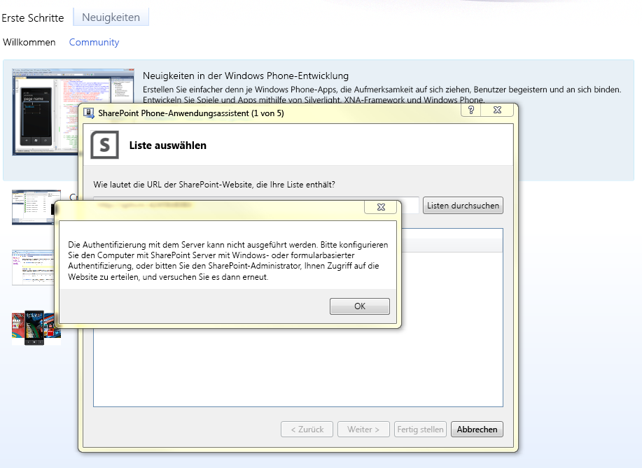
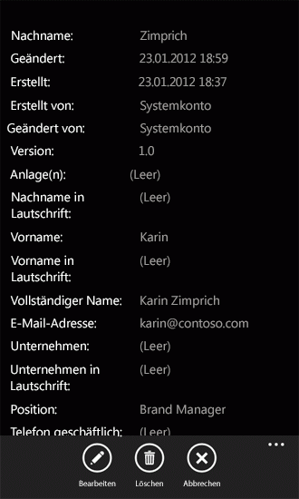

# Erstellen einer Windows Phone SharePoint-Listen-AppHow to: Create a Windows Phone SharePoint list app
Erstellen Sie eine Windows Phone-App in Visual Studio basierend auf der Vorlage "Windows Phone - SharePoint-Listenanwendung". Installieren von Windows Phone SharePoint SDK stellt zwei SharePoint-Anwendung für Windows Phone-Vorlagen zur Verfügung Sie in Visual Studio 2010 oder Visual Studio 2010 Express für Windows Phone. (Siehe  [Vorgehensweise: Einrichten einer Umgebung für die Entwicklung von mobilen Anwendungen für SharePoint](how-to-set-up-an-environment-for-developing-mobile-apps-for-sharepoint.md)). Mit der Vorlage Windows Phone SharePoint List Application können Sie die Schritte eines Assistenten zum Erstellen einer funktionalen Windows Phone-app ausführen, die zugreifen und Bearbeiten von Daten in einer SharePoint-Liste.Create a Windows Phone app in Visual Studio based on the Windows Phone SharePoint List Application template. Installing the Windows Phone SharePoint SDK makes two Windows Phone SharePoint Application templates available to you in Visual Studio 2010 or Visual Studio 2010 Express for Windows Phone. (See  [How to: Set up an environment for developing mobile apps for SharePoint](how-to-set-up-an-environment-for-developing-mobile-apps-for-sharepoint.md).) Using the Windows Phone SharePoint List Application template, you can follow the steps of a wizard to create a functional Windows Phone app that can access and manipulate data in a SharePoint list.

> **Wichtig:** Wenn Sie eine App für Windows Phone 8 entwickeln, müssen Sie Visual Studio Express 2012 anstelle von Visual Studio 2010 Express verwenden.**Important:** If you are developing an app for Windows Phone 8, you must use Visual Studio Express 2012 instead of Visual Studio 2010 Express. Mit Ausnahme der Entwicklungsumgebung gelten alle Informationen in diesem Artikel für das Erstellen von Apps sowohl auf Windows Phone 8 als auch auf Windows Phone 7.Except for the development environment, all information in this article applies to creating apps for both Windows Phone 8 and Windows Phone 7. Weitere Informationen finden Sie unter [Vorgehensweise: Einrichten einer Umgebung für die Entwicklung mobiler Apps für SharePoint](how-to-set-up-an-environment-for-developing-mobile-apps-for-sharepoint.md).> For more information, see  [How to: Set up an environment for developing mobile apps for SharePoint](how-to-set-up-an-environment-for-developing-mobile-apps-for-sharepoint.md). 

## Erstellen der Windows Phone-SharePoint-ListenanwendungCreate the Windows Phone SharePoint list application

In der Windows Phone-SharePoint-Listen-app können Sie die meisten der Listen zugreifen, die in SharePoint-Add-Ins verfügbar sind. Für die Zwecke dieser Beispiel-app für Windows Phone verwenden wir SharePoint-Listen mit Beispieldaten aus einem fiktiven Unternehmen mit dem Namen Contoso, Ltd. Für die Schritte zum Erstellen der ersten Iteration der in diesem SharePoint-Listen-app verwenden wir eine SharePoint-Liste Kontakte, die Mitglieder der ein Marketingteam bei Contoso, Informationen enthält, wie in Abbildung 1 dargestellt.In your Windows Phone SharePoint list app, you can access most of the lists that are available in SharePoint Add-ins. For the purposes of this sample Windows Phone app, we use SharePoint lists with sample data from a fictitious company named Contoso, Ltd. For the steps to create the first iteration of this SharePoint list app, we use a SharePoint Contacts list that contains information about members of a marketing team at Contoso, as shown in Figure 1.
  
    
    

**Abbildung 1. Kontakteliste für Contoso-Marketingteam****Figure 1. Contacts list for Contoso marketing team**

  
    
    

  
    
    

  
    
    

### Erstellen eine Windows Phone-SharePoint-Listen-appTo create a Windows Phone SharePoint list app

1. Starten Sie Visual Studio 2010 mit der Option **Als Administrator ausführen**.Start Visual Studio 2010 by using the **Run as Administrator** option.
    
  
2. Klicken Sie auf **Datei**, **Neu**, **Projekt**.Choose **File**, **New**, **Project**. 
    
    Das Dialogfeld **Neues Projekt** wird angezeigt.The **New Project** dialog box appears.
    
  
3. Klicken Sie im Dialogfeld **Neues Projekt** den Knoten **Visual c#**, und wählen Sie dann den Knoten **für Fenster Phone Silverlight**. (Stellen Sie sicher, dass die Zielversion .NET Framework 4 festgelegt ist.)In the **New Project** dialog box, expand the **Visual C#** node, and then choose the **Silverlight for Window Phone** node. (Ensure that the target .NET Framework version is set to 4.)
    
    > **Hinweis:** Die im Rahmen des Windows Phone SharePoint SDK installierten Vorlagen eignen sich nur für C#-Projekte.**Note:** The templates installed by the Windows Phone SharePoint SDK work only in C# projects. Für Visual Basic-Projekte sind die Vorlagen nicht verfügbar.The templates are not available for Visual Basic projects. 
4. Wählen Sie im Bereich **Vorlagen** die Vorlage **Windows Phone - SharePoint-Listenanwendung** aus, und geben Sie dem Projekt einen Namen, wie z. B. ContosoSPListApp.In the **Templates** pane, choose the **Windows Phone SharePoint List Application** template and give the project a name, such asContosoSPListApp.
    
  
5. Beim Ausführen des **Assistenten für SharePoint Phone-Anwendung**, kann der in Abbildung 2 dargestellten Fehler auftreten. Dieser Fehler tritt auf, weil das Konto der Entwickler verwendet wird, während der Ausführung des **Assistenten für SharePoint Phone-Anwendung** über unzureichende Berechtigungen verfügt.While running the **SharePoint Phone Application Wizard**, the error shown in Figure 2 can occur. This error occurs because the account the developer is using while running the **SharePoint Phone Application Wizard** has insufficient permissions.
    
   **Abbildung 2. SPList-Assistenten-Fehlermeldung****Figure 2. SPList wizard error message**

  

  
  

    Sie können diesen Fehler beheben, indem Sie dem Konto, mit dem der Entwickler den SPList-Assistenten ausführt, ausreichende Berechtigungen erteilen.You can resolve this error by giving sufficient privileges to the account with which the developer is running the SPList wizard. Führen Sie den **Splist-Assistenten** erneut aus, nachdem ausreichende Berechtigungen erteilt wurden.Rerun **Splist wizard** after sufficient rights are given.
    
  
6. Wählen Sie die Schaltfläche **OK**. Der **Assistent für SharePoint Phone-Anwendung** wird angezeigt. Sie verwenden dieses Assistenten zum Auswählen einer SharePoint-Liste und Konfigurieren der Eigenschaften von dieser Liste aus, um zu bestimmen, wie es in Ihrer Windows Phone-app angezeigt wird.Choose the **OK** button. The **SharePoint Phone Application Wizard** appears. You use this wizard to choose a SharePoint list and configure properties of that list to determine how it appears in your Windows Phone app.
    
  
7. Geben Sie die URL der SharePoint-Zielwebsite in Ihrem Netzwerk (d. h., eine lokale Installation von SharePoint Server ).Specify the URL of a target SharePoint site on your network (that is, an on-premises installation of SharePoint Server).
    
  
8. Wählen Sie **Listen Suchen**. Wenn das Konto, unter dem Sie Visual Studio ausführen, Zugriff auf die Website für die angegebene Ziel hat, zeigt der **Assistent für SharePoint Phone-Anwendung** die Listen, die auf dieser Website verfügbar sind.Choose **Find Lists**. If the account under which you are running Visual Studio has access to the specified target site, the **SharePoint Phone Application Wizard** displays the lists that are available on that site.
    
  
9. Wählen Sie eine der verfügbaren Listen, wie etwa eine Kontaktliste (mit Beispieldaten in einer angepassten Ansicht in Abbildung 1 dargestellt).Select one of the available lists, such as a Contacts list (shown with sample data in a customized view in Figure 1).
    
  
10. Wählen Sie auf **Weiter**. Der Assistent zeigt die verfügbaren Ansichten der ausgewählten Liste zugeordnet.Choose **Next**. The wizard displays the available views associated with the selected list.
    
    Die vom Assistenten angezeigten Ansichten sind diese Ansichten, die von Benutzern erstellte (oder durch SharePoint Server bereitgestellt) wurde und eine bestimmte Liste auf dem Server zugeordnet ist. Einige SharePoint-Listen haben nur eine Ansicht standardmäßig zugeordnet. Eine Kontaktliste ist standardmäßig eine Ansicht für alle Kontakte zugeordnet. Eine Ankündigungsliste ist standardmäßig eine Ansicht für alle Elemente zugeordnet. Eine Aufgabenlisten wird standardmäßig sechs Ansichten, einschließlich einer Ansicht alle Tasks und einer aktiven Vorgangsansicht zugeordnet. Für die einzelnen Ansichten, die Sie in dieser Phase im Assistenten zum auswählen ein Steuerelements **PivotItem** erstellt und mit dem **Pivot** -Steuerelement in der XAML-Code, der die Benutzeroberfläche der Windows Phone-app definiert hinzugefügt.The views displayed by the wizard are those views that have been created by users (or provisioned by SharePoint Server) and associated with a given list on the server. Some SharePoint lists have only one view associated with them by default. A Contacts list, by default, is associated with an All Contacts view. An Announcements list, by default, is associated with an All Items view. A Tasks lists, by default, is associated with six views, including an All Tasks view and an Active Tasks view. For each view that you select at this stage in the wizard, a **PivotItem** control is created and added to the **Pivot** control in the XAML that defines the UI of the Windows Phone app.
    
  
11. Aktivieren Sie das Kontrollkästchen der Ansichten, die in der Windows Phone-App enthalten sein sollen.Select the check box next to each view you want to include in your Windows Phone app.
    
  
12. Wählen Sie auf **Weiter**. Der Assistent zeigt die verfügbaren Aktionen für die ausgewählte Liste in Ihrer Windows Phone-app.Choose **Next**. The wizard displays the available actions for the selected list in your Windows Phone app.
    
    Die Auswahlmöglichkeiten sind **neu**, **Anzeigen**, **Bearbeiten** und **Löschen**. Wenn Sie möchten möglicherweise bearbeiten oder Löschen von Listenelementen in Ihrer app, müssen Sie den **Display**-Vorgang in dieser Phase im Assistenten auswählen. (Die Kontrollkästchen für die Vorgänge **Bearbeiten** und **Löschen von** sind deaktiviert, wenn der Vorgang **Anzeigen** ausgewählt ist.)The choices are **New**, **Display**, **Edit**, and **Delete**. If you want to be able to edit or delete list items in your app, you must choose the **Display** operation at this stage in the wizard. (The check boxes for the **Edit** and **Delete** operations are disabled unless the **Display** operation is selected.)
    
  
13. Aktivieren Sie das Kontrollkästchen neben jedem gewünschte Aktion haben verfügbar für die ausgewählte Liste in Ihrer Windows Phone-app.Select the check box next to each action you want to have available for the selected list in your Windows Phone app.
    
  
14. Wählen Sie **Weiter**. Der Assistent zeigt die Felder an, die mit der ausgewählten Liste auf der SharePoint-Website verknüpft sind.Choose **Next**. The wizard displays the fields associated with the selected list on the SharePoint site.
    
    > **Hinweis:** Benutzerdefinierte Felder können im Assistenten für SharePoint-Listen für mobile Geräte nicht ausgewählt werden.**Note:** A custom field will not be available to select from the SharePoint List wizard for mobile devices. Sie können jedoch benutzerdefinierten Code zum Zugriff auf jedes beliebige benutzerdefinierte Feld schreiben.However, you can write custom code to access any custom field. Ein Feld kann nicht mit seinem Inhaltstyp verknüpft werden.A field cannot be associated with its content type. Aber wenn für die Liste mehrere Inhaltstypen aktiviert sind, können alle Felder von Entwicklern in ihren Phone-Apps verwendet werden.However if multiple content types are enabled for the list, all the fields will be available for developers to consume in their phone apps. 
15. Aktivieren Sie das Kontrollkästchen neben jedem Feld, das in der Liste enthalten sein, wie es in Ihrer Windows Phone-app angezeigt werden sollen.Select the check box next to each field you want to include in the list as it will appear in your Windows Phone app.
    
    > **Hinweis:** Listenfelder, die in SharePoint Server als Informationen erfordernd vorgesehen sind, sind bereits ausgewählt. Sie können nicht im Assistenten gelöscht werden.**Note:** List fields that are designated in SharePoint Server as requiring information are selected already; they can't be cleared in the wizard. 
16. Wählen Sie **Weiter**. Der Assistent bietet Ihnen die Möglichkeit, die Reihenfolge der Felder anzugeben, die Sie im vorherigen Schritt ausgewählt haben.Choose **Next**. The wizard gives you the opportunity to order the fields you selected in the previous step.
    
  
17. Sortieren Sie die Felder gemäß Ihren Anforderungen. Wählen Sie hierzu ein Feld aus, und verschieben Sie es mithilfe des Aufwärts- oder Abwärtspfeils nach oben bzw. nach unten.Order the fields according to your needs by selecting individual fields and moving them higher or lower in the order by choosing the up or down arrows.
    
  
18. Klicken Sie auf **Fertig stellen**. Von Visual Studio werden die erforderlichen Dateien für das Projekt erstellt, und die Datei "List.xaml" wird zur Bearbeitung geöffnet.Choose **Finish**. Visual Studio creates the necessary files for the project and opens the List.xaml file for editing.
    
  

## Führen Sie mithilfe des Assistenten für SharePoint Phone-Anwendung generierte Windows Phone-appRun the Windows Phone app generated by the SharePoint Phone Application Wizard

Das Projekt mit dem **Assistenten für SharePoint Phone-Anwendung** generiert kann erstellt werden, wie es ist, erstellen eine einfache, aber funktionale Windows Phone SharePoint-Listen-app. Wir können ändern und Entwickeln der app weiter, aber, jetzt ein Benutzer können Tippen Sie auf (oder, klicken Sie in der Windows Phone-Emulator auf) ein bestimmtes Listenelement und die app zeigt alle Felder zugeordnet, dass das Element (diese Felder, die Sie im Assistenten zum Einschließen in die app ausgewählt haben). Ein Benutzer kann auch neue Listenelemente hinzufügen, Löschen von Listenelementen und die Feldwerte für Listenelemente bearbeiten. Mehrere Benutzer anmelden in einer einzelnen app wird nicht unterstützt. Entwickler kann jedoch Code schreiben, die den aktuellen Benutzer abmeldet, wenn ein anderer Benutzer, zur Anmeldung bei der gleichen mobile app versucht.The project generated by the **SharePoint Phone Application Wizard** can be built as it is to create a simple but functional Windows Phone SharePoint list app. We can modify and develop the app further, but, for now, a user can tap (or, in the Windows Phone Emulator, click) a given list item and the app displays all the fields associated with that item (those fields that you selected in the wizard to include in the app). A user can also add new list items, delete list items, and edit the field values for list items. Multiple-user logon in a single app is not supported. However, a developer can write code that logs off the current user when another user tries to log on to the same mobile app.
  
    
    
Das Deployment-Ziel für die Lösung wird standardmäßig auf Windows Phone-Emulator festgelegt. Sie können das Projekt in Visual Studio ausführen, unverändert (durch Drücken von F5, um das Projekt im Zusammenhang mit den Debugger starten oder durch Drücken von STRG + F5, um das Projekt ohne Debuggen starten). Die Windows Phone-Emulator neu gestartet wird, das Betriebssystem Windows Phone wird geladen und Ihre app für den Emulator bereitgestellt und gestartet wird. Wenn Sie mit dem Code starten, während sie vom Assistenten erstellt werden, wenn Ihre SharePoint-Listen-app im Emulator ausgeführt wird, werden Sie für die Anmeldeinformationen für die angegebene SharePoint-Liste auf die Zielwebsite gefragt. Geben Sie die Anmeldeinformationen für ein Konto, das über ausreichende Berechtigungen zum Zugriff auf die Liste, und wählen Sie **Anmelden** im Emulator hat. Die Hauptseite der Windows Phone-app (definiert durch die List.xaml-Datei in das Projekt) wird im Emulator angezeigt. Je nach den Feldern, die Sie ausgewählt haben und den Auftrag, den Sie für diese Felder in den vorherigen Schritten angegeben, sollte die Elemente aus der angegebenen Liste angezeigt werden. Basierend auf den Daten in der Liste, die durch die in Abbildung 1 dargestellt, wird eine Liste von Elementen im Emulator wie in Abbildung 3 dargestellt angezeigt werden.The deployment target for the solution is set to Windows Phone Emulator by default. You can run the project in Visual Studio as it is (either by pressing F5 to start the project in the context of the debugger or by pressing CTRL+F5 to start the project without debugging). The Windows Phone Emulator is launched, the Windows Phone operating system is loaded, and your app is deployed to the emulator and started. If you start with the code as it is generated by the wizard, when your SharePoint list app runs in the emulator, you're asked for credentials for the specified SharePoint list on the target site. Provide the credentials for an account that has sufficient permissions to access the list and choose **Log On** in the emulator. The main page of the Windows Phone app (defined by the List.xaml file in the project) is displayed in the emulator. Depending on the fields you chose and the order you specified for those fields in the previous steps, you should see items from the specified list. Based on the data in the list represented by Figure 1, you would see a list of items in the emulator as shown in Figure 3.
  
    
    

**Abbildung 3. SharePoint-Listenelemente in einer Windows Phone-app****Figure 3. SharePoint list items in a Windows Phone app**

  
    
    

  
    
    

  
    
    
Während der Ausführung einer Windows Phone-app, kann der in Abbildung 4 dargestellte Authentifizierungsfehler auftreten. In diesem Fall, da die mobile SharePoint-app **Standardauthentifizierung Formular** benötigt; Dies ist nicht standardmäßig aktiviert.While running a Windows Phone app, the authentication error shown in Figure 4 can occur. This happens because the SharePoint mobile app requires **Basic Form Authentication**; this isn't enabled by default.
  
    
    

**Abbildung 4. Authentifizierungsfehler für Windows Phone-app****Figure 4. Windows Phone app authentication error**

  
    
    

  
    
    

  
    
    
Sie können diesen Fehler beheben, indem-Zentraladministration **grundlegende Formularauthentifizierung** auswählen.You can resolve this error by choosing **Basic form authentication** from Central Administration.
  
    
    

### So aktivieren Sie grundlegende FormularauthentifizierungTo enable Basic form authentication

1. Navigieren Sie zur **Zentraladministration**; Stellen Sie sicher, dass Sie Administratorrechte auf dem Server verfügen.Navigate to **Central Administration**; ensure you have admin rights on server.
    
  
2. Wählen Sie unter **Verwaltung von** **Webanwendungen verwalten**.Choose **Manage Web Applications** under **Application Management**.
    
  
3. Wählen Sie die Webanwendung (auf dem der SharePoint-Website, die Sie von der mobilen Anwendung zugreifen müssen).Choose your web application (on which you have your SharePoint site, which you are accessing from your mobile app).
    
  
4. Wählen Sie im Menüband **Authentifizierungsanbieter**.Choose **Authentication Providers** from the ribbon.
    
  
5. Wählen Sie im Menüband **Authentifizierungsanbieter**.Choose **Authentication Providers** from the ribbon.
    
  
6. Wählen Sie im Dialogfeld **Authentifizierungsanbieter** **Standard** Authentifizierung bearbeiten.In the **Authentication Provider** dialog box, choose **Default** to Edit Authentication.
    
  
7. Klicken Sie im Modell **Authentifizierung bearbeiten** wählen Sie unter **Claims Authentication** Typen **Standardauthentifizierung**.In the **Edit Authentication** model window, choose **Basic Authentication** under **Claims Authentication** types.
    
  
Wenn Sie Ihre Windows Phone-app auf den Daten aus der Kontaktliste basierend, wie in Abbildung 1 dargestellt, können Sie ein bestimmtes Listenelement auswählen und die app stellt eine Seite mit einer Ansicht des Elements (durch DisplayForm.xaml im Projekt definiert) alle für das Element verfügbaren Felder in der app, wie in Abbildung 5 angezeigt. (In diesem Beispiel alle Felder, die mit einer SharePoint-Liste Kontakte verknüpft sind im Application-Assistent für SharePoint-Telefon ausgewählt wurden und wurde die Standardreihenfolge dieser Felder beibehalten.)If you based your Windows Phone app on the data from a Contacts list, as shown in Figure 1, you can choose a particular list item and the app presents a page with a view of the item (defined by DisplayForm.xaml in the project) showing all the fields available for the item in the app, as in Figure 5. (For this example, all the fields associated with a SharePoint Contacts list were selected in the SharePoint Phone Application Wizard and the default order of those fields was retained.)
  
    
    

**Abbildung 5. DisplayForm-Ansicht eines kontaktlistenelements****Figure 5. DisplayForm view of a Contacts list item**

  
    
    

  
    
    

  
    
    
Beachten Sie die **Bearbeiten** und **Löschen von** Schaltflächen auf der Anwendungsleiste auf dieser Seite der app. Diese Vorgänge sind für Sie von Methoden in Microsoft.SharePoint.Phone.Application.dll implementiert (die eine der Bibliotheken, die von Windows Phone SharePoint SDK installiert ist). Wenn Sie die Schaltfläche **Bearbeiten** geklickt haben, wird ein Windows Phone- **Page** -Steuerelement (d. h., ein Objekt aus einer Klasse, die von der **Microsoft.Phone.Controls.PhoneApplicationPage** -Klasse erbt instanziiert) angezeigt. Die zugrunde liegende **UpdateItem** -Methode der **EditItemViewModelBase** -Klasse wird ausgeführt, wenn Sie die Felder bearbeiten, und wählen Sie die Schaltfläche **Absenden** auf dieser Seite in der app, (, die schließlich führt die **Update** -Methode eines **ListItem** -Objekts aus der SharePoint Silverlight-Clientobjektmodell) Ihre Änderungen an der SharePoint-Liste gespeichert.Notice the **Edit** and **Delete** buttons on the Application Bar in this page of the app. These operations are implemented for you by methods in Microsoft.SharePoint.Phone.Application.dll (which is one of the libraries installed by the Windows Phone SharePoint SDK). If you choose the **Edit** button, a Windows Phone **Page** control (that is, an object instantiated from a class that inherits from the **Microsoft.Phone.Controls.PhoneApplicationPage** class) is displayed. If you edit any of the fields and choose the **Submit** button on that page in the app, the underlying **UpdateItem** method of the **EditItemViewModelBase** class is executed (which, ultimately, executes the **Update** method of a **ListItem** object from the SharePoint Silverlight client object model) to save your changes to the SharePoint list.
  
    
    

## Zusätzliche RessourcenAdditional resources

-  [Erstellen von Windows Phone-Apps, die auf SharePoint zugreifenBuild Windows Phone apps that access SharePoint](build-windows-phone-apps-that-access-sharepoint.md)
    
  
-  [Vorgehensweise: Einrichten einer Umgebung für die Entwicklung von mobilen Anwendungen für SharePointHow to: Set up an environment for developing mobile apps for SharePoint](how-to-set-up-an-environment-for-developing-mobile-apps-for-sharepoint.md)
    
  
-  [Windows Phone SDK 8.0Windows Phone SDK 8.0](http://www.microsoft.com/en-us/download/details.aspx?id=35471)
    
  
-  [Microsoft SharePoint SDK für Windows Phone 8Microsoft SharePoint SDK for Windows Phone 8](http://www.microsoft.com/en-us/download/details.aspx?id=36818)
    
  
-  [Windows Phone SDK 7.1Windows Phone SDK 7.1](http://www.microsoft.com/en-us/download/details.aspx?id=27570)
    
  
-  [Microsoft SharePoint SDK für Windows Phone 7.1Microsoft SharePoint SDK for Windows Phone 7.1](http://www.microsoft.com/en-us/download/details.aspx?id=30476)
    
  

