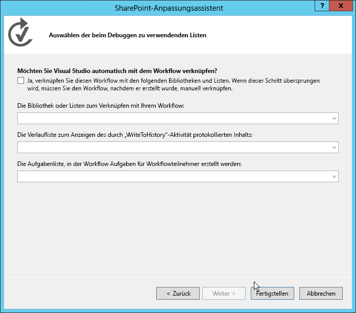
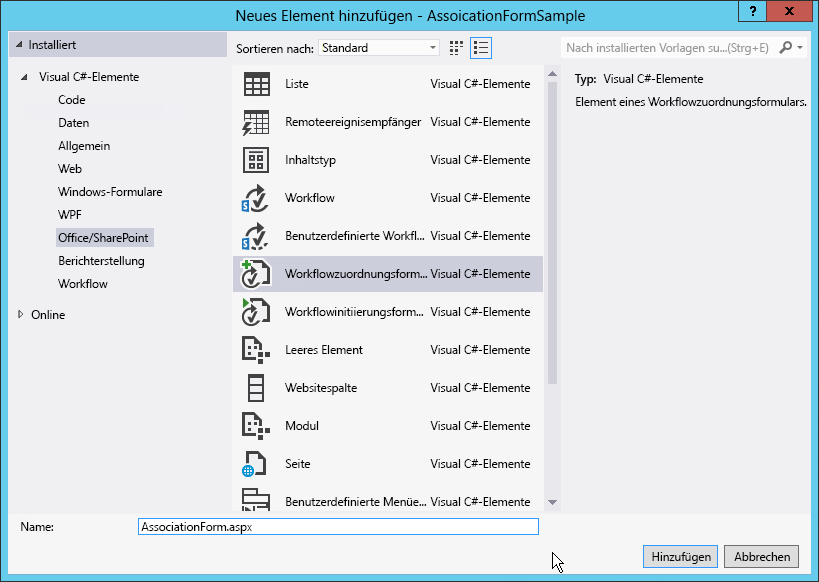
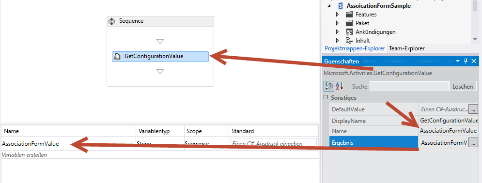
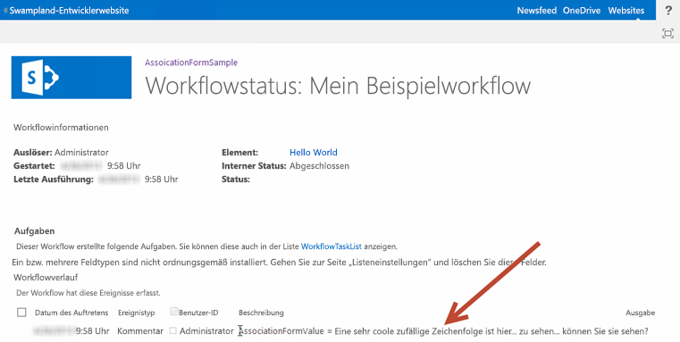
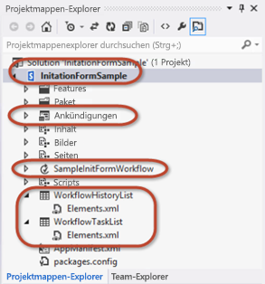
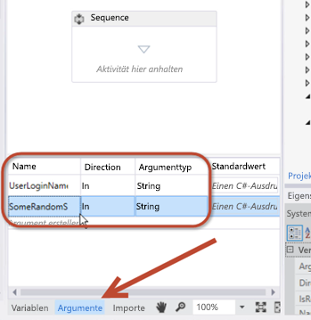
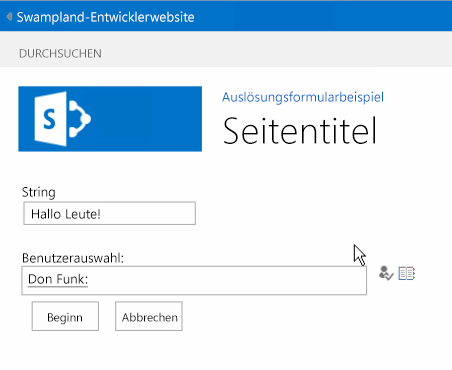

# <a name="how-to-create-custom-sharepoint-workflow-forms-with-visual-studio-2012"></a><span data-ttu-id="a88be-102">Erstellen von benutzerdefinierten SharePoint-Workflowformularen mit Visual Studio 2012</span><span class="sxs-lookup"><span data-stu-id="a88be-102">How to: Create Custom SharePoint Server 2013 Workflow Forms with Visual Studio 2012</span></span>
<span data-ttu-id="a88be-103">Stellt Workflowformulare in SharePoint vor.</span><span class="sxs-lookup"><span data-stu-id="a88be-103">Changes to workflow forms in SharePoint</span></span> <span data-ttu-id="a88be-104">In diesem Artikel werden SharePoint mit dem öffentlichen Update vom März 2013 und Office Developer Tools für Visual Studio 2012 verwendet.</span><span class="sxs-lookup"><span data-stu-id="a88be-104">This article uses SharePoint with the March 2013 Public Update applied and Office Developer tools for Visual Studio 2012.</span></span> <span data-ttu-id="a88be-105">Alle Informationen in diesem Artikel beziehen sich sowohl auf lokale Bereitstellungen von SharePoint als auch auf Office 365.</span><span class="sxs-lookup"><span data-stu-id="a88be-105">Everything in this article applies to both SharePoint on-premises deployments as well as Office 365.</span></span>
 <span data-ttu-id="a88be-106">**Bereitgestellt von:** [Andrew Connell](http://social.msdn.microsoft.com/profile/andrew%20connell%20%5bmvp%5d/), [www.AndrewConnell.com](http://www.andrewconnell.com)</span><span class="sxs-lookup"><span data-stu-id="a88be-106">**Provided by:** [Andrew Connell](http://social.msdn.microsoft.com/profile/andrew%20connell%20%5bmvp%5d/),  [www.AndrewConnell.com](http://www.andrewconnell.com)</span></span>
  
    
    

<span data-ttu-id="a88be-p102">Seit der Einführung von Microsoft SharePoint 2007 unterstützt die SharePoint-Plattform Workflows zur Automatisierung von Geschäftsprozessen. Die SharePoint-Workflowplattform ist auf Windows Workflow Foundation aufgebaut, einem Teil des .NET Framework. Während die Workflowumgebung (Workflow Foundation) zahlreiche Funktionen zum Erstellen benutzerdefinierter Workflows und Verwalten automatisierter Geschäftsprozesse bereitstellt, ergänzt SharePoint darüber hinaus die Endbenutzerintegration. Diese Integration wird in zwei Teilen implementiert:</span><span class="sxs-lookup"><span data-stu-id="a88be-p102">Since the release of Microsoft SharePoint 2007, the SharePoint platform has supported using workflows to automate business processes. The SharePoint workflow platform is built on the Windows Workflow Foundation, which is part of the .NET Framework. While the Workflow Foundation provides many capabilities for authoring custom workflows and managing automated business processes, SharePoint also adds end-user integration. This integration is implemented in two parts:</span></span> 
- <span data-ttu-id="a88be-111">Benutzern und Gruppen zugewiesene **Aufgaben**, die durch die Workflows erstellt und überwacht werden können.</span><span class="sxs-lookup"><span data-stu-id="a88be-111">**Tasks** assigned to users and groups that can be created and monitored by the workflows.</span></span>
    
  
- <span data-ttu-id="a88be-112">**Formulare**, in denen Informationen von Benutzern erfasst werden, wenn Workflows einem Inhaltstyp (zum Beispiel einer Website, Liste oder Bibliothek) zugeordnet werden oder wenn ein Workflow gestartet wird.</span><span class="sxs-lookup"><span data-stu-id="a88be-112">**Forms** that collect information from users when workflows are associated with a type of content (for example, a site, list, or library) or when a workflow is started.</span></span>
    
  

## <a name="workflow-forms-in-sharepoint-2007-and-sharepoint-2010"></a><span data-ttu-id="a88be-113">Workflowformulare in SharePoint 2007 und SharePoint 2010</span><span class="sxs-lookup"><span data-stu-id="a88be-113">Workflow forms in SharePoint 2007 and SharePoint 2010</span></span>
<span data-ttu-id="a88be-114"><a name="sec1"> </a></span><span class="sxs-lookup"><span data-stu-id="a88be-114"></span></span>

<span data-ttu-id="a88be-p103">Bei der Implementierung von Workflows in SharePoint 2007 und SharePoint 2010 wurden von Version zu Version stetig Verbesserungen vorgenommen. Insbesondere hat Microsoft in SharePoint 2010 neue Funktionen hinzugefügt, wie beispielsweise die Möglichkeit, Workflows mit Websites zu verknüpfen. Darüber hinaus wurden die Tools zum Erstellen von Workflows, SharePoint Designer 2010 und Visual Studio 2010, gegenüber ihren Vorgängerversionen verbessert. Die Implementierung von Workflowaufgaben und Workflowformularen ist in SharePoint jedoch weitestgehend unverändert geblieben.</span><span class="sxs-lookup"><span data-stu-id="a88be-p103">The implementation of workflows in SharePoint 2007 and SharePoint 2010 provided steady improvements from version to version. In particular, Microsoft added new functionality in SharePoint 2010, such as the ability to associate workflows with sites. It also improved the workflow authoring tools, SharePoint Designer 2010 and Visual Studio 2010, over their predecessors. However, in SharePoint, the implementation of workflow tasks and workflow forms remained largely unchanged.</span></span>
  
    
    
<span data-ttu-id="a88be-119">Vor SharePoint standen Entwicklern zwei Optionen zum Erstellen von Workflowformularen zur Verfügung.</span><span class="sxs-lookup"><span data-stu-id="a88be-119">Prior to SharePoint, developers were presented with two options for creating workflow forms.</span></span> <span data-ttu-id="a88be-120">In SharePoint 2007 wurden InfoPath-Formulare und ASP.NET Web Forms gleichermaßen empfohlen.</span><span class="sxs-lookup"><span data-stu-id="a88be-120">In SharePoint 2007, InfoPath forms and ASP.NET Web Forms were both recommended equally.</span></span> <span data-ttu-id="a88be-121">Beide haben Vorteile und Nachteile.</span><span class="sxs-lookup"><span data-stu-id="a88be-121">Each had advantages and disadvantages.</span></span> <span data-ttu-id="a88be-122">In SharePoint 2010 wurde Entwicklern empfohlen, ASP.NET Web Forms zu verwenden, da diese durch die SharePoint-Entwicklertools in Visual Studio 2010 mithilfe der Projektelementvorlagen für die Zuordnung und den Initiierungsworkflow erstellt wurden, die Implementierung war jedoch der in SharePoint 2007 sehr ähnlich.</span><span class="sxs-lookup"><span data-stu-id="a88be-122">Prior to SharePoint Server 2013, developers were presented with two options for creating workflow forms. In SharePoint 2007, InfoPath forms and ASP.NET Web Forms were both recommended equally. Each had advantages and disadvantages. In SharePoint 2010, developers were encouraged to use ASP.NET Web Forms as that is what the SharePoint developer tools in Visual Studio 2010 created using the association and initiation workflow form project item templates, but the implementation was very similar to that in SharePoint 2007.</span></span>
  
    
    

## <a name="changes-to-workflow-forms-in-sharepoint"></a><span data-ttu-id="a88be-123">Änderungen an Workflowformularen in SharePoint</span><span class="sxs-lookup"><span data-stu-id="a88be-123">Changes to workflow forms in SharePoint</span></span>
<span data-ttu-id="a88be-124"><a name="sec2"> </a></span><span class="sxs-lookup"><span data-stu-id="a88be-124"></span></span>

<span data-ttu-id="a88be-125">In SharePoint wurde eine neue Workflowarchitektur und Plattform eingeführt, die einige grundlegende Änderungen an der Denkweise über SharePoint darstellt.</span><span class="sxs-lookup"><span data-stu-id="a88be-125">SharePoint introduced a new workflow architecture and platform that reflects some fundamental shifts in the thinking about SharePoint.</span></span> <span data-ttu-id="a88be-126">Die wichtigste Änderung besteht darin, dass Workflows in SharePoint nicht mehr vom SharePoint-Laufzeitmodul verwaltet und ausgeführt werden.</span><span class="sxs-lookup"><span data-stu-id="a88be-126">The primary change is that workflows in SharePoint are no longer managed and executed by the SharePoint runtime engine.</span></span> <span data-ttu-id="a88be-127">SharePoint nutzt stattdessen eine neue Komponente mit dem Namen Workflow-Manager, der die Windows Workflow Foundation-Laufzeit sowie erforderliche Dienste für Workflow Foundation hostet.</span><span class="sxs-lookup"><span data-stu-id="a88be-127">Instead, SharePoint utilizes a new component called Workflow Manager, which hosts the Windows Workflow Foundation runtime and necessary services required by Workflow Foundation.</span></span> <span data-ttu-id="a88be-128">Der entscheidende Punkt ist, dass der Workflow-Manager außerhalb von SharePoint ausgeführt wird.</span><span class="sxs-lookup"><span data-stu-id="a88be-128">The important point is that Workflow Manager runs outside of SharePoint.</span></span> <span data-ttu-id="a88be-129">Wenn ein Workflow veröffentlicht wird oder eine neue Instanz eines veröffentlichten Workflows gestartet wird, benachrichtigt SharePoint den Workflow-Manager, der wiederum die Workflowabschnitte verarbeitet.</span><span class="sxs-lookup"><span data-stu-id="a88be-129">When a workflow is published, or a new instance of a published workflow is started, SharePoint notifies Workflow Manager, which in turn processes the workflow episodes.</span></span> <span data-ttu-id="a88be-130">Wenn der Workflow Zugriff auf Informationen in SharePoint benötigt, z. B. Listenelementeigenschaften oder Benutzereigenschaften, authentifiziert er den Benutzer mit dem OAuth-Autorisierungsmodell und kommuniziert über die REST-APIs, die in der SharePoint-Version eingeführt wurden.</span><span class="sxs-lookup"><span data-stu-id="a88be-130">When the workflow needs to access information in SharePoint, such as list item properties or user properties, it authenticates the user with the OAuth authorization model and communicates over the REST APIs that were introduced in the SharePoint release.</span></span>
  
    
    
<span data-ttu-id="a88be-131">Außerdem wurde in der SharePoint-Version die allgemeine Richtung für Anpassungen auf der SharePoint-Plattform geändert, obwohl diese Änderung tatsächlich bei SharePoint 2010 und Sandkastenlösungen begann.</span><span class="sxs-lookup"><span data-stu-id="a88be-131">The overall direction for doing customizations on the SharePoint platform also changed in the SharePoint release, although this change actually started with SharePoint 2010 and sandboxed solutions.</span></span> <span data-ttu-id="a88be-132">In SharePoint führte Microsoft Features ein, durch die Anpassungen weg vom SharePoint-Server und hin zum Clientbrowser oder zu anderen externen Ressourcen verschoben wurden.</span><span class="sxs-lookup"><span data-stu-id="a88be-132">In SharePoint, Microsoft introduced features that moved customizations away from SharePoint server and moved them to the client browser or to other external resources.</span></span> <span data-ttu-id="a88be-133">Diese Features enthalten das neue SharePoint-App-Modell, Unterstützung zum Zuweisen einer Identität für Apps und die Authentifizierung mithilfe des OAuth-Autorisierungsmodells sowie Verbesserungen am clientseitigen Objektmodell (CSOM) und den REST-APIs.</span><span class="sxs-lookup"><span data-stu-id="a88be-133">These features include the new SharePoint App Model, support for assigning apps an identity, authentication using the OAuth authorization model, and improvements to the client-side object model (CSOM) and REST APIs.</span></span>
  
    
    
<span data-ttu-id="a88be-134">Welche Auswirkungen hat dies auf Workflowformulare?</span><span class="sxs-lookup"><span data-stu-id="a88be-134">How does this affect workflow forms?</span></span> <span data-ttu-id="a88be-135">Denken Sie daran, dass Entwicklern in SharePoint 2010 von Microsoft empfohlen wurde, ASP.NET Web Forms beim Erstellen von Formularen in Workflows zu verwenden, die mit Visual Studio erstellt wurden.</span><span class="sxs-lookup"><span data-stu-id="a88be-135">Recall that starting in SharePoint 2010 Microsoft began encouraging developers to use ASP.NET Web Forms when creating forms in workflows authored using Visual Studio.</span></span> <span data-ttu-id="a88be-136">Dieser Ansatz erfordert natürlich serverseitigen Code zum Verarbeiten des Formulars und zum Behandeln der Kommunikation zwischen dem Formular und dem Workflowmodul.</span><span class="sxs-lookup"><span data-stu-id="a88be-136">Of course, this approach requires server-side code to process the form and handled communication between the form and the workflow engine.</span></span> <span data-ttu-id="a88be-137">In SharePoint ist dies jedoch nur in der an Lösungen orientierten Entwicklung möglich (d. h. die Bereitstellung von WSP-Paketen).</span><span class="sxs-lookup"><span data-stu-id="a88be-137">However, in SharePoint, this is only possible in the solution-style development (that is, deployment of *.WSP packages).</span></span> <span data-ttu-id="a88be-138">Das neue in SharePoint eingeführte SharePoint-App-Modell lässt die Ausführung von serverseitigem Code im SharePoint-Prozess nicht zu.</span><span class="sxs-lookup"><span data-stu-id="a88be-138">The new SharePoint App Model introduced in SharePoint does not allow server-side code to run in the SharePoint process.</span></span>
  
    
    
<span data-ttu-id="a88be-139">Um diese Einschränkung zu vermeiden, hat Microsoft CSOM um eine API für die Interaktion mit dem Workflowmodul erweitert.</span><span class="sxs-lookup"><span data-stu-id="a88be-139">To alleviate this limitation, Microsoft extended CSOM to include an API for interacting with the workflow engine.</span></span> <span data-ttu-id="a88be-140">Um eine SharePoint-Farm mit der Workflow-Manager-Farm zu verbinden, müssen Sie den Workflow-Manager-Client auf den SharePoint-Servern installieren.</span><span class="sxs-lookup"><span data-stu-id="a88be-140">To connect a SharePoint farm to the Workflow Manager farm, you must install the Workflow Manager Client on the SharePoint servers.</span></span> <span data-ttu-id="a88be-141">Diese Komponente dient als Proxy, den SharePoint verwendet, um mit der Workflow-Manager-Farm zu kommunizieren.</span><span class="sxs-lookup"><span data-stu-id="a88be-141">This component serves as a proxy that SharePoint uses to communicate with the Workflow Manager farm.</span></span> <span data-ttu-id="a88be-142">Die CSOM-API der Workflowdienste ist effektiv die clientseitige Komponente, die Sie für die Interaktion mit dem neuen Workflowmodul verwenden.</span><span class="sxs-lookup"><span data-stu-id="a88be-142">The Workflow Services CSOM API is effectively the client-side component that you use to interact with the new workflow engine.</span></span> <span data-ttu-id="a88be-143">Weitere Informationen zum clientseitigen Objektmodell für SharePoint-Workflowdienste finden Sie unter [Arbeiten mit dem clientseitigen Objektmodell für SharePoint-Workflowdienste](working-with-the-sharepoint-workflow-services-client-side-object-model.md).</span><span class="sxs-lookup"><span data-stu-id="a88be-143">For more information about SharePoint Workflow Services CSOM, see  [Working with the SharePoint Workflow Services Client Side Object Model](working-with-the-sharepoint-workflow-services-client-side-object-model.md).</span></span>
  
    
    
<span data-ttu-id="a88be-144">Inwiefern profitieren SharePoint-Workflowformulare davon?</span><span class="sxs-lookup"><span data-stu-id="a88be-144">How, then, does this benefit SharePoint workflow forms?</span></span> <span data-ttu-id="a88be-145">Nun, beim Erstellen von SharePoint-Workflows mithilfe von Visual Studio 2012 erstellen Sie Workflowformulare mithilfe von ASP.NET Web Forms. </span><span class="sxs-lookup"><span data-stu-id="a88be-145">Well, when authoring SharePoint workflows using Visual Studio 2012, you create workflow forms using ASP.NET Web Forms.</span></span> <span data-ttu-id="a88be-146">Sie können diese Formulare als SharePoint-Lösung oder (und dies ist das Entscheidende daran) in bereitstellen.</span><span class="sxs-lookup"><span data-stu-id="a88be-146">You can deploy these forms as a SharePoint solution or (and this is the important part) within .</span></span> <span data-ttu-id="a88be-147">Damit erhalten Sie Zugriff auf die Serversteuerelemente, die bereits auf dem Server bereitgestellt sind, z. B. die ASP.NET-Websteuerelemente und andere hilfreiche (und manchmal auch erforderliche) SharePoint-Steuerelemente.</span><span class="sxs-lookup"><span data-stu-id="a88be-147">This gives you access to all the server controls that are already deployed to the server, such as the ASP.NET Web Controls and other useful (and required at times) SharePoint controls.</span></span> <span data-ttu-id="a88be-148">Sie können auch das neue clientseitige Objektmodell für Workflowdienste verwenden, um alle erforderlichen Aufgaben aus Zuordnungs- und Initiierungsformularen auszuführen, einschließlich, jedoch nicht beschränkt auf Folgendes:</span><span class="sxs-lookup"><span data-stu-id="a88be-148">You can also use the new Workflow Services CSOM to perform all necessary tasks from association and initiation forms including, but not limited to, the following:</span></span>
  
    
    

- <span data-ttu-id="a88be-149">Erstellen von Listen für Workflowaufgaben und Verlaufslisten</span><span class="sxs-lookup"><span data-stu-id="a88be-149">Creating workflow task and history lists</span></span>
    
  
- <span data-ttu-id="a88be-150">Erstellen einer neuen Workflowzuordnung auf einer Website, in einer Liste oder einer Dokumentbibliothek</span><span class="sxs-lookup"><span data-stu-id="a88be-150">Creating a new workflow association on a site, list, or document library</span></span>
    
  
- <span data-ttu-id="a88be-151">Starten einer neuen Instanz einer vorhandenen Workflowzuordnung</span><span class="sxs-lookup"><span data-stu-id="a88be-151">Starting a new instance of an existing workflow association</span></span>
    
  
<span data-ttu-id="a88be-152">Das Workflowdienste-CSOM ist äußerst stabil und lässt Ihnen eine Menge Raum für Innovationen in Workflows - im Browser und auf einem Remotecomputer.</span><span class="sxs-lookup"><span data-stu-id="a88be-152">The Workflow Services CSOM is very robust and gives you a lot of room for innovation in workflows—all from the browser or a remote machine.</span></span>
  
    
    

## <a name="workflow-forms-available-in-sharepoint-sever-2013"></a><span data-ttu-id="a88be-153">In SharePoint Server 2013 verfügbare Workflowformulare</span><span class="sxs-lookup"><span data-stu-id="a88be-153">Workflow forms available in SharePoint Sever 2013</span></span>
<span data-ttu-id="a88be-154"><a name="sec3"> </a></span><span class="sxs-lookup"><span data-stu-id="a88be-154"></span></span>

<span data-ttu-id="a88be-155">Vor der Veröffentlichung von SharePoint gab es drei Typen von benutzerdefinierten Workflowformularen, die erstellt werden konnten: **Initiation**-, **Association**- und **Task Edit**-Formulare.</span><span class="sxs-lookup"><span data-stu-id="a88be-155">Prior the release of SharePoint, there were three types of custom workflow forms you could create: **Initiation**, **Association**, and **Task Edit** forms.</span></span> <span data-ttu-id="a88be-156">Von diesen drei Formulartypen haben Task Edit-Formulare als benutzerdefinierte Formularlösung an Bedeutung verloren.</span><span class="sxs-lookup"><span data-stu-id="a88be-156">Of these three types of forms, task edit forms have been de-emphasized as a custom forms solution.</span></span> <span data-ttu-id="a88be-157">Die geringere Bedeutung von Task Edit-Formularen begann in SharePoint 2010, da es den SharePoint-Entwicklungstools in Visual Studio 2010 an einem Projektelement für Aufgabenformulare fehlte und stattdessen die standardmäßige Listenanzeige und die Bearbeitungsformulare zum Rendern von Aufgaben verwendet wurden.</span><span class="sxs-lookup"><span data-stu-id="a88be-157">Prior the release of SharePoint Server 2013, there were three types of custom workflow forms you could create: Initiation, Association, and Task Edit forms. Of these three types of forms, task edit forms have been de-emphasized as a custom forms solution. The de-emphasis of Task Edit forms started with SharePoint 2010 because the Visual Studio 2010 SharePoint development tools lacked a project item for task forms, relying instead on the standard list display and edit forms to render tasks.</span></span>
  
    
    
<span data-ttu-id="a88be-158">Mit SharePoint wurde die Arbeitsweise mit Workflowaufgaben dahingehend verbessert, dass Sie benutzerdefinierte Ergebnisschaltflächen für bestimmte Szenarios erstellen können.</span><span class="sxs-lookup"><span data-stu-id="a88be-158">SharePoint improves how you work with workflow tasks in that you can create custom outcome buttons for specific scenarios.</span></span> <span data-ttu-id="a88be-159">Sie können auch das Rendern und das Verhalten bestimmter Spalten in Aufgabenelementen mithilfe des neuen clientseitigen Renderings (CSR) anpassen, das in SharePoint eingeführt wurde.</span><span class="sxs-lookup"><span data-stu-id="a88be-159">You can also customize the rendering and behavior of specific columns in task items using the new Client Side Rendering (CSR), which was introduced in SharePoint.</span></span> <span data-ttu-id="a88be-160">Beachten Sie, dass CSR ausgeführtes JavaScript im Client verwendet.</span><span class="sxs-lookup"><span data-stu-id="a88be-160">Note that CSR uses JavaScript executed in the client.</span></span> <span data-ttu-id="a88be-161">Diese Themen werden im Artikel [Arbeiten mit Aufgaben in SharePoint-Workflows mit Visual Studio 2012](working-with-tasks-in-sharepoint-workflows-using-visual-studio-2012.md) behandelt.</span><span class="sxs-lookup"><span data-stu-id="a88be-161">These topics are covered in the article  [Working with Tasks in SharePoint Workflows using Visual Studio 2012](working-with-tasks-in-sharepoint-workflows-using-visual-studio-2012.md).</span></span> <span data-ttu-id="a88be-162">Weitere Informationen finden Sie auch im Artikel [Anpassen einer Listenansicht in SharePoint-Add-Ins durch clientseitiges Rendering](http://msdn.microsoft.com/library/8d5cabb2-70d0-46a0-bfe0-9e21f8d67d86%28Office.15%29.aspx).</span><span class="sxs-lookup"><span data-stu-id="a88be-162">You can also get more information in the article  [Customize a list view in SharePoint Add-ins using client-side rendering](http://msdn.microsoft.com/library/8d5cabb2-70d0-46a0-bfe0-9e21f8d67d86%28Office.15%29.aspx).</span></span>
  
    
    

### <a name="understanding-workflow-initiation-forms"></a><span data-ttu-id="a88be-163">Grundlegendes zu Workflowinitiierungsformularen</span><span class="sxs-lookup"><span data-stu-id="a88be-163">Understanding workflow initiation forms</span></span>

<span data-ttu-id="a88be-p112">Ein Initiierungsformular wird geöffnet, wenn ein Benutzer manuell einen Workflow startet, dessen Workflowdefinition mit dem Formular verknüpft ist. Wenn der Workflow gestartet wird, wird dem Benutzer das Initiierungsformular vorgelegt, und er wird zur Eingabe der Informationen aufgefordert, die der Workflow benötigt. Beispielsweise könnte der Benutzer eine Begründung für einen Workflow eingeben, mit dem eine Genehmigung neuer geschäftlicher Ausgaben eingeleitet wird.</span><span class="sxs-lookup"><span data-stu-id="a88be-p112">An initiation form is opened when a user manually launches a workflow whose workflow definition is associated with the form. When the workflow kicks off, the user is presented with the initiation form and is prompted to enter information that the workflow will need. For example, the user could enter a justification for a workflow initiating an approval for a new business expense.</span></span>
  
    
    
<span data-ttu-id="a88be-p113">Ein wichtiger Punkt bei Initiierungsformularen ist, dass sie nur angezeigt werden, wenn ein Workflow manuell gestartet wird. Beim Start von Workflows, die gemäß ihrer Konfiguration automatisch gestartet werden, wird kein Initiierungsformular aufgerufen. Diese Bedingung kann bei Workflows, bei denen Daten aus dem Formular übergeben werden müssen, zu Komplikationen führen. Beachten Sie daher Folgendes: Wenn Ihre Workflows so konfiguriert sind, dass sie automatisch gestartet werden, und der Workflow Benutzereingaben erfordert, müssen Sie anstelle eines Initiierungsformulars ein Zuordnungsformular verwenden.</span><span class="sxs-lookup"><span data-stu-id="a88be-p113">An important point about initiation forms is that they are only shown when a workflow is started manually. Workflows that are configured to start automatically will not launch the initiation form when they are started. This condition can create complications for workflows that expect data to be passed in from the form. You should remember, then, that if your workflows are configured to start automatically, and the workflow requires user inputs, you should use an association form, not an initiation form.</span></span>
  
    
    

### <a name="understanding-workflow-association-forms"></a><span data-ttu-id="a88be-171">Grundlegendes zu Workflowzuordnungsformularen</span><span class="sxs-lookup"><span data-stu-id="a88be-171">Understanding workflow association forms</span></span>

<span data-ttu-id="a88be-p114">Zuordnungsformulare werden Administratoren angezeigt, wenn sie sich erstmalig entscheiden, einen Workflow einer bestimmten Liste oder Dokumentbibliothek hinzuzufügen (oder zuzuordnen). Verwenden Sie die Zuordnungsformulare, um es einem Administrator zu ermöglichen, Parameter, Standardwerte und weitere Informationen für den Workflow anzugeben, der auf Elemente in der Liste oder der Bibliothek angewendet wird.</span><span class="sxs-lookup"><span data-stu-id="a88be-p114">Association forms are displayed to administrators when they first decide to add—or associate—a workflow to a particular list or document library. Use the association forms to let an administrator specify parameters, default values, and other information for the workflow as it applies to items on the list or library.</span></span>
  
    
    
<span data-ttu-id="a88be-174">Mit diesem Standardzuordnungsformular kann der Administrator die Workflowdefinition auswählen, einen Anzeigenamen für die Zuordnung angeben, die Listen angeben, die als Container für alle Aufgaben und Verlaufslistenelemente dienen, die von dem in der Zuordnung ausgewählten Workflow erstellt wurden, sowie die Bedingungen angeben, unter denen der Workflow gestartet werden kann (manuell oder automatisch), wenn Listen- oder Bibliothekselemente erstellt oder aktualisiert werden.</span><span class="sxs-lookup"><span data-stu-id="a88be-174">This default association form lets the administrator select the workflow definition, provide a display name for the association, specify the lists that will be the containers for any tasks and history list items created by the workflow selected in the association, and specify the conditions under which the workflow can start, such as manually or automatically, when list or library items are created or updated.</span></span>
  
    
    
<span data-ttu-id="a88be-p115">Sie können auch benutzerdefinierte Zuordnungsformulare erstellen. Wenn Sie über ein benutzerdefiniertes Zuordnungsformular für eine Workflowdefinition verfügen, leitet SharePoint den Benutzer an das benutzerdefinierte Formular weiter, sobald das Standardformular ausgefüllt ist. Erfassen Sie mit dem benutzerdefinierten Formular Konfigurationsinformationen, die der Workflow möglicherweise benötigt, wie beispielsweise beim Anruf bei einem externen Webdienst, bei dem sich der Anrufer mit einem eindeutigen API-Schlüssel für den Zugriff authentifizieren bzw. diesen Schlüssel übergeben muss. Hierbei handelt es sich um die Art von Informationen, die ein Entwickler nicht als vordefinierten Code in den Workflow aufnehmen möchte. Dieses Szenario liegt vor, wenn ein Workflow in einer App enthalten ist, die über den SharePoint Store verkauft wird. In diesem Fall benötigt jeder Kunde ein eigenes Konto bei dem Remotedienst. Hierbei handelt es sich um die Art von Informationen, die Sie von Benutzern erfassen, wenn sie die Workflowzuordnung erstellen.</span><span class="sxs-lookup"><span data-stu-id="a88be-p115">You can also create custom association forms. If you have a custom association form on a workflow definition, SharePoint redirects the user to the custom form once the default form is completed. Use the custom form to collect configuration information the workflow may need, such as calling an external web service that requires the caller to either authenticate with or pass in a unique API key for access. This is the sort of information that a developer will not want to hard-code into the workflow. You would see this scenario if a workflow is included in an app sold through the SharePoint Store. In this case, each customer needs their own account with the remote service. This is the sort of information you would collect from the user when they create the workflow association.</span></span>
  
    
    
<span data-ttu-id="a88be-p116">Bei einem weiteren üblichen Szenario müssen Sie Informationen sammeln, die der Initiator des Workflows normalerweise für Workflows übermittelt, die automatisch gestartet werden. Wie zuvor erläutert werden Initiierungsformulare nur dann vorgelegt, wenn Workflows manuell gestartet werden. Wenn hingegen Workflows für einen automatischen Start konfiguriert sind und der Workflow Daten in einigen Feldern des Formulars erwartet, besteht die bevorzugte Lösung in der Verwendung eines benutzerdefinierten Zuordnungsformulars.</span><span class="sxs-lookup"><span data-stu-id="a88be-p116">Another common scenario is when you need to collect information that the initiator of the workflow would normally submit for workflows that are started automatically. As explained previously, initiation forms are presented only when workflows are started manually. When workflows are configured to start automatically, on the other hand, and if the workflow is expects data in some fields in the form, the preferred solution is using a custom association form.</span></span> 
  
    
    
<span data-ttu-id="a88be-p117">In dem Initiierungsformular sind diese Werte dann vorhanden, wenn der Workflow manuell gestartet wird. Bei einem automatischen Start kann der Workflow erkennen, dass von dem Initiierungsformular keine Daten übergeben wurden. In diesem Fall wird dann auf die Werte im Zuordnungsformular zurückgegriffen.</span><span class="sxs-lookup"><span data-stu-id="a88be-p117">Then, in the initiation form, these default values would be present when starting the workflow manually. When started automatically, the workflow could detect that no data was passed in from the initiation form and instead revert back to the values specified in the association form.</span></span>
  
    
    

## <a name="walkthrough-create-and-deploy-a-custom-association-form"></a><span data-ttu-id="a88be-187">Vorgehensweise: Erstellen und Bereitstellen eines benutzerdefinierten Zuordnungsformulars</span><span class="sxs-lookup"><span data-stu-id="a88be-187">Walkthrough: Create and deploy a custom association form</span></span>
<span data-ttu-id="a88be-188"><a name="sec4"> </a></span><span class="sxs-lookup"><span data-stu-id="a88be-188"></span></span>

<span data-ttu-id="a88be-189">Bei dieser Vorgehensweise wird gezeigt, wie ein benutzerdefiniertes Zuordnungsformular erstellt wird und wie diese Formular zum Erfassen von Informationen verwendet wird, die dann an den Workflow übergeben werden. </span><span class="sxs-lookup"><span data-stu-id="a88be-189">In this walkthrough we demonstrate how to create a custom association form and use it to collect information that is then passed to the workflow. Before you begin, ensure that you have access to a sps15short developer site.</span></span> <span data-ttu-id="a88be-190">Stellen Sie, bevor Sie beginnen, sicher, dass Sie Zugriff auf eine SharePoint-Entwicklerwebsite haben.</span><span class="sxs-lookup"><span data-stu-id="a88be-190">Before you begin, ensure that you have access to a SharePoint developer site.</span></span>
  
    
    

### <a name="create-the-custom-association-form"></a><span data-ttu-id="a88be-191">Erstellen des benutzerdefinierten Zuordnungsformulars</span><span class="sxs-lookup"><span data-stu-id="a88be-191">Create the custom association form</span></span>


1. <span data-ttu-id="a88be-192">Erstellen Sie einen benutzerdefinierten Workflow mit Visual Studio 2012.</span><span class="sxs-lookup"><span data-stu-id="a88be-192">Create a custom workflow using Visual Studio 2012.</span></span> 
    
  
2. <span data-ttu-id="a88be-193">Erstellen Sie in Visual Studio ein neues SharePoint-App-Projekt, und konfigurieren Sie es als SharePoint-gehostete App.</span><span class="sxs-lookup"><span data-stu-id="a88be-193">In Visual Studio, create a new SharePoint Server 2013 app project and configure it as a SharePoint-hosted app.</span></span>
    
  
3. <span data-ttu-id="a88be-p119">Fügen Sie dem Projekt eine neue **Ankündigungsliste** hinzu. Diese Liste wird dem Workflow zugeordnet, und die Ereignisse in dieser Liste lösen den Workflow aus.</span><span class="sxs-lookup"><span data-stu-id="a88be-p119">Add a new **Announcement** list to the project. This list will be associated with the workflow and events on this list will trigger the workflow.</span></span>
    
  
4. <span data-ttu-id="a88be-p120">Fügen Sie dem Projekt ein Workflowelement hinzu, indem Sie im **Projektmappen-Explorer** mit der rechten Maustaste auf das Projekt klicken und dann **Hinzufügen** und anschließend **Neues Element** auswählen. Wählen Sie dann im Dialogfeld **Neues Element hinzufügen** das Projektelement **Workflow** in der Kategorie **Office/SharePoint** aus. Geben Sie "SampleWorkflow" als Name ein, und klicken Sie dann **Weiter**. Wenn Sie vom Assistenten zum Anpassen von SharePoint dazu aufgefordert werden, legen Sie das neue Element als **Listenworkflow** fest.</span><span class="sxs-lookup"><span data-stu-id="a88be-p120">Add a workflow item the project by right-clicking the project in the **Solution Explorer** and selecting **Add**, followed by **New Item**. In the **Add New Item** dialog box, select the **Workflow** project item from the **Office/SharePoint** category. Enter "SampleWorkflow" as the name and then click **Next**. When prompted by the SharePoint Customization Wizard, set the new item to be a **List Workflow**.</span></span>
    
  
5. <span data-ttu-id="a88be-p121">Auf der nächsten Seite des **Assistenten zum Anpassen von SharePoint** (siehe Abbildung 1) kann automatisch eine Workflowzuordnung erstellt werden. Wenn Sie benutzerdefinierte Zuordnungsformulare erstellen, sollten Sie diese Option jedoch **nicht** verwenden. Deaktivieren Sie stattdessen das Kontrollkästchen, und klicken Sie auf **Fertig stellen**.</span><span class="sxs-lookup"><span data-stu-id="a88be-p121">The next page of the **SharePoint Customization Wizard**, shown in Figure 1., allows you to automatically create a workflow association. However, when you're creating a custom association forms, you do **not** want to exercise this option. Instead, deselect this check box and click **Finish**.</span></span>
    
   <span data-ttu-id="a88be-203">**Abbildung 1: Deaktivieren der Option zum automatischen Zuordnen des Workflows**</span><span class="sxs-lookup"><span data-stu-id="a88be-203">**Figure 1. Deselect the option to automatically associate the workflow.**</span></span>

  

  
  

  

  
6. <span data-ttu-id="a88be-205">Fügen Sie das anschließend das Formular dem Visual Studio-Projekt hinzu, indem Sie mit der rechten Maustaste auf das Workflowelement im **Projektmappen-Explorer** klicken, und wählen Sie dann **Hinzufügen**, **Neues Element** aus.</span><span class="sxs-lookup"><span data-stu-id="a88be-205">Next, add the form to the Visual Studio project by right-clicking the workflow item in **Solution Explorer**, then selecting **Add**, **New Item**.</span></span> 
    
    <span data-ttu-id="a88be-p122">Dieser letzte Schritt ist wichtig, da hiermit das Dialogfeld **Neues Element hinzufügen** darüber informiert wird, dass es sich bei dem Kontext um ein Workflowelement handelt. Daraufhin werden im Dialogfeld **Neues Element hinzufügen** die beiden Projektelementvorlagen des Formulars (Initiierungsformular und Zuordnungsformular) als Optionen angezeigt, wie in Abbildung 2 dargestellt.</span><span class="sxs-lookup"><span data-stu-id="a88be-p122">This last step is important because it tells the **Add New Item** dialog that the context is a workflow item. This then causes the **Add New Item** dialog to display the two form project item templates (Initiation form and Association form) as options, as shown in Figure 2.</span></span>
    

   <span data-ttu-id="a88be-208">**Abbildung 2: Auswählen der Vorlage für das Zuordnungsformular**</span><span class="sxs-lookup"><span data-stu-id="a88be-208">**Figure 2. Selecting the Association Form template.**</span></span>

  

  
  

  

  
7. <span data-ttu-id="a88be-210">Wählen Sie das Element **Workflowzuordnungsformular** aus, und entfernen Sie die „1“ aus dem Feldnamen.</span><span class="sxs-lookup"><span data-stu-id="a88be-210">Select the **Workflow Association Form** item and remove the “1” from the field name. Click Add to complete the process.</span></span> <span data-ttu-id="a88be-211">Klicken Sie auf „Hinzufügen“, um den Vorgang abzuschließen.</span><span class="sxs-lookup"><span data-stu-id="a88be-211">Click Add to complete the process.</span></span>
    
  

### <a name="update-html-and-javascript-in-the-default-association-form"></a><span data-ttu-id="a88be-212">Aktualisieren von HTML und JavaScript im Standardzuordnungsformular</span><span class="sxs-lookup"><span data-stu-id="a88be-212">Update HTML and JavaScript in the default association form</span></span>

<span data-ttu-id="a88be-p124">Nachdem das neue Formular dem Projekt hinzugefügt wurde, wird es in Visual Studio automatisch geöffnet. Zu diesem Zeitpunkt müssen Sie nur zwei Aktionen an dem Formular durchführen, damit es mit Ihrem Workflow kompatibel ist:</span><span class="sxs-lookup"><span data-stu-id="a88be-p124">Once the new form is added to the project, Visual Studio automatically opens it. At this point, you only need to do two things to the form to make it compatible with your workflow:</span></span>
  
    
    

- <span data-ttu-id="a88be-215">Aktualisieren des HTML-Formulars, um die Datenelemente anzugeben, die Sie von den Benutzern erfassen müssen, und um anzugeben, wie das Formular gerendert werden soll</span><span class="sxs-lookup"><span data-stu-id="a88be-215">Update the HTML form to reflect the data elements that you need to collect from the user, as well as indicate how the form should be rendered.</span></span>
    
  
- <span data-ttu-id="a88be-216">Aktualisieren des standardmäßigen JavaScript-Codes, um die Werte aus dem aktualisierten Formular abzurufen und um die Eigenschaftsnamen den Namen der Argumente zuzuordnen, die von Ihnen im Workflow erstellt wurden.</span><span class="sxs-lookup"><span data-stu-id="a88be-216">Update the default JavaScript to pull the values from the updated form and match the property names to the names of the arguments that you created in the workflow.</span></span>
    
  

1. <span data-ttu-id="a88be-217">Öffnen Sie das Formular, um den Code anzuzeigen.</span><span class="sxs-lookup"><span data-stu-id="a88be-217">Open the form to view the code.</span></span>
    
  
2. <span data-ttu-id="a88be-218">Suchen Sie das Serversteuerelement, das im folgenden Codeausschnitt gezeigt wird:</span><span class="sxs-lookup"><span data-stu-id="a88be-218">Locate the server control shown in the following code snipped:</span></span>
    
```
  
<WorkflowServices:WorkflowAssociationFormContextControl ID="WorkflowAssociationFormContextControl1" runat="server" />
```


    This server control performs two important tasks. First, it adds the JavaScript libraries needed by the association form. Second, it takes the form values that were submitted by the preceding form and writes them to the page as hidden HTML input controls. The preceding page was the default SharePoint association form, the one where the user specified the workflow definition, association name, workflow task and history list, and the start options. This form used an HTTP POST to move to the custom association form that has been added to the workflow. Because it is an HTTP POST, the values are not accessible in the form, since all custom logic must be implemented without server-side code. Therefore SharePoint provides this server control to extract those values from the HTTP request pipeline and add them to this page.
    
  
3. <span data-ttu-id="a88be-219">Führen Sie in der Quelldatei einen Bildlauf nach unten durch, bis Sie die Beispiel-HTML-Tabelle finden, und ersetzen Sie diese durch Folgendes:</span><span class="sxs-lookup"><span data-stu-id="a88be-219">Scroll down in the source file until you locate the sample HTML table and replace it with the following:</span></span>
    
```XML
  <table>
    <tr>
      <td colspan="2">
        String:<br /><textarea id="strInput" rows="1" columns="50"/>
      </td>
    </tr>
    <tr>
        <td><button id="Save" onclick="return runAssocWFTask()">Save</button></td>
        <td><button id="Cancel" onclick="location.href = cancelRedirectUrl; return false;">Cancel</button></td>
    </tr>
</table>

```


    This table displays a simple HTML textbox which is used to pass information into the workflow association. Note that the form has two buttons These buttons are used to save or cancel the workflow. When you click the **Save** button, the workflow calls the JavaScript function, **runAssocWfTask()**, which is located a few lines farther down in the source file. We need to modify that next.
    
  

### <a name="update-the-workflow-services-jsom-to-create-the-workflow-association"></a><span data-ttu-id="a88be-220">Aktualisieren des Workflowdienste-JSOM zum Erstellen der Workflowzuordnung</span><span class="sxs-lookup"><span data-stu-id="a88be-220">Update the Workflow Services JSOM to create the workflow association</span></span>

<span data-ttu-id="a88be-221">Unmittelbar nach dem Abschnitt mit dem HTML-Formular in der Quelldatei folgt ein _ecmascriptshort_-Codeblock, der etwa 200 Zeilen lang ist. </span><span class="sxs-lookup"><span data-stu-id="a88be-221">Immediately following the HTML form section in the source file there is a  _ecmascriptshort_ block of code that is about 200 lines long.</span></span> <span data-ttu-id="a88be-222">In diesem Codeblock wird die Implementierung der neuen clientseitigen JavaScript-Objektmodell-API der Workflowdienste in SharePoint veranschaulicht.</span><span class="sxs-lookup"><span data-stu-id="a88be-222">This code block illustrates the new Workflow Services JavaScript Client Side Object Model (JSOM) API implementation in SharePoint.</span></span> <span data-ttu-id="a88be-223">In den meisten Fällen bleibt dieser JavaScript-Code unverändert, da er einige wichtige Funktionen hat:</span><span class="sxs-lookup"><span data-stu-id="a88be-223">For the most part, this JavaScript code should be left unchanged because it does some important things:</span></span>
  
    
    

- <span data-ttu-id="a88be-224">Er bestimmt, ob eine neue Liste mit verknüpften Workflowaufgaben erstellt werden soll und erstellt diese, falls erforderlich.</span><span class="sxs-lookup"><span data-stu-id="a88be-224">Determines whether a new associated workflow task list should be created and, if so, creates it.</span></span>
    
  
- <span data-ttu-id="a88be-225">Er bestimmt, ob eine neue zugeordnete Workflowverlaufsliste erstellt werden muss, und erstellt diese, falls nötig.</span><span class="sxs-lookup"><span data-stu-id="a88be-225">Determines whether a new associated workflow history list should be created and, if so, creates it.</span></span>
    
  
- <span data-ttu-id="a88be-226">Er erstellt eine neue Workflowzuordnung mit dem angegebenen Namen, der Workflowdefinition, den Startoptionen und den zugeordneten Listen.</span><span class="sxs-lookup"><span data-stu-id="a88be-226">Creates a new workflow association with the specified name, workflow definition, startup options, and associated lists.</span></span>
    
  
<span data-ttu-id="a88be-p126">Der entscheidende Teil, mit dem Sie sich beim Erstellen der benutzerdefinierten Formulare befassen müssen, ist wo die Werte aus dem Formular erfasst und an die neue Zuordnung übergeben werden. Dies wird im folgenden Verfahren behandelt.</span><span class="sxs-lookup"><span data-stu-id="a88be-p126">The critical part that you need to be concerned with when creating the custom association forms is where the values from the form are collected and passed into the new association. We cover this in the following procedure.</span></span>
  
    
    

1. <span data-ttu-id="a88be-229">Suchen Sie im JSOM-Skriptblock der Workflowzuordnung nach der JavaScript-Funktion **associateWF()**.</span><span class="sxs-lookup"><span data-stu-id="a88be-229">In the workflow association JSOM script block, locate the JavaScript function **associateWF()**.</span></span>
    
  
2. <span data-ttu-id="a88be-230">Ermitteln Sie innerhalb des Skriptblocks für diese Funktion die Zeile, die ein neues Array namens **metadata** definiert:</span><span class="sxs-lookup"><span data-stu-id="a88be-230">Inside the script block for this function, locate the line that defines a new array named **metadata**:</span></span> 
  
    
    
 `var metadata = new Object();`
    
  
3. <span data-ttu-id="a88be-p127">Fügen Sie anschließend eine Auflistung von Name-Wert-Paaren hinzu, die die Formularfelder darstellen, die Sie an SharePoint übergeben möchten. Für das benutzerdefinierte Formular in dieser Vorgehensweise benötigen Sie lediglich den folgenden JavaScript-Code. Aktualisieren Sie daher den Block, der die **metadata**-Variable festlegt, wie folgt:</span><span class="sxs-lookup"><span data-stu-id="a88be-p127">Next, add a collection of name-value pairs representing your form fields that you wish to pass into SharePoint. For the custom form in this walkthrough, all you need is the following JavaScript, so update the block that sets the **metadata** variable as follows:</span></span>
    
```XML
  
var strInputValue = document.getElementById("strInput").value;
if (strInputValue) {
  metadata['AssociationFormValue'] = strInputValue;
}
```

4. <span data-ttu-id="a88be-233">An diesem Punkt ist das benutzerdefinierte Zuordnungsformular vollständig.</span><span class="sxs-lookup"><span data-stu-id="a88be-233">At this point the custom association form is complete.</span></span>
    
  

### <a name="consume-the-association-form-values-in-the-workflow"></a><span data-ttu-id="a88be-234">Verwenden der Zuordnungsformularwerte im Workflow</span><span class="sxs-lookup"><span data-stu-id="a88be-234">Consume the association form values in the workflow</span></span>

<span data-ttu-id="a88be-p128">Wenn das Formular vollständig ist, besteht der nächste Schritt darin, den Workflow so zu konfigurieren, dass die aus dem Zuordnungsformular übergebenen Werte verwendet werden. Ein aus dem Zuordnungsformular übergebener Wert wird als Konfigurationswert übergeben. Hierbei nutzen Sie eine spezielle Aktivität zum Extrahieren des Konfigurationswerts aus den Zuordnungsmetadaten des Workflows und speichern diesen in einer Variablen zur späteren Verwendung.</span><span class="sxs-lookup"><span data-stu-id="a88be-p128">With the form complete, the next step is to configure the workflow to use the values being passed in from the association form. When a value is passed in from the association form, it is passed in as a configuration value. To obtain this, use a special activity to extract the configuration value from the workflow's association metadata and store it in a variable for later use.</span></span>
  
    
    

1. <span data-ttu-id="a88be-238">Öffnen Sie den Workflow in Visual Studio, navigieren Sie zur Registerkarte **Variablen**, und erstellen Sie eine neue Zeichenfolgenvariable namens **AssociationFormValue**, wie in Abbildung 3 gezeigt.</span><span class="sxs-lookup"><span data-stu-id="a88be-238">Open the workflow in Visual Studio, go to the **Variables** tab, and create a new string variable called **AssociationFormValue**, as shown in Figure 3.</span></span>
    
   <span data-ttu-id="a88be-239">**Abbildung 3: Erstellen der AssociationFormValue-Variablen**</span><span class="sxs-lookup"><span data-stu-id="a88be-239">**Figure 3. Creating the AssociationFormValue variable.**</span></span>

  

  
  

  

  
2. <span data-ttu-id="a88be-241">Verschieben Sie eine **GetConfigurationValue**-Aktivität mittels Drag & Drop auf die Workflow-Designer-Oberfläche, und legen Sie die **Name**-Eigenschaft auf den Namen der im Formular verwendeten Metadateneigenschaft fest, wie in Abbildung 4 gezeigt.</span><span class="sxs-lookup"><span data-stu-id="a88be-241">Drag and drop a **GetConfigurationValue** activity on the workflow designer surface and set the **Name** property to the name of the metadata property used in the form, as shown in Figure 4.</span></span>
    
   <span data-ttu-id="a88be-242">**Abbildung 4**</span><span class="sxs-lookup"><span data-stu-id="a88be-242">**Figure 4.**</span></span>

  

  
  

  

  
3. <span data-ttu-id="a88be-244">Legen Sie die **Result**-Eigenschaft auf den Namen der Variablen fest, wie in Abbildung 4 gezeigt.</span><span class="sxs-lookup"><span data-stu-id="a88be-244">Set the **Result** property to the name of the variable, as shown in Figure 4.</span></span>
    
    <span data-ttu-id="a88be-p129">Diese Aktivität ruft den Wert der **AssociationFormValue**-Eigenschaft aus den Metadaten des Workflows ab und speichert ihn in der lokalen Variable. Um den Inhalt der Variablen anzuzeigen, fügen Sie dem Workflow eine **WriteToHistory**-Aktivität hinzu, und legen sie dessen **Message**-Eigenschaft fest, um den Wert der Variablen in die Verlaufsliste zu schreiben.</span><span class="sxs-lookup"><span data-stu-id="a88be-p129">This activity pulls the **AssociationFormValue** property value out of the workflow's metadata and stores it in the local variable. To see the contents of the variable, add a **WriteToHistory** activity to the workflow and set its **Message** property to write the value of the variable to the history list.</span></span>
    
  
4. <span data-ttu-id="a88be-p130">Sie haben die Schritte durchgeführt, wie notwendig sind, um die Formularwerte mit dem Workflow zu verknüpfen. Speichern Sie Ihre Arbeit, und testen Sie das Formular.</span><span class="sxs-lookup"><span data-stu-id="a88be-p130">You have completed the steps necessary to associate the form values with the workflow. Save your work and test the form.</span></span>
    
  

### <a name="test-the-custom-association-form"></a><span data-ttu-id="a88be-249">Testen des benutzerdefinierten Zuordnungsformulars</span><span class="sxs-lookup"><span data-stu-id="a88be-249">Test the custom association form</span></span>


1. <span data-ttu-id="a88be-250">Zum Testen des Workflows drücken Sie **F5**, oder klicken Sie auf die Schaltfläche **Start** in Visual Studio.</span><span class="sxs-lookup"><span data-stu-id="a88be-250">To test the workflow, press **F5**, or click the **Start** button in Visual Studio.</span></span> <span data-ttu-id="a88be-251">Bei dieser Vorgehensweise wird davon ausgegangen, dass eine lokale Installation von SharePoint vorhanden ist. Visual Studio startet dann das Workflow Manager Test Service Host-Dienstprogramm und stellt den Workflow auf der Entwicklerwebsite bereit.</span><span class="sxs-lookup"><span data-stu-id="a88be-251">To test the workflow, press F5, or click the Start button in Visual Studio. This walkthrough presumes an on-premises, local installation of SharePoint Server 2013, so Visual Studio launches the Workflow Manager Test Service Host utility and deploys the workflow to the developer site.</span></span>
    
  
2. <span data-ttu-id="a88be-p132">Erstellen Sie die Zuordnung, indem Sie zur Liste **Ankündigungen** navigieren. Wählen Sie dann auf dem Menüband die Registerkarte **Liste** aus, und klicken Sie anschließend auf die Schaltfläche **Workfloweinstellungen**, **Workfloweinstellungen**. Klicken Sie dann auf den Link **Workflow hinzufügen**. An diesem Punkt wird Ihnen das SharePoint-Zuordnungsformular vorgelegt.</span><span class="sxs-lookup"><span data-stu-id="a88be-p132">Create the association by navigating to the **Announcements** list, then on the ribbon select the **List** tab and click the **Workflow Settings**, **Workflow Settings** button, then click the **Add a workflow** link. At this point you are presented with the SharePoint association form.</span></span>
    
  
3. <span data-ttu-id="a88be-254">Wählen Sie im Zuordnungsformular den Workflow aus, den Sie testen möchten, und legen Sie einen Namen fest.</span><span class="sxs-lookup"><span data-stu-id="a88be-254">In the association form, select the workflow you wish to test and give it a name.</span></span>
    
  
4. <span data-ttu-id="a88be-255">Entscheiden Sie sich dafür, neue Aufgaben- und Verlaufslisten zu erstellen, legen Sie fest, dass der Workflow manuell gestartet wird, und klicken Sie dann auf **Weiter**.</span><span class="sxs-lookup"><span data-stu-id="a88be-255">Opt to create new task and history lists, set the workflow to start manually, and then click **Next**.</span></span>
    
  
5. <span data-ttu-id="a88be-256">Da Sie ein benutzerdefiniertes Zuordnungsformular in der Workflowdefinition angegeben haben, wird das in Abbildung 5 dargestellte benutzerdefinierte Zuordnungsformular geöffnet.</span><span class="sxs-lookup"><span data-stu-id="a88be-256">Because you have specified a custom association form in the workflow definition, the custom association form shown in Figure 5 opens.</span></span>
    
   <span data-ttu-id="a88be-257">**Abbildung 5: Das benutzerdefinierte Workflowzuordnungsformular**</span><span class="sxs-lookup"><span data-stu-id="a88be-257">**Figure 5. The custom workflow association form.**</span></span>

  

  
  

  

  
6. <span data-ttu-id="a88be-p134">Geben Sie einen Wert in das Formularfeld ein, und klicken Sie auf **Speichern**. Dadurch wird die Zuordnung erstellt und der benutzerdefinierte Wert in den Metadaten für die Workflowzuordnung gespeichert.</span><span class="sxs-lookup"><span data-stu-id="a88be-p134">Enter a value in the form field and click **Save**. This creates the association and stores the custom value in the metadata for the workflow association.</span></span>
    
  
7. <span data-ttu-id="a88be-p135">Um zu überprüfen, ob der Workflow den Wert aus den Konfigurationseinstellungen extrahieren kann, navigieren Sie zurück zur Liste **Ankündigungen**, und erstellen Sie ein neues Element. Nachdem Sie das Element erstellt haben, starten Sie den benutzerdefinierten Workflow manuell. Sobald der Workflow gestartet wurde, navigieren Sie zur Workflowinstanz-Statusseite des Elements, und überprüfen Sie, ob der Wert in die Verlaufsliste geschrieben wurde, wie in Abbildung 6 gezeigt.</span><span class="sxs-lookup"><span data-stu-id="a88be-p135">To verify the workflow can extract the value from the configuration settings, navigate back to the **Announcements** list and create a new item. After creating the item, start the custom workflow manually. Once the workflow has started, navigate to the item's workflow instance status page and confirm that the value that has been written to the history list, as illustrated in Figure 6.</span></span>
    
   <span data-ttu-id="a88be-265">**Abbildung 6: Workflowstatusseite**</span><span class="sxs-lookup"><span data-stu-id="a88be-265">**Figure 6. Workflow status page.**</span></span>

  

  
  

  

  

## <a name="walkthrough-creating-a-custom-initiation-form"></a><span data-ttu-id="a88be-268">Vorgehensweise: Erstellen eines benutzerdefinierten Initiierungsformulars</span><span class="sxs-lookup"><span data-stu-id="a88be-268">Walkthrough: Creating a custom initiation form</span></span>
<span data-ttu-id="a88be-269"><a name="sec4"> </a></span><span class="sxs-lookup"><span data-stu-id="a88be-269"></span></span>

<span data-ttu-id="a88be-270">Bei dieser Vorgehensweise wird gezeigt, wie ein benutzerdefiniertes Zuordnungsformular erstellt und verwendet wird, um Informationen von Benutzern zu erfassen, wenn der Workflow manuell gestartet wird.</span><span class="sxs-lookup"><span data-stu-id="a88be-270">This walkthrough demonstrates creating a custom association form and using it to collect information from the user when the workflow is started manually.</span></span>
  
    
    

### <a name="create-a-new-workflow-project"></a><span data-ttu-id="a88be-271">Erstellen eines neuen Workflowprojekts</span><span class="sxs-lookup"><span data-stu-id="a88be-271">Create a new workflow project</span></span>


1. <span data-ttu-id="a88be-272">Erstellen Sie zunächst einen benutzerdefinierten Workflow mithilfe von Visual Studio 2012, und stellen Sie sicher, dass Sie Zugriff auf eine SharePoint-Entwicklerwebsite haben.</span><span class="sxs-lookup"><span data-stu-id="a88be-272">Start by creating a custom workflow using Visual Studio 2012, ensuring you have access to a SharePoint Server 2013 developer site.</span></span>
    
  
2. <span data-ttu-id="a88be-273">Erstellen Sie ein neues SharePoint-Projekt, das als von SharePoint gehostete App konfiguriert ist.</span><span class="sxs-lookup"><span data-stu-id="a88be-273">Create a new SharePoint project that is configured as a SharePoint-hosted app.</span></span>
    
  
3. <span data-ttu-id="a88be-p137">Fügen Sie dem Projekt eine neue **Ankündigungsliste** hinzu. Diese Liste wird als Container für Elemente verwendet, die den Workflow auslösen.</span><span class="sxs-lookup"><span data-stu-id="a88be-p137">Add a new **Announcement** list to the project. We'll use this list as the container for items that we use to trigger the workflow.</span></span>
    
  
4. <span data-ttu-id="a88be-p138">Fügen Sie danach dem Projekt ein Workflowelement hinzu, indem Sie mit der rechten Maustaste im **Projektmappen-Explorer** auf das Projektsymbol klicken. Wählen Sie dann **Hinzufügen**, **Neues Element** aus, und wählen Sie dann im Dialogfeld **Neues Element hinzufügen** das Projektelement **Workflow** aus.</span><span class="sxs-lookup"><span data-stu-id="a88be-p138">Next, add a workflow item to the project by right-clicking on the project icon in **Solution Explorer** and selecting **Add**, **New Item**, and then, in the **Add New Item** dialog box, selecting the **Workflow** project item. and</span></span>
    
  
5. <span data-ttu-id="a88be-278">Legen Sie für den neuen Workflow den Namen "SampleInitFormWorkflow" fest, und klicken Sie auf **Weiter**.</span><span class="sxs-lookup"><span data-stu-id="a88be-278">Name the new workflow "SampleInitFormWorkflow", then click **Next**.</span></span>
    
  
6. <span data-ttu-id="a88be-p139">Wenn Sie dazu aufgefordert werden, legen Sie fest, dass das neue Workflowelement ein **Listenworkflow** ist, der mit der Liste **Ankündigungen** verknüpft ist. Legen Sie fest, dass der Workflow manuell gestartet wird. (Beachten Sie, dass das Initiierungsformular nicht angezeigt wird, wenn der Workflow automatisch gestartet wird.)</span><span class="sxs-lookup"><span data-stu-id="a88be-p139">When prompted, set the new workflow item to be a **List Workflow** associated with the **Announcements** list; set the workflow to start manually. (Note that the initiation form will not be displayed if the workflow starts automatically.)</span></span>
    
  
7. <span data-ttu-id="a88be-p140">An diesem Punkt wird das Projekt im **Projektmappen-Explorer** angezeigt, wie in Abbildung 7 gezeigt. Beachten Sie, dass einige Element wie **WorkflowHistoryList** und **WorkflowTaskList** automatisch hinzugefügt wurden, als die Zuordnung erstellt wurde.</span><span class="sxs-lookup"><span data-stu-id="a88be-p140">At this point, the project appears in **Solution Explorer** as shown in Figure 7. Note that some elements, like the **WorkflowHistoryList** and **WorkflowTaskList**, were added automatically when the association was created.</span></span>
    
   <span data-ttu-id="a88be-283">**Abbildung 7. Darstellung des Projekts im Projektmappen-Explorer**</span><span class="sxs-lookup"><span data-stu-id="a88be-283">**Figure 7. Appearance of the project in Solution Explorer.**</span></span>

  

  
  

  

  

### <a name="add-arguments-to-collect-initiation-form-values"></a><span data-ttu-id="a88be-286">Hinzufügen von Argumenten zum Erfassen von Initiierungsformularwerten</span><span class="sxs-lookup"><span data-stu-id="a88be-286">Add arguments to collect initiation form values</span></span>

<span data-ttu-id="a88be-p142">Das Workflowinitiierungsformular fordert Benutzer zur Angabe von zwei Informationen auf, die zum Starten des Workflows benötigt werden: eine Zufallszeichenfolge sowie ein Benutzer, der mit dem Personenauswahl-Steuerelement ausgewählt wird. Um dieses zu aktivieren, konfigurieren Sie zwei Argumente, deren Werte die Workflowdienste-CSOM-API aus dem Formular übernimmt, wenn dieses eingereicht wird.</span><span class="sxs-lookup"><span data-stu-id="a88be-p142">The workflow initiation form prompts users for two pieces of information that it needs for the workflow to start: a random string, plus a user that is selected using the people picker control. To enable this, you configure two arguments whose values the Workflow Services CSOM API will take from the form when it is submitted.</span></span>
  
    
    

1. <span data-ttu-id="a88be-p143">Klicken Sie im Workflow-Designer am unteren Rand des Bildschirms auf die Registerkarte **Argumente**, und erstellen Sie zwei Argumente, wie in Abbildung 8 gezeigt. Legen Sie für die Argumente die Namen **UserLoginName** und **SomeRandomString** fest.</span><span class="sxs-lookup"><span data-stu-id="a88be-p143">In the workflow designer, click the **Arguments** tab at the bottom of the screen and create two arguments, as shown in Figure 8. Name them **UserLoginName** and **SomeRandomString**.</span></span> 
    
   <span data-ttu-id="a88be-291">**Abbildung 7: Konfigurieren der Initiierungsformularargumente**</span><span class="sxs-lookup"><span data-stu-id="a88be-291">**Figure 8. Configuring the initiation form arguments.**</span></span>

  

  
  

  

  
2. <span data-ttu-id="a88be-294">Legen Sie für beide Argumente den **Argumenttype** auf **String** fest. Legen Sie ebenfalls für beide Argumente die **Richtung** auf **In** fest, wie in Abbildung 8 gezeigt.</span><span class="sxs-lookup"><span data-stu-id="a88be-294">Set the **Argument type** to **String** for both; also for both, set the **Direction** to **In**, as shown in Figure 8.</span></span>
    
    <span data-ttu-id="a88be-p145">Sie können sich die **Direction**-Eigenschaft als eine Eigenschaft in einer .NET-Klasse vorstellen. Wenn die Richtung auf **In** festgelegt ist, hat die Eigenschaft eine öffentliche **Set**-Methode, aber eine private **Get**-Methode. Wenn die Richtung auf **Out** festgelegt ist, hat die Eigenschaft eine öffentliche **Get**-Methode, aber eine private **Set**-Methode. Ist die Richtung auf **In/Out** festgelegt, ist sowohl die **Get**- als auch die **Set**-Methode öffentlich.</span><span class="sxs-lookup"><span data-stu-id="a88be-p145">You can think of the **Direction** property as if it were a property on a .NET class. When the direction is set to **In**, the property would have a public **Set** method, but a private **Get** method. When the direction is set to **Out**, the property would have a public **Get** but a private **Set**. Finally, when set to **In/Out**, both the **Get** and **Set** methods would be public.</span></span>
    
  
3. <span data-ttu-id="a88be-299">Zum Anzeigen des Inhalts dieser beiden Argumente fügen Sie dem Workflow ein Paar von **WriteToHistory**-Aktivitäten hinzu, und konfigurieren Sie diese so, dass die Inhalte der Argumente in die Verlaufsliste geschrieben werden.</span><span class="sxs-lookup"><span data-stu-id="a88be-299">To view the contents of these two arguments, add a pair of **WriteToHistory** activities to the workflow and configure each one to write the contents of the arguments to the history list.</span></span>
    
    <span data-ttu-id="a88be-p146">Sie können diese Argumente auf die gleiche Weise verwenden wie Variablen. Beachten Sie jedoch, dass Sie beim Festlegen der **Richtung** deren Lese-/Schreibfunktion bestimmen. Abbildung 9 zeigt, wie eine dieser Aktivitäten möglicherweise aussieht, nachdem sie konfiguriert wurde:</span><span class="sxs-lookup"><span data-stu-id="a88be-p146">You can use these arguments the same way you use variables, but keep in mind when setting **Direction** that you are dictating their read/write capability. Figure 9 shows what one of these activities might look like when configured:</span></span>
    

   <span data-ttu-id="a88be-302">**Abbildung 9: Konfigurieren einer WriteToHistory-Aktivität zum Testen von Argumenten**</span><span class="sxs-lookup"><span data-stu-id="a88be-302">**Figure 9. Configuring a WriteToHistory activity to test arguments**</span></span>

  

  
  

  

  

### <a name="add-the-initiation-form-project-item"></a><span data-ttu-id="a88be-305">Hinzufügen des Initiierungsformular-Projektelements</span><span class="sxs-lookup"><span data-stu-id="a88be-305">Add the initiation form project item</span></span>

<span data-ttu-id="a88be-306">Nachdem der Workflow so konfiguriert wurde, dass zwei Eingabeargumente aus dem Formular akzeptiert werden, besteht der nächste Schritt darin, das Formular dem Projekt hinzuzufügen.</span><span class="sxs-lookup"><span data-stu-id="a88be-306">With the workflow configured to accept two input arguments from the form, the next step is to add the form to the project.</span></span>
  
    
    

1. <span data-ttu-id="a88be-307">Klicken Sie mit der rechten Maustaste im **Projektmappen-Explorer** auf das Workflowelement, und wählen Sie dann **Hinzufügen** und anschließend **Neues Element** aus.</span><span class="sxs-lookup"><span data-stu-id="a88be-307">Right-click the workflow item in **Solution Explorer** and select **Add**, then select **New Item**.</span></span>
    
  
2. <span data-ttu-id="a88be-p148">Wählen Sie das Projektelement **Workflowinitiierungsformular** aus, und entfernen Sie die Zahl "1" von dem Namen, sodass das Formular den Namen "InitForm.aspx" hat. Klicken Sie anschließend auf **Hinzufügen**. Daraufhin fügt Visual Studio die neue ASPX-Seite dem Modul **Seiten** hinzu, das bereits in der Projektstruktur vorhanden ist. Auf diese Weise wird sichergestellt, dass das Formular im Unterordner **Seiten** in der App bereitgestellt wird. Visual Studio hat darüber hinaus Eigenschaften im Workflowelement geändert.</span><span class="sxs-lookup"><span data-stu-id="a88be-p148">Select the **Workflow Initiation Form** project item and remove the number "1" from the name so the form is called "InitForm.aspx", then click **Add**. This causes Visual Studio to add the new ASPX page to the **Pages** module that is already present in the project tree. This ensures that the form will be provisioned to the **Pages** subfolder in the app. Visual Studio also modified properties on the workflow item.</span></span>
    
  
3. <span data-ttu-id="a88be-p149">Wählen Sie das Workflowelement **SimpleInitFormWorkflow** im **Projektmappen-Explorer** aus, und achten Sie im Raster **Eigenschaften** darauf, welche Eigenschaften im Initiierungsformular festgelegt wurden. Eine dieser Eigenschaften zeigt auf den relativen Websitepfad des Formulars, das soeben zum Modul **Seiten** hinzugefügt wurde.</span><span class="sxs-lookup"><span data-stu-id="a88be-p149">Select the workflow item **SimpleInitFormWorkflow** in **Solution Explorer** and in the **Properties** grid, notice which properties on the initiation form have been set. One of them is actually pointing to the site relative path of the form that was just added to the **Pages** module.</span></span>
    
  

### <a name="review-and-update-the-default-initiation-form"></a><span data-ttu-id="a88be-314">Überprüfen und Aktualisieren des standardmäßigen Initiierungsformulars</span><span class="sxs-lookup"><span data-stu-id="a88be-314">Review and update the default initiation form</span></span>

<span data-ttu-id="a88be-p150">Nachdem das neue Initiierungsformular dem Projekt hinzugefügt wurde, wird es von Visual Studio 2012 automatisch geöffnet. Ebenso wie beim Zuordnungsformular müssen auch für dieses neue Initiierungsformular zwei Aufgaben durchgeführt werden:</span><span class="sxs-lookup"><span data-stu-id="a88be-p150">When you added the new initiation form to the project, Visual Studio 2012 automatically. As was the case with the association form, this new initiation form needs two tasks performed:</span></span>
  
    
    

- <span data-ttu-id="a88be-317">Aktualisieren des HTML-Formulars, um Datenelemente anzugeben, die vom Benutzer erfasst werden müssen, und um anzugeben, wie das Formular präsentiert werden soll</span><span class="sxs-lookup"><span data-stu-id="a88be-317">Update the HTML form to specify data elements that should be collected from the user, as well as specifying how the form should be presented.</span></span>
    
  
- <span data-ttu-id="a88be-318">Aktualisieren des standardmäßigen JavaScript-Blocks, um Benutzereingabewerte aus dem Formular abzurufen und die Eigenschaftsnamen den Namen der Argumente zuzuordnen, die im Workflow erstellt wurden</span><span class="sxs-lookup"><span data-stu-id="a88be-318">Update the default JavaScript block to pull the user-input values from the form and match the property names to the names of the arguments that we created in the workflow.</span></span>
    
  

> <span data-ttu-id="a88be-319">**Hinweis:** Beachten Sie in der Quelldatei, dass der erste ASP.NET-Inhaltsplatzhalter, **PlaceHolderAdditionalPageHead**, Verweise auf die Workflow Services CSOM-Bibliothek (**sp.workflowservices.js**) und die wichtigsten SharePoint CSOM-Bibliotheken (**sp.js** und **sp.runtime.js**) enthält.</span><span class="sxs-lookup"><span data-stu-id="a88be-319">**Note** In the source file, note that first ASP.NET content placeholder, **PlaceHolderAdditionalPageHead**, contains references to the Workflow Services CSOM library ( **sp.workflowservices.js** ) and the core SharePoint Server 2013 CSOM libraries ( **sp.js** and **sp.runtime.js** ). Immediately following this section of code, there is a server-side comment that contains a commented note. Be mindful that this note, shown in Figure 10, is irrelevant and should be ignored.</span></span> <span data-ttu-id="a88be-320">Unmittelbar nach diesem Codeabschnitt finden Sie einen serverseitigen Kommentar, der einen kommentierten Hinweis enthält.</span><span class="sxs-lookup"><span data-stu-id="a88be-320">Immediately following this section of code, there is a server-side comment that contains a commented note.</span></span> <span data-ttu-id="a88be-321">Beachten Sie, dass dieser Hinweis, der in Abbildung 10 dargestellt ist, irrelevant ist und ignoriert werden sollte.</span><span class="sxs-lookup"><span data-stu-id="a88be-321">Be mindful that this note, shown in Figure 10, is irrelevant and should be ignored.</span></span>
  
    
    


<span data-ttu-id="a88be-322">**Abbildung 10: Zu ignorierender Codekommentar**</span><span class="sxs-lookup"><span data-stu-id="a88be-322">**Figure 10. Code comment to disregard.**</span></span>

  
    
    

  
    
    

  
    
    

### <a name="update-the-html-form"></a><span data-ttu-id="a88be-325">Aktualisieren des HTML-Formulars</span><span class="sxs-lookup"><span data-stu-id="a88be-325">Update the HTML form</span></span>


1. <span data-ttu-id="a88be-p153">Führen Sie in der Codedatei des Formulars einen Bildlauf nach unten durch, bis Sie den ASP.NET-Inhaltsplatzhalter  `PlaceHolderMain` erreicht haben. Beachten Sie, dass der erste Teil dieses Abschnitts eine HTML-Tabelle mit drei Formularfeldern enthält. Es werden jedoch nur zwei Felder benötigt.</span><span class="sxs-lookup"><span data-stu-id="a88be-p153">Scroll down in the form's code file until you reach the ASP.NET content placeholder named  `PlaceHolderMain`. Notice that the first part of this section contains an HTML table that contains three form fields. We only need two.</span></span>
    
  
2. <span data-ttu-id="a88be-329">Aktualisieren Sie diese HTML-Tabelle, indem Sie sie durch Folgendes ersetzen:</span><span class="sxs-lookup"><span data-stu-id="a88be-329">Update this HTML table by replacing it with the following:</span></span>
    
```
  
<table>
  <tr>
    <td>
      String:<br />
      <input type="text" id="strInput" />
    </td>
  </tr>
  <tr>
    <td>
      User Picker:<br />
      <SharePoint:PeopleEditor AllowEmpty="false" ValidatorEnabled="true" MultiSelect="false" ID="peoplePicker" runat="server" />
    </td>
  </tr>
  <tr>
    <td>
      <input type="button" name="startWorkflowButton" value="Start" onclick="StartWorkflow()" />
      <input type="button" name="cancelButton" value="Cancel" onclick="RedirFromInitForm()" />
      <br />
    </td>
  </tr>
</table>

```

<span data-ttu-id="a88be-330">Die Tabelle enthält jetzt zwei Eingabesteuerelemente.</span><span class="sxs-lookup"><span data-stu-id="a88be-330">The table now contains two input controls.</span></span> <span data-ttu-id="a88be-331">Das erste ist ein Standard HTML-Textfeld mit der ID **strInput**.</span><span class="sxs-lookup"><span data-stu-id="a88be-331">The first is a standard HTML text box whose ID is **strInput**.</span></span> <span data-ttu-id="a88be-332">Das zweite ist ein SharePoint-Steuerelement zur Personenauswahl mit der ID **peoplePicker**.</span><span class="sxs-lookup"><span data-stu-id="a88be-332">The second is a SharePoint people picker control whose ID is **peoplePicker**.</span></span> <span data-ttu-id="a88be-333">Letzteres ist ein serverseitiges Steuerelement. Es ist aber auf der Seite zulässig, weil es auf jedem SharePoint-Computer bereitgestellt wurde.</span><span class="sxs-lookup"><span data-stu-id="a88be-333">This latter is a server-side control; however, it is allowed on the page because it has been deployed to every SharePoint computer.</span></span> <span data-ttu-id="a88be-334">Außerdem wird oben in dem Initiierungsformular auf das Steuerelement verwiesen.</span><span class="sxs-lookup"><span data-stu-id="a88be-334">Further, the control is referenced at the top of the initiation form.</span></span>
  
    
    
<span data-ttu-id="a88be-335">Beachten Sie nun die beiden Schaltflächen auf dem Formular: **Start** ("StartWorkflowButton") und **Abbrechen** ("CancelButton").</span><span class="sxs-lookup"><span data-stu-id="a88be-335">Now notice the two buttons on the form, **Start** ("startWorkflowButton") and **Cancel** ("cancelButton").</span></span> <span data-ttu-id="a88be-336">Durch Klicken auf die Start-Schaltfläche wird die JavaScript-Funktion **StartWorkflow()** aufgerufen.</span><span class="sxs-lookup"><span data-stu-id="a88be-336">Clicking the Start button calls the **StartWorkflow()**JavaScript function.</span></span> <span data-ttu-id="a88be-337">Die Funktion selbst befindet sich in einen Skriptblock weiter unten in der Formulardatei und ist der Betreff der nächsten Änderung, die wir vornehmen müssen.</span><span class="sxs-lookup"><span data-stu-id="a88be-337">Now notice the two buttons on the form, Start (“startWorkflowButton”) and Cancel (“cancelButton”). Clicking the Start button calls the StartWorkflow()ecmascriptshort  function. The function itself is located in a script block farther down in the form file and is the subject of the next change that we need to make.</span></span>
  
    
    

### <a name="update-the-jsom-code-block-to-start-the-workflow"></a><span data-ttu-id="a88be-338">Aktualisieren des JSOM-Codeblocks zum Starten des Workflows</span><span class="sxs-lookup"><span data-stu-id="a88be-338">Update the JSOM code block to start the workflow</span></span>


1. <span data-ttu-id="a88be-p156">Ermitteln Sie den JavaScript-Codeblock, der unmittelbar auf die HTML-Tabelle folgt, die wir soeben geändert haben. Der Code in dem Skriptblock wird weitestgehend unverändert belassen.</span><span class="sxs-lookup"><span data-stu-id="a88be-p156">Locate the JavaScript code block that immediately follows the HTML table that we just modified. We'll leave the code in the script block largely unchanged.</span></span>
    
    <span data-ttu-id="a88be-341">Dieser Code zeigt die enorme Leistungsfähigkeit und Flexibilität der API des Workflowdienste-JSOM (JavaScript Client Side Object Model), die in SharePoint implementiert wurde.</span><span class="sxs-lookup"><span data-stu-id="a88be-341">This code demonstrates enormous power and flexibility available in the Workflow Services JavaScript Client Side Object Model (JSOM) API that has been implemented in SharePoint Server 2013. From a high level, the code performs the following steps.</span></span> <span data-ttu-id="a88be-342">Im Allgemeinen führt der Code die folgenden Schritte aus.</span><span class="sxs-lookup"><span data-stu-id="a88be-342">From a high level, the code performs the following steps.</span></span>
    
  
2. <span data-ttu-id="a88be-343">Suchen Sie die folgenden Codezeilen: `var wfParams = new Object();`</span><span class="sxs-lookup"><span data-stu-id="a88be-343">Locate the following line of code:  `var wfParams = new Object();`</span></span>
    
  
3. <span data-ttu-id="a88be-p158">Ersetzen Sie unmittelbar nach dieser Zeile den vorhandenen Code durch Ihren eigenen Code, um Werte aus den beiden HTML-Formularfeldern abzurufen, die wir kurz zuvor erstellt haben: **strInput** und **peoplePicker**. Führen Sie hierzu den folgenden Verweis auf die jQuery-Bibliothek dem **PlaceHolderAdditionalPageHead**-Element im HTML-Markup hinzu. Dadurch wird es einfacher, Werte aus dem Formular abzurufen.</span><span class="sxs-lookup"><span data-stu-id="a88be-p158">Immediately following this line, replace the existing code with your own code to pull values from the two HTML form fields that we created a few moments ago: **strInput** and **peoplePicker**. To do this, add the following reference to the jQuery library to the **PlaceHolderAdditionalPageHead** element in the HTML markup. This makes it easier to grab values from the form.</span></span>
    
```
  
<script type="text/javascript" src="../Scripts/jquery-1.8.2.min.js"></script>
```

4. <span data-ttu-id="a88be-p159">Kehren Sie nun wieder zu dem Teil des JSOM-Skriptblocks zurück, in dem die Parameter aus dem Formular erfasst werden. Ersetzen Sie den vorhandenen JavaScript-Code durch den folgenden Code:</span><span class="sxs-lookup"><span data-stu-id="a88be-p159">Now, return to the portion of the JSOM script block where the parameters are collected from the form. Replace the existing JavaScript with the following code:</span></span>
    
```
  var wfParams = new Object();
// get people picker value
var html = $("ctl00_PlaceHolderMain_peoplePicker_upLevelDiv");
wfParams['UserLoginName'] = $("#divEntityData", html).attr("key");

// get string input
var strInputValue = $("strInput").value;
wfParams['SomeRandomString'] = strInputValue

```

5. <span data-ttu-id="a88be-349">Speichern Sie Ihre Änderungen.</span><span class="sxs-lookup"><span data-stu-id="a88be-349">Save your changes.</span></span>
    
  
<span data-ttu-id="a88be-350">Der Code, den wir im vorherigen Verfahren geändert haben, übernimmt viele Aufgaben:</span><span class="sxs-lookup"><span data-stu-id="a88be-350">The code that we've modified in the preceding procedure does a large amount of work:</span></span>
  
    
    

- <span data-ttu-id="a88be-351">Er ruft die folgenden drei Parameter aus der Abfragezeichenfolge in der URL ab:</span><span class="sxs-lookup"><span data-stu-id="a88be-351">Obtains these three parameters from the query string in the URL:</span></span>
    
  - <span data-ttu-id="a88be-352">Die Element-ID, mit der die neue Workflowinstanz verknüpft wird, gespeichert in der JavaScript-Variablen **[itemId]**.</span><span class="sxs-lookup"><span data-stu-id="a88be-352">The item ID that the new workflow instance will be associated with, saved in the JavaScript variable **[itemId]**.</span></span>
    
  
  - <span data-ttu-id="a88be-353">Die ID der Workflowzuordnung der aktuellen Website, Liste oder Dokumentbibliothek, gespeichert in der JavaScript-Variablen **[subscriptionId]**.</span><span class="sxs-lookup"><span data-stu-id="a88be-353">The ID of the workflow association on the current site, list, or document library, saved in the JavaScript variable **[subscriptionId]**.</span></span>
    
  
  - <span data-ttu-id="a88be-p160">Die URL des Benutzers, gespeichert in der JavaScript-Variablen **[redirectUrl]**. Dies ist der Ort, an den die Benutzer geleitet werden, nachdem sie das Formular ausgefüllt haben und der Workflow gestartet wurde.</span><span class="sxs-lookup"><span data-stu-id="a88be-p160">The URL that the user came from, saved in the JavaScript **[redirectUrl]** variable. This is where the user will be taken to when they complete the form and the workflow has been started.</span></span>
    
  
- <span data-ttu-id="a88be-p161">Er erstellt ein Array von an den Workflow zu sendenden Eigenschaften, gespeichert in der JavaScript-Variablen **[wfParams]**. Dies sind die Werte, die Sie aus dem Formular erfassen müssen. Zudem handelt es sich hierbei um den zweiten der beiden Mindestschritte, die zur Bearbeitung des benutzerdefinierten Initiierungsformulars erforderlich sind.</span><span class="sxs-lookup"><span data-stu-id="a88be-p161">Creates an array of properties to be sent to the workflow, saved in the JavaScript variable **[wfParams]**. These are the values that you will need to collect from the form and the second of the two minimal steps required for editing the custom initiation form.</span></span>
    
  
- <span data-ttu-id="a88be-358">Er bezieht Verweise auf einen SharePoint-CSOM-Clientkontext sowie die erforderlichen Workflowdienste.</span><span class="sxs-lookup"><span data-stu-id="a88be-358">Obtains references to a SharePoint CSOM client context as well as the necessary workflow services.</span></span>
    
  
- <span data-ttu-id="a88be-359">Sobald das Skript mit dem Workflowdienste-Abonnementdienst verbunden ist (referenziert in der Variablen **[subscriptionService]** ), führt es eine der folgenden Aufgaben durch:</span><span class="sxs-lookup"><span data-stu-id="a88be-359">Once the script is connected to the Workflow Services Subscription Service (referenced in the variable **[subscriptionService]** ), it performs one of the following tasks:</span></span>
    
  
- 
  - <span data-ttu-id="a88be-360">Wenn das Skript eine Element-ID aus der Abfragezeichenfolge im ersten Schritt erhalten hat, startet es eine neue Instanz des Workflows für das angegebene Listenelement, indem die **[startWorkflowOnListItem()]** -Funktion vom Workflowdienste-Instanzdienst aus aufgerufen wird.</span><span class="sxs-lookup"><span data-stu-id="a88be-360">If the script obtained an item ID from the query string in the first step, then it starts a new instance of the workflow on the specified list item by calling the function **[startWorkflowOnListItem()]** from the Workflow Services instance service.</span></span>
    
  
  - <span data-ttu-id="a88be-361">Wurde keine ID gefunden, startet es eine neue Instanz des Workflows auf der aktuellen Website, indem die **[startWorkflow()]** -Funktion vom Workflowdienste-Instanzdienst aus aufgerufen wird.</span><span class="sxs-lookup"><span data-stu-id="a88be-361">If no ID was found, it starts a new instance of the workflow on the current site by calling the function **[startWorkflow()]** from the Workflow Services instance service.</span></span>
    
  

### <a name="test-the-custom-initiation-form"></a><span data-ttu-id="a88be-362">Testen des benutzerdefinierten Initiierungsformular</span><span class="sxs-lookup"><span data-stu-id="a88be-362">Test the custom initiation form</span></span>

<span data-ttu-id="a88be-363">Zum Testen des Workflows drücken Sie F5, oder klicken Sie auf die Schaltfläche **Start** in Visual Studio 2012.</span><span class="sxs-lookup"><span data-stu-id="a88be-363">Test the workflow by pressing F5 or by clicking the **Start** button in Visual Studio 2012.</span></span> <span data-ttu-id="a88be-364">Wenn Sie eine lokale Installation von SharePoint testen, startet Visual Studio 2012 startet das Workflow Manager Test Service Host-Dienstprogramm und stellt den Workflow auf der Entwicklerwebsite bereit.</span><span class="sxs-lookup"><span data-stu-id="a88be-364">Test the workflow by pressing F5 or by clicking the Start button in Visual Studio 2012. If you are testing in an on-premises local installation of SharePoint Server 2013, Visual Studio 2012 will start the Workflow Manager Test Service Host utility and deploy the workflow to the developer site. After a moment, the developer site will open.</span></span> <span data-ttu-id="a88be-365">Die Entwickler-Website wird kurz darauf geöffnet.</span><span class="sxs-lookup"><span data-stu-id="a88be-365">After a moment, the developer site will open.</span></span>
  
    
    
<span data-ttu-id="a88be-p163">Navigieren Sie zur Liste **Ankündigungen**, und erstellen Sie ein neues Element. Starten Sie anschließend den benutzerdefinierten Workflow.</span><span class="sxs-lookup"><span data-stu-id="a88be-p163">Navigate to the **Announcements** list and create a new item. After creating the item, start the custom workflow.</span></span>
  
    
    
<span data-ttu-id="a88be-p164">Da die Workflowdefinition einen Verweis auf ein Initiierungsformular enthält, wird der Benutzer zuerst zu diesem Formular geleitet. Geben Sie die erforderlichen Werte ein, und klicken Sie dann auf die Schaltfläche **Start**. Dadurch wird der JavaScript-Code auf der Seite ausgelöst, und die Workflowinstanz wird gestartet, wie in Abbildung 11 gezeigt.</span><span class="sxs-lookup"><span data-stu-id="a88be-p164">Because the workflow definition contains a reference to an initiation form, the user is taken to that form first. Fill in the requested values, then click the **Start** button. This triggers the JavaScript on the page, which starts the workflow instance, as shown in Figure 11.</span></span>
  
    
    

<span data-ttu-id="a88be-371">**Abbildung 11: Auslösen des Workflows**</span><span class="sxs-lookup"><span data-stu-id="a88be-371">**Figure 11. Triggering the workflow.**</span></span>

  
    
    

  
    
    

  
    
    
<span data-ttu-id="a88be-p165">Nachdem der Workflow gestartet wurde, leitet die Seite den Benutzer zurück zur Ursprungsseite. Geben Sie dem Workflow etwas Zeit zum Starten, und navigieren Sie dann zurück zu dem Element, und zeigen Sie die Statusseite der Workflowinstanz an. Beachten Sie, dass die Verlaufsliste die Werte enthält, die in dem Formular übermittelt und dann an SharePoint gesendet wurden, nachdem die Workflowinstanz über das Workflowdienste-JSOM erstellt wurde.</span><span class="sxs-lookup"><span data-stu-id="a88be-p165">After starting the workflow, the page redirects the user back to the originating page. Give the workflow a few moments to start, then go back to the item and view the workflow instance's status page. Notice that the history list contains the values that were submitted in the form and then sent to SharePoint once the workflow instance was created using the Workflow Services JSOM.</span></span>
  
    
    

<span data-ttu-id="a88be-376">**Abbildung 12: Abschließend des Workflows**</span><span class="sxs-lookup"><span data-stu-id="a88be-376">**Figure 12. On completing the workflow.**</span></span>

  
    
    

  
    
    

  
    
    

  
    
    

  
    
    

## <a name="conclusion"></a><span data-ttu-id="a88be-378">Schlussbemerkung</span><span class="sxs-lookup"><span data-stu-id="a88be-378">Conclusion</span></span>
<span data-ttu-id="a88be-379"><a name="sec6"> </a></span><span class="sxs-lookup"><span data-stu-id="a88be-379"></span></span>

<span data-ttu-id="a88be-380">In SharePoint wurden mehrere Verbesserungen für Workflows eingeführt.</span><span class="sxs-lookup"><span data-stu-id="a88be-380">SharePoint introduced several improvements to workflows.</span></span> <span data-ttu-id="a88be-381">In diesem Artikel wurden die Änderungen im Zusammenhang mit Workflowformularen erläutert, die aufgrund von Änderungen an der Workflowarchitektur in SharePoint vorgenommen wurden.</span><span class="sxs-lookup"><span data-stu-id="a88be-381">This article detailed the changes related to workflow forms that were driven from changes to the workflow architecture in SharePoint.</span></span> <span data-ttu-id="a88be-382">In diesem Artikel wurde auch gezeigt, wie sowohl benutzerdefinierte Zuordnungsformulare als auch Initiierungsformulars erstellt werden, die verwendet werden können, um den anspruchsvollen Anforderungen bei der Automatisierung der heutigen Geschäftsprozesse mithilfe von Visual Studio 2012 gerecht zu werden.</span><span class="sxs-lookup"><span data-stu-id="a88be-382">SharePoint introduced several improvements to workflows. This article detailed the changes related to workflow forms that were driven from changes to the workflow architecture in SharePoint Server 2013. This article also demonstrated how to create both custom association forms and initiation forms that can be used to meet the demanding requirements in automating today's business process using Visual Studio 2012.</span></span>
  
    
    

## <a name="additional-resources"></a><span data-ttu-id="a88be-383">Zusätzliche Ressourcen</span><span class="sxs-lookup"><span data-stu-id="a88be-383">Additional Resources</span></span>
<span data-ttu-id="a88be-384"><a name="sec7"> </a></span><span class="sxs-lookup"><span data-stu-id="a88be-384"></span></span>


-  <span data-ttu-id="a88be-385">
  [Zuordnungs- und -Initiierungsformulare für Workflows (SharePoint Foundation)](http://msdn.microsoft.com/de-de/library/office/ms481192%28v=office.14%29.aspx)</span><span class="sxs-lookup"><span data-stu-id="a88be-385">[Workflow Association and Initiation Forms (SharePoint Foundation)](http://msdn.microsoft.com/de-de/library/office/ms481192%28v=office.14%29.aspx)</span></span>
    
  
-  [<span data-ttu-id="a88be-386">Arbeiten mit dem clientseitigen Objektmodell in SharePoint-Workflowdiensten</span><span class="sxs-lookup"><span data-stu-id="a88be-386">Working with the SharePoint Workflow Services Client Side Object Model</span></span>](working-with-the-sharepoint-workflow-services-client-side-object-model.md)
    
  
-  [<span data-ttu-id="a88be-387">Anpassen einer Listenansicht in Add-Ins für SharePoint durch clientseitiges Rendering</span><span class="sxs-lookup"><span data-stu-id="a88be-387">Customize a list view in SharePoint Add-ins using client-side rendering</span></span>](http://msdn.microsoft.com/library/8d5cabb2-70d0-46a0-bfe0-9e21f8d67d86%28Office.15%29.aspx)
    
  

