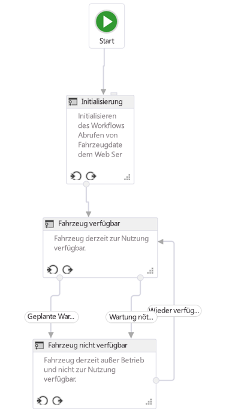

# Erstellen von SharePoint-Workflows mit Visual StudioCreate SharePoint workflows using Visual Studio

Erfahren Sie mehr über die Grundlagen des Erstellens eines SharePoint-Workflows auf der neuen SharePoint-Workflowplattform.Learn the basics of creating a SharePoint workflow in the new SharePoint workflow platform. Provided by:Andrew Connell,  AndrewConnell.com

**Bereitgestellt von:** [Andrew Connell](http://social.msdn.microsoft.com/profile/andrew%20connell%20%5bmvp%5d/), [www.AndrewConnell.com](http://www.andrewconnell.com)**Provided by:** [Andrew Connell](http://social.msdn.microsoft.com/profile/andrew%20connell%20%5bmvp%5d/),  [AndrewConnell.com](http://www.andrewconnell.com)

> [!NOTE]
> Dieser Artikel enthält ein durchgängiges Codebeispiel, das Sie beim Folgen des Artikels oder als Grundlage für eigene SharePoint-Workflowprojekte verwenden können. Den herunterladbaren Code finden Sie hier: LINK.This article is accompanied by an end-to-end code sample that you can use to follow the article, or as a starter for your own SharePoint workflow projects. You can find the downloadable code here: LINK. 
    
Microsoft hat in SharePoint einen ganz anderen Ansatz für Workflows umgesetzt als in früheren Versionen. SharePoint-Workflows basieren jetzt auf Windows Workflow Foundation 4, und ihre Ausführung wird von einer neuen Komponente namens Workflow-Manager gesteuert, die extern von SharePoint ausgeführt wird.Workflow-Manager übernimmt die Rolle als Host für die Windows Workflow Foundation-Runtime und alle erforderlichen Dienste in einer hoch verfügbaren und skalierbaren Weise. Er nutzt Service Bus für Leistung und Skalierbarkeit und wird bei Bereitstellung in einer lokalen Bereitstellung exakt auf dieselbe Weise ausgeführt wie bei einer Bereitstellung an einen Cloud-basierten Dienst wie Office 365, da er für die Weitergabe der gesamten Workflowausführung und zugehöriger Aufgaben an die Workflow-Manager-Farm konfiguriert ist.Die drastische Änderung in der Workflowarchitektur machte einige Änderungen an den beiden primären Workflowerstellungstools für das Erstellen von benutzerdefinierten Workflows - Visual Studio und SharePoint Designer - erforderlich. In diesem Artikel wird die Verwendung von Visual Studio 2012 als Workflowerstellungstool zum Erstellen benutzerdefinierter Workflows zur Verwendung in **sp15allshort** -Bereitstellungen dargestellt, sowohl für lokale als auch für Office 365-BereitstellungenMicrosoft has taken a very different approach to workflows in SharePoint than in previous versions. SharePoint workflows are now based on Windows Workflow Foundation 4, and their execution is driven by a new component called Workflow Manager, which runs externally to SharePoint.Workflow Manager serves the role as host for the Windows Workflow Foundation runtime and all the necessary services in a highly available and scalable way. It leverages Service Bus for performance and scalability, and when deployed it runs exactly the same in an on-premises deployment as when deployed to a cloud-based service, such as Office 365, because it is configured to hand off all workflow execution and related tasks to the Workflow Manager farm.The dramatic change in the workflow architecture required some changes to the two primary workflow authoring tools for creating custom workflows - Visual Studio and SharePoint Designer. This article will explore using Visual Studio 2012 as your workflow authoring tool to create custom workflows for use in **sp15allshort** deployments - either on-premises or Office 365 deployments

## Workflowtypen in Visual Studio 2012Types of workflows in Visual Studio 2012

Während SharePoint Designer 2013 nur Workflows erstellen kann, die aus Phasen bestehen, unterstützt Visual Studio einen anderen leistungsstarken Workflowtyp: den Zustandsautomatenworkflow. Effektiv unterstützen die Visual Studio 2012-Workflowentwicklungsumgebungen (und Visual Studio 2013) damit drei Arten der Workflowentwicklung: sequenziell, Flussdiagramm und Zustandsautomat.While SharePoint Designer 2013 can only create workflows comprised of stages, Visual Studio supports another powerful type of workflow: the state machine workflow. Effectively, then, the Visual Studio 2012 (and Visual Studio 2013) workflow development environments support three types of workflow authoring: sequential, flowchart, and state machine.
  
    
    

### SequenziellSequential

Ein sequenzieller Workflow folgt einem bestimmten Pfad. Möglicherweise gibt es Entscheidungszweige und Schleifen oder der Workflow hat keinen Endpunkt, aber es ist einfach, dem vorhersagbaren Pfad im Entwurfsprozess zu folgen. Tatsächlich beginnen alle Workflows auf diese Weise, wenn Sie die Projektvorlage **Workflow** in Visual Studio verwenden.A sequential workflow is one that follows a specific path. There may be decision branches, loops, and the workflow may not have a termination point, but it is easy to follow the predictable path in the design process. In fact, is how all workflows start out when you are using the **Workflow** project template in Visual Studio.
  
    
    
Ein sequenzieller Workflow enthält eine einzelne **Sequence**-Aktivität, in der eine beliebige Anzahl von Aktivitäten enthalten ist. Einige dieser Aktivitäten könnten weitere **Sequence**-Aktivitäten sein, die Sie verwenden, um eine Reihe kleinerer Schritte zu gruppieren.A sequential workflow contains a single **Sequence** activity and then any number of activities within it. Some of these could be other **Sequence** activities that you use to group together a series of smaller steps.
  
    
    

### FlussdiagrammFlowchart

Im Flowchartworkflow kann der Ausführungspfad gemäß den von Ihnen angegebenen Bedingungen in verschiedene Bereiche übergehen, wie in Abbildung 1 gezeigt. Die Flussdiagrammaktivität wird normalerweise zusammen mit der zugehörigen FlowDescision- und FlowSwitch-Aktivität in eine Sequence-Aktivität platziert und agiert entweder wie eine herkömmliche **if**-Aussage oder wie eine **switch**-Aussage in gängigen Programmiersprachen.In flowchart workflow, the execution pathway can transition to different sections of the workflow according to conditions that you specify, as shown in the Figure 1. The flowchart activity, along with the associated FlowDescision and FlowSwitch activity, are typically placed within a Sequence activity and act like either a traditional **if** statement, or like **switch** statement in common programming languages.
  
    
    
Das Phasenkonstrukt in einem SharePoint Designer 2013-basierten Workflow basiert auf den Grundsätzen eines Flussdiagramms. Diese Arten von Workflows haben im Gegensatz zu einem sequenziellen Workflow keinen vorgeschriebenen Pfad, in dem sie folgen. Stattdessen bestimmen die Dinge, die während des Workflows geschehen den Pfad, dem der Workflow folgt.The stage construct within a SharePoint Designer 2013 based workflow is based on the principles of a flowchart. These types of workflows, unlike a sequential workflow, do not have a prescribed path in which they follow. Rather the things that happen during the workflow dictate the path the workflow follows.
  
    
    

**Abbildung 1: Flussdiagrammworkflow in Visual Studio 2012****Figure 1. Flowchart workflow in Visual Studio 2012**

  
    
    

  
    
    

  
> [!NOTE]
> Sie finden den in Abbildung 1 dargestellten Workflow als Workflowbeispiel hier auf MSDN:  [SharePoint: Genehmigungsworkflow, der ein benutzerdefiniertes Initiierungsformular verwendet](http://code.msdn.microsoft.com/officeapps/SharePoint-Approval-f5ac5eb2).Note: You can find the workflow depicted in Figure 1 as a workflow sample on MSDN here:  [SharePoint: Approval workflow that uses a custom initiation form](http://code.msdn.microsoft.com/officeapps/SharePoint-Approval-f5ac5eb2). 
  
    
    

### ZustandsautomatState machine

Zustandsautomatworkflows folgen normalerweise wie Flussdiagrammsorkflows keinem bestimmten Ausführungspfad. Stattdessen bestehen sie aus zwei oder mehr Zuständen, wie in Abbildung 2 dargestellt.State machine workflows, like flowchart workflows, do not typically follow a specific path of execution. Rather, they consist of two or more states as shown in Figure 2. 
  
    
    

**Abbildung 2: Zustandsautomatworkflow in Visual Studio 2012****Figure 2. State machine workflow in Visual Studio 2012**

  
    
    

  
    
    

  
> [!NOTE]
> Sie finden den in Abbildung 1 dargestellten Workflow als Workflowbeispiel hier auf MSDN:  [SharePoint: Von Aktionen und Ereignissen abhängiges Weiterleiten von Workflows zu Zuständen](http://code.msdn.microsoft.com/officeapps/SharePoint-Route-25a25d87).Note: You can find the workflow depicted in Figure 1 as a workflow sample on MSDN here:  [SharePoint: Route workflows to states depending on actions and events](http://code.msdn.microsoft.com/officeapps/SharePoint-Route-25a25d87). 
  
    
    

Stellen Sie sich jeden Zustand als einen kleineren Workflow vor, der mehrere Workflowaktivitäten enthält. Sie können festlegen, dass bestimmte Aktivitäten gestartet werden, wenn der Workflow in einen bestimmten wechselt oder diesen verlässt. Was Zustandsautomatcomputer wirklich interessant macht, sind die Übergänge, die Sie definieren können. Jeder Zustand kann einen oder mehrere Übergänge haben, die dem Workflowmodul mitteilen, wie der Wechsel von einem Zustand zu einem anderen erfolgt.Think of each state as a smaller workflow that contains multiple workflow activities. You can set specific activities to start when the workflow enters or exits a given state. What really makes state machines interesting is the transitions that you can define. Each state can have one or more transitions that tell the workflow engine how to move from one state to another state. 
  
    
    
Der Workflow ist immer in einem der Zustände in einen Zustandsautomatworkflow. Ein Übergang gibt den Auslöser für den Workflow zum Wechseln von einem Zustand in einen anderen vor. Viele ziehen Zustandsautomatworkflows den anderen Workflowtypen vor, da sie reale Geschäftsprozesse besser spiegeln können. Die Workflowtypen können jedoch schnell kompliziert werden.The workflow is always going to be in one of the states in a state machine workflow. A transition will dictate the trigger for the workflow to move from one state to another. Many people favor state machine workflows over the other types of workflows because they can be made to more closely mirror real world business processes. However these types of workflows can get complicated quickly.
  
    
    

## Oberfläche für die Workflowentwicklung in Visual Studio 2012Visual Studio 2012 workflow development interface

Beim Hinzufügen eines neuen Workflows zu einem SharePoint-Projekt fügt die Vorlage eine einzelne Sequenz-Aktivität hinzu, die als Hauptcontainer dient. Wenn Sie einen Flussdiagramm- oder Zustandsautomatworkflow erstellen möchten, löschen Sie diese Standardaktivität einfach und ziehen Sie eine StateMachine- oder Flowchart-Aktivität auf die Entwurfsoberfläche.When adding a new workflow to a SharePoint project, the template adds a single Sequence activity which serves as the main container. If you want to create a flowchart or state machine workflow simply delete this default activity and drag either a StateMachine or Flowchart activity onto the design surface.
  
    
    
Vor dem Erstellen eines benutzerdefinierten Workflows sollten Entwickler ein gutes Verständnis für die Toolfenster und die Entwurfsoberfläche von Visual Studio 2012 haben. Viele der Elemente sind recht gängig, wie in Abbildung 3 dargestellt:Before building a custom workflow, developers should have a good understanding on the tool windows and design surface that Visual Studio 2012 provides. Many of the elements are quite common, as shown in Figure 3:
  
    
    

**Abbildung 3: Oberfläche für die Erstellung von Workflows in Visual Studio 2012****Figure 3. Visual Studio 2012 workflow authoring interface**

  
    
    

  
    
    

  
    
    
Die Oberfläche für die Workflowerstellung - d. h. der Workflow-Designer - verfügt über die folgenden wichtigen Elemente:The workflow development interface - that is, the workflow designer - has the following key elements:
  
    
    

  
    
    

1. **Projektmappen-Explorer**, in dem Ihr Projekt als Dateistruktur angezeigt wird.**Solution Explorer** displays your project as a file tree.
    
  
2. **Workflow-Toolbox** mit allen Aktivitäten, aus denen Sie einen Workflow zusammensetzen können. Sie ziehen Sie per Drag and Drop aus der Toolbox auf die Designeroberfläche.**Workflow toolbox** contains all of the activities that you can use to assemble a workflow. You drag and drop from the toolbox to the designer surface.
    
  
3. **Workflow-Designeroberfläche**, in der Sie die Workflowelemente zusammenstellen und verknüpfen.**Workflow designer surface** is where you assemble and link the workflow elements.
    
  
4. **Eigenschaftenraster**, in dem die Eigenschaften einer ausgewählten Aktivität oder eines Elements im **Projektmappen-Explorer** angezeigt werden. Verwenden Sie diese Option zum Festlegen oder Ändern der Eigenschaftswerte.**Property grid** displays properties of a selected activity or item in **Solution Explorer**. Use this to set or change property values.
    
  
5. **Ausgabebereich**, in dem Informationen zu Aktivitätenelementen von Workflows angezeigt werden, z. B. Variablen, Argumente und Import.**Output pane** displays information about workflow activity elements - variables, arguments, and import.
    
  
6. **Registerkarten der Breadcrumb-Navigation**, die Ihnen ermöglichen, verschiedene Teile eines Workflows in der Entwicklungsphase ein- oder auszuzoomen.**Breadcrumb navigation tabs** allows you to zoom in and out on various portions of a workflow under development.
    
  
Der **Ausgabebereich** (Nr. 5 in Abbildung 3) ist wichtig, da er Ihnen ermöglicht, alle Variablen in Ihrem Workflow im aktuellen Bereich anzuzeigen. Die Bereichsdefinition funktioniert genauso wie im objektorientierten Standardprogrammierungsentwurf: Eine Variable mit Bereichsdefinition im Stammverzeichnis ist für alle unteren Bereiche (wie Methoden innerhalb einer Klasse) zugänglich, aber eine Variable innerhalb eines niedrigeren Bereichs (wie eine Methode in einer Klasse) ist nur in diesem Bereich und dessen untergeordneten Bereichen, aber nicht in parallelen oder übergeordneten Bereichen zugänglich.The **Output pane** (#5 in Figure 3) is important because it allows you to see all of the variables in your workflow at the current scope. Scoping works the same way as it does in standard programming object oriented design: a variable scoped at the root is accessible to all lower scopes (such as methods within a class), but a variable within a lower scope (such as a method in a class) is only accessible within that scope and its children, but not parallel or parent scopes.
  
    
    
Klicken Sie auf die Registerkarte **Argumente**, um eine Liste der Argumente anzuzeigen, die verwendet werden, um Werte in den Workflow zu übergeben, z. B. von einem Initiierungsformular übergebene Werte.Click on the **Arguments** tab to see a list of the arguments that are used to pass values into the workflow, such as those passed from an initiation form.
  
    
    

## So erstellen Sie einen benutzerdefinierten WorkflowHow to create a custom workflow

Stellen Sie zum Erstellen eines benutzerdefinierten Workflows mithilfe von Visual Studio 2012 oder höher sicher, dass Sie Zugriff auf eine SharePoint-Entwicklerwebsite haben. In dieser exemplarischen Vorgehensweise wird empfohlen, dass Sie eine lokale SharePoint-Installation verwenden. Der Grund dafür ist, dass Workflows, die lokal getestet werden, mithilfe der **WriteLine**-Aktivität Debuginformationen an das Konsolenhilfsprogramm zum Testen des Diensthosts schreiben kann. Dieses Hilfsprogramm ist im Lieferumfang der Office Developer Tools für Visual Studio 2013 enthalten, die Teil der Standardinstallation von Visual Studio 2012 und höher in den Editionen Professional, Premium und Ultimate sind.To create a custom workflow using Visual Studio 2012 or later, ensure that you have access to a SharePoint developer site. For this walkthrough, it is recommended that you use a local SharePoint installation. This is because workflows tested locally can write debugging information to the Test Service Host console utility using the **WriteLine** activity. This utility is included with the Office Developer Tools for Visual Studio 2013, which are part of the default installation of Visual Studio 2012 and later in the Professional, Premium, and Ultimate editions.
  
    
    

### Erstellen eines neuen App-ProjektsCreate a new app project

1. Erstellen Sie in Visual Studio ein neues SharePoint-Add-Ins-Projekt, und konfigurieren Sie es als von SharePoint gehostete App.In Visual Studio, create a new SharePoint Add-ins project and configure it to be a SharePoint-hosted app.
    
  
2. Fügen Sie in diesem Projekt eine neue **Announcement**-Listeninstanz. Wir verwenden diese Liste als Container für Elemente, die wir zum Testen des Workflows verwenden möchten.In this project, add a new **Announcement** list instance. We use this list as a container for items that we are going to use to test the workflow.
    
  
3. Fügen Sie dem Projekt ein Workflowelement hinzu, indem Sie im **Projektmappen-Explorer** mit der rechten Maustaste auf das Projektsymbol klicken und anschließend auf **Hinzufügen** und **Neues Element** klicken.Add a workflow item to the project by right-clicking the project icon in **Solution Explorer** and selecting **Add**, then **New Item**.
    
  
4. Wählen Sie im Dialogfeld **Neues Element hinzufügen** in der Kategorie **Office/SharePoint** das Projektelement **Workflow** aus, und nennen Sie es „Mein erster Workflow". Klicken Sie dann auf **Weiter**.In the **Add New Item** dialog box, select the **Workflow** project item from the **Office/SharePoint** category and name it "My First Workflow". Click **Next**.
    
  
5. Wenn Sie vom **SharePoint-Anpassungs-Assistenten** aufgefordert werden, einen Namen einzugeben, behalten Sie den Standardwert bei, und legen Sie ihn dann auf einen **Listenworkflow** fest. Klicken Sie auf **Weiter**.When prompted by the **SharePoint Customization Wizard** for a name, leave the default, then set it to be a **List Workflow**. Click **Next**.
    
  
6. Aktivieren Sie auf der nächsten Seite des Assistenten das Kontrollkästchen zum Erstellen einer Zuordnung, und wählen Sie dann die soeben erstellte Liste **Announcements** aus. Wählen Sie **<Create New>** für den erforderlichen Workflowverlauf und die Aufgabenliste aus, und klicken Sie dann auf **Weiter**.On the next page of the wizard, check the box to create an association, then select the **Announcements** list that we just created; select **<Create New>** for the required workflow history and task lists and then click **Next**.
    
  
7. Aktivieren Sie auf der letzten Seite des Assistenten das Kontrollkästchen zum manuellen Starten des Workflows, lassen die beiden Optionen für den automatischen Start deaktiviert, und klicken Sie dann auf **Fertig stellen**. Visual Studio fügt automatisch die erforderlichen Elemente zum Projekt hinzu und lädt die Datei „Workflow.xaml" in den Designer, wie in Abbildung 4 dargestellt.On the final page of the wizard, check the box to start the workflow manually, leaving the two automatic start options unchecked; then click **Finish**. Visual Studio automatically adds the required elements to the project and loads the Workflow.xaml file into the designer, as shown in Figure 4.
    
   **Abbildung 4: Standard-Designeroberfläche nach Hinzufügen des Workflowelements****Figure 4. Default designer surface after adding the workflow item**

  

  
  

  

  

### Organisieren von WorkflowschrittenOrganize workflow steps

Um einen bestimmten Geschäftsprozess zu automatisieren, können Workflows eine beliebige Anzahl von Aktivitäten enthalten, die Sie in einem Schritt oder einer **Sequenz** gruppieren. Wenn Sie jedoch zu viele dieser Aktivitäten in einer einzigen **Sequenz** gruppieren, wird der Workflow unübersichtlich und schwer zu folgen und zu debuggen. Das ist ganz ähnlich wie in einer üblichen Programmiersprache davon abgeraten wird, extrem lange und komplexe Methoden zu erstellen. Stattdessen sollten Sie Aktivitäten gruppieren, die zusammenarbeiten, um eine bestimmte Aufgabe in einer gängigen Sequenz durchzuführen.To automate a given business process, workflows can contain any number of activities that you group together into a step, or **Sequence**. However, if you group too many of these activities in a single **Sequence**, the workflow becomes cluttered and difficult to follow and debug. This is similar to how in a common programming language it is ill-advised to create extremely long and complex methods. Instead, you should group activities that work together to perform a specific task in a common sequence.
  
    
    
Dieses Workflowbeispiel veranschaulicht die Methode der Segmentierung Ihrer Workflows. Fügen Sie in Ihrem neuen Projekt auf der Designeroberfläche der vorhandenen Sequence-Standardaktivität zwei neue Sequence-Aktivitäten hinzu, und nennen Sie sie in „Untergeordnete Sequenz 1" und „Untergeordnete Sequenz 2" um, wie in Abbildung 5 dargestellt. Ändern Sie außerdem den Namen der ursprünglichen Sequence-Aktivität zu „Root" (was jedoch nicht in Abbildung 5 gezeigt ist).This workflow sample will illustrate this practice of segmenting your workflows. In your new project, on the designer surface, to the existing default Sequence activity, add two new Sequence activities and rename them "Child Sequence 1" and Child Sequence 2", as depicted in Figure 5. Also (though not shown in Figure 5), change the name of the original Sequence activity to "Root".
  
    
    

**Abbildung 5: Hinzufügen von untergeordneten Sequenzen zur Standard- oder Rootsequenz****Figure 5. Adding child sequences to the default, or root, sequence**

  
    
    

  
    
    

  
    
    

  
    
    

  
    
    

### Kommentieren des Workflows mithilfe von AnmerkungenComment your workflow using annotations

Bei Verwendung einer gängigen Programmiersprache wie C#, VB.NET oder C++ können Sie Ihren Code mithilfe der entsprechenden Kommentarbezeichner kommentieren. Das Kommentieren von Code ist wichtig für das Testen und Verwalten einer Codebasis. Nun, mit Visual Studio können Sie Ihre Workflowentwicklung auch mit einer Funktion namens **annotations** kommentieren.When using a common programming language like C#, VB.NET, or C++, you can comment your code by using appropriate comment specifiers. Commenting code is important for testing and maintaining a code base. Well, Visual Studio allows you also comment your workflow development by providing a feature called **annotations**.
  
    
    
Sie können eine bestimmte Workflowaktivität kommentieren, indem Sie die Aktivität auswählen und dann **Anmerkungen** und **Anmerkung hinzufügen** auswählen. Ein kleines Symbol mit invertierten Chevrons rechts neben der Titelleiste der Aktivität signalisiert, dass eine Anmerkung vorhanden ist. Zeigen oder klicken Sie auf das Symbol, um die Meldung anzuzeigen (siehe Abbildung 6). Sie haben die Möglichkeit, die Anmerkung an die Aktivität anzuheften, damit sie immer sichtbar ist, wie in Abbildung 6 dargestellt.You can comment a given workflow activity by selecting the activity, the selecting **Annotations**, then **Add Annotation**. A small icon of inverted chevrons on the right side of the activity's title bar signals that it has an annotation. Hover over or click on the icon to see the message (shown in Figure 6). You have the option to pin the annotation to the activity so it is always visible, as shown in Figure 6. 
  
    
    

**Abbildung 6: Anmerkung zu einer Aktivität****Figure 6. Annotation on an activity**

  
    
    

  
    
    

  
    
    

  
    
    

  
    
    

### Abrufen von Werten aus ListenelementenObtain values from list items

Eine häufige Aufgabe, der Sie beim Erstellen von Workflows begegnen, ist das Abrufen von Eigenschaften eines Listenelements. Um diese Aufgabe auszuführen, verwenden Sie die Aktivität **LookupSPListItem**. Diese Aktivität für über die SharePoint-REST-API einen Webdienstaufruf durch, um Informationen für das Listenelement zu suchen. Das folgende Verfahren zeigt, wie das geht:A common task you will encounter when creating workflows is getting properties of a list item. To accomplish this task, use the **LookupSPListItem** activity. What this activity does is make a web service call using the SharePoint REST API to lookup information on the list item. The following procedure shows how to do this:
  
    
    
Ziehen Sie zunächst eine **LookupSPListItem**-Aktivität aus der Toolbox, und legen Sie es sie in der Aktivität **Untergeordnete Sequenz 1** ab.First, drag a **LookupSPListItem** activity from the toolbox and drop it in the **Child Sequence 1** activity.
  
    
    
Nach dem Hinzufügen der Aktivität zum Designer müssen Sie einige Eigenschaften festlegen: **ListId** und **ItemId**. Diese Eigenschaften können so festgelegt werden, dass sie Informationen in einer beliebigen Liste suchen, aber mit den Verknüpfungen für **Aktuelle Liste** und **Aktuelles Element** weisen Sie Workflow-Manager an, diese Werte automatisch herauszufinden.After adding the activity to the designer, you have to set a couple of properties: **ListId** and **ItemId**. These properties can be set to lookup information in any list, but using the shortcuts for **current list** and **current item** tell Workflow Manager to figure these values out automatically.
  
    
    
Da wir einen Webdienstaufruf vornehmen, ist der Rückgabewert aus dieser Aktivität, der in der **Result**-Eigenschaft dargestellt ist, vom Typ **DynamicValue**. Aus diesem Grund benötigen wir eine Variable dieses Datentyps zum Speichern der Ausgabe des Webdienstaufrufs. Dies ist ziemlich einfach, da ein großer Teil davon durch Klicken auf den Link **Eigenschaften abrufen** in der **LookupSPListItem**-Aktivität automatisch durchführt:Because we are making a web service call, the return value from this activity, reflected in the **Result** property, is of type **DynamicValue**. Therefore, we need a variable of that data type in which to store the output output of the web service call. This is actually pretty easy to do because clicking the **Get Properties** link in the **LookupSPListItem** activity much of this automatically:
  
    
    

- Erstellen Sie zunächst eine neue Variable vom Typ **DynamicValue**.First, it creates a new variable of type **DynamicValue**.
    
  
- Anschließend wird diese neue Variable als Quelle für die Eigenschaft **Result** für die Aktivität **LookupSPListItem** festgelegt.Next, it sets this new variable to be the source for the **Result** property on the **LookupSPListItem** activity.
    
  
- Dann wird eine **GetDynamicValueProperties**-Aktivität für den Workflow festgelegt, sodass wir den Wert aus der Variablen abrufen können.It then adds a **GetDynamicValueProperties** activity to the workflow so that we can retrieve the value from the variable.
    
  
- Schließlich wird die Variable an die Eigenschaft **Source** für die Aktivität **GetDynamicValueProperties** gebunden.Finally, it binds the variable to the **Source** property on the **GetDynamicValueProperties** activity.
    
  
Natürlich hätten Sie all dies manuell durchführen können, aber die Tools vereinfachen den Prozess. Falls erforderlich, können Sie die Namen der Variablen ändern.Of course, you could have done all of this manually, but the tools simplify the process. If necessary, you can change the names of the variables.
  
    
    
Der Punkt ist natürlich, einige Werte aus dem Listenelement abzurufen, die den Workflow ausgelöst haben: In der Spalte „Zugewiesen zu" sind die Werte dieser Eigenschaften an zuvor erstellte Variablen gebunden, oder verwenden Sie den Link „Variablen auffüllen", über den die Variablen automatisch erstellt werden.The point, of course, is to get some values from the list item that triggered the workflow: Now the Assigned To column is where the values of these properties are bound to variables previously created or use the Populate Variables link that will create the variables automatically.
  
    
    

1. Klicken Sie in der Eigenschaft **Properties** für die Aktivität **GetDynamicValueProperties** auf die Schaltfläche mit den Auslassungspunkten [ **...**], um das Dialogfeld **Eigenschaften** zu öffnen, wie in Abbildung 7 gezeigt.On the **Properties** property on the **GetDynamicValueProperties** activity, click on the ellipses button [ **???**] to open the **Properties** dialog box, shown in Figure 7.
    
   **Abbildung 7. Extrahieren von Werten mithilfe des Dialogfelds Eigenschaften****Figure 7. Extract values using the Properties dialog box**

  

  
  

  

  
2. Ändern Sie dann den **Entitätstyp** so, dass er dem Typ des Elements entspricht, in diesem Fall dem Listenelement **Listenelement von Ankündigungen**.Next change the **Entity Type** to match the type of the item; in this case it is the **List Item of Announcements** list item.
    
  
3. Wählen Sie die zwei Eigenschaften zum Abrufen auf: die Felder **Title** und **Created By**.Select the two properties to retrieve: the **Title** and **Created By** fields.
    
  
4. In der Spalte **Zuweisen zu** binden Sie diese Eigenschaften an die erstellten Variablen. Alternativ können Sie den Link **Variablen auffüllen** verwenden, über den die Variablen automatisch zugewiesen werden.The **Assign To** column is where you bind these properties to the variables that we created. Alternatively, you can use the **Populate Variables** link, which assigns the variables automatically.
    
  
Beachten Sie in Abbildung 7, wie das Tool die Variablen erstellt und sogar die Datentypen ordnungsgemäß zugeordnet hat. Beachten Sie außerdem, dass das Feld **Erstellt von** eine ganze Zahl ist. Es ist nicht wirklich sinnvoll, dem Benutzer eine Zahl für den Autor anzeigen, oder? Dieses Problem wird später im Workflow behoben.Notice in Figure 7 how the tool created the variables and even matched the data types correctly. Also notice how the **Created By** field is an integer. It is not really useful to show the user a number for the author is it? This will be addressed later in the workflow.
  
    
    

### Abrufen von BenutzereigenschaftenGet user properties

Eine weitere gängige Aufgabe in der Entwicklung von benutzerdefinierten Workflows ist die Suche nach Benutzern. Unser Workflow weiß beispielsweise derzeit, wer das Ankündigungselement erstellt hat, kennt aber nur die ID. Diese ID ist die ID des Benutzers, der zur **Benutzerinformationsliste** der Website hinzugefügt wurde, die eine zwischengespeicherte Kopie der Profilinformationen ist. Wirklich erwünscht ist der Name oder Anmeldename.Another common task in custom workflow development is looking up users. For instance, our workflow currently knows who created the announcement item, but only knows them by their ID. This ID is the ID of the user that has been added to the site's **User Information List**, which is a cached copy of their profile information. What is really desired is their name or login name.
  
    
    
Führen Sie folgende Schritte aus, um Benutzerinformationen abzurufen:To get user information, do the following:
  
    
    

1. Benennen Sie die erste Sequenz (**Untergeordnete Sequenz 1**) in „Elementeigenschaften abrufen“ um, und nennen Sie die zweite Sequenz „Autoreigenschaften abrufen“.Rename our first sequence ( **Child Sequence 1**) to "Get Item Properties" and name the second sequence to "Get Author Properties".
    
    > [!NOTE]
    > Stellen Sie sicher, dass für die Variable, die die Benutzer-ID enthält, die Bereichsdefinition auf den gesamten Workflow und nicht nur auf die Sequenz festgelegt wird, an der wir arbeiten.Note: Make certain the variable that contains the user ID is scoped to the whole workflow and not just to the sequence we were working on. Lassen Sie uns den Bereich für die Variable jetzt ändern, wie in Abbildung 8 gezeigt.Let's change the scope of the variable now, as shown in Figure 8. 

   **Abbildung 8. Ändern des Bereichs von Variablen****Figure 8. Changing the scope of variables**

  

  
  

  

  
2. Um jetzt Benutzerinformationen abzurufen, ziehen Sie per Drag-and-Drop eine **LookupSpUser**-Aktivität in den Workflow, und benennen Sie sie in „Ankündigungsautor abrufen" um. Diese Aktivität ruft die SharePoint-REST-API auf und übergibt eine bestimmte ID. Überprüfen Sie, wie der REST-Dienst aussieht, indem Sie mithilfe des Browsers zu  `http://../_api/web/SiteUsers` navigieren. Notieren Sie auch die zurückgegebenen Eigenschaften, da wir diese in einem Moment benötigen.Now, to get the user information, drag-and-drop a **LookupSpUser** activity in the workflow and rename it to "Get Announcement Author". This activity will call the SharePoint REST API and pass in a specific ID. Verify what the REST service looks like by using the browser and navigating to `http://../_api/web/SiteUsers`. Take notice of the properties returned, too, as we will need these in a moment.
    
  
3. Beachten Sie, dass jeder Benutzer über eine bestimmte URL verfügt, die seine ID zum Abrufen der Benutzerinformationen enthält. Beachten Sie außerdem, dass die Aktivität wahrscheinlich den Dienstoperator **GetUserById** aufruft und die ID des zu suchenden Benutzers übergibt. Übergeben Sie diese, indem Sie die Eigenschaft **PrincipalId** der Aktivität **LookupSPUser** als **CreatedBy**-Variable festlegen, die die ganze Zahl des Autors des Ankündigungselements ist.Notice that each user has a specific URL that includes their ID to get the user information. Also notice that the activity is likely calling the **GetUserById** service operator and passing in the ID of the user to lookup. Pass this in by specifying the **PrincipalId** property of the **LookupSPUser** activity to be the **CreatedBy** variable, which is the integer of the author of the announcement item.
    
  
4. Wie die Aktivität **LookupSPListItem** gibt die Aktivität **LookupSPUser** einen Wert des Typs **DynamicValue** zurück. Erstellen Sie deshalb eine Variable dieses Typs zum Zuweisen zu unserer Antwort, und binden Sie dann diese Variable an die **Result**-Eigenschaften der Aktivität **LookupSPUser**, wie in Abbildung 9 gezeigt.Just like the **LookupSPListItem** activity, the **LookupSPUser** activity returns a value of type **DynamicValue**, so create a variable of that type to associate with our response and then bind this variable to the **Result** properties of the **LookupSPUser** activity, as shown in Figure 9.
    
   **Abbildung 9: Aktualisieren der Ausgabe der LookupSPUser-Aktivität****Figure 9. Updating the output of the LookupSPUser activity**

  

  
  

  

  
5. Wie bereits zuvor verwenden wir eine **GetDynamicValueProperties**-Aktivität zum Abrufen der Ergebnisse aus dem Wert **AuthorProperties**. Beachten Sie jedoch, dass **Entity Type** dieses Mal nicht über eine Option verfügt, die festgelegt werden kann. Das ist kein Problem, da die tatsächliche Webdienstantwort **LookupSPUser** im Browser angezeigt werden kann. Geben Sie zum Anzeigen den Pfad zu der Eigenschaft ein, die Sie suchen, in diesem Fall `d/results/(0)/LoginName`. Geben Sie dann eine andere ein, um den Anzeigenamen des Autors abzurufen, wie in Abbildung 10 dargestellt.As we did earlier, use a **GetDynamicValueProperties** activity to pull the results out of the **AuthorProperties** value. However, notice this time around that the **Entity Type** does not have an option that we can set. This is not a problem, because the actual web service response the **LookupSPUser** can be seen in the browser. To see it, enter the path to the property you are looking for, which, in this case is `d/results/(0)/LoginName`; then, enter another to get the display name of the author, as shown in Figure 10.
    
   **Abbildung 10. Abrufen von Werten aus der LookupSPUser-Aktivität****Figure 10. Retrieving values from the LookupSPUser activity**

  

  
  

  

  

### Testen des WorkflowsTest the workflow

Lassen Sie uns abschließend den Workflow testen. Beginnen Sie, indem Sie zwei **WriteLine**-Aktivitäten hinzufügen. Mit diesen können wir die Inhalte unserer zwei Variablen anzeigen. Wenn der Workflow getestet wird, schreibt das Konsolenhilfsprogramm zum Testen des Diensthosts die beiden Werte aus, wie in Abbildung 11 gezeigt.Finally, let's test the workflow. Start by adding two **WriteLine** activities. These allow us to show the contents of our two variables. When testing the workflow, the Test Service Host console utility will write out the two values as shown in Figure 11.
  
    
    

**Abbildung 11: Test mithilfe der Konsole zum Testen des Diensthosts****Figure 11. Test using Test Service Host Console**

  
    
    

  
    
    

  
    
    

  
    
    

  
    
    

## SchlussbemerkungConclusion

In diesem Artikel wurden zunächst die verschiedenen Workflowtypen erläutert, die mithilfe von Visual Studio 2012 und höher für SharePoint erstellt werden können, wenn eine Verbindung zur einer Workflow-Manager-Farm hergestellt wurde. Als Nächstes wurde gezeigt, wie Sie einen Workflow erstellen, der nicht nur Werte aus dem Listenelement erfasst, das den Workflow auslöst, sondern auch eine gängige Aufgabe wie das Abrufen des Anmeldenamens und Anzeigenamens eines Benutzers mithilfe der **LookupSPUser**-Aktivität durchführt. Darüber hinaus wurden im Artikel einige bewährte Methoden für das Organisieren von Workflows und das Hinzufügen von Kommentaren mithilfe von Anmerkungen dargestellt.This article first explained the different types of workflows that can be created using Visual Studio 2012 and later for SharePoint when it has been connected to a Workflow Manager farm. Next it demonstrated how to create a workflow that not only collected values from the list item that triggered the workflow, but it also demonstrated how to perform a common task such as obtaining a user's login name and display name using the **LookupSPUser** activity. In addition, the article touched on a few good practices for keeping workflows organized and adding comments using annotations.
  
    
    

## Siehe auchSee also

-  [Workflows in SharePointWorkflows in SharePoint](workflows-in-sharepoint.md)
    
  
-  [Bewährte Methoden für die SharePoint-WorkflowentwicklungSharePoint workflow development best practices](sharepoint-workflow-development-best-practices.md)
    
  
-  [Beispiele für SharePoint-WorkflowsSharePoint workflow samples](sharepoint-workflow-samples.md)
    
  

  
    
    

