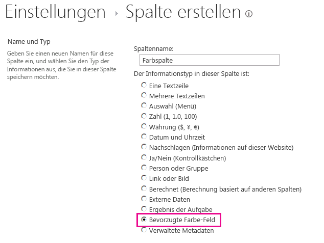

# <a name="customize-a-field-type-using-client-side-rendering"></a><span data-ttu-id="67ad5-102">Anpassen eines Feldtyps mithilfe vom clientseitigem Rendering</span><span class="sxs-lookup"><span data-stu-id="67ad5-102">Customize a field type using client-side rendering</span></span>

<span data-ttu-id="67ad5-p101">In diesem Artikel erfahren Sie, wie Sie einen Feldtyp mithilfe der clientseitigen Renderingtechnologie in SharePoint anpassen. Durch clientseitiges Rendering wird ein Mechanismus verfügbar, mit dem Sie Ihre eigene Ausgabe für eine Gruppe von Steuerelementen, die in einer SharePoint-Seite gehostet sind, generieren können. Dieser Mechanismus ermöglicht Ihnen die Verwendung bekannter Technologien, wie HTML und JavaScript, um die Rendering-Logik von SharePoint-Listenansichten zu definieren. Beim clientseitigen Rendering können Sie Ihre eigenen JavaScript-Ressourcen angeben und sie in den für Ihre Farmlösung verfügbaren Datenspeicheroptionen, wie z. B. dem _layouts-Ordner, hosten.</span><span class="sxs-lookup"><span data-stu-id="67ad5-p101">Learn how to customize a field type by using the client-side rendering technology in SharePoint. Client-side rendering provides a mechanism that you can use to produce your own output for a set of controls that are hosted in a SharePoint page. This mechanism enables you to use well-known technologies, such as HTML and JavaScript, to define the rendering logic of custom field types. In client-side rendering you can specify your own JavaScript resources and host them in the data storage options available to your farm solution, such as the _layouts folder.</span></span>

## <a name="prerequisites-for-using-the-examples-in-this-article"></a><span data-ttu-id="67ad5-107">Voraussetzungen für die Verwendung der Beispiele in diesem Artikel</span><span class="sxs-lookup"><span data-stu-id="67ad5-107">Prerequisites for using the examples in this article</span></span>
<span data-ttu-id="67ad5-108"><a name="SP15CustomizeafieldtypeusingCSR_Prereq"> </a></span><span class="sxs-lookup"><span data-stu-id="67ad5-108"><a name="SP15CustomizeafieldtypeusingCSR_Prereq"> </a></span></span>

<span data-ttu-id="67ad5-109">Um die Schritte in diesem Beispiel auszuführen, benötigen Sie Folgendes:</span><span class="sxs-lookup"><span data-stu-id="67ad5-109">To follow the steps in this example, you need the following:</span></span>
  
    
    

- <span data-ttu-id="67ad5-110">Microsoft Visual Studio 2012</span><span class="sxs-lookup"><span data-stu-id="67ad5-110">Microsoft Visual Studio 2012</span></span>
    
  
- <span data-ttu-id="67ad5-111">Office Developer Tools für Visual Studio 2012</span><span class="sxs-lookup"><span data-stu-id="67ad5-111">Office Developer Tools for Visual Studio 2012</span></span>
    
  
- <span data-ttu-id="67ad5-112">Eine SharePoint-Entwicklungsumgebung</span><span class="sxs-lookup"><span data-stu-id="67ad5-112">A SharePoint development environment</span></span>
    
  
<span data-ttu-id="67ad5-113">Weitere Informationen über das Einrichten Ihrer SharePoint-Entwicklungsumgebung finden Sie unter  [Einrichten einer allgemeinen Entwicklungsumgebung für SharePoint](set-up-a-general-development-environment-for-sharepoint.md).</span><span class="sxs-lookup"><span data-stu-id="67ad5-113">For information about setting up your SharePoint development environment, see  [Set up a general development environment for SharePoint](set-up-a-general-development-environment-for-sharepoint.md).</span></span>
  
    
    

### <a name="core-concepts-to-help-you-understand-client-side-rendering-for-field-types"></a><span data-ttu-id="67ad5-114">Kernkonzepte zum Verständnis des clientseitigen Renderings für Feldtypen</span><span class="sxs-lookup"><span data-stu-id="67ad5-114">Core concepts to help you understand client-side rendering for field types</span></span>

<span data-ttu-id="67ad5-115">In der folgenden Tabelle sind hilfreiche Artikel aufgeführt, die ein besseres Verständnis der Konzepte und Schritte bei einem Szenarium mit benutzerdefinierten Aktionen ermöglichen.</span><span class="sxs-lookup"><span data-stu-id="67ad5-115">The following table lists useful articles that can help you understand the concepts and steps that are involved in a custom action scenario.</span></span>
  
    
    

<span data-ttu-id="67ad5-116">**Tabelle 1. Kernkonzepte des clientseitigen Renderings für Feldtypen**</span><span class="sxs-lookup"><span data-stu-id="67ad5-116">**Table 1. Core concepts for client-side rendering for field types**</span></span>


|<span data-ttu-id="67ad5-117">**Titel des Artikels**</span><span class="sxs-lookup"><span data-stu-id="67ad5-117">**Article title**</span></span>|<span data-ttu-id="67ad5-118">**Beschreibung**</span><span class="sxs-lookup"><span data-stu-id="67ad5-118">**Description**</span></span>|
|:-----|:-----|
| [<span data-ttu-id="67ad5-119">Erstellen von Farmlösungen in SharePoint</span><span class="sxs-lookup"><span data-stu-id="67ad5-119">Build farm solutions in SharePoint</span></span>](build-farm-solutions-in-sharepoint.md) <br/> |<span data-ttu-id="67ad5-120">Erfahren Sie mehr über die Entwicklung, Verpackung und Bereitstellung von administrativen Erweiterungen für SharePoint mit Farmlösungen.</span><span class="sxs-lookup"><span data-stu-id="67ad5-120">Learn about developing, packaging, and deploying administrative extensions to SharePoint using farm solutions.</span></span>  <br/> |
| <span data-ttu-id="67ad5-121">[Benutzerdefinierte Feldtypen](http://msdn.microsoft.com/de-DE/library/ms446361.aspx)</span><span class="sxs-lookup"><span data-stu-id="67ad5-121">[Custom Field Types](http://msdn.microsoft.com/de-DE/library/ms446361.aspx)</span></span> <br/> |<span data-ttu-id="67ad5-p102">Erfahren Sie mehr über das Erstellen von benutzerdefinierten Feldtypen. Beim Speichern Ihrer Unternehmensinformationen in SharePoint kann es vorkommen, dass Ihre Daten nicht den Feldtypen entsprechen, die in SharePoint Foundation verfügbar sind, oder Sie möchten vielleicht einfach diese Feldtypen anpassen. Benutzerdefinierte Felder können eine benutzerdefinierte Datenüberprüfung und benutzerdefiniertes Feldrendering umfassen.</span><span class="sxs-lookup"><span data-stu-id="67ad5-p102">Learn about creating custom field types. As you store your business information in SharePoint, there may be times when your data does not conform to the field types that are available in SharePoint FoundationOr, you might just want to customize those field types. Custom fields can include custom data validation and custom field rendering.</span></span>  <br/> |
   

## <a name="code-example-customize-the-rendering-process-for-a-custom-field-type-in-a-view-form"></a><span data-ttu-id="67ad5-125">Codebeispiel: Anpassen des Renderingprozesses für einen benutzerdefinierten Feldtyp in einem Ansichtsformular</span><span class="sxs-lookup"><span data-stu-id="67ad5-125">Code example: Customize the rendering process for a custom field type in a view form</span></span>
<span data-ttu-id="67ad5-126"><a name="SP15CustomizeafieldtypeusingCSR_Codeexample"> </a></span><span class="sxs-lookup"><span data-stu-id="67ad5-126"><a name="SP15CustomizeafieldtypeusingCSR_Codeexample"> </a></span></span>

<span data-ttu-id="67ad5-127">Führen Sie die folgenden Schritte aus, um den Renderingprozess für einen benutzerdefinierten Feldtyp anzupassen:</span><span class="sxs-lookup"><span data-stu-id="67ad5-127">Follow these steps to customize the rendering process for a custom field type:</span></span>
  
    
    

1. <span data-ttu-id="67ad5-128">Erstellen Sie das Farmlösung-Projekt.</span><span class="sxs-lookup"><span data-stu-id="67ad5-128">Create the farm solution project.</span></span>
    
  
2. <span data-ttu-id="67ad5-129">Fügen Sie eine Klasse für den benutzerdefinierten Feldtyp hinzu.</span><span class="sxs-lookup"><span data-stu-id="67ad5-129">Add a class for the custom field type.</span></span>
    
  
3. <span data-ttu-id="67ad5-130">Fügen Sie eine XML-Definition für den benutzerdefinierten Feldtyp hinzu.</span><span class="sxs-lookup"><span data-stu-id="67ad5-130">Add an XML definition for the custom field type.</span></span>
    
  
4. <span data-ttu-id="67ad5-131">Fügen Sie eine JavaScript-Datei für die Renderinglogik des benutzerdefinierten Feldtyps hinzu.</span><span class="sxs-lookup"><span data-stu-id="67ad5-131">Add a JavaScript file for the rendering logic of the custom field type.</span></span>
    
  
<span data-ttu-id="67ad5-132">Abbildung 1 zeigt eine Ansichtsformular mit einem benutzerdefinierten, gerenderten Feldtyp.</span><span class="sxs-lookup"><span data-stu-id="67ad5-132">Figure 1 shows a view form with a custom-rendered field type.</span></span>
  
    
    

<span data-ttu-id="67ad5-133">**Abbildung 1. Benutzerdefiniertes, clientseitig gerendertes Feld in einem Ansichtsformular**</span><span class="sxs-lookup"><span data-stu-id="67ad5-133">**Figure 1. Custom client-side rendered field in a view form**</span></span>

  
    
    

  
    
    
  
  
    
    

### <a name="to-create-the-farm-solution-project"></a><span data-ttu-id="67ad5-135">So erstellen Sie das Farmlösung-Projekt</span><span class="sxs-lookup"><span data-stu-id="67ad5-135">To create the farm solution project</span></span>


1. <span data-ttu-id="67ad5-136">Öffnen Sie Visual Studio 2012 als Administrator. (Klicken Sie dazu im Menü **Start** mit der rechten Maustaste auf das Symbol für Visual Studio 2012, und wählen Sie **Als Administrator ausführen** aus.)</span><span class="sxs-lookup"><span data-stu-id="67ad5-136">Open Visual Studio 2012 as administrator (right-click the Visual Studio 2012 icon in the **Start** menu, and then choose **Run as administrator** ).</span></span>
    
  
2. <span data-ttu-id="67ad5-137">Erstellen Sie ein neues Projekt unter Verwendung der Vorlage **SharePoint-Projekt**.</span><span class="sxs-lookup"><span data-stu-id="67ad5-137">Create a new project using the **SharePoint Project** template</span></span>
    
    <span data-ttu-id="67ad5-138">Abbildung 2 zeigt den Speicherort der Vorlage **SharePoint-Projekt** in Visual Studio 2012 unter **Vorlagen**, **Visual C#**, **Office SharePoint**, **SharePoint-Lösungen**.</span><span class="sxs-lookup"><span data-stu-id="67ad5-138">Figure 2 shows the location of the **SharePoint Project** template in Visual Studio 2012, under **Templates**, **Visual C#**, **Office SharePoint**, **SharePoint Solutions**.</span></span>
    

   <span data-ttu-id="67ad5-139">**Abbildung 2. Visual Studio-Vorlage für SharePoint-Projekt**</span><span class="sxs-lookup"><span data-stu-id="67ad5-139">**Figure 2. SharePoint project Visual Studio template**</span></span>

  

  
  

  

  
3. <span data-ttu-id="67ad5-141">Geben Sie die URL der SharePoint-Website an, die Sie für das Debugging verwenden möchten.</span><span class="sxs-lookup"><span data-stu-id="67ad5-141">Provide the URL of the SharePoint website that you want to use for debugging.</span></span>
    
  
4. <span data-ttu-id="67ad5-142">Wählen Sie die Option **Als Farmlösung bereitstellen** aus.</span><span class="sxs-lookup"><span data-stu-id="67ad5-142">Select the **Deploy as a farm solution** option.</span></span>
    
  

### <a name="to-add-a-class-for-the-custom-field-type"></a><span data-ttu-id="67ad5-143">So fügen Sie eine Klasse für den benutzerdefinierten Feldtyp hinzu</span><span class="sxs-lookup"><span data-stu-id="67ad5-143">To add a class for the custom field type</span></span>


1. <span data-ttu-id="67ad5-p103">Klicken Sie mit der rechten Maustaste auf das Farmlösung-Projekt, und fügen Sie eine neue Klasse hinzu. Benennen Sie die Klassendatei FavoriteColorFieldType.cs.</span><span class="sxs-lookup"><span data-stu-id="67ad5-p103">Right-click the farm solution project and add a new class. Name the class file FavoriteColorFieldType.cs.</span></span>
    
  
2. <span data-ttu-id="67ad5-p104">Kopieren Sie den folgenden Code, und fügen Sie ihn in die Datei FavoriteColorFieldType.cs ein. Der Code führt folgende Aufgaben aus:</span><span class="sxs-lookup"><span data-stu-id="67ad5-p104">Copy the following code and paste it in the FavoriteColorFieldType.cs file. The code performs the following tasks:</span></span>
    
  - <span data-ttu-id="67ad5-148">Deklariert eine **FavoriteColorField**-Klasse, die von **SPFieldText** erbt.</span><span class="sxs-lookup"><span data-stu-id="67ad5-148">Declares a **FavoriteColorField** class that inherits from **SPFieldText**.</span></span>
    
  
  - <span data-ttu-id="67ad5-149">Stellt zwei Konstruktoren für die **FavoriteColorField**-Klasse bereit.</span><span class="sxs-lookup"><span data-stu-id="67ad5-149">Provides two constructors for the **FavoriteColorField** class.</span></span>
    
  
  - <span data-ttu-id="67ad5-150">Überschreibt die **JSLink**-Eigenschaft.</span><span class="sxs-lookup"><span data-stu-id="67ad5-150">Overrides the **JSLink** property.</span></span>
    
    > [!NOTE]
    > <span data-ttu-id="67ad5-p105">Die JSLink-Eigenschaft wird nicht für Umfrage- oder Ereignislisten unterstützt. Ein SharePoint-Kalender ist eine Ereignisliste.</span><span class="sxs-lookup"><span data-stu-id="67ad5-p105">The JSLink property is not supported on Survey or Events lists. A SharePoint calendar is an Events list.</span></span> 

```cs
using System;
using System.Collections.Generic;
using System.Linq;
using System.Text;
using System.Threading.Tasks;

// Additional references for this sample.
using Microsoft.SharePoint;
using Microsoft.SharePoint.WebControls;

namespace Microsoft.SDK.SharePoint.Samples.WebControls
{
    /// <summary>
    /// The FavoriteColorField custom field type 
    /// inherits from SPFieldText.
    /// Users can input the color in the field 
    /// just like in any other text field.
    /// But the field will provide additional 
    /// rendering logic when displaying 
    /// the field in a view form.
    /// </summary>
    public class FavoriteColorField : SPFieldText
    {
        // The solution deploys the JavaScript 
        // file to the CSRAssets folder 
        // in the WFE's layouts folder.
        private const string JSLinkUrl = 
            "~site/_layouts/15/CSRAssets/CSRFieldType.js";

        // You have to provide constructors for SPFieldText.
        public FavoriteColorField(
            SPFieldCollection fields, 
            string name) :
            base(fields, name)
        {

        }
        public FavoriteColorField(
            SPFieldCollection fields, 
            string typename, 
            string name) :
            base(fields, typename, name)
        {

        }

        /// <summary>
        /// Override the JSLink property to return the 
        /// value of our custom JavaScript file.
        /// </summary>
        public override string JSLink
        {
            get
            {
                return JSLinkUrl;
            }
            set
            {
                base.JSLink = value;
            }
        }
    }
}            
```


### <a name="to-add-an-xml-definition-for-the-custom-field-type"></a><span data-ttu-id="67ad5-153">So fügen Sie eine XML-Definition für den benutzerdefinierten Feldtyp hinzu</span><span class="sxs-lookup"><span data-stu-id="67ad5-153">To add an XML definition for the custom field type</span></span>


1. <span data-ttu-id="67ad5-p106">Klicken Sie mit der rechten Maustaste auf das Farmlösung-Projekt, und fügen Sie einen zugeordneten SharePoint-Ordner hinzu. Wählen Sie im Dialogfeld den Ordner **{SharePointRoot}\\Template\\XML** aus.</span><span class="sxs-lookup"><span data-stu-id="67ad5-p106">Right-click the farm solution project, and add a SharePoint mapped folder. In the dialog box, select the **{SharePointRoot}\\Template\\XML** folder.</span></span>
    
  
2. <span data-ttu-id="67ad5-p107">Klicken Sie mit der rechten Maustaste auf den im letzten Schritt erstellten XML-Ordner, und fügen Sie eine neue XML-Datei hinzu. Benennen Sie die XML-Datei fldtypes_FavoriteColorFieldType.xml.</span><span class="sxs-lookup"><span data-stu-id="67ad5-p107">Right-click the XML folder created in the last step, and add a new XML file. Name the XML file fldtypes_FavoriteColorFieldType.xml.</span></span>
    
  
3. <span data-ttu-id="67ad5-p108">Kopieren Sie das folgende Markup, und fügen Sie es in die XML-Datei ein. Das Markup führt die folgenden Aufgaben aus:</span><span class="sxs-lookup"><span data-stu-id="67ad5-p108">Copy the following markup, and paste it in the XML file. The markup performs the following tasks:</span></span>
    
  - <span data-ttu-id="67ad5-160">Stellt den Typnamen für den Feldtyp bereit.</span><span class="sxs-lookup"><span data-stu-id="67ad5-160">Provides type name for the field type.</span></span>
    
  
  - <span data-ttu-id="67ad5-p109">Gibt den vollständigen Klassennamen für den Feldtyp an. Dies ist die Klasse, die Sie im vorherigen Schritt erstellt haben.</span><span class="sxs-lookup"><span data-stu-id="67ad5-p109">Specifies the full class name for the field type. This is the class you created in the previous procedure.</span></span>
    
  
  - <span data-ttu-id="67ad5-163">Stellt zusätzliche Attribute für den Feldtyp bereit.</span><span class="sxs-lookup"><span data-stu-id="67ad5-163">Provides additional attributes for the field type.</span></span>
    
  
```XML
    <?xml version="1.0" encoding="utf-8" ?>
    <FieldTypes>
      <FieldType>
        <Field Name="TypeName">FavoriteColorField</Field>
        <Field Name="TypeDisplayName">Favorite color field</Field>
        <Field Name="TypeShortDescription">Favorite color field</Field>
        <Field Name="FieldTypeClass">Microsoft.SDK.SharePoint.Samples.WebControls.FavoriteColorField, $SharePoint.Project.AssemblyFullName$</Field>
        <Field Name="ParentType">Text</Field>
        <Field Name="Sortable">TRUE</Field>
        <Field Name="Filterable">TRUE</Field>
        <Field Name="UserCreatable">TRUE</Field>
        <Field Name="ShowOnListCreate">TRUE</Field>
        <Field Name="ShowOnSurveyCreate">TRUE</Field>
        <Field Name="ShowOnDocumentLibrary">TRUE</Field>
        <Field Name="ShowOnColumnTemplateCreate">TRUE</Field>
      </FieldType>
    </FieldTypes>
```

### <a name="to-add-a-javascript-file-for-the-rendering-logic-of-the-custom-field-type"></a><span data-ttu-id="67ad5-164">So fügen Sie eine JavaScript-Datei für die Renderinglogik des benutzerdefinierten Feldtyps hinzu</span><span class="sxs-lookup"><span data-stu-id="67ad5-164">To add a JavaScript file for the rendering logic of the custom field type</span></span>


1. <span data-ttu-id="67ad5-p110">Klicken Sie mit der rechten Maustaste auf das Farmlösung-Projekt, und fügen Sie einen zugeordneten SharePoint-Ordner „Layouts" hinzu. Fügen Sie einen neuen CSRAssets-Ordner zu dem zuletzt hinzugefügten Ordner „Layouts" hinzu.</span><span class="sxs-lookup"><span data-stu-id="67ad5-p110">Right-click the farm solution project, and add the SharePoint Layouts mapped folder. Add a new CSRAssets folder to the recently added Layouts folder.</span></span>
    
  
2. <span data-ttu-id="67ad5-p111">Klicken Sie mit der rechten Maustaste auf den im letzten Schritt erstellten Ordner „CSRAssets", und fügen Sie eine neue JavaScript-Datei hinzu. Benennen Sie die JavaScript-Datei CSRFieldType.js.</span><span class="sxs-lookup"><span data-stu-id="67ad5-p111">Right-click the CSRAssets folder that you created in the last step, and add a new JavaScript file. Name the JavaScript file CSRFieldType.js.</span></span>
    
  
3. <span data-ttu-id="67ad5-p112">Kopieren Sie den folgenden Code, und fügen Sie ihn in die Datei JavaScript ein. Der Code führt folgende Aufgaben aus:</span><span class="sxs-lookup"><span data-stu-id="67ad5-p112">Copy the following code and paste it in the JavaScript file. The code performs the following tasks:</span></span>
    
  - <span data-ttu-id="67ad5-171">Erstellt eine Vorlage für das Feld, wenn dieses in einem Ansichtsformular angezeigt wird.</span><span class="sxs-lookup"><span data-stu-id="67ad5-171">Creates a template for the field when it is displayed in a view form.</span></span>
    
  
  - <span data-ttu-id="67ad5-172">Registriert die Vorlage.</span><span class="sxs-lookup"><span data-stu-id="67ad5-172">Registers the template.</span></span>
    
  
  - <span data-ttu-id="67ad5-173">Stellt die Renderinglogik für den Feldtyp bei Verwendung in einem Ansichtsformular bereit.</span><span class="sxs-lookup"><span data-stu-id="67ad5-173">Provides the rendering logic for the field type when used displayed in a view form.</span></span>
    
  

```javascript
(function () {
    var favoriteColorContext = {};

    // You can provide templates for:
    // View, DisplayForm, EditForm and NewForm
    favoriteColorContext.Templates = {};
    favoriteColorContext.Templates.Fields = {
        "FavoriteColorField": {
            "View": favoriteColorViewTemplate
        }
    };

    SPClientTemplates.TemplateManager.RegisterTemplateOverrides(
        favoriteColorContext
        );
})();

// The favoriteColorViewTemplate provides the rendering logic
// the custom field type when it is displayed in the view form.
function favoriteColorViewTemplate(ctx) {
    var color = ctx.CurrentItem[ctx.CurrentFieldSchema.Name];
    return "<span style='background-color : " + color +
        "' >&amp;nbsp;&amp;nbsp;&amp;nbsp;&amp;nbsp;</span>&amp;nbsp;" + color;
}
```

### <a name="to-build-and-run-the-solution"></a><span data-ttu-id="67ad5-174">So erstellen Sie die Lösung und führen Sie sie aus</span><span class="sxs-lookup"><span data-stu-id="67ad5-174">To build and run the solution</span></span>


1. <span data-ttu-id="67ad5-175">Drücken Sie F5.</span><span class="sxs-lookup"><span data-stu-id="67ad5-175">Press the F5 key.</span></span>
    
    > [!NOTE]
    > <span data-ttu-id="67ad5-176">Wenn Sie F5 drücken, erstellt Visual Studio die Lösung, stellt die Lösung bereit und öffnet die SharePoint-Website, auf der die Lösung bereitgestellt wird.</span><span class="sxs-lookup"><span data-stu-id="67ad5-176">Note: When you press F5, Visual Studio builds the solution, deploys the solution, and opens the SharePoint website where the solution is deployed.</span></span> 

2. <span data-ttu-id="67ad5-177">Erstellen Sie eine benutzerdefinierte Liste, und fügen Sie eine neue Feldspalte für die bevorzugte Farbe hinzu.</span><span class="sxs-lookup"><span data-stu-id="67ad5-177">Create a custom list and add a new Favorite color field column.</span></span>
    
  
3. <span data-ttu-id="67ad5-178">Fügen Sie ein Element zur Liste hinzu, und geben Sie einen Wert für die Spalte mit der bevorzugten Farbe an.</span><span class="sxs-lookup"><span data-stu-id="67ad5-178">Add one item to the list, and provide a value for the favorite color column.</span></span>
    
  
4. <span data-ttu-id="67ad5-179">Abbildung 3 zeigt die Seite zum Erstellen der Spalte mit dem neuen benutzerdefinierten Feldtyp.</span><span class="sxs-lookup"><span data-stu-id="67ad5-179">Figure 3 shows the create column page with the new custom field type.</span></span>
    
   <span data-ttu-id="67ad5-180">**Abbildung 3. Erstellen einer Spalte mit dem neuen benutzerdefinierten Feldtyp**</span><span class="sxs-lookup"><span data-stu-id="67ad5-180">**Figure 3. Creating a new custom field type column**</span></span>

  

  
  

  

  


|<span data-ttu-id="67ad5-182">**Problem**</span><span class="sxs-lookup"><span data-stu-id="67ad5-182">**Problem**</span></span>|<span data-ttu-id="67ad5-183">**Lösung**</span><span class="sxs-lookup"><span data-stu-id="67ad5-183">**Solution**</span></span>|
|:-----|:-----|
|<span data-ttu-id="67ad5-p113">Feldtyp **FavoriteColorField** ist nicht ordnungsgemäß installiert. Wechseln Sie zu der Seite mit den Listeneinstellungen, um dieses Feld zu löschen.</span><span class="sxs-lookup"><span data-stu-id="67ad5-p113">Field type **FavoriteColorField** is not installed properly. Go to the list settings page to delete this field. </span></span><br/> |<span data-ttu-id="67ad5-186">Führen Sie den folgenden Befehl an einer Eingabeaufforderung mit erhöhten Rechten aus: **iisreset /noforce**.</span><span class="sxs-lookup"><span data-stu-id="67ad5-186">Execute the following command from an elevated command prompt: **iisreset /noforce**.</span></span> <br/> <span data-ttu-id="67ad5-187">**Vorsicht:** Wenn Sie die Lösung in einer Produktionsumgebung bereitstellen, warten Sie auf einen geeigneten Zeitpunkt. um den Webserver mithilfe von **iisreset /noforce** zurückzusetzen.</span><span class="sxs-lookup"><span data-stu-id="67ad5-187">**Caution:** If you are deploying the solution to a production environment, wait for an appropriate time to reset the web server using **iisreset /noforce**.</span></span>          |
   

## <a name="next-steps"></a><span data-ttu-id="67ad5-188">Nächste Schritte</span><span class="sxs-lookup"><span data-stu-id="67ad5-188">Next steps</span></span>
<span data-ttu-id="67ad5-189"><a name="SP15CustomizeafieldtypeusingCSR_Nextsteps"> </a></span><span class="sxs-lookup"><span data-stu-id="67ad5-189"><a name="SP15CustomizeafieldtypeusingCSR_Nextsteps"> </a></span></span>

<span data-ttu-id="67ad5-p114">In diesem Artikel wird beschrieben, wie der Renderingprozess für einen benutzerdefinierten Feldtyp angepasst wird. Als nächsten Schritt können Sie mehr zu benutzerdefinierten Feldtypen erfahren. Weitere Informationen finden Sie unter den folgenden Themen:</span><span class="sxs-lookup"><span data-stu-id="67ad5-p114">This article demonstrated how to customize the rendering process for a custom field type. As a next step, you can learn more details about custom field types. To learn more, see the following:</span></span>
  
    
    

-  <span data-ttu-id="67ad5-193">[Vorgehensweise: Erstellen eines benutzerdefinierten Feldtyps](http://msdn.microsoft.com/de-DE/library/bb862248.aspx)</span><span class="sxs-lookup"><span data-stu-id="67ad5-193">[How to: Create a Custom Field Type](http://msdn.microsoft.com/de-DE/library/bb862248.aspx)</span></span>
    
  
-  <span data-ttu-id="67ad5-194">[ Exemplarische Vorgehensweise: Erstellen eines benutzerdefinierten Feldtyps](http://msdn.microsoft.com/de-DE/library/bb861799.aspx)</span><span class="sxs-lookup"><span data-stu-id="67ad5-194">[Walkthrough: Creating a Custom Field Type](http://msdn.microsoft.com/de-DE/library/bb861799.aspx)</span></span>
    
  
-  <span data-ttu-id="67ad5-195">[Anpassen einer Listenansicht in Add-Ins für SharePoint durch clientseitiges Rendering](http://msdn.microsoft.com/library/8d5cabb2-70d0-46a0-bfe0-9e21f8d67d86%28Office.15%29.aspx)</span><span class="sxs-lookup"><span data-stu-id="67ad5-195">[Customize a list view in SharePoint Add-ins using client-side rendering](http://msdn.microsoft.com/library/8d5cabb2-70d0-46a0-bfe0-9e21f8d67d86%28Office.15%29.aspx)</span></span>
    
  

## <a name="see-also"></a><span data-ttu-id="67ad5-196">Siehe auch</span><span class="sxs-lookup"><span data-stu-id="67ad5-196">See also</span></span>
<span data-ttu-id="67ad5-197"><a name="SP15CustomizeafieldtypeusingCSR_AddResources"> </a></span><span class="sxs-lookup"><span data-stu-id="67ad5-197"><a name="SP15CustomizeafieldtypeusingCSR_AddResources"> </a></span></span>


-  [<span data-ttu-id="67ad5-198">Einrichten einer allgemeinen Entwicklungsumgebung für SharePoint</span><span class="sxs-lookup"><span data-stu-id="67ad5-198">Set up a general development environment for SharePoint</span></span>](set-up-a-general-development-environment-for-sharepoint.md)
    
  
-  [<span data-ttu-id="67ad5-199">Erstellen von Websites für SharePoint</span><span class="sxs-lookup"><span data-stu-id="67ad5-199">Build sites for SharePoint</span></span>](build-sites-for-sharepoint.md)
    
  
-  [<span data-ttu-id="67ad5-200">Neuerungen für Entwickler in SharePoint</span><span class="sxs-lookup"><span data-stu-id="67ad5-200">What's new for developers in SharePoint</span></span>](what-s-new-for-developers-in-sharepoint.md)
    
  
-  [<span data-ttu-id="67ad5-201">Hinzufügen von SharePoint-Funktionen</span><span class="sxs-lookup"><span data-stu-id="67ad5-201">Add SharePoint capabilities</span></span>](add-sharepoint-capabilities.md)
    
  
-  [<span data-ttu-id="67ad5-202">Erstellen von Farmlösungen in SharePoint</span><span class="sxs-lookup"><span data-stu-id="67ad5-202">Build farm solutions in SharePoint</span></span>](build-farm-solutions-in-sharepoint.md)
    
  
