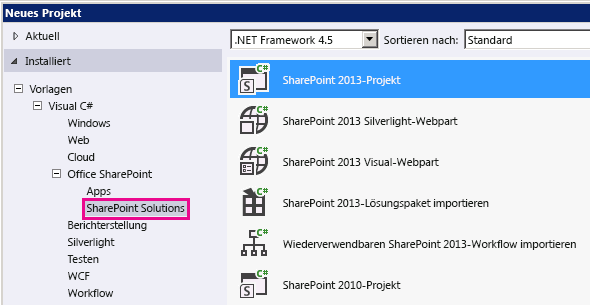

# <a name="how-to-customize-a-field-type-using-client-side-rendering"></a>Vorgehensweise: Anpassen eines Feldtyps mithilfe vom clientseitigem Rendering
In diesem Artikel erfahren Sie, wie Sie einen Feldtyp mithilfe der clientseitigen Renderingtechnologie in SharePoint anpassen. Durch clientseitiges Rendering wird ein Mechanismus verfügbar, mit dem Sie Ihre eigene Ausgabe für eine Gruppe von Steuerelementen, die in einer SharePoint-Seite gehostet sind, generieren können. Dieser Mechanismus ermöglicht Ihnen die Verwendung bekannter Technologien, wie HTML und JavaScript, um die Rendering-Logik von SharePoint-Listenansichten zu definieren. Beim clientseitigen Rendering können Sie Ihre eigenen JavaScript-Ressourcen angeben und sie in den für Ihre Farmlösung verfügbaren Datenspeicheroptionen, wie z. B. dem _layouts-Ordner, hosten.
  
    
    


## <a name="prerequisites-for-using-the-examples-in-this-article"></a>Voraussetzungen für die Verwendung der Beispiele in diesem Artikel
<a name="SP15CustomizeafieldtypeusingCSR_Prereq"> </a>

Um die Schritte in diesem Beispiel auszuführen, benötigen Sie Folgendes:
  
    
    

- Microsoft Visual Studio 2012
    
  
- Office Developer Tools für Visual Studio 2012
    
  
- Eine SharePoint-Entwicklungsumgebung
    
  
Weitere Informationen über das Einrichten Ihrer SharePoint-Entwicklungsumgebung finden Sie unter  [Einrichten einer allgemeinen Entwicklungsumgebung für SharePoint](set-up-a-general-development-environment-for-sharepoint.md).
  
    
    

### <a name="core-concepts-to-help-you-understand-client-side-rendering-for-field-types"></a>Kernkonzepte zum Verständnis des clientseitigen Renderings für Feldtypen

In der folgenden Tabelle sind hilfreiche Artikel aufgeführt, die ein besseres Verständnis der Konzepte und Schritte bei einem Szenarium mit benutzerdefinierten Aktionen ermöglichen.
  
    
    

**Tabelle 1. Kernkonzepte des clientseitigen Renderings für Feldtypen**


|**Titel des Artikels**|**Beschreibung**|
|:-----|:-----|
| [Erstellen von Farmlösungen in SharePoint](build-farm-solutions-in-sharepoint.md) <br/> |Erfahren Sie mehr über die Entwicklung, Verpackung und Bereitstellung von administrativen Erweiterungen für SharePoint mit Farmlösungen.  <br/> |
| 
  [Benutzerdefinierte Feldtypen](http://msdn.microsoft.com/en-us/library/ms446361.aspx) <br/> |Erfahren Sie mehr über das Erstellen von benutzerdefinierten Feldtypen. Beim Speichern Ihrer Unternehmensinformationen in SharePoint kann es vorkommen, dass Ihre Daten nicht den Feldtypen entsprechen, die in SharePoint Foundation verfügbar sind, oder Sie möchten vielleicht einfach diese Feldtypen anpassen. Benutzerdefinierte Felder können eine benutzerdefinierte Datenüberprüfung und benutzerdefiniertes Feldrendering umfassen.  <br/> |
   

## <a name="code-example-customize-the-rendering-process-for-a-custom-field-type-in-a-view-form"></a>Codebeispiel: Anpassen des Renderingprozesses für einen benutzerdefinierten Feldtyp in einem Ansichtsformular
<a name="SP15CustomizeafieldtypeusingCSR_Codeexample"> </a>

Führen Sie die folgenden Schritte aus, um den Renderingprozess für einen benutzerdefinierten Feldtyp anzupassen:
  
    
    

1. Erstellen Sie das Farmlösung-Projekt.
    
  
2. Fügen Sie eine Klasse für den benutzerdefinierten Feldtyp hinzu.
    
  
3. Fügen Sie eine XML-Definition für den benutzerdefinierten Feldtyp hinzu.
    
  
4. Fügen Sie eine JavaScript-Datei für die Renderinglogik des benutzerdefinierten Feldtyps hinzu.
    
  
Abbildung 1 zeigt eine Ansichtsformular mit einem benutzerdefinierten, gerenderten Feldtyp.
  
    
    

**Abbildung 1. Benutzerdefiniertes, clientseitig gerendertes Feld in einem Ansichtsformular**

  
    
    

  
    
    
  
  
    
    

### <a name="to-create-the-farm-solution-project"></a>So erstellen Sie das Farmlösung-Projekt


1. Öffnen Sie Visual Studio 2012 als Administrator. (Klicken Sie dazu im Menü **Start** mit der rechten Maustaste auf das Symbol für Visual Studio 2012, und wählen Sie **Als Administrator ausführen** aus.)
    
  
2. Erstellen Sie ein neues Projekt unter Verwendung der Vorlage **SharePoint-Projekt**.
    
    Abbildung 2 zeigt den Speicherort der Vorlage **SharePoint-Projekt** in Visual Studio 2012 unter **Vorlagen**, **Visual C#**, **Office SharePoint**, **SharePoint-Lösungen**.
    

   **Abbildung 2. Visual Studio-Vorlage für SharePoint-Projekt**

  

  
  

  

  
3. Geben Sie die URL der SharePoint-Website an, die Sie für das Debugging verwenden möchten.
    
  
4. Wählen Sie die Option **Als Farmlösung bereitstellen** aus.
    
  

### <a name="to-add-a-class-for-the-custom-field-type"></a>So fügen Sie eine Klasse für den benutzerdefinierten Feldtyp hinzu


1. Klicken Sie mit der rechten Maustaste auf das Farmlösung-Projekt, und fügen Sie eine neue Klasse hinzu. Benennen Sie die Klassendatei FavoriteColorFieldType.cs.
    
  
2. Kopieren Sie den folgenden Code, und fügen Sie ihn in die Datei FavoriteColorFieldType.cs ein. Der Code führt folgende Aufgaben aus:
    
  - Deklariert eine **FavoriteColorField**-Klasse, die von **SPFieldText** erbt.
    
  
  - Stellt zwei Konstruktoren für die **FavoriteColorField**-Klasse bereit.
    
  
  - Überschreibt die **JSLink**-Eigenschaft.
    
    > **Hinweis:** Die JSLink-Eigenschaft wird für Umfrage- oder Ereignislisten nicht unterstützt. Ein SharePoint-Kalender ist eine Ereignisliste. 

```cs
using System;
using System.Collections.Generic;
using System.Linq;
using System.Text;
using System.Threading.Tasks;

// Additional references for this sample.
using Microsoft.SharePoint;
using Microsoft.SharePoint.WebControls;

namespace Microsoft.SDK.SharePoint.Samples.WebControls
{
    /// <summary>
    /// The FavoriteColorField custom field type 
    /// inherits from SPFieldText.
    /// Users can input the color in the field 
    /// just like in any other text field.
    /// But the field will provide additional 
    /// rendering logic when displaying 
    /// the field in a view form.
    /// </summary>
    public class FavoriteColorField : SPFieldText
    {
        // The solution deploys the JavaScript 
        // file to the CSRAssets folder 
        // in the WFE's layouts folder.
        private const string JSLinkUrl = 
            "~site/_layouts/15/CSRAssets/CSRFieldType.js";

        // You have to provide constructors for SPFieldText.
        public FavoriteColorField(
            SPFieldCollection fields, 
            string name) :
            base(fields, name)
        {

        }
        public FavoriteColorField(
            SPFieldCollection fields, 
            string typename, 
            string name) :
            base(fields, typename, name)
        {

        }

        /// <summary>
        /// Override the JSLink property to return the 
        /// value of our custom JavaScript file.
        /// </summary>
        public override string JSLink
        {
            get
            {
                return JSLinkUrl;
            }
            set
            {
                base.JSLink = value;
            }
        }
    }
}            
```


### <a name="to-add-an-xml-definition-for-the-custom-field-type"></a>So fügen Sie eine XML-Definition für den benutzerdefinierten Feldtyp hinzu


1. Klicken Sie mit der rechten Maustaste auf das Farmlösung-Projekt, und fügen Sie einen zugeordneten SharePoint-Ordner hinzu. Wählen Sie im Dialogfeld den Ordner **{SharePointRoot}\\Template\\XML** aus.
    
  
2. Klicken Sie mit der rechten Maustaste auf den im letzten Schritt erstellten XML-Ordner, und fügen Sie eine neue XML-Datei hinzu. Benennen Sie die XML-Datei fldtypes_FavoriteColorFieldType.xml.
    
  
3. Kopieren Sie das folgende Markup, und fügen Sie es in die XML-Datei ein. Das Markup führt die folgenden Aufgaben aus:
    
  - Stellt den Typnamen für den Feldtyp bereit.
    
  
  - Gibt den vollständigen Klassennamen für den Feldtyp an. Dies ist die Klasse, die Sie im vorherigen Schritt erstellt haben.
    
  
  - Stellt zusätzliche Attribute für den Feldtyp bereit.
    
  
```XML
    <?xml version="1.0" encoding="utf-8" ?>
    <FieldTypes>
      <FieldType>
        <Field Name="TypeName">FavoriteColorField</Field>
        <Field Name="TypeDisplayName">Favorite color field</Field>
        <Field Name="TypeShortDescription">Favorite color field</Field>
        <Field Name="FieldTypeClass">Microsoft.SDK.SharePoint.Samples.WebControls.FavoriteColorField, $SharePoint.Project.AssemblyFullName$</Field>
        <Field Name="ParentType">Text</Field>
        <Field Name="Sortable">TRUE</Field>
        <Field Name="Filterable">TRUE</Field>
        <Field Name="UserCreatable">TRUE</Field>
        <Field Name="ShowOnListCreate">TRUE</Field>
        <Field Name="ShowOnSurveyCreate">TRUE</Field>
        <Field Name="ShowOnDocumentLibrary">TRUE</Field>
        <Field Name="ShowOnColumnTemplateCreate">TRUE</Field>
      </FieldType>
    </FieldTypes>
```

### <a name="to-add-a-javascript-file-for-the-rendering-logic-of-the-custom-field-type"></a>So fügen Sie eine JavaScript-Datei für die Renderinglogik des benutzerdefinierten Feldtyps hinzu


1. Klicken Sie mit der rechten Maustaste auf das Farmlösung-Projekt, und fügen Sie einen zugeordneten SharePoint-Ordner „Layouts" hinzu. Fügen Sie einen neuen CSRAssets-Ordner zu dem zuletzt hinzugefügten Ordner „Layouts" hinzu.
    
  
2. Klicken Sie mit der rechten Maustaste auf den im letzten Schritt erstellten Ordner „CSRAssets", und fügen Sie eine neue JavaScript-Datei hinzu. Benennen Sie die JavaScript-Datei CSRFieldType.js.
    
  
3. Kopieren Sie den folgenden Code, und fügen Sie ihn in die Datei JavaScript ein. Der Code führt folgende Aufgaben aus:
    
  - Erstellt eine Vorlage für das Feld, wenn dieses in einem Ansichtsformular angezeigt wird.
    
  
  - Registriert die Vorlage.
    
  
  - Stellt die Renderinglogik für den Feldtyp bei Verwendung in einem Ansichtsformular bereit.
    
  

```javascript
(function () {
    var favoriteColorContext = {};

    // You can provide templates for:
    // View, DisplayForm, EditForm and NewForm
    favoriteColorContext.Templates = {};
    favoriteColorContext.Templates.Fields = {
        "FavoriteColorField": {
            "View": favoriteColorViewTemplate
        }
    };

    SPClientTemplates.TemplateManager.RegisterTemplateOverrides(
        favoriteColorContext
        );
})();

// The favoriteColorViewTemplate provides the rendering logic
// the custom field type when it is displayed in the view form.
function favoriteColorViewTemplate(ctx) {
    var color = ctx.CurrentItem[ctx.CurrentFieldSchema.Name];
    return "<span style='background-color : " + color +
        "' >&amp;nbsp;&amp;nbsp;&amp;nbsp;&amp;nbsp;</span>&amp;nbsp;" + color;
}
```

### <a name="to-build-and-run-the-solution"></a>So erstellen Sie die Lösung und führen Sie sie aus


1. Drücken Sie F5.
    
    > **Hinweis:** Wenn Sie F5 drücken, erstellt Visual Studio die Lösung, stellt die Lösung bereit und öffnet die SharePoint-Website, auf der die Lösung bereitgestellt wird. 
2. Erstellen Sie eine benutzerdefinierte Liste, und fügen Sie eine neue Feldspalte für die bevorzugte Farbe hinzu.
    
  
3. Fügen Sie ein Element zur Liste hinzu, und geben Sie einen Wert für die Spalte mit der bevorzugten Farbe an.
    
  
4. Abbildung 3 zeigt die Seite zum Erstellen der Spalte mit dem neuen benutzerdefinierten Feldtyp.
    
   **Abbildung 3. Erstellen einer Spalte mit dem neuen benutzerdefinierten Feldtyp**

  

  
  

  

  


|**Problem**|**Lösung**|
|:-----|:-----|
|Feldtyp **FavoriteColorField** ist nicht ordnungsgemäß installiert. Wechseln Sie zu der Seite mit den Listeneinstellungen, um dieses Feld zu löschen.<br/> |Führen Sie den folgenden Befehl an einer Eingabeaufforderung mit erhöhten Rechten aus: **iisreset /noforce**. <br/> **Vorsicht:** Wenn Sie die Lösung in einer Produktionsumgebung bereitstellen, warten Sie auf einen geeigneten Zeitpunkt. um den Webserver mithilfe von **iisreset /noforce** zurückzusetzen.          |
   

## <a name="next-steps"></a>Nächste Schritte
<a name="SP15CustomizeafieldtypeusingCSR_Nextsteps"> </a>

In diesem Artikel wird beschrieben, wie der Renderingprozess für einen benutzerdefinierten Feldtyp angepasst wird. Als nächsten Schritt können Sie mehr zu benutzerdefinierten Feldtypen erfahren. Weitere Informationen finden Sie unter den folgenden Themen:
  
    
    

-  
  [Vorgehensweise: Erstellen eines benutzerdefinierten Feldtyps](http://msdn.microsoft.com/en-us/library/bb862248.aspx)
    
  
-  
  [ Exemplarische Vorgehensweise: Erstellen eines benutzerdefinierten Feldtyps](http://msdn.microsoft.com/en-us/library/bb861799.aspx)
    
  
-  [Anpassen einer Listenansicht in Add-Ins für SharePoint durch clientseitiges Rendering](http://msdn.microsoft.com/library/8d5cabb2-70d0-46a0-bfe0-9e21f8d67d86%28Office.15%29.aspx)
    
  

## <a name="additional-resources"></a>Zusätzliche Ressourcen
<a name="SP15CustomizeafieldtypeusingCSR_AddResources"> </a>


-  [Einrichten einer allgemeinen Entwicklungsumgebung für SharePoint](set-up-a-general-development-environment-for-sharepoint.md)
    
  
-  [Erstellen von Websites für SharePoint](build-sites-for-sharepoint.md)
    
  
-  [Neuerungen für Entwickler in SharePoint](what-s-new-for-developers-in-sharepoint.md)
    
  
-  [Hinzufügen von SharePoint-Funktionen](add-sharepoint-capabilities.md)
    
  
-  [Erstellen von Farmlösungen in SharePoint](build-farm-solutions-in-sharepoint.md)
    
  
