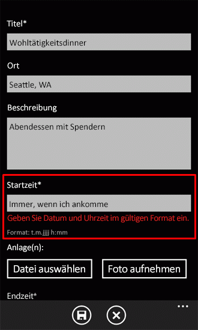

# <a name="how-to-implement-business-logic-and-data-validation-in-a-windows-phone-app-for-sharepoint"></a><span data-ttu-id="d1df4-102">Vorgehensweise: Implementieren von Validierung von Business Logik und die Daten in einem Windows Phone-app für SharePoint</span><span class="sxs-lookup"><span data-stu-id="d1df4-102">How to: Implement business logic and data validation in a Windows Phone app for SharePoint</span></span>
<span data-ttu-id="d1df4-p101">Implementieren Sie Datenvalidierung in einer Windows Phone-App, die mithilfe der Windows Phone - SharePoint-Listenanwendungsvorlage erstellt wurde. Verwenden Sie in einer Windows Phone-app für die Produktionsumgebung vorgesehen ist, müssen Sie wahrscheinlich von Benutzern auf, Geschäftslogik für den bestimmten Umständen relevant erzwungen, um sicherzustellen, dass geeignete Formatierung der eingegebenen Werte oder einfach zum Abfangen von Fehlern vor dem Speichern von Werten in einer SharePoint-Liste eingegebene Daten zu überprüfen. Projekte, die basierend auf der Vorlage Windows Phone SharePoint List Application standardmäßig Daten Überprüfungslogik unter anderem solche Projekte auch einen Mechanismus für Entwickler zum Implementieren der benutzerdefinierten Datenüberprüfung bereitstellen.</span><span class="sxs-lookup"><span data-stu-id="d1df4-p101">Implement data validation in a Windows Phone app created by using the Windows Phone SharePoint List Application template. In a Windows Phone app intended for production use, you likely need to validate data entered by users to, for example, enforce business logic relevant to your particular circumstances, or to ensure appropriate formatting of entered values, or simply to catch mistakes before saving values to a SharePoint list. Projects based on the Windows Phone SharePoint List Application template include default data validation logic, but such projects also provide a mechanism for developers to implement custom data validation.</span></span>
  
    
    


> <span data-ttu-id="d1df4-106">**Wichtig:** Wenn Sie eine App für Windows Phone 8 entwickeln, müssen Sie Visual Studio Express 2012 anstelle von Visual Studio 2010 Express verwenden.</span><span class="sxs-lookup"><span data-stu-id="d1df4-106">**Important** If you are developing an app for Windows Phone 8, you must use Visual Studio Express 2012 instead of Visual Studio 2010 Express. Except for the development environment, all information in this article applies to creating apps for both Windows Phone 8 and Windows Phone 7.</span></span> <span data-ttu-id="d1df4-107">Mit Ausnahme der Entwicklungsumgebung gelten alle Informationen in diesem Artikel für das Erstellen von Apps sowohl auf Windows Phone 8 als auch auf Windows Phone 7.</span><span class="sxs-lookup"><span data-stu-id="d1df4-107">Important If you are developing an app for Windows Phone 8, you must use Visual Studio Express 2012 instead of Visual Studio 2010 Express. Except for the development environment, all information in this article applies to creating apps for both Windows Phone 8 and Windows Phone 7.</span></span> <span data-ttu-id="d1df4-108">Weitere Informationen finden Sie unter [Vorgehensweise: Einrichten einer Umgebung für die Entwicklung mobiler Apps für SharePoint](how-to-set-up-an-environment-for-developing-mobile-apps-for-sharepoint.md).</span><span class="sxs-lookup"><span data-stu-id="d1df4-108">For more information, see  [How to: Set up an environment for developing mobile apps for SharePoint](how-to-set-up-an-environment-for-developing-mobile-apps-for-sharepoint.md).</span></span> 
  
    
    


## <a name="default-data-validation-rules"></a><span data-ttu-id="d1df4-109">Standardmäßige Datenüberprüfungsregeln</span><span class="sxs-lookup"><span data-stu-id="d1df4-109">Default data validation rules</span></span>
<span data-ttu-id="d1df4-110"><a name="BKMK_DefaultValidation"> </a></span><span class="sxs-lookup"><span data-stu-id="d1df4-110"></span></span>

<span data-ttu-id="d1df4-p103">Einige Datentypen für Felder in SharePoint-Listen sind standardmäßig einfache Formatierung oder Gültigkeitsprüfung zugeordnet. Wenn Sie eingeben eine ungültige URL für ein Feld basierend auf dem Feld Hyperlink oder Bild, geben Sie in einer SharePoint-Liste, und versuchen, die Änderungen zu speichern, eine Meldung angezeigt, die angibt, dass die eingegebene Adresse ungültig ist. Wenn Sie einen Kundennamen als einen Wert eingeben Feldtyp für ein Feld basierend auf Datum und Uhrzeit, eine Meldung leiten Sie ein Datum in einem gültigen Bereich für das Feld eingeben.</span><span class="sxs-lookup"><span data-stu-id="d1df4-p103">Some data types for fields in SharePoint lists are associated by default with simple formatting or data validation. If you enter an invalid URL for a field based on the Hyperlink or Picture field type in a SharePoint list and attempt to save your changes, you see a message indicating that the address you entered is invalid. If you enter a customer name as a value for a field based on the Date and Time field type, you receive a message directing you to enter a date within a valid range for the field.</span></span>
  
    
    

> <span data-ttu-id="d1df4-114">**Hinweis:** Die Überprüfung der Datumseingabe erfolgt unter Berücksichtigung des SharePoint-Datumsformats.</span><span class="sxs-lookup"><span data-stu-id="d1df4-114">**Note:** Date input validation is with respect to SharePoint date format.</span></span> <span data-ttu-id="d1df4-115">Wenn das Datumsformat des Gebietsschemas des Smartphones erforderlich ist, passen Sie das Feld an und fügen Sie die entsprechenden Prüfungen hinzu.</span><span class="sxs-lookup"><span data-stu-id="d1df4-115">Note Date input validation is with respect to SharePoint date format. If the date format of the phone locale is required, customize the field and add validations accordingly.</span></span> 
  
    
    

<span data-ttu-id="d1df4-p105">Einige dieser grundlegende Validierungsregeln gelten auch standardmäßig in einer Windows Phone-app aus der Vorlage für Windows Phone SharePoint List Application erstellt. Wenn Sie etwas anderes als ein Date-Wert in einem Feld, die an ein SharePoint-Feld vom Typ von Datum und Uhrzeit in dem Formular bearbeiten einer Windows Phone-App basierend auf einer SharePoint-Liste gebunden ist eingeben, sehen Sie eine Fehlermeldung der Datenüberprüfung Wenn der Fokus aus dem Feld zugeordnete **TextBox** Steuerelement wechselt. (Siehe Abbildung 1).</span><span class="sxs-lookup"><span data-stu-id="d1df4-p105">Some of these basic validation rules are also enforced by default in a Windows Phone app created from the Windows Phone SharePoint List Application template. If you enter anything other than a date value in a field that is bound to a SharePoint field of Date and Time type in the Edit form of a Windows Phone app based on a SharePoint list, you see a validation error message when the focus shifts from the **TextBox** control associated with the field. (See Figure 1.)</span></span>
  
    
    

<span data-ttu-id="d1df4-119">**Abbildung 1. Validierungsfehler in einer Windows Phone-app**</span><span class="sxs-lookup"><span data-stu-id="d1df4-119">**Figure 1. Validation error cue in a Windows Phone app**</span></span>

  
    
    

  
    
    

  
    
    
<span data-ttu-id="d1df4-p106">Das Textfeld mit der Bezeichnung "Startzeit" im Formular bearbeiten ist an ein Feld Datum und Uhrzeit in der SharePoint-Liste gebunden, auf der dieser Beispiel-app basiert. Die in Abbildung 1 gezeigte Gültigkeitsprüfungsfehlers (als roter Text) angezeigt wird, wenn ein ungültiges Datum wird in das Textfeld eingegeben (und anschließend das Textfeld den Fokus verliert), da die **ValidatesOnNotifyDataErrors** -Eigenschaft des zugeordneten der **Text** -Eigenschaft des Steuerelements **TextBox** **Binding** -Objekts auf **True** in der XAML-Deklaration festgelegt ist, die die **TextBox** in der Datei EditForm.xaml definiert.</span><span class="sxs-lookup"><span data-stu-id="d1df4-p106">The text box labeled "Start Time" in the Edit form is bound to a Date and Time field in the SharePoint list on which this sample app is based. The validation error cue (in red text) shown in Figure 1 appears if an invalid date is entered in the text box (and the text box subsequently loses focus) because the **ValidatesOnNotifyDataErrors** property of the **Binding** object associated with the **Text** property of the **TextBox** control is set to **True** in the XAML declaration that defines the **TextBox** in the EditForm.xaml file.</span></span>
  
    
    


```XML

<StackPanel Orientation="Vertical" Margin="0,5,0,5">
   <TextBlock TextWrapping="Wrap" HorizontalAlignment="Left" 
                    Style="{StaticResource PhoneTextNormalStyle}">Start Time*
   </TextBlock>
   <TextBox Height="Auto" Style="{StaticResource TextValidationTemplate}"
    FontSize="{StaticResource PhoneFontSizeNormal}" Width="470" 
        HorizontalAlignment="Left" Name="txtEventDate"
    Text="{Binding [EventDate], Mode=TwoWay, ValidatesOnNotifyDataErrors=True,
                       NotifyOnValidationError=True}"
    TextWrapping="Wrap" />
   <TextBlock FontSize="16" TextWrapping="Wrap" HorizontalAlignment="Left"
    Style="{StaticResource PhoneTextSubtleStyle}" Text="{Binding DateTimeFormat}" />
</StackPanel>
```

<span data-ttu-id="d1df4-p107">(Wenn die **ValidatesOnNotifyDataErrors** -Eigenschaft auf **False**festgelegt ist, hat der Benutzer keinen Hinweis, dass die eingegebenen Daten ungültig ist, bis die Schaltfläche **Speichern** ausgewählt ist. An diesem Punkt wird dem Benutzer eine Fehlermeldung über Validierungsfehler, da Format Überprüfung auf eingegebenen Datumswerten weiterhin von der Basisklasse durchgeführt wird von der **EditItemViewModel** -Klasse abgeleitet wird.)</span><span class="sxs-lookup"><span data-stu-id="d1df4-p107">(If the **ValidatesOnNotifyDataErrors** property is set to **False**, the user has no indication that the entered data is invalid until the **Save** button is chosen. At that point, the user sees an error message regarding validation errors, because format validation on entered date values is still carried out by the base class from which the **EditItemViewModel** class is derived.)</span></span>
  
    
    
<span data-ttu-id="d1df4-p108">Jedoch einige Felder möglicherweise keine Benachrichtigungen für ungültige Daten in der Windows Phone-app bereit. Und ausgereiften Visual Studio-Projektvorlagen sind unbedingt allgemeiner (engl.), um als Ausgangspunkt für viele verschiedene Anwendungen verwendet werden. Die Vorlage Windows Phone SharePoint List Application kann nicht gehören das Validierungsregeln für bestimmte Kontexte und seinen Wert als allgemeine Vorlage noch beibehalten. Je nach Ihren Anforderungen und den Fällen, in denen Ihre bestimmten Windows Phone-app verwendet wird, werden Sie wahrscheinlich Ihre eigenen benutzerdefinierten Datenüberprüfung Regeln implementieren möchten.</span><span class="sxs-lookup"><span data-stu-id="d1df4-p108">But some fields may not provide any notification for invalid data in the Windows Phone app. And well-designed Visual Studio project templates are necessarily generalized to be used as a starting point for many different applications. The Windows Phone SharePoint List Application template can't include validation rules relevant to specific contexts and yet retain its value as a generalized template. Depending on your needs and the circumstances in which your particular Windows Phone app will be used, you likely will want to implement your own custom data-validation rules.</span></span>
  
    
    

## <a name="implement-custom-data-validation-rules"></a><span data-ttu-id="d1df4-129">Implementieren der benutzerdefinierten Datenüberprüfung Regeln</span><span class="sxs-lookup"><span data-stu-id="d1df4-129">Implement custom data-validation rules</span></span>
<span data-ttu-id="d1df4-130"><a name="BKMK_CustomValidation"> </a></span><span class="sxs-lookup"><span data-stu-id="d1df4-130"></span></span>

<span data-ttu-id="d1df4-p109">You can validate data entered by users of your Windows Phone app in several ways. A project created by using the Windows Phone SharePoint List Application template includes classes that serve as intermediaries between the forms (that is, the views) of the data in the Windows Phone app (for example, the EditForm.xaml file) and the data itself in the SharePoint list on which the app is based. These classes can be considered implementations of the ViewModel component of the  [Model-View-ViewModel design pattern](http://blogs.msdn.com/b/johngossman/archive/2005/10/08/478683.aspx) (Figure 2). (For more information about how the Windows Phone SharePoint List Application template conforms to the MVVM software design pattern, see [Architektur der Vorlage Windows Phone SharePoint-Liste-Anwendung](architecture-of-the-windows-phone-sharepoint-list-application-template.md).)</span><span class="sxs-lookup"><span data-stu-id="d1df4-p109">You can validate data entered by users of your Windows Phone app in several ways. A project created by using the Windows Phone SharePoint List Application template includes classes that serve as intermediaries between the forms (that is, the views) of the data in the Windows Phone app (for example, the EditForm.xaml file) and the data itself in the SharePoint list on which the app is based. These classes can be considered implementations of the ViewModel component of the  [Model-View-ViewModel design pattern](http://blogs.msdn.com/b/johngossman/archive/2005/10/08/478683.aspx) (Figure 2). (For more information about how the Windows Phone SharePoint List Application template conforms to the MVVM software design pattern, see [Architecture of the Windows Phone SharePoint List Application template](architecture-of-the-windows-phone-sharepoint-list-application-template.md).)</span></span>
  
    
    

> <span data-ttu-id="d1df4-135">**Hinweis:** Die SharePoint-Listenvorlagen enthalten keine standardmäßigen Überprüfungen (wie z. B. den Prozentsatz des Abschlusses in einer SharePoint-Aufgabenliste, die vorherige Überprüfung in einer Team-Diskussionsliste und die SP-Dezimalfeld-Typenüberprüfung), aber Sie können solche Überprüfungen implementieren.</span><span class="sxs-lookup"><span data-stu-id="d1df4-135">**Note** The SharePoint list templates do not include default validations (such as percentage complete in a SharePoint task list, post check for a team discussion list, and SP decimal field type validation), but you can implement such validations.</span></span> 
  
    
    


<span data-ttu-id="d1df4-136">**Abbildung 2. Vorlagendateien in der ViewModel-Komponente**</span><span class="sxs-lookup"><span data-stu-id="d1df4-136">**Figure 2. Template files in ViewModel component**</span></span>

  
    
    

  
    
    

  
    
    
<span data-ttu-id="d1df4-p110">In Anwendungen basierend auf dem MVVM-Muster, ist häufig die Datenüberprüfung in der Datenebene behandelt (d. h., in dem Modell Komponente). In Projekten, die aus der Vorlage für Windows Phone SharePoint List Application erstellt, ein erweiterbaren Mechanismus für die Datenüberprüfung wurde "abgelegt" eine Ebene und in der ViewModel-Komponente zu vereinfachen für Entwickler zum Verwalten von Datenüberprüfung implementiert. In Projekten auf Grundlage der Vorlage ist daher die am besten geeigneten Position für benutzerdefinierten Code, der von Benutzereingaben überprüft oder anderweitig verwaltet werden Daten in diesen ViewModel-Klassen. Im Hinblick auf die Datenüberprüfung, die **EditItemViewModel** -Klasse und die **NewItemViewModel** -Klasse (die Klassen im Zusammenhang mit den Formularen, die am ehesten umfassen, bearbeiten und Aktualisieren von Listendaten) enthalten sowohl eine offene Implementierung einer Validierung-Methode (mit dem Namen **Validate**), die die Basis Validation-Methode in der Klasse überschreibt, von der diese beiden Klassen abgeleitet werden.</span><span class="sxs-lookup"><span data-stu-id="d1df4-p110">In applications designed based on the MVVM pattern, data validation is often handled in the data layer (that is, in the Model component). In projects created from the Windows Phone SharePoint List Application template, an extensible mechanism for data validation has been "pushed up" a layer and implemented in the ViewModel component, to make it easier for developers to manage data validation. In projects based on the template, therefore, the most suitable place for custom code that validates user input or otherwise manages data is in these ViewModel classes. In terms of data validation, the **EditItemViewModel** class and the **NewItemViewModel** class (the classes associated with the forms most likely to involve editing and updating list data) both provide an open implementation of a validation method (named **Validate**) that overrides the base validation method in the class from which these two classes are derived.</span></span>
  
    
    


```cs

public override void Validate(string fieldName, object value)
   {
      base.Validate(fieldName, value);
   }
```

<span data-ttu-id="d1df4-p111">Diese Methode bieten eine komfortable Möglichkeit zum Hinzufügen von benutzerdefinierten Überprüfungslogik dieser Ziele einzelne Felder-Entwickler. Der allgemeine Ansatz ist, überprüfen Sie den Wert des **fieldName** -Arguments übergeben an die **Validate** -Methode, um das Feld zu identifizieren, dass Sie mit der benutzerdefinierten Überprüfungscode zuordnen möchten. Beispielsweise eine **switch** -Anweisung in der Implementierung dieser Methode können Überprüfungslogik speziell für die verschiedenen Felder im Formular bearbeiten (EditForm.xaml) Ihrer App für Windows bereitstellen.</span><span class="sxs-lookup"><span data-stu-id="d1df4-p111">This method provides a convenient mechanism to the developer for adding custom validation logic that targets individual fields. The general approach is to check the value of the **fieldName** argument passed to the **Validate** method to identify the field you want to associate with your custom validation code. You can, for example, use a **switch** statement in your implementation of this method to supply validation logic specific to various fields in the Edit form (EditForm.xaml) of your Windows app.</span></span>
  
    
    
<span data-ttu-id="d1df4-p112">Im folgenden Codebeispiel wird davon ausgegangen Sie, dass eine Installation von SharePoint Server eine Produktbestellungen Liste aus der Vorlage benutzerdefinierte Liste erstellt wurde. Die Liste mit den Spalten und Feldtypen erstellt wurde in Tabelle 1 dargestellt.</span><span class="sxs-lookup"><span data-stu-id="d1df4-p112">For the following code example, assume that an installation of SharePoint Server has a Product Orders list created from the Custom List template. The list has been created with the columns and field types shown in Table 1.</span></span>
  
    
    

<span data-ttu-id="d1df4-147">**In Tabelle 1. Orders Produktliste**</span><span class="sxs-lookup"><span data-stu-id="d1df4-147">**Table 1. Product Orders list**</span></span>


|<span data-ttu-id="d1df4-148">**Spalte**</span><span class="sxs-lookup"><span data-stu-id="d1df4-148">**Column**</span></span>|<span data-ttu-id="d1df4-149">**Typ**</span><span class="sxs-lookup"><span data-stu-id="d1df4-149">**Type**</span></span>|<span data-ttu-id="d1df4-150">**Erforderlich**</span><span class="sxs-lookup"><span data-stu-id="d1df4-150">**Required**</span></span>|
|:-----|:-----|:-----|
|<span data-ttu-id="d1df4-151">Product (d. h., Titel)</span><span class="sxs-lookup"><span data-stu-id="d1df4-151">Product (i.e., Title)</span></span>  <br/> |<span data-ttu-id="d1df4-152">Einzelne Textzeile (Text)</span><span class="sxs-lookup"><span data-stu-id="d1df4-152">Single line of text (Text)</span></span>  <br/> |<span data-ttu-id="d1df4-153">Ja</span><span class="sxs-lookup"><span data-stu-id="d1df4-153">Yes</span></span>  <br/> |
|<span data-ttu-id="d1df4-154">Beschreibung</span><span class="sxs-lookup"><span data-stu-id="d1df4-154">Description</span></span>  <br/> |<span data-ttu-id="d1df4-155">Einzelne Textzeile (Text)</span><span class="sxs-lookup"><span data-stu-id="d1df4-155">Single line of text (Text)</span></span>  <br/> |<span data-ttu-id="d1df4-156">Nein</span><span class="sxs-lookup"><span data-stu-id="d1df4-156">No</span></span>  <br/> |
|<span data-ttu-id="d1df4-157">Menge</span><span class="sxs-lookup"><span data-stu-id="d1df4-157">Quantity</span></span>  <br/> |<span data-ttu-id="d1df4-158">Zahl</span><span class="sxs-lookup"><span data-stu-id="d1df4-158">Number</span></span>  <br/> |<span data-ttu-id="d1df4-159">Ja</span><span class="sxs-lookup"><span data-stu-id="d1df4-159">Yes</span></span>  <br/> |
|<span data-ttu-id="d1df4-160">Bestelldatum</span><span class="sxs-lookup"><span data-stu-id="d1df4-160">Order Date</span></span>  <br/> |<span data-ttu-id="d1df4-161">Datum und Uhrzeit (DateTime)</span><span class="sxs-lookup"><span data-stu-id="d1df4-161">Date and Time (DateTime)</span></span>  <br/> |<span data-ttu-id="d1df4-162">Nein</span><span class="sxs-lookup"><span data-stu-id="d1df4-162">No</span></span>  <br/> |
|<span data-ttu-id="d1df4-163">Erfüllungsdatum</span><span class="sxs-lookup"><span data-stu-id="d1df4-163">Fulfillment Date</span></span>  <br/> |<span data-ttu-id="d1df4-164">Datum und Uhrzeit (DateTime)</span><span class="sxs-lookup"><span data-stu-id="d1df4-164">Date and Time (DateTime)</span></span>  <br/> |<span data-ttu-id="d1df4-165">Nein</span><span class="sxs-lookup"><span data-stu-id="d1df4-165">No</span></span>  <br/> |
|<span data-ttu-id="d1df4-166">Rufnummer</span><span class="sxs-lookup"><span data-stu-id="d1df4-166">Contact Number</span></span>  <br/> |<span data-ttu-id="d1df4-167">Einzelne Textzeile (Text)</span><span class="sxs-lookup"><span data-stu-id="d1df4-167">Single line of text (Text)</span></span>  <br/> |<span data-ttu-id="d1df4-168">Nein</span><span class="sxs-lookup"><span data-stu-id="d1df4-168">No</span></span>  <br/> |
   
<span data-ttu-id="d1df4-169">Erneut aus, für die in diesem Beispiel wird, wird davon ausgegangen Sie, dass die folgenden einfachen Validierungsregeln erzwungen werden soll, basierend auf der Geschäftslogik, die an das fiktive Unternehmen Contoso, Ltd. für ein bestimmtes Produkt Sortierung System eingesetzt werden:</span><span class="sxs-lookup"><span data-stu-id="d1df4-169">Again, for the purposes of this example, assume that the following simple validation rules are to be enforced, based on the business logic employed at the fictitious company Contoso, Ltd., for a given product ordering system:</span></span>
  
    
    

- <span data-ttu-id="d1df4-170">Auftragserfüllung Datumsangaben für Bestellungen müssen nach dem Datum sein, auf denen die Bestellung aufgegeben wurde.</span><span class="sxs-lookup"><span data-stu-id="d1df4-170">Fulfillment dates for orders must be later than the date on which the order was placed.</span></span>
    
  
- <span data-ttu-id="d1df4-p113">Wenn ein Kunde ein Produkt mit dem Namen Fuzzy Würfel bestellen möchte, müssen die Würfel paarweise bestellt werden. Entsprechend den besonderen Regeln bei Contoso, Ltd. ist einfach keine so gut wie eine Fuzzy inaktiv.</span><span class="sxs-lookup"><span data-stu-id="d1df4-p113">If a customer wants to place an order for a product named Fuzzy Dice, the dice must be ordered in pairs. According to the peculiar rules at Contoso, Ltd., there is simply no such thing as a Fuzzy Die.</span></span>
    
  
- <span data-ttu-id="d1df4-p114">In der Liste Bestellungen der Feldtyp für Telefonnummern "Eine Textzeile" ist (d. h., Text), Text (bis zu 255 Zeichen in der Standardeinstellung) erfolgen kann. In diesem Beispiel wird eine Überprüfung Formatierungsregel erzwungen werden, die eingegebene Daten in einem gemeinsamen rufnummernformate werden benötigt; beispielsweise "(555) 555-5555".</span><span class="sxs-lookup"><span data-stu-id="d1df4-p114">In the Product Orders list, the field type for phone numbers is "Single line of text" (that is, Text), which can be any text (up to 255 characters by default). For this sample, a formatting validation rule will be enforced that requires entered data to be in one of the common phone number formats; for example, "(555) 555-5555".</span></span>
    
  

### <a name="to-implement-custom-validation-rules"></a><span data-ttu-id="d1df4-175">Zur Implementierung benutzerdefinierter Überprüfungsregeln</span><span class="sxs-lookup"><span data-stu-id="d1df4-175">To implement custom validation rules</span></span>


1. <span data-ttu-id="d1df4-176">Assuming you have created a SharePoint list based on the Custom List template that includes the columns and types specified in Table 1, create a Windows Phone app by using the Windows Phone SharePoint List Application template in Visual Studio by following the steps detailed in  [Vorgehensweise: Erstellen eine Windows Phone SharePoint Liste app](how-to-create-a-windows-phone-sharepoint-list-app.md).</span><span class="sxs-lookup"><span data-stu-id="d1df4-176">Assuming you have created a SharePoint list based on the Custom List template that includes the columns and types specified in Table 1, create a Windows Phone app by using the Windows Phone SharePoint List Application template in Visual Studio by following the steps detailed in  [How to: Create a Windows Phone SharePoint list app](how-to-create-a-windows-phone-sharepoint-list-app.md).</span></span>
    
  
2. <span data-ttu-id="d1df4-177">Klicken Sie im **Projektmappen-Explorer** im Ordner ViewModels für das Projekt doppelklicken Sie auf die Datei EditItemViewModel.cs (oder wählen Sie die Datei, und drücken SieF7) die Datei zur Bearbeitung geöffnet.</span><span class="sxs-lookup"><span data-stu-id="d1df4-177">In **Solution Explorer**, in the ViewModels folder for the project, double-click the EditItemViewModel.cs file (or choose the file and press F7) to open the file for editing.</span></span>
    
  
3. <span data-ttu-id="d1df4-178">Fügen Sie die folgenden **using** Direktiven zur Liste der Direktiven am Anfang der Datei.</span><span class="sxs-lookup"><span data-stu-id="d1df4-178">Add the following **using** directives to the list of directives at the top of the file.</span></span>
    
```cs
  
using System.Globalization;
using System.Text.RegularExpressions;
```

4. <span data-ttu-id="d1df4-179">Ersetzen Sie die Standard-Implementierung der **Überprüfungsmethode** in der Datei durch den folgenden Code.</span><span class="sxs-lookup"><span data-stu-id="d1df4-179">Replace the default implementation of the **Validate** method in the file with the following code.</span></span>
    
```cs
  
public override void Validate(string fieldName, object value)
{
    string fieldValue = value.ToString();
    if (!string.IsNullOrEmpty(fieldValue)) //Allowing for blank fields.
    {
        bool isProperValue = false;

        switch (fieldName)
        {
            case "Quantity":
                // Enforce ordering Fuzzy Dice in pairs only.
                int quantityOrdered;
                isProperValue = Int32.TryParse(fieldValue, out quantityOrdered);
                if (isProperValue)
                {
                    if ((quantityOrdered % 2) != 0) // Odd number of product items ordered.
                    {
                        if ((string)this["Title"] == "Fuzzy Dice")
                        {
                            AddError("Item[Quantity]", "Fuzzy Dice must be ordered in pairs. 
                                                                   No such thing as a Fuzzy Die!");
                        }
                        else
                        {
                            // Restriction on ordering in pairs doesn't apply to other products.
                            RemoveAllErrors("Item[Quantity]");
                        }
                    }
                    else
                    {
                        RemoveAllErrors("Item[Quantity]");
                    }
                }
                break;
            case "Fulfillment_x0020_Date":
                // Determine whether fulfillment date is later than order date.
                DateTime fulfillmentDate;
                isProperValue = DateTime.TryParse(fieldValue, CultureInfo.CurrentCulture, 
                              DateTimeStyles.AssumeLocal, out fulfillmentDate);
                if (isProperValue)
                {
                    DateTime orderDate;
                    isProperValue = DateTime.TryParse((string)this["Order_x0020_Date"], 
                               CultureInfo.CurrentCulture, DateTimeStyles.AssumeLocal, out orderDate);

                    if (fulfillmentDate.CompareTo(orderDate) > 0)
                    {
                        RemoveAllErrors("Item[Fulfillment_x0020_Date]");
                    }
                    else
                    {
                        AddError("Item[Fulfillment_x0020_Date]", 
                                "Fulfillment Date must be later than Order Date.");
                    }
                }
                break;
            case "Contact_x0020_Number":
                // Check that contact number is in an appropriate format.
                Regex rx = new Regex(@"^\\(?([0-9]{3})\\)?[-. ]?([0-9]{3})[-. ]?([0-9]{4})$");
                if (rx.IsMatch(fieldValue))
                {
                    RemoveAllErrors("Item[Contact_x0020_Number]");
                }
                else
                {
                    //Specified Contact Number is not a valid phone number.
                    AddError("Item[Contact_x0020_Number]", "Specified Contact Number is invalid.");
                }
                break;
            default:
                // Not adding custom validation for other fields.
                break;
        }
    }

    //And then proceed with default validation from base class.
    base.Validate(fieldName, value);
}
```


    Keep in mind that the field names specified in this code sample are based on properties of the sample Product Orders list specified in Table 1. (Notice that in the XML schema for list fields in SharePoint Server, spaces in the names of fields are replaced with the string "_x0020_" for the **Name** attribute of the **Field** element that defines a given field. The template uses the **Name** attribute for a **Field** element as it is defined in the XML schema on the server, not the **DisplayName** attribute.) You can identify the field names of those fields for which you want to implement validation logic by looking at the **Binding** declarations of the **Text** properties for the **TextBox** objects defined in EditForm.xaml or by examining the **ViewFields** string of the **CamlQueryBuilder** class in the ListProvider.cs file.
    
  
5. <span data-ttu-id="d1df4-180">Speichern Sie die Datei.</span><span class="sxs-lookup"><span data-stu-id="d1df4-180">Save the file.</span></span>
    
  
<span data-ttu-id="d1df4-p115">Code für die benutzerdefinierte Gültigkeitsprüfung in diesem Beispiel wird nur ausgeführt, wenn das **value** -Argument an die **Validate** -Methode übergeben, nicht null oder eine leere Zeichenfolge ist. Wie in Tabelle 1 dargestellt, die Felder Auftragserfüllung Datum und die Telefonnummer ist nicht erforderlich, Daten enthalten (wie die Liste für die Zwecke dieses Beispiels im SharePoint Server definiert ist), sodass wir diese Felder leer zulassen möchten. Eine einfache Überprüfung, ob das Argument **value** null ist ist nicht ausreichend, da der übergebene Wert kann eine Zeichenfolge der Länge Null (die auf einen Nullwert gleichsetzen nicht) sein, und für dieses Beispiel möchten wir nicht leere Zeichenfolgen für Felder ungültig, die leer sein können. Der Überprüfungslogik für die Auftragserfüllung Datum und Menge Felder enthält zusätzliche Überprüfungen der Werte übergeben, um sicherzustellen, dass sie den entsprechenden Typ aufweisen. Wenn die anfängliche Überprüfung (vor der Anweisung **switch** ) nur mit den übergebenen Wert bestätigt wurden nicht null (anstatt Überprüfung anhand der schmaleren Bedingung wird eine leere Zeichenfolge), die Überprüfungen würde noch nicht ausgeführt, wenn der Wert eine leere Zeichenfolge wurden, aber die Logik zum Validieren von Daten für die *würde* **Telefonnummer** dar weiterhin ausgeführt, wenn der übergebene Wert eine Zeichenfolge der Länge Null wurden. Und in diesem Beispiel wir für das Feld Telefonnummer werden leer (eine leere Zeichenfolge) zulassen möchten, insbesondere dann, wenn ein Benutzer startet Bearbeitung eines Listenelements durch Öffnen des Formulars bearbeiten.</span><span class="sxs-lookup"><span data-stu-id="d1df4-p115">The custom validation code in this sample is executed only if the **value** argument passed to the **Validate** method is not a null or empty string. As indicated in Table 1, the Fulfillment Date and Contact Number fields are not required to contain data (as the list is defined for the purposes of this sample in SharePoint Server), so we want to allow these fields to be blank. A simple check to determine whether the **value** argument is null is not sufficient, because the value passed could be a zero-length string (which doesn't equate to a null value), and for this sample we don't want to invalidate zero-length strings for fields that can be blank. The validation logic for the Quantity and Fulfillment Date fields includes additional checks of the values passed in to ensure that they are of the appropriate type. If the initial check here (before the **switch** statement) confirmed only that the value passed in were not null (instead of checking against the narrower condition of being a zero-length string), those validations would still not execute if the value were a zero-length string, but the logic to validate data for the **Contact Number** field *would*  still execute if the value passed were a zero-length string. And in this sample we want to allow for the Contact Number field to be blank (a zero-length string), especially when a user starts editing a list item by opening the Edit form.</span></span>
  
    
    
<span data-ttu-id="d1df4-p116">Wenn Sie das Projekt erstellen und zu Windows Phone-Emulator bereitstellen, um Sie auszuführen, können Sie Testen Ihrer Überprüfungslogik durch Eingeben von Daten, die verletzt Geschäftsregeln in die Felder der Liste in dem Formular bearbeiten, der die App (siehe Abbildung 3).</span><span class="sxs-lookup"><span data-stu-id="d1df4-p116">If you build the project and deploy it to Windows Phone Emulator to run it, you can test your validation logic by entering data that violates your business rules into the fields of the list in the Edit form of the app. (See Figure 3.)</span></span>
  
    
    

<span data-ttu-id="d1df4-189">**Abbildung 3. Benutzerdefinierte Validierungsfehler**</span><span class="sxs-lookup"><span data-stu-id="d1df4-189">**Figure 3. Custom validation error cues**</span></span>

  
    
    

  
    
    

  
    
    
<span data-ttu-id="d1df4-p117">Der Code in diesem Beispiel erzwingt wenn er in der EditItemViewModel.cs-Datei nur enthalten ist diese Überprüfungsregeln für ausschließlich auf dem Formular Bearbeiten von Benutzern eingegebenen Daten. Wenn Sie möchten die beiden Validierungsregeln erzwingen, wenn Benutzer  *Hinzufügen*  neuer Elemente sowie beim Bearbeiten, die dieselbe Überprüfungslogik in der **Validate** -Methode in der NewItemViewModel.cs umfassen muss Datei (oder erstellen eine separate Klassendatei sollte vorzugsweise mit einer Funktion, die diese Überprüfungslogik und Anruf, dass dieselbe aus **Validate** Methoden in der Datei EditItemViewModel.cs und die Datei NewItemViewModel.cs Funktion enthält).</span><span class="sxs-lookup"><span data-stu-id="d1df4-p117">The code in this sample, if it is included in the EditItemViewModel.cs file only, enforces these validation rules for data entered by users only on the Edit Form. If you want to enforce the validation rules both when users  *add*  new items as well as when they edit them, you must include the same validation logic in the **Validate** method in the NewItemViewModel.cs file (or, preferably, create a separate class file with a function that includes this validation logic and call that same function from the **Validate** methods in both the EditItemViewModel.cs file and the NewItemViewModel.cs file).</span></span>
  
    
    
<span data-ttu-id="d1df4-p118">The validation logic in this sample enforces given business rules by indicating to the user that entered data is not in a format permitted by the rules, but the entered data is not intercepted and changed by this code. To intercept and, for example, format phone numbers in a consistent way before saving the data to the SharePoint list, you can implement custom data conversion for entered phone numbers. For an explanation of custom data conversion for list item fields, see  [Vorgehensweise: Support- und konvertieren SharePoint FieldTypes für Windows Phone-apps](how-to-support-and-convert-sharepoint-field-types-for-windows-phone-apps.md).</span><span class="sxs-lookup"><span data-stu-id="d1df4-p118">The validation logic in this sample enforces given business rules by indicating to the user that entered data is not in a format permitted by the rules, but the entered data is not intercepted and changed by this code. To intercept and, for example, format phone numbers in a consistent way before saving the data to the SharePoint list, you can implement custom data conversion for entered phone numbers. For an explanation of custom data conversion for list item fields, see  [How to: Support and convert SharePoint field types for Windows Phone apps](how-to-support-and-convert-sharepoint-field-types-for-windows-phone-apps.md).</span></span>
  
    
    

## <a name="additional-resources"></a><span data-ttu-id="d1df4-196">Zusätzliche Ressourcen</span><span class="sxs-lookup"><span data-stu-id="d1df4-196">Additional resources</span></span>
<span data-ttu-id="d1df4-197"><a name="SP15Implementbuslogic_addlresources"> </a></span><span class="sxs-lookup"><span data-stu-id="d1df4-197"></span></span>


-  [<span data-ttu-id="d1df4-198">Erstellen von Windows Phone-Apps, die auf SharePoint zugreifen</span><span class="sxs-lookup"><span data-stu-id="d1df4-198">Build Windows Phone apps that access SharePoint</span></span>](build-windows-phone-apps-that-access-sharepoint.md)
    
  
-  <span data-ttu-id="d1df4-199">
  [Binden von Silverlight-Daten](http://msdn.microsoft.com/de-de/library/cc278072.aspx)</span><span class="sxs-lookup"><span data-stu-id="d1df4-199">[Silverlight Data Binding](http://msdn.microsoft.com/de-de/library/cc278072.aspx)</span></span>
    
  
-  [<span data-ttu-id="d1df4-200">Vorgehensweise: Einrichten einer Umgebung für die Entwicklung von mobilen Anwendungen für SharePoint</span><span class="sxs-lookup"><span data-stu-id="d1df4-200">How to: Set up an environment for developing mobile apps for SharePoint</span></span>](how-to-set-up-an-environment-for-developing-mobile-apps-for-sharepoint.md)
    
  
-  [<span data-ttu-id="d1df4-201">Windows Phone SDK 8.0</span><span class="sxs-lookup"><span data-stu-id="d1df4-201">Windows Phone SDK 8.0</span></span>](http://www.microsoft.com/en-us/download/details.aspx?id=35471)
    
  
-  [<span data-ttu-id="d1df4-202">Microsoft SharePoint SDK für Windows Phone 8</span><span class="sxs-lookup"><span data-stu-id="d1df4-202">Microsoft SharePoint SDK for Windows Phone 8</span></span>](http://www.microsoft.com/en-us/download/details.aspx?id=36818)
    
  
-  [<span data-ttu-id="d1df4-203">Windows Phone SDK 7.1</span><span class="sxs-lookup"><span data-stu-id="d1df4-203">Windows Phone SDK 7.1</span></span>](http://www.microsoft.com/en-us/download/details.aspx?id=27570)
    
  
-  [<span data-ttu-id="d1df4-204">Microsoft SharePoint SDK für Windows Phone 7.1</span><span class="sxs-lookup"><span data-stu-id="d1df4-204">Microsoft SharePoint SDK for Windows Phone 7.1</span></span>](http://www.microsoft.com/en-us/download/details.aspx?id=30476)
    
  

