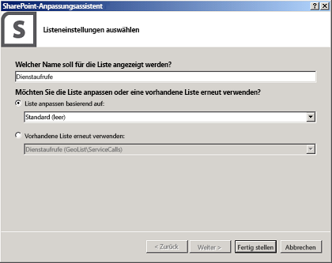
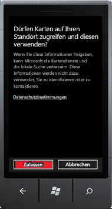

# <a name="how-to-integrate-maps-with-windows-phone-apps-and-sharepoint-lists"></a><span data-ttu-id="cb309-102">Vorgehensweise: Integrieren von Zuordnungen in Windows Phone-Anwendungen und SharePoint aufgelistet</span><span class="sxs-lookup"><span data-stu-id="cb309-102">How to: Integrate maps with Windows Phone apps and SharePoint lists</span></span>
<span data-ttu-id="cb309-p101">In diesem Artikel erfahren Sie, wie Sie Standortinformationen und Karten in SharePoint-Listen sowie standortbasierte Web-Apps und mobile SharePoint-Add-Ins mithilfe des neuen Felds "Geolocation" und durch Erstellen Ihrer eigenen auf dem Geolocation-Feld basierenden Feldtypen integrieren. SharePoint führt einen neuen Feldtyp namens Geolocation, die Ihnen das Hinzufügen von SharePoint-Listen mit Standortinformationen Anmerkungen ermöglicht. In Spalten vom Typ Geolocation können Sie Standortinformationen als ein Paar von Breiten- und Längengrad Koordinaten in decimal Grad eingeben oder die Koordinaten des aktuellen Standort des Benutzers vom Browser, abrufen, wenn im Browser die W3C Geolocation-API implementiert. Klicken Sie in der Liste zeigt SharePoint den Speicherort auf einer Karte unterstützt von Bing Maps. Zusammen Geolocation-Feld Kartenansicht ermöglichen es Ihnen, einen räumlichen Kontext für alle Informationen bereitgestellt, durch die Integration von Daten aus SharePoint in einer Zuordnung und können Benutzer ausschließlich auf neue Weise in den Webservern und mobilen apps und -Lösungen zu. Wir helfen Ihnen eine einfache Windows 7-app erstellen, die SharePoint Geolocation-Feld Typ-Funktion verwendet, um Funktionen für die Zuordnung zu verwenden, sodass Sie Karten für mobile SharePoint-Add-In Listenelemente anzeigen können.</span><span class="sxs-lookup"><span data-stu-id="cb309-p101">Learn how to integrate location information and maps in SharePoint lists and location-based web and mobile SharePoint Add-ins, by using the new Geolocation field, and by creating your own geolocation-based field types. SharePoint introduces a new field type named Geolocation that enables you to annotate SharePoint lists with location information. In columns of type Geolocation, you can enter location information as a pair of latitude and longitude coordinates in decimal degrees or retrieve the coordinates of the user's current location from the browser, if the browser implements the W3C Geolocation API. In the list, SharePoint displays the location on a map powered by Bing Maps. Together, the Geolocation field and the Map View enable you to give a spatial context to any information by integrating data from SharePoint into a mapping experience, and let your users engage in new ways in your web and mobile apps and solutions. We'll help you create a simple Windows 7 mobile app which uses the SharePoint Geolocation field type feature to use mapping capabilities so you can display maps on mobile SharePoint Add-in list items.</span></span>
  
    
    


> <span data-ttu-id="cb309-109">**Wichtig:** Wenn Sie eine App für Windows Phone 8 entwickeln, müssen Sie Visual Studio Express 2012 anstelle von Visual Studio 2010 Express verwenden.</span><span class="sxs-lookup"><span data-stu-id="cb309-109">**Important** If you are developing an app for Windows Phone 8, you must use Visual Studio Express 2012 instead of Visual Studio 2010 Express. Except for the development environment, all information in this article applies to creating apps for both Windows Phone 8 and Windows Phone 7.</span></span> <span data-ttu-id="cb309-110">Mit Ausnahme der Entwicklungsumgebung gelten alle Informationen in diesem Artikel für das Erstellen von Apps sowohl auf Windows Phone 8 als auch auf Windows Phone 7.</span><span class="sxs-lookup"><span data-stu-id="cb309-110">Important If you are developing an app for Windows Phone 8, you must use Visual Studio Express 2012 instead of Visual Studio 2010 Express. Except for the development environment, all information in this article applies to creating apps for both Windows Phone 8 and Windows Phone 7.</span></span> <span data-ttu-id="cb309-111">Weitere Informationen finden Sie unter [Vorgehensweise: Einrichten einer Umgebung für die Entwicklung mobiler Apps für SharePoint](how-to-set-up-an-environment-for-developing-mobile-apps-for-sharepoint.md).</span><span class="sxs-lookup"><span data-stu-id="cb309-111">For more information, see  [How to: Set up an environment for developing mobile apps for SharePoint](how-to-set-up-an-environment-for-developing-mobile-apps-for-sharepoint.md).</span></span> 
  
    
    


## <a name="prerequisites-for-creating-a-map-based-windows-phone-app"></a><span data-ttu-id="cb309-112">Voraussetzungen für die Erstellung einer kartenbasierten Windows Phone-App</span><span class="sxs-lookup"><span data-stu-id="cb309-112">Prerequisites for creating a map-based Windows phone app</span></span>
<span data-ttu-id="cb309-113"><a name="SP15Integratemaps_prereeq"> </a></span><span class="sxs-lookup"><span data-stu-id="cb309-113"></span></span>

<span data-ttu-id="cb309-114">Stellen Sie sicher, dass Folgendes installiert sein:</span><span class="sxs-lookup"><span data-stu-id="cb309-114">Ensure that you have the following installed:</span></span>
  
    
    

- <span data-ttu-id="cb309-115">SharePoint</span><span class="sxs-lookup"><span data-stu-id="cb309-115">SharePoint</span></span>
    
  
- <span data-ttu-id="cb309-116">Visual Studio 2012</span><span class="sxs-lookup"><span data-stu-id="cb309-116">Visual Studio 2012</span></span>
    
  
- <span data-ttu-id="cb309-117">Visual Studio Express 2010 mit den SharePoint-phonevorlagen neu aus Microsoft SharePoint SDK for Windows Phone 7.1http://www.microsoft.com/en-us/download/details.aspx?id=30476 </span><span class="sxs-lookup"><span data-stu-id="cb309-117">Visual Studio Express 2010 with new the SharePoint phone templates from  [Microsoft SharePoint SDK for Windows Phone 7.1](http://www.microsoft.com/en-us/download/details.aspx?id=30476)</span></span>
    
  
- <span data-ttu-id="cb309-118">Zugriff auf eine Liste SharePoint mit ausreichenden Berechtigungen zum Hinzufügen einer Spalte</span><span class="sxs-lookup"><span data-stu-id="cb309-118">Access to a SharePoint list, with sufficient privileges to add a column</span></span>
    
  
- <span data-ttu-id="cb309-119">Die Bing Maps-Schlüssel bereitgestellt, die auf Ihrem Server; finden Sie unter  [Vorgehensweise: Legen Sie die Bing Maps-Taste auf Ordnerebene Web und Farm in SharePoint](how-to-set-the-bing-maps-key-at-the-web-and-farm-level-in-sharepoint.md)</span><span class="sxs-lookup"><span data-stu-id="cb309-119">The Bing Maps key deployed to your server; see  [How to: Set the Bing Maps key at the web and farm level in SharePoint](how-to-set-the-bing-maps-key-at-the-web-and-farm-level-in-sharepoint.md)</span></span>
    
  

## <a name="step-1-create-a-sharepoint-field-by-using-the-geolocation-feature"></a><span data-ttu-id="cb309-120">Schritt 1: Erstellen eines SharePoint-Felds mithilfe des Geolocation-Features</span><span class="sxs-lookup"><span data-stu-id="cb309-120">Step 1: Create a SharePoint field by using the Geolocation feature</span></span>
<span data-ttu-id="cb309-121"><a name="HowToCreateMapBasedPhoneApp_Step1"> </a></span><span class="sxs-lookup"><span data-stu-id="cb309-121"></span></span>

<span data-ttu-id="cb309-p103">Geolocation-Spalte ist nicht verfügbar, die standardmäßig in SharePoint-Listen. Sie müssen zum Schreiben von Code zum Hinzufügen der Spalte zu einer SharePoint-Liste. Wir zeigen Sie Gewusst wie: Programmgesteuertes Hinzufügen von Geolocation-Feld zu einer Liste mithilfe des SharePoint-Clientobjektmodells. Nachdem Sie das Feld zur Liste hinzufügen, können Sie der Liste Geolocation-Feld als ein Feature hinzufügen.</span><span class="sxs-lookup"><span data-stu-id="cb309-p103">The Geolocation column is not available by default in SharePoint lists. You have to write code to add the column to a SharePoint list. We'll show you how to add the Geolocation field to a list programmatically by using the SharePoint client object model. After you add the field to the list, you can add Geolocation field as a feature to the list.</span></span>
  
    
    

### <a name="to-create-the-visual-studio-project"></a><span data-ttu-id="cb309-126">Visual Studio-Projekt erstellen</span><span class="sxs-lookup"><span data-stu-id="cb309-126">To create the Visual Studio project</span></span>


1. <span data-ttu-id="cb309-127">Melden Sie sich als Administrator auf dem Server mit SharePoint.</span><span class="sxs-lookup"><span data-stu-id="cb309-127">Log on as an administrator to the server running SharePoint.</span></span>
    
  
2. <span data-ttu-id="cb309-p104">Starten Sie **Visual Studio**, und wählen Sie **Datei**, **Neues Projekt**. Das Dialogfeld **Neues Projekt** wird geöffnet.</span><span class="sxs-lookup"><span data-stu-id="cb309-p104">Start **Visual Studio** and choose **File**, **New Project**. The **New Project** dialog box opens.</span></span>
    
  
3. <span data-ttu-id="cb309-130">Klicken Sie im Dialogfeld **Neues Projekt** wählen Sie **Visual c#**, wählen Sie **SharePoint**, und wählen Sie dann den Projekttyp **SharePoint**.</span><span class="sxs-lookup"><span data-stu-id="cb309-130">In the **New Project** dialog box, choose **Visual C#**, choose **SharePoint**, and then choose the **SharePoint** Project type.</span></span>
    
  
4. <span data-ttu-id="cb309-p105">Benennen Sie das Projekt. In diesem Beispiel verwenden wir **GeoList**. Wählen Sie die Schaltfläche **OK**.</span><span class="sxs-lookup"><span data-stu-id="cb309-p105">Name the project. In this example, we use **GeoList**. Choose the **OK** button.</span></span>
    
  
5. <span data-ttu-id="cb309-134">Geben Sie im **Assistenten zum Anpassen von SharePoint** die URL für die Websitesammlung, die die gleiche SharePoint-Liste verwendet, die Sie für die Telefonentwicklung zugreifen möchten.</span><span class="sxs-lookup"><span data-stu-id="cb309-134">In the **SharePoint Customization Wizard**, enter the URL for the site collection that uses the same SharePoint list that you want to access for phone development.</span></span>
    
  
6. <span data-ttu-id="cb309-135">Klicken Sie im **Projektmappen-Explorer** öffnen Sie das Kontextmenü für das Projekt **GeoList**, und wählen Sie **Hinzufügen** und **Neues Element**.</span><span class="sxs-lookup"><span data-stu-id="cb309-135">In **Solution Explorer**, open the shortcut menu for the **GeoList** project, and then choose **Add**, **New Item**.</span></span>
    
  
7. <span data-ttu-id="cb309-p106">Wählen Sie im Dialogfeld **Neues Element hinzufügen** die **Liste**. Name der Liste. In diesem Beispiel verwenden wir **ServiceCalls**.</span><span class="sxs-lookup"><span data-stu-id="cb309-p106">In the **Add New Item** dialog box, choose **List**. Name the list. In this example, we use **ServiceCalls**.</span></span>
    
  
8. <span data-ttu-id="cb309-p107">Fügen Sie im Dialogfeld **Einstellungen für die Liste Wählen Sie** einen Anzeigenamen ein. In diesem Beispiel verwenden wir **-Dienstaufrufen**. Wählen Sie für **zum Anpassen der Liste basierend auf auswählen** in der **Standardeinstellung (leer)** wie in Abbildung 1 dargestellt.</span><span class="sxs-lookup"><span data-stu-id="cb309-p107">In the **Choose List Settings** dialog box, add a display name. In this example, we use **Service Calls**. For **Choose to customize the list based on**, choose **Default (Blank)**, as shown in Figure 1.</span></span>
    
    <span data-ttu-id="cb309-142">Wählen Sie dann **Fertig stellen**.</span><span class="sxs-lookup"><span data-stu-id="cb309-142">Then, choose **Finish**.</span></span>
    

   <span data-ttu-id="cb309-143">**Abbildung 1. Hinzufügen der SharePoint-Liste mithilfe des Assistenten für SharePoint-Liste**</span><span class="sxs-lookup"><span data-stu-id="cb309-143">**Figure 1. Adding the SharePoint list by using the SharePoint List wizard**</span></span>

  

  
  

  

  

### <a name="to-add-a-feature-to-the-sharepoint-list"></a><span data-ttu-id="cb309-145">So fügen Sie ein Feature zur SharePoint-Liste hinzu</span><span class="sxs-lookup"><span data-stu-id="cb309-145">To add a Feature to the SharePoint list</span></span>


1. <span data-ttu-id="cb309-146">Klicken Sie im **Projektmappen-Explorer** und klicken Sie dann den Knoten **Features**.</span><span class="sxs-lookup"><span data-stu-id="cb309-146">In **Solution Explorer**, and then expand the **Features** node.</span></span>
    
  
2. <span data-ttu-id="cb309-147">Öffnen Sie das Kontextmenü des Knotens **Feature1**, und wählen Sie **Hinzufügen** und **Ereignisempfänger hinzufügen**.</span><span class="sxs-lookup"><span data-stu-id="cb309-147">Open the shortcut menu for the **Feature1** node, and then choose **Add**, **Add Event Receiver**.</span></span>
    
  
3. <span data-ttu-id="cb309-148">Kommentieren Sie die **FeatureActivated** -Methode und die **FeatureDeactivating** -Methode, und fügen Sie den folgenden Code.</span><span class="sxs-lookup"><span data-stu-id="cb309-148">Uncomment the **FeatureActivated** method and **FeatureDeactivating** method, and then add the following code.</span></span>
    
```cs
  
public override void FeatureActivated(SPFeatureReceiverProperties properties)
{
    SPWeb site = properties.Feature.Parent as SPWeb;
    SPList list = site.Lists.TryGetList("Service Calls");
    if (list != null)
    {
        list.Fields.AddFieldAsXml(
            "<Field Type='Geolocation' DisplayName='Location'/>", 
            true, 
            SPAddFieldOptions.Default);
        list.Update();
    }
}
public override void FeatureDeactivating(
                     SPFeatureReceiverProperties properties)
{
    SPWeb site = properties.Feature.Parent as SPWeb;
    SPList list = site.Lists.TryGetList("Service Calls");
    if (list != null)
    {
        list.Delete();
    }
}
```

4. <span data-ttu-id="cb309-149">Erstellen Sie die Projektmappe, indem Sie auf die F6-Taste.</span><span class="sxs-lookup"><span data-stu-id="cb309-149">Build the solution by choosing the F6 key.</span></span>
    
  

## <a name="step-2-deploy-the-list-and-enter-data-into-the-location-based-sharepoint-list"></a><span data-ttu-id="cb309-150">Schritt 2: Bereitstellen der Liste, und geben Sie Daten in der SharePoint-Liste speicherortbasierte</span><span class="sxs-lookup"><span data-stu-id="cb309-150">Step 2: Deploy the list and enter data into the location-based SharePoint list</span></span>
<span data-ttu-id="cb309-151"><a name="HowToCreateMapBasedPhoneApp_Step2"> </a></span><span class="sxs-lookup"><span data-stu-id="cb309-151"></span></span>

<span data-ttu-id="cb309-152">In diesem Schritt für die neu erstellte Liste Visual Studio bereitstellen und verwenden Sie das neue Feld Speicherort in SharePoint.</span><span class="sxs-lookup"><span data-stu-id="cb309-152">In this step, you deploy the newly created list from Visual Studio and use the new Location field in SharePoint.</span></span> 
  
    
    

### <a name="to-deploy-the-sharepoint-list"></a><span data-ttu-id="cb309-153">Zum Bereitstellen von SharePoint-Liste</span><span class="sxs-lookup"><span data-stu-id="cb309-153">To deploy the SharePoint list</span></span>


- <span data-ttu-id="cb309-154">Klicken Sie im **Projektmappen-Explorer** öffnen Sie das Kontextmenü für das Projekt **GeoList**, und wählen Sie **Bereitstellen**.</span><span class="sxs-lookup"><span data-stu-id="cb309-154">In **Solution Explorer**, open the shortcut menu for the **GeoList** project, and then choose **Deploy**.</span></span>
    
  

### <a name="to-enter-data-in-the-new-sharepoint-list-with-the-geolocation-field"></a><span data-ttu-id="cb309-155">Daten in die neue SharePoint-Liste mit den Geolocation-Feld eingeben.</span><span class="sxs-lookup"><span data-stu-id="cb309-155">To enter data in the new SharePoint list with the Geolocation field</span></span>


1. <span data-ttu-id="cb309-156">Nachdem die Liste erfolgreich bereitgestellt wurde, öffnen Sie die Website für die Telefonentwicklung verwendeten.</span><span class="sxs-lookup"><span data-stu-id="cb309-156">After the list successfully deploys, open the site you are using for phone development.</span></span>
    
  
2. <span data-ttu-id="cb309-157">Wählen Sie auf **Weitere**, und wählen Sie die Liste **-Dienstaufrufen** aus.</span><span class="sxs-lookup"><span data-stu-id="cb309-157">Choose **More**, and then choose the **Service Calls** list.</span></span>
    
  
3. <span data-ttu-id="cb309-158">Wählen Sie **Neues Element hinzufügen**.</span><span class="sxs-lookup"><span data-stu-id="cb309-158">Choose **Add New Item**.</span></span>
    
  
4. <span data-ttu-id="cb309-p108">Geben Sie einen Titel für das Feld **Titel** ein. Verwenden Sie für dieses Beispiel **Neues Geolocation-Element** ein.</span><span class="sxs-lookup"><span data-stu-id="cb309-p108">Provide a title for the **Title** field. For this example, use **New Geolocation Item**.</span></span>
    
  
5. <span data-ttu-id="cb309-161">Wählen Sie **Verwenden den aktuellen Speicherort** im Feld **Speicherort**, oder Sie können wählen Sie **Den Speicherort angeben**, und geben Sie Werte für **Länge** und **Breite**.</span><span class="sxs-lookup"><span data-stu-id="cb309-161">Choose **Use Current Location** in the **Location** field, or you can choose **Specify Location**, and then enter values for **Longitude** and **Latitude**.</span></span>
    
  
6. <span data-ttu-id="cb309-162">Wählen Sie **Speichern** aus.</span><span class="sxs-lookup"><span data-stu-id="cb309-162">Choose **Save**.</span></span>
    
  

## <a name="step-3-build-a-phone-app-for-the-location-based-list"></a><span data-ttu-id="cb309-163">Schritt 3: Erstellen einer Phone-app für die Liste speicherortbasierte</span><span class="sxs-lookup"><span data-stu-id="cb309-163">Step 3: Build a phone app for the location-based List</span></span>
<span data-ttu-id="cb309-164"><a name="HowToCreateMapBasedPhoneApp_Step3"> </a></span><span class="sxs-lookup"><span data-stu-id="cb309-164"></span></span>

<span data-ttu-id="cb309-165">In diesem Schritt erstellen Sie eine Phone-app, die die SharePoint-Liste verwendet, die Sie zuvor in Schritt 1 und Schritt 2 erstellt haben.</span><span class="sxs-lookup"><span data-stu-id="cb309-165">In this step, you create a phone app that uses the SharePoint list you created previously in step 1 and step 2.</span></span> 
  
    
    

1. <span data-ttu-id="cb309-166">Melden Sie sich an das Telefon Entwicklungsumgebung auf dem Client.</span><span class="sxs-lookup"><span data-stu-id="cb309-166">Log on to the Phone Development environment on the client side.</span></span>
    
  
2. <span data-ttu-id="cb309-167">Starten Sie Visual Studio 2010 Express mit den neuen SharePoint-Vorlagen.</span><span class="sxs-lookup"><span data-stu-id="cb309-167">Start Visual Studio 2010 Express with the new SharePoint templates.</span></span>
    
  
3. <span data-ttu-id="cb309-168">Klicken Sie in der Menüleiste auf **Datei** und dann auf **Neues Projekt**.</span><span class="sxs-lookup"><span data-stu-id="cb309-168">On the menu bar, choose **File**, **New Project**.</span></span>
    
    <span data-ttu-id="cb309-169">Das Dialogfeld **Neues Projekt** wird geöffnet.</span><span class="sxs-lookup"><span data-stu-id="cb309-169">The **New Project** dialog box opens.</span></span>
    
  
4. <span data-ttu-id="cb309-170">Klicken Sie im Dialogfeld **Neues Projekt** die Option **Visual c#**, **Silverlight für Windows Phone**, **Windows Phone SharePoint List Application**.</span><span class="sxs-lookup"><span data-stu-id="cb309-170">In the **New Project** dialog box, choose **Visual C#**, **Silverlight for Windows Phone**, **Windows Phone SharePoint List Application**.</span></span>
    
  
5. <span data-ttu-id="cb309-p109">Benennen Sie das Projekt. In diesem Beispiel verwenden wir GeoApp. Wählen Sie die Schaltfläche **OK**.</span><span class="sxs-lookup"><span data-stu-id="cb309-p109">Name the project. In this example, we use GeoApp. Choose the **OK** button.</span></span>
    
  
6. <span data-ttu-id="cb309-174">Geben Sie im **Assistenten für SharePoint Phone-Anwendung** die URL der SharePoint-Website, in dem Sie die Liste in Schritt2 **bereitgestellt haben. Bereitstellen die Liste, und geben Sie Daten in der SharePoint-Liste speicherortbasierte**, und wählen Sie dann auf **Suchen enthält**.</span><span class="sxs-lookup"><span data-stu-id="cb309-174">In the **SharePoint Phone Application Wizard**, enter the URL of the SharePoint site where you have deployed the list in **Step 2. Deploy the list and enter data into the location-based SharePoint list**, and then choose **Find Lists**.</span></span>
    
  
7. <span data-ttu-id="cb309-175">Wählen Sie die **Service-Aufrufe** aus, und wählen Sie dann auf **Weiter**.</span><span class="sxs-lookup"><span data-stu-id="cb309-175">Choose the **Service Calls** list, and then choose **Next**.</span></span>
    
  
8. <span data-ttu-id="cb309-176">Klicken Sie auf der Seite **Ansichten auswählen** wählen Sie **Alle Elemente**, und wählen Sie dann auf **Weiter**.</span><span class="sxs-lookup"><span data-stu-id="cb309-176">On the **Choose Views** page, choose **All Items**, and then choose **Next**.</span></span>
    
  
9. <span data-ttu-id="cb309-177">**Wählen Sie** auf der Seite **Vorgänge auswählen**, und wählen Sie dann auf **Weiter**.</span><span class="sxs-lookup"><span data-stu-id="cb309-177">On the **Choose Operations** page, choose **Display**, and then choose **Next**.</span></span>
    
  
10. <span data-ttu-id="cb309-178">Klicken Sie auf der Seite **Wählen Sie Felder** wählen Sie das Feld, auf Ihre Phone-app angezeigt werden soll, und wählen Sie dann auf **Weiter**.</span><span class="sxs-lookup"><span data-stu-id="cb309-178">On the **Choose Fields** page, choose the field you want to see on your phone app, and then choose **Next**.</span></span>
    
  
11. <span data-ttu-id="cb309-179">Ordnen Sie auf der Seite **Reihenfolge Felder** die Felder neu an, wie Sie benötigen, und wählen Sie dann auf **Fertig stellen**.</span><span class="sxs-lookup"><span data-stu-id="cb309-179">On the **Order Fields** page, reorder the fields as you need, and then choose **Finish**.</span></span>
    
  

## <a name="step-4-test-and-validate-your-app"></a><span data-ttu-id="cb309-180">Schritt 4: Testen Sie und überprüfen Sie Ihre app</span><span class="sxs-lookup"><span data-stu-id="cb309-180">Step 4: Test and validate your app</span></span>
<span data-ttu-id="cb309-181"><a name="HowToCreateMapBasedPhoneApp_Step4"> </a></span><span class="sxs-lookup"><span data-stu-id="cb309-181"></span></span>

<span data-ttu-id="cb309-182">In diesem Schritt können Sie Ihre app ausführen und zu überprüfen.</span><span class="sxs-lookup"><span data-stu-id="cb309-182">In this step, you can run your app and validate it.</span></span>
  
    
    

1. <span data-ttu-id="cb309-183">Wählen Sie in Visual Studio zu **Debuggen**, **Debuggen starten**.</span><span class="sxs-lookup"><span data-stu-id="cb309-183">In Visual Studio, choose **Debug**, **Start Debugging**.</span></span>
    
  
2. <span data-ttu-id="cb309-184">Wenn Sie aufgefordert werden, melden Sie sich, mit den Anmeldeinformationen, die auf dem Server mit SharePoint Administratorrechte verfügen.</span><span class="sxs-lookup"><span data-stu-id="cb309-184">When prompted, log on, using credentials that have admin rights on the server running SharePoint.</span></span>
    
  
3. <span data-ttu-id="cb309-185">In diesem Beispiel wird wählen Sie in den ersten Eintrag, **Brian Cox**.</span><span class="sxs-lookup"><span data-stu-id="cb309-185">For this example, choose the first entry, **Brian Cox**.</span></span>
    
  
4. <span data-ttu-id="cb309-186">Wählen Sie den **Map It**-Link im Feld **Speicherort** gefunden.</span><span class="sxs-lookup"><span data-stu-id="cb309-186">Choose the **Map It** link found in the **Location** field.</span></span>
    
  
5. <span data-ttu-id="cb309-187">Wählen Sie auf dem **Zulassen Maps zugreifen und diese verwenden Ihres Standorts für Ihre** Privatsphäre Richtlinie Bildschirm, **Zulassen**, wie in Abbildung 2 dargestellt.</span><span class="sxs-lookup"><span data-stu-id="cb309-187">On the **Allow maps to access and use your location** privacy policy screen, choose **Allow**, as shown in Figure 2.</span></span>
    
   <span data-ttu-id="cb309-188">**Abbildung 2. Mobile app-Anforderung an Ihren jeweiligen Standort zugreifen**</span><span class="sxs-lookup"><span data-stu-id="cb309-188">**Figure 2. Mobile app request to have access to your current location**</span></span>

  

  
  

    <span data-ttu-id="cb309-190">Kartenansicht wird angezeigt, wie in Abbildung 3 dargestellt.</span><span class="sxs-lookup"><span data-stu-id="cb309-190">The map view is displayed, as shown in Figure 3.</span></span>
    

   <span data-ttu-id="cb309-191">**Abbildung 3. Mobile App Anzeigeort Bing Map**</span><span class="sxs-lookup"><span data-stu-id="cb309-191">**Figure 3.Mobile App display location in Bing map**</span></span>

  

  
  

  

  

> <span data-ttu-id="cb309-193">**Hinweis:** Die Benutzeroberfläche des Felds Geolocation kann auf mobilen Geräten anders sein als in Browsern.</span><span class="sxs-lookup"><span data-stu-id="cb309-193">**Note:** The user's experience of the Geolocation field can be different on mobile devices than in browsers.</span></span> <span data-ttu-id="cb309-194">Die Option **Bestimmten Standort verwenden** des Browsers steht nicht für mobile Geräte zur Verfügung.</span><span class="sxs-lookup"><span data-stu-id="cb309-194">The **Use Specific Location** option, available in the browser, is not available for mobile devices.</span></span> <span data-ttu-id="cb309-195">Für mobile Geräte ist nur eine Option verfügbar: **Meinen Standort verwenden**.</span><span class="sxs-lookup"><span data-stu-id="cb309-195">For mobile devices, only one option is available: **Use my location**.</span></span> 
  
    
    


## <a name="additional-resources"></a><span data-ttu-id="cb309-196">Zusätzliche Ressourcen</span><span class="sxs-lookup"><span data-stu-id="cb309-196">Additional resources</span></span>
<span data-ttu-id="cb309-197"><a name="SP15Integmaps_addlresources"> </a></span><span class="sxs-lookup"><span data-stu-id="cb309-197"></span></span>


-  [<span data-ttu-id="cb309-198">Erstellen von Windows Phone-Apps, die auf SharePoint zugreifen</span><span class="sxs-lookup"><span data-stu-id="cb309-198">Build Windows Phone apps that access SharePoint</span></span>](build-windows-phone-apps-that-access-sharepoint.md)
    
  
-  [<span data-ttu-id="cb309-199">Integrieren von Standort- und Kartenfunktionen in SharePoint</span><span class="sxs-lookup"><span data-stu-id="cb309-199">Integrating location and map functionality in SharePoint</span></span>](integrating-location-and-map-functionality-in-sharepoint.md)
    
  
-  [<span data-ttu-id="cb309-200">Vorgehensweise: erweitern den Geolocation-Feldtyp verwenden clientseitiges Rendering</span><span class="sxs-lookup"><span data-stu-id="cb309-200">How to: Extend the Geolocation field type using client-side rendering</span></span>](how-to-extend-the-geolocation-field-type-using-client-side-rendering.md)
    
  
-  [<span data-ttu-id="cb309-201">Vorgehensweise: Hinzufügen einer Geolocation-Spalte einer Liste in SharePoint programmgesteuert</span><span class="sxs-lookup"><span data-stu-id="cb309-201">How to: Add a Geolocation column to a list programmatically in SharePoint</span></span>](how-to-add-a-geolocation-column-to-a-list-programmatically-in-sharepoint.md)
    
  
-  [<span data-ttu-id="cb309-202">Vorgehensweise: Einrichten einer Umgebung für die Entwicklung von mobilen Anwendungen für SharePoint</span><span class="sxs-lookup"><span data-stu-id="cb309-202">How to: Set up an environment for developing mobile apps for SharePoint</span></span>](how-to-set-up-an-environment-for-developing-mobile-apps-for-sharepoint.md)
    
  
-  [<span data-ttu-id="cb309-203">Windows Phone SDK 7.1</span><span class="sxs-lookup"><span data-stu-id="cb309-203">Windows Phone SDK 7.1</span></span>](http://www.microsoft.com/en-us/download/details.aspx?id=27570)
    
  
-  [<span data-ttu-id="cb309-204">Microsoft SharePoint SDK für Windows Phone 7.1</span><span class="sxs-lookup"><span data-stu-id="cb309-204">Microsoft SharePoint SDK for Windows Phone 7.1</span></span>](http://www.microsoft.com/en-us/download/details.aspx?id=30476)
    
  

