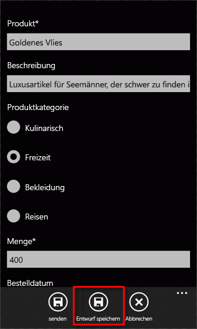

# <a name="how-to-store-and-retrieve-sharepoint-list-items-on-a-windows-phone"></a><span data-ttu-id="a405b-102">Vorgehensweise: anmelden und Fortsetzen von Anrufen SharePoint Listenelementen auf einem Telefon mit Windows</span><span class="sxs-lookup"><span data-stu-id="a405b-102">How to: Store and retrieve SharePoint list items on a Windows Phone</span></span>
<span data-ttu-id="a405b-p101">In diesem Artikel erhalten Sie Informationen zum Windows Phone-Anwendungslebenszyklus und zum lokalen Speichern von Netzwerkdaten. Einer der wichtigsten Aspekte bei der Entwicklung von apps für Windows Phone ist die Verwaltung von Zustandsinformationen, sowohl für die gesamte Anwendung als auch für einzelne Seiten oder Daten Elemente in der Anwendung. Wenn Sie Windows Phone-apps entwickeln, müssen Sie berücksichtigen, dass Benutzer Ihre Apps Konnektivität zu Netzwerkressourcen verlieren möglicherweise (z. B. SharePoint-Listen). Die Entwicklungsinfrastruktur für Windows Phone-apps bietet Mechanismen für die Verarbeitung von Statusinformationen in verschiedenen Phasen im Lebenszyklus einer app.</span><span class="sxs-lookup"><span data-stu-id="a405b-p101">Learn about the Windows Phone application life cycle and storing network data locally. One of the most important considerations in the development of Windows Phone apps is the management of state information, both for the overall application and for individual pages or data items within the application. If you're developing Windows Phone apps, you must take into account that users of your apps might lose connectivity to network resources (such as SharePoint lists). The development infrastructure for Windows Phone apps provides mechanisms for handling state information at various stages in the life cycle of an app.</span></span>
  
    
    


> <span data-ttu-id="a405b-107">**Wichtig:** Wenn Sie eine App für Windows Phone 8 entwickeln, müssen Sie Visual Studio Express 2012 anstelle von Visual Studio 2010 Express verwenden.</span><span class="sxs-lookup"><span data-stu-id="a405b-107">**Important** If you are developing an app for Windows Phone 8, you must use Visual Studio Express 2012 instead of Visual Studio 2010 Express. Except for the development environment, all information in this article applies to creating apps for both Windows Phone 8 and Windows Phone 7.</span></span> <span data-ttu-id="a405b-108">Mit Ausnahme der Entwicklungsumgebung gelten alle Informationen in diesem Artikel für das Erstellen von Apps sowohl auf Windows Phone 8 als auch auf Windows Phone 7.</span><span class="sxs-lookup"><span data-stu-id="a405b-108">Important If you are developing an app for Windows Phone 8, you must use Visual Studio Express 2012 instead of Visual Studio 2010 Express. Except for the development environment, all information in this article applies to creating apps for both Windows Phone 8 and Windows Phone 7.</span></span> <span data-ttu-id="a405b-109">Weitere Informationen finden Sie unter [Vorgehensweise: Einrichten einer Umgebung für die Entwicklung mobiler Apps für SharePoint](how-to-set-up-an-environment-for-developing-mobile-apps-for-sharepoint.md).</span><span class="sxs-lookup"><span data-stu-id="a405b-109">For more information, see  [How to: Set up an environment for developing mobile apps for SharePoint](how-to-set-up-an-environment-for-developing-mobile-apps-for-sharepoint.md).</span></span> 
  
    
    


## <a name="store-sharepoint-list-data-locally-on-a-windows-phone"></a><span data-ttu-id="a405b-110">Lokales Speichern von SharePoint-Listendaten auf einem Windows Phone</span><span class="sxs-lookup"><span data-stu-id="a405b-110">Store SharePoint list data locally on a Windows Phone</span></span>
<span data-ttu-id="a405b-111"><a name="BKMK_StoringDataLocally"> </a></span><span class="sxs-lookup"><span data-stu-id="a405b-111"></span></span>

<span data-ttu-id="a405b-p103">Auf einem Windows Phone nur eine app ausgeführt wird, zu einem Zeitpunkt und, wenn ein Benutzer auf einer anderen Anwendung auf dem Telefon umschaltet (durch Drücken der Schaltfläche **Start** auf dem Telefon, beispielsweise), die zurzeit ausgeführte app deaktiviert ist, oder die Begriffe Windows Phone-Entwicklung, dieals veraltet markiert. Wechselt von der Benutzer wieder auf die deaktivierte app (durch Drücken der Schaltfläche **zurück** ), kann die app reaktiviert werden, aber es sei denn, Sie Logik zur Verarbeitung von Anwendungsinformationen Status im Verlauf des Lebenszyklus der app bereitstellen, wird diese Statusinformationen nicht standardmäßig in der Übergang vom Aktivierung, Deaktivierung und wieder zu beibehalten. (Weitere Informationen zum Lebenszyklus Anwendung für Windows Phone-apps finden Sie unter [Ausführung Model Overview for Windows Phone](http://msdn.microsoft.com/de-de/library/ff817008%28v=VS.92%29.aspx).)</span><span class="sxs-lookup"><span data-stu-id="a405b-p103">On a Windows Phone, only one app runs at a time, and when a user switches to another app on the phone (by pressing the **Start** button on the phone, for example), the app currently running is deactivated, or, in the terms of Windows Phone development,tombstoned. If the user switches back to the deactivated app (by pressing the **Back** button), the app can be reactivated, but unless you provide logic to handle application state information over the course of the app life cycle, that state information is not preserved by default in the transition from activation to deactivation and back again. (For more information about the application life cycle for Windows Phone apps, see [Execution Model Overview for Windows Phone](http://msdn.microsoft.com/de-de/library/ff817008%28v=VS.92%29.aspx).)</span></span>
  
    
    
<span data-ttu-id="a405b-p104">Für Windows Phone-apps macht die **PhoneApplicationService** -Klasse standard Lebenszyklusereignisse, die zum Verwalten von Anwendungszustand verwendet werden können. In Projekten, die aus der Vorlage für Windows Phone SharePoint List Application erstellt haben (wie bei der Projekte aus allen **Silverlight für Windows Phone**-Vorlagen erstellt wurden), diese standard Windows Phone-Anwendung Lebenszyklusereignisse in Objektebene deklariert und Ereignishandler in der Code-Behind-Datei App.xaml.cs zugeordnet sind. Das folgende Markup sollte die Deklarationen in Objektebene für Ihre SharePoint-Liste apps entsprechen.</span><span class="sxs-lookup"><span data-stu-id="a405b-p104">For Windows Phone apps, the **PhoneApplicationService** class exposes standard life-cycle events that can be used to manage application state. In projects created from the Windows Phone SharePoint List Application template (as with projects created from all **Silverlight for Windows Phone** templates), these standard Windows Phone application life-cycle events are declared in the App.xaml file and associated with event handlers in the code-behind file, App.xaml.cs. The declarations in the App.xaml file for your SharePoint list apps should look like the following markup.</span></span>
  
    
    


```

<Application.ApplicationLifetimeObjects>
    <!--Required object that handles lifetime events for the application-->
    <shell:PhoneApplicationService 
        Launching="Application_Launching" Closing="Application_Closing"Activated="Application_Activated" Deactivated="Application_Deactivated"/>
</Application.ApplicationLifetimeObjects>
```

<span data-ttu-id="a405b-p105">Die **Application_Activated** und **Application_Deactivated** -Ereignishandler in Objektebene deklariert werden in der Datei App.xaml.cs CodeBehind-Datei mit Standardlogik implementiert, die Anwendung Statusinformationen für die Verwendung in der Phone-app zwischengespeichert, solange die app nicht beendet wird. Die Implementierung der Handler für diese Ereignisse werden die **State** -Eigenschaft (ermöglicht den Zugriff auf ein Objekt **Dictionary** ) der **PhoneApplicationService** -Klasse zum Speichern von Daten verwendet. In dieser Eigenschaft **State** gespeicherten Daten sind vorübergehende. D. h., wird es beibehalten, wenn die app deaktiviert oder als veraltet markiert ist, jedoch nicht, wenn die app beendet wird. Es ist wichtig, im Hinterkopf behalten, wie die Anwendung Lebenszyklusereignisse in Ihre Projekte behandelt werden, wenn eine Windows-app deaktiviert wird, wenn ein Benutzer auf einer anderen Anwendung umschaltet, das deaktiviert app Beendigung vom Betriebssystem Windows Phone, je nach Umständen fällt. Alle Daten auf dem Telefon, das dauerhaft gespeichert ist nicht geht verloren, auch wenn diese Daten mithilfe der **State** -Eigenschaft von der **PhoneApplicationService**temporärer Speicher gespeichert wurde.</span><span class="sxs-lookup"><span data-stu-id="a405b-p105">The **Application_Activated** and **Application_Deactivated** event handlers declared in the App.xaml file are implemented in the App.xaml.cs code-behind file with default logic that caches application state information for use in the phone app as long as the app is not terminated. The implementation of the handlers for these events uses the **State** property (which provides access to a **Dictionary** object) of the **PhoneApplicationService** class to store data. Data stored in this **State** property is transient. That is, it is preserved when the app is deactivated or tombstoned, but not when the app is terminated. It is important to keep in mind as you handle application life-cycle events in your projects that if a Windows app is deactivated when a user switches to another app, that deactivated app is subject to termination by the Windows Phone operating system, depending on circumstances. Any data on the phone that isn't saved to persistent storage is lost, even if that data was saved to transient storage by using the **State** property of the **PhoneApplicationService**.</span></span>
  
    
    
<span data-ttu-id="a405b-p106">In einer Windows Phone-app, die Daten aus einer SharePoint-Liste zu versehen, können die Daten auf dem Telefon von Sitzung zu Sitzung verwendet natürlich vom Server mit SharePoint Server, abgerufen werden, wenn der Server verfügbar ist. Aber dauerhafte Verbindung zu einem SharePoint Server möglicherweise nicht verfügbar für Windows Phone-Gerät aufgrund von Variationen in Service Abdeckung durch Position und anderen Faktoren. Um Benutzern Ihrer App Zugriff auf Daten im Fall von verlorenen Konnektivität mit dem Server mit SharePoint Server bereitzustellen oder einfach zum Speichern von Daten in einen permanenten Speicher zwischen Sitzungen der app unabhängig von der Verfügbarkeit des Servers, können Sie die Ereignisse **Closing** und **Launching** der Klasse **PhoneApplicationService** nutzen.</span><span class="sxs-lookup"><span data-stu-id="a405b-p106">In a Windows Phone app that gets data from a SharePoint list, the data used on the phone from session to session can of course be retrieved from the server running SharePoint Server, if the server is available. But continuous connectivity to a SharePoint Server may not be available for a Windows Phone device, owing to variations in service coverage by location and other factors. To provide users of your app with access to data in the event of lost connectivity with the server running SharePoint Server, or simply to save data to persistent storage between sessions of the app regardless of server availability, you can take advantage of the **Closing** and **Launching** events of the **PhoneApplicationService** class.</span></span>
  
    
    
<span data-ttu-id="a405b-p107">Die **Application_Launching** und **Application_Closing** Handler für diese Ereignisse in App.xaml deklariert und in der Datei App.xaml.cs definiert sind, jedoch nicht implementiert werden. So behandeln Sie speichern und Abrufen von Anwendung Zustandsinformationen im Kontext der app-Beendigung, können Sie eine Implementierung für den Ereignishandler **Application_Closing** zum Speichern von Daten in den isolierten Speicher für die app definiert werden, sodass die Daten zwischen Sitzungen der app bleibt, und Sie können eine Implementierung für den Ereignishandler **Application_Launching** zum Abrufen von Daten aus dem isolierten Speicher, wenn eine neue Sitzung der app gestartet wird (wenn die app gestartet wird) bereitstellen bereitstellen , auch wenn die Verbindung mit dem Server mit SharePoint Server, die die ursprüngliche Quelle der Daten ist nicht verfügbar ist.</span><span class="sxs-lookup"><span data-stu-id="a405b-p107">The **Application_Launching** and **Application_Closing** handlers for these events are declared in App.xaml and defined in the App.xaml.cs file, but they are not implemented. To handle storing and retrieving application state information in the context of app termination, you can provide an implementation for the **Application_Closing** event handler to store data in the isolated storage designated for the app so that the data persists between sessions of the app, and you can provide an implementation for the **Application_Launching** event handler to retrieve data from isolated storage when a new session of the app is started (when the app is launched), even if connectivity to the server running SharePoint Server that is the original source of the data is not available.</span></span>
  
    
    

> <span data-ttu-id="a405b-129">**Tipp:** Daten sollten vor dem Speichern auf einem lokalen Gerät verschlüsselt werden.</span><span class="sxs-lookup"><span data-stu-id="a405b-129">**Tip:** Data should be encrypted before you save it to a local device.</span></span> <span data-ttu-id="a405b-130">Weitere Informationen zum Verschlüsseln von Daten finden Sie unter  [Vorgehensweise: Verschlüsseln von Daten in einer Windows Phone-Anwendung](http://msdn.microsoft.com/de-de/library/hh487164%28v=vs.92%29.aspx)</span><span class="sxs-lookup"><span data-stu-id="a405b-130">TIP Data should be encrypted before you save it to a local device. For more information about how to encrypt the data, see  [How to: Encrypt Data in a Windows Phone Application](http://msdn.microsoft.com/de-de/library/hh487164%28v=vs.92%29.aspx)</span></span>
  
    
    


### <a name="to-implement-event-handlers-for-storing-and-retrieving-application-state"></a><span data-ttu-id="a405b-131">Implementieren von Ereignishandler für das Speichern und Abrufen des Anwendungszustands</span><span class="sxs-lookup"><span data-stu-id="a405b-131">To implement event handlers for storing and retrieving application state</span></span>


1. <span data-ttu-id="a405b-132">Erstellen einer Windows Phone-app mithilfe von Windows Phone SharePoint List Application-Vorlage in Visual Studio durch die Schritte in  [Vorgehensweise: Erstellen eine Windows Phone SharePoint Liste app](how-to-create-a-windows-phone-sharepoint-list-app.md).</span><span class="sxs-lookup"><span data-stu-id="a405b-132">Create a Windows Phone app by using the Windows Phone SharePoint List Application template in Visual Studio by following the steps in  [How to: Create a Windows Phone SharePoint list app](how-to-create-a-windows-phone-sharepoint-list-app.md).</span></span>
    
  
2. <span data-ttu-id="a405b-133">Wählen Sie im **Projektmappen-Explorer** Objektebene.</span><span class="sxs-lookup"><span data-stu-id="a405b-133">In **Solution Explorer**, choose the App.xaml file.</span></span>
    
  
3. <span data-ttu-id="a405b-134">Taste(n)F7um die CodeBehind-Datei App.xaml.cs, zur Bearbeitung zu öffnen.</span><span class="sxs-lookup"><span data-stu-id="a405b-134">Press F7 to open the code-behind file, App.xaml.cs, for editing.</span></span>
    
  
4. <span data-ttu-id="a405b-135">Suchen Sie die Implementierung der **Application_Launching** -Ereignishandler (leere), und Ersetzen Sie den Ereignishandler durch den folgenden Code.</span><span class="sxs-lookup"><span data-stu-id="a405b-135">Locate the (empty) implementation of the **Application_Launching** event handler and replace the event handler with the following code.</span></span>
    
```cs
  
private void Application_Launching(object sender, LaunchingEventArgs e)
{
    if (IsolatedStorageSettings.ApplicationSettings.Contains(DataProvider.ListTitle))
    {
        App.MainViewModel = (ListViewModel)IsolatedStorageSettings.ApplicationSettings
                                              [DataProvider.ListTitle];                
        App.MainViewModel.Initialize();
    }
}
```

5. <span data-ttu-id="a405b-136">Suchen Sie die Implementierung der **Application_Closing** -Ereignishandler (leere), und Ersetzen Sie diesen Ereignishandler durch den folgenden Code.</span><span class="sxs-lookup"><span data-stu-id="a405b-136">Locate the (empty) implementation of the **Application_Closing** event handler and replace that event handler with the following code.</span></span>
    
```cs
  
private void Application_Closing(object sender, ClosingEventArgs e)
{
    if (IsolatedStorageSettings.ApplicationSettings.Contains(DataProvider.ListTitle))
    {
        IsolatedStorageSettings.ApplicationSettings[DataProvider.ListTitle] = App.MainViewModel;
    }
    else
    {
        IsolatedStorageSettings.ApplicationSettings.Add(DataProvider.ListTitle, App.MainViewModel);
    }
    IsolatedStorageSettings.ApplicationSettings.Save();
}
```

6. <span data-ttu-id="a405b-137">Speichern Sie die Datei.</span><span class="sxs-lookup"><span data-stu-id="a405b-137">Save the file.</span></span>
    
  
<span data-ttu-id="a405b-p109">Mit dieser Implementierung direkten Ausführen Ihrer app, um die Haupt-ViewModel in der app mit Daten vom Server mit SharePoint Server zu initialisieren. Beenden Sie die app auf dem Telefon (durch Drücken der Schaltfläche **Sichern**, um nach der ersten Seite der app zu navigieren) auf das **Application_Closing** -Ereignis ausgelöst. Wenn Sie Ihre app ohne Verbindung mit dem Server ausführen, ist das Ansichtsmodell, das auf das **IsolatedStorageSettings** **Dictionary** -Objekt (im Ereignis **Application_Closing** ) gespeichert wurde abgerufen und initialisiert. Die SharePoint-Listenelemente, die in einer vorherigen Sitzung der app auf isolierten Speicher gespeichert wurden, werden in das Listenformular (List.xaml) der app angezeigt.</span><span class="sxs-lookup"><span data-stu-id="a405b-p109">With these implementations in place, run your app to initialize the main ViewModel in the app with data from the server running SharePoint Server. Exit the app on the phone (by pressing the **Back** button to navigate past the first page of the app) to trigger the **Application_Closing** event. If you then run your app without connectivity to the server, the ViewModel that was saved to the **IsolatedStorageSettings** **Dictionary** object (in the **Application_Closing** event) is retrieved and initialized. The SharePoint list items that were saved to isolated storage in a previous session of the app are displayed in the List form (List.xaml) of the app.</span></span>
  
    
    

## <a name="implement-a-mechanism-for-editing-list-items-offline"></a><span data-ttu-id="a405b-142">Implementieren Sie einen Mechanismus zum Bearbeiten von Listenelementen offline</span><span class="sxs-lookup"><span data-stu-id="a405b-142">Implement a mechanism for editing list items offline</span></span>
<span data-ttu-id="a405b-143"><a name="BKMK_ImplementingOfflineEditing"> </a></span><span class="sxs-lookup"><span data-stu-id="a405b-143"></span></span>

<span data-ttu-id="a405b-p110">Wenn Sie die Schritte im vorherigen Abschnitt, um Handler für die Ereignisse **Closing** und **Launching** in Ihrer app implementieren können SharePoint-Listendaten, die vom Server abgerufen wurde, wenn Connectivity verfügbar war in Ihrer app angezeigt werden, auch wenn die Verbindung mit dem Server in einer späteren Sitzung der app, verloren gehen, da die Listenelemente aus dem lokalen beständiger Speicher auf dem Telefon abgerufen werden. Basierend auf der Implementierung im vorherigen Abschnitt, jedoch die Listenelemente auf diese Weise für die Anzeige während offline bearbeitet und, wenn die Verbindung wiederhergestellt wird wieder auf dem Server gespeichert werden kann nicht zur Verfügung gestellt. Im folgenden Verfahren fügen Sie einen Mechanismus für Ihre Anwendung zum Speichern von bearbeitete Versionen von Listenelementen lokal, wenn Verbindung nicht verfügbar ist. Wenn die Verbindung mit dem Server wieder verfügbar ist, können diese bearbeiteten Listenelemente abrufen und speichern Sie die Änderungen an den Server zurückgesendet.</span><span class="sxs-lookup"><span data-stu-id="a405b-p110">If you follow the procedure in the previous section to implement handlers for the **Closing** and **Launching** events in your app, SharePoint list data that was retrieved from the server when connectivity was available can be displayed in your app even if connectivity to the server is lost in a subsequent session of the app, because the list items are retrieved from local persistent storage on the phone. Based on the implementation in the previous section, however, the list items made available in this way for display while offline can't be edited and saved back to the server unless connectivity is restored. In the following procedure, you'll add a mechanism to your app to provide for storing edited versions of list items locally when connectivity is unavailable. When connectivity to the server is available again, you can retrieve these edited list items and save your changes back to the server.</span></span>
  
    
    
<span data-ttu-id="a405b-148">Für die Verfahren in diesem Abschnitt wird davon ausgegangen, dass Sie arbeiten im Zusammenhang mit einer Windows Phone-app-Projekt aus der Vorlage für Windows Phone SharePoint List Application erstellt und, dass Ihre app auf einer Bestellungen Liste aus der Vorlage benutzerdefinierte Liste auf dem Server erstellt basiert und enthält die Spalten und Feldtypen in Tabelle 1 dargestellt sind.</span><span class="sxs-lookup"><span data-stu-id="a405b-148">For the procedures in this section, we assume you're working in the context of a Windows Phone app project created from the Windows Phone SharePoint List Application template and that your app is based on a Product Orders list created from the Custom List template on the server and contains the columns and field types shown in Table 1.</span></span>
  
    
    

<span data-ttu-id="a405b-149">**In Tabelle 1. Beispielliste Bestellungen**</span><span class="sxs-lookup"><span data-stu-id="a405b-149">**Table 1. Sample Product Orders list**</span></span>


|<span data-ttu-id="a405b-150">**Spalte**</span><span class="sxs-lookup"><span data-stu-id="a405b-150">**Column**</span></span>|<span data-ttu-id="a405b-151">**Typ**</span><span class="sxs-lookup"><span data-stu-id="a405b-151">**Type**</span></span>|<span data-ttu-id="a405b-152">**Erforderlich**</span><span class="sxs-lookup"><span data-stu-id="a405b-152">**Required**</span></span>|
|:-----|:-----|:-----|
|<span data-ttu-id="a405b-153">Produkt (beispielsweise "Titel")</span><span class="sxs-lookup"><span data-stu-id="a405b-153">Product (for example, Title)</span></span>  <br/> |<span data-ttu-id="a405b-154">Einzelne Textzeile (Text)</span><span class="sxs-lookup"><span data-stu-id="a405b-154">Single line of text (Text)</span></span>  <br/> |<span data-ttu-id="a405b-155">Ja</span><span class="sxs-lookup"><span data-stu-id="a405b-155">Yes</span></span>  <br/> |
|<span data-ttu-id="a405b-156">Beschreibung</span><span class="sxs-lookup"><span data-stu-id="a405b-156">Description</span></span>  <br/> |<span data-ttu-id="a405b-157">Einzelne Textzeile (Text)</span><span class="sxs-lookup"><span data-stu-id="a405b-157">Single line of text (Text)</span></span>  <br/> |<span data-ttu-id="a405b-158">Nein</span><span class="sxs-lookup"><span data-stu-id="a405b-158">No</span></span>  <br/> |
|<span data-ttu-id="a405b-159">Menge</span><span class="sxs-lookup"><span data-stu-id="a405b-159">Quantity</span></span>  <br/> |<span data-ttu-id="a405b-160">Zahl</span><span class="sxs-lookup"><span data-stu-id="a405b-160">Number</span></span>  <br/> |<span data-ttu-id="a405b-161">Ja</span><span class="sxs-lookup"><span data-stu-id="a405b-161">Yes</span></span>  <br/> |
|<span data-ttu-id="a405b-162">Bestelldatum</span><span class="sxs-lookup"><span data-stu-id="a405b-162">Order Date</span></span>  <br/> |<span data-ttu-id="a405b-163">Datum und Uhrzeit (DateTime)</span><span class="sxs-lookup"><span data-stu-id="a405b-163">Date and Time (DateTime)</span></span>  <br/> |<span data-ttu-id="a405b-164">Nein</span><span class="sxs-lookup"><span data-stu-id="a405b-164">No</span></span>  <br/> |
|<span data-ttu-id="a405b-165">Erfüllungsdatum</span><span class="sxs-lookup"><span data-stu-id="a405b-165">Fulfillment Date</span></span>  <br/> |<span data-ttu-id="a405b-166">Datum und Uhrzeit (DateTime)</span><span class="sxs-lookup"><span data-stu-id="a405b-166">Date and Time (DateTime)</span></span>  <br/> |<span data-ttu-id="a405b-167">Nein</span><span class="sxs-lookup"><span data-stu-id="a405b-167">No</span></span>  <br/> |
|<span data-ttu-id="a405b-168">Rufnummer</span><span class="sxs-lookup"><span data-stu-id="a405b-168">Contact Number</span></span>  <br/> |<span data-ttu-id="a405b-169">Einzelne Textzeile (Text)</span><span class="sxs-lookup"><span data-stu-id="a405b-169">Single line of text (Text)</span></span>  <br/> |<span data-ttu-id="a405b-170">Nein</span><span class="sxs-lookup"><span data-stu-id="a405b-170">No</span></span>  <br/> |
   

### <a name="to-implement-a-class-to-support-editing-items-while-offline"></a><span data-ttu-id="a405b-171">Implementieren eine Klasse zur Unterstützung der Bearbeitung Elemente beim offline</span><span class="sxs-lookup"><span data-stu-id="a405b-171">To implement a class to support editing items while offline</span></span>


1. <span data-ttu-id="a405b-172">Beginnend mit einem Visual Studio Projekt, das erstellt wurde, basierend auf der Bestellungen Liste dargestellt durch die in Tabelle 1, klicken Sie im **Projektmappen-Explorer**, wählen Sie den Knoten, der das Projekt (beispielsweise SPListAppLocalStorage) darstellt.</span><span class="sxs-lookup"><span data-stu-id="a405b-172">Starting with a Visual Studio project that was created based on the Product Orders list represented by Table 1, in **Solution Explorer**, choose the node that represents the project (for example, SPListAppLocalStorage).</span></span>
    
  
2. <span data-ttu-id="a405b-173">Wählen Sie im Menü **Projekt** **Klasse hinzufügen** aus.</span><span class="sxs-lookup"><span data-stu-id="a405b-173">On the **Project** menu, choose **Add Class**.</span></span> 
    
    <span data-ttu-id="a405b-174">Das Dialogfeld **Neues Element hinzufügen** wird angezeigt, mit der ausgewählten Vorlage C#- **Klasse**.</span><span class="sxs-lookup"><span data-stu-id="a405b-174">The **Add New Item** dialog box appears with the C# **Class** template selected.</span></span>
    
  
3. <span data-ttu-id="a405b-175">Nennen Sie die Klassendatei DraftItemStore.cs, und wählen Sie dann auf **Hinzufügen**.</span><span class="sxs-lookup"><span data-stu-id="a405b-175">Name the class file DraftItemStore.cs, and then choose **Add**.</span></span>
    
    <span data-ttu-id="a405b-176">Die Klassendatei ist dem Projekt hinzugefügt und zur Bearbeitung geöffnet.</span><span class="sxs-lookup"><span data-stu-id="a405b-176">The class file is added to the project and opened for editing.</span></span>
    
  
4. <span data-ttu-id="a405b-177">Ersetzen Sie den Inhalt der Klassendatei durch den folgenden Code:</span><span class="sxs-lookup"><span data-stu-id="a405b-177">Replace the contents of the class file with the following code.</span></span>
    
```cs
  
using System;
using System.Net;
using System.Windows;
using System.Collections.Generic;
using System.IO.IsolatedStorage;

namespace SPListAppLocalStorage // Based on project name by default.
{
    public class DraftItemStore
    {
        const string DraftsKey = "Drafts";

        public static void AddDraftItem(string id, EditItemViewModel model)
        {
            Dictionary<string, EditItemViewModel> draftCollection = GetDraftItemCollection();
            draftCollection[id] = model;
            SaveDrafts(draftCollection);
        }

        public static void RemoveDraftItem(string id)
        {
            Dictionary<string, EditItemViewModel> draftCollection = GetDraftItemCollection();
            draftCollection.Remove(id);
            SaveDrafts(draftCollection);
        }

        public static void SaveDrafts(Dictionary<string, EditItemViewModel> draft)
        {
            if (IsolatedStorageSettings.ApplicationSettings.Contains(DraftsKey))
            {
                IsolatedStorageSettings.ApplicationSettings[DraftsKey] = draft;
            }
            else
            {
                IsolatedStorageSettings.ApplicationSettings.Add(DraftsKey, draft);
            }
        }

        public static List<EditItemViewModel> Drafts
        {
            get
            {
                Dictionary<string, EditItemViewModel> draftCollection = GetDraftItemCollection();

                List<EditItemViewModel> modelCollection = new List<EditItemViewModel>();
                foreach (KeyValuePair<string, EditItemViewModel> entry in draftCollection)
                {
                    modelCollection.Add(entry.Value);
                }

                return modelCollection;
            }
        }

        public static Dictionary<string, EditItemViewModel> GetDraftItemCollection()
        {
            Dictionary<string, EditItemViewModel> draftCollection = null;
            if (IsolatedStorageSettings.ApplicationSettings.Contains(DraftsKey))
                draftCollection = (Dictionary<string,
                EditItemViewModel>)IsolatedStorageSettings.ApplicationSettings[DraftsKey];

            if (draftCollection == null)
                draftCollection = new Dictionary<string, EditItemViewModel>();

            return draftCollection;
        }

        public static EditItemViewModel GetDraftItemById(string id)
        {
            Dictionary<string, EditItemViewModel> draftCollection = GetDraftItemCollection();
            return !draftCollection.ContainsKey(id) ? null : draftCollection[id];
        }
    }
}
```


    The namespace specified in this code is based on the name of the project (SPListAppLocalStorage in this case). You might want to specify a different namespace, based on the name of your project.
    
  
5. <span data-ttu-id="a405b-178">Speichern Sie die Datei.</span><span class="sxs-lookup"><span data-stu-id="a405b-178">Save the file.</span></span>
    
  
<span data-ttu-id="a405b-p111">Eine bestimmte Instanz der **EditItemViewModel** -Klasse stellt einen SharePoint-Listenelement, das auf dem Telefon bearbeitet wird. Sie können ein Listenelement in Betracht ziehen, das geändert wurde, wie ein "Entwurf Element" vor Änderung für das Element auf dem Server gespeichert sind. Im Code in dieser Klasse fügt die **AddDraftItem** -Methode eine bestimmte Instanz der Klasse **EditItemViewModel** (d. h., ein Element Entwurf) als Wert auf ein **Dictionary** -Objekt, das **EditItemViewModel** in der **Dictionary** mit einem Schlüssel auf Grundlage des Bezeichners für das angegebene Listenelement zuordnen. (Ein Bezeichner wird vom SharePoint Server an jedes Element in einer Liste zugewiesen. In einem Projekt basierend auf der Vorlage Windows Phone SharePoint List Application wird dieser Bezeichner gespeichert in der **ID** -Eigenschaft der angegebenen **ViewModel** -Klasse, wie **EditItemViewModel** oder **DisplayItemViewModel**, die das Listenelement darstellt.) Die **RemoveDraftItem** -Methode entfernt ein **EditItemViewModel** aus dem **Dictionary** -Objekt basierend auf einem angegebenen Bezeichner. Sowohl der folgenden Methoden verwenden Sie die **GetDraftItemCollection** -Methode, um das **Dictionary** -Objekt mit den Objekten **EditItemViewModel** aus dem isolierten Speicher abzurufen und beide Methoden die **SaveDrafts** -Methode verwenden, um das geänderte **Dictionary** -Objekt (mit einem Entwurf Element entweder hinzugefügt oder daraus entfernt) auf den isolierten Speicher zu speichern. Die **GetDraftItemCollection** -Methode bestimmt zunächst, ob ein "Entwürfe" **Dictionary** -Objekt in isolierten Speicher gespeichert wurde. Ist dies der Fall ist, gibt die Methode dieses **Dictionary** -Objekt zurück. Andernfalls wird die Methode initialisiert und gibt ein neues **Dictionary** -Objekt. Die **Drafts** -Eigenschaft der Klasse ermöglicht den Zugriff auf die **Dictionary** der Entwurfselemente durch Zurückgeben einer Liste (d. h., ein Objekt basierend auf der **List<T>** generischen) der Entwurfselemente als **EditItemViewModel** -Objekte. Die **GetDraftItemById** -Methode gibt einen bestimmten Entwurf-Element aus dem **Dictionary** -Objekt basierend auf dem angegebenen Bezeichner-Wert zurück.</span><span class="sxs-lookup"><span data-stu-id="a405b-p111">A specific instance of the **EditItemViewModel** class represents a SharePoint list item that is being edited on the phone. You can consider a list item that was edited as a "draft item" before changes to the item are saved to the server. In the code in this class, the **AddDraftItem** method adds a specific instance of the **EditItemViewModel** class (that is, a draft item) as a value to a **Dictionary** object, associating the **EditItemViewModel** in the **Dictionary** with a key based on the identifier for the given list item. (An identifier is assigned by SharePoint Server to each item in a list. In a project based on the Windows Phone SharePoint List Application template, that identifier is stored in the **ID** property of the given **ViewModel** class, such as **EditItemViewModel** or **DisplayItemViewModel**, which represents the list item.) The **RemoveDraftItem** method removes an **EditItemViewModel** from the **Dictionary** object based on a specified identifier. Both of these methods use the **GetDraftItemCollection** method to retrieve the **Dictionary** object containing the **EditItemViewModel** objects from isolated storage and both methods use the **SaveDrafts** method to save the modified **Dictionary** object (with a draft item either added to it or removed from it) back to isolated storage. The **GetDraftItemCollection** method first determines whether a "Drafts" **Dictionary** object has been saved to isolated storage. If so, the method returns that **Dictionary** object; otherwise, the method initializes and returns a new **Dictionary** object. The **Drafts** property of the class provides access to the **Dictionary** of draft items by returning a list (that is, an object based on the **List<T>** generic) of draft items as **EditItemViewModel** objects. The **GetDraftItemById** method returns a given draft item from the **Dictionary** object based on a specified identifier value.</span></span>
  
    
    
<span data-ttu-id="a405b-p112">Nun können Sie die Benutzeroberfläche der app Telefon Elemente hinzugefügt und so werden konfiguriert, um die **DraftItemStore** -Klasse für die Bearbeitung von Listenelementen offline zu verwenden. In den folgenden Verfahren können Sie folgende Aktionen ausführen:</span><span class="sxs-lookup"><span data-stu-id="a405b-p112">Now you can add elements to the user interface of the phone app and configure them to use the **DraftItemStore** class for editing list items offline. In the following procedures, you will:</span></span>
  
    
    

- <span data-ttu-id="a405b-191">Hinzufügen und Konfigurieren einer Windows Phone-Seite, um alle Elemente anzuzeigen, die als Entwurfselemente isolierten Speicher auf dem Telefon gespeichert wurden.</span><span class="sxs-lookup"><span data-stu-id="a405b-191">Add and configure a Windows Phone page to display all list items that were saved as draft items to isolated storage on the phone.</span></span>
    
  
- <span data-ttu-id="a405b-192">Hinzufügen und konfigurieren Sie eine andere Seite, die an ein **EditItemViewModel**, zum Bearbeiten eines Elements einzelne Entwurf, vergleichbar mit dem Formular bearbeiten (EditForm.xaml) für Listenelemente gebunden.</span><span class="sxs-lookup"><span data-stu-id="a405b-192">Add and configure another page, bound to an **EditItemViewModel**, for editing an individual draft item, analogous to the Edit form (EditForm.xaml) for list items.</span></span>
    
  
- <span data-ttu-id="a405b-193">Fügen Sie eine Methode, **SaveAsDraft**, mit der **EditItemViewModel** -Klasse, die die **AddDraftItem** -Methode der **DraftItemStore** -Klasse implementiert, die im vorherigen Verfahren ausgeführt wird.</span><span class="sxs-lookup"><span data-stu-id="a405b-193">Add a method, **SaveAsDraft**, to the **EditItemViewModel** class that executes the **AddDraftItem** method of the **DraftItemStore** class implemented in the previous procedure.</span></span>
    
  
- <span data-ttu-id="a405b-194">Hinzufügen einer **ApplicationBar** -Schaltfläche in der Datei EditForm.xaml die **SaveAsDraft** -Methode aufrufen.</span><span class="sxs-lookup"><span data-stu-id="a405b-194">Add an **ApplicationBar** button to the EditForm.xaml file to call the **SaveAsDraft** method.</span></span>
    
  
- <span data-ttu-id="a405b-195">Hinzufügen einer Schaltfläche **ApplicationBar** zur Datei List.xaml, navigieren zur Seite, die alle als Entwürfe gespeicherte Listenelementen anzeigt.</span><span class="sxs-lookup"><span data-stu-id="a405b-195">Add an **ApplicationBar** button to the List.xaml file to navigate to the page that displays all list items saved as drafts.</span></span>
    
  

### <a name="to-add-a-page-for-displaying-all-draft-items-saved-on-the-phone"></a><span data-ttu-id="a405b-196">So fügen Sie einer Seite zum Anzeigen aller auf dem Telefon gespeichert Entwurfselemente hinzu</span><span class="sxs-lookup"><span data-stu-id="a405b-196">To add a page for displaying all draft items saved on the phone</span></span>


1. <span data-ttu-id="a405b-197">Wählen Sie im **Projektmappen-Explorer** den Ordner " **Ansichten** " aus.</span><span class="sxs-lookup"><span data-stu-id="a405b-197">In **Solution Explorer**, choose the **Views** folder.</span></span>
    
  
2. <span data-ttu-id="a405b-198">Wählen Sie im Menü **PROJEKT** die Option **Neues Element hinzufügen** aus.</span><span class="sxs-lookup"><span data-stu-id="a405b-198">On the **Project** menu, choose **Add New Item**.</span></span> 
    
    <span data-ttu-id="a405b-199">Das Dialogfeld **Neues Element hinzufügen** wird geöffnet.</span><span class="sxs-lookup"><span data-stu-id="a405b-199">The **Add New Item** dialog box opens.</span></span>
    
  
3. <span data-ttu-id="a405b-200">Wählen Sie im Dialogfeld **Neues Element hinzufügen** unter den Knoten **Visual c#** den **Silverlight für Windows Phone**-Knoten.</span><span class="sxs-lookup"><span data-stu-id="a405b-200">In the **Add New Item** dialog box, under the **Visual C#** node, choose the **Silverlight for Windows Phone** node.</span></span>
    
  
4. <span data-ttu-id="a405b-201">Wählen Sie im Bereich **Vorlagen** die Vorlage **Windows Phone-Hochformat**.</span><span class="sxs-lookup"><span data-stu-id="a405b-201">In the **Templates** pane, choose the **Windows Phone Portrait Page** template.</span></span>
    
  
5. <span data-ttu-id="a405b-202">Nennen Sie die Datei Drafts.xaml, und wählen Sie dann auf **Hinzufügen**.</span><span class="sxs-lookup"><span data-stu-id="a405b-202">Name the file Drafts.xaml, and then choose **Add**.</span></span> 
    
    <span data-ttu-id="a405b-203">Die Datei wird unter dem Knoten **Ansichten** dem Projekt hinzugefügt und zur Bearbeitung geöffnet.</span><span class="sxs-lookup"><span data-stu-id="a405b-203">The file is added to the project under the **Views** node and opened for editing.</span></span>
    
  
6. <span data-ttu-id="a405b-204">Im Bereich XAML des Designers ersetzen Sie den Inhalt der Datei durch den folgenden XAML-Code.</span><span class="sxs-lookup"><span data-stu-id="a405b-204">In the XAML pane of the designer, replace the contents of the file with the following XAML.</span></span>
    
```
  
<phone:PhoneApplicationPage
    x:Class="SPListAppLocalStorage.Views.Drafts"
    xmlns="http://schemas.microsoft.com/winfx/2006/xaml/presentation"
    xmlns:x="http://schemas.microsoft.com/winfx/2006/xaml"
    xmlns:phone="clr-namespace:Microsoft.Phone.Controls;assembly=Microsoft.Phone"
    xmlns:shell="clr-namespace:Microsoft.Phone.Shell;assembly=Microsoft.Phone"
    xmlns:d="http://schemas.microsoft.com/expression/blend/2008"
    xmlns:mc="http://schemas.openxmlformats.org/markup-compatibility/2006"
    FontFamily="{StaticResource PhoneFontFamilyNormal}"
    FontSize="{StaticResource PhoneFontSizeNormal}"
    Foreground="{StaticResource PhoneForegroundBrush}"
    SupportedOrientations="Portrait" Orientation="Portrait"
    mc:Ignorable="d" d:DesignHeight="696" d:DesignWidth="480"
    shell:SystemTray.IsVisible="True">

    <!--LayoutRoot is the root grid where all page content is placed-->
    <Grid x:Name="LayoutRoot" Background="Transparent">
        <Grid.RowDefinitions>
            <RowDefinition Height="Auto"/>
            <RowDefinition Height="*"/>
        </Grid.RowDefinitions>

        <!--TitlePanel contains the name of the application and page title-->
        <StackPanel x:Name="TitlePanel" Grid.Row="0" Margin="12,17,0,28">
            <TextBlock x:Name="ApplicationTitle" Text="Product Orders" 
                                    Style="{StaticResource PhoneTextNormalStyle}"/>
            <TextBlock x:Name="PageTitle" Text="Draft Items" Margin="9,-7,0,0" 
                                      Style="{StaticResource PhoneTextTitle1Style}"/>
        </StackPanel>

        <!--ContentPanel - place additional content here-->
        <Grid x:Name="ContentPanel" Grid.Row="1" Margin="12,0,12,0">
            <ListBox x:Name="lstBoxDraftItems" ItemsSource="{Binding}"
                                  SelectionChanged="lstBoxDraftItems_SelectionChanged">
                <ListBox.ItemTemplate>
                    <DataTemplate>
                        <StackPanel>
                            <TextBlock Text="{Binding [Title]}" Style="
                                           {StaticResource PhoneTextTitle2Style}"></TextBlock>
                            <TextBlock Text="{Binding [Description]}" Style="
                                            {StaticResource PhoneTextNormalStyle}"></TextBlock>
                            <TextBlock Text="{Binding [Contact_x0020_Number]}" Style="
                                           {StaticResource PhoneTextNormalStyle}"></TextBlock>
                        </StackPanel>
                    </DataTemplate>
                </ListBox.ItemTemplate>
            </ListBox>
        </Grid>
    </Grid>
 
    <phone:PhoneApplicationPage.ApplicationBar>
        <shell:ApplicationBar IsVisible="True" IsMenuEnabled="True">
            <shell:ApplicationBarIconButton x:Name="btnCancel" 
             IconUri="/Images/appbar.cancel.rest.png" Text="Cancel" Click="OnCancelButtonClick" />
        </shell:ApplicationBar>
    </phone:PhoneApplicationPage.ApplicationBar>

</phone:PhoneApplicationPage>
```


    The value of the namespace designation  `<x:Class>` in this code ("SPListAppLocalStorage.Views.Drafts") will vary depending on the name of your project.
    
  
7. <span data-ttu-id="a405b-205">Wählen Sie die Drafts.xaml-Datei im **Projektmappen-Explorer** aus und drücken Sie F7, um die zugeordnete Code-Behind-Datei Drafts.xaml.cs für die Bearbeitung zu öffnen.</span><span class="sxs-lookup"><span data-stu-id="a405b-205">With the Drafts.xaml file selected in **Solution Explorer**, press F7 to open the associated code-behind file, Drafts.xaml.cs, for editing.</span></span>
    
  
8. <span data-ttu-id="a405b-206">Ersetzen Sie den Inhalt der Datei durch den folgenden Code:</span><span class="sxs-lookup"><span data-stu-id="a405b-206">Replace the contents of the file with the following code.</span></span>
    
```cs
  
using System;
using System.Collections.Generic;
using System.Linq;
using System.Net;
using System.Windows;
using System.Windows.Controls;
using System.Windows.Documents;
using System.Windows.Input;
using System.Windows.Media;
using System.Windows.Media.Animation;
using System.Windows.Shapes;
using Microsoft.Phone.Controls;

namespace SPListAppLocalStorage.Views
{
    public partial class Drafts : PhoneApplicationPage
    {
        public Drafts()
        {
            InitializeComponent();
            this.Loaded += new RoutedEventHandler(Drafts_Loaded);
        }

        private void lstBoxDraftItems_SelectionChanged(object sender, SelectionChangedEventArgs e)
        {
            ListBox lstBox = sender as ListBox;
            if (lstBox.SelectedIndex == -1)
                return;

            EditItemViewModel selectedDraftItem = lstBox.SelectedItem as EditItemViewModel;
            NavigationService.Navigate(new Uri(string.Format("/Views/DraftItemEditForm.xaml?ID={0}",
                                                   selectedDraftItem.ID), UriKind.Relative));

            lstBox.SelectedIndex = -1;
        }

        void Drafts_Loaded(object sender, RoutedEventArgs e)
        {
            this.DataContext = DraftItemStore.Drafts;
        }

        private void OnCancelButtonClick(object sender, EventArgs e)
        {
            // Navigate back to initial List View form.
            NavigationService.Navigate(new Uri("/Views/List.xaml", UriKind.Relative));
        }
    }
}
```

9. <span data-ttu-id="a405b-207">Speichern Sie die Dateien.</span><span class="sxs-lookup"><span data-stu-id="a405b-207">Save the files.</span></span>
    
  

### <a name="to-add-a-page-for-editing-individual-draft-items"></a><span data-ttu-id="a405b-208">So fügen Sie eine Seite zum Bearbeiten der einzelnen Entwurfselemente hinzu</span><span class="sxs-lookup"><span data-stu-id="a405b-208">To add a page for editing individual draft items</span></span>


1. <span data-ttu-id="a405b-209">Wählen Sie im **Projektmappen-Explorer** den Ordner " **Ansichten** " aus.</span><span class="sxs-lookup"><span data-stu-id="a405b-209">In **Solution Explorer**, choose the **Views** folder.</span></span>
    
  
2. <span data-ttu-id="a405b-210">Wählen Sie im Menü **PROJEKT** die Option **Neues Element hinzufügen** aus.</span><span class="sxs-lookup"><span data-stu-id="a405b-210">On the **Project** menu, choose **Add New Item**.</span></span> 
    
    <span data-ttu-id="a405b-211">Das Dialogfeld **Neues Element hinzufügen** wird geöffnet.</span><span class="sxs-lookup"><span data-stu-id="a405b-211">The **Add New Item** dialog box opens.</span></span>
    
  
3. <span data-ttu-id="a405b-212">Wählen Sie im Dialogfeld **Neues Element hinzufügen** unter den Knoten **Visual c#** den **Silverlight für Windows Phone**-Knoten.</span><span class="sxs-lookup"><span data-stu-id="a405b-212">In the **Add New Item** dialog box, under the **Visual C#** node, choose the **Silverlight for Windows Phone** node.</span></span>
    
  
4. <span data-ttu-id="a405b-213">Wählen Sie im Bereich **Vorlagen** die Vorlage **Windows Phone-Hochformat**.</span><span class="sxs-lookup"><span data-stu-id="a405b-213">In the **Templates** pane, choose the **Windows Phone Portrait Page** template.</span></span>
    
  
5. <span data-ttu-id="a405b-214">Nennen Sie die Datei DraftItemEditForm.xaml, und wählen Sie dann auf **Hinzufügen**.</span><span class="sxs-lookup"><span data-stu-id="a405b-214">Name the file DraftItemEditForm.xaml, and then choose **Add**.</span></span> 
    
    <span data-ttu-id="a405b-215">Die Datei wird unter dem Knoten **Ansichten** dem Projekt hinzugefügt und zur Bearbeitung geöffnet.</span><span class="sxs-lookup"><span data-stu-id="a405b-215">The file is added to the project under the **Views** node and opened for editing.</span></span>
    
  
6. <span data-ttu-id="a405b-216">Im Bereich XAML des Designers ersetzen Sie den Inhalt der Datei durch den folgenden XAML-Code.</span><span class="sxs-lookup"><span data-stu-id="a405b-216">In the XAML pane of the designer, replace the contents of the file with the following XAML.</span></span>
    
```
  
<phone:PhoneApplicationPage
    x:Class="SPListAppLocalStorage.DraftItemEditForm"
    xmlns="http://schemas.microsoft.com/winfx/2006/xaml/presentation"
    xmlns:x="http://schemas.microsoft.com/winfx/2006/xaml"
    xmlns:phone="clr-namespace:Microsoft.Phone.Controls;assembly=Microsoft.Phone"
    xmlns:shell="clr-namespace:Microsoft.Phone.Shell;assembly=Microsoft.Phone"
    xmlns:d="http://schemas.microsoft.com/expression/blend/2008"
    xmlns:mc="http://schemas.openxmlformats.org/markup-compatibility/2006"
    mc:Ignorable="d" d:DesignWidth="480" d:DesignHeight="696"
    FontFamily="{StaticResource PhoneFontFamilyNormal}"
    FontSize="{StaticResource PhoneFontSizeNormal}"
    Foreground="{StaticResource PhoneForegroundBrush}"
    SupportedOrientations="Portrait" Orientation="Portrait"
    shell:SystemTray.IsVisible="True" x:Name="DraftItemEditPage">

    <!--LayoutRoot is the root grid where all page content is placed-->
    <Grid x:Name="LayoutRoot" Background="Transparent"
        xmlns:x="http://schemas.microsoft.com/winfx/2006/xaml" 
             xmlns:controls="clr-namespace:Microsoft.Phone.Controls;assembly=
                Microsoft.Phone.Controls">
        <StackPanel>
            <ProgressBar Background="Red" x:Name="progressBar" Opacity="1" 
                                    HorizontalAlignment="Center" VerticalAlignment="Top" 
                                    Height="15" Width="470" IsIndeterminate="{Binding IsBusy}" 
                                    Visibility="{Binding ShowIfBusy}" />
            <ScrollViewer HorizontalScrollBarVisibility="Auto" Height="700">
                <Grid x:Name="ContentPanel" Width="470">
                    <StackPanel Margin="0,5,0,5">
                        <StackPanel Orientation="Vertical" Margin="0,5,0,5">
                            <TextBlock TextWrapping="Wrap" HorizontalAlignment="Left" 
                                Style="{StaticResource PhoneTextNormalStyle}">Product*</TextBlock>
                            <TextBox Style="{StaticResource TextValidationTemplate}" 
                         FontSize="{StaticResource   PhoneFontSizeNormal}" Width="470" 
                         HorizontalAlignment="Left" Name="txtTitle" Text="{Binding [Title], 
                                   Mode=TwoWay,ValidatesOnNotifyDataErrors=True,NotifyOnValidationError=True}" 
                                                                         TextWrapping="Wrap" />
                        </StackPanel>
                        <StackPanel Orientation="Vertical" Margin="0,5,0,5">
                            <TextBlock TextWrapping="Wrap" HorizontalAlignment="Left" 
                               Style="{StaticResource PhoneTextNormalStyle}">Description</TextBlock>
                            <TextBox Style="{StaticResource TextValidationTemplate}" 
                               FontSize="{StaticResource PhoneFontSizeNormal}" Width="470" 
                                HorizontalAlignment="Left" Name="txtDescription" 
                                                           Text="{Binding [Description],
                                                           Mode=TwoWay, ValidatesOnNotifyDataErrors=True, 
                                                           NotifyOnValidationError=True}" 
                                       TextWrapping="Wrap" />
                        </StackPanel>
                        <StackPanel Orientation="Vertical" Margin="0,5,0,5">
                            <TextBlock TextWrapping="Wrap" HorizontalAlignment="Left" 
                               Style="{StaticResource PhoneTextNormalStyle}">
                                                           Product Category</TextBlock>
                            <ListBox MaxHeight="400" Width="Auto" x:Name="lstBoxProduct_x0020_Category"
                                              ItemsSource="{Binding [Product_x0020_Category]}">
                                <ListBox.ItemTemplate>
                                    <DataTemplate>
                                        <RadioButton FontSize="{StaticResource PhoneFontSizeNormal}" 
                                          HorizontalAlignment="Left" GroupName="Product_x0020_Category" 
                                                                 Content="{Binding Name}" 
                               IsChecked="{Binding IsChecked, Mode=TwoWay}" />
                                    </DataTemplate>
                                </ListBox.ItemTemplate>
                            </ListBox>
                        </StackPanel>
                        <StackPanel Orientation="Vertical" Margin="0,5,0,5">
                            <TextBlock TextWrapping="Wrap" HorizontalAlignment="Left" 
                                       Style="{StaticResource PhoneTextNormalStyle}">Quantity*</TextBlock>
                            <TextBox Style="{StaticResource TextValidationTemplate}" 
                                   FontSize="{StaticResource PhoneFontSizeNormal}" Width="470" 
                                      HorizontalAlignment="Left" Name="txtQuantity" Text="{Binding [Quantity], 
                                        Mode=TwoWay, ValidatesOnNotifyDataErrors=True, 
                                           NotifyOnValidationError=True}"
                                             TextWrapping="Wrap" />
                        </StackPanel>
                        <StackPanel Orientation="Vertical" Margin="0,5,0,5">
                            <TextBlock TextWrapping="Wrap" HorizontalAlignment="Left" 
                                Style="{StaticResource PhoneTextNormalStyle}">Order Date</TextBlock>
                            <TextBox Height="Auto" Style="{StaticResource TextValidationTemplate}"
                                               FontSize="{StaticResource PhoneFontSizeNormal}" Width="470"  
                                                         HorizontalAlignment="Left" Name="txtOrder_x0020_Date" 
                         Text="{Binding [Order_x0020_Date], Mode=TwoWay, ValidatesOnNotifyDataErrors=True, 
                                           NotifyOnValidationError=True}" TextWrapping="Wrap" />
                            <TextBlock FontSize="16" TextWrapping="Wrap" HorizontalAlignment="Left" 
                                                 Style="{StaticResource PhoneTextSubtleStyle}" 
                                                             Text="{Binding DateTimeFormat}" />
                        </StackPanel>
                        <StackPanel Orientation="Vertical" Margin="0,5,0,5">
                            <TextBlock TextWrapping="Wrap" HorizontalAlignment="Left" 
                         Style="{StaticResource PhoneTextNormalStyle}">Fulfillment Date</TextBlock>
                            <TextBox Height="Auto" Style="{StaticResource TextValidationTemplate}"
                                          FontSize="{StaticResource PhoneFontSizeNormal}" Width="470" 
                                          HorizontalAlignment="Left" Name="txtFulfillment_x0020_Date" 
                        Text="{Binding [Fulfillment_x0020_Date], Mode=TwoWay, 
                     ValidatesOnNotifyDataErrors=True, NotifyOnValidationError=True}" 
                         TextWrapping="Wrap" />
                            <TextBlock FontSize="16" TextWrapping="Wrap" HorizontalAlignment="Left"
                                                    Style="{StaticResource PhoneTextSubtleStyle}" Text="{Binding
                                                           DateTimeFormat}" />
                        </StackPanel>
                        <StackPanel Orientation="Horizontal">
                            <TextBlock TextWrapping="Wrap" Width="150" HorizontalAlignment="Left"
                                                  Style="{StaticResource PhoneTextNormalStyle}">Rush 
                                                                   :</TextBlock>
                            <CheckBox Name="txtRush" FontSize="{StaticResource PhoneFontSizeNormal}" 
                                          HorizontalAlignment="Left" IsChecked="{Binding [Rush], Mode=TwoWay, 
                               ValidatesOnNotifyDataErrors=True, NotifyOnValidationError=True}" />
                        </StackPanel>
                        <StackPanel Orientation="Vertical" Margin="0,5,0,5">
                            <TextBlock TextWrapping="Wrap" HorizontalAlignment="Left" 
                        Style="{StaticResource PhoneTextNormalStyle}">Contact Number</TextBlock>
                            <TextBox Style="{StaticResource TextValidationTemplate}" 
                                   FontSize="{StaticResource PhoneFontSizeNormal}" Width="470"
                                              HorizontalAlignment="Left" Name="txtContact_x0020_Number"
                                                         Text="{Binding [Contact_x0020_Number], 
                                                         Mode=TwoWay, ValidatesOnNotifyDataErrors=True, 
                                                         NotifyOnValidationError=True}" 
                                                                           TextWrapping="Wrap" />
                        </StackPanel>
                    </StackPanel>
                </Grid>
            </ScrollViewer>
        </StackPanel>
    </Grid>

    <phone:PhoneApplicationPage.ApplicationBar>
        <shell:ApplicationBar IsVisible="True" IsMenuEnabled="True">
            <shell:ApplicationBarIconButton x:Name="btnSubmit" 
                                IconUri="/Images/appbar.save.rest.png" 
                                Text="Submit" Click="OnSubmitButtonClick"/>
            <shell:ApplicationBarIconButton x:Name="btnBack" 
                                IconUri="/Images/appbar.back.rest.png" 
                                 Text="Back to List" Click="OnBackButtonClick"/>
        </shell:ApplicationBar>
    </phone:PhoneApplicationPage.ApplicationBar>

</phone:PhoneApplicationPage>
```


    The XAML for defining this page is similar to that of the EditForm.xaml file. You can copy the EditForm.xaml file to use as a basis for DraftItemEditForm.xaml, making the modifications to the file as indicated in this markup.
    
  
7. <span data-ttu-id="a405b-217">Achten Sie darauf, dass die Datei DraftItemEditForm.xaml im **Projektmappen-Explorer** ausgewählt ist, und drücken Sie F7, um die zugeordnete Code-Behind-Datei DraftItemEditForm.xaml.cs für die Bearbeitung zu öffnen.</span><span class="sxs-lookup"><span data-stu-id="a405b-217">With the DraftItemEditForm.xaml file chosen in **Solution Explorer**, press F7 to open the associated code-behind file, DraftItemEditForm.xaml.cs, for editing.</span></span>
    
  
8. <span data-ttu-id="a405b-218">Ersetzen Sie den Inhalt der Datei durch den folgenden Code:</span><span class="sxs-lookup"><span data-stu-id="a405b-218">Replace the contents of the file with the following code.</span></span>
    
```cs
  
using System;
using System.Collections.Generic;
using System.Linq;
using System.Net;
using System.Windows;
using System.Windows.Controls;
using System.Windows.Documents;
using System.Windows.Input;
using System.Windows.Media;
using System.Windows.Media.Animation;
using System.Windows.Shapes;
using Microsoft.Phone.Controls;
using Microsoft.SharePoint.Client;
using Microsoft.Phone.Tasks;
using System.Device.Location;
using Microsoft.Phone.Shell;
using Microsoft.SharePoint.Phone.Application;

namespace SPListAppLocalStorage
{
    public partial class DraftItemEditForm : PhoneApplicationPage
    {
        EditItemViewModel viewModel;

        /// <summary>
        /// Constructor for Draft Item Edit Form.
        /// </summary>
        public DraftItemEditForm()
        {
            InitializeComponent();
        }

        protected override void OnNavigatedTo(System.Windows.Navigation.NavigationEventArgs e)
        {
 // Include initialization of ViewModel here rather than in constructor to be able to use QueryString value.
            if (viewModel == null)
            {
                viewModel = DraftItemStore.GetDraftItemById(NavigationContext.QueryString["ID"].ToString());
            }

            viewModel.Initialize();
            this.DataContext = viewModel;

            base.OnNavigatedTo(e);
            viewModel.ItemUpdated += new EventHandler<ItemUpdatedEventArgs>(OnItemUpdated);
        }

        protected override void OnNavigatedFrom(System.Windows.Navigation.NavigationEventArgs e)
        {
            base.OnNavigatedFrom(e);
            viewModel.ItemUpdated -= new EventHandler<ItemUpdatedEventArgs>(OnItemUpdated);
        }

        private void OnViewModelInitialization(object sender, InitializationCompletedEventArgs e)
        {
            this.Dispatcher.BeginInvoke(() =>
            {
                // If initialization has failed show error message and return.
                if (e.Error != null)
                {
                    MessageBox.Show(e.Error.Message, e.Error.GetType().Name, MessageBoxButton.OK);
                    return;
                }

                // Set Page's DataContext to current ViewModel instance.
                this.DataContext = (sender as EditItemViewModel);
            });
        }

        private void OnCancelButtonClick(object sender, EventArgs e)
        {
            NavigationService.Navigate(new Uri("/Views/List.xaml", UriKind.Relative));
        }

        private void OnSubmitButtonClick(object sender, EventArgs e)
        {
            viewModel.UpdateItem();
        }

        private void OnItemUpdated(object sender, ItemUpdatedEventArgs e)
        {
            this.Dispatcher.BeginInvoke(() =>
            {
                if (e.Error != null)
                {
                    MessageBox.Show(e.Error.Message, e.Error.GetType().Name, MessageBoxButton.OK);
                    return;
                }

                // Remove Draft Item from local storage if update to server succeeds.
                DraftItemStore.RemoveDraftItem(viewModel.ID.ToString());
                this.NavigationService.Navigate(new Uri("/Views/List.xaml", UriKind.Relative));
            });
        }

        private void OnBackButtonClick(object sender, EventArgs e)
        {
            NavigationService.Navigate(new Uri("/Views/List.xaml", UriKind.Relative));
        }
    }
}
```


    As you can see, the namespace used in this file is based on the name of the project (SPListAppLocalStorage).
    
  
9. <span data-ttu-id="a405b-p113">Fügen Sie das Bild appbar.back.rest.png Sie dem Projekt für die **ApplicationBar** -Schaltfläche (BtnBack) in der Datei DraftItemEditForm.xaml deklariert. Wählen Sie im **Projektmappen-Explorer** den Knoten **Bilder** Ordner im Projekt.</span><span class="sxs-lookup"><span data-stu-id="a405b-p113">Add the appbar.back.rest.png image to your project for the **ApplicationBar** button (btnBack) declared in the DraftItemEditForm.xaml file. In **Solution Explorer**, choose the **Images** folder node in the project.</span></span>
    
  
10. <span data-ttu-id="a405b-221">Wählen Sie im Menü **Projekt** die Option **Vorhandenes Element hinzufügen**.</span><span class="sxs-lookup"><span data-stu-id="a405b-221">On the **Project** menu, choose **Add Existing Item**.</span></span> 
    
  
11. <span data-ttu-id="a405b-222">Navigieren Sie im Browser, der geöffnet wird zu dem Ordner, in dem die standardmäßigen Windows Phone Symbolbilder durch die Windows Phone SDK 7.1 installiert wurden.</span><span class="sxs-lookup"><span data-stu-id="a405b-222">In the browser that opens, navigate to the folder in which the standard Windows Phone icon images were installed by the Windows Phone SDK 7.1.</span></span>
    
    > <span data-ttu-id="a405b-223">**Hinweis:** Die Bilder mit einem hellen Vorder- und einem dunklen Hintergrund befinden sich in `%PROGRAMFILES%(x86)\\Microsoft SDKs\\Windows Phone\\v7.1\\Icons\\dark` in einer Standardinstallation des SDK.</span><span class="sxs-lookup"><span data-stu-id="a405b-223">**Note** The images with a light foreground and a dark background are in  `%PROGRAMFILES%(x86)\\Microsoft SDKs\\Windows Phone\\v7.1\\Icons\\dark` in a standard installation of the SDK.</span></span>
12. <span data-ttu-id="a405b-p114">Wählen Sie die Bilddatei "appbar.back.rest.png" und klicken Sie auf **Hinzufügen**. Das Bild wird unter dem **Bilderknoten** zum Projekt hinzugefügt.</span><span class="sxs-lookup"><span data-stu-id="a405b-p114">Choose the image file named appbar.back.rest.png, and choose **Add**. The image is added to the project under the **Images** node.</span></span>
    
  
13. <span data-ttu-id="a405b-226">Wählen Sie im **Projektmappen-Explorer** die Bilddatei, die Sie gerade hinzugefügt haben, und klicken Sie im **Fenster Eigenschaften** für die Datei legen die Eigenschaft **Buildvorgang** für die Bilddatei auf **Inhalte**, und legen Sie die Eigenschaft **In Ausgabeverzeichnis kopieren** auf **Kopieren, wenn neuer**.</span><span class="sxs-lookup"><span data-stu-id="a405b-226">In **Solution Explorer**, choose the image file you just added, and in the **Properties Window** for the file, set the **Build Action** property for the image file to **Content**, and set the **Copy to Output Directory** property to **Copy if newer**.</span></span>
    
  
14. <span data-ttu-id="a405b-227">Speichern Sie die Dateien.</span><span class="sxs-lookup"><span data-stu-id="a405b-227">Save the files.</span></span>
    
  

### <a name="to-add-an-applicationbar-button-to-the-edit-form-for-saving-an-item-as-a-draft"></a><span data-ttu-id="a405b-228">Hinzufügen eine ApplicationBar-Schaltfläche zum Bearbeitungsformular für ein Element als Entwurf speichern</span><span class="sxs-lookup"><span data-stu-id="a405b-228">To add an ApplicationBar button to the Edit Form for saving an item as a draft</span></span>


1. <span data-ttu-id="a405b-p115">Wählen Sie im **Projektmappen-Explorer** die EditItemViewModel.cs-Datei unter dem Knoten **ViewModels** im Projekt. Drücken SieF7um die Datei zur Bearbeitung zu öffnen.</span><span class="sxs-lookup"><span data-stu-id="a405b-p115">In **Solution Explorer**, choose the EditItemViewModel.cs file under the **ViewModels** node in the project. Press F7 to open the file for editing.</span></span>
    
  
2. <span data-ttu-id="a405b-231">Fügen Sie in der Codeblock (abgegrenzt durch öffnende und schließende geschweifte Klammern), der die **EditItemViewModel** -Klasse implementiert die folgende öffentliche Methode in der Datei.</span><span class="sxs-lookup"><span data-stu-id="a405b-231">Within the code block (demarcated by opening and closing braces) that implements the **EditItemViewModel** class, add the following public method to the file.</span></span>
    
```cs
  
public void SaveAsDraft()
{
    DraftItemStore.AddDraftItem(this.ID.ToString(), this);
}
```

3. <span data-ttu-id="a405b-232">Klicken Sie im **Projektmappen-Explorer** unter dem Knoten **Ansichten** des Projekts, doppelklicken Sie auf die EditForm.xaml.</span><span class="sxs-lookup"><span data-stu-id="a405b-232">In **Solution Explorer**, under the **Views** node in the project, double-click the EditForm.xaml file.</span></span>
    
    <span data-ttu-id="a405b-233">Die Datei wird zur Bearbeitung im Designer geöffnet.</span><span class="sxs-lookup"><span data-stu-id="a405b-233">The file is opened for editing in the designer.</span></span>
    
  
4. <span data-ttu-id="a405b-234">Fügen Sie im Bereich XAML-Designer eine weitere Schaltfläche in den  `<shell:ApplicationBar>` Tag (zusätzlich zu den vorhandenen Schaltflächen **Absenden** und **Abbrechen** ), wie in den folgenden XAML-Code dargestellt.</span><span class="sxs-lookup"><span data-stu-id="a405b-234">In the XAML pane of the designer, add another button to the  `<shell:ApplicationBar>` tag (in addition to the existing **Submit** and **Cancel** buttons), as shown in the following XAML.</span></span>
    
```
  
<phone:PhoneApplicationPage.ApplicationBar>
    <shell:ApplicationBar IsVisible="True" IsMenuEnabled="True">
        <shell:ApplicationBarIconButton x:Name="btnSubmit" 
              IconUri="/Images/appbar.save.rest.png" 
              Text="Submit" Click="OnBtnSubmitClick"/>
        <shell:ApplicationBarIconButton x:Name="btnSaveDraft"            IconUri="/Images/appbar.save.rest.png" Text="Save Draft"            Click="OnSaveDraftButtonClick"/>
        <shell:ApplicationBarIconButton x:Name="btnCancel" 
                      IconUri="/Images/appbar.cancel.rest.png" 
                      Text="Cancel" Click="OnCancelButtonClick"/>
    </shell:ApplicationBar>
</phone:PhoneApplicationPage.ApplicationBar>
```

5. <span data-ttu-id="a405b-235">Die EditForm.xaml-Datei im **Projektmappen-Explorer** ausgewählt und drücken SieF7um die zugeordneten Code-Behind-Datei EditForm.xaml.cs, zur Bearbeitung zu öffnen.</span><span class="sxs-lookup"><span data-stu-id="a405b-235">With the EditForm.xaml file chosen in **Solution Explorer**, press F7 to open the associated code-behind file, EditForm.xaml.cs, for editing.</span></span>
    
  
6. <span data-ttu-id="a405b-236">Innerhalb der Codeblock (abgegrenzt durch öffnende und schließende geschweifte Klammern), der die partiellen Klasse **EditForm** implementiert wird, fügen Sie in der Datei den folgenden Ereignishandler hinzu.</span><span class="sxs-lookup"><span data-stu-id="a405b-236">Within the code block (demarcated by opening and closing braces) that implements the **EditForm** partial class, add the following event handler to the file.</span></span>
    
```cs
  
private void OnSaveDraftButtonClick(object sender, EventArgs e)
{
    viewModel.SaveAsDraft();
}
```

7. <span data-ttu-id="a405b-237">Speichern Sie die Dateien.</span><span class="sxs-lookup"><span data-stu-id="a405b-237">Save the files.</span></span>
    
  

### <a name="to-add-an-applicationbar-button-to-the-list-view-form-to-display-all-draft-items"></a><span data-ttu-id="a405b-238">Hinzufügen eine Schaltfläche ApplicationBar zum Ansichtsformular Liste zum Anzeigen aller Entwurfselemente</span><span class="sxs-lookup"><span data-stu-id="a405b-238">To add an ApplicationBar button to the List View Form to display all draft items</span></span>


1. <span data-ttu-id="a405b-239">Doppelklicken Sie im **Projektmappen-Explorer** unter dem Knoten **Ansichten** auf die Datei List.xaml.</span><span class="sxs-lookup"><span data-stu-id="a405b-239">In **Solution Explorer**, under the **Views** node, double-click the List.xaml file.</span></span>
    
    <span data-ttu-id="a405b-240">Die Datei wird zur Bearbeitung im Designer geöffnet.</span><span class="sxs-lookup"><span data-stu-id="a405b-240">The file is opened for editing in the designer.</span></span>
    
  
2. <span data-ttu-id="a405b-241">Im Bereich XAML-Designer Hinzufügen einer anderen Schaltfläche in den **<shell:ApplicationBar>** Tag (zusätzlich zu den vorhandenen Schaltflächen **neu** und **Aktualisieren** ), wie im folgenden XAML-Markup dargestellt.</span><span class="sxs-lookup"><span data-stu-id="a405b-241">In the XAML pane of the designer, add another button to the **<shell:ApplicationBar>** tag (in addition to the existing **New** and **Refresh** buttons), as shown in the following XAML markup.</span></span>
    
```
  
<phone:PhoneApplicationPage.ApplicationBar>
    <shell:ApplicationBar IsVisible="True" IsMenuEnabled="True">
        <shell:ApplicationBarIconButton x:Name="btnNew" 
        IconUri="/Images/appbar.new.rest.png" Text="New" 
                    Click="OnNewButtonClick"/>
        <shell:ApplicationBarIconButton x:Name="btnRefresh" 
                   IconUri="/Images/appbar.refresh.rest.png" 
        Text="Refresh" IsEnabled="True" Click="OnRefreshButtonClick"/>
        <shell:ApplicationBarIconButton x:Name="btnDrafts"            IconUri="/Images/appbar.folder.rest.png"            Text="View Drafts" IsEnabled="True"            Click="OnDraftsButtonClick"/>
    </shell:ApplicationBar>
</phone:PhoneApplicationPage.ApplicationBar>
```

3. <span data-ttu-id="a405b-p116">Fügen Sie ein Symbolbild Sie dem Projekt für die Schaltfläche " **Entwürfe** ". Wählen Sie im **Projektmappen-Explorer** den Knoten **Bilder** Ordner im Projekt.</span><span class="sxs-lookup"><span data-stu-id="a405b-p116">Add an icon image to your project for the **Drafts** button. In **Solution Explorer**, choose the **Images** folder node in the project.</span></span>
    
  
4. <span data-ttu-id="a405b-244">Wählen Sie im Menü **Projekt** die Option **Vorhandenes Element hinzufügen**.</span><span class="sxs-lookup"><span data-stu-id="a405b-244">On the **Project** menu, choose **Add Existing Item**.</span></span> 
    
  
5. <span data-ttu-id="a405b-245">Navigieren Sie im Browser, der geöffnet wird zu dem Ordner, in dem die standardmäßigen Windows Phone Symbolbilder durch die Windows Phone SDK 7.1 installiert wurden.</span><span class="sxs-lookup"><span data-stu-id="a405b-245">In the browser that opens, navigate to the folder in which the standard Windows Phone icon images were installed by the Windows Phone SDK 7.1.</span></span>
    
    > <span data-ttu-id="a405b-246">**Hinweis:** Die Bilder mit einem hellen Vorder- und einem dunklen Hintergrund befinden sich in `%PROGRAMFILES%(x86)\\Microsoft SDKs\\Windows Phone\\v7.1\\Icons\\dark` in einer Standardinstallation des SDK.</span><span class="sxs-lookup"><span data-stu-id="a405b-246">**Note** The images with a light foreground and a dark background are in  `%PROGRAMFILES%(x86)\\Microsoft SDKs\\Windows Phone\\v7.1\\Icons\\dark` in a standard installation of the SDK.</span></span>
6. <span data-ttu-id="a405b-247">Wählen Sie die Bilddatei mit dem Namen appbar.folder.rest.png und dann **Hinzufügen** aus.</span><span class="sxs-lookup"><span data-stu-id="a405b-247">Choose the image file named appbar.folder.rest.png, and then choose **Add**.</span></span> 
    
    <span data-ttu-id="a405b-248">Das Bild wird dem Projekt unter dem Knoten **Bilder** hinzugefügt wird hinzugefügt.</span><span class="sxs-lookup"><span data-stu-id="a405b-248">The image is added is added to the project under the **Images** node.</span></span>
    
  
7. <span data-ttu-id="a405b-249">Wählen Sie im **Projektmappen-Explorer** die Bilddatei, die Sie soeben hinzugefügt, und klicken Sie im **Fenster Eigenschaften** die Eigenschaft **Buildvorgang** für die Bilddatei auf **Inhalt** festgelegt und die Eigenschaft **In Ausgabeverzeichnis kopieren** auf **Kopieren, wenn neuer** festgelegt.</span><span class="sxs-lookup"><span data-stu-id="a405b-249">In **Solution Explorer**, choose the image file you just added and in the **Properties Window**, set the **Build Action** property for the image file to **Content** and set the **Copy to Output Directory** property to **Copy if newer**.</span></span>
    
  
8. <span data-ttu-id="a405b-p117">Wählen Sie im **Projektmappen-Explorer** die Datei List.xaml aus, unter dem Knoten **Ansichten**, und drücken SieF7. Die zugeordneten Code-Behind-Datei, List.xaml.cs, wird zur Bearbeitung geöffnet.</span><span class="sxs-lookup"><span data-stu-id="a405b-p117">In **Solution Explorer**, choose the List.xaml file under the **Views** node and press F7. The associated code-behind file, List.xaml.cs, is opened for editing.</span></span>
    
  
9. <span data-ttu-id="a405b-252">Fügen Sie den folgenden Ereignishandler an der Datei, in der Codeblock (abgegrenzt durch öffnende und schließende geschweifte Klammern), der die partiellen Klasse **ListForm** implementiert.</span><span class="sxs-lookup"><span data-stu-id="a405b-252">Add the following event handler to the file, within the code block (demarcated by opening and closing braces) that implements the **ListForm** partial class.</span></span>
    
```cs
  
private void OnDraftsButtonClick(object sender, EventArgs e)
{
    NavigationService.Navigate(new Uri("/Views/Drafts.xaml", UriKind.Relative));
}
```

10. <span data-ttu-id="a405b-253">Speichern Sie alle Dateien in der Lösung, und drücken SieF6So kompilieren Sie die Lösung</span><span class="sxs-lookup"><span data-stu-id="a405b-253">Save all the files in the solution and press F6 to compile the solution.</span></span>
    
  
<span data-ttu-id="a405b-254">Wenn Sie das Projekt starten und mit einem Windows Phone-Emulator bereitstellen, sehen Sie eine Schaltfläche **Zum Anzeigen von Entwürfen** auf die **ApplicationBar** des Listenformulars (Abbildung 1), die Sie alle Listenelemente als Entwürfe gespeichert werden.</span><span class="sxs-lookup"><span data-stu-id="a405b-254">If you start the project and deploy it to a Windows Phone Emulator, you see a **View Drafts** button on the **ApplicationBar** of the List form (Figure 1), which brings up all list items stored as drafts.</span></span>
  
    
    

<span data-ttu-id="a405b-255">**Abbildung 1. Modifiziertes Listenformular mit Schaltfläche zum Anzeigen von Entwürfen**</span><span class="sxs-lookup"><span data-stu-id="a405b-255">**Figure 1. Modified List Form with View Drafts button**</span></span>

  
    
    

  
    
    

  
    
    
<span data-ttu-id="a405b-p118">Zuerst, da keine Entwürfe gespeichert sind, wird die Seite zum Anzeigen von Entwürfen leer sein. Auswählen eines Elements aus dem Formular Liste (zum das Formular anzeigen (DisplayForm.xaml) für ein Element anzeigen), und wählen Sie dann auf die Schaltfläche **Bearbeiten**, um das Formular bearbeiten anzuzeigen. Wenn Sie die Konnektivität mit dem SharePoint Server verlieren sollten, können Sie dann die Schaltfläche **Entwurf speichern**, auf dem Formular bearbeiten (Abbildung 2), um alle Änderungen zu speichern, die Sie auf das Listenelement isolierten Speicher vorgenommen haben auswählen.</span><span class="sxs-lookup"><span data-stu-id="a405b-p118">At first, because no drafts are saved, the page to display drafts will be empty. Choose an item from the List form (to show the Display form (DisplayForm.xaml) for an item), and then choose the **Edit** button to display the Edit form. If you should lose connectivity with the SharePoint Server, you can then choose the **Save Draft** button on the Edit Form (Figure 2) to save any changes you've made to the list item to isolated storage.</span></span>
  
    
    

<span data-ttu-id="a405b-260">**Abbildung 2. Modifiziertes Bearbeitungsformular mit Schaltfläche ' Entwurf speichern '**</span><span class="sxs-lookup"><span data-stu-id="a405b-260">**Figure 2. Modified Edit Form with Save Draft button**</span></span>

  
    
    

  
    
    

  
    
    
<span data-ttu-id="a405b-262">Wenn der Server wieder verfügbar ist, können Sie die Schaltfläche **Zum Anzeigen von Entwürfen** Liste Formular zum Anzeigen der Seite Entwürfe (Abbildung 3).</span><span class="sxs-lookup"><span data-stu-id="a405b-262">When the server becomes available again, you can choose the **View Drafts** button on the List form to display the Drafts page (Figure 3).</span></span>
  
    
    

<span data-ttu-id="a405b-263">**Abbildung 3. Entwurfsseite mit als Entwürfe isolierten Speicher gespeicherte Elemente**</span><span class="sxs-lookup"><span data-stu-id="a405b-263">**Figure 3. Drafts page displaying items saved as drafts to isolated storage**</span></span>

  
    
    

  
    
    

  
    
    
<span data-ttu-id="a405b-p119">Wenn Sie ein Element auf der Seite Entwürfe auswählen, wird das Formular Entwurf Element bearbeiten (DraftItemEditForm.xaml) befindet, angezeigten (Abbildung 4), und Sie können nehmen Sie keine zusätzlichen Änderungen, und klicken Sie dann auf die Schaltfläche **Absenden**, um das bearbeitete Element auf dem Server zu speichern. An dieser Stelle wird das Element aus dem isolierten Speicher entfernt, da es nicht mehr als Entwurf Element behandelt wird, nachdem es mit den Änderungen an den Server gespeichert ist.</span><span class="sxs-lookup"><span data-stu-id="a405b-p119">If you choose an item on the Drafts page, the Draft Item Edit form (DraftItemEditForm.xaml) is displayed (Figure 4) and you can make any additional changes, and then click the **Submit** button to save the edited item to the server. At that point, the item is removed from isolated storage because it's no longer treated as a draft item after it's saved with its changes to the server.</span></span>
  
    
    

<span data-ttu-id="a405b-267">**Abbildung 4. Bearbeitungsformular für Entwurfselemente**</span><span class="sxs-lookup"><span data-stu-id="a405b-267">**Figure 4. Draft Item Edit Form**</span></span>

  
    
    

  
    
    

  
    
    
<span data-ttu-id="a405b-p120">Beachten Sie die Ähnlichkeit zwischen dem Formular Entwurf Element bearbeiten (Abbildung 4) und dem standard Bearbeitungsformular (Abbildung 2) in dieser Anwendung. Der bearbeitungsmöglichkeiten für Elemente als Entwurfselemente sollte wie der bearbeitungsmöglichkeiten für Elemente im Kontext des dem Formular bearbeiten.</span><span class="sxs-lookup"><span data-stu-id="a405b-p120">Notice the similarity between the Draft Item Edit form (Figure 4) and the standard Edit form (Figure 2) in this app. The editing experience for items as draft items should be about the same as the editing experience for items in the context of the Edit form.</span></span>
  
    
    

## <a name="additional-resources"></a><span data-ttu-id="a405b-271">Zusätzliche Ressourcen</span><span class="sxs-lookup"><span data-stu-id="a405b-271">Additional resources</span></span>
<span data-ttu-id="a405b-272"><a name="SP15StoreSPlist_addlresources"> </a></span><span class="sxs-lookup"><span data-stu-id="a405b-272"></span></span>


-  [<span data-ttu-id="a405b-273">Erstellen von Windows Phone-Apps, die auf SharePoint zugreifen</span><span class="sxs-lookup"><span data-stu-id="a405b-273">Build Windows Phone apps that access SharePoint</span></span>](build-windows-phone-apps-that-access-sharepoint.md)
    
  
-  [<span data-ttu-id="a405b-274">Lokalen Datenspeicher für Windows Phone</span><span class="sxs-lookup"><span data-stu-id="a405b-274">Local Data Storage for Windows Phone</span></span>](http://msdn.microsoft.com/library/fdf7e973-5de5-4cfa-bf63-1e65c90744cc%28Office.15%29.aspx)
    
  
-  [<span data-ttu-id="a405b-275">Vorgehensweise: beibehalten und Wiederherstellung Anwendungszustand für Windows Phone</span><span class="sxs-lookup"><span data-stu-id="a405b-275">How to: Preserve and Restore Application State for Windows Phone</span></span>](http://msdn.microsoft.com/library/342e97c1-ff92-4cb2-81fa-e46f87c3cfc2%28Office.15%29.aspx)
    
  
-  [<span data-ttu-id="a405b-276">Windows Phone SDK 8.0</span><span class="sxs-lookup"><span data-stu-id="a405b-276">Windows Phone SDK 8.0</span></span>](http://www.microsoft.com/en-us/download/details.aspx?id=35471)
    
  
-  [<span data-ttu-id="a405b-277">Microsoft SharePoint SDK für Windows Phone 8</span><span class="sxs-lookup"><span data-stu-id="a405b-277">Microsoft SharePoint SDK for Windows Phone 8</span></span>](http://www.microsoft.com/en-us/download/details.aspx?id=36818)
    
  
-  [<span data-ttu-id="a405b-278">Vorgehensweise: Einrichten einer Umgebung für die Entwicklung von mobilen Anwendungen für SharePoint</span><span class="sxs-lookup"><span data-stu-id="a405b-278">How to: Set up an environment for developing mobile apps for SharePoint</span></span>](how-to-set-up-an-environment-for-developing-mobile-apps-for-sharepoint.md)
    
  
-  [<span data-ttu-id="a405b-279">Windows Phone SDK 7.1</span><span class="sxs-lookup"><span data-stu-id="a405b-279">Windows Phone SDK 7.1</span></span>](http://www.microsoft.com/en-us/download/details.aspx?id=27570)
    
  
-  [<span data-ttu-id="a405b-280">Microsoft SharePoint SDK für Windows Phone 7.1</span><span class="sxs-lookup"><span data-stu-id="a405b-280">Microsoft SharePoint SDK for Windows Phone 7.1</span></span>](http://www.microsoft.com/en-us/download/details.aspx?id=30476)
    
  

