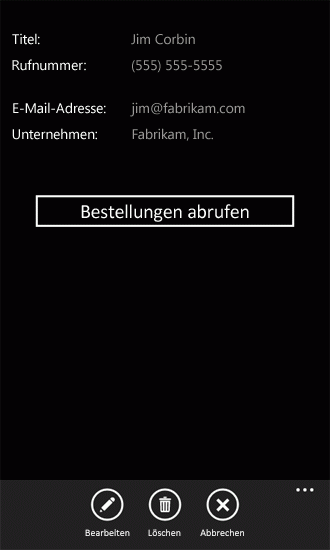

# <a name="how-to-use-multiple-sharepoint-lists-in-a-windows-phone-app"></a><span data-ttu-id="1bfaf-102">Vorgehensweise: Verwenden mehrerer 2013 für SharePoint-in ein Windows Phone-app Listen</span><span class="sxs-lookup"><span data-stu-id="1bfaf-102">How to: Use multiple SharePoint lists in a Windows Phone app</span></span>
<span data-ttu-id="1bfaf-p101">Erstellen Sie Windows Phone-Apps, die Daten aus mehreren SharePoint-Listen verwenden. Sie können mehrere SharePoint-Listen in Ihrer app auf verschiedene Weise verwenden. Beim Erstellen einer Windows Phone-app basierend auf der Vorlage Windows Phone SharePoint List Application Angabe eines einzelnen Ziels SharePoint-Liste, aber die Architektur des resultierenden Projekts ist erweiterbar sein müssen, um die Integration von mehreren Listen zu berücksichtigen.</span><span class="sxs-lookup"><span data-stu-id="1bfaf-p101">Create Windows Phone apps that use data from multiple SharePoint lists. You can use multiple SharePoint lists in your app in several ways. When you create a Windows Phone app based on the Windows Phone SharePoint List Application template, you specify a single target SharePoint list, but the architecture of the resulting project is extensible enough to accommodate the integration of multiple lists.</span></span>
  
    
    


> <span data-ttu-id="1bfaf-106">**Wichtig:** Wenn Sie eine App für Windows Phone 8 entwickeln, müssen Sie Visual Studio Express 2012 anstelle von Visual Studio 2010 Express verwenden.</span><span class="sxs-lookup"><span data-stu-id="1bfaf-106">**Important** If you are developing an app for Windows Phone 8, you must use Visual Studio Express 2012 instead of Visual Studio 2010 Express. Except for the development environment, all information in this article applies to creating apps for both Windows Phone 8 and Windows Phone 7.</span></span> <span data-ttu-id="1bfaf-107">Mit Ausnahme der Entwicklungsumgebung gelten alle Informationen in diesem Artikel für das Erstellen von Apps sowohl auf Windows Phone 8 als auch auf Windows Phone 7.</span><span class="sxs-lookup"><span data-stu-id="1bfaf-107">Important If you are developing an app for Windows Phone 8, you must use Visual Studio Express 2012 instead of Visual Studio 2010 Express. Except for the development environment, all information in this article applies to creating apps for both Windows Phone 8 and Windows Phone 7.</span></span> <span data-ttu-id="1bfaf-108">Weitere Informationen finden Sie unter [Vorgehensweise: Einrichten einer Umgebung für die Entwicklung mobiler Apps für SharePoint](how-to-set-up-an-environment-for-developing-mobile-apps-for-sharepoint.md).</span><span class="sxs-lookup"><span data-stu-id="1bfaf-108">For more information, see  [How to: Set up an environment for developing mobile apps for SharePoint](how-to-set-up-an-environment-for-developing-mobile-apps-for-sharepoint.md).</span></span> 
  
    
    


## <a name="create-a-solution-involving-sharepoint-lists-based-on-the-same-schema"></a><span data-ttu-id="1bfaf-109">Erstellen einer Lösung mit SharePoint-Listen basierend auf demselben Schema</span><span class="sxs-lookup"><span data-stu-id="1bfaf-109">Create a solution involving SharePoint lists based on the same schema</span></span>
<span data-ttu-id="1bfaf-110"><a name="BKMK_SameSchemaProject"> </a></span><span class="sxs-lookup"><span data-stu-id="1bfaf-110"></span></span>

<span data-ttu-id="1bfaf-111">Wenn Sie zwei SharePoint-Listen, die basierend auf dem gleichen Schema verfügen, können Sie nutzen Sie die Klassen, die durch die Vorlage Windows Phone SharePoint List Application implementiert und Objekte dieser Klassen speziell für jede Liste erstellen.</span><span class="sxs-lookup"><span data-stu-id="1bfaf-111">If you have two SharePoint lists based on the same schema, you can take advantage of the classes implemented by the Windows Phone SharePoint List Application template and create objects of those classes specific to each list.</span></span>
  
    
    
<span data-ttu-id="1bfaf-p103">Angenommen Sie, Sie haben zwei SharePoint-Listen basierend auf die Kontakte Listenvorlage. Eine Liste mit dem Namen, beispielsweise Marketingteam, enthält Mitglieder ein Marketingteam in Ihrem Unternehmen, der anderen Liste Entwicklungsteams, Mitglieder der engineering-Team. Wenn Sie Erstellen eines Projekts mithilfe der Vorlage Windows Phone SharePoint List Application, und geben Sie die Liste Marketingteam als der Zielliste, auf dem das Projekt basieren soll, wird eine Instanz der Klasse **ListDataProvider** (benannte **DataProvider** standardmäßig) in der Implementierung der **App** -Klasse in der Datei App.xaml.cs im Projekt erstellt. Dieses Objekt stellt die Liste (d. h., das Marketingteam) Liste als Datenquelle für die app und Bereitstellen von Operationen Zugriff und zum Manipulieren von Elementen in der Liste dar. Eine Instanz der **ListViewModel** -Klasse wird auch für die Liste erstellt, auf dem die app basiert. Dieses Objekt verfügt über einen Eigenschaftenmember (in diesem Fall auch **DataProvider**heißen), der auf einer bestimmten Instanz der Klasse **ListDataProvider** festgelegt werden kann die Datenquelle für die Instanz der **ListViewModel** herstellen.</span><span class="sxs-lookup"><span data-stu-id="1bfaf-p103">Suppose you have two SharePoint lists based on the Contacts list template. One list, named, for instance, Marketing Team, contains members of a marketing team at your organization, and the other list, Engineering Team, contains members of an engineering team. If you create a project using the Windows Phone SharePoint List Application template and specify the Marketing Team list as the target list on which to base the project, an instance of the **ListDataProvider** class is created (named **DataProvider** by default) in the implementation of the **App** class in the App.xaml.cs file in the project. This object represents the list (that is, the Marketing Team) list as a data source for the app, providing operations to access and manipulate items in the list. An instance of the **ListViewModel** class is also created for the list on which the app is based. This object has a property member (which also happens to be named **DataProvider**) that can be set to a given instance of the **ListDataProvider** class, establishing the data source for the **ListViewModel** class instance.</span></span>
  
    
    
<span data-ttu-id="1bfaf-p104">Sie können eine zusätzliche Instanz der **ListDataProvider** -Klasse im Projekt dienen als Datenquelle für die zweite Liste (Entwicklungsteam) in der Datei App.xaml.cs erstellen. Das Objekt wird in den folgenden Code **SecondaryDataProvider** bezeichnet.</span><span class="sxs-lookup"><span data-stu-id="1bfaf-p104">You can create an additional instance of the **ListDataProvider** class in the project to serve as the data source for the second list (Engineering Team) in the App.xaml.cs file. The object is called **SecondaryDataProvider** in the following code.</span></span>
  
    
    


```cs

private static ListDataProvider m_SecondaryDataProvider;

public static ListDataProvider SecondaryDataProvider
{
    get
    {
        if (m_SecondaryDataProvider != null)
            return m_SecondaryDataProvider;

        m_SecondaryDataProvider = new ListDataProvider();
        m_SecondaryDataProvider.ListTitle = "Engineering Team";
        m_SecondaryDataProvider.SiteUrl = new Uri("http://contoso:2012/sites/samplesite/");

        return m_SecondaryDataProvider;
    }
}
```

<span data-ttu-id="1bfaf-120">Sie können dann Instanziieren Sie ein anderes Objekt der **ListViewModel** -Klasse (mit dem Namen, beispielsweise **SecondaryViewModel**) und dessen **DataProvider** -Eigenschaft, wie im folgenden Code **SecondaryDataProvider** -Objekt zuweisen.</span><span class="sxs-lookup"><span data-stu-id="1bfaf-120">Then you can instantiate another object of the **ListViewModel** class (named, for instance, **SecondaryViewModel**) and assign the **SecondaryDataProvider** object to its **DataProvider** property, as in the following code.</span></span>
  
    
    


```cs

private static ListViewModel m_SecondaryViewModel;

public static ListViewModel SecondaryViewModel
{
    get
    {
        if (m_SecondaryViewModel == null)
            m_SecondaryViewModel = new ListViewModel { DataProvider = App.SecondaryDataProvider };

        return m_SecondaryViewModel;
    }
    set
    {
        m_SecondaryViewModel = value;
    }
}
```

<span data-ttu-id="1bfaf-121">Wenn die gleichen Felder und Ansichten für die beiden Listen für Ihre Zwecke geeignet sind (und erneut, wenn die beiden Listen die gleichen Spalten und Felder haben), müssen Sie keine Änderungen vorgenommen haben, in der Implementierung der **ListDataProvider** -Klasse (in der Datei ListDataProvider.cs).</span><span class="sxs-lookup"><span data-stu-id="1bfaf-121">If the same fields and views for the two lists are suitable for your purposes (and, again, if the two lists have the same columns and fields), you don't need to make any changes in the implementation of the **ListDataProvider** class (in the ListDataProvider.cs file).</span></span>
  
    
    
<span data-ttu-id="1bfaf-p105">Zum Anzeigen oder ändern Sie die Daten aus der zweiten Liste in Ihrem Projekt, müssen Sie jedoch hinzufügen, Formulare anzeigen des Projekts, die an gebunden und für diese **SecondaryViewModel**konfiguriert sind. Beispielsweise konnten Sie einen Ordner hinzufügen, um das Projekt mit dem Namen "SecondaryViews" und Hinzufügen einer SecondaryList.xaml-Datei in den Ordner mit Markup ähnelt der von der Vorlage für die primäre Liste im Projekt generierte List.xaml-Standarddatei. Beachten Sie, dass Sie Ihre sekundären Listenformular aus dem primären Listenformular in der app unterscheiden sollte durch eine charakteristische Wert für das **x:Class** -Attribut des **PhoneApplicationPage** -Elements in der Datei SecondaryList.xaml angeben.</span><span class="sxs-lookup"><span data-stu-id="1bfaf-p105">To display or modify the data from the second list in your project, however, you need to add view forms to your project that are bound to and configured for this **SecondaryViewModel**. For example, you could add a folder to your project named "SecondaryViews" and add a SecondaryList.xaml file to that folder with markup similar to that of the default List.xaml file generated by the template for the primary list in the project. Note that you should distinguish your secondary List form from the primary List form in the app by specifying a distinguishing value for the **x:Class** attribute of the **PhoneApplicationPage** element in the SecondaryList.xaml file.</span></span>
  
    
    


```

<phone:PhoneApplicationPage
    x:Class="MultipleSPListApp.SecondaryViews.ListForm"
    xmlns="http://schemas.microsoft.com/winfx/2006/xaml/presentation"
    xmlns:x="http://schemas.microsoft.com/winfx/2006/xaml"
    xmlns:phone="clr-namespace:Microsoft.Phone.Controls;assembly=Microsoft.Phone"
    xmlns:shell="clr-namespace:Microsoft.Phone.Shell;assembly=Microsoft.Phone"
    xmlns:d="http://schemas.microsoft.com/expression/blend/2008"
    xmlns:mc="http://schemas.openxmlformats.org/markup-compatibility/2006"
    mc:Ignorable="d" d:DesignWidth="480" d:DesignHeight="696"
    FontFamily="{StaticResource PhoneFontFamilyNormal}"
    FontSize="{StaticResource PhoneFontSizeNormal}"
    Foreground="{StaticResource PhoneForegroundBrush}"
    SupportedOrientations="PortraitOrLandscape" Orientation="Portrait"
    shell:SystemTray.IsVisible="True" x:Name = "ListViewPage">
...
</phone:PhoneApplicationPage>
```

<span data-ttu-id="1bfaf-p106">Ersetzen Sie in der zugeordneten Code-Behind-Datei, SecondaryList.xaml.cs, alle Verweise auf "App.MainViewModel" durch Verweise auf "App.SecondaryViewModel". Beispielsweise sollte der Konstruktor in der Datei wie folgt aussehen.</span><span class="sxs-lookup"><span data-stu-id="1bfaf-p106">In the associated code-behind file, SecondaryList.xaml.cs, replace all references to "App.MainViewModel" with references to "App.SecondaryViewModel". For example, the constructor in the file should be as follows.</span></span>
  
    
    


```cs

public ListForm()
    {
        InitializeComponent();
        this.DataContext = App.SecondaryViewModel;
    }
```

<span data-ttu-id="1bfaf-p107">Auch ersetzen Sie alle Verweise in der CodeBehind-Datei auf "App.DataProvider" durch Verweise auf "App.SecondaryDataProvider", und aktualisieren Sie alle Navigation Netzwerkpfade so zeigen Sie auf den entsprechenden sekundären XAML-Seiten. Wenn Sie auch ein sekundäres neues Formular auf Ihr Projekt (mit dem Namen, beispielsweise im Ordner SecondaryViews Ihres Projekts SecondaryNewForm.xaml) hinzufügen würde der Handler in der Datei SecondaryList.xaml.cs für das **OnNewButtonClick** -Ereignis dem folgenden Code ähneln.</span><span class="sxs-lookup"><span data-stu-id="1bfaf-p107">Also replace all references in the code-behind file to "App.DataProvider" with references to "App.SecondaryDataProvider" and update any navigation paths to point to the appropriate secondary XAML pages. If you also add a secondary New form to your project (named, for example, SecondaryNewForm.xaml in the SecondaryViews folder of your project), the handler in the SecondaryList.xaml.cs file for the **OnNewButtonClick** event would resemble the following code.</span></span>
  
    
    


```cs

private void OnNewButtonClick(object sender, EventArgs e)
    {
        // Instantiate a new instance of NewItemViewModel and go to NewForm.
        App.SecondaryViewModel.CreateItemViewModelInstance = new NewItemViewModel { DataProvider = App.SecondaryDataProvider };
        NavigationService.Navigate(new Uri("/SecondaryViews/SecondaryNewForm.xaml", UriKind.Relative));
    }
```

<span data-ttu-id="1bfaf-129">Schließlich können Sie die **ApplicationBar** in der Datei List.xaml zum Anzeigen der Seite SecondaryList.xaml eine Schaltfläche hinzufügen.</span><span class="sxs-lookup"><span data-stu-id="1bfaf-129">Finally, you can add a button to the **ApplicationBar** in the List.xaml file to display the SecondaryList.xaml page.</span></span>
  
    
    


```

...
    <phone:PhoneApplicationPage.ApplicationBar>
        <shell:ApplicationBar IsVisible="True" IsMenuEnabled="True">
            <shell:ApplicationBarIconButton x:Name="btnNew" IconUri="/Images/appbar.new.rest.png" Text="New" Click="OnNewButtonClick"/>
            <shell:ApplicationBarIconButton x:Name="btnRefresh" IconUri="/Images/appbar.refresh.rest.png" Text="Refresh" IsEnabled="True" Click="OnRefreshButtonClick"/>
            <!--Add the following button to navigate to the secondary list (Engineering Team).-->
            <shell:ApplicationBarIconButton x:Name="btnSecondaryList" IconUri="/Images/appbar.upload.rest.png" Text="Engineering" IsEnabled="True" Click="OnSecondaryListButtonClick"/>
        </shell:ApplicationBar>
    </phone:PhoneApplicationPage.ApplicationBar>
...
```

<span data-ttu-id="1bfaf-130">Fügen Sie in der zugeordneten Code-Behind-Datei, List.xaml.cs, einen Handler für das **OnSecondaryListButtonClick** -Ereignis in der Datei List.xaml deklariert.</span><span class="sxs-lookup"><span data-stu-id="1bfaf-130">In the associated code-behind file, List.xaml.cs, add a handler for the **OnSecondaryListButtonClick** event declared in the List.xaml file.</span></span>
  
    
    


```cs

private void OnSecondaryListButtonClick(object sender, EventArgs e)
{
    NavigationService.Navigate(new Uri("/SecondaryViews/SecondaryList.xaml", UriKind.Relative));
}
```

<span data-ttu-id="1bfaf-p108">Benutzer Ihrer App können dann zwischen der Marketingteam und das Entwicklungsteam Liste navigieren. Da die zugrunde liegenden Listenschemas die gleichen, die Standard- **DataProvider** sind und **MainViewModel** Objekte mithilfe der Vorlage und den hinzugefügten **SecondaryDataProvider** und **SecondaryViewModel** Objekte Handle alle Datentransaktionen generiert ohne alle Änderungen an der Datei ListDataProvider.cs.</span><span class="sxs-lookup"><span data-stu-id="1bfaf-p108">Users of your app can then navigate between the Marketing Team list and the Engineering Team list. Because the underlying list schemas are the same, the default **DataProvider** and **MainViewModel** objects generated by the template and the added **SecondaryDataProvider** and **SecondaryViewModel** objects handle all the data transactions without requiring any modifications to the ListDataProvider.cs file.</span></span>
  
    
    

## <a name="create-a-solution-involving-sharepoint-lists-based-on-different-schemas"></a><span data-ttu-id="1bfaf-133">Erstellen einer Lösung im Zusammenhang mit SharePoint-Listen basierend auf anderen schemas</span><span class="sxs-lookup"><span data-stu-id="1bfaf-133">Create a solution involving SharePoint lists based on different schemas</span></span>
<span data-ttu-id="1bfaf-134"><a name="BKMK_DifferentSchemasProject"> </a></span><span class="sxs-lookup"><span data-stu-id="1bfaf-134"></span></span>

<span data-ttu-id="1bfaf-135">Die Vorgehensweise im vorherigen Abschnitt Works so ein, dass wechselt (, die für SharePoint-Listen auf das gleiche Schema basiert,), aber der **ListDataProvider** -Klasse in der Windows Phone SharePoint List Application Vorlage für Entwickler zur Anpassung mehreren SharePoint-Listen bearbeitet, die nicht basieren auf dem gleichen Schema oder kann nicht enthalten dieselben Spalten und Felder, verfügbar ist.</span><span class="sxs-lookup"><span data-stu-id="1bfaf-135">The approach in the preceding section works as far as it goes (that is, for SharePoint lists based on the same schema) but the **ListDataProvider** class in the Windows Phone SharePoint List Application template is available to developers for customization to handle multiple SharePoint lists that may not be based on the same schema or may not include the same columns and fields.</span></span>
  
    
    
<span data-ttu-id="1bfaf-p109">Nehmen Sie an, wie im vorherigen Abschnitt, dass eine SharePoint-Liste Marketingteam (basierend auf der Listenvorlage Kontakte), mit der ein Marketingteam-Mitgliedern vorhanden ist. Nehmen Sie an auch, dass Sie eine zweite Liste, mit dem Namen Orders (basierend auf der Vorlage für benutzerdefinierte Listen), mit der Spalten und Feldtypen in Tabelle 1 aufgeführten verfügen.</span><span class="sxs-lookup"><span data-stu-id="1bfaf-p109">Suppose, as in the preceding section, that you have a SharePoint list, Marketing Team (based on the Contacts list template), containing members of a marketing team. Suppose also that you have a second list, named Orders (based on the Custom list template), containing the columns and field types shown in Table 1.</span></span>
  
    
    

<span data-ttu-id="1bfaf-138">**In Tabelle 1. Spalten und Felder für die Orders-Liste**</span><span class="sxs-lookup"><span data-stu-id="1bfaf-138">**Table 1. Columns and fields for Orders list**</span></span>


|<span data-ttu-id="1bfaf-139">**Spalte**</span><span class="sxs-lookup"><span data-stu-id="1bfaf-139">**Column**</span></span>|<span data-ttu-id="1bfaf-140">**Feldtyp**</span><span class="sxs-lookup"><span data-stu-id="1bfaf-140">**Field Type**</span></span>|<span data-ttu-id="1bfaf-141">**Erforderlich**</span><span class="sxs-lookup"><span data-stu-id="1bfaf-141">**Required**</span></span>|
|:-----|:-----|:-----|
|<span data-ttu-id="1bfaf-142">Product (d. h., Titel)</span><span class="sxs-lookup"><span data-stu-id="1bfaf-142">Product (i.e., Title)</span></span>  <br/> |<span data-ttu-id="1bfaf-143">Einzelne Textzeile (Text)</span><span class="sxs-lookup"><span data-stu-id="1bfaf-143">Single line of text (Text)</span></span>  <br/> |<span data-ttu-id="1bfaf-144">Ja</span><span class="sxs-lookup"><span data-stu-id="1bfaf-144">Yes</span></span>  <br/> |
|<span data-ttu-id="1bfaf-145">Einzelpreis</span><span class="sxs-lookup"><span data-stu-id="1bfaf-145">Unit Price</span></span>  <br/> |<span data-ttu-id="1bfaf-146">Währung</span><span class="sxs-lookup"><span data-stu-id="1bfaf-146">Currency</span></span>  <br/> |<span data-ttu-id="1bfaf-147">Ja</span><span class="sxs-lookup"><span data-stu-id="1bfaf-147">Yes</span></span>  <br/> |
|<span data-ttu-id="1bfaf-148">Menge</span><span class="sxs-lookup"><span data-stu-id="1bfaf-148">Quantity</span></span>  <br/> |<span data-ttu-id="1bfaf-149">Zahl</span><span class="sxs-lookup"><span data-stu-id="1bfaf-149">Number</span></span>  <br/> |<span data-ttu-id="1bfaf-150">Keine (Standardwert: 0 (null))</span><span class="sxs-lookup"><span data-stu-id="1bfaf-150">No (defaults to zero)</span></span>  <br/> |
|<span data-ttu-id="1bfaf-151">ORDER-Wert</span><span class="sxs-lookup"><span data-stu-id="1bfaf-151">Order Value</span></span>  <br/> |<span data-ttu-id="1bfaf-152">Berechnet (Einzelpreis * Menge)</span><span class="sxs-lookup"><span data-stu-id="1bfaf-152">Calculated (Unit Price * Quantity)</span></span>  <br/> |<span data-ttu-id="1bfaf-153">Nein</span><span class="sxs-lookup"><span data-stu-id="1bfaf-153">No</span></span>  <br/> |
|<span data-ttu-id="1bfaf-154">Bestelldatum</span><span class="sxs-lookup"><span data-stu-id="1bfaf-154">Order Date</span></span>  <br/> |<span data-ttu-id="1bfaf-155">Datum und Uhrzeit (Datetime)</span><span class="sxs-lookup"><span data-stu-id="1bfaf-155">Date and Time (Datetime)</span></span>  <br/> |<span data-ttu-id="1bfaf-156">Nein</span><span class="sxs-lookup"><span data-stu-id="1bfaf-156">No</span></span>  <br/> |
|<span data-ttu-id="1bfaf-157">Auftragsstatus</span><span class="sxs-lookup"><span data-stu-id="1bfaf-157">Order Status</span></span>  <br/> |<span data-ttu-id="1bfaf-158">Auswahl</span><span class="sxs-lookup"><span data-stu-id="1bfaf-158">Choice</span></span>  <br/> |<span data-ttu-id="1bfaf-159">Nein</span><span class="sxs-lookup"><span data-stu-id="1bfaf-159">No</span></span>  <br/> |
|<span data-ttu-id="1bfaf-160">Kunde</span><span class="sxs-lookup"><span data-stu-id="1bfaf-160">Customer</span></span>  <br/> |<span data-ttu-id="1bfaf-161">Einzelne Textzeile (Text)</span><span class="sxs-lookup"><span data-stu-id="1bfaf-161">Single line of text (Text)</span></span>  <br/> |<span data-ttu-id="1bfaf-162">Nein</span><span class="sxs-lookup"><span data-stu-id="1bfaf-162">No</span></span>  <br/> |
   
<span data-ttu-id="1bfaf-p110">Wie im Beispiel im vorherigen Abschnitt können Sie ein separates **ListDataProvider** und eine andere **ListViewModel** -Objekt zum Verwalten der Orders-Liste instanziieren. Wird davon ausgegangen Sie, dass das instanziierte **ListDataProvider** -Objekt mit der Bezeichnung **OrdersListDataProvider**, wie im folgenden Code wird.</span><span class="sxs-lookup"><span data-stu-id="1bfaf-p110">As in the example in the preceding section, you can instantiate a separate **ListDataProvider** object and another **ListViewModel** object to manage the Orders list. Assume that the instantiated **ListDataProvider** object is named **OrdersListDataProvider**, as in the following code.</span></span>
  
    
    


```cs

private static ListDataProvider m_OrdersListDataProvider;

public static ListDataProvider OrdersListDataProvider
{
    get
    {
        if (m_OrdersListDataProvider != null)
            return m_OrdersListDataProvider;

        m_OrdersListDataProvider = new ListDataProvider();
        m_OrdersListDataProvider.ListTitle = "Orders";
        m_OrdersListDataProvider.SiteUrl = new Uri("http://contoso:2012/sites/samplesite/"); // Specify a URL here for your server.

        return m_OrdersListDataProvider;
    }
}
```

<span data-ttu-id="1bfaf-165">Und wird davon ausgegangen, dass das instanziierte **ListViewModel** -Objekt für die Orders-Liste mit der Bezeichnung **OrdersListViewModel**, wie im folgenden Code wird.</span><span class="sxs-lookup"><span data-stu-id="1bfaf-165">And assume that the instantiated **ListViewModel** object for the Orders list is named **OrdersListViewModel**, as in the following code.</span></span>
  
    
    


```cs

private static ListViewModel m_OrdersListViewModel;

public static ListViewModel OrdersListViewModel
{
    get
    {
        if (m_OrdersListViewModel == null)
            m_OrdersListViewModel = new ListViewModel { DataProvider = App.OrdersListDataProvider };

        return m_OrdersListViewModel;
    }
    set
    {
        m_OrdersListViewModel = value;
    }
}
```

<span data-ttu-id="1bfaf-p111">Das Schema für die Orders-Liste unterscheidet sich von der Liste Marketingteam. Sie können die Unterschiede durch Hinzufügen von Code in der Datei ListDataProvider.cs speziell auf die Klasse **CamlQueryBuilder** angeordnet werden.</span><span class="sxs-lookup"><span data-stu-id="1bfaf-p111">The schema for the Orders list differs from that of the Marketing Team list. You can accommodate the differences by adding code to the ListDataProvider.cs file, specifically to the **CamlQueryBuilder** class.</span></span>
  
    
    


```cs

public static class CamlQueryBuilder
{
    static Dictionary<string, string> ViewXmls = new Dictionary<string, string>()
    {   
        {"View1",   @"<View><Query><OrderBy><FieldRef Name='Title' />
                    <FieldRef Name='FirstName'  /></OrderBy></Query><RowLimit>30</RowLimit><ViewFields>{0}</ViewFields></View>"},
      {"View2",   @"<View><Query><OrderBy><FieldRef Name='ID' /></OrderBy></Query><RowLimit>30</RowLimit>
     <ViewFields>{0}</ViewFields></View>"}
    };

    static string View1Fields = @"<FieldRef Name='Title'/><FieldRef Name='FirstName'/>
   <FieldRef Name='JobTitle'/><FieldRef Name='Email'/><FieldRef Name='Comments'/>";
    static string View2Fields = @"<FieldRef Name='Title'/><FieldRef Name='Unit_x0020_Price'/><FieldRef Name='Quantity'/>
            <FieldRef Name='Order_x0020_Value'/><FieldRef Name='Order_x0020_Date'/>
            <FieldRef Name='Status'/><FieldRef Name='Customer'/>";

    public static CamlQuery GetCamlQuery(string viewName)
    {
        string viewXml = ViewXmls[viewName];
        // Add ViewFields to the ViewXml depending on the view.
        switch (viewName)
        {
            case "View2":
                viewXml = string.Format(viewXml, View2Fields);
                break;
            case "View1":
            default:
                viewXml = string.Format(viewXml, View1Fields);
                break;
        }
        return new CamlQuery { ViewXml = viewXml };
    }
}
```

<span data-ttu-id="1bfaf-p112">Hier wird der zweite Eintrag mit einem Schlüssel-Wert von "View2" das **ViewXmls** **Dictionary** -Objekt für die Orders-Liste hinzugefügt. (Denken Sie daran, die die Schlüsselwerte für Einträge, die **ViewXmls** **Dictionary** in der Klasse **CamlQueryBuilder** hinzugefügt (in der Projektmappe) eindeutig sein für die zwischenspeicherlogik in der Vorlage ordnungsgemäß funktioniert.) String-Variablen ( **View1Fields** und **View2Fields**) dienen zum Speichern der Liste der Felder für die einzelnen Ansichten. Abhängig vom Wert des Parameters **viewName** an die **GetCamlQuery** -Methode übergeben, wird Sie dann die entsprechende CAML-Abfrage-XML-Zeichenfolge erstellt.</span><span class="sxs-lookup"><span data-stu-id="1bfaf-p112">Here, a second entry with a key value of "View2" is added to the **ViewXmls** **Dictionary** object for the Orders list. (Keep in mind that the key values for entries added to the **ViewXmls** **Dictionary** in the **CamlQueryBuilder** class must be unique (in the solution) for the caching logic in the template to operate properly.) String variables ( **View1Fields** and **View2Fields**) are used to store the list of fields for each view. Then, depending on the value of the **viewName** parameter passed to the **GetCamlQuery** method, the appropriate CAML query XML string is created.</span></span>
  
    
    
<span data-ttu-id="1bfaf-p113">Klicken Sie, wie im vorherigen Abschnitt, Ansicht Formulare für die Liste, diesmal gebunden, auf die Objekte **OrdersListViewModel** und **OrdersListDataProvider** erstellen können. Als Beispiel, das XAML für ein Listenformular speziell für die Orders-Liste mit dem Namen OrdersList.xaml, ähnlich wie das Markup in der Datei List.xaml von der Vorlage für die primäre Liste in der app generiert würde, außer dass würde, nennen Sie das **PivotItem** -Steuerelement, das die Liste "View2" rendert (anstelle der Standardeinstellung "View1") und legen Sie die Deklaration **Binding** für das **ItemsSource** -Attribut des **ListBox** -Steuerelements in der Listenelemente auf "View2" wie in der folgenden gerendert werden Markup (der nur das Markup für das Stammraster der Seite angezeigt wird).</span><span class="sxs-lookup"><span data-stu-id="1bfaf-p113">Then, as in the preceding section, you can create view forms for the list, bound this time to the **OrdersListViewModel** and **OrdersListDataProvider** objects. As an example, the XAML for a List form specific to the Orders list, named OrdersList.xaml, would be similar to the markup in the List.xaml file generated by the template for the primary list in the app, except that you would name the **PivotItem** control that renders the list "View2" (rather than the default, "View1") and set the **Binding** declaration for the **ItemsSource** attribute of the **ListBox** control in which list items are rendered to "View2" as in the following markup (which shows only the markup for the root grid of the page).</span></span>
  
    
    


```

...
    <Grid x:Name="LayoutRoot" Background="Transparent" xmlns:x="http://schemas.microsoft.com/winfx/2006/xaml" xmlns:controls="clr-namespace:Microsoft.Phone.Controls;assembly=Microsoft.Phone.Controls">
        <!--Pivot Control-->
        <ProgressBar x:Name="progressBar" Opacity="1" HorizontalAlignment="Center" VerticalAlignment="Top" 
               Height="30" Width="470" IsIndeterminate="{Binding IsBusy}" Visibility="{Binding ShowIfBusy}" />
        <Grid x:Name="ContentPanel" Grid.Row="0" Width="470">
            <controls:Pivot Name="Views" Title="Orders" LoadedPivotItem="OnPivotItemLoaded">
                <!--Pivot item-->
                <controls:PivotItem Name="View2" Header="All Orders">
                    <!--Double line list with text wrapping-->
                    <ListBox x:Name="lstBox1" Margin="0,0,-12,0" SelectionChanged="OnSelectionChanged" ItemsSource="{Binding [View2]}">
                        <ListBox.ItemTemplate>
                            <DataTemplate>
                                <StackPanel Orientation="Vertical" Margin="10">
                                    <TextBlock Name="txtTitle" Text="{Binding [Title]}" TextWrapping="NoWrap" 
                                          Style="{StaticResource PhoneTextTitle2Style}" />
                                    <TextBlock Name="txtUnitPrice" Text="{Binding [Unit_x0020_Price]}" 
                                         TextWrapping="NoWrap" Style="{StaticResource PhoneTextNormalStyle}" />
                                    <TextBlock Name="txtQuantity" Text="{Binding [Quantity]}"
                                         TextWrapping="NoWrap" Style="{StaticResource PhoneTextNormalStyle}" />
                                </StackPanel>
                            </DataTemplate>
                        </ListBox.ItemTemplate>
                    </ListBox>
                </controls:PivotItem>
            </controls:Pivot>
        </Grid>
    </Grid>
...
```

<span data-ttu-id="1bfaf-p114">Eine bequeme Möglichkeit zum Erstellen der geeigneten XAML-Markup wird die Vorlage Windows Phone SharePoint List Application verwendet, so generieren ein separates Projekt basierend auf der Orders-Liste und kopieren Sie den generierten XAML-Code aus diesem Projekt zum Projekt mit mehreren Listen, sorgen, dass Sie den Namen des Steuerelements **PivotItem** ändern (die standardmäßig auf "View1") auf "View2" und die **Binding** Deklaration des **ListBox** -Steuerelements zu ändern, wie hier gezeigt. Sie müssen auch alle Verweise in der zugeordneten Code-Behind-Datei für das Formular an die entsprechenden Objekte **ListViewModel** und **DataProvider** (als, z. B. **OrdersListViewModel** und **OrdersListDataProvider**) zu ändern.</span><span class="sxs-lookup"><span data-stu-id="1bfaf-p114">A convenient way to create suitable XAML markup is to use the Windows Phone SharePoint List Application template to generate a separate project based on the Orders list and then copy the generated XAML from that project to the project with multiple lists, taking care to change the name of the **PivotItem** control (which defaults to "View1") to "View2" and to change the **Binding** declaration of the **ListBox** control as shown here. You would also need to change all references in the associated code-behind file for the form to specify the appropriate **ListViewModel** and **DataProvider** objects (as, for example, **OrdersListViewModel** and **OrdersListDataProvider**).</span></span>
  
    
    
<span data-ttu-id="1bfaf-p115">Diese Vorgehensweise funktioniert, weil in der zugeordneten Code-Behind-Datei (mit dem Namen, in diesem Fall OrdersList.xaml.cs), die verschiedene Ereignishandler, die Methoden des **ListDataProvider** -Objekts (in diesem Fall **OrdersListDataProvider**) Liste Daten mit den Namen der **PivotItem** Zugriff auf Aufrufen als anzugeben, verwenden Sie die gewünschte Ansicht steuern. Beispielsweise der **OnPivotItemLoaded** -Ereignishandler ruft die **LoadData** -Methode des **OrdersListViewModel** -Objekts, das von der **ListViewModel** -Klasse instanziiert (und diese Methode ruft wiederum die **LoadData** -Methode des **OrdersListDataProvider** -Objekts), übergeben Sie den Namen des Steuerelements **PivotItem** (hier "View2") als Wert des Parameters **ViewName** an die-Methode. Diese denselben Wert wird letztendlich (als Wert des Parameters **viewName** ) an die in der geänderten Implementierung der **CamlQueryBuilder** -Klasse oben gezeigten **GetCamlQuery** -Methode übergeben.</span><span class="sxs-lookup"><span data-stu-id="1bfaf-p115">This approach works because in the associated code-behind file (named, in this case, OrdersList.xaml.cs), the various event handlers that call methods of the **ListDataProvider** object (here, **OrdersListDataProvider**) to access list data use the name of the **PivotItem** control as a way to specify the appropriate view to use. For example, the **OnPivotItemLoaded** event handler calls the **LoadData** method of the **OrdersListViewModel** object instantiated from the **ListViewModel** class (and this method in turn calls the **LoadData** method of the **OrdersListDataProvider** object), passing the name of the **PivotItem** control (here, "View2") as the value of the **ViewName** parameter to the method. This same value is ultimately passed (as the value of the **viewName** parameter) to the **GetCamlQuery** method shown above in the modified implementation of the **CamlQueryBuilder** class.</span></span>
  
    
    

## <a name="an-alternative-approach-for-a-solution-involving-sharepoint-lists-based-on-different-schemas"></a><span data-ttu-id="1bfaf-178">Ein anderer Ansatz für eine Lösung unter Verwendung von SharePoint-Listen basierend auf anderen schemas</span><span class="sxs-lookup"><span data-stu-id="1bfaf-178">An alternative approach for a solution involving SharePoint lists based on different schemas</span></span>
<span data-ttu-id="1bfaf-179"><a name="BKMK_DifferentSchemasAlternative"> </a></span><span class="sxs-lookup"><span data-stu-id="1bfaf-179"></span></span>

<span data-ttu-id="1bfaf-p116">Als Alternative zum Ansatz im vorherigen Abschnitt können Sie die Vorlage Windows Phone SharePoint List Application verwenden, erstellen Sie eine Windows Phone-app-Projekt in einer Projektmappe Microsoft Visual Studio 2010 basierend auf einer bestimmten SharePoint-Liste, und fügen Sie die Projekte basierend auf anderen Listen, um die gleiche Lösung erstellt. Dieser Ansatz ermöglicht Ihnen die Vorlage zum Generieren von Formularen, die speziell für jede Liste SharePoint nutzen. Anschließend können Sie die Lösung anpassen, je nach Bedarf steuern, wie Benutzer mit den Listen interagieren. Führen Sie die Verfahren in diesem Abschnitt vor, die diesen Ansatz.</span><span class="sxs-lookup"><span data-stu-id="1bfaf-p116">As an alternative to the approach in the preceding section, you can use the Windows Phone SharePoint List Application template to create a Windows Phone app project in a Microsoft Visual Studio 2010 solution based on a given SharePoint list and then add projects built based on other lists to that same solution. This approach allows you to take advantage of the template for generating forms specific to each SharePoint list. You can then customize the solution according to your needs to control how users interact with the lists. The procedures in this section demonstrate that approach.</span></span>
  
    
    
<span data-ttu-id="1bfaf-p117">Wird für die folgenden Verfahren vorausgesetzt, steht Ihnen eine SharePoint-Liste mit dem Namen Orders (basierend auf der Vorlage für benutzerdefinierte Listen), und die Spalten und Feldtypen wie in Tabelle 1 im vorherigen Abschnitt dargestellt. Darüber hinaus wird vorausgesetzt, Sie haben eine andere SharePoint-Liste (erneut, basierend auf der Vorlage für benutzerdefinierte Listen), mit dem Namen Kunden, und die Spalten und Feldtypen in Tabelle 2 gezeigt.</span><span class="sxs-lookup"><span data-stu-id="1bfaf-p117">Assume for the following procedures that you have a SharePoint list named Orders (based on the Custom list template), with the columns and field types as shown in Table 1 in the preceding section. In addition, assume you have another SharePoint list (again, based on the Custom list template), named Customers, with the columns and field types shown in Table 2.</span></span>
  
    
    

<span data-ttu-id="1bfaf-186">**In Tabelle 2. Spalten und Felder für Kundenliste**</span><span class="sxs-lookup"><span data-stu-id="1bfaf-186">**Table 2. Columns and fields for Customers list**</span></span>


|<span data-ttu-id="1bfaf-187">**Spalte**</span><span class="sxs-lookup"><span data-stu-id="1bfaf-187">**Column**</span></span>|<span data-ttu-id="1bfaf-188">**Feldtyp**</span><span class="sxs-lookup"><span data-stu-id="1bfaf-188">**Field Type**</span></span>|<span data-ttu-id="1bfaf-189">**Erforderlich**</span><span class="sxs-lookup"><span data-stu-id="1bfaf-189">**Required**</span></span>|
|:-----|:-----|:-----|
|<span data-ttu-id="1bfaf-190">Kundenname (d. h., Titel)</span><span class="sxs-lookup"><span data-stu-id="1bfaf-190">Customer Name (i.e., Title)</span></span>  <br/> |<span data-ttu-id="1bfaf-191">Einzelne Textzeile (Text)</span><span class="sxs-lookup"><span data-stu-id="1bfaf-191">Single line of text (Text)</span></span>  <br/> |<span data-ttu-id="1bfaf-192">Ja</span><span class="sxs-lookup"><span data-stu-id="1bfaf-192">Yes</span></span>  <br/> |
|<span data-ttu-id="1bfaf-193">Rufnummer</span><span class="sxs-lookup"><span data-stu-id="1bfaf-193">Contact Number</span></span>  <br/> |<span data-ttu-id="1bfaf-194">Einzelne Textzeile (Text)</span><span class="sxs-lookup"><span data-stu-id="1bfaf-194">Single line of text (Text)</span></span>  <br/> |<span data-ttu-id="1bfaf-195">Nein</span><span class="sxs-lookup"><span data-stu-id="1bfaf-195">No</span></span>  <br/> |
|<span data-ttu-id="1bfaf-196">E-Mail-Adresse</span><span class="sxs-lookup"><span data-stu-id="1bfaf-196">E-mail Address</span></span>  <br/> |<span data-ttu-id="1bfaf-197">Einzelne Textzeile (Text)</span><span class="sxs-lookup"><span data-stu-id="1bfaf-197">Single line of text (Text)</span></span>  <br/> |<span data-ttu-id="1bfaf-198">Nein</span><span class="sxs-lookup"><span data-stu-id="1bfaf-198">No</span></span>  <br/> |
|<span data-ttu-id="1bfaf-199">Unternehmen</span><span class="sxs-lookup"><span data-stu-id="1bfaf-199">Company</span></span>  <br/> |<span data-ttu-id="1bfaf-200">Einzelne Textzeile (Text)</span><span class="sxs-lookup"><span data-stu-id="1bfaf-200">Single line of text (Text)</span></span>  <br/> |<span data-ttu-id="1bfaf-201">Nein</span><span class="sxs-lookup"><span data-stu-id="1bfaf-201">No</span></span>  <br/> |
   
<span data-ttu-id="1bfaf-p118">In den folgenden Verfahren erstellen Sie eine Windows Phone-app, die beide dieser Listen verwendet. Die primäre Liste in der app ist die Kunden-Liste. Wenn Sie die Details für einen bestimmten Kunden in dem Formular anzeigen anzeigen, ist eine Schaltfläche auf dem Formular enthalten, die Benutzer alle Aufträge (aus der Orders-Liste) zugeordnet dieses Kunden anzeigen können.</span><span class="sxs-lookup"><span data-stu-id="1bfaf-p118">In the following procedures, you create a Windows Phone app that uses both of these lists. The primary list in the app is the Customers list. When you display the details for a given customer in the Display form, a button is included on the form that allows users to display all the orders (from the Orders list) associated with that customer.</span></span>
  
    
    

### <a name="to-create-the-component-projects-for-the-solution"></a><span data-ttu-id="1bfaf-205">Erstellen des Komponentenprojekts für die Lösung</span><span class="sxs-lookup"><span data-stu-id="1bfaf-205">To create the component projects for the solution</span></span>


1. <span data-ttu-id="1bfaf-206">Erstellen Sie eine App für Windows Phone mithilfe der Windows Phone SharePoint-Listenanwendungsvorlage, indem Sie eine SharePoint-Liste angeben, die basierend auf den Spalten- und Feldertypen aus Tabelle 2 definiert wird.</span><span class="sxs-lookup"><span data-stu-id="1bfaf-206">Create a Windows Phone app by using the Windows Phone SharePoint List Application template, specifying a SharePoint list defined based on the columns and field types shown in Table 2.</span></span> <span data-ttu-id="1bfaf-207">In dem Verfahren dieses Abschnitts wird davon ausgegangen, dass der Name der Liste im Projekt "Kunden" und der Name des Projekts "CustomersSPListApp" ist.</span><span class="sxs-lookup"><span data-stu-id="1bfaf-207">In the procedures in this section, it is assumed that the name of the list in the project is "Customers" and the name of the project is "CustomersSPListApp".</span></span> <span data-ttu-id="1bfaf-208">(Weitere Informationen zum Erstellen einer auf der Windows Phone-SharePoint-Listenanwendungsvorlage basierenden App finden Sie unter [Vorgehensweise: Erstellen einer Windows Phone-SharePoint-Listen-App](how-to-create-a-windows-phone-sharepoint-list-app.md).</span><span class="sxs-lookup"><span data-stu-id="1bfaf-208">(See  [How to: Create a Windows Phone SharePoint list app](how-to-create-a-windows-phone-sharepoint-list-app.md) for information about creating an app based on the Windows Phone SharePoint List Application template..md)</span></span>
    
  
2. <span data-ttu-id="1bfaf-209">Wählen Sie in Visual Studio die Optionen **Datei**, **Hinzufügen**, **Neues Projekt**.</span><span class="sxs-lookup"><span data-stu-id="1bfaf-209">In Visual Studio, choose **File**, **Add**, **New Project**.</span></span> 
    
    <span data-ttu-id="1bfaf-210">Das Dialogfeld **Neues Projekt hinzufügen** wird angezeigt.</span><span class="sxs-lookup"><span data-stu-id="1bfaf-210">The **Add New Project** dialog box appears.</span></span>
    
  
3. <span data-ttu-id="1bfaf-211">Wählen Sie im Dialogfeld **Neues Projekt hinzufügen** unter dem Knoten **Visual c#** den **Silverlight für Windows Phone**-Knoten.</span><span class="sxs-lookup"><span data-stu-id="1bfaf-211">In the **Add New Project** dialog box, under the **Visual C#** node, choose the **Silverlight for Windows Phone** node.</span></span>
    
  
4. <span data-ttu-id="1bfaf-212">Wählen Sie im Bereich **Vorlagen** die Vorlage Windows Phone SharePoint List Application.</span><span class="sxs-lookup"><span data-stu-id="1bfaf-212">In the **Templates** pane, choose the Windows Phone SharePoint List Application template.</span></span>
    
  
5. <span data-ttu-id="1bfaf-213">Benennen der app, beispielsweise OrdersSPListApp, und klicken Sie dann auf **OK**.</span><span class="sxs-lookup"><span data-stu-id="1bfaf-213">Name the app, for example, OrdersSPListApp, and then choose **OK**.</span></span>
    
  
6. <span data-ttu-id="1bfaf-p120">Gehen Sie wie beschrieben in  [Vorgehensweise: Erstellen eine Windows Phone SharePoint Liste app](how-to-create-a-windows-phone-sharepoint-list-app.md) zu einem anderen Windows Phone-app-Projekt erstellen, Angeben von einer SharePoint-Liste definierten basierend auf der Spalten und Feld Typen anzeigen in Tabelle 1 als der Zielliste für das Projekt. Sie haben zwei Projekte jetzt in Ihrer Lösung, mit der Bezeichnung "CustomersSPListApp" und "OrdersSPListApp" (Wenn Sie die Namenskonventionen in diesem Verfahren folgen).</span><span class="sxs-lookup"><span data-stu-id="1bfaf-p120">Follow the procedure described in  [How to: Create a Windows Phone SharePoint list app](how-to-create-a-windows-phone-sharepoint-list-app.md) to create another Windows Phone app project, specifying a SharePoint list defined based on the columns and field types show in Table 1 as the target list for the project. You should now have two projects in your solution, named "CustomersSPListApp" and "OrdersSPListApp" (if you are following the naming conventions in this procedure).</span></span>
    
  
7. <span data-ttu-id="1bfaf-216">Wählen Sie im **Projektmappen-Explorer** den Projektknoten CustomerSPListApp ein.</span><span class="sxs-lookup"><span data-stu-id="1bfaf-216">In **Solution Explorer**, choose the CustomerSPListApp project node.</span></span>
    
  
8. <span data-ttu-id="1bfaf-217">Wählen Sie im Menü **Projekt** **Verweis hinzufügen** aus.</span><span class="sxs-lookup"><span data-stu-id="1bfaf-217">On the **Project** menu, choose **Add Reference**.</span></span> 
    
    <span data-ttu-id="1bfaf-218">Das Dialogfeld **Verweis hinzufügen** wird angezeigt.</span><span class="sxs-lookup"><span data-stu-id="1bfaf-218">The **Add Reference** dialog box appears.</span></span>
    
  
9. <span data-ttu-id="1bfaf-p121">Klicken Sie auf der Registerkarte **Projekte** wählen Sie das Projekt OrdersSPListApp in der Lösung, und wählen Sie dann auf die Schaltfläche **OK**. Das Projekt wird unter dem Knoten **Verweise** des Projekts CustomersSPListApp hinzugefügt.</span><span class="sxs-lookup"><span data-stu-id="1bfaf-p121">On the **Projects** tab, choose the OrdersSPListApp project in the solution, and then choose the **OK** button. The project is added under the **References** node of the CustomersSPListApp project.</span></span>
    
  
<span data-ttu-id="1bfaf-p122">Konfigurieren Sie anschließend die beiden Projekte in der Lösung an. Sie konfigurieren im Wesentlichen das OrdersSPListApp-Projekt (basierend auf der Orders-Liste) als "Suche" Projekt für das CustomerSPListApp-Projekt (basierend auf der Liste für Kunden) ausgeführt werden.</span><span class="sxs-lookup"><span data-stu-id="1bfaf-p122">Next, configure the two projects in the solution. You essentially configure the OrdersSPListApp project (based on the Orders list) to operate as a "look-up" project for the CustomerSPListApp project (based on the Customers List).</span></span>
  
    
    

### <a name="to-configure-the-orderssplistapp-project"></a><span data-ttu-id="1bfaf-223">So konfigurieren Sie das Projekt OrdersSPListApp</span><span class="sxs-lookup"><span data-stu-id="1bfaf-223">To configure the OrdersSPListApp project</span></span>


1. <span data-ttu-id="1bfaf-p123">Ändern Sie die Navigationspfade in den Formularen anzeigen des Projekts OrdersSPListApp, um den primären Namespace des Projekts ("OrdersSPListApp") und die Bezeichnung "Komponente" enthalten. Beispielsweise im Ereignishandler für das OnNewButtonClick-Ereignis in der Datei List.xaml.cs des Projekts OrdersSPListApp, ändern Sie den Anruf an die Navigate-Methode des NavigationService-Objekts aus diesem:</span><span class="sxs-lookup"><span data-stu-id="1bfaf-p123">Change the navigation paths in the view forms of the OrdersSPListApp project to include the primary namespace of the project ("OrdersSPListApp") and the "component" designation. For example, in the handler for the OnNewButtonClick event in the List.xaml.cs file of the OrdersSPListApp project, change the call to the Navigate method of the NavigationService object from this:</span></span>
    
     `NavigationService.Navigate(new Uri("/Views/NewForm.xaml", UriKind.Relative));`
    
    <span data-ttu-id="1bfaf-226">in:</span><span class="sxs-lookup"><span data-stu-id="1bfaf-226">To this:</span></span>
    
     `NavigationService.Navigate(new Uri("/OrdersSPListApp;component/Views/NewForm.xaml", UriKind.Relative));`
    
    <span data-ttu-id="1bfaf-227">Die einfachste Möglichkeit, diese Änderungen vornehmen ist den Befehl **Quick Replace** im Projekt OrdersSPListApp verwendet.</span><span class="sxs-lookup"><span data-stu-id="1bfaf-227">The easiest way to make these changes is to use the **Quick Replace** command in the OrdersSPListApp project.</span></span>
    
1. <span data-ttu-id="1bfaf-228">Wählen Sie im **Projektmappen-Explorer** den Projektknoten OrdersSPListApp ein.</span><span class="sxs-lookup"><span data-stu-id="1bfaf-228">In **Solution Explorer**, choose the OrdersSPListApp project node.</span></span>
    
  
2. <span data-ttu-id="1bfaf-229">Drücken Sie STRG + H, um das Dialogfeld **Quick Replace** anzuzeigen.</span><span class="sxs-lookup"><span data-stu-id="1bfaf-229">Press Ctrl+H to display the **Quick Replace** dialog box.</span></span>
    
  
3. <span data-ttu-id="1bfaf-230">Geben Sie in das Feld **Suchen nach** Text an, der folgende Text genau wie er hier angezeigt wird:</span><span class="sxs-lookup"><span data-stu-id="1bfaf-230">In the **Find what** text box, specify the following text exactly as it is appears here:</span></span>
    
    <span data-ttu-id="1bfaf-231">Der URI ("/Views/</span><span class="sxs-lookup"><span data-stu-id="1bfaf-231">Uri("/Views/</span></span>
    
  
4. <span data-ttu-id="1bfaf-232">Geben Sie den folgenden Text in das Textfeld **Ersetzen durch** genau wie hier angezeigt:</span><span class="sxs-lookup"><span data-stu-id="1bfaf-232">In the **Replace with** text box, specify the following text exactly as it appears here:</span></span>
    
    <span data-ttu-id="1bfaf-233">Uri("/OrdersSPListApp;component/Views/</span><span class="sxs-lookup"><span data-stu-id="1bfaf-233">Uri("/OrdersSPListApp;component/Views/</span></span>
    
  
5. <span data-ttu-id="1bfaf-234">Stellen Sie sicher, dass das **Aktuelle Projekt** in der Dropdownliste **Suchen in** ausgewählt ist.</span><span class="sxs-lookup"><span data-stu-id="1bfaf-234">Ensure that **Current Project** is selected in the **Look in** drop-down list.</span></span>
    
  
6. <span data-ttu-id="1bfaf-235">Wählen Sie **Alle ersetzen**.</span><span class="sxs-lookup"><span data-stu-id="1bfaf-235">Choose **Replace All**.</span></span>
    
  
7. <span data-ttu-id="1bfaf-236">Speichern Sie alle geänderte Dateien im Projekt.</span><span class="sxs-lookup"><span data-stu-id="1bfaf-236">Save all changed files in the project.</span></span>
    
  
2. <span data-ttu-id="1bfaf-p124">Fügen Sie eine Elementeigenschaft in die Datei App.xaml.cs des Projekts OrdersSPListApp. Wählen Sie im **Projektmappen-Explorer** unter den Projektknoten OrdersSPListApp Objektebene.</span><span class="sxs-lookup"><span data-stu-id="1bfaf-p124">Add a member property to the App.xaml.cs file of the OrdersSPListApp project. In **Solution Explorer**, under the OrdersSPListApp project node, choose the App.xaml file.</span></span>
    
  
3. <span data-ttu-id="1bfaf-239">Taste(n)F7um seine zugeordnete Code-Behind-Datei App.xaml.cs, zur Bearbeitung zu öffnen.</span><span class="sxs-lookup"><span data-stu-id="1bfaf-239">Press F7 to open its associated code-behind file, App.xaml.cs, for editing.</span></span>
    
  
4. <span data-ttu-id="1bfaf-240">Fügen Sie innerhalb der Codeblock (abgegrenzt durch öffnende und schließende geschweifte Klammern), der die partiellen Klasse **App** implementiert wird, den folgenden Code ein.</span><span class="sxs-lookup"><span data-stu-id="1bfaf-240">Within the code block (demarcated by opening and closing braces) that implements the **App** partial class, add the following code.</span></span>
    
```cs
  
public static string CustomerName { get; set; }
```

5. <span data-ttu-id="1bfaf-241">Wählen Sie im **Projektmappen-Explorer** unter den Projektknoten OrdersSPListApp die List.xaml-Datei ein.</span><span class="sxs-lookup"><span data-stu-id="1bfaf-241">In **Solution Explorer**, under the OrdersSPListApp project node, choose the List.xaml file.</span></span>
    
  
6. <span data-ttu-id="1bfaf-242">Taste(n)F7um seine zugeordnete Code-Behind-Datei List.xaml.cs, zur Bearbeitung zu öffnen.</span><span class="sxs-lookup"><span data-stu-id="1bfaf-242">Press F7 to open its associated code-behind file, List.xaml.cs, for editing.</span></span>
    
  
7. <span data-ttu-id="1bfaf-p125">Ändern des **OnNavigatedTo** -ereignishandlers in der Datei analysiert die **QueryString** -Eigenschaft des **NavigationContext** -Objekts, um den Wert der in Schritt 4 deklarierten Variablen **CustomerName** festzulegen. Sie können auch die **Header** -Eigenschaft des Steuerelements **PivotItem** des Listenformulars entsprechend den Namen des Kunden für die Nutzung durch die Benutzer festlegen. Der geänderte Handler sollte wie folgt aussehen.</span><span class="sxs-lookup"><span data-stu-id="1bfaf-p125">Modify the **OnNavigatedTo** event handler in the file to parse the **QueryString** property of the **NavigationContext** object to set the value of the **CustomerName** variable declared in step 4. You can also set the **Header** property of the **PivotItem** control on the List form to match the customer name, for the convenience of your users. The modified handler should be as follows.</span></span>
    
```cs
  protected override void OnNavigatedTo(System.Windows.Navigation.NavigationEventArgs e)
{
    base.OnNavigatedTo(e);

    if (this.NavigationContext.QueryString.ContainsKey("CustomerName"))
    {
        App.CustomerName = NavigationContext.QueryString["CustomerName"];
    }

    // Also set the value of the Header property for the PivotItem to match the customer name.
    if (!string.IsNullOrWhiteSpace(App.CustomerName))
    {
        this.View1.Header = App.CustomerName;
    }

    App.MainViewModel.ViewDataLoaded += new EventHandler<ViewDataLoadedEventArgs>(OnViewDataLoaded);
    App.MainViewModel.InitializationCompleted += new EventHandler<InitializationCompletedEventArgs>(OnViewModelInitialization);
}
```

8. <span data-ttu-id="1bfaf-p126">Fügen Sie die **CustomerName** -Variable als Argument im Aufruf der **LoadData** -Methode in der **OnPivotItemLoaded** -Ereignishandler in der Datei List.xaml.cs. Die Implementierung der **OnPivotItemLoaded** -Ereignishandler sollte wie folgt aussehen.</span><span class="sxs-lookup"><span data-stu-id="1bfaf-p126">Add the **CustomerName** variable as an argument in the call to the **LoadData** method in the **OnPivotItemLoaded** event handler in the List.xaml.cs file. The implementation of the **OnPivotItemLoaded** event handler should be as follows.</span></span>
    
```cs
  
private void OnPivotItemLoaded(object sender, PivotItemEventArgs e)
{
    if (!App.MainViewModel.IsInitialized)
    {
        //Initialize ViewModel and Load Data for PivotItem upon initialization.
        App.MainViewModel.Initialize();
    }
    else
    {
        //Load Data for the currently loaded PivotItem.
        App.MainViewModel.LoadData(e.Item.Name, App.CustomerName);
    }
}
```


    The **LoadData** method of the **ListViewModel** class in the template is defined such as to be able to accept optional parameters.
    
  
9. <span data-ttu-id="1bfaf-p127">Fügen Sie auch die **CustomerName** -Variable als Argument im Aufruf der **LoadData** -Methode in der **OnViewModelInitialization** -Ereignishandler hinzu. Die Implementierung der **OnViewModelInitialization** -Ereignishandler sollte wie folgt aussehen.</span><span class="sxs-lookup"><span data-stu-id="1bfaf-p127">Also add the **CustomerName** variable as an argument in the call to the **LoadData** method in the **OnViewModelInitialization** event handler. The implementation of the **OnViewModelInitialization** event handler should be as follows.</span></span>
    
```cs
  
private void OnViewModelInitialization(object sender, InitializationCompletedEventArgs e)
{
    this.Dispatcher.BeginInvoke(() =>
    {
        //If initialization has failed, show error message and return.
        if (e.Error != null)
        {
            MessageBox.Show(e.Error.Message, e.Error.GetType().Name, MessageBoxButton.OK);
            return;
        }
        App.MainViewModel.LoadData(((PivotItem)Views.SelectedItem).Name, App.CustomerName);
        this.DataContext = (sender as ListViewModel);
    });
}
```

10. <span data-ttu-id="1bfaf-p128">Fügen Sie die **CustomerName** -Variable als Argument im Aufruf der **RefreshData** -Methode in der **OnRefreshButtonClick** -Ereignishandler in der Datei List.xaml.cs. Die Implementierung der **OnRefreshButtonClick** -Ereignishandler sollte wie folgt aussehen.</span><span class="sxs-lookup"><span data-stu-id="1bfaf-p128">Add the **CustomerName** variable as an argument in the call to the **RefreshData** method in the **OnRefreshButtonClick** event handler in the List.xaml.cs file. The implementation of the **OnRefreshButtonClick** event handler should be as follows.</span></span>
    
```cs
  
private void OnRefreshButtonClick(object sender, EventArgs e)
{
    if (Views.SelectedItem == null)
        return;

    if (!App.MainViewModel.IsInitialized)
    {
        //Initialize ViewModel and Load Data for PivotItem upon completion.
        App.MainViewModel.Initialize();
    }
    else
    {   //Refresh Data for the currently loaded PivotItem.
        App.MainViewModel.RefreshData(((PivotItem)Views.SelectedItem).Name, App.CustomerName);
    }
}
```


    As for the **LoadData** method, the **RefreshData** method is also defined to be able to accept optional parameters. Notice that in the preceding three steps, the only change to the event handlers as generated by the template is the addition of the **CustomerName** variable as an argument in the call to the **LoadData** or **RefreshData** methods.
    
  
11. <span data-ttu-id="1bfaf-p129">Wenn Benutzer auf das Listenformular für die Orders-Liste auf die Schaltfläche **neu** in Ihrer app auswählen können, sollte das Feld Kunde in das neue Formular bereits den Namen des Kunden, enthalten, da die Liste der Aufträge angezeigt, die dem Benutzer basierend auf den Namen des Kunden gefiltert wurde. Neue Aufträge aus der gefilterten Liste hinzugefügt sollte der Name des Kunden zugeordnet sein, auf denen die Liste gefiltert wird. Um den Wert der Variablen **CustomerName** an das neue Formular zu übergeben, ändern Sie das **OnNewButtonClick** -Ereignis, um den Wert als Zeichenfolge in der Pfad zum neuen Formular enthalten wie im folgenden Code dargestellt.</span><span class="sxs-lookup"><span data-stu-id="1bfaf-p129">When users choose the **New** button on the List form for the Orders list in your app, the Customer field in the New form should already contain the name of the customer, because the list of orders displayed to the user has been filtered based on the customer name. New orders added from that filtered list should be associated with the customer name on which the list is filtered. To pass the value of the **CustomerName** variable to the New form, modify the **OnNewButtonClick** event to include the value as a query string in the navigation path to the New form, as shown in the following code.</span></span>
    
```cs
  
private void OnNewButtonClick(object sender, EventArgs e)
{
    //Instantiate a new instance of NewItemViewModel and go to NewForm.
    App.MainViewModel.CreateItemViewModelInstance = new NewItemViewModel { DataProvider = App.DataProvider };
    
    if (!string.IsNullOrWhiteSpace(App.CustomerName))
    {
        NavigationService.Navigate(new Uri("/OrdersSPListApp;component/Views/NewForm.xaml?CustomerName=" + 
                                                                            App.CustomerName, UriKind.Relative));
    }
    else
    {
        NavigationService.Navigate(new Uri("/OrdersSPListApp;component/Views/NewForm.xaml", UriKind.Relative));
    }
}
```

12. <span data-ttu-id="1bfaf-p130">Überprüfen Sie die Abfragezeichenfolge für einen Kundennamen im **OnNavigatedTo** -Ereignishandler für das neue Formular und falls es zur Verfügung steht, weisen Sie das Feld Kunde, der das Ansichtsmodell für das Formular. Klicken Sie im **Projektmappen-Explorer** unter dem Projekt OrdersSPListApp wählen Sie die Datei NewForm.xaml und drücken SieF7um seine zugeordnete Code-Behind-Datei NewForm.xaml.cs, zur Bearbeitung zu öffnen.</span><span class="sxs-lookup"><span data-stu-id="1bfaf-p130">In the **OnNavigatedTo** event handler for the New form, check the query string for a customer name and, if it's available, assign it to the Customer field of the ViewModel for the form. In **Solution Explorer**, under the OrdersSPListApp project, choose the NewForm.xaml file and press F7 to open its associated code-behind file, NewForm.xaml.cs, for editing.</span></span>
    
  
13. <span data-ttu-id="1bfaf-257">Ändern des **OnNavigatedTo** -ereignishandlers in der Datei mit den folgenden Code übereinstimmt.</span><span class="sxs-lookup"><span data-stu-id="1bfaf-257">Modify the **OnNavigatedTo** event handler in the file to match the following code.</span></span>
    
```cs
  
protected override void OnNavigatedTo(System.Windows.Navigation.NavigationEventArgs e)
{
    base.OnNavigatedTo(e);

    if (this.NavigationContext.QueryString.ContainsKey("CustomerName"))
    {
        this.viewModel["Customer"] = NavigationContext.QueryString["CustomerName"];
    }

    viewModel.ItemCreated += new EventHandler<ItemCreatedEventArgs>(OnItemCreated);
}
```

14. <span data-ttu-id="1bfaf-p131">Fügen Sie in der **CamlQueryBuilder** -Klasse in der Datei ListDataProvider.cs im Projekt OrdersSPListApp **WHERE** -Klausel auf das Feld Kunde die CAML-Abfrage zum Abrufen von Elementen aus der Orders-Liste zum Filtern der Liste basierend auf einen bestimmten Kundennamen (aus der Variablen **CustomerName** ) verwendet. Fügen Sie einen Parameter an die **GetCamlQuery** -Methode in der Klasse für die Übergabe von des Kundennamens ein. Die geänderte **CamlQueryBuilder** Klasse sollte wie folgt aussehen.</span><span class="sxs-lookup"><span data-stu-id="1bfaf-p131">In the **CamlQueryBuilder** class in the ListDataProvider.cs file in the OrdersSPListApp project, add a **WHERE** clause to the Customer field in the CAML query used to get items from the Orders list to filter the list based on a given customer name (from the **CustomerName** variable). Add a parameter to the **GetCamlQuery** method in the class for passing the customer name. The modified **CamlQueryBuilder** class should be as follows.</span></span>
    
```cs
  
public static class CamlQueryBuilder
{
    static Dictionary<string, string> ViewXmls = new Dictionary<string, string>()
    {   
        {"View1", @"<View><Query>{0}</Query><RowLimit>30</RowLimit><ViewFields>{1}</ViewFields></View>"}
    };

    static string ViewFields = @"<FieldRef Name='Title'/><FieldRef Name='Unit_x0020_Price'/><FieldRef Name='Quantity'/><FieldRef Name='Order_x0020_Value'/><FieldRef Name='Order_x0020_Date'/><FieldRef Name='Status'/><FieldRef Name='Customer'/>";

    public static CamlQuery GetCamlQuery(string viewName, string customerName)
    {
        string queryClause = string.Empty;

        // Create appropriate Query Clause, depending on customerName parameter.
        if (string.IsNullOrWhiteSpace(customerName))
        {
            queryClause = "<OrderBy><FieldRef Name='ID' /></OrderBy>";
        }
        else
        {
            queryClause = string.Format("<Where><Eq><FieldRef Name='Customer' /><Value Type='Text'>{0}</Value></Eq></Where>", customerName);
        }

        // Add Query Clause and ViewFields to ViewXml.
        string viewXml = ViewXmls[viewName];
        viewXml = string.Format(viewXml, queryClause, ViewFields);

        return new CamlQuery { ViewXml = viewXml };
    }
}
```

15. <span data-ttu-id="1bfaf-p132">Ändern Sie die **LoadDataFromServer** -Methode in der Datei ListDataProvider.cs für das Argument **CustomerName** prüfen und das Argument an die **GetCamlQuery** -Methode übergeben. Die geänderte-Methode sollte wie folgt aussehen.</span><span class="sxs-lookup"><span data-stu-id="1bfaf-p132">Modify the **LoadDataFromServer** method in the ListDataProvider.cs file to check for the **CustomerName** argument and pass the argument to the **GetCamlQuery** method. The modified method should be as follows.</span></span>
    
```cs
  
private void LoadDataFromServer(string ViewName, Action<LoadViewCompletedEventArgs>
                                              loadItemCompletedCallback, params object[] filterParameters)
{
    string customerName = string.Empty;
    string cacheKey = ViewName;

    // Parse the optional parameters:
    if (filterParameters.Length > 0)
    {
        customerName = filterParameters[0].ToString();
        cacheKey += "-" + customerName;
    }

    CamlQuery query = CamlQueryBuilder.GetCamlQuery(ViewName, customerName);
    ListItemCollection items = Context.Web.Lists.GetByTitle(ListTitle).GetItems(query);
    Context.Load(items);
    Context.Load(items, listItems => listItems.Include(item => item.FieldValuesAsText));

    Context.ExecuteQueryAsync(
        delegate(object sender, ClientRequestSucceededEventArgs args)
        {
            base.CacheView(cacheKey, items);
            loadItemCompletedCallback(new LoadViewCompletedEventArgs { ViewName = ViewName, Items = base.GetCachedView(cacheKey) });
        },
        delegate(object sender, ClientRequestFailedEventArgs args)
        {
            loadItemCompletedCallback(new LoadViewCompletedEventArgs { Error = args.Exception });
        });
}
```

16. <span data-ttu-id="1bfaf-263">Ändern Sie entsprechend die **LoadData** -Methode in der Datei ListDataProvider.cs zum Verarbeiten des **CustomerName** -Parameters.</span><span class="sxs-lookup"><span data-stu-id="1bfaf-263">Likewise, modify the **LoadData** method in the ListDataProvider.cs file to process the **CustomerName** parameter.</span></span>
    
```cs
  
public override void LoadData(string ViewName, Action<LoadViewCompletedEventArgs>
                                                           loadViewCompletedCallback, params object[] filterParameters)
{
    string customerName = string.Empty;
    string cacheKey = ViewName;

    // Parse the optional parameters:
    if (filterParameters.Length > 0)
    {
        customerName = filterParameters[0].ToString();
        cacheKey += "-" + customerName;
    }

    List<ListItem> CachedItems = GetCachedView(cacheKey);
    if (CachedItems != null)
    {
        loadViewCompletedCallback(new LoadViewCompletedEventArgs { ViewName = ViewName, Items = CachedItems });
        return;
    }

    LoadDataFromServer(ViewName, loadViewCompletedCallback, filterParameters);
}
```

17. <span data-ttu-id="1bfaf-p133">Hinzufügen einer Schaltfläche **Abbrechen** auf das **ApplicationBar** -Element in der Datei List.xaml im Projekt OrdersSPListApp. Klicken Sie im **Projektmappen-Explorer** unter dem Knoten OrdersSPListApp wählen Sie die Datei List.xaml, und drücken SieUMSCHALT + F7um die Datei zur Bearbeitung im Designer zu öffnen.</span><span class="sxs-lookup"><span data-stu-id="1bfaf-p133">Add a **Cancel** button to the **ApplicationBar** element in the List.xaml file in the OrdersSPListApp project. In **Solution Explorer**, under the OrdersSPListApp node, choose the List.xaml file, and then press SHIFT+F7 to open the file for editing in the designer.</span></span>
    
  
18. <span data-ttu-id="1bfaf-266">Fügen Sie XAML, um die Schaltfläche **Abbrechen** innerhalb des Tags `<phone:PhoneApplicationPage.ApplicationBar>` deklarieren, wie im folgenden Markup gezeigt.</span><span class="sxs-lookup"><span data-stu-id="1bfaf-266">Add XAML to declare a **Cancel** button within the `<phone:PhoneApplicationPage.ApplicationBar>` tag, as shown in the following markup.</span></span>
    
```
  
<phone:PhoneApplicationPage.ApplicationBar>
    <shell:ApplicationBar IsVisible="True" IsMenuEnabled="True">
        <shell:ApplicationBarIconButton x:Name="btnNew" 
                 IconUri="/Images/appbar.new.rest.png" Text="New" Click="OnNewButtonClick"/>
        <shell:ApplicationBarIconButton x:Name="btnRefresh" IconUri="/Images/appbar.refresh.rest.png" 
                 Text="Refresh" IsEnabled="True" Click="OnRefreshButtonClick"/>
        <shell:ApplicationBarIconButton x:Name="btnCancel" IconUri="/Images/appbar.cancel.rest.png" Text="Cancel" IsEnabled="True" Click="OnCancelButtonClick" />
    </shell:ApplicationBar>
</phone:PhoneApplicationPage.ApplicationBar>
```

19. <span data-ttu-id="1bfaf-267">Die List.xaml-Datei im **Projektmappen-Explorer** ausgewählt und drücken SieF7um die zugeordneten Code-Behind-Datei List.xaml.cs, zur Bearbeitung zu öffnen.</span><span class="sxs-lookup"><span data-stu-id="1bfaf-267">With the List.xaml file selected in **Solution Explorer**, press F7 to open the associated code-behind file, List.xaml.cs, for editing.</span></span>
    
  
20. <span data-ttu-id="1bfaf-268">Innerhalb der Codeblock (abgegrenzt durch öffnende und schließende geschweifte Klammern), der die partiellen Klasse **ListForm** implementiert wird, fügen Sie den folgenden Ereignishandler für das **OnCancelButtonClick** -Ereignis hinzu.</span><span class="sxs-lookup"><span data-stu-id="1bfaf-268">Within the code block (demarcated by opening and closing braces) that implements the **ListForm** partial class, add the following handler for the **OnCancelButtonClick** event.</span></span>
    
```cs
  
private void OnCancelButtonClick(object sender, EventArgs e)
{
    NavigationService.Navigate(new Uri("/CustomersSPListApp;component/Views/DisplayForm.xaml", UriKind.Relative));
}
```

21. <span data-ttu-id="1bfaf-269">Speichern Sie die Dateien im Projekt.</span><span class="sxs-lookup"><span data-stu-id="1bfaf-269">Save the files in the project.</span></span>
    
  
<span data-ttu-id="1bfaf-270">Nun, bleibt sie zum Hinzufügen einer Schaltfläche zum Anzeigeformular in CustomersSPListApp Projekts, um die Aufträge mit einem bestimmten Kunden anzuzeigen.</span><span class="sxs-lookup"><span data-stu-id="1bfaf-270">Now, it remains to add a button to the Display form in the CustomersSPListApp project to show the orders associated with a given customer.</span></span>
  
    
    

### <a name="to-configure-the-customerssplistapp-project"></a><span data-ttu-id="1bfaf-271">So konfigurieren Sie das Projekt CustomersSPListApp</span><span class="sxs-lookup"><span data-stu-id="1bfaf-271">To configure the CustomersSPListApp project</span></span>


1. <span data-ttu-id="1bfaf-272">Wählen Sie im **Projektmappen-Explorer** unter dem Knoten für das Projekt CustomersSPListApp die DisplayForm.xaml-Datei aus.</span><span class="sxs-lookup"><span data-stu-id="1bfaf-272">In **Solution Explorer**, under the node for the CustomersSPListApp project, choose the DisplayForm.xaml file.</span></span>
    
  
2. <span data-ttu-id="1bfaf-273">Taste(n)UMSCHALT + F7(oder doppelklicken Sie auf die Datei) auf die Datei zur Bearbeitung im Designer zu öffnen.</span><span class="sxs-lookup"><span data-stu-id="1bfaf-273">Press Shift + F7 (or double-click the file) to open the file for editing in the designer.</span></span>
    
  
3. <span data-ttu-id="1bfaf-274">Fügen Sie XAML-Deklarationen für ein Steuerelement **Button** innerhalb einer **StackPanel** Containersteuerelements nach der letzten **StackPanel** Steuerelement-Container für das letzte Feld des Listenelements, wie im folgenden Markup hinzu.</span><span class="sxs-lookup"><span data-stu-id="1bfaf-274">Add XAML declarations for a **Button** control within a containing **StackPanel** control after the final **StackPanel** control container for the last field of the list item, as in the following markup.</span></span>
    
```
  
...
    <Grid x:Name="LayoutRoot" Background="Transparent" xmlns:x="http://schemas.microsoft.com/winfx/2006/xaml" xmlns:controls="clr-namespace:Microsoft.Phone.Controls;assembly=Microsoft.Phone.Controls">
        <StackPanel>
            <ProgressBar Background="Red" x:Name="progressBar" Opacity="1" HorizontalAlignment="Center" 
              VerticalAlignment="Top" Height="15" Width="470" IsIndeterminate="{Binding IsBusy}" 
               Visibility="{Binding ShowIfBusy}" />
            <ScrollViewer HorizontalScrollBarVisibility="Auto" Height="700">
                <Grid x:Name="ContentPanel" Width="470">
                    <StackPanel Margin="0,5,0,5">
                        <StackPanel HorizontalAlignment="Left" Orientation="Horizontal" Margin="0,5,0,5">
                            <TextBlock TextWrapping="Wrap" Width="150" HorizontalAlignment="Left" 
                                           Style="{StaticResource PhoneTextNormalStyle}">Title :</TextBlock>
                            <TextBlock Width="310" HorizontalAlignment="Left" Name="txtTitle"
                                    Text="{Binding [Title]}" TextWrapping="Wrap" Style="{StaticResource PhoneTextSubtleStyle}" />
                                   </StackPanel>
                        <StackPanel HorizontalAlignment="Left" Orientation="Horizontal" Margin="0,5,0,5">
                            <TextBlock TextWrapping="Wrap" Width="150" HorizontalAlignment="Left" 
                                       Style="{StaticResource PhoneTextNormalStyle}">Contact Number :</TextBlock>
                            <TextBlock Width="310" HorizontalAlignment="Left" Name="txtContact_x0020_Number"
                                       Text="{Binding [Contact_x0020_Number]}" TextWrapping="Wrap" 
                                       Style="{StaticResource PhoneTextSubtleStyle}" />
                        </StackPanel>
                        <StackPanel HorizontalAlignment="Left" Orientation="Horizontal" Margin="0,5,0,5">
                            <TextBlock TextWrapping="Wrap" Width="150" HorizontalAlignment="Left" 
                                     Style="{StaticResource PhoneTextNormalStyle}">E-mail Address :</TextBlock>
                            <TextBlock Width="310" HorizontalAlignment="Left" Name="txtE_x002d_mail_x0020_Address" 
                                 Text="{Binding [E_x002d_mail_x0020_Address]}" TextWrapping="Wrap" 
                                             Style="{StaticResource PhoneTextSubtleStyle}" />
                        </StackPanel>
                        <StackPanel HorizontalAlignment="Left" Orientation="Horizontal" Margin="0,5,0,5">
                            <TextBlock TextWrapping="Wrap" Width="150" HorizontalAlignment="Left" 
                                     Style="{StaticResource PhoneTextNormalStyle}">Company :</TextBlock>
                            <TextBlock Width="310" HorizontalAlignment="Left" Name="txtCompany" 
                                     Text="{Binding [Company]}" TextWrapping="Wrap" Style="{StaticResource PhoneTextSubtleStyle}" />
                        </StackPanel>
                        <StackPanel Margin="0,60,0,5"><Button Content="Get Orders" Height="70" Name="OrdersButton" Width="400" Click="OnButtonOrdersClick" /></StackPanel>
                    </StackPanel>
                </Grid>
            </ScrollViewer>
        </StackPanel>
    </Grid>
...
```

4. <span data-ttu-id="1bfaf-275">Die DisplayForm.xaml-Datei im **Projektmappen-Explorer** ausgewählt und drücken SieF7um die zugeordneten Code-Behind-Datei DisplayForm.xaml.cs, zur Bearbeitung zu öffnen.</span><span class="sxs-lookup"><span data-stu-id="1bfaf-275">With the DisplayForm.xaml file selected in **Solution Explorer**, press F7 to open the associated code-behind file, DisplayForm.xaml.cs, for editing.</span></span>
    
  
5. <span data-ttu-id="1bfaf-276">Innerhalb der Codeblock (abgegrenzt durch öffnende und schließende geschweifte Klammern), der die partiellen Klasse **DisplayForm** implementiert wird, fügen Sie den folgenden Ereignishandler für das **OnButtonOrdersClick** -Ereignis hinzu.</span><span class="sxs-lookup"><span data-stu-id="1bfaf-276">Within the code block (demarcated by opening and closing braces) that implements the **DisplayForm** partial class, add the following handler for the **OnButtonOrdersClick** event.</span></span>
    
```cs
  
private void OnOrdersButtonClick(object sender, RoutedEventArgs e)
{
    this.NavigationService.Navigate(new Uri("/OrdersSPListApp;component/Views/List.xaml?CustomerName=" + 
                                                                 viewModel["Title"], UriKind.Relative));
}
```

6. <span data-ttu-id="1bfaf-277">Speichern Sie die Datei.</span><span class="sxs-lookup"><span data-stu-id="1bfaf-277">Save the file.</span></span>
    
  
<span data-ttu-id="1bfaf-p134">Wenn Sie die Projektmappe erstellen und an den Windows Phone-Emulator bereitstellen, wird das Listenformular für die Liste der Kunden angezeigt. Wenn Sie ein Element in der Liste, um das Anzeigeformular für einen bestimmten Kunden anzeigen auswählen, sehen Sie eine Schaltfläche, um die Bestellungen dieses Kunden anzeigen (Abbildung 1) zugeordneten abrufen.</span><span class="sxs-lookup"><span data-stu-id="1bfaf-p134">If you build the solution and deploy it to the Windows Phone Emulator, the List form for the Customers list appears. If you choose an item in the list to show the Display form for a given customer, you see a button to retrieve the orders associated with that customer (Figure 1).</span></span>
  
    
    

<span data-ttu-id="1bfaf-280">**Abbildung 1. Anzeigeformular für Kunden**</span><span class="sxs-lookup"><span data-stu-id="1bfaf-280">**Figure 1. Customers Display form**</span></span>

  
    
    

  
    
    

  
    
    
<span data-ttu-id="1bfaf-282">Wenn Sie die Schaltfläche **Get Orders** in diesem Formular anzeigen auswählen, werden die Aufträge für den Kunden in der Liste Form aus dem OrdersSPListApp-Projekt in der Projektmappe (Abbildung 2) angezeigt.</span><span class="sxs-lookup"><span data-stu-id="1bfaf-282">When you choose the **Get Orders** button on this Display form, the orders for the customer are displayed in the List form from the OrdersSPListApp project in the solution (Figure 2).</span></span>
  
    
    

<span data-ttu-id="1bfaf-283">**Abbildung 2. Formular ' Bestellliste '**</span><span class="sxs-lookup"><span data-stu-id="1bfaf-283">**Figure 2. Orders List form**</span></span>

  
    
    

  
    
    

  
    
    
<span data-ttu-id="1bfaf-p135">Aus diesem Formular (das Listenformular für die Orders-Liste) können Sie hinzufügen, bearbeiten oder Löschen von Bestellungen für einen Kunden. Wenn Sie die Schaltfläche **Abbrechen** geklickt haben, navigieren Sie zum Listenformular für die Liste der Kunden zurück. In einer einzelnen Phone-app können Sie die Listenelemente aus zwei SharePoint-Listen verwalten.</span><span class="sxs-lookup"><span data-stu-id="1bfaf-p135">From this form (the List form for the Orders list) you can add, edit, or delete orders for a customer. If you choose the **Cancel** button, you navigate back to the List form for the Customers list. In a single phone app, you can manage the list items from two SharePoint lists.</span></span>
  
    
    

## <a name="additional-resources"></a><span data-ttu-id="1bfaf-288">Zusätzliche Ressourcen</span><span class="sxs-lookup"><span data-stu-id="1bfaf-288">Additional resources</span></span>
<span data-ttu-id="1bfaf-289"><a name="SP15Usemultlists_addlresources"> </a></span><span class="sxs-lookup"><span data-stu-id="1bfaf-289"></span></span>


-  [<span data-ttu-id="1bfaf-290">Vorgehensweise: Konfigurieren und Verwenden von Pushbenachrichtigungen in SharePoint-apps für Windows Phone</span><span class="sxs-lookup"><span data-stu-id="1bfaf-290">How to: Configure and use push notifications in SharePoint apps for Windows Phone</span></span>](how-to-configure-and-use-push-notifications-in-sharepoint-apps-for-windows.md)
    
  
-  [<span data-ttu-id="1bfaf-291">Vorgehensweise: Einrichten einer Umgebung für die Entwicklung von mobilen Anwendungen für SharePoint</span><span class="sxs-lookup"><span data-stu-id="1bfaf-291">How to: Set up an environment for developing mobile apps for SharePoint</span></span>](how-to-set-up-an-environment-for-developing-mobile-apps-for-sharepoint.md)
    
  
-  [<span data-ttu-id="1bfaf-292">Windows Phone SDK 8.0</span><span class="sxs-lookup"><span data-stu-id="1bfaf-292">Windows Phone SDK 8.0</span></span>](http://www.microsoft.com/en-us/download/details.aspx?id=35471)
    
  
-  [<span data-ttu-id="1bfaf-293">Microsoft SharePoint SDK für Windows Phone 8</span><span class="sxs-lookup"><span data-stu-id="1bfaf-293">Microsoft SharePoint SDK for Windows Phone 8</span></span>](http://www.microsoft.com/en-us/download/details.aspx?id=36818)
    
  
-  [<span data-ttu-id="1bfaf-294">Windows Phone SDK 7.1</span><span class="sxs-lookup"><span data-stu-id="1bfaf-294">Windows Phone SDK 7.1</span></span>](http://www.microsoft.com/en-us/download/details.aspx?id=27570)
    
  
-  [<span data-ttu-id="1bfaf-295">Microsoft SharePoint SDK für Windows Phone 7.1</span><span class="sxs-lookup"><span data-stu-id="1bfaf-295">Microsoft SharePoint SDK for Windows Phone 7.1</span></span>](http://www.microsoft.com/en-us/download/details.aspx?id=30476)
    
  

