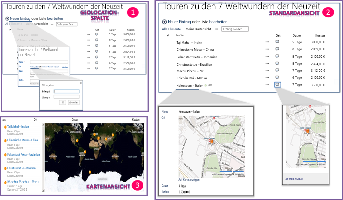

# Integrieren von Standort- und Kartenfunktionen in SharePoint
In diesem Artikel erfahren Sie, wie Sie Standortinformationen und Karten in SharePoint-Listen sowie standortbasierte Web-Apps und mobile Apps für SharePoint mithilfe des neuen Felds „Geolocation“ und durch Erstellen Ihrer eigenen auf dem Geolocation-Feld basierenden Feldtypen integrieren.
## Welche Standort- und Kartenfunktionen bietet SharePoint?

SharePoint bietet jetzt einen neuen Feldtyp namens „Geolocation“, mit dem Sie SharePoint-Listen um Standortinformationen ergänzen können. In Spalten des Typs „Geolocation“ können Sie Standortinformationen als Paare von Breiten- und Längengraden in Dezimalgrad angeben oder die Koordinaten der aktuellen Position des Benutzers aus dem Browser abrufen, sofern dieser die W3C Geolocation API unterstützt. In der Liste zeigt SharePoint den Standort dann auf einer über Bing Karten bereitgestellten Karte an. Zusätzlich zeigt eine neue Ansicht namens „Kartenansicht“ die Listenelemente als Ortsmarken in einem Bing Karten-Ajax-Steuerelement (V7) an. Die Listenelemente werden als Karten im linken Bereich dargestellt. Abbildung 1 gibt einen Überblick über die standardmäßigen Standort- und Kartenfunktionen in SharePoint. In Kombination integrieren das Geolocation-Feld und die Kartenansicht Daten aus SharePoint in einer Kartenoberfläche und liefern so für jede Information räumlichen Kontext. Ihre Benutzer können auf ganz neue Art mit Ihren webbasierten und mobilen Apps und Lösungen interagieren.
  
> [!NOTE]
> Sie müssen ein MSI-Paket mit dem Namen "SQLSysClrTypes.msi" auf jedem SharePoint-Front-End-Webserver installieren, um Geolocation-Feldwerte oder -Daten in einer Liste anzuzeigen. Dieses Paket installiert Komponenten, welche die neuen Geometrie-, Geografie- und Hierarchie-ID-Typen in SQL Server 2008 implementieren. Für SharePoint Online wird diese Datei standardmäßig installiert. Dies gilt jedoch nicht für lokale Bereitstellungen von SharePoint. Sie müssen Mitglied der Gruppe „Farmadministratoren“ sein, um diesen Vorgang ausführen zu können. Herunterladen können Sie das Paket „SQLSysClrTypes.msi“ als Teil des [Microsoft SQL Server 2008 R2 SP1 Feature Pack](http://www.microsoft.com/en-us/download/details.aspx?id=26728) für SQL Server 2008 oder als Teil des [Microsoft SQL Server 2012 Feature Pack](http://www.microsoft.com/en-us/download/details.aspx?id=29065) für SQL Server 2012 im Microsoft Download Center. 
  
    
    

**Abbildung 1: Übersicht über die standardmäßigen Standort- und Kartenfunktionen**

  
    
    

  
    
    

  
    
    

  
    
    

  
    
    

## Wofür lassen sich die Standort- und Kartenfunktionen verwenden?

Die Standort- und Kartenfunktionen in SharePoint bieten Entwicklern einzigartige Möglichkeiten, Standortdaten, Karten und NEAR-Suchen in ihre webbasierten und mobilen Apps und Lösungen zu integrieren. In Tabelle 1 finden Sie verschiedene grundlegende Aufgaben, mit denen Sie Standort- und Kartenfunktionen in Ihre Apps und Lösungen integrieren können.
  
    
    

**Tabelle 1: Grundlegende Aufgaben zur Integration von Standort- und Kartenfunktionen**

|**Aufgabe**|**Beschreibung**|
|:-----|:-----|
| [How to: Set the Bing Maps key at the web and farm level in SharePoint](how-to-set-the-bing-maps-key-at-the-web-and-farm-level-in-sharepoint.md)   |SharePoint verwendet Bing Karten zum Rendern von Standortkarten. Um Bing Karten verwenden zu können, müssen Sie einen Bing Karten-Schlüssel erstellen und auf Website- oder Farmebene festlegen. In diesem Artikel werden die verschiedenen Optionen zur Festlegung des Schlüssels in SharePoint beschrieben. Außerdem erfahren Sie, wann Sie welche Option verwenden sollten. Wenn Sie keinen gültigen Bing Karten-Schlüssel verwenden oder kein Schlüssel auf Ebene der Farm oder der Website festgelegt ist, die die Liste enthält, wird eine Fehlermeldung auf der Karte angezeigt.    |
| [How to: Add a Geolocation column to a list programmatically in SharePoint](how-to-add-a-geolocation-column-to-a-list-programmatically-in-sharepoint.md)   |Die Geolocation-Spalte ist standardmäßig nicht in SharePoint-Listen für Benutzer verfügbar. Um die Spalte zu einer SharePoint-Liste hinzuzufügen, müssen Sie Code schreiben. Erfahren Sie in diesem Thema, wie das Geolocation-Feld programmgesteuert zu einer Liste hinzufügen.    |
| [Vorgehensweise: Erweitern des Geolocation-Feldtyps mithilfe von clientseitigem Rendering](how-to-extend-the-geolocation-field-type-using-client-side-rendering.md)   |Sie können eigenes Rendering auf die Standardbenutzeroberfläche (UI.md), die Logik und das Verhalten des Geolocation-Felds anwenden. Dazu erstellen Sie benutzerdefinierte Feldtypen, die vom Geolocation-Feld abgeleitet sind. SharePoint erlaubt die Ausführung von JavaScript und vereinfacht so die Erstellung von benutzerdefinierten Feldtypen. In der Klasse für Geolocation-Felder steht jetzt eine neue JSLink-Eigenschaft zur Verfügung, die auf eine benutzerdefinierte .js-Datei verweist. Diese Datei wiederum rendert das Feld.     **Hinweis:** Die JSLink-Eigenschaft wird für Umfrage- oder Ereignislisten nicht unterstützt. SharePoint-Kalender sind Terminlisten.           |
   

## Siehe auch

-  [How to: Add a Geolocation column to a list programmatically in SharePoint](how-to-add-a-geolocation-column-to-a-list-programmatically-in-sharepoint.md)
    
  
-  [Vorgehensweise: Legen Sie die Bing Maps-Taste auf Ordnerebene Web und Farm in SharePoint](how-to-set-the-bing-maps-key-at-the-web-and-farm-level-in-sharepoint.md)
    
  
-  [Vorgehensweise: Erweitern des Geolocation-Feldtyps mithilfe von clientseitigem Rendering](how-to-extend-the-geolocation-field-type-using-client-side-rendering.md)
    
  
-  [How to: Integrate maps with Windows Phone apps and SharePoint lists](how-to-integrate-maps-with-windows-phone-apps-and-sharepoint-lists.md)
    
  
-  [Verwenden des Standortfeldtyps in mobilen Anwendungen für SharePoint](http://technet.microsoft.com/de-DE/library/fp161355%28v=office.15%29.aspx)
    
  
