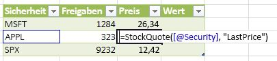

# <a name="javascript-user-defined-functions-overview"></a><span data-ttu-id="4cc8b-102">Benutzerdefinierte JavaScript-Funktionen (Übersicht)</span><span class="sxs-lookup"><span data-stu-id="4cc8b-102">JavaScript user-defined functions overview</span></span>
<span data-ttu-id="4cc8b-103">Benutzerdefinierte JavaScript-Funktionen (UDFs) sind neu in Excel Services und SharePoint.</span><span class="sxs-lookup"><span data-stu-id="4cc8b-103">JavaScript user-defined functions (UDFs) are new in Excel Services in SharePoint.</span></span> <span data-ttu-id="4cc8b-104">Dieser Artikel bietet eine allgemeine Übersicht über JavaScript UDFs, einschließlich grundlegender Informationen über deren Funktionsweise in Excel Services.</span><span class="sxs-lookup"><span data-stu-id="4cc8b-104">This article provides a high-level look at JavaScript UDFs, including basic information on how they work in Excel Services.</span></span>
## <a name="what-are-udfs"></a><span data-ttu-id="4cc8b-105">Was sind UDFs?</span><span class="sxs-lookup"><span data-stu-id="4cc8b-105">What are UDFs?</span></span>
<span data-ttu-id="4cc8b-106"><a name="xlsWhatAreUdfs"> </a></span><span class="sxs-lookup"><span data-stu-id="4cc8b-106"><a name="xlsWhatAreUdfs"> </a></span></span>

<span data-ttu-id="4cc8b-107">Eine benutzerdefinierte Funktion (UDF) ist eine Funktion, die Sie selbst erstellen können, und fügen Sie der Liste der verfügbaren Funktionen in Excel beim Excel dem Typ der Funktion zur Verfügung steht, sofort einsetzbar werden soll.</span><span class="sxs-lookup"><span data-stu-id="4cc8b-107">A user-defined function (UDF) is a function that you can create yourself and then add to the list of available functions in Excel when Excel doesn't provide the type of function that you want right out of the box.</span></span>
  
    
    
<span data-ttu-id="4cc8b-p102">Excel Services already allows you to create UDFs using managed code, so if you have worked with the existing Excel Services UDFs, JavaScript UDFs should look familiar to you. For more information about creating UDFs using managed code, see  [Excel Services User-Defined Functions](excel-services-user-defined-functions.md).</span><span class="sxs-lookup"><span data-stu-id="4cc8b-p102">Excel Services already allows you to create UDFs using managed code, so if you have worked with the existing Excel Services UDFs, JavaScript UDFs should look familiar to you. For more information about creating UDFs using managed code, see  [Excel Services User-Defined Functions](excel-services-user-defined-functions.md).</span></span>
  
    
    

## <a name="javascript-udfs"></a><span data-ttu-id="4cc8b-110">JavaScript-UDFs</span><span class="sxs-lookup"><span data-stu-id="4cc8b-110">JavaScript UDFs</span></span>
<span data-ttu-id="4cc8b-111"><a name="xlsJsUDFs"> </a></span><span class="sxs-lookup"><span data-stu-id="4cc8b-111"><a name="xlsJsUDFs"> </a></span></span>

<span data-ttu-id="4cc8b-p103">JavaScript-UDFs sind UDFs, die auf einer Webseite im Browser ausgeführt werden, die eine Arbeitsmappe eingebettete Excel hat. Verwenden Sie die JavaScript UDF in die eingebettete Arbeitsmappe. Solange Sie mit der Arbeitsmappe im Browser arbeiten, können Sie die JavaScript UDF genau, wie Sie die integrierte Excel-Funktionen verwenden. Wenn die Webseite geschlossen wird, ist die JavaScript UDF nicht mehr verfügbar.</span><span class="sxs-lookup"><span data-stu-id="4cc8b-p103">JavaScript UDFs are UDFs that run in the browser on a webpage that has an embedded Excel workbook. You use the JavaScript UDF inside of the embedded workbook. As long as you are working with the workbook in the browser, you can use the JavaScript UDF just like you use the built-in Excel functions. When the webpage is closed, the JavaScript UDF is no longer available.</span></span>
  
    
    

## <a name="how-do-javascript-udfs-work"></a><span data-ttu-id="4cc8b-116">Funktionsweise von JavaScript-UDFs</span><span class="sxs-lookup"><span data-stu-id="4cc8b-116">How do JavaScript UDFs work?</span></span>
<span data-ttu-id="4cc8b-117"><a name="xlsJsUDFs"> </a></span><span class="sxs-lookup"><span data-stu-id="4cc8b-117"><a name="xlsJsUDFs"> </a></span></span>

<span data-ttu-id="4cc8b-p104">Um eine JavaScript UDF zu verwenden, müssen Sie haben die Möglichkeit zum Ändern des Inhalts der Webseite, in dem Sie die Arbeitsmappe einbetten. Nachdem Sie die richtigen Excel Services JavaScript-Quelldatei verweisen möchten, fügen Sie Ihrer JavaScript UDF-Code auf der Seite. Darüber hinaus vor der Verwendung von JavaScript UDF müssen Sie zuerst die UDF-Datei mit der Dienste für Excel-Berechnungen zu registrieren. JavaScript UDF-API stellt Methoden zum Registrieren und Aufheben der Registrierung Ihrer JavaScript UDF bereit.</span><span class="sxs-lookup"><span data-stu-id="4cc8b-p104">To use a JavaScript UDF, you have to have the ability to modify the content of the webpage where you embed the workbook. After you reference the correct Excel Services JavaScript source file, you add your JavaScript UDF code to the page. Additionally, before you use your JavaScript UDF, you first have to register the UDF with the Excel Calculation Services. The JavaScript UDF API provides methods to both register and unregister your JavaScript UDF.</span></span>
  
    
    
<span data-ttu-id="4cc8b-122">Wenn die Webseite mit den Excel Web Access-Webpart oder eingebetteten Arbeitsmappe gerendert wird, können Sie die JavaScript UDF in der Arbeitsmappe genau wie jede andere Excel Arbeitsmappe aufrufen.</span><span class="sxs-lookup"><span data-stu-id="4cc8b-122">When the webpage with the Excel Web Access Web Part or embedded workbook renders, you can invoke the JavaScript UDF in the workbook just like any other Excel workbook.</span></span>
  
    
    
<span data-ttu-id="4cc8b-p105">Sie möglicherweise beispielsweise eine Funktion, die den aktuellen Aktienkurs für eine bestimmte Aktie abruft. Sie können die Webseite eine UDF JavaScript hinzufügen, die Ihre Excel-Arbeitsmappe (vorausgesetzt, dass Sie über Schreibrechte für die Webseite verfügen) gehostet wird, die JavaScript Code wie folgt verwendet.</span><span class="sxs-lookup"><span data-stu-id="4cc8b-p105">For example, you may have a function that gets the current stock price for a specific stock. You could add a JavaScript UDF to the webpage that hosts your Excel workbook (assuming you have authoring rights for the webpage) that uses JavaScript code as follows.</span></span>
  
    
    


```

function StockInfo(symbol, measure) {
  var req = new XMLHttpRequest();
  req.open('GET', 'http://www.contoso-stock-quotes.com/quote/' + symbol + '/' + measure, false); 
  req.send(null);
  if (req.status == 200) {
    return req.responseText;
  } else {
    throw new Error(ExcelCalcError.Value);
  }
 
ewa.BrowserUdfs.add("StockQuote",
                       StockInfo,
                       "Gets a stock quote given a security symbol and measure to return."
                       false,
                       false
                       );

```

<span data-ttu-id="4cc8b-125">Sie können die JavaScript UDF, StockInfo, klicken Sie dann in einer Formel aus einer Zelle innerhalb der Excel Online aufrufen.</span><span class="sxs-lookup"><span data-stu-id="4cc8b-125">You could then call the JavaScript UDF, StockInfo, in a formula from a cell inside the Excel Online.</span></span>
  
    
    

<span data-ttu-id="4cc8b-126">**Abbildung 1. JavaScript UDF, die in Excel Online aufgerufen werden.**</span><span class="sxs-lookup"><span data-stu-id="4cc8b-126">**Figure 1. JavaScript UDF invoked in Excel Online**</span></span>

  
    
    

  
    
    

  
    
    

  
    
    

  
    
    

## <a name="where-can-i-use-javascript-udfs"></a><span data-ttu-id="4cc8b-128">Wo kann ich JavaScript UDFs verwenden?</span><span class="sxs-lookup"><span data-stu-id="4cc8b-128">Where can I use JavaScript UDFs?</span></span>
<span data-ttu-id="4cc8b-129"><a name="xlsWhereUseJsUdfs"> </a></span><span class="sxs-lookup"><span data-stu-id="4cc8b-129"><a name="xlsWhereUseJsUdfs"> </a></span></span>

<span data-ttu-id="4cc8b-130">JavaScript UDFs können entweder in Arbeitsmappen, die in SharePoint Excel Web Access-Webparts angezeigt werden, oder in Arbeitsmappen, die in eine Host-Webseite eingebettet sind, erstellt und verwendet werden.</span><span class="sxs-lookup"><span data-stu-id="4cc8b-130">You can create and use JavaScript UDFs either on workbooks displayed in SharePoint Excel Web Access Web Parts or on a host webpage that has an embedded workbook.</span></span> <span data-ttu-id="4cc8b-131">Die Arbeitsmappe muss auf Microsoft OneDrive gespeichert werden.</span><span class="sxs-lookup"><span data-stu-id="4cc8b-131">The workbook must be stored on Microsoft OneDrive.</span></span> <span data-ttu-id="4cc8b-132">Der Hauptunterschied besteht darin, dass JavaScript-UDFs, die zu Excel Web Access-Webparts hinzugefügt werden, einen SharePoint-Server erfordern.</span><span class="sxs-lookup"><span data-stu-id="4cc8b-132">The main difference is that JavaScript UDFs added to Excel Web Access Web Parts require a SharePoint server.</span></span> <span data-ttu-id="4cc8b-133">Bei JavaScript-UDFs, die zu Host-Webseiten mit eingebetteten Arbeitsmappen hinzugefügt werden, muss die Arbeitsmappe lediglich auf OneDrive gespeichert werden.</span><span class="sxs-lookup"><span data-stu-id="4cc8b-133">JavaScript UDFs added to host webpages that have embedded workbooks require only that the workbook be stored on OneDrive.</span></span>
  
    
    

## <a name="key-points"></a><span data-ttu-id="4cc8b-134">Wichtige Punkte</span><span class="sxs-lookup"><span data-stu-id="4cc8b-134">Key points</span></span>
<span data-ttu-id="4cc8b-135"><a name="xlsWhereUseJsUdfs"> </a></span><span class="sxs-lookup"><span data-stu-id="4cc8b-135"><a name="xlsWhereUseJsUdfs"> </a></span></span>


- <span data-ttu-id="4cc8b-p107">JavaScript-UDFs live nur, solange die Webseite, die, der Sie auf, angezeigt wird. Sie nicht über die Lebensdauer der Webseite hinaus erhalten bleiben, in dem sie erstellt wurden.</span><span class="sxs-lookup"><span data-stu-id="4cc8b-p107">JavaScript UDFs only live as long as the webpage they are on is being displayed. They do not persist beyond the lifetime of the webpage where they were created.</span></span>
    
  
- <span data-ttu-id="4cc8b-138">Sie können keine Excel Services JavaScript-Objektmodell aus in einer JavaScript UDF aufrufen.</span><span class="sxs-lookup"><span data-stu-id="4cc8b-138">You can't make calls to the Excel Services JavaScript object model from within a JavaScript UDF.</span></span>
    
  

## <a name="see-also"></a><span data-ttu-id="4cc8b-139">Siehe auch</span><span class="sxs-lookup"><span data-stu-id="4cc8b-139">See also</span></span>
<span data-ttu-id="4cc8b-140"><a name="bk_addresources"> </a></span><span class="sxs-lookup"><span data-stu-id="4cc8b-140"><a name="bk_addresources"> </a></span></span>


-  [<span data-ttu-id="4cc8b-141">Excel Services in SharePoint</span><span class="sxs-lookup"><span data-stu-id="4cc8b-141">Excel Services in SharePoint</span></span>](excel-services-in-sharepoint.md)
    
  
-  [<span data-ttu-id="4cc8b-142">Was ist neu in Excel Services für Entwickler</span><span class="sxs-lookup"><span data-stu-id="4cc8b-142">What's new in Excel Services for developers</span></span>](http://msdn.microsoft.com/library/09e96c8b-cb55-4fd1-a797-b50fbf0f9296.aspx)
    
  
-  [<span data-ttu-id="4cc8b-143">Benutzerdefinierte Funktionen von Excel Services</span><span class="sxs-lookup"><span data-stu-id="4cc8b-143">Excel Services User-Defined Functions</span></span>](http://msdn.microsoft.com/de-DE/library/ms493934)
    
  

