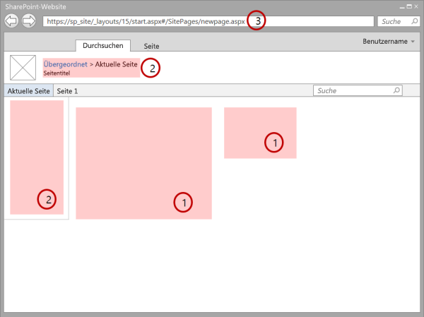
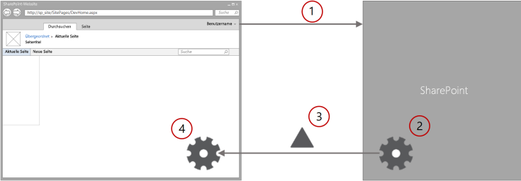

# <a name="minimal-download-strategy-overview"></a><span data-ttu-id="3a824-102">Minimale Downloadstrategie – Übersicht</span><span class="sxs-lookup"><span data-stu-id="3a824-102">Minimal Download Strategy overview</span></span>
<span data-ttu-id="3a824-p101">Erfahren Sie mehr über minimale herunterladen Strategie (MDS), ein neues Feature in SharePoint, die Ladezeit der Seite durch Senden nur die Unterschiede beim Benutzer navigieren zu einer neuen Seite reduziert. Minimale herunterladen Strategie (MDS) ist eine neue Technologie in SharePoint, die die Menge der Daten, die im Browser herunter verringert, wenn Benutzer von einer Seite in eine andere in einer SharePoint Website navigieren. Wenn Benutzer eine MDS-fähigen Website navigieren, verarbeitet der Client nur die Unterschiede (oder Delta) zwischen der aktuellen Seite und die angeforderte Seite. Abbildung 1 zeigt, dass die Abschnitte, die von einer Seite zum und deshalb ändern ein Update erforderlich. Das Delta umfasst in der Regel die Daten in den Abschnitten (1) Inhalte sowie andere Komponenten wie Navigationssteuerelemente (2).</span><span class="sxs-lookup"><span data-stu-id="3a824-p101">Learn about Minimal Download Strategy (MDS), a new feature in SharePoint that reduces page load time by sending only the differences when users navigate to a new page. Minimal Download Strategy (MDS) is a new technology in SharePoint that reduces the amount of data that the browser has to download when users navigate from one page to another in a SharePoint site. When users browse an MDS-enabled site, the client processes only the differences (or delta) between the current page and the requested page. Figure 1 shows the sections that change from page to page and therefore require an update. The delta usually includes the data in the (1) content areas, as well as other components such as (2) navigation controls.</span></span>
  
    
    


<span data-ttu-id="3a824-108">**Abbildung 1. Seite verarbeitet mit MDS**</span><span class="sxs-lookup"><span data-stu-id="3a824-108">**Figure 1. Page processed with MDS**</span></span>

  
    
    

  
    
    

  
    
    
<span data-ttu-id="3a824-110">Sie können anhand der URL erkennen, ob MDS für eine Website aktiviert ist.</span><span class="sxs-lookup"><span data-stu-id="3a824-110">You can identify a site that has MDS enabled by looking at the URL.</span></span> <span data-ttu-id="3a824-111">Bei einer MDS-fähigen Website ist die Seite **_layouts/15/start.aspx** (3) Teil der URL, gefolgt von einem Hashzeichen (**#**) und der relativen URL der angeforderten Ressource (siehe Abbildung 1).</span><span class="sxs-lookup"><span data-stu-id="3a824-111">An MDS-enabled site has the (3) **_layouts/15/start.aspx** page in the URL followed by a hash mark ( **#** ) and the relative URL of the requested resource, as shown in Figure 1.</span></span> <span data-ttu-id="3a824-112">Die MDS-formatierte URL für die Seite **newpage.aspx** beispielsweise würde wie folgt aussehen: **https://sp_site/_layouts/15/start.aspx#/SitePages/newpage.aspx**. Diese URL ist äquivalent zur folgenden URL ohne MDS-Formatierung: **https://sp_site/SitePages/newpage.aspx**. Entwickler müssen einige ihrer SharePoint-Komponenten möglicherweise zunächst aktualisieren, bevor sie MDS nahtlos unterstützen.</span><span class="sxs-lookup"><span data-stu-id="3a824-112">For example, the following is the MDS-formatted URL for the page **newpage.aspx**: **https://sp_site/_layouts/15/start.aspx#/SitePages/newpage.aspx**It is equivalent to the following non-MDS-formatted URL: **https://sp_site/SitePages/newpage.aspx**As a developer, you might have created SharePoint components that need some updates before they can work seamlessly with MDS.</span></span> 
## <a name="enable-mds"></a><span data-ttu-id="3a824-113">Aktivieren von MDS</span><span class="sxs-lookup"><span data-stu-id="3a824-113">Enable MDS</span></span>
<span data-ttu-id="3a824-114"><a name="SP15MDSOverview_Enable"> </a></span><span class="sxs-lookup"><span data-stu-id="3a824-114"></span></span>

<span data-ttu-id="3a824-115">MDS können in Ihrer Website Sie mithilfe der Websiteverwaltungsseiten oder die SharePoint Clientobjektmodelle.</span><span class="sxs-lookup"><span data-stu-id="3a824-115">You can enable MDS in your site by using either the site administration pages or the SharePoint client object models.</span></span>
  
    
    
<span data-ttu-id="3a824-116">Wenn Sie MDS über die Verwaltungsseiten aktivieren möchten: Klicken Sie auf **Websiteeinstellungen** > **Websitefeatures verwalten**, und aktivieren Sie das Feature **Minimal Download Strategy**.</span><span class="sxs-lookup"><span data-stu-id="3a824-116">To enable MDS by activating the feature in the administration pages, choose **Site settings** > **Manage site features**, and activate the **Minimal Download Strategy** feature.</span></span>
  
    
    
<span data-ttu-id="3a824-p103">Da das Feature aktiviert ist, indem Sie die  [EnableMinimalDownload](https://msdn.microsoft.com/library/Microsoft.SharePoint.Client.Web.EnableMinimalDownload.aspx) -Eigenschaft ändern, können Sie auch den Client-APIs. Der folgende Code zeigt, wie MDS mit dem JavaScript-Objektmodell (JSOM) zu aktivieren.</span><span class="sxs-lookup"><span data-stu-id="3a824-p103">Because the feature is activated by modifying the  [EnableMinimalDownload](https://msdn.microsoft.com/library/Microsoft.SharePoint.Client.Web.EnableMinimalDownload.aspx) property, you can also use the client APIs. The following code shows how to enable MDS using the JavaScript object model (JSOM).</span></span>
  
    
    


```

var clientContext;

clientContext = new SP.ClientContext.get_current();
this.oWebsite = clientContext.get_web();

this.oWebsite.set_enableMinimalDownload(true);
this.oWebsite.update();

clientContext.load(this.oWebsite);

clientContext.executeQueryAsync(
    Function.createDelegate(this, successHandler),
    Function.createDelegate(this, errorHandler)
);

function successHandler() {
    alert("MDS is enabled in this site.");
}

function errorHandler() {
    alert("Request failed: " + arguments[1].get_message());
}
```


## <a name="benefits-of-using-mds"></a><span data-ttu-id="3a824-119">Vorteile der Verwendung von MDS</span><span class="sxs-lookup"><span data-stu-id="3a824-119">Benefits of using MDS</span></span>
<span data-ttu-id="3a824-120"><a name="SP15MDSOverview_Benefits"> </a></span><span class="sxs-lookup"><span data-stu-id="3a824-120"></span></span>

<span data-ttu-id="3a824-121">Mit MDS bietet verschiedene Vorteile, einschließlich:</span><span class="sxs-lookup"><span data-stu-id="3a824-121">Using MDS provides several benefits, including:</span></span>
  
    
    

- <span data-ttu-id="3a824-p104">**Geschwindigkeit:** Dies ist das wichtigste Ziel der MDS. Bei Verwendung von MDS keinen Browser die Chrome-Benutzeroberfläche (UI) zu verarbeiten. MDS wird auch im Vergleich zu einer Auslastung vollständige Seite Nutzlast reduziert.</span><span class="sxs-lookup"><span data-stu-id="3a824-p104">**Speed:** This is the main objective of MDS. When you are using MDS, the browser doesn't have to reprocess the chrome user interface (UI). MDS also reduces the payload compared to a full page load.</span></span>
    
  
- <span data-ttu-id="3a824-p105">**Fließende Übergänge:** Durch die Aktualisierung nur die Bereiche, die sich ändern, zeichnen Sie Auge des Benutzers in Richtung dieser Bereiche, im Gegensatz zu einer ganzseitigen laden, in die gesamte Seite "blinkt." Wenn die gesamte Seite aktualisiert wird, muss der Benutzer analysieren in seiner Gesamtheit um Neuigkeiten zu erkennen. Benutzer haben erleichtern Navigieren in einer Website, die nur die Bereiche aktualisiert, die von der vorherigen Seite geändert.</span><span class="sxs-lookup"><span data-stu-id="3a824-p105">**Smooth transitions:** By updating only the areas that change, you draw the user's eye toward these areas, as opposed to a full page load where the whole page "flashes." When the whole page is updated, the user must parse it in its entirety to detect what is new. Users have an easier time navigating a site that only updates the areas that changed from the previous page.</span></span>
    
  
- <span data-ttu-id="3a824-p106">**Navigationssteuerelemente Browser:** Andere AJAX-basierte Systeme Verwechseln Sie die **vorherigen** und **nächsten** Schaltflächen im Browser. Da die URL im Browserfenster MDS aktualisiert werden, funktionieren die Schaltflächen vorherigen und nächsten wie jedoch.</span><span class="sxs-lookup"><span data-stu-id="3a824-p106">**Browser navigation controls:** Other AJAX-based systems confuse the **previous** and **next** buttons in browsers. Because MDS updates the URL in the browser window, the previous and next buttons work just as they are supposed to.</span></span>
    
  
- <span data-ttu-id="3a824-p107">**Abwärtskompatibilität:** Das Modul MDS MDS Navigation unmittelbar enthält, oder erkennt, wenn es nicht möglich. In der Fall, in dem MDS Navigation nicht möglich, tritt eine ganze Seite Last stattdessen. Dieser Prozess wird als **Failover** bezeichnet, und es wird sichergestellt, dass alle Seiten ordnungsgemäß gerendert wird, unabhängig davon, ob sie MDS-kompatible Komponenten enthalten. MDS funktioniert auch gut mit Suchmaschinen, da das **Href** -Attribut des Ankertags die URLs regulären, nicht MDS-Format verwendet. Das Modul MDS im Client stattdessen zeichnet das **Onclick** -Ereignis auf und wird verwendet, um eine Kommunikation mit dem Server.</span><span class="sxs-lookup"><span data-stu-id="3a824-p107">**Backward compatibility:** The MDS engine either provides MDS navigation immediately or detects when it isn't possible. In the case where MDS navigation isn't possible, a full page load occurs instead. This process is called **failover**, and it ensures that all pages render properly regardless of whether they contain MDS-compliant components. MDS also works nicely with search engines because the **href** attribute of anchor tags uses the regular, non MDS-formatted URLs. Instead, the MDS engine in the client captures the **onclick** event and uses it to communicate with the server.</span></span>
    
  

## <a name="mds-architecture"></a><span data-ttu-id="3a824-135">MDS-Architektur</span><span class="sxs-lookup"><span data-stu-id="3a824-135">MDS architecture</span></span>
<span data-ttu-id="3a824-136"><a name="SP15MDSOverview_Architecture"> </a></span><span class="sxs-lookup"><span data-stu-id="3a824-136"></span></span>

<span data-ttu-id="3a824-p108">Die grundlegende Funktionsweise der MDS sind relativ einfach. Die wichtigsten Komponenten der MDS sind zwei Module, eine auf dem Server und eine im-Client, die zusammenarbeiten, um die Änderungen zu berechnen, und die Seiten im Browser gerendert werden, wenn der Benutzer von einer Seite auf der Website navigiert. Abbildung 2 zeigt den MDS-Ablauf, wenn ein Benutzer über ein MDS-fähigen Website navigiert.</span><span class="sxs-lookup"><span data-stu-id="3a824-p108">The basic mechanics of MDS are pretty simple. The main components of MDS are two engines, one in the server and another in the client, that work together to calculate the changes and render the pages in the browser when the user navigates from page to page in the site. Figure 2 shows the MDS flow when a user navigates through an MDS-enabled site.</span></span>
  
    
    

<span data-ttu-id="3a824-140">**Abbildung 2. MDS-Ablauf, wenn ein Benutzer die Website navigiert**</span><span class="sxs-lookup"><span data-stu-id="3a824-140">**Figure 2. MDS flow when a user navigates the site**</span></span>

  
    
    

  
    
    

  
    
    

  
    
    

1. <span data-ttu-id="3a824-142">Der Browser fordert die Unterschiede zwischen der aktuellen Seite und eine neue auf der Website SharePoint.</span><span class="sxs-lookup"><span data-stu-id="3a824-142">The browser requests the changes between the current page and a new one in the SharePoint site.</span></span>
    
  
2. <span data-ttu-id="3a824-143">Das Modul MDS auf dem Server berechnet das Delta zwischen dem aktuellen und die neuen Seiten.</span><span class="sxs-lookup"><span data-stu-id="3a824-143">The MDS engine in the server calculates the delta between the current and the new pages.</span></span>
    
  
3. <span data-ttu-id="3a824-144">MDS-Modul auf dem Server sendet das Delta an das Modul MDS im-Client.</span><span class="sxs-lookup"><span data-stu-id="3a824-144">The MDS engine in the server sends the delta to the MDS engine in the client.</span></span>
    
  
4. <span data-ttu-id="3a824-145">Das Modul MDS im Client ersetzt die geänderten Bereiche auf der aktuellen Seite mit den Inhalt der neuen Seite.</span><span class="sxs-lookup"><span data-stu-id="3a824-145">The MDS engine in the client replaces the changed areas on the current page with the new page content.</span></span>
    
  
<span data-ttu-id="3a824-146">Die resultierende Seite ist genau, wie es hätte die Seite ohne MDS heruntergeladen wurde, hatte.</span><span class="sxs-lookup"><span data-stu-id="3a824-146">The resulting page is exactly as it would have been if the page had been downloaded without MDS.</span></span>
  
    
    
<span data-ttu-id="3a824-p109">Das Modul MDS im-Client enthält einen Download-Manager. Alle Anfragen auf der Seite werden durch die Download-Manager weitergeleitet. Alle Steuerelemente auf der Seite müssen Abonnieren der Download-Manager, um sich zu informieren, wenn eine URL geändert hat. Der Download-Manager sendet eine Anforderung für den neuen Steuerelementdaten. Um Suchmaschinen entwickelt werden, verwenden nicht das Modul MDS direkt das **href** -Attribut des Ankertags, um URLs MDS-Format speichern. Stattdessen wird die Funktion **SPUpdatePage** behandelt das **onclick** -Ereignis und wird verwendet, um eine Kommunikation mit dem Server. Die **SPUpdatePage** -Funktion ist in der Datei **_layouts/15/start.js** deklariert.</span><span class="sxs-lookup"><span data-stu-id="3a824-p109">The MDS engine in the client includes a download manager. All requests in the page are routed through the download manager. All controls in the page must subscribe to the download manager to learn when a URL has changed. The download manager makes one request for all the new control data. To be able to work with search engines, the MDS engine doesn't directly use the **href** attribute of anchor tags to store MDS-formatted URLs. Instead, the **SPUpdatePage** function handles the **onclick** event and uses it to communicate with the server. The **SPUpdatePage** function is declared in the **_layouts/15/start.js** file.</span></span>
  
    
    
<span data-ttu-id="3a824-p110">Das Modul MDS auf dem Server sendet die Informationen an den Client zurück. Diese Informationen kann HTML mit eingebetteten Skripts und Formatvorlagen, XML oder JavaScript Object Notation (JSON) enthalten.</span><span class="sxs-lookup"><span data-stu-id="3a824-p110">The MDS engine in the server sends the information back to the client. This information can contain HTML with embedded scripts and styles, XML, or JavaScript Object Notation (JSON).</span></span>
  
    
    
<span data-ttu-id="3a824-p111">Die URL spielt eine wichtige Rolle in MDS. Eine URL MDS sieht folgendermaßen aus: **https://sp_site/_layouts/15/start.aspx#/SitePages/newpage.aspx**. **Start.aspx** enthält minimale freigegebenen Benutzeroberfläche und Anweisungen zum Laden der Seite geändert wird. MDS berücksichtigt das Webpart nach der Hashmarkierung (#) als Zielseite. Die Zielseite beginnt mit einem Schrägstrich (/) gefolgt von der URL relativ zu der Website SharePoint. Wenn im Browser die URL erhält, sieht es, dass das Webpart links neben der Hashmarkierung nicht geändert werden, damit es eine lokale Navigationsereignis wird ausgelöst. Das Modul MDS im Client zeichnet das lokale Navigationsereignis und wird verwendet, um ein MDS Update ausführen.</span><span class="sxs-lookup"><span data-stu-id="3a824-p111">The URL plays an important role in MDS. An MDS URL looks like the following: **https://sp_site/_layouts/15/start.aspx#/SitePages/newpage.aspx**. **Start.aspx** contains minimal shared UI and instructions for loading page changes. MDS considers the part following the hash mark (#) as the target page. The target page starts with a slash (/) followed by a URL relative to the SharePoint website. When the browser receives the URL, it sees that the part to the left of the hash mark hasn't changed, so it fires a local navigation event. The MDS engine in the client captures the local navigation event and uses it to perform an MDS update.</span></span>
  
    
    
<span data-ttu-id="3a824-p112">Wie zuvor in diesem Artikel erwähnt, ist in manchen Fällen es nicht möglich, zu bestimmen, ob die Seite ordnungsgemäß aktualisiert werden kann. In den folgenden Situationen gibt das Modul MDS ein **Failover**, der ein zusätzlicher Roundtrip zum Umleiten von im Browsers auf die Vollversion der neuen Seite besteht. Dies sind die häufigsten Gründe, warum Failover auftritt:</span><span class="sxs-lookup"><span data-stu-id="3a824-p112">As mentioned previously in this article, in some situations it's not possible to determine whether the page can be updated properly. In these situations, the MDS engine issues a **failover**, which consists of an extra round trip to redirect the browser to the full version of the new page. These are the most common reasons why failover occurs:</span></span>
  
    
    

- <span data-ttu-id="3a824-166">Die neue Seite verfügt über eine andere Gestaltungsvorlage.</span><span class="sxs-lookup"><span data-stu-id="3a824-166">The new page has a different master page.</span></span>
    
  
- <span data-ttu-id="3a824-167">Die aktuelle Gestaltungsvorlage wurde geändert.</span><span class="sxs-lookup"><span data-stu-id="3a824-167">The current master page has changed.</span></span>
    
  
- <span data-ttu-id="3a824-168">Das Modul MDS erkennt nicht kompatible HTML, beispielsweise:</span><span class="sxs-lookup"><span data-stu-id="3a824-168">The MDS engine detects non-compliant HTML, for example:</span></span>
    
  - <span data-ttu-id="3a824-169">Seiten mit ASP.NET 2.0</span><span class="sxs-lookup"><span data-stu-id="3a824-169">Pages using ASP.NET 2.0</span></span>
    
  
  - <span data-ttu-id="3a824-170">CSS oder Skripts, die in das Modul MDS nicht registriert</span><span class="sxs-lookup"><span data-stu-id="3a824-170">CSS or scripts not registered in the MDS engine</span></span>
    
  
  - <span data-ttu-id="3a824-171">Unzulässige HTML</span><span class="sxs-lookup"><span data-stu-id="3a824-171">Illegal HTML</span></span>
    
  
- <span data-ttu-id="3a824-172">Es gibt beispielsweise nicht kompatible Steuerelemente auf der Seite:</span><span class="sxs-lookup"><span data-stu-id="3a824-172">There are non-compliant controls on the page, for example:</span></span>
    
  - <span data-ttu-id="3a824-173">Das Steuerelement ist nicht in der weißen Liste MDS-Modul.</span><span class="sxs-lookup"><span data-stu-id="3a824-173">The control is not in the MDS engine whitelist.</span></span>
    
  
  - <span data-ttu-id="3a824-174">Die Assembly des Steuerelements wird nicht als kompatibel markiert.</span><span class="sxs-lookup"><span data-stu-id="3a824-174">The control assembly is not marked as compliant.</span></span>
    
  
  - <span data-ttu-id="3a824-175">Die Steuerelementklasse keinen MDS-Attribut.</span><span class="sxs-lookup"><span data-stu-id="3a824-175">The control class doesn't have the MDS attribute.</span></span>
    
  
<span data-ttu-id="3a824-176">Das Modul MDS versucht, die von einem Failover wiederhergestellt werden, nachdem der Benutzer noch eine andere neue Seite navigiert.</span><span class="sxs-lookup"><span data-stu-id="3a824-176">The MDS engine tries to recover from a failover after the user navigates to yet another new page.</span></span>
  
    
    

## <a name="developer-controls"></a><span data-ttu-id="3a824-177">Entwickler-Steuerelemente</span><span class="sxs-lookup"><span data-stu-id="3a824-177">Developer controls</span></span>
<span data-ttu-id="3a824-178"><a name="SP15MDSOverview_DevControls"> </a></span><span class="sxs-lookup"><span data-stu-id="3a824-178"></span></span>

<span data-ttu-id="3a824-p113">Dank der Failovermechanismus nahtlos Steuerelemente unabhängig davon, ob MDS in Ihrer Benutzer Websites aktiviert ist. Jedoch ist es ratsam, Ihre SharePoint Steuerelemente und Komponenten MDS vollständig nutzen zu aktualisieren. Benutzer erhalten optimal, wenn die Seiten und Steuerelemente MDS kompatibel sind. Die folgenden Komponenten sind gute Kandidaten für MDS optimiert abrufen:</span><span class="sxs-lookup"><span data-stu-id="3a824-p113">Thanks to the failover mechanism, your controls work seamlessly whether or not MDS is enabled in your users' websites. However, it is a good idea to update your SharePoint controls and components to take full advantage of MDS. Users get a better experience when your pages and controls are MDS compliant. The following components are good candidates to get optimized for MDS:</span></span>
  
    
    

- <span data-ttu-id="3a824-183">Gestaltungsvorlagen</span><span class="sxs-lookup"><span data-stu-id="3a824-183">Master pages</span></span>
    
  
- <span data-ttu-id="3a824-184">ASP.NET-Seiten</span><span class="sxs-lookup"><span data-stu-id="3a824-184">ASP.NET pages</span></span>
    
  
- <span data-ttu-id="3a824-185">Steuerelemente und Webparts</span><span class="sxs-lookup"><span data-stu-id="3a824-185">Controls and Web Parts</span></span>
    
  

## <a name="additional-resources"></a><span data-ttu-id="3a824-186">Zusätzliche Ressourcen</span><span class="sxs-lookup"><span data-stu-id="3a824-186">Additional resources</span></span>
<span data-ttu-id="3a824-187"><a name="bk_addresources"> </a></span><span class="sxs-lookup"><span data-stu-id="3a824-187"></span></span>


-  [<span data-ttu-id="3a824-188">EnableMinimalDownload</span><span class="sxs-lookup"><span data-stu-id="3a824-188">EnableMinimalDownload</span></span>](https://msdn.microsoft.com/library/Microsoft.SharePoint.Client.Web.EnableMinimalDownload.aspx)
    
  
-  [<span data-ttu-id="3a824-189">Ändern von SharePoint-Komponenten für MDS</span><span class="sxs-lookup"><span data-stu-id="3a824-189">Modify SharePoint components for MDS</span></span>](modify-sharepoint-components-for-mds.md)
    
  
-  [<span data-ttu-id="3a824-190">Erstellen von Websites für SharePoint</span><span class="sxs-lookup"><span data-stu-id="3a824-190">Build sites for SharePoint</span></span>](build-sites-for-sharepoint.md)
    
  

