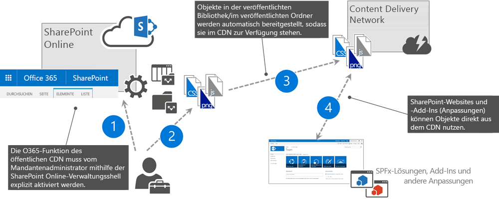
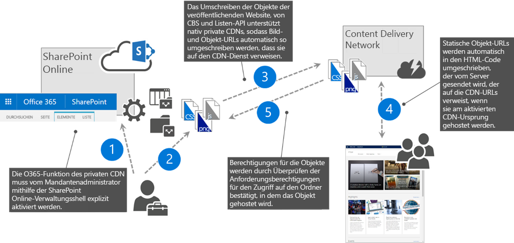

# <a name="use-the-office-365-content-delivery-network-cdn"></a><span data-ttu-id="b91ff-102">Verwenden des Office 365 Content Delivery Network (CDN)</span><span class="sxs-lookup"><span data-stu-id="b91ff-102">Use the Office 365 content delivery network (CDN)</span></span>

<span data-ttu-id="b91ff-103">_**Gilt für:** Office 365_</span><span class="sxs-lookup"><span data-stu-id="b91ff-103">_**Applies to:** Office 365_</span></span>

<span data-ttu-id="b91ff-104">Sie können statische Objekte im Office 365 Content Delivery Network (CDN) hosten, um eine bessere Leistung für Ihre SharePoint Online-Seiten zu ermöglichen.</span><span class="sxs-lookup"><span data-stu-id="b91ff-104">You can host static assets in the Office 365 content delivery network (CDN) to provide better performance for your SharePoint Online pages.</span></span> <span data-ttu-id="b91ff-105">Statische Objekte sind Dateien, die nicht oft geändert werden, wie Bilder, Video und Audio, Stylesheets, Schriftarten und JavaScript-Dateien.</span><span class="sxs-lookup"><span data-stu-id="b91ff-105">Static assets are files that don't change very often, like images, video and audio, style sheets, fonts, and JavaScript files.</span></span> <span data-ttu-id="b91ff-106">Das CDN funktioniert als geografisch verteilter Cacheproxy, mit dem statische Objekte näher bei den anfordernden Browsern zwischengespeichert werden.</span><span class="sxs-lookup"><span data-stu-id="b91ff-106">The CDN works as a geographically distributed caching proxy, by caching static assets closer to the browsers requesting them.</span></span>

## <a name="office-365-cdn-basics"></a><span data-ttu-id="b91ff-107">Office 365 CDN-Grundlagen</span><span class="sxs-lookup"><span data-stu-id="b91ff-107">Office 365 Public CDN</span></span>

<span data-ttu-id="b91ff-108">Das Office 365 CDN ist in Ihrem SharePoint Online-Abonnement enthalten.</span><span class="sxs-lookup"><span data-stu-id="b91ff-108">The Office 365 CDN is included as part of your SharePoint Online subscription.</span></span> <span data-ttu-id="b91ff-109">Sie müssen nicht extra dafür bezahlen.</span><span class="sxs-lookup"><span data-stu-id="b91ff-109">You don't have to pay extra for it.</span></span> <span data-ttu-id="b91ff-110">Office 365 bietet Unterstützung für den privaten und öffentlichen Zugriff und ermöglicht Ihnen das Hosten statischer Objekte an mehreren Standorten oder Ursprüngen.</span><span class="sxs-lookup"><span data-stu-id="b91ff-110">Office 365 provides support for both private and public access and allows you to host static assets in multiple locations, or origins.</span></span> <span data-ttu-id="b91ff-111">Das Office 365 CDN ist nicht identisch mit dem Azure CDN.</span><span class="sxs-lookup"><span data-stu-id="b91ff-111">The Office 365 CDN is not the same as the Azure CDN.</span></span> <span data-ttu-id="b91ff-112">Wenn Sie weitere Informationen zu den Gründen für die Verwendung eines CDN oder zu allgemeinen CDN-Konzepten benötigen, finden Sie diese unter [Content Delivery Networks](https://support.office.com/de-DE/article/Content-delivery-networks-0140f704-6614-49bb-aa6c-89b75dcd7f1f).</span><span class="sxs-lookup"><span data-stu-id="b91ff-112">If you need more information about why to use a CDN or about general CDN concepts, see [Content delivery networks](https://support.office.com/de-DE/article/Content-delivery-networks-0140f704-6614-49bb-aa6c-89b75dcd7f1f).</span></span>

## <a name="office-365-cdn-types"></a><span data-ttu-id="b91ff-113">Typen von Office 365 CDNs</span><span class="sxs-lookup"><span data-stu-id="b91ff-113">Office 365 Public CDN</span></span>

<span data-ttu-id="b91ff-114">Office 365 bietet zwei Typen von CDNs: öffentliches und privates CDN.</span><span class="sxs-lookup"><span data-stu-id="b91ff-114">Office 365 offers you two types of CDNs: Public and Private.</span></span> <span data-ttu-id="b91ff-115">Beide Optionen bieten eine Leistungsverbesserung, aber jede Option hat spezielle Attribute und Vorteile.</span><span class="sxs-lookup"><span data-stu-id="b91ff-115">Both options provide performance improvements, but each has unique attributes and advantages.</span></span>

### <a name="office-365-public-cdn"></a><span data-ttu-id="b91ff-116">Öffentliches Office 365 CDN</span><span class="sxs-lookup"><span data-stu-id="b91ff-116">Office 365 Public CDN</span></span>



1. <span data-ttu-id="b91ff-118">Der Administrator aktiviert das öffentliche Office 365 CDN für den Mandanten.</span><span class="sxs-lookup"><span data-stu-id="b91ff-118">Administrator enables Office 365 Public CDN for the tenant.</span></span>
1. <span data-ttu-id="b91ff-119">Statische Objekte, die vom CDN freigegeben werden sollen, werden in SharePoint-Bibliotheken hochgeladen, die als öffentliche CDN-Ursprünge aktiviert sind.</span><span class="sxs-lookup"><span data-stu-id="b91ff-119">Static assets to be shared from CDN are uploaded to SharePoint libraries, which are enabled as Public CDN origins.</span></span>
1. <span data-ttu-id="b91ff-120">Objekte aus den konfigurierten Bibliotheken und Ordnern werden an den CDN-Dienst weitergegeben.</span><span class="sxs-lookup"><span data-stu-id="b91ff-120">Assets from the configured libraries and folders are propagated to the CDN service.</span></span>
1. <span data-ttu-id="b91ff-121">Auf den CDN-Speicherort verweisende URLs können auf SharePoint-Websites und in Anpassungen verwendet werden, die auf SharePoint-Seiten ausgeführt werden.</span><span class="sxs-lookup"><span data-stu-id="b91ff-121">URLs pointing to CDN location are available to be used in the SharePoint sites and in customizations running on SharePoint pages.</span></span>

> [!NOTE]
> <span data-ttu-id="b91ff-122">Sie sollten niemals Ressourcen, die in Ihrer Organisation als vertraulich gelten, in einer Dokumentbibliothek platzieren, die als öffentlicher CDN-Ursprung konfiguriert ist.</span><span class="sxs-lookup"><span data-stu-id="b91ff-122">You should never place resources that are considered sensitive to your organization in a Document library configured as a Public CDN origin.</span></span>

#### <a name="office-365-public-cdn-attributes-and-advantages"></a><span data-ttu-id="b91ff-123">Attribute und Vorteile des öffentlichen Office 365 CDN</span><span class="sxs-lookup"><span data-stu-id="b91ff-123">Office 365 Public CDN attributes and advantages</span></span>

- <span data-ttu-id="b91ff-124">Objekte, die an einem öffentlichen Ursprung verfügbar gemacht werden, sind für jeden Benutzer anonym zugänglich.</span><span class="sxs-lookup"><span data-stu-id="b91ff-124">Assets exposed in a public origin are accessible by everyone anonymously.</span></span>
- <span data-ttu-id="b91ff-125">Wenn Sie ein Objekt aus einem öffentlichen Ursprung entfernen, ist es unter Umständen bis zu 30 Tage lang weiterhin über den Cache verfügbar. Links zu dem Objekt im CDN werden jedoch innerhalb von 15 Minuten ungültig.</span><span class="sxs-lookup"><span data-stu-id="b91ff-125">If you remove an asset from a public origin, the asset may continue to be available for up to 30 days from the cache; however, we will invalidate links to the asset in the CDN within 15 minutes.</span></span>
- <span data-ttu-id="b91ff-126">Wenn Sie Stylesheets (CSS-Dateien) an einem öffentlichen Ursprung hosten, können Sie im Code relative Pfade und URIs verwenden.</span><span class="sxs-lookup"><span data-stu-id="b91ff-126">When you host style sheets (CSS files) in a public origin, you can use relative paths and URIs within the code.</span></span> <span data-ttu-id="b91ff-127">Dies bedeutet, dass Sie auf den Speicherort von Hintergrundbildern und anderen Objekten relativ zum Speicherort des Objekts, das sie aufruft, verweisen können.</span><span class="sxs-lookup"><span data-stu-id="b91ff-127">This means that you can reference the location of background images and other objects relative to the location of the asset that's calling it.</span></span>
- <span data-ttu-id="b91ff-128">Die URL eines öffentlichen Ursprungs kann zwar hartcodiert werden, dies wird jedoch nicht empfohlen.</span><span class="sxs-lookup"><span data-stu-id="b91ff-128">While you can hard code a public origin's URL, doing so is not recommended.</span></span> <span data-ttu-id="b91ff-129">Der Grund hierfür ist folgender: Wenn der Zugriff auf das CDN nicht mehr verfügbar ist, wird die URL nicht automatisch auf Ihre Organisation in SharePoint Online aufgelöst, was zu fehlerhaften Links und anderen Fehlern führen kann.</span><span class="sxs-lookup"><span data-stu-id="b91ff-129">The reason for this is that if access to the CDN becomes unavailable, the URL will not automatically resolve to your organization in SharePoint Online and might result in broken links and other errors.</span></span> <span data-ttu-id="b91ff-130">Daher wird empfohlen, SharePoint-URLs zu verwenden und die URL automatisch von SharePoint in die URL des öffentlichen CDN ändern zu lassen, wenn es aktiviert wird.</span><span class="sxs-lookup"><span data-stu-id="b91ff-130">The recommendation is therefore to use SharePoint URLs and have SharePoint automatically rewrite the URL to the public CDN URL when it's enabled.</span></span>
- <span data-ttu-id="b91ff-131">Die standardmäßigen Dateitypen, die für öffentliche Ursprünge eingeschlossen werden, sind CSS, EOT, GIF, ICO, JPEG, JPG, JS, MAP, PNG, SVG, TTF und WOFF.</span><span class="sxs-lookup"><span data-stu-id="b91ff-131">The default file types that are included for public origins are .css, .eot, .gif, .ico, .jpeg, .jpg, .js, .map, .png, .svg, .ttf, and .woff.</span></span> <span data-ttu-id="b91ff-132">Sie können weitere Dateitypen angeben, indem Sie die CDN-Konfiguration ändern.</span><span class="sxs-lookup"><span data-stu-id="b91ff-132">You can specify additional file types by changing the CDN's configuration.</span></span>
- <span data-ttu-id="b91ff-133">Auf Wunsch können Sie eine Richtlinie konfigurieren, um Objekte auszuschließen, die mit von Ihnen angegebenen Websiteklassifizierungen festgelegt wurden.</span><span class="sxs-lookup"><span data-stu-id="b91ff-133">If you want, you can configure a policy to exclude assets that have been identified by site classifications that you specify.</span></span> <span data-ttu-id="b91ff-134">Beispielsweise können Sie alle Objekte ausschließen, die als „vertraulich“ oder „eingeschränkt“ gekennzeichnet sind, auch wenn sie einen zulässigen Dateityp haben und sich an einem öffentlichen Ursprung befinden.</span><span class="sxs-lookup"><span data-stu-id="b91ff-134">For example, you can choose to exclude all assets that are marked as "confidential" or "restricted" even if they are an allowed file type and are located in a public origin.</span></span>

### <a name="office-365-private-cdn"></a><span data-ttu-id="b91ff-135">Privates Office 365 CDN</span><span class="sxs-lookup"><span data-stu-id="b91ff-135">Office 365 Public CDN</span></span>



1. <span data-ttu-id="b91ff-137">Der Administrator aktiviert ein privates Office 365 CDN für den Mandanten.</span><span class="sxs-lookup"><span data-stu-id="b91ff-137">Administrator enables Office 365 Private CDN for the tenant</span></span>
1. <span data-ttu-id="b91ff-138">Statische Objekte, die vom CDN freigegeben werden sollen, werden in SharePoint-Bibliotheken hochgeladen, die als private CDN-Ursprünge aktiviert sind.</span><span class="sxs-lookup"><span data-stu-id="b91ff-138">Static assets to be shared from CDN are uploaded to SharePoint libraries, which are enabled as Private CDN origins</span></span>
1. <span data-ttu-id="b91ff-139">Objekte aus den vorgesehenen privaten CDN-Ursprüngen werden an den CDN-Dienst verteilt.</span><span class="sxs-lookup"><span data-stu-id="b91ff-139">Assets from the designated Private CDN Origins are distributed to the CDN service</span></span>
1. <span data-ttu-id="b91ff-140">Wenn Benutzer Seiten mit Objekten anfordern, die in einem CDN-Ursprung gespeichert sind, schreibt SharePoint automatisch die URL der Objekte in die CDN-URL um, sodass diese Objekte aus dem CDN bereitgestellt werden.</span><span class="sxs-lookup"><span data-stu-id="b91ff-140">When users request pages using assets stored in any of the CDN origins, SharePoint automatically rewrites the assets' URL to the CDN URL, so that these assets are served from the CDN</span></span>
1. <span data-ttu-id="b91ff-141">Für aus dem CDN bediente Objekte muss eine Hauptversion veröffentlicht werden, und Benutzer müssen über Zugriffsberechtigungen für diese Objekte verfügen, wenn das Umschreiben der URL erfolgt.</span><span class="sxs-lookup"><span data-stu-id="b91ff-141">Assets being served from the CDN must have a major version published and users must have permissions to access these assets, when URL rewriting happens</span></span>

#### <a name="office-365-private-cdn-attributes-and-advantages"></a><span data-ttu-id="b91ff-142">Attribute und Vorteile des privaten Office 365 CDN</span><span class="sxs-lookup"><span data-stu-id="b91ff-142">Office 365 Private CDN attributes and advantages</span></span>

- <span data-ttu-id="b91ff-143">Benutzer können nur auf die Objekte an einem privaten Ursprung zugreifen, wenn sie dazu berechtigt sind.</span><span class="sxs-lookup"><span data-stu-id="b91ff-143">Users can only access the assets from a private origin if they are authorized to do so.</span></span> <span data-ttu-id="b91ff-144">Der anonyme Zugriff auf diese Objekte wird verhindert.</span><span class="sxs-lookup"><span data-stu-id="b91ff-144">Anonymous access to these assets is prevented.</span></span>
- <span data-ttu-id="b91ff-145">Wenn Sie ein Objekt aus dem privaten Ursprung entfernen, ist es unter Umständen noch bis zu einer Stunde lang weiterhin über den Cache verfügbar. Links zu dem Objekt im CDN werden jedoch innerhalb von 15 Minuten ungültig.</span><span class="sxs-lookup"><span data-stu-id="b91ff-145">If you remove an asset from the private origin, the asset may continue to be available for up to an hour from the cache; however, we will invalidate links to the asset in the CDN within 15 minutes.</span></span>
- <span data-ttu-id="b91ff-146">Die standardmäßigen Dateitypen, die für private Ursprünge eingeschlossen werden, sind GIF, ICO, JPEG, JPG, JS und PNG.</span><span class="sxs-lookup"><span data-stu-id="b91ff-146">The default file types that are included for private origins are .gif, .ico, .jpeg, .jpg, .js, and .png.</span></span> <span data-ttu-id="b91ff-147">Sie können weitere Dateitypen angeben, indem Sie die CDN-Konfiguration ändern.</span><span class="sxs-lookup"><span data-stu-id="b91ff-147">You can specify additional file types by changing CDN's configuration.</span></span>
- <span data-ttu-id="b91ff-148">Ebenso wie bei öffentlichen Ursprüngen können Sie eine Richtlinie konfigurieren, um Objekte auszuschließen, die Sie mithilfe von eigens festgelegten Websiteklassifizierungen identifiziert haben, auch wenn Sie Platzhalter verwendet haben, um alle Objekte in einem Ordner oder einer Websitebibliothek einzuschließen.</span><span class="sxs-lookup"><span data-stu-id="b91ff-148">Just like public origins, you can configure a policy to exclude assets that have been identified by site classifications that you specify even if you use wildcards to include all assets within a folder or Site Library.</span></span>

### <a name="publishing-feature-auto-rewriting-to-cdn-urls"></a><span data-ttu-id="b91ff-149">Automatisches Umschreiben des Veröffentlichungsfeatures auf CDN-URLs</span><span class="sxs-lookup"><span data-stu-id="b91ff-149">Publishing Feature Auto-Rewriting to CDN URLs</span></span>

<span data-ttu-id="b91ff-150">Damit Organisationen die Office 365 CDN-Funktionen ohne Update ihrer Portale nutzen können, wurde das SharePoint-Veröffentlichungsfeature so aktualisiert, dass URLs von in CDN-Ursprüngen gespeicherten Objekten automatisch in ihre CDN-Äquivalente umgeschrieben werden. Somit werden die Objekte dann vom CDN-Dienst statt von SharePoint bereitgestellt.</span><span class="sxs-lookup"><span data-stu-id="b91ff-150">To help organizations take advantage of the Office 365 CDN capabilities without having to update their existing portals, the SharePoint Publishing feature has been updated to automatically rewrite URLs of assets stored in CDN origins to their CDN equivalents so that assets are served from the CDN service instead of SharePoint.</span></span>

<span data-ttu-id="b91ff-151">Es folgt eine Übersicht über die Links, die automatisch vom SharePoint-Veröffentlichungsfeature umgeschrieben werden:</span><span class="sxs-lookup"><span data-stu-id="b91ff-151">Following is an overview of which links are automatically rewritten by the SharePoint Publishing feature:</span></span>

- <span data-ttu-id="b91ff-152">IMG/LINK/CSS-URLs in der HTML-Antwort klassischer Veröffentlichungsseiten</span><span class="sxs-lookup"><span data-stu-id="b91ff-152">IMG/LINK/CSS URLs in classic publishing page HTML response</span></span>
  - <span data-ttu-id="b91ff-153">Dies schließt von Autoren im HTML-Inhalt einer Seite hinzugefügte Bilder ein.</span><span class="sxs-lookup"><span data-stu-id="b91ff-153">This includes images added by authors in the HTML content of a page</span></span>
  - <span data-ttu-id="b91ff-154">Wenn Sie Seiten erweitern, können Sie das automatische Umschreiben von URLs auf einer Seite folgendermaßen vorübergehend deaktivieren:</span><span class="sxs-lookup"><span data-stu-id="b91ff-154">When extending pages, you can temporarily disable auto-rewriting URLs on a page by:</span></span>
    - <span data-ttu-id="b91ff-155">Auschecken der Seite</span><span class="sxs-lookup"><span data-stu-id="b91ff-155">checking out the page</span></span>
    - <span data-ttu-id="b91ff-156">Angeben des Abfragezeichenfolgenparameters `?NoAutoReWrites=true`</span><span class="sxs-lookup"><span data-stu-id="b91ff-156">providing the query string parameter `?NoAutoReWrites=true`</span></span>
- <span data-ttu-id="b91ff-157">WebPart-Objekte für Inhalt nach Suche</span><span class="sxs-lookup"><span data-stu-id="b91ff-157">Content By Search WebPart assets</span></span>
  - <span data-ttu-id="b91ff-158">JavaScript-Dateien für Anzeigevorlagen</span><span class="sxs-lookup"><span data-stu-id="b91ff-158">Display Templates JavaScript files</span></span>
  - <span data-ttu-id="b91ff-159">Bilder in Abfrageergebnissen – URLs in den folgenden standardmäßigen verwalteten Eigenschaften werden automatisch ersetzt: _PictureUrl_, _PictureThumbnailUrl_, _PublishingImage_</span><span class="sxs-lookup"><span data-stu-id="b91ff-159">Images in Query Results - URLs in the following standard Managed Properties are automatically replaced: _PictureUrl_, _PictureThumbnailUrl_, _PublishingImage_</span></span>
- <span data-ttu-id="b91ff-160">Bild-URLs des Webparts „Bildbibliothek-Bildschirmpräsentation“</span><span class="sxs-lookup"><span data-stu-id="b91ff-160">Picture Library SlideShow web part image URLs</span></span>
- <span data-ttu-id="b91ff-161">Bildfelder in Ergebnissen der SPList-REST-API (RenderListDataAsStream)</span><span class="sxs-lookup"><span data-stu-id="b91ff-161">Image fields in SPList REST API (RenderListDataAsStream) results</span></span>
  - <span data-ttu-id="b91ff-162">Verwenden Sie die neue Eigenschaft „ImageFieldsToTryRewriteToCdnUrls“, um eine durch Trennzeichen getrennte Liste von Feldern bereitzustellen.</span><span class="sxs-lookup"><span data-stu-id="b91ff-162">Use the new property ImageFieldsToTryRewriteToCdnUrls to provide a comma separated list of Fields.</span></span>
  - <span data-ttu-id="b91ff-163">Unterstützt Linkfelder (Bild oder Link) und PublishingImage-Felder.</span><span class="sxs-lookup"><span data-stu-id="b91ff-163">Supports Hyperlink Fields (Picture or Link) and PublishingImage Fields.</span></span>
- <span data-ttu-id="b91ff-164">SharePoint-Bildwiedergaben</span><span class="sxs-lookup"><span data-stu-id="b91ff-164">SharePoint Image renditions</span></span>

## <a name="set-up-and-configure-the-office-365-cdn"></a><span data-ttu-id="b91ff-165">Einrichten und Konfigurieren des Office 365 CDN</span><span class="sxs-lookup"><span data-stu-id="b91ff-165">Set up and configure the Office 365 CDN</span></span>

<span data-ttu-id="b91ff-166">Sie können das Office 365 CDN in Ihrem Mandanten mithilfe der SharePoint Online-Verwaltungsshell oder der Office 365 CLI einrichten und konfigurieren.</span><span class="sxs-lookup"><span data-stu-id="b91ff-166">You can set up and configure the Office 365 CDN in your tenant using the SharePoint Online Management Shell or the Office 365 CLI.</span></span>

### <a name="set-up-and-configure-the-office-365-cdn-using-the-sharepoint-online-management-shell"></a><span data-ttu-id="b91ff-167">Einrichten und Konfigurieren des Office 365 CDN mithilfe der SharePoint Online-Verwaltungsshell</span><span class="sxs-lookup"><span data-stu-id="b91ff-167">Set up and configure the Office 365 CDN using the SharePoint Online Management Shell</span></span>

> [!NOTE]
> <span data-ttu-id="b91ff-168">Bevor Sie Websitesammlungs-App-Kataloge in Ihrem Mandanten verwalten können, müssen Sie sicherstellen, dass Sie die [SharePoint Online-Verwaltungsshell](https://www.microsoft.com/en-us/download/details.aspx?id=35588) installiert haben.</span><span class="sxs-lookup"><span data-stu-id="b91ff-168">Before you can manage site collection app catalogs in your tenant, ensure that you have installed [SharePoint Online Management Shell](https://www.microsoft.com/en-us/download/details.aspx?id=35588) from November '17 or newer.</span></span> <span data-ttu-id="b91ff-169">Stellen Sie als Nächstes mit dem Cmdlet `Connect-SPOService` eine Verbindung mit Ihrem SharePoint Online-Mandanten her.</span><span class="sxs-lookup"><span data-stu-id="b91ff-169">Before running the following script, connect to your SharePoint Online tenant using the `Connect-SPOService` cmdlet.</span></span>

#### <a name="enable-office-365-cdn"></a><span data-ttu-id="b91ff-170">Aktivieren von Office 365 CDN</span><span class="sxs-lookup"><span data-stu-id="b91ff-170">Office 365 Public CDN</span></span>

<span data-ttu-id="b91ff-171">Sie können den Status des Office 365 CDN in Ihrem Mandanten mit dem Cmdlet [Set-SPOTenantCdnEnabled](https://docs.microsoft.com/en-us/powershell/module/sharepoint-online/set-spotenantcdnenabled?view=sharepoint-ps) verwalten.</span><span class="sxs-lookup"><span data-stu-id="b91ff-171">You can manage the state of the Office 365 CDN in your tenant using the [Set-SPOTenantCdnEnabled](https://docs.microsoft.com/en-us/powershell/module/sharepoint-online/set-spotenantcdnenabled?view=sharepoint-ps) cmdlet.</span></span>

<span data-ttu-id="b91ff-172">Um das öffentliche Office 365 CDN in Ihrem Mandanten zu aktivieren, führen Sie Folgendes aus:</span><span class="sxs-lookup"><span data-stu-id="b91ff-172">To enable the Office 365 Public CDN in your tenant execute:</span></span>

```powershell
Set-SPOTenantCdnEnabled -CdnType Public -Enable $true
```

<span data-ttu-id="b91ff-173">Um das private Office 365 CDN in Ihrem Mandanten zu aktivieren, führen Sie Folgendes aus:</span><span class="sxs-lookup"><span data-stu-id="b91ff-173">To enable the Office 365 Private CDN, execute:</span></span>

```powershell
Set-SPOTenantCdnEnabled -CdnType Private -Enable $true
```

<span data-ttu-id="b91ff-174">Wenn Sie beide CDN-Typen verwenden möchten, können sie diese alternativ auch mit folgendem Befehl aktivieren:</span><span class="sxs-lookup"><span data-stu-id="b91ff-174">Alternatively, if you want to use both CDN types, you can enable them using:</span></span>

```powershell
Set-SPOTenantCdnEnabled -CdnType Both -Enable $true
```

<span data-ttu-id="b91ff-175">Wenn Sie nicht die standardmäßigen CDN-Ursprünge verwenden möchten, fügen Sie den Parameter `-NoDefaultOrigins` hinzu:</span><span class="sxs-lookup"><span data-stu-id="b91ff-175">If you don't want to use the standard CDN origins, add the `-NoDefaultOrigins` parameter:</span></span>

```powershell
Set-SPOTenantCdnEnabled -CdnType Both -Enable $true -NoDefaultOrigins
```

#### <a name="view-the-current-status-of-the-office-365-cdn"></a><span data-ttu-id="b91ff-176">Anzeigen des aktuellen Status des Office 365 CDN</span><span class="sxs-lookup"><span data-stu-id="b91ff-176">View the current status of the Office 365 CDN</span></span>

<span data-ttu-id="b91ff-177">Um zu überprüfen, ob der gewünschte Typ von Office 365 CDN aktiviert oder deaktiviert ist, verwenden Sie das Cmdlet [Get-SPOTenantCdnEnabled](https://docs.microsoft.com/en-us/powershell/module/sharepoint-online/get-spotenantcdnenabled?view=sharepoint-ps).</span><span class="sxs-lookup"><span data-stu-id="b91ff-177">To check, if the particular type of Office 365 CDN is enabled or disabled, use the [Get-SPOTenantCdnEnabled](https://docs.microsoft.com/en-us/powershell/module/sharepoint-online/get-spotenantcdnenabled?view=sharepoint-ps) cmdlet.</span></span>

<span data-ttu-id="b91ff-178">Um zu überprüfen, ob das öffentliche Office 365 CDN aktiviert ist, führen Sie Folgendes aus:</span><span class="sxs-lookup"><span data-stu-id="b91ff-178">To check if the Office 365 Public CDN is enabled, execute:</span></span>

```powershell
Get-SPOTenantCdnEnabled -CdnType Public
```

#### <a name="view-office-365-cdn-origins"></a><span data-ttu-id="b91ff-179">Anzeigen der Office 365 CDN-Ursprünge</span><span class="sxs-lookup"><span data-stu-id="b91ff-179">View Office 365 CDN origins</span></span>

<span data-ttu-id="b91ff-180">Um die derzeit konfigurierten öffentlichen Office 365 CDN-Ursprünge anzuzeigen, führen Sie Folgendes aus:</span><span class="sxs-lookup"><span data-stu-id="b91ff-180">To view the currently configured Office 365 Public CDN origins execute:</span></span>

```powershell
Get-SPOTenantCdnOrigins -CdnType Public
```

#### <a name="add-office-365-cdn-origin"></a><span data-ttu-id="b91ff-181">Hinzufügen von Office 365 CDN-Ursprüngen</span><span class="sxs-lookup"><span data-stu-id="b91ff-181">Add Office 365 CDN origin</span></span>

> [!NOTE]
> <span data-ttu-id="b91ff-182">Sie sollten niemals Ressourcen, die in Ihrer Organisation als vertraulich gelten, in einer SharePoint-Dokumentbibliothek platzieren, die als öffentlicher CDN-Ursprung konfiguriert ist.</span><span class="sxs-lookup"><span data-stu-id="b91ff-182">You should never place resources that are considered sensitive to your organization in a SharePoint Document library configured as a Public CDN origin</span></span>

<span data-ttu-id="b91ff-183">Verwenden Sie das Cmdlet [Add-SPOTenantCdnOrigin](https://docs.microsoft.com/en-us/powershell/module/sharepoint-online/add-spotenantcdnorigin?view=sharepoint-ps), um einen CDN-Ursprung zu definieren.</span><span class="sxs-lookup"><span data-stu-id="b91ff-183">Use the [Add-SPOTenantCdnOrigin](https://docs.microsoft.com/en-us/powershell/module/sharepoint-online/add-spotenantcdnorigin?view=sharepoint-ps) cmdlet to define a CDN origin.</span></span> <span data-ttu-id="b91ff-184">Sie können mehrere Ursprünge definieren.</span><span class="sxs-lookup"><span data-stu-id="b91ff-184">You can define multiple origins.</span></span> <span data-ttu-id="b91ff-185">Der Ursprung ist eine URL, die auf eine SharePoint-Bibliothek oder einen Ordner mit den Objekten verweist, die vom CDN gehostet werden sollen.</span><span class="sxs-lookup"><span data-stu-id="b91ff-185">The origin is a URL that points to a SharePoint library or folder that contains the assets that you want to be hosted by the CDN.</span></span>

```powershell
Add-SPOTenantCdnOrigin -CdnType <Public | Private> -OriginUrl <path>
```

<span data-ttu-id="b91ff-186">Dabei ist `path` der Pfad zu dem Ordner, der die Objekte enthält.</span><span class="sxs-lookup"><span data-stu-id="b91ff-186">Where `path` is the path to the folder that contains the assets.</span></span> <span data-ttu-id="b91ff-187">Sie können Platzhalter zusätzlich zu relativen Pfaden verwenden.</span><span class="sxs-lookup"><span data-stu-id="b91ff-187">You can use wildcards in addition to relative paths.</span></span>

<span data-ttu-id="b91ff-188">Um alle Objekte in den Gestaltungsvorlagenkatalog aller Websites als öffentlichen CDN-Ursprung zu verwenden, führen Sie Folgendes aus:</span><span class="sxs-lookup"><span data-stu-id="b91ff-188">To include all assets in the Master Page Gallery of all sites as a public CDN origin, execute:</span></span>

```powershell
Add-SPOTenantCdnOrigin -CdnType Public -OriginUrl */masterpage
```

<span data-ttu-id="b91ff-189">Um einen privaten Ursprung für eine bestimmte Websitesammlung zu konfigurieren, führen Sie Folgendes aus:</span><span class="sxs-lookup"><span data-stu-id="b91ff-189">To configure a private origin for a specific site collection, execute:</span></span>

```powershell
Add-SPOTenantCdnOrigin -CdnType Private -OriginUrl sites/site1/siteassets
```

> [!NOTE]
> <span data-ttu-id="b91ff-190">Nach dem Hinzufügen eines CDN-Ursprungs dauert es bis zu 15 Minuten, bis Sie Dateien mithilfe des CDN-Diensts abrufen können.</span><span class="sxs-lookup"><span data-stu-id="b91ff-190">After adding a CDN origin, it might take up to 15 minutes for you to be able to retrieve files via the CDN service.</span></span> <span data-ttu-id="b91ff-191">Sie können überprüfen, ob ein bestimmter Ursprung bereits aktiviert wurde, indem Sie das Cmdlet [Get-SPOTenantCdnOrigins](https://docs.microsoft.com/en-us/powershell/module/sharepoint-online/get-spotenantcdnorigins?view=sharepoint-ps) ausführen.</span><span class="sxs-lookup"><span data-stu-id="b91ff-191">You can verify, if the particular origin has already been enabled using the [Get-SPOTenantCdnOrigins](https://docs.microsoft.com/en-us/powershell/module/sharepoint-online/get-spotenantcdnorigins?view=sharepoint-ps) cmdlet.</span></span>

#### <a name="remove-office-365-cdn-origin"></a><span data-ttu-id="b91ff-192">Entfernen von Office 365 CDN-Ursprüngen</span><span class="sxs-lookup"><span data-stu-id="b91ff-192">Remove Office 365 CDN origin</span></span>

<span data-ttu-id="b91ff-193">Verwenden Sie das Cmdlet [Remove-SPOTenantCdnOrigin](https://docs.microsoft.com/en-us/powershell/module/sharepoint-online/remove-spotenantcdnorigin?view=sharepoint-ps) zum Entfernen eines CDN-Ursprungs für den angegebenen CDN-Typ.</span><span class="sxs-lookup"><span data-stu-id="b91ff-193">Use the [Remove-SPOTenantCdnOrigin](https://docs.microsoft.com/en-us/powershell/module/sharepoint-online/remove-spotenantcdnorigin?view=sharepoint-ps) cmdlet to remove a CDN origin for the specified CDN type.</span></span>

<span data-ttu-id="b91ff-194">Um einen Ursprung aus der Konfiguration des öffentlichen CDN zu entfernen, führen Sie Folgendes aus:</span><span class="sxs-lookup"><span data-stu-id="b91ff-194">To remove an origin from the Public CDN configuration, execute:</span></span>

```powershell
Remove-SPOTenantCdnOrigin -CdnType Public -OriginUrl */masterpage
```

> [!NOTE]
> <span data-ttu-id="b91ff-195">Das Entfernen eines CDN-Ursprungs wirkt sich nicht auf die in einer Dokumentbibliothek gespeicherten Dateien aus, die mit diesem Ursprung übereinstimmt.</span><span class="sxs-lookup"><span data-stu-id="b91ff-195">Removing a CDN origin doesn't affect the files stored in any Document library matching that origin.</span></span> <span data-ttu-id="b91ff-196">Wenn diese Objekte über ihre SharePoint-URL referenziert wurden, wechselt SharePoint automatisch wieder zur ursprünglichen URL, die auf die Dokumentbibliothek verweist.</span><span class="sxs-lookup"><span data-stu-id="b91ff-196">If these assets have been referenced using their SharePoint URL, SharePoint will automatically switch back to the original URL pointing to the Document library.</span></span> <span data-ttu-id="b91ff-197">Wenn auf Objekte jedoch über die URL des öffentlichen CDN verwiesen wurde, sind diese Links jetzt ungültig und müssen manuell geändert werden.</span><span class="sxs-lookup"><span data-stu-id="b91ff-197">If however, assets have been referenced using the Public CDN URL, then these links will be now broken and will need to be manually changed.</span></span>

#### <a name="modify-office-365-cdn-origin"></a><span data-ttu-id="b91ff-198">Ändern von Office 365 CDN-Ursprüngen</span><span class="sxs-lookup"><span data-stu-id="b91ff-198">Modify Office 365 CDN origin</span></span>

<span data-ttu-id="b91ff-199">Es ist nicht möglich, einen vorhandenen CDN-Ursprung zu ändern.</span><span class="sxs-lookup"><span data-stu-id="b91ff-199">It's not possible to modify an existing CDN origin.</span></span> <span data-ttu-id="b91ff-200">Stattdessen sollten Sie den zuvor definierten CDN-Ursprung mit dem Cmdlet `Remove-SPOTenantCdnOrigin` entfernen und mit dem Cmdlet `Add-SPOTenantCdnOrigin` einen neuen hinzufügen.</span><span class="sxs-lookup"><span data-stu-id="b91ff-200">Instead, you should remove the previously defined CDN origin using the `Remove-SPOTenantCdnOrigin` cmdlet and add a new one using the `Add-SPOTenantCdnOrigin` cmdlet.</span></span>

#### <a name="change-the-types-of-files-to-include-in-office-365-cdn"></a><span data-ttu-id="b91ff-201">Ändern der in Office 365 CDN einzuschließenden Dateitypen</span><span class="sxs-lookup"><span data-stu-id="b91ff-201">Change the types of files to include in Office 365 CDN</span></span>

<span data-ttu-id="b91ff-202">Standardmäßig sind die folgenden Dateitypen im öffentlichen CDN enthalten: _CSS, EOT, GIF, ICO, JPEG, JPG, JS, MAP, PNG, SVG, TTF und WOFF_.</span><span class="sxs-lookup"><span data-stu-id="b91ff-202">By default, the following file types are included in the Public CDN: _.css, .eot, .gif, .ico, .jpeg, .jpg, .js, .map, .png, .svg, .ttf, and .woff_.</span></span> <span data-ttu-id="b91ff-203">Wenn Sie weitere Dateitypen in das CDN einbeziehen müssen, können Sie die CDN-Konfiguration mit dem Cmdlet [Set-SPOTenantCdnPolicy](https://docs.microsoft.com/en-us/powershell/module/sharepoint-online/set-spotenantcdnpolicy?view=sharepoint-ps) ändern.</span><span class="sxs-lookup"><span data-stu-id="b91ff-203">If you need to include additional file types in the CDN, you can change the CDN configuration using the [Set-SPOTenantCdnPolicy](https://docs.microsoft.com/en-us/powershell/module/sharepoint-online/set-spotenantcdnpolicy?view=sharepoint-ps) cmdlet.</span></span>

> [!NOTE]
> <span data-ttu-id="b91ff-204">Durch das Ändern der Liste von Dateitypen überschreiben Sie die aktuell definierte Liste.</span><span class="sxs-lookup"><span data-stu-id="b91ff-204">When changing the list of file types, you overwrite the currently defined list.</span></span> <span data-ttu-id="b91ff-205">Wenn Sie weitere Dateitypen einbeziehen möchten, verwenden Sie das Cmdlet [Get-SPOTenantCdnPolicies](https://docs.microsoft.com/en-us/powershell/module/sharepoint-online/get-spotenantcdnpolicies?view=sharepoint-ps), um herauszufinden, welche Dateitypen derzeit konfiguriert sind.</span><span class="sxs-lookup"><span data-stu-id="b91ff-205">If you want to include additional file types, use the [Get-SPOTenantCdnPolicies](https://docs.microsoft.com/en-us/powershell/module/sharepoint-online/get-spotenantcdnpolicies?view=sharepoint-ps) cmdlet, to find out which file types are currently configured.</span></span>

<span data-ttu-id="b91ff-206">Um den Dateityp _JSON_ der Standardliste von Dateitypen im öffentlichen CDN hinzuzufügen, führen Sie Folgendes aus:</span><span class="sxs-lookup"><span data-stu-id="b91ff-206">To add the _JSON_ file type to the default list of file types included in the Public CDN, execute:</span></span>

```powershell
Set-SPOTenantCdnPolicy -CdnType Public -PolicyType IncludeFileExtensions -PolicyValue "CSS,EOT,GIF,ICO,JPEG,JPG,JS,MAP,PNG,SVG,TTF,WOFF,JSON"
```

#### <a name="change-the-list-of-site-classifications-you-want-to-exclude-from-the-office-365-cdn"></a><span data-ttu-id="b91ff-207">Ändern der Liste von Websiteklassifizierungen, die Sie aus dem Office 365 CDN ausschließen möchten</span><span class="sxs-lookup"><span data-stu-id="b91ff-207">Change the list of site classifications you want to exclude from the Office 365 CDN</span></span>

<span data-ttu-id="b91ff-208">Verwenden Sie das Cmdlet [Set-SPOTenantCdnPolicy](https://docs.microsoft.com/en-us/powershell/module/sharepoint-online/set-spotenantcdnpolicy?view=sharepoint-ps) -Cmdlet zum Ausschließen von Websiteklassifizierungen, die Sie nicht über das CDN zur Verfügung stellen möchten.</span><span class="sxs-lookup"><span data-stu-id="b91ff-208">Use the [Set-SPOTenantCdnPolicy](https://docs.microsoft.com/en-us/powershell/module/sharepoint-online/set-spotenantcdnpolicy?view=sharepoint-ps) cmdlet to exclude site classifications that you do not want to make available over the CDN.</span></span> <span data-ttu-id="b91ff-209">Standardmäßig sind keine Websiteklassifizierungen ausgeschlossen.</span><span class="sxs-lookup"><span data-stu-id="b91ff-209">By default, no site classifications are excluded.</span></span>

> [!NOTE]
> <span data-ttu-id="b91ff-210">Durch das Ändern der Liste der ausgeschlossenen Websiteklassifizierungen überschreiben Sie die aktuell definierte Liste.</span><span class="sxs-lookup"><span data-stu-id="b91ff-210">When changing the list of excluded site classifications, you overwrite the currently defined list.</span></span> <span data-ttu-id="b91ff-211">Wenn Sie zusätzliche Klassifizierungen ausschließen möchten, verwenden Sie das Cmdlet [Get-SPOTenantCdnPolicies](https://docs.microsoft.com/en-us/powershell/module/sharepoint-online/get-spotenantcdnpolicies?view=sharepoint-ps), um herauszufinden, welche Klassifizierungen derzeit konfiguriert sind.</span><span class="sxs-lookup"><span data-stu-id="b91ff-211">If you want to exclude additional classifications, use the [Get-SPOTenantCdnPolicies](https://docs.microsoft.com/en-us/powershell/module/sharepoint-online/get-spotenantcdnpolicies?view=sharepoint-ps) cmdlet, to find out which classifications are currently configured.</span></span>

<span data-ttu-id="b91ff-212">Um als _HBI_ klassifizierte Websites aus dem öffentlichen CDN auszuschließen, führen Sie Folgendes aus:</span><span class="sxs-lookup"><span data-stu-id="b91ff-212">To exclude sites classified as _HBI_ from the Public CDN, execute</span></span>

```powershell
Set-SPOTenantCdnPolicy -CdnType Public -PolicyType ExcludeRestrictedSiteClassifications -PolicyValue "HBI"
```

#### <a name="disable-office-365-cdn"></a><span data-ttu-id="b91ff-213">Deaktivieren von Office 365 CDN</span><span class="sxs-lookup"><span data-stu-id="b91ff-213">Office 365 Public CDN</span></span>

<span data-ttu-id="b91ff-214">Um das Office 365 CDN zu deaktivieren, verwenden Sie das Cmdlet `Set-SPOTenantCdnEnabled`. Beispiel:</span><span class="sxs-lookup"><span data-stu-id="b91ff-214">To disable the Office 365 CDN use the `Set-SPOTenantCdnEnabled` cmdlet, for example:</span></span>

```powershell
Set-SPOTenantCdnEnabled -CdnType Public -Enable $false
```

### <a name="set-up-and-configure-the-office-365-cdn-using-the-office-365-cli"></a><span data-ttu-id="b91ff-215">Einrichten und Konfigurieren des Office 365 CDN mithilfe von Office 365 CLI</span><span class="sxs-lookup"><span data-stu-id="b91ff-215">Set up and configure the Office 365 CDN using the Office 365 CLI</span></span>

> [!NOTE]
> <span data-ttu-id="b91ff-216">Damit Sie Websitesammlungs-App-Kataloge in Ihrem Mandanten verwalten können, müssen Sie sicherstellen, dass [Office 365 CLI](https://aka.ms/o365cli) installiert ist.</span><span class="sxs-lookup"><span data-stu-id="b91ff-216">Before you can manage site collection app catalogs in your tenant, ensure that you have installed [SharePoint Online Management Shell](https://aka.ms/o365cli) from November '17 or newer.</span></span> <span data-ttu-id="b91ff-217">Als Nächstes stellen Sie mit dem Befehl [spo connect](https://sharepoint.github.io/office365-cli/cmd/spo/connect/) eine Verbindung mit Ihrem SharePoint Online-Mandanten her.</span><span class="sxs-lookup"><span data-stu-id="b91ff-217">Next, connect to your SharePoint Online tenant using the [spo connect](https://sharepoint.github.io/office365-cli/cmd/spo/connect/) command.</span></span>

#### <a name="enable-office-365-cdn"></a><span data-ttu-id="b91ff-218">Aktivieren von Office 365 CDN</span><span class="sxs-lookup"><span data-stu-id="b91ff-218">Office 365 Public CDN</span></span>

<span data-ttu-id="b91ff-219">Sie können den Status des Office 365 CDN in Ihrem Mandanten mithilfe des Cmdlets [spo cdn set](https://sharepoint.github.io/office365-cli/cmd/spo/cdn/cdn-set/) verwalten.</span><span class="sxs-lookup"><span data-stu-id="b91ff-219">You can manage the state of the Office 365 CDN in your tenant using the [spo cdn set](https://sharepoint.github.io/office365-cli/cmd/spo/cdn/cdn-set/) command.</span></span>

<span data-ttu-id="b91ff-220">Um das öffentliche Office 365 CDN in Ihrem Mandanten zu aktivieren, führen Sie Folgendes aus:</span><span class="sxs-lookup"><span data-stu-id="b91ff-220">To enable the Office 365 Public CDN in your tenant execute:</span></span>

```sh
spo cdn set --type Public --enabled true
```

<span data-ttu-id="b91ff-221">Um das private Office 365 CDN in Ihrem Mandanten zu aktivieren, führen Sie Folgendes aus:</span><span class="sxs-lookup"><span data-stu-id="b91ff-221">To enable the Office 365 Private CDN, execute:</span></span>

```sh
spo cdn set --type Private --enabled true
```

#### <a name="view-the-current-status-of-the-office-365-cdn"></a><span data-ttu-id="b91ff-222">Anzeigen des aktuellen Status des Office 365 CDN</span><span class="sxs-lookup"><span data-stu-id="b91ff-222">View the current status of the Office 365 CDN</span></span>

<span data-ttu-id="b91ff-223">Um zu überprüfen, ob der betreffende Typ von Office 365 CDN aktiviert oder deaktiviert ist, verwenden Sie den Befehl [spo cdn get](https://sharepoint.github.io/office365-cli/cmd/spo/cdn/cdn-get/).</span><span class="sxs-lookup"><span data-stu-id="b91ff-223">To check, if the particular type of Office 365 CDN is enabled or disabled, use the [spo cdn get](https://sharepoint.github.io/office365-cli/cmd/spo/cdn/cdn-get/) command.</span></span>

<span data-ttu-id="b91ff-224">Um zu überprüfen, ob das öffentliche Office 365 CDN aktiviert ist, führen Sie Folgendes aus:</span><span class="sxs-lookup"><span data-stu-id="b91ff-224">To check if the Office 365 Public CDN is enabled, execute:</span></span>

```sh
spo cdn get --type Public
```

#### <a name="view-office-365-cdn-origins"></a><span data-ttu-id="b91ff-225">Anzeigen der Office 365 CDN-Ursprünge</span><span class="sxs-lookup"><span data-stu-id="b91ff-225">View Office 365 CDN origins</span></span>

<span data-ttu-id="b91ff-226">Um die derzeit konfigurierten öffentlichen Office 365 CDN-Ursprünge anzuzeigen, führen Sie Folgendes aus:</span><span class="sxs-lookup"><span data-stu-id="b91ff-226">To view the currently configured Office 365 Public CDN origins execute:</span></span>

```sh
spo cdn origin list --type Public
```

#### <a name="add-office-365-cdn-origin"></a><span data-ttu-id="b91ff-227">Hinzufügen von Office 365 CDN-Ursprüngen</span><span class="sxs-lookup"><span data-stu-id="b91ff-227">Add Office 365 CDN origin</span></span>

> [!NOTE]
> <span data-ttu-id="b91ff-228">Sie sollten niemals Ressourcen, die in Ihrer Organisation als vertraulich gelten, in einer SharePoint-Dokumentbibliothek platzieren, die als öffentlicher CDN-Ursprung konfiguriert ist.</span><span class="sxs-lookup"><span data-stu-id="b91ff-228">You should never place resources that are considered sensitive to your organization in a SharePoint Document library configured as a Public CDN origin</span></span>

<span data-ttu-id="b91ff-229">Verwenden Sie den Befehl [spo cdn origin add](https://sharepoint.github.io/office365-cli/cmd/spo/cdn/cdn-origin-add/) zum Definieren eines CDN-Ursprungs.</span><span class="sxs-lookup"><span data-stu-id="b91ff-229">Use the [spo cdn origin add](https://sharepoint.github.io/office365-cli/cmd/spo/cdn/cdn-origin-add/) command to define a CDN origin.</span></span> <span data-ttu-id="b91ff-230">Sie können mehrere Ursprünge definieren.</span><span class="sxs-lookup"><span data-stu-id="b91ff-230">You can define multiple origins.</span></span> <span data-ttu-id="b91ff-231">Der Ursprung ist eine URL, die auf eine SharePoint-Bibliothek oder einen Ordner mit den Objekten verweist, die vom CDN gehostet werden sollen.</span><span class="sxs-lookup"><span data-stu-id="b91ff-231">The origin is a URL that points to a SharePoint library or folder that contains the assets that you want to be hosted by the CDN.</span></span>

```sh
spo cdn origin add --type [Public | Private] --origin <path>
```

<span data-ttu-id="b91ff-232">Dabei ist `path` der Pfad zu dem Ordner, der die Objekte enthält.</span><span class="sxs-lookup"><span data-stu-id="b91ff-232">Where `path` is the path to the folder that contains the assets.</span></span> <span data-ttu-id="b91ff-233">Sie können Platzhalter zusätzlich zu relativen Pfaden verwenden.</span><span class="sxs-lookup"><span data-stu-id="b91ff-233">You can use wildcards in addition to relative paths.</span></span>

<span data-ttu-id="b91ff-234">Um alle Objekte in den Gestaltungsvorlagenkatalog aller Websites als öffentlichen CDN-Ursprung zu verwenden, führen Sie Folgendes aus:</span><span class="sxs-lookup"><span data-stu-id="b91ff-234">To include all assets in the Master Page Gallery of all sites as a public CDN origin, execute:</span></span>

```sh
spo cdn origin add --type Public --origin */masterpage
```

<span data-ttu-id="b91ff-235">Um einen privaten Ursprung für eine bestimmte Websitesammlung zu konfigurieren, führen Sie Folgendes aus:</span><span class="sxs-lookup"><span data-stu-id="b91ff-235">To configure a private origin for a specific site collection, execute:</span></span>

```sh
spo cdn origin add --type Private --origin sites/site1/siteassets
```

> [!NOTE]
> <span data-ttu-id="b91ff-236">Nach dem Hinzufügen eines CDN-Ursprungs dauert es bis zu 15 Minuten, bis Sie Dateien mithilfe des CDN-Diensts abrufen können.</span><span class="sxs-lookup"><span data-stu-id="b91ff-236">After adding a CDN origin, it might take up to 15 minutes for you to be able to retrieve files via the CDN service.</span></span> <span data-ttu-id="b91ff-237">Sie können überprüfen, ob der betreffende Ursprung bereits aktiviert wurde, indem Sie den Befehl [spo cdn origin list](https://sharepoint.github.io/office365-cli/cmd/spo/cdn/cdn-origin-list/) verwenden.</span><span class="sxs-lookup"><span data-stu-id="b91ff-237">You can verify, if the particular origin has already been enabled using the [spo cdn origin list](https://sharepoint.github.io/office365-cli/cmd/spo/cdn/cdn-origin-list/) command.</span></span>

#### <a name="remove-office-365-cdn-origin"></a><span data-ttu-id="b91ff-238">Entfernen von Office 365 CDN-Ursprüngen</span><span class="sxs-lookup"><span data-stu-id="b91ff-238">Remove Office 365 CDN origin</span></span>

<span data-ttu-id="b91ff-239">Verwenden Sie den Befehl [spo cdn origin remove](https://sharepoint.github.io/office365-cli/cmd/spo/cdn/cdn-origin-remove/), um einen CDN-Ursprung für den angegebenen CDN-Typ zu entfernen.</span><span class="sxs-lookup"><span data-stu-id="b91ff-239">Use the [spo cdn origin remove](https://sharepoint.github.io/office365-cli/cmd/spo/cdn/cdn-origin-remove/) command to remove a CDN origin for the specified CDN type.</span></span>

<span data-ttu-id="b91ff-240">Um einen Ursprung aus der Konfiguration des öffentlichen CDN zu entfernen, führen Sie Folgendes aus:</span><span class="sxs-lookup"><span data-stu-id="b91ff-240">To remove an origin from the Public CDN configuration, execute:</span></span>

```sh
spo cdn origin remove --type Public --origin */masterpage
```

> [!NOTE]
> <span data-ttu-id="b91ff-241">Das Entfernen eines CDN-Ursprungs wirkt sich nicht auf die in einer Dokumentbibliothek gespeicherten Dateien aus, die mit diesem Ursprung übereinstimmt.</span><span class="sxs-lookup"><span data-stu-id="b91ff-241">Removing a CDN origin doesn't affect the files stored in any Document library matching that origin.</span></span> <span data-ttu-id="b91ff-242">Wenn diese Objekte über ihre SharePoint-URL referenziert wurden, wechselt SharePoint automatisch wieder zur ursprünglichen URL, die auf die Dokumentbibliothek verweist.</span><span class="sxs-lookup"><span data-stu-id="b91ff-242">If these assets have been referenced using their SharePoint URL, SharePoint will automatically switch back to the original URL pointing to the Document library.</span></span> <span data-ttu-id="b91ff-243">Wenn auf Objekte jedoch über die URL des öffentlichen CDN verwiesen wurde, sind diese Links jetzt ungültig und müssen manuell geändert werden.</span><span class="sxs-lookup"><span data-stu-id="b91ff-243">If however, assets have been referenced using the Public CDN URL, then these links will be now broken and will need to be manually changed.</span></span>

#### <a name="modify-office-365-cdn-origin"></a><span data-ttu-id="b91ff-244">Ändern von Office 365 CDN-Ursprüngen</span><span class="sxs-lookup"><span data-stu-id="b91ff-244">Modify Office 365 CDN origin</span></span>

<span data-ttu-id="b91ff-245">Es ist nicht möglich, einen vorhandenen CDN-Ursprung zu ändern.</span><span class="sxs-lookup"><span data-stu-id="b91ff-245">It's not possible to modify an existing CDN origin.</span></span> <span data-ttu-id="b91ff-246">Stattdessen sollten Sie den zuvor definierten CDN-Ursprung mit dem Befehl `spo cdn origin remove` entfernen und mit dem Befehl `spo cdn origin add` einen neuen hinzufügen.</span><span class="sxs-lookup"><span data-stu-id="b91ff-246">Instead, you should remove the previously defined CDN origin using the `spo cdn origin remove` command and add a new one using the `spo cdn origin add` command.</span></span>

#### <a name="change-the-types-of-files-to-include-in-office-365-cdn"></a><span data-ttu-id="b91ff-247">Ändern der in Office 365 CDN einzuschließenden Dateitypen</span><span class="sxs-lookup"><span data-stu-id="b91ff-247">Change the types of files to include in Office 365 CDN</span></span>

<span data-ttu-id="b91ff-248">Standardmäßig sind die folgenden Dateitypen im CDN enthalten: _CSS, EOT, GIF, ICO, JPEG, JPG, JS, MAP, PNG, SVG, TTF und WOFF_.</span><span class="sxs-lookup"><span data-stu-id="b91ff-248">By default, the following file types are included in the CDN: _.css, .eot, .gif, .ico, .jpeg, .jpg, .js, .map, .png, .svg, .ttf, and .woff_.</span></span> <span data-ttu-id="b91ff-249">Wenn Sie weitere Dateitypen in das CDN einbeziehen müssen, können Sie die CDN-Konfiguration mit dem Befehl [spo cdn policy set](https://sharepoint.github.io/office365-cli/cmd/spo/cdn/cdn-policy-set/) ändern.</span><span class="sxs-lookup"><span data-stu-id="b91ff-249">If you need to include additional file types in the CDN, you can change the CDN configuration using the [spo cdn policy set](https://sharepoint.github.io/office365-cli/cmd/spo/cdn/cdn-policy-set/) command.</span></span>

> [!NOTE]
> <span data-ttu-id="b91ff-250">Durch das Ändern der Liste von Dateitypen überschreiben Sie die aktuell definierte Liste.</span><span class="sxs-lookup"><span data-stu-id="b91ff-250">When changing the list of file types, you overwrite the currently defined list.</span></span> <span data-ttu-id="b91ff-251">Wenn Sie weitere Dateitypen einbeziehen möchten, verwenden Sie den Befehl [spo cdn policy list](https://sharepoint.github.io/office365-cli/cmd/spo/cdn/cdn-origin-list/), um herauszufinden, welche Dateitypen derzeit konfiguriert sind.</span><span class="sxs-lookup"><span data-stu-id="b91ff-251">If you want to include additional file types, use the [spo cdn policy list](https://sharepoint.github.io/office365-cli/cmd/spo/cdn/cdn-origin-list/) command, to find out which file types are currently configured.</span></span>

<span data-ttu-id="b91ff-252">Um den Dateityp _JSON_ der Standardliste von Dateitypen im öffentlichen CDN hinzuzufügen, führen Sie Folgendes aus:</span><span class="sxs-lookup"><span data-stu-id="b91ff-252">To add the _JSON_ file type to the default list of file types included in the Public CDN, execute:</span></span>

```sh
spo cdn policy set --type Public --policy IncludeFileExtensions --value "CSS,EOT,GIF,ICO,JPEG,JPG,JS,MAP,PNG,SVG,TTF,WOFF,JSON"
```

#### <a name="change-the-list-of-site-classifications-you-want-to-exclude-from-the-office-365-cdn"></a><span data-ttu-id="b91ff-253">Ändern der Liste von Websiteklassifizierungen, die Sie aus dem Office 365 CDN ausschließen möchten</span><span class="sxs-lookup"><span data-stu-id="b91ff-253">Change the list of site classifications you want to exclude from the Office 365 CDN</span></span>

<span data-ttu-id="b91ff-254">Verwenden Sie den Befehl [spo cdn policy set](https://sharepoint.github.io/office365-cli/cmd/spo/cdn/cdn-policy-set/) zum Ausschließen von Websiteklassifizierungen, die Sie nicht über das CDN zur Verfügung stellen möchten.</span><span class="sxs-lookup"><span data-stu-id="b91ff-254">Use the [spo cdn policy set](https://sharepoint.github.io/office365-cli/cmd/spo/cdn/cdn-policy-set/) command to exclude site classifications that you do not want to make available over the CDN.</span></span> <span data-ttu-id="b91ff-255">Standardmäßig sind keine Websiteklassifizierungen ausgeschlossen.</span><span class="sxs-lookup"><span data-stu-id="b91ff-255">By default, no site classifications are excluded.</span></span>

> [!NOTE]
> <span data-ttu-id="b91ff-256">Durch das Ändern der Liste der ausgeschlossenen Websiteklassifizierungen überschreiben Sie die aktuell definierte Liste.</span><span class="sxs-lookup"><span data-stu-id="b91ff-256">When changing the list of excluded site classifications, you overwrite the currently defined list.</span></span> <span data-ttu-id="b91ff-257">Wenn Sie zusätzliche Klassifizierungen ausschließen möchten, verwenden Sie den Befehl [spo cdn policy list](https://sharepoint.github.io/office365-cli/cmd/spo/cdn/cdn-policy-list/), um herauszufinden, welche Klassifizierungen derzeit konfiguriert sind.</span><span class="sxs-lookup"><span data-stu-id="b91ff-257">If you want to exclude additional classifications, use the [spo cdn policy list](https://sharepoint.github.io/office365-cli/cmd/spo/cdn/cdn-policy-list/) command, to find out which classifications are currently configured.</span></span>

<span data-ttu-id="b91ff-258">Um als _HBI_ klassifizierte Websites aus dem öffentlichen CDN auszuschließen, führen Sie Folgendes aus:</span><span class="sxs-lookup"><span data-stu-id="b91ff-258">To exclude sites classified as _HBI_ from the Public CDN, execute</span></span>

```sh
spo cdn policy set --type Public --policy ExcludeRestrictedSiteClassifications --value "HBI"
```

#### <a name="disable-office-365-cdn"></a><span data-ttu-id="b91ff-259">Deaktivieren von Office 365 CDN</span><span class="sxs-lookup"><span data-stu-id="b91ff-259">Office 365 Public CDN</span></span>

<span data-ttu-id="b91ff-260">Um das Office 365 CDN zu deaktivieren, verwenden Sie den Befehl `spo cdn set`. Beispiel:</span><span class="sxs-lookup"><span data-stu-id="b91ff-260">To disable the Office 365 CDN use the `spo cdn set` command, for example:</span></span>

```sh
spo cdn set --type Public --enabled false
```

## <a name="see-also"></a><span data-ttu-id="b91ff-261">Siehe auch</span><span class="sxs-lookup"><span data-stu-id="b91ff-261">See also</span></span>

- [<span data-ttu-id="b91ff-262">Verwenden des Office 365 Content Delivery Network mit SharePoint Online</span><span class="sxs-lookup"><span data-stu-id="b91ff-262">Use the Office 365 content delivery network with SharePoint Online</span></span>](https://support.office.com/de-DE/article/use-the-office-365-content-delivery-network-with-sharepoint-online-bebb285f-1d54-4f79-90a5-94985afc6af8)
- [<span data-ttu-id="b91ff-263">Video zu den ersten Schritten mit Office 365 CDN</span><span class="sxs-lookup"><span data-stu-id="b91ff-263">Video on getting started with Office 365 CDN</span></span>](https://youtu.be/2kI2LnQ-3wQ?list=PLR9nK3mnD-OWSbg0o9a7mx_E7s2u7h_o2)