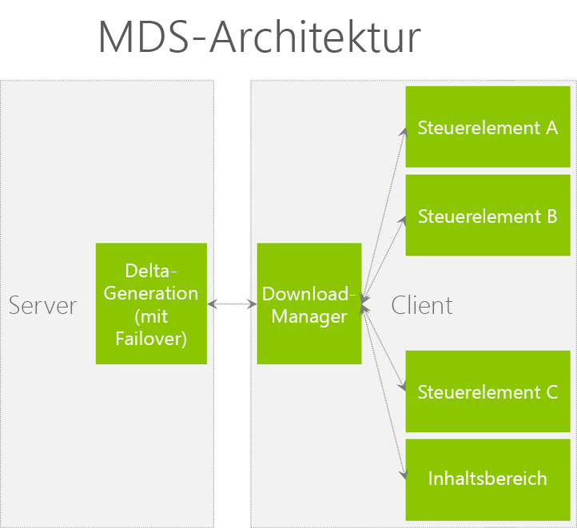

# <a name="optimize-page-performance-in-sharepoint"></a>Optimieren der Leistung in SharePoint Seite

Erhalten Sie Informationen, um die Leistung der Seiten in SharePoint zu erhöhen. Diese Features können verwendet werden, um das Erlebnis in geografisch verteilten Implementierungen zu verbessern.

**Zur Verfügung gestellt von:** David Crawford, Microsoft Corporation

Dieser Artikel enthält Anweisungen, die Optimierung der Leistung in SharePoint helfen. SharePoint enthält Funktionen zur Seite laden über einen Bereich WAN (Wide Network) zu optimieren. Entwerfen von Seiten zu als kleine und schnell wie möglich ergänzt diese Leistungssteigerungen machen.

## <a name="minimal-download-strategy-mds"></a>Minimale Downloadstrategie (MDS)
<a name="MDS"> </a>

Minimale herunterladen Strategie (MDS) nutzt die Möglichkeit, nur bestimmte Teile einer Seite herunterladen, die auf dem Server vollständig gerendert wird. Nur der bestimmte Teile herunterladen bietet ein sehr effizient Loading-Modell. Die vollständig gerenderte Seite wird nicht an den Client zurückgegeben. Der Server muss genau jene identifizieren, die sein müssen als Teil der Antwort und die, die nicht erforderlich sind. Die Teile, die möglicherweise nicht Teil der Antwort enthalten Skripts, Stile und Markup.

Die folgende Tabelle enthält einige Vorteile der Verwendung von MDS.

<br/>

**In Tabelle 1. Vorteile der Verwendung von MDS**

|**Leistung**|**Visuelle Objekte**|
|:-----|:-----|
|Weniger Datenmengen pro Seitenanforderung heruntergeladen haben.|Keine Browser blinken zurückzuführen ganze Seite neu zu laden.|
|Browser muss nur die Bereiche der Seite aktualisieren, die seit der letzten Anforderung geändert.|Leicht zu identifizieren, Animationen.|
|Geringer Verarbeitungsaufwand auf dem Client erforderlich.<br/><br/>**Hinweis:** Die Hälfte der Client-Seitenladezeit 1 (PLT1) wird für das Chrome-Cascading-Stylesheet-Rendering (CSS) und die Analyse und Ausführung von JavaScript benötigt. |Änderungen an der Seite wecken die Aufmerksamkeit des Benutzers. |

<br/>

AJAX und MDS sind Technologien, die nur Abschnitte der Seite, um Daten zu minimieren herunterladen und Verbesserung der Seite Reaktionsfähigkeit anfordern. Die folgende Abbildung zeigt die MDS-Architektur.

<br/>

*Abbildung 1. MDS-Architektur*   
    


Das MDS-Framework wird davon ausgegangen, dass eine Gestaltungsvorlage Chrom und Inhaltsbereiche definiert. MDS bedeutet SharePoint Navigieren zu einer Seite anfordern nur den Inhalt für diesen Regionen und die Ressourcen, denen auf die Seite abhängig ist. Sobald dieser Inhalte an den Browser downloads, gilt Skriptcode die Markup oder Ressourcen auf der Seite aus. Der Browser verhält sich, als ob die angeforderte Seite vollständig vom Server geladen wurde, hatte.

<br/>

*Abbildung 2. Seitenchrom und Regionen in einer SharePoint-Seite*


 
Wenn Benutzer eine SharePoint-Website im MDS-Modus durchsuchen, werden keine Postpacks der ganzen Seite durchgeführt und die Seite wird auch nicht neu geladen. Stattdessen bleibt die URL der besuchten Seite gleich, und der Fragmentbezeichner (ein "#"-Zeichen) ändert sich dahingehend, dass er die besuchte Seite enthält. Das Format der URL lautet:  `[Path to site (spweb)] + /_layouts/15/start.aspx# + [path to page] + [query string]`
  
Die folgende Tabelle enthält einige Beispiele von URLs im Modus MDS formatiert.

<br/>

**In Tabelle 2. URLs im Modus MDS formatiert**

|**Nicht MDS-URL**|**MDS-URL**|
|:-----|:-----|
|`http://server/SitePages/`  <br/> |`http://server/_layouts/15/start.aspx#/SitePages/`  <br/> |
|`http://server/subsite/SitePages/home.aspx`  <br/> |`http://server/subsite/_layouts/15/start.aspx#/SitePages/home.aspx`  <br/> |
|`http://server/_layouts/15/viewlsts.aspx?BaseType=0`  <br/> |`http://server/_layouts/15/start.aspx#/_layouts/viewlsts.aspx?BaseType=0` <br/> |

<br/>

Das Objekt für die AJAX-Navigation verwendet wird, **AjaxNavigate**. Standardmäßig ist eine Instanz des **AjaxNavigate** für die Verwendung von benannten **ajaxNavigate**verfügbar. So verwenden Sie die Instanz **ajaxNavigate**

```cs

ajaxNavigate.update(serverRelativeURL, null);
```

Wenn Sie möchten, dass ein Steuerelement oder Webpart Navigationsereignisse abhört, können Sie den Handler **Navigieren\_hinzufügen** verwenden. Wenn der Handler aufgerufen wird, erhält Ihre Rückruffunktion einen Verweis auf das Navigationsobjekt und die analysierten Hash-Werte in einem Wörterbuch. Das Steuerelement oder Webpart kann den Wert für den entsprechenden Parameter aus dem Wörterbuch abrufen, ihn mit dem aktuellen Wert vergleichen und entscheiden, welche Aktion ausgeführt werden muss. Eine häufige Aktion besteht darin, eine AJAX-Anforderung an den Server zum Abrufen von Daten zu senden oder die Elemente in der Ansicht neu anzuordnen. Wenn ein Steuerelement die Navigationsereignisse abgehört hat, kann es den **Navigieren\_löschen**-Handler verwenden.

MDS unterstützt zudem mehrere Hash-Zeichen in Schlüssel-/Wertpaaren. MDS fügt die Hash-Zeichen nach der URL hinzu. Das Format der Hash-Zeichen in der URL ist: `http://server/_layouts/15/start.aspx#/SitePages/page.aspx#key1=value1#key2=value2`. Im folgenden Codebeispiel erfahren Sie, wie Sie die Hash-Zeichen aktualisieren.

```
var updateParts;
updateParts = {key1: "value1", key2: "value2", keyn: "valuen"}
ajaxNavigate.update(null, updateParts);

```

Wenn Sie feststellen, dass die Seiten in Ihrer Website ständig zurückgreifen, um die ganze Seite herunterladen, empfiehlt es sich, deaktivieren das Feature MDS berücksichtigt werden sollten. Sie sollten auch die MDS-Feature zu deaktivieren, wenn Sie eine andere Strategie zum Verbessern der Leistung verwenden müssen.

Ein bestimmtes Element in der Seite muss sicherstellen, dass die wichtigen Ressourcen für das Arbeiten mit der MDS-Infrastruktur zur Renderzeit Server bekannt sind. Um ein vorhandenes Projekt zu verwenden, MDS zu konvertieren, müssen Sie die folgenden Dateien und Komponenten aktualisieren:

- Gestaltungsvorlagen
- ASP.NET Seiten
- Benutzerdefinierte Masterseiten für Fehler
- JavaScript-Dateien
- Steuerelemente und Webparts

### <a name="master-pages"></a>Gestaltungsvorlagen

Die wichtigste Änderung in der Gestaltungsvorlage ist die Bereiche der HTML-Markup umgeben werden, die mit einem speziellen-Steuerelement mit dem Namen **SharePoint:AjaxDelta** an den Client gesendet wird. Die am häufigsten verwendeten Teile, die von einem Steuerelement **SharePoint:AjaxDelta** umgeben sein müssen, sind in der Gestaltungsvorlage Chrome und der Content Platzhalter eingebettet. Wenn ein Steuerelement auf allen Seiten innerhalb einer Website identisch ist, sollten sie nicht von einem Steuerelement **SharePoint:AjaxDelta** eingeschlossen werden. Das folgende Markup zeigt einen sichtbaren Inhaltsplatzhalter, umgeben von einer **SharePoint:AjaxDelta** -Steuerelement.


```HTML

<SharePoint:AjaxDelta id="DeltaPlaceHolderMain" IsMainContent="true" runat="server">
    <asp:ContentPlaceHolder id="PlaceHolderMain" runat="server" />
</SharePoint:AjaxDelta>
```

Steuerelemente, die abhängig von der aktuellen URL Inhalt aufweisen müssen in einem Steuerelement **SharePoint:AjaxDelta** umbrochen werden. Das folgende Markup zeigt ein Menü, umgeben von einer **SharePoint:AjaxDelta** -Steuerelement.

```HTML

<SharePoint:AjaxDelta id="DeltaBreadcrumbDropdown" runat="server">
    <SharePoint:PopoutMenu
        runat="server"
        ID="GlobalBreadCrumbNavPopout"
        IconUrl=IMGCLUSTER_FG_IMG
        IconAlt=LOC_ATTR_WSS(master_breadcrumbIconAlt)
        IconOffsetX=IMGCLUSTER_FG_LEFT(BREADCRUMBBUTTON)
        IconOffsetY=IMGCLUSTER_FG_TOP(BREADCRUMBBUTTON)
        IconWidth=IMGCLUSTER_FG_WIDTH(BREADCRUMBBUTTON)
        IconHeight=IMGCLUSTER_FG_HEIGHT(BREADCRUMBBUTTON)
        AnchorCss="s4-breadcrumb-anchor"
        AnchorOpenCss="s4-breadcrumb-anchor-open"
        MenuCss="s4-breadcrumb-menu">
    </SharePoint:PopoutMenu>
</SharePoint:AjaxDelta>

```

> [!NOTE]
> Das **SharePoint: Ajaxdelta**-Steuerelement sollte nicht in sich selbst verschachtelt werden. Geben Sie dieses Steuerelement auf der höchsten erforderlichen Ebene an.

Wenn Sie eine Datei cascading Stylesheet (CSS) einschließen möchten, müssen Sie die Steuerelemente **SharePoint:CssLink** und **SharePoint:CssRegistration** verwenden. Diese Steuerelemente wurden aktualisiert, um MDS und nicht MDS-Modus zu arbeiten. Das folgende Markup veranschaulicht, wie die Steuerelemente **SharePoint:CssLink** und **SharePoint:CssRegistration** verwenden.

```HTML

<SharePoint:CssLink runat="server" Version="15"/>
<SharePoint:CssRegistration Name="my_stylesheet.css" runat="server" />
```


> [!CAUTION]
> Es ist nur ein **SharePoint:CssLink**-Steuerelement pro Seite erlaubt. Im MDS-Modus erhalten Sie eine Fehlermeldung, wenn Sie über mehr als ein **SharePoint:CssLink**-Steuerelement auf einer Seite verfügen. Das Einfügen einer CSS-Datei mit einem HTML-Stilelement wird im MDS-Modus nicht unterstützt, da die Serverlogik die Datei nicht als erforderliche Ressource identifizieren kann, wenn die Antwort gerendert wird.

Wenn Sie eine JavaScript-Datei einfügen möchten, verwenden Sie das **SharePoint:ScriptLink**-Steuerelement. Das folgende Markup zeigt, wie Sie das **SharePoint:ScriptLink**-Steuerelement verwenden.

```HTML

<SharePoint:ScriptLink language="javascript" name="my_javascriptfile.js" runat="server" />
```

> [!CAUTION]
> Das Einfügen einer JavaScript-Datei mit einem HTML-Skript-Tag wird im MDS-Modus nicht unterstützt, da die Serverlogik die Datei nicht als erforderliche Ressource identifizieren kann, wenn die Antwort gerendert wird. 

Zum Rendern von Title-Elements innerhalb des Head-Elements auf der Seite verwenden wir eine spezielle Muster mithilfe des **SharePoint:PageTitle** -Steuerelements. Das folgende Markup veranschaulicht, wie das **SharePoint:PageTitle** -Steuerelement verwendet wird.
  

```HTML
<SharePoint:PageTitle runat="server">
    <asp:ContentPlaceHolder id="PlaceHolderPageTitle" runat="server" />
</SharePoint:PageTitle>

```

> [!NOTE]
> Jede einzelne Seite muss den Titel durch Bereitstellen eines Ersatzes für das **Asp:ContentPlaceHolder**-Steuerelement innerhalb des **SharePoint:PageTitle** -Steuerelements überschreiben.
  

### <a name="aspnet-pages"></a>ASP.NET-Seiten

Ein JavaScript oder eine CSS-Datei aufnehmen möchten, verwenden Sie die gleichen **SharePoint:ScriptLink** und **SharePoint:CssLink** Steuerelemente, die im vorherigen Abschnitt beschrieben.

In früheren Versionen von SharePoint schreibt einige Seiten die Inhalte mithilfe der **Response.Output** -Eigenschaft. Wenn Sie MDS verwenden, ist dies nicht mehr zulässig. Sie müssen die Aufrufe von **Response.Output** verwendet eine neue API zu ändern. Die folgende Tabelle enthält APIs, die häufig verwendet werden in SharePoint-Seiten und der neuen MDS-kompatibles-API.

<br/>

**Tabelle 3. Häufig verwendete APIs und die zugehörigen MDS-kompatible Alternativen**

|**Häufig verwendete API**|**MDS-kompatible alternative**|
|:-----|:-----|
| [NoEncode()](https://msdn.microsoft.com/library/Microsoft.SharePoint.Utilities.SPHttpUtility.NoEncode.aspx) <br/> | [WriteNoEncode()](https://msdn.microsoft.com/library/Microsoft.SharePoint.Utilities.SPHttpUtility.WriteNoEncode.aspx) <br/> |
| [HtmlEncode()](https://msdn.microsoft.com/library/Microsoft.SharePoint.Utilities.SPHttpUtility.HtmlEncode.aspx) <br/> | [WriteHtmlEncode()](https://msdn.microsoft.com/library/Microsoft.SharePoint.Utilities.SPHttpUtility.WriteHtmlEncode.aspx) <br/> |
| [EcmaScriptStringLiteralEncode()](https://msdn.microsoft.com/library/Microsoft.SharePoint.Utilities.SPHttpUtility.EcmaScriptStringLiteralEncode.aspx) <br/> | [WriteEcmaScriptStringLiteralEncode()](https://msdn.microsoft.com/library/Microsoft.SharePoint.Utilities.SPHttpUtility.WriteEcmaScriptStringLiteralEncode.aspx) <br/> |
| [HtmlEncodeAllowSimpleTextFormatting()](https://msdn.microsoft.com/library/Microsoft.SharePoint.Utilities.SPHttpUtility.HtmlEncodeAllowSimpleTextFormatting.aspx) <br/> | [WriteHtmlEncodeAllowSimpleTextFormatting()](https://msdn.microsoft.com/library/Microsoft.SharePoint.Utilities.SPHttpUtility.WriteHtmlEncodeAllowSimpleTextFormatting.aspx) <br/> |
| [HtmlUrlAttributeEncode()](https://msdn.microsoft.com/library/Microsoft.SharePoint.Utilities.SPHttpUtility.HtmlUrlAttributeEncode.aspx) <br/> | [WriteHtmlUrlAttributeEncode()](https://msdn.microsoft.com/library/Microsoft.SharePoint.Utilities.SPHttpUtility.WriteHtmlUrlAttributeEncode.aspx) <br/> |
| [UrlKeyValueEncode()](https://msdn.microsoft.com/library/Microsoft.SharePoint.Utilities.SPHttpUtility.UrlKeyValueEncode.aspx) <br/> | [WriteUrlKeyValueEncode()](https://msdn.microsoft.com/library/Microsoft.SharePoint.Utilities.SPHttpUtility.WriteUrlKeyValueEncode.aspx) <br/> |
| [UrlPathEncode()](https://msdn.microsoft.com/library/Microsoft.SharePoint.Utilities.SPHttpUtility.UrlPathEncode.aspx) <br/> | [WriteUrlPathEncode()](https://msdn.microsoft.com/library/Microsoft.SharePoint.Utilities.SPHttpUtility.WriteUrlPathEncode.aspx) <br/> |

<br/>

Wenn eine Seite, ein Steuerelement oder ein Webpart die Ausgabe an die **Response.Output**-Eigenschaft leitet, führt MDS ein Failback durch. Dazu wird eine komplett Navigation zu der gewünschten Seite ausgeführt. Sie finden das problematische Steuerelement, indem Sie die Eigenschaft **DeltaPage .\_shipRender** beim Debuggen der Serverkomponente verwenden.

Ersetzen Sie die eingebundenen HTML-Skriptelemente durch **SharePoint:ScriptBlock**-Steuerelemente. Nachfolgend finden Sie ein eingebundenes HTML-Skriptelement und das dazugehörige MDS-kompatible, alternative **SharePoint:ScriptBlock**-Steuerelement.

- **Eingebundenes HTML-Skriptelement** 
    
    `<script type="text/javascript">`<br/>&nbsp;&nbsp;&nbsp;`// Your JavaScript code goes here.`<br/>`</script>`

- **MDS-kompatible alternative** 
    
    `<SharePoint:ScriptBlock runat="server">`<br/>&nbsp;&nbsp;&nbsp;`// Your JavaScript code goes here.`<br/>`</SharePoint:ScriptBlock>`

Die Einführung der **SharePoint:ScriptBlock** auf der Seite kann den Bereich der Variablen auf der Seite ändern. Manchmal ist es erforderlich, verschieben die Deklaration von Variablen von `<% %>` zu `<script runat="server"> <script>`. Laden Sie die Seite im Browser nach Updates ausführen, um dies zu testen.
  
> [!NOTE]
> Die MDS-Infrastruktur unterstützt VBScript nicht, da es nicht als Skript in ASP.NET erfasst werden kann. Skripts müssen in JavaScript konvertiert werden. 

Links auf ASP.NET-Seiten müssen für die Verwendung des **SPUpdatePage**-Typs aktualisiert werden. Nachfolgend finden Sie Links auf ASP.NET-Seiten und die gleichen, mit dem **SPUpdatePage**-Typ aktualisierten Links.  

- **Link in ASP.NET** 
    
    `<a`<br/>&nbsp;&nbsp;&nbsp;`id=<%_STSWriteHTML("viewlist" + spList.BaseTemplate.ToString());%>`<br/>&nbsp;&nbsp;&nbsp;`href=<%_STSWriteURL(listViewUrl);%>`<br/>`>`

- **MDS-kompatible alternative** 
    
    `<a`<br/>&nbsp;&nbsp;&nbsp;`id=<%_STSWriteHTML("viewlist" + spList.BaseTemplate.ToString());%>`<br/>&nbsp;&nbsp;&nbsp;`href=<%_STSWriteURL(listViewUrl);%>`<br/>&nbsp;&nbsp;&nbsp;`onclick="if (typeof(SPUpdatePage) !== 'undefined') return SPUpdatePage(this.href);"`<br/>`>`

### <a name="custom-master-pages-for-errors"></a>Benutzerdefinierte Masterseiten für Fehler

Auch wenn Sie eine benutzerdefinierte Gestaltungsvorlage für die Fehler verwenden, können Sie Fehlermeldungen in MDS-Modus anzeigen. Um eine benutzerdefinierte Gestaltungsvorlage für Fehler im MDS-Modus verwenden, müssen Sie ein **AjaxDelta** in der Gestaltungsvorlage Fehler definieren, die die **Id** -Eigenschaft auf die Zeichenfolge **"DeltaPlaceHolderMain"** festgelegt wurde. Der Inhalt der Fehlermeldung muss in der **AjaxDelta** gerendert werden. Wenn die Fehlerseite vom Server an den Browser zurückgegeben wird, wird der Browser identifiziert dies als der Hauptinhalt angezeigt und zeigt es dem Benutzer.

Obwohl die Masterseite für die Fehlerseite und die Masterseite für **start.aspx** sind kein explizite Übereinstimmung, kann den Browser zu erkennen, dass ein Fehler aufgetreten ist. Der Browser ermöglicht MDS den entsprechenden Fehlermeldungen Nachrichteninhalt innerhalb der vorhandenen Masterseite verwenden, um eine konsistente und reibungslose benutzererfahrung verwalten.

### <a name="javascript-files"></a>JavaScript-Dateien

JavaScript Dateien sollte nur Deklarationen enthalten. Es gibt dennoch viele legacy-Skripts, die globalen Variablen wie enthalten. Globale Variablen müssen erneut initialisiert werden, wenn eine neue Seite im Modus MDS gerendert wird. Sie können die **ExecuteAndRegisterBeginEndFunctions** verwenden, um globalen Variablen zu initialisieren. Im folgenden Codebeispiel wird veranschaulicht, wie die **ExecuteAndRegisterBeginEndFunctions**verwenden.

```
function ExecuteAndRegisterBeginEndFunctions(tag, beginFunc, endFunc, loadFunc)
```

Die **ExecuteAndRegisterBeginEndFunctions** hat die folgenden Parameter:

-  _tag_: der Name der Datei, die die Rückrufe; registriert Es wird nur zu Debuggingzwecken verwendet.     
-  _beginFunc_: eine Funktion, die aufgerufen wird, bevor Sie das Seite Delta anfordern.    
-  _endFunc_: eine Funktion, die aufgerufen wird, nachdem Sie das Delta abgerufen, jedoch bevor der HTML- und JavaScript für die neue Seite angewendet werden.
-  _loadFunc_: eine Funktion, die nach der HTML- und JavaScript aufgerufen wird, für die neue Seite angewendet wird.

### <a name="controls-and-web-parts"></a>Steuerelemente und Webparts

Um MDS verwenden, müssen Steuerelemente und Webparts Seitenressourcen registrieren mithilfe des **SPPageContentManager** -Objekts. Die am häufigsten registrierten Ressourcen mit **SPPageContentManager** sind JavaScript Snippets (Funktionen oder JSON-Variablen) und ausgeblendeten Feldern. Die folgende Tabelle zeigt gängiger Muster für das Einfügen von ausgeblendeten Felder und JavaScript Codeausschnitte und wie Sie die gleichen mithilfe des **SPPageContentManager** -Objekts. 
    
<br/>    

**Tabelle 4. Allgemeine Methoden für das Rendering des Inhalts und die zugehörigen MDS-kompatible Alternativen**

|**Übliche Vorgehensweise beim Rendern von Inhalten**|**MDS-kompatible Alternative**|
|:-----|:-----|
|`output.Write("<input type=\\"hidden\\" name=\\"");`<br/>`output.Write(SPHttpUtility.NoEncode("HiddenField));`<br/>`output.Write("\\" value=\\"");`<br/>`output.Write(DigestValue);`<br/>`output.Write("\\" />");`|`SPPageContentManager.RegisterHiddenField(this, "HiddenField", DigestValue);`|
|`Page.ClientScript.RegisterClientScriptBlock(typeof(MyType), "MyKey", "var myvar=1", true);`|`SPPageContentManager.RegisterClientScriptBlock(this, typeof(MyType), "MyKey", "var myvar=1");`|

<br/>

> [!NOTE]
> Die Funktionen **RegisterHiddenField** und **RegisterClientScriptBlock** im **SPPageContentManager**-Objekt erwarten, dass sich ein Objekt vom Typ **Steuerelement** oder **Seite** im ersten Parameter befindet.

Das Modul MDS verwendet den ersten Parameter, um die Skripts filtern. Hier werden die Regeln für die Filterung beim Rendern einer Seite im MDS Deltamodus:

- Wenn das erste Argument vom Typ **Seite** ist, werden die Skripts im Browser ausgeführt.

- Wenn das erste Argument nicht vom Typ **Seite ist** und das Steuerelement unter einem **SharePoint:AsyncDelta fällt**, werden im Browser die Skripts ausgeführt.

- Wenn das erste Argument ein Webpart ist, werden die Skripts im Browser ausgeführt.

Viele APIs in früheren Versionen von SharePoint hat das aktuelle Steuerelement als ein Argument nicht bereitgestellt. Das public-Objektmodell in SharePoint bietet eine alternative Methode, um die Ressourcen zu registrieren. Die Methoden, die das aktuelle Steuerelement als Argument keine bereitstellen sind weiterhin in der API für Abwärtskompatibilität.

Sie können zwischen zwei Seiten mithilfe einer neuen Funktion mit dem Namen **SPUpdatePage**navigieren. Wenn ein Steuerelement oder Webpart im MDS Deltamodus gerendert wird, müssen die Steuerelemente **HyperLink** fügen Sie den Ereignishandler **onclick** und **SPUpdatePage**aufrufen.
 
Aktualisieren Sie die XSLT von Webparts verwendet werden, da alle Ressourcen hinzugefügt werden müssen, mithilfe des **SPPageContentManager** -Objekts um zu machen MDS-kompatibel. Sie können die XSLT JavaScript Snippets mithilfe der Methods **RegisterScriptLink** und **RegisterScriptBlock** des **SPPageContentManager** -Objekts hinzufügen.

## <a name="optimize-page-downloads"></a>Optimieren der Seite downloads
<a name="MDS"> </a>

Nachdem Sie den Aufbau einer Seite verstanden haben, können Sie verschiedene Methoden verwenden, um das Download-Erlebnis für diese Seite zu optimieren. Das Ziel ist im Allgemeinen, die Anzahl der Roundtrips zwischen Client- und Servercomputern zu minimieren und die Menge der Daten zu verringern, die über das Netzwerk geleitet werden. Die Anweisungen in diesem Artikel enthalten Empfehlungen, die Sie allgemein auf einer Vielzahl von anderen Implementierungen von SharePoint anwenden können.

In Tabelle 5 sind Ladezeiten aufgeführt, die den Unterschied zwischen dem ersten, zweiten und nachfolgenden Laden der Seite veranschaulichen.   

**Tabelle 5. Seitenladezeiten**

|||
|:-----|:-----|
|Laden der ersten Seite  <br/> |3-4 Sekunden  <br/> |
|Laden der zweiten Seite  <br/> |15 Sekunden  <br/> |
|Die Seite anschließend geladen  <br/> |1 Sekunde  <br/> |

> [!NOTE]
> Die Ladezeiten können in Ihrem Szenario unterschiedlich sein. Die Ladezeiten werden von vielen Faktoren beeinflusst, einschließlich, aber nicht beschränkt auf die Seitengröße, die Latenz und die Serverlast. 

Sie sollten seitenoptimierungstechniken in zwei Kategorien unterteilt: die erste Seite Anforderung und nachfolgende Seitenanforderungen. Optimierungen für die erste Seitenanforderung (Seite des Ladens 1 oder PLT1) sind diese Arten von Optimierungen, die eine effektive erstmals die Seite angefordert wird, jedoch nicht unbedingt nachfolgende Seitenanforderungen beeinträchtigt werden. Im folgenden sind einige Optimierungen für PLT1:

- Optimieren Sie HTML-Markup.
- Verwenden Sie konsolidierten Bilder und Dateien. Kombinieren Sie beispielsweise mehrere CSS-Dateien in eine. Kombinieren Sie Bilder in einem Bildstreifen oder Cluster.
- Verwenden Sie Komprimierungstechniken (Crunch) Techniken. Weitere Informationen finden Sie unter  [Komprimieren Sie (crunchen) JavaScript und CSS-Dateien](optimize-page-performance-in-sharepoint.md#OptimizingPagePerformance_Crunch).
- Stellen Sie sicher, dass Sie die Produktionsversion üblichen JavaScript Bibliotheken wie jQuery, anstatt die Debugversionen verweisen.
- Erwägen Sie eine bekannte Content Delivery Network (CDN) wie die  [Microsoft Ajax Content Delivery Network](http://www.asp.net/ajaxlibrary/cdn.ashx). Auf den Seiten erforderlichen Dateien möglicherweise bereits vom Clientbrowser zwischengespeichert werden sollen.

Optimierungen für nachfolgende Seitenanforderungen sind die, die die Benutzeroberfläche für eine Auslastung der nachfolgenden Seite verbessert werden kann. Der Schlüssel ist, die Sie benötigen, um Verlust in Funktionalität für die Verstärkung erreicht auszugleichen. Wenn Gewinn nur beim ersten realisiert ist ein Benutzer eine Website besucht, die Optimierung möglicherweise nicht lohnt des Verlust an Funktionalität.

## <a name="compress-crunch-javascript-and-css-files"></a>Komprimieren Sie (crunchen) JavaScript und CSS-Dateien
<a name="OptimizingPagePerformance_Crunch"> </a>

Dateien, die JavaScript und Formatvorlagen enthalten möglicherweise stark verkleinert werden durch Entfernen von Leerzeichen, Formatvorlage Vererbung und Wiederverwendung von Code. Einige Bibliotheken sind in regulären (Debug) und komprimierten Versionen (crunched). Sie können eine Vielzahl von Tools zum Automatisieren der Datei crunching über eine Suche im Internet suchen.

Stellen Sie sicher, dass die komprimierten Versionen in Produktionsservern bereitgestellt werden. Dieses Beispiel zeigt, wie eine CSS-Datei in Größe über einige relativ einfach Umschreiben von Adressen reduziert werden kann.

```
.article-ByLine  {
  font-family: Tahoma,sans-serif; 
  font-size: 9.5pt; 
  font-style: normal; 
  line-height: normal; 
  font-weight: normal; 
  color: #000000
}
.article-Caption { 
  font-family: Tahoma,sans-serif; 
  font-size: 8pt; 
  font-style: normal; 
  line-height: normal; 
  font-weight: normal; 
  color: #000000
}
.article-Headline { 
  font-family: Tahoma,sans-serif; 
  font-size: 14pt; 
  font-style: normal; 
  line-height: normal; 
  font-weight: bold; 
  color: #000000
}
.article-SubHead  { 
  font-family: Tahoma, sans-serif; 
  font-size: 11pt; 
  font-style: normal; 
  line-height: normal; 
  font-weight: normal; 
  color: #000000
}
.article-Text {
  font-family: Tahoma, sans-serif; 
  font-size: 10pt; 
  font-style: normal; 
  line-height: normal; 
  font-weight: normal; 
  color: #000000
}

```

<br/>

In der Regel finden Sie Verfahren zum Erreichen der gleichen Stil und verringern Sie die Größe der Dateien von effizient umschreiben CSS-Dateien. Im folgenden Beispiel wird veranschaulicht, wie auf die vorherige Größe CSS optimieren, indem Sie die Formatvorlagen von einem übergeordneten Element erben.

```
BODY {font:100% Tahoma,sans-serif}
.art-By {font: 79%}
.art-Cap {font: 67%}
.art-Head {font: bold 117%}
.art-Sub {font: 92%}
.art-Txt {font: 83%}
```

Die erste Version des CSS ist 783 Zeichen lang sein darf, und die zweite beträgt 140 Zeichen lang sein darf.

## <a name="entity-tags"></a>Entity-tags
<a name="OptimizingPagePerformance_Crunch"> </a>

Entitätstags (ETags) kann den Client Dateien unnötig erneut zu laden. ETags sollen Dateien anhand einer Zahl, die der Server generiert eindeutig zu identifizieren. In der Server-Clustern wird jeder Server eine unterschiedliche Anzahl erstellt. Beispielsweise ist ein Browser **Get** -Methode mit einem **If-Modified** -Header-Feld für eine Datei senden, die es in seinem Cache gefunden. Ist nur einen Server, die Datei wird wahrscheinlich übereinstimmen, und ein **304 Not-Modified** HTTP-Status wird gesendet. Aber, wenn der Benutzer auf eine große Serverfarm zugreift, wird es wahrscheinlich einen anderen Server mit einem anderen Entitätstag, verursacht diese Server zum Senden der Datei an den Browser erreicht.

## <a name="cache-settings"></a>Cacheeinstellungen
<a name="OptimizingPagePerformance_Crunch"> </a>

Verwenden Sie Fiddler oder einem ähnlichen Tool wird überprüft, ob der Cache Anforderungen verarbeitet wird. Häufige Ursachen für Zwischenspeichern nicht verarbeiten Anforderungen umfassen:

- Einen Datumswert Ablauf keine Ressourcen.
- Die Abfragezeichenfolge ändert ständig.
- Die Summe der **Max-Age** cachesteuerelement Richtlinie plus **last-modified** Header erzeugt ein Datum vor heute.
- Die **Max-Age** -Eigenschaft unterstützt die Proxy-Server nicht.
- Der **Cache-Control-** Header hat den Wert **Nein-Cache**. Ein Wert von **privaten** speichert die Ressource nur für den Benutzer, der die Anforderung ausgibt.

## <a name="number-and-size-of-images"></a>Anzahl und Größe von Bildern
<a name="OptimizingPagePerformance_Crunch"> </a>

Sie sollten die Anzahl der Bilder auf Ihrer Website minimieren. Dazu können Sie mehrere Bilder in eine einzige Datei einbetten und dann auf Ihrer Seite auf einzelne Bilder verweisen. Auf diese Weise wird nicht nur die Download-Größe herabgesetzt, sondern weniger Dateien führen auch zu einem niedrigeren Netzwerkverkehr. Diese Technik ist bei Autorenseiten komplizierter, aber in Situationen, in denen jeder Roundtrip und jede Dateigröße zählt, kann die Methode nützlich sein, um die Leistung zu verbessern. 

Abbildung 3 zeigt eine einzelne Bilddatei, die mehrere Bilder enthält.   

*Abbildung 3. Einzelne Bilddatei, die mehrere Bilder enthält*
    


<br/>

Abbildung 4 zeigt, wie die Bilddatei später geändert wird, um als einzelne Bilder in einer Tabelle anzuzeigen.

*Abbildung 4. Mehrere Bilder in einer Tabelle dargestellte*


     
Die Änderung dieser Bilder erfolgt komplett über Stylesheetklassen. Es wurden zwei primäre Klassen in **div**- und **img**-Elementen in jeder Tabellenzelle verwendet. Diese Klassen lauten wie folgt:

```
BODY {font:100% Tahoma,sans-serif}
.art-By  {font: 79%}
.art-Cap {font: 67%}
.art-Head {font: bold 117%}
.art-Sub  {font: 92%}
.art-Txt {font: 83%}


.cluster { 
   height:50px; 
   position:relative; 
   width:50px; 
} 
.cluster img { 
   position:absolute; 
}
```

Jedem Bild ist basierend auf dem Bezeichner (ID) für das Bild eine Klasse zugeordnet. Dieser Stil beschneidet das Bild und definiert ein Offset aus dem anfänglichen Bild im Cluster. Diese Klassen lauten wie folgt:

```
#person {
   border:none; 
   clip:rect(0, 49, 49, 0); 
} 
#keys { 
   clip:rect(0, 99, 49, 50); 
   left:-50px; 
} 
#people { 
   clip: rect(0, 149, 49, 100); 
   left:-100px; 
} 
#lock { 
   clip:rect(0, 199, 49, 150); 
   left:-150px; 
} 
#phone { 
   clip:rect(0,249, 49, 200); 
   left:-200px; 
}
#question {
    clip: rect(0, 299, 49, 250);
    left: -250px;
}
```


## <a name="list-view-pages"></a>Listenansichtsseiten
<a name="OptimizingPagePerformance_Crunch"> </a>

Microsoft hat funktioniert, um quantifizieren und Verbessern der Leistung der Liste Ansicht Seite Rendering Zeiten. Eine Seite mit der Listenansicht ist die AllItems.aspx-Seite, die von jedem Listen- und Bibliotheksdaten zum Durchsuchen von Inhalten aktivieren verwendet wird. Die Renderzeit dieser Seite kann weit basierend auf der Anzahl der Spalten, die in der Ansicht sichtbar sind und das Format der Spalten variieren. Beispielsweise können Optionen anzeigen und Aktivieren von Anwesenheitssymbole Renderzeit erheblich beeinträchtigen. Die Gruppierungsoption reduzierten wesentlich länger als die Gruppierungsoption erweiterte gerendert wurde, und beide wurden in allen langsamer als die Gruppierungsoption keine.

Diese Art von Nuancen sind, warum es ist wichtig, überlegen Sie sich wie Ansichten in der Liste anzeigen, Seiten anzeigen, insbesondere über langsame Verbindungen erstellt werden. Bei der Verwendung von Listen, die eine große Datenmenge enthalten ist es wichtig, alle Ansichten, insbesondere die Standardansicht sorgfältig entwerfen. Im Allgemeinen können Sie die Zeit für das Rendering von Listenansichtsseiten beschleunigen, mithilfe der folgenden Empfehlungen:

- Nur die unbedingt erforderlichen Spalten anzeigen.
- Wenn möglich, schließen Sie Spalten aus, die Anwesenheitsinformationen enthalten.
- Verwenden Sie einen Link zum Anzeigen der Elementdetails anstelle einer im Bearbeitungsmenü.

In der folgenden Tabelle sind die Anpassungen beschrieben, mit denen die zum Rendern einer Ansicht erforderliche Zeit reduziert wird.

<br/>

**Tabelle 6. Anpassungen, die den Zeitaufwand zum Rendern der Ansicht reduzieren**

|**Element**|**Beschreibung**|
|:-----|:-----|
|Ansichtstyp  <br/> |Erstellen Sie eine Ansicht als Datenblattansicht und nicht als Standardansicht.<br/>|
|Ansicht: Elementgrenzwert  <br/> |Alles über 1.000 wird in der Regel langsam gerendert.<br/>Bei einer langsamen Verbindung ist es wichtig zu experimentieren, um das richtige Gleichgewicht zwischen<br/>der gleichzeitig angezeigten Datenmenge und der Anzahl der zum Anzeigen aller Daten notwendigen Roundtrips zu finden.<br/>Je mehr Zeilen gleichzeitig angezeigt werden, desto weniger Roundtrips sind erforderlich, aber desto größer sind die Seiten.  <br/> |
|Ansicht: Filter  <br/> |Verwenden Sie die Schlüsselwörter **[Aktuell]** und **[Ich]**, um Elemente nach Aktualität oder Zuordnung zu filtern.<br/>Verwenden Sie Statusfelder, um nur die aktiven Elemente in Standardansichten anzuzeigen. <br/> |
|Ansicht: Spalten  <br/> |Fügen Sie so wenige Spalten wie möglich ein.<br/>Erstellen Sie eine Standardansicht mit wenigen Spalten, die ein Browsen auf höchster Stufe ermöglicht, nachdem Benutzer ein Drilldown ausführen können.  <br/> |

<br/>

In der folgenden Tabelle sind die Anpassungen beschrieben, mit denen die zum Rendern einer Ansicht erforderliche Zeit erhöht wird. Mit jeder zusätzlichen Spalte wird die Renderingzeit um eine geringe Menge erhöht: bis zu einer halben Sekunde pro Spalte bei einer schnellen Netzwerkverbindung für eine Liste mit 1.000 Elementen. Wie in der Tabelle angemerkt ist, wird die Renderingzeit bei einigen Spalten mehr erhöht als bei anderen.

<br/>

**Tabelle 7. Anpassungen, die den Zeitaufwand zum Rendern der Ansicht erhöhen**

|**Element**|**Beschreibung**|
|:-----|:-----|
|Gruppieren nach  <br/> |Durch das Gruppieren werden HTML- und JScript-Codes hinzugefügt, wodurch das Rendern langer Listen verlangsamt wird.<br/>Wenn alle Gruppen standardmäßig ausgeblendet werden, wird die Rendering-Zeit<br/>aufgrund zusätzlicher Vorgänge für das Browser-Objektmodell weiter erhöht.  <br/> |
|Spalte - Hyperlink zu Element mit Menü Bearbeiten  <br/> |Die Option „Hyperlink zum Element mit Menü Bearbeiten“ nimmt am meisten Zeit in Anspruch.<br/>Die ähnliche Option „Hyperlink zum Element“ erhöht die Rendering-Zeit nur geringfügig.  <br/> |
   
<br/>

## <a name="developer-dashboard"></a>Entwicklerdashboard
<a name="DeveloperDashboard"> </a>

Das Entwicklerdashboard ist für SharePoint zum Bereitstellen weiterer Informationen, einschließlich MDS ein neu erstellt. Er ausgeführt wird, in einem separaten Fenster festzulegen, damit Rendering der aktuellen Seite und liefert ausführliche Anforderungsinformationen pro Seite mit einer Diagrammansicht. Darüber hinaus eine dedizierte Registerkarte für Protokolleinträge für eine bestimmte Anforderung Unified Logging System (ULS). Weitere detaillierte Informationen ist für die Analyse der Anforderung enthalten. Ablaufverfolgungsinformationen bieten einen dedizierten Windows Communication Foundation (WCF) Dienst (diagnosticsdata.svc) verwendet.
 
Erfahren Sie mehr über das Entwicklerdashboard:

-  [Übersicht über die SharePoint erneuert Entwicklerdashboard](http://www.microsoft.com/resources/technet/en-us/office/media/video/videol?cid=stc&amp;amp;from=mscomstc&amp;amp;VideoID=505bdd61-1fcc-4125-97fc-b5f0dda72cbc) (Video).
-  [Entwicklerdashboard erneuert](http://download.microsoft.com/download/7/7/3/773CA2C2-579B-408C-808E-A6F561194E20/Ig15_SP_IT_M10V3_devdash.pptx) (PowerPoint-Bildschirmpräsentation).
     
Verwenden Sie zum Aktivieren des Entwicklerdashboards der folgende Codeausschnitt Windows PowerShell.

```
$content = ([Microsoft.SharePoint.Administration.SPWebService]::ContentService)
$appsetting =$content.DeveloperDashboardSettings
$appsetting.DisplayLevel = [Microsoft.SharePoint.Administration.SPDeveloperDashboardLevel]::On
$appsetting.Update() 

```

<br/>

Abbildung 5 zeigt das Entwicklerdashboard.

*Abbildung 5. Entwicklerdashboard*


<br/>

Es ist wichtig zu verstehen, wie diese Anfragen und die Anzahl der Bilder und Abfragen sich auf die Leistung auswirken. Es gibt Ähnlichkeit zu serverseitig gerenderten Listenansichten (XSL oder CAML), da diese den gleichen Größenempfehlungen wie clientseitig gerenderte Listenansichten folgen. Die Serverlistenansicht-Anleitung ist jedoch nur für die Erstellung von Listenansichten für die Erfüllung Ihrer Anforderungen gedacht, wenn Ihr Ziel eine optimale Leistung ist, da Tausende von Ansichten aufgrund der Zwischenspeicherverwaltung eine höhere Leistungsminderung bedeuten. Die physischen Merkmale des Computers, wie z. B. die Arbeitsspeicher- und Prozessorgeschwindigkeit, wirken sich auf die Gesamtgeschwindigkeit aus. 

Es muss berücksichtigt werden, wohin die Anforderungen weitergeleitet oder wie sie verteilt werden. Damit Sie besser verstehen, wie SharePoint Anforderungen weiterleitet und verteilt, können Sie das Anforderungs-Manager-Tool verwenden. Eine detaillierte Erklärung der Anforderungsverteilung würde den Rahmen dieses Artikels sprengen. Weitere Informationen finden Sie unter [Konfigurieren des Anforderungs-Managers in SharePoint](http://technet.microsoft.com/library/jj712708.aspx).

## <a name="conclusion"></a>Schlussbemerkung
<a name="bk_conclusion"> </a>

Ein Großteil der Richtlinien für die SharePoint 2010 Seite zur Optimierung der Leistung auf SharePoint angewendet wird. Dieser Artikel enthält einige der Elemente von Richtlinien für die SharePoint 2010 beim Einstieg in die neuen Bereiche, die speziell Leistung profitieren würden. Wir haben behandelt einige Verbesserungen, beispielsweise MDS und die erweiterte Entwicklerdashboard oder offensichtlich geändert wird. Wir mit der klassischen Anleitung eingeschlossen: Crunch nach unten JavaScript und cascading Stylesheets, ein CDN für allgemeine JavaScript Bibliotheken nach Möglichkeit zum Zwischenspeichern, kombinieren und Bilder so weit wie möglich komprimieren, beschränken oder Entfernen nicht benötigte Daten aus der Ansicht und erstellen Listenansichten überlegt, verwenden. Die Techniken und Funktionen, die in diesem Artikel erläuterten mitwirken für die Unterstützung der Leistungsziele.

## <a name="see-also"></a>Siehe auch
<a name="bk_addresources"> </a>

-  [Erstellen von Websites für SharePoint](build-sites-for-sharepoint.md)  
-  [SharePoint Design Manager - Bilddarstellungen](sharepoint-design-manager-image-renditions.md)
-  [Übersicht über den Entwurfs-Manager in SharePoint](overview-of-design-manager-in-sharepoint.md)
-  [Übersicht über das SharePoint-Seitenmodell](overview-of-the-sharepoint-page-model.md)
    
  
