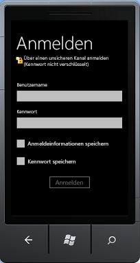

# <a name="overview-of-the-sharepoint-mobile-client-authentication-object-model"></a><span data-ttu-id="d9bec-102">Übersicht über das SharePoint-Objektmodell für die mobile Clientauthentifizierung</span><span class="sxs-lookup"><span data-stu-id="d9bec-102">Overview of the SharePoint mobile client authentication object model</span></span>
<span data-ttu-id="d9bec-103">Erhalten Sie eine Übersicht über die Entwicklung mit den Authentifizierung-APIs des SharePoint-Clientobjektmodells für Silverlight.</span><span class="sxs-lookup"><span data-stu-id="d9bec-103">Get an overview of development with the authentication APIs of the SharePoint client object model for Silverlight.</span></span>
## <a name="authentication-and-client-context-on-a-windows-phone"></a><span data-ttu-id="d9bec-104">Authentifizierung und Clientkontext auf einem Windows Phone</span><span class="sxs-lookup"><span data-stu-id="d9bec-104">Authentication and client context on a Windows Phone</span></span>
<span data-ttu-id="d9bec-105"><a name="SP15Mobileclientauth_auth"> </a></span><span class="sxs-lookup"><span data-stu-id="d9bec-105"></span></span>

<span data-ttu-id="d9bec-p101">Der Prozess der Authentifizierung eines SharePoint-Benutzers auf einem Windows Phone 7.5 ist ein wenig anders als derselbe Prozess auf einem Clientcomputer. Clientcode auf einem Windows Phone 7.5 erstellt zunächst ein Objekt der **Authenticator**-Klasse oder der **ODataAuthenticator**-Klasse, die dem SharePointClientobjektmodell für Microsoft Silverlight für Windows Phone hinzugefügt wurden. Dann wird dieses Objekt als Anmeldeinformationen des Benutzers verwendet.</span><span class="sxs-lookup"><span data-stu-id="d9bec-p101">The process of authenticating a SharePoint user on a Windows Phone 7.5 is a little different from the same process on a client computer. Client code on a Windows Phone 7.5 first creates an object of the **Authenticator** class or **ODataAuthenticator** class, which were added to the SharePointclient object model for Microsoft Silverlight for Windows Phone. It then uses this object as the user's credentials.</span></span>
  
    
    

> <span data-ttu-id="d9bec-109">**Hinweis:** Weitere Informationen über die in diesem Abschnitt erläuterten-APIs finden Sie unter [Übersicht über das mobile Objektmodell von SharePoint](overview-of-the-sharepoint-mobile-object-model.md).</span><span class="sxs-lookup"><span data-stu-id="d9bec-109">**Note** For more information about the APIs that are discussed in this section, see  [Overview of the SharePoint mobile object model](overview-of-the-sharepoint-mobile-object-model.md). For more information about the SharePoint client object model for Silverlight, see  Managed Client Object Model and Using the Silverlight Object Model.</span></span> <span data-ttu-id="d9bec-110">Weitere Informationen zum Silverlight-Clientobjektmodell finden Sie unter [Verwaltetes Clientobjektmodell](http://msdn.microsoft.com/de-de/library/ee537247.aspx) und [Verwenden des Silverlight-Objektmodells](http://msdn.microsoft.com/de-de/library/ee538971.aspx).</span><span class="sxs-lookup"><span data-stu-id="d9bec-110">Note For more information about the APIs that are discussed in this section, see  Overview of the SharePoint mobile object model. For more information about the SharePoint client object model for Silverlight, see  [Managed Client Object Model](http://msdn.microsoft.com/de-de/library/ee537247.aspx) and [Using the Silverlight Object Model](http://msdn.microsoft.com/de-de/library/ee538971.aspx).</span></span> 
  
    
    


## <a name="authenticating-the-user-in-the-sharepoint-client-object-model-for-silverlight"></a><span data-ttu-id="d9bec-111">Authentifizieren des Benutzers im SharePoint-Clientobjektmodell für Silverlight</span><span class="sxs-lookup"><span data-stu-id="d9bec-111">Authenticating the user in the SharePoint client object model for Silverlight</span></span>
<span data-ttu-id="d9bec-112"><a name="SP15Mobileclientauth_user"> </a></span><span class="sxs-lookup"><span data-stu-id="d9bec-112"></span></span>

<span data-ttu-id="d9bec-113">Nachfolgend finden Sie die erforderlichen Schritte, um ein authentifiziertes Clientkontextobjekt abzurufen:</span><span class="sxs-lookup"><span data-stu-id="d9bec-113">The following are the required steps to get an authenticated client context object:</span></span>
  
    
    

1. <span data-ttu-id="d9bec-114">Rufen Sie ein  [ClientContext](http://msdn.microsoft.com/de-de/library/microsoft.sharepoint.client.clientcontext.aspx)-Objekt ab.</span><span class="sxs-lookup"><span data-stu-id="d9bec-114">Obtain a  [ClientContext](http://msdn.microsoft.com/de-de/library/microsoft.sharepoint.client.clientcontext.aspx) object.</span></span>
    
  
2. <span data-ttu-id="d9bec-115">Erstellen Sie ein neues **Authenticator**-Objekt und initialisieren Sie seine Eigenschaften.</span><span class="sxs-lookup"><span data-stu-id="d9bec-115">Construct a new **Authenticator** object and initialize its properties.</span></span>
    
    > <span data-ttu-id="d9bec-116">**Hinweis:** Es kann jeweils nur ein **Authenticator**-Objekt mit einem **ClientContext**-Objekt verwendet werden.</span><span class="sxs-lookup"><span data-stu-id="d9bec-116">**Note** One **Authenticator** object can be used with one **ClientContext** object only. You can't share an Authenticator object across multiple ClientContext objects with different URLs.</span></span> <span data-ttu-id="d9bec-117">Sie können kein **Authenticator**-Objekt über mehrere **ClientContext**-Objekte hinweg mit verschiedenen URLs freigeben.</span><span class="sxs-lookup"><span data-stu-id="d9bec-117">Note One Authenticator object can be used with one ClientContext object only. You can't share an **Authenticator** object across multiple **ClientContext** objects with different URLs.</span></span>
3. <span data-ttu-id="d9bec-118">Die **Authenticator**-Klasse implementiert die [ICredentials](http://msdn.microsoft.com/de-de/library/system.net.icredentials.aspx)-Schnittstelle, sodass Sie das Objekt der [Credentials](http://msdn.microsoft.com/de-de/library/microsoft.sharepoint.client.clientruntimecontext.credentials.aspx)-Eigenschaft des **ClientContext**-Objekts zuweisen können.</span><span class="sxs-lookup"><span data-stu-id="d9bec-118">The **Authenticator** class implements the [ICredentials](http://msdn.microsoft.com/de-de/library/system.net.icredentials.aspx) interface, so you assign the object to the [Credentials](http://msdn.microsoft.com/de-de/library/microsoft.sharepoint.client.clientruntimecontext.credentials.aspx) property of the **ClientContext** object.</span></span>
    
  
<span data-ttu-id="d9bec-119">Sie können dann den restlichen Code des Clientobjektmodells hinzufügen und **ExecuteQueryAsync** aufrufen.</span><span class="sxs-lookup"><span data-stu-id="d9bec-119">You can then add the rest of your client object model code and call **ExecuteQueryAsync**.</span></span>
  
    
    
<span data-ttu-id="d9bec-120">Im folgenden Code werden diese Schritte veranschaulicht.</span><span class="sxs-lookup"><span data-stu-id="d9bec-120">The following code shows these steps.</span></span>
  
    
    


```cs

ClientContext context = new ClientContext(ListUrl);

// Create an instance of Authenticator object.
Authenticator at = new Authenticator();

// Replace <username> and <password> with valid values. 
at.UserName = "<username>";
at.Password = "<password>";
at.AuthenticationMode = ClientAuthenticationMode.FormsAuthentication;

at.CookieCachingEnabled = true;

// Assign the instance of Authenticator object to the ClientContext.Credential property.
// ClientContext is the object that is central to the client object model for making calls to the server running SharePoint 
// for fetching and updating data.
context.Credentials = at;

ListItemCollection items = context.Web.Lists.GetByTitle(ListName).GetItems(CamlQuery.CreateAllItemsQuery());

// Load the query and execute the request to fetch data.
context.Load(items);
context.ExecuteQueryAsync(
    (object obj, ClientRequestSucceededEventArgs args) =>
    {
// Success logic
    },

    (object obj, ClientRequestFailedEventArgs args) =>
    {
// Failure logic
    });


```

<span data-ttu-id="d9bec-121">Optional können Sie einen UAG-Server (Unified Access Gateway) angeben, indem Sie die **Authenticator.UagServerUrl**-Eigenschaft festlegen.</span><span class="sxs-lookup"><span data-stu-id="d9bec-121">Optionally, you can specify a Unified Access Gateway (UAG) server by setting the **Authenticator.UagServerUrl** property.</span></span>
  
    
    
<span data-ttu-id="d9bec-p104">Wenn die SharePoint-URL über eine einfache oder formularbasierte Authentifizierungsunterstützung verfügt, fordert der **ExecuteQueryAsync**-Aufruf den Benutzer auf, Anmeldeinformationen einzugeben, wie in Abbildung 1 gezeigt. Andernfalls führt der Aufruf zu einem Fehler. Aktivieren Sie die einfache oder formularbasierte Authentifizierungsautorisierung auf der SharePoint-Website, um einen Authentifizierungsfehler zu vermeiden.</span><span class="sxs-lookup"><span data-stu-id="d9bec-p104">If the SharePoint URL has basic or forms-based authentication support, the **ExecuteQueryAsync** calls prompt the user for logon information, as shown in Figure 1. Otherwise, the call will fail. Enable basic or forms-based authentication authorization on the SharePoint site to avoid an authentication error.</span></span>
  
    
    

<span data-ttu-id="d9bec-125">**Abbildung 1. SharePoint-Clientauthentifizierung**</span><span class="sxs-lookup"><span data-stu-id="d9bec-125">**Figure 1. SharePoint client authentication**</span></span>

  
    
    

  
    
    

  
    
    
<span data-ttu-id="d9bec-p105">Der Benutzer gibt den Benutzernamen und das Kennwort ein, und wählt **Anmelden** aus, wie in Abbildung 1 gezeigt. Der Benutzer hat die Möglichkeit **Anmeldeinformationen speichern** auszuwählen, damit der Benutzername gespeichert wird, und er kann **Kennwort speichern** auswählen, um das Kennwort zu speichern, wie in Abbildung 1 dargestellt. Nachdem der Benutzername oder das Kennwort gespeichert wurde, muss der Benutzer beim nächsten Start der App die Anmeldeinformationen nicht mehr eingeben. **ExecuteQueryAsync** verwendet dann die Anmeldeinformationen, um Webanforderungen an den Server zu stellen, auf dem SharePoint ausgeführt wird, um Daten abzurufen.</span><span class="sxs-lookup"><span data-stu-id="d9bec-p105">The user enters the user name and password and chooses **Log On**, as shown in Figure 1. The user has the option to choose **Remember me** to remember their user name and has the option to choose **Remember my password** to remember their password, as shown in Figure 1. After the user name or password is remembered, the user doesn't have to enter credentials the next time the app is started. The **ExecuteQueryAsync** then uses the logged on credentials to make web requests to the server running SharePoint to fetch data.</span></span>
  
    
    

## <a name="authenticating-the-user-in-the-sharepoint-odata-object-model"></a><span data-ttu-id="d9bec-131">Authentifizieren des Benutzers im SharePoint-OData-Objektmodell</span><span class="sxs-lookup"><span data-stu-id="d9bec-131">Authenticating the user in the SharePoint OData object model</span></span>
<span data-ttu-id="d9bec-132"><a name="SP15Mobileclientauth_OData"> </a></span><span class="sxs-lookup"><span data-stu-id="d9bec-132"></span></span>

<span data-ttu-id="d9bec-133">Nachfolgend finden Sie die erforderlichen Schritte, um ein authentifiziertes OData-Kontextobjekt abzurufen:</span><span class="sxs-lookup"><span data-stu-id="d9bec-133">The following are the required steps to get an authenticated OData context object.</span></span>
  
    
    

1. <span data-ttu-id="d9bec-134">Erstellen Sie ein neues **ODataAuthenticator**-Objekt, und initialisieren Sie seine Eigenschaften.</span><span class="sxs-lookup"><span data-stu-id="d9bec-134">Construct a new **ODataAuthenticator** object and initialize its properties.</span></span>
    
  
2. <span data-ttu-id="d9bec-135">Registrieren Sie einen Handler für das **AuthenticationCompleted**-Ereignis.</span><span class="sxs-lookup"><span data-stu-id="d9bec-135">Register a handler for the **AuthenticationCompleted** event.</span></span>
    
  
3. <span data-ttu-id="d9bec-136">Rufen Sie die **ODataAuthenticator.Authenticate**-Methode auf, die das **AuthenticationCompleted**-Ereignis auslöst.</span><span class="sxs-lookup"><span data-stu-id="d9bec-136">Call the **ODataAuthenticator.Authenticate** method, which will raise the **AuthenticationCompleted** event.</span></span>
    
  
4. <span data-ttu-id="d9bec-137">Rufen Sie ein OData-Kontextobjekt innerhalb des **OnAuthenticationCompleted**-Handlers ab.</span><span class="sxs-lookup"><span data-stu-id="d9bec-137">Obtain an OData context object inside the **OnAuthenticationCompleted** handler.</span></span>
    
  
<span data-ttu-id="d9bec-138">Sie können dann die restlichen OData-Aufrufe im **OnAuthenticationCompleted**-Handler hinzufügen.</span><span class="sxs-lookup"><span data-stu-id="d9bec-138">You can then add the rest of your OData calls in the **OnAuthenticationCompleted** handler.</span></span>
  
    
    
<span data-ttu-id="d9bec-139">Im folgenden Code werden diese Schritte veranschaulicht.</span><span class="sxs-lookup"><span data-stu-id="d9bec-139">The following code shows these steps.</span></span>
  
    
    


```cs

ODataAuthenticator oat = new ODataAuthenticator();

// Replace <username> and <password> with valid values. 
oat.UserName = "<username>";
oat.Password = "<password>";

oat.AuthenticationMode = ClientAuthenticationMode.FormsAuthentication;


oat.AuthenticationCompleted += 
           new EventHandler<SendingRequestEventArgs>(OnAuthenticationCompleted);

// The Authenticate method will raise the AuthenticationCompleted event.
oat.Authenticate("My_service_URL");  

```

<span data-ttu-id="d9bec-140">Der Code muss auch zwei Ereignishandler implementieren, wie im folgenden Abschnitt beschrieben.</span><span class="sxs-lookup"><span data-stu-id="d9bec-140">Your code must also implement two event handlers, as described in the following section.</span></span>
  
    
    

### <a name="implementing-the-onauthenticationcompleted-and-onsendingrequest-handlers-and-getting-the-clientcontext-object"></a><span data-ttu-id="d9bec-141">Implementieren der OnAuthenticationCompleted- und OnSendingRequest-Handler und Abrufen des ClientContext-Objekts</span><span class="sxs-lookup"><span data-stu-id="d9bec-141">Implementing the OnAuthenticationCompleted and OnSendingRequest handlers and getting the ClientContext object</span></span>

<span data-ttu-id="d9bec-p106">Eine Implementierung des **OnAuthenticationCompleted**-Handlers sollte zuerst nach Fehlern bei der Authentifizierung suchen. Wenn Fehler vorhanden sind, sollten diese entsprechend behandelt werden, z. B. Anzeigen einer Fehlermeldung für den Benutzer, und beenden Sie dann den Vorgang.</span><span class="sxs-lookup"><span data-stu-id="d9bec-p106">An implementation of the **OnAuthenticationCompleted** handler should first check for any errors in the authentication. If there are any, it should handle them appropriately, such as displaying an error message to the user, and then exit.</span></span>
  
    
    
<span data-ttu-id="d9bec-p107">Wenn keine Fehler vorhanden sind, sollte der Handler erstellen eine Instanz eines neuen **DataServiceContext**-Objekts erstellen und dann einen Handler für das **SendingRequest**-Ereignis registrieren. Von diesem Zeitpunkt an wird der OData-Aufrufcode gegen für das **DataServiceContext**-Objekt programmiert, genau wie auf einem Computer.</span><span class="sxs-lookup"><span data-stu-id="d9bec-p107">If there are no errors, the handler should create an instance of a new **DataServiceContext** object and then register a handler for the **SendingRequest** event. From that point, your OData calling code is programmed against the **DataServiceContext** object just as it is on a computer.</span></span>
  
    
    
<span data-ttu-id="d9bec-146">Nachfolgend sehen Sie ein Beispiel für eine Implementierung eines **OnAuthenticationCompleted**-Handlers.</span><span class="sxs-lookup"><span data-stu-id="d9bec-146">The following is an example of an implementation of an **OnAuthenticationCompleted** handler.</span></span>
  
    
    


```cs

void OnAuthenticationCompleted(object sender, AuthenticationCompletedEventArgs e)
{
    if (e.Error != null)
    {
        MessageBox.Show(error);
        return;
    }
    ODataAuthenticator oat = sender as ODataAuthenticator;

    // Construct an OData context object.
    contextObj = new DataServiceContext(oat.ResolvedUrl);

    // Register the SendingRequest event handler.
    contextObj.SendingRequest += 
        new EventHandler<SendingRequestEventArgs>(OnSendingRequest);  
    
    // Your data retrieval logic goes here. 
    // For example, if there is a GetData method: 
    // contextObj.GetData();   
}


```

<span data-ttu-id="d9bec-147">Der **OnSendingRequest**-Handler muss lediglich den Cookiecontainer des **Request**-Objekts auf den Cookiecontainer des **ODataAuthenticator**-Objekts festlegen.</span><span class="sxs-lookup"><span data-stu-id="d9bec-147">All that the **OnSendingRequest** handler needs to do is set the cookie container of the **Request** object to the cookie container of the **ODataAuthenticator** object. The following is an example.</span></span> <span data-ttu-id="d9bec-148">Es folgt ein Beispiel.</span><span class="sxs-lookup"><span data-stu-id="d9bec-148">The following is an example.</span></span>
  
    
    


```cs

void OnSendingRequest(object sender, SendingRequestEventArgs e)
{ 
    ODataAuthenticator oat = sender as ODataAuthenticator;
    ((HttpWebRequest)e.Request).CookieContainer = oat.CookieContainer;
}

```


## <a name="advanced-usage"></a><span data-ttu-id="d9bec-149">Erweiterte Nutzung</span><span class="sxs-lookup"><span data-stu-id="d9bec-149">Advanced usage</span></span>
<span data-ttu-id="d9bec-150"><a name="SP15Mobileclientauth_advance"> </a></span><span class="sxs-lookup"><span data-stu-id="d9bec-150"></span></span>


1. <span data-ttu-id="d9bec-p109">Sie können ein **Authenticator**-Objekt mit einer hartcodierten Option für Benutzername/Kennwort erstellen. Der Benutzer der App wird nicht nach einem Benutzernamen und Kennwort gefragt, und es werden hartcodierte Anmeldeinformationen für die Authentifizierung des Benutzers verwendet.</span><span class="sxs-lookup"><span data-stu-id="d9bec-p109">You can choose to construct an **Authenticator** object with a hard-coded user name/password option. The user of the app will not be prompted for a user name and password, and hard-coded credentials will be used for authenticating the user.</span></span>
    
     `public Authenticator(string userName, string password)`
    
     `public Authenticator(string userName, string password, string domain)`
    
    <span data-ttu-id="d9bec-p110">Der gleiche Konstruktor kann zum Erstellen einer benutzerdefinierten Anmeldeseite verwendet werden. Sie können eine benutzerdefinierte Anmeldeseite schreiben, indem Sie die Anmeldeinformationen aus CodeBehind-Dateien übergeben.</span><span class="sxs-lookup"><span data-stu-id="d9bec-p110">The same constructor can be used to create a custom logon page. You can write a custom logon page by passing the credentials from code-behind files.</span></span>
    


```cs
  
Authenticator at = new Authenticator();
at.AuthenticationMode = ClientAuthenticationMode.MicrosoftOnline;                          

```

2. <span data-ttu-id="d9bec-p111">Der Authentifizierungstyp kann entsprechend festgelegt werden. Standardmäßig wird die Standardauthentifizierung verwendet.</span><span class="sxs-lookup"><span data-stu-id="d9bec-p111">Authentication type can be set accordingly. By default, basic authentication is used.</span></span>
    
  

### <a name="authenticating-against-sharepoint-online"></a><span data-ttu-id="d9bec-157">Authentifizierung über SharePoint Online</span><span class="sxs-lookup"><span data-stu-id="d9bec-157">Authenticating against SharePoint Online</span></span>

<span data-ttu-id="d9bec-p112">Um eine Authentifizierung gegen eine SharePoint Online-URL auszuführen, legen Sie die URL, die **AuthenticationMode**-Eigenschaft des **Authenticator**-Objekt auf **MicrosoftOnline**-Modus fest. Die verbleibenden Schritte des Verfahrens sind dieselben wie für eine lokale SharePoint-URL.</span><span class="sxs-lookup"><span data-stu-id="d9bec-p112">To authenticate against a SharePoint Online URL, set the **AuthenticationMode** property of the **Authenticator** object to **MicrosoftOnline** mode. The remaining steps in the procedure are the same as those for an on-premises SharePoint URL.</span></span>
  
    
    

> <span data-ttu-id="d9bec-160">**Hinweis:** Der Benutzername und das Kennwort können für SharePoint Online nicht hartcodiert werden. Der Benutzer wird zur Eingabe von Anmeldeinformationen aufgefordert.</span><span class="sxs-lookup"><span data-stu-id="d9bec-160">**Note** The user name and password cannot be hard-coded for SharePoint Online.The user will be prompted for logon credentials.</span></span> 
  
    
    


#### <a name="federation-authentication"></a><span data-ttu-id="d9bec-161">Verbundauthentifizierung</span><span class="sxs-lookup"><span data-stu-id="d9bec-161">Federation Authentication</span></span>

 <span data-ttu-id="d9bec-p113">Die **FederationAuthURI**-Eigenschaft wird zum Übergeben der **ADFS**-Authentifizierungsschemaeinstellung verwendet, wobei **ADFS** so konfiguriert ist, dass mehrere Authentifizierungshandler verwendet werden. **FederationAuthURI** gibt die Art der Authentifizierung an, die für die Authentifizierungsanforderung erforderlich ist, wenn die SharePoint Online-Authentifizierung mit Verbund verwendet wird. Dieser Parameter kann die Priorität außer Kraft setzen, die von der Reihenfolge der Konfiguration der Authentifizierungshandler aufgestellt wurde. Weitere Informationen zu Authentifizierunghandlern finden Sie unter [Übersicht über Authentifizierungshandler](http://msdn.microsoft.com/de-de/library/ee895365.aspx).</span><span class="sxs-lookup"><span data-stu-id="d9bec-p113">**FederationAuthURI** property is used to pass **ADFS** authentication scheme preference where, **ADFS** is configured to use multiple authentication handlers. **FederationAuthURI** specifies the type of authentication required by Authentication request when, SharePoint Online authentication is used with Federation. This parameter can override the priority established by the order in which authentication handlers are configured. To know more about Authentication handler, see [Authentication Handler Overview](http://msdn.microsoft.com/de-de/library/ee895365.aspx).</span></span>
  
    
    

```cs

 Authenticator auth = new Authenticator("domain\\\\name", "xyz"); 
 auth.FederationPassiveAuthUri = "urn:oasis:names:tc:SAML:2.0:ac:classes:Password"; 
//Replace <SiteUrl> with valid value 
ClientContext ctx = new ClientContext("SiteUrl"); 
               ctx.Credentials = auth; 
               ctx.ExecuteQueryAsync( 
 (object sender, ClientRequestSucceededEventArgs args) => 
   { 
    /* successful callback code */ 
   }, 
 (object sender, ClientRequestFailedEventArgs args) => 
   { 
   /* failure callback code */ 
  });

```

 <span data-ttu-id="d9bec-p114">**ADFS** ist eine optionale Eigenschaft, die nur wirksam ist, wenn sie mit Microsoft SharePoint Online verwendet wird. Die Verwendung der **ADFS**-Authentifizierung mit einem beliebigen anderen Authentifizierungsschema hat keine Auswirkungen. Bei Microsoft SharePoint Online wird, wenn **ADFS** nicht festgelegt ist, das Standardschema verwendet, z. B. die Servereinstellung.</span><span class="sxs-lookup"><span data-stu-id="d9bec-p114">**ADFS** is an optional property which will be effective only when it is used with Microsoft SharePoint Online. Using **ADFS** authentication with any other authentication scheme will not have any effect. With Microsoft SharePoint online, if **ADFS** is not set then default scheme will be used, i.e. server preference.</span></span>
  
    
    

## <a name="cookie-caching"></a><span data-ttu-id="d9bec-169">Zwischenspeichern von Cookies</span><span class="sxs-lookup"><span data-stu-id="d9bec-169">Cookie caching</span></span>
<span data-ttu-id="d9bec-170"><a name="SP15Mobileclientauth_cookie"> </a></span><span class="sxs-lookup"><span data-stu-id="d9bec-170"></span></span>

<span data-ttu-id="d9bec-p115">Die **Authenticator**-Klasse umfasst auch Elemente, die Sie zum Aktivieren und Verwalten des Zwischenspeicherns von Cookies oder Anmeldeinformationen oder von beidem verwenden können. Weitere Informationen zu diesen Elementen der **Authenticator**-Klasse und deren Verwendungen finden Sie unter  [Übersicht über die mobilen SharePoint-Objektmodell](overview-of-the-sharepoint-mobile-object-model.md).</span><span class="sxs-lookup"><span data-stu-id="d9bec-p115">The **Authenticator** class also includes members that you can use to enable and manage caching of cookies or credentials or both. For information about these members of the **Authenticator** class and their uses, see [Overview of the SharePoint mobile object model](overview-of-the-sharepoint-mobile-object-model.md).</span></span>
  
    
    

## <a name="additional-resources"></a><span data-ttu-id="d9bec-173">Zusätzliche Ressourcen</span><span class="sxs-lookup"><span data-stu-id="d9bec-173">Additional resources</span></span>
<span data-ttu-id="d9bec-174"><a name="SP15Mobileclientauth_addlresources"> </a></span><span class="sxs-lookup"><span data-stu-id="d9bec-174"></span></span>


-  [<span data-ttu-id="d9bec-175">Erstellen von Windows Phone-Apps, die auf SharePoint zugreifen</span><span class="sxs-lookup"><span data-stu-id="d9bec-175">Build Windows Phone apps that access SharePoint</span></span>](build-windows-phone-apps-that-access-sharepoint.md)
    
  
-  [<span data-ttu-id="d9bec-176">Übersicht über die mobilen SharePoint-Objektmodell</span><span class="sxs-lookup"><span data-stu-id="d9bec-176">Overview of the SharePoint mobile object model</span></span>](overview-of-the-sharepoint-mobile-object-model.md)
    
  

