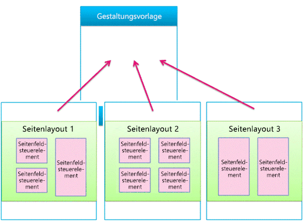
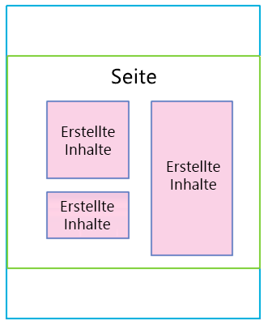
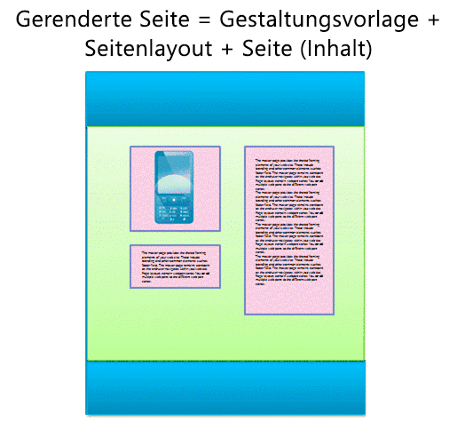
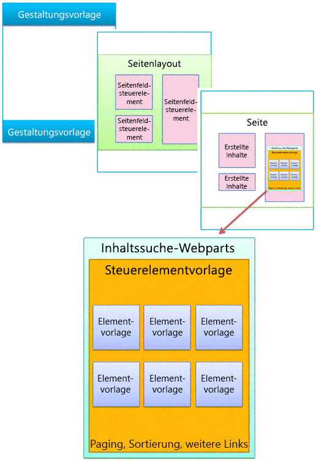
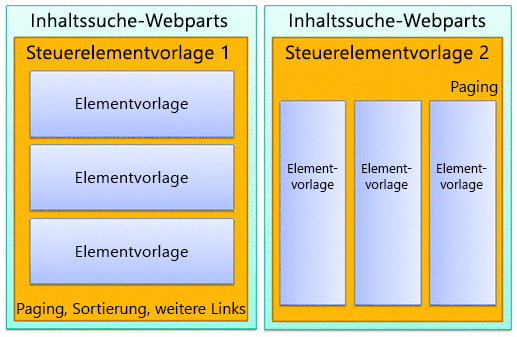
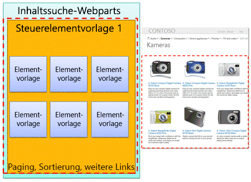
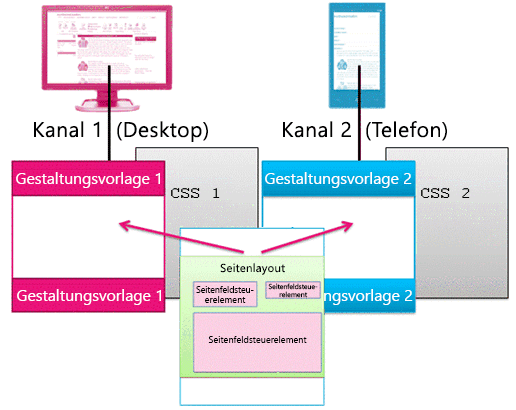

# Übersicht über das SharePoint-SeitenmodellOverview of the SharePoint page model
Informationen zum überarbeiteten Seitenmodell, einschließlich Gestaltungsvorlagen und Seitenlayouts, für SharePoint.Learn about the revised page model—including master pages and page layouts—redesigned for SharePoint.
## Einführung in das SeitenmodellIntroduction to the page model

Bevor Sie eine SharePoint-Website gestalten, müssen Sie mit den Teilen einer SharePoint-Website und der Zusammensetzung einer SharePoint-Seite grundlegend vertraut sein. Dieser Artikel bietet einen grafischen Überblick über die Komponenten, die Sie bei der Planung der Gestaltung Ihrer Website berücksichtigen müssen. Dieser Artikel gilt spezifisch für Veröffentlichungswebsites in SharePoint.Before you design or brand a SharePoint site, you need a basic understanding of the parts of a SharePoint site and how a SharePoint page is put together. This article gives you a visual overview of the pieces to think about as you plan how to brand your site. This article applies specifically to publishing sites in SharePoint.
  
    
    

## Gestaltungsvorlagen, Seitenlayouts und SeitenMaster pages, page layouts, and pages

SharePoint verwendet Vorlagen zum Definieren und Rendern der Seiten, die zu einer Website gehören. Die Struktur einer SharePoint-Seite besteht aus drei Hauptelementen:SharePoint uses templates to define and render the pages that a site displays. The structure of a SharePoint page includes three main elements:
  
    
    

- Mit Gestaltungsvorlagen werden die gemeinsam genutzten Rahmenelemente aller Seiten Ihrer Website (der sog. Chrome) definiert.Master pages define the shared framing elements—the chrome—for all pages in your site.
    
  
- Seitenlayouts definieren das Layout einer bestimmten Klasse von Seiten.Page layouts define the layout for a specific class of pages.
    
  
- Seiten werden anhand eines Seitenlayouts von Autoren erstellt, die Seitenfeldern Inhalte hinzufügen.Pages are created from a page layout by authors who add content to page fields.
    
  

**Abbildung 1. Gestaltungsvorlage, Seitenlayout und Seite****Figure 1. Master page, page layout, and page**

  
    
    

  
    
    

  
    
    

### GestaltungsvorlagenMaster pages

Eine Gestaltungsvorlage definiert den Chrome (die gemeinsam genutzten Rahmenelemente) Ihrer Website. Zu diesen Elementen zählen die Kopf- und Fußzeile, die oberste Navigationsleiste, Breadcrumbs, das Suchfeld, das Logo der Website und andere Gestaltungselemente. Die Gestaltungsvorlage bleibt einheitlich, wenn Besucher durch Ihre Website navigieren.A master page defines the chrome (the shared framing elements) of your site. These elements may include the header and footer, top navigation, breadcrumbs, search box, site logo, and other branding elements. The master page remains consistent as visitors navigate through your site.
  
    
    

**Abbildung 2. Gestaltungsvorlage****Figure 2. Master page**

  
    
    

  
    
    

  
    
    
Eine Gestaltungsvorlage definiert außerdem als Inhaltsplatzhalter bezeichnete Bereiche, die mit Inhalten aus übereinstimmenden Bereichen in Seitenlayouts gefüllt werden. In der Regel enthält der Textkörper einer Gestaltungsvorlage nur einen einzigen Inhaltsplatzhalter (mit dem Namen **PlaceHolderMain**, der automatisch erstellt wird). Der gesamte Inhalt eines Seitenlayouts wird in diesem einen Inhaltsplatzhalter angezeigt (der Inhaltsplatzhalter **PlaceHolderMain** ist in Abbildung 3 rot umrandet).A master page also defines regions called content placeholders that are filled in by content from matching regions on page layouts. Most commonly, the body of a master page contains just a single content placeholder (named **PlaceHolderMain**, which is created automatically), and all of the content from a page layout appears inside this one content placeholder (the **PlaceHolderMain** content placeholder is outlined in red in Figure 3).
  
    
    

**Abbildung 3. Gestaltungsvorlage mit umrandeten Seitenlayout****Figure 3. Master page with page layout outlined**

  
    
    

  
    
    

  
    
    
Wenn Sie im Entwurfs-Manager eine Vorschau einer Gestaltungsvorlage anzeigen, wird die folgende Meldung eingeblendet. Dieses **
**-Tag befindet sich innerhalb des primären Inhaltsplatzhalters. Kurz gesagt, definiert die Gestaltungsvorlage den Chrome einer Seite, während das Seitenlayout den Textkörper bestimmt, der im primären Inhaltsplatzhalter enthalten ist.When you preview a master page in Design Manager, you see the following message. This **
** resides inside the main content placeholder. Put simply, the master page defines the chrome of a page, and the page layout defines the body contained in the main content placeholder.
  
    
    

**Abbildung 4. Meldung bei Vorschau auf eine Gestaltungsvorlage****Figure 4. Master page preview message**

  
    
    

  
    
    

  
    
    

  
    
    

  
    
    

### SeitenlayoutsPage layouts

Ein Seitenlayout ist eine Vorlage für einen bestimmten Typ von Seite in Ihrer Website, z. B. eine Artikel- oder Produktdetailseite. Wie der Name schon sagt, wird mithilfe eines Seitenlayouts das Layout bzw. die Struktur des Textkörpers einer Seite bestimmt.A page layout is a template for a specific type of page in your site, such as an article page or a product details page. Just like its name implies, you can think of a page layout as defining the layout or structure for the body of a page.
  
    
    

**Abbildung 5. Seitenlayout****Figure 5. Page layout**

  
    
    

  
    
    

  
    
    
Mit Seitenlayouts werden Regionen oder Inhaltsbereiche definiert, die Inhaltsplatzhaltern in der Gestaltungsvorlage zugeordnet werden (in Abbildung 6 rot umrandet). Wiederum das gängigste Szenario ist, dass ein Seitenlayout einen einzelnen Inhaltsbereich bestimmt, der einem in einer Gestaltungsvorlage automatisch erstellten Inhaltsplatzhalter zugeordnet wird.Page layouts define regions or content areas that map to content placeholders on the master page (outlined in red in Figure 6). Again, the most common scenario is that a page layout defines a single content region that maps to the single content placeholder that is created automatically on a master page.
  
    
    

**Abbildung 6. Inhaltsbereich und Inhaltsplatzhalter****Figure 6. Content region and content placeholder**

  
    
    

  
    
    

  
    
    

  
    
    

  
    
    

### Seitenfeld-SteuerelementePage field controls

Der primäre Zweck eines Seitenlayouts ist das Anordnen von Seitenfeldern. Wenn Sie ein Seitenlayout entwerfen, fügen Sie Positions- und Formatelemente ein, die Seitenfeld-Steuerelemente genannt werden. Diese Steuerelemente enthalten letztendlich Inhalte, wenn ein Autor eine Seite basierend auf diesem Seitenlayout erstellt. Neben Seitenfeldern können Seitenlayouts auch Webpartzonen enthalten, denen Autoren Webparts hinzufügen können. (Gestaltungsvorlagen dürfen keine Webpartzonen enthalten.)The primary purpose of a page layout is to arrange page fields. When you design a page layout, you insert, position, and style elements called page field controls. These controls will eventually contain content when an author creates a page based on that page layout. In addition to page fields, page layouts can also contain Web Part zones, to which content authors can add Web Parts. (Master pages can't contain Web Part zones.)
  
    
    
Mit einem Seitenfeld-Steuerelement definieren Sie die Formate des Inhalts. Autoren können einer Seite Inhalte hinzufügen, doch der Designer hat die ultimative Kontrolle darüber, wie diese Inhalte mittels CSS gerendert werden, die auf diese Steuerelemente angewendet werden.With a page field control, you can define the styles used by the content. Authors can add content to a page, but the designer has ultimate control over how that content is rendered through CSS applied to those controls.
  
    
    

**Abbildung 7. Seitenlayout mit Seitenfeld-Steuerelementen****Figure 7. Page layout with page field controls**

  
    
    

  
    
    

  
    
    
Jedem Seitenlayout ist in der Bibliothek Seiten ein Inhaltstyp zugeordnet. Ein Inhaltstyp ist ein Schema aus Spalten und Datentypen. Bei allen Seitenlayouts entsprechen die für das jeweilige Layout verfügbaren Seitenfelder direkt den Spalten, die für den Inhaltstyp des Seitenlayouts definiert sind.Every page layout is associated with a content type in the Pages library of a site. A content type is a schema of columns and data types. For any page layout, the page fields that are available for that layout correspond directly to the columns defined for that page layout's content type.
  
    
    

### Beziehung von Gestaltungsvorlagen und SeitenlayoutsRelationship of master pages and page layouts

Gemeinsam bilden eine Gestaltungsvorlage und ein Seitenlayout eine Inhaltsseite.Together, a master page and a page layout create a content page.
  
    
    

**Abbildung 8. Gestaltungsvorlage mit Seitenlayout****Figure 8. Master page with page layout**

  
    
    

  
    
    

  
    
    
Die Gestaltungsvorlage definiert den Chrome aller Seiten der Website, sodass häufig zahlreiche Seitenlayouts (und demzufolge viele anhand dieser Seitenlayouts erstellte Seiten) einer Gestaltungsvorlage zugeordnet sind.The master page defines the chrome for all pages in the site so, often many page layouts (and therefore many pages created from those page layouts) are associated with one master page.
  
    
    

**Abbildung 9. Eine mit drei Seitenlayouts verknüpfte Gestaltungsvorlage****Figure 9. One master page tied to three page layouts**

  
    
    

  
    
    

  
    
    
Doch auf Ihrer Website werden wahrscheinlich mehrere Gestaltungsvorlagen verwendet. Beispielsweise können Sie zusätzlich zur Standardgestaltungsvorlage über eine oder mehrere Gestaltungsvorlagen für bestimmte Geräte wie Smartphones und Tablets verfügen. In diesem Fall wird ein Seitenlayout von vielen Gestaltungsvorlagen verwendet (siehe den Abschnitt zu Gerätekanälen).But, your site will likely use multiple master pages. For example, in addition to the default master page, you may have one or more master pages that target specific devices such as smart phones or tablets. In this case, one page layout is used by many master pages (see the section about device channels).
  
    
    
Sie können eine Gestaltungsvorlage pro Kanal pro SharePoint-Website verwenden.You can use one master page per channel per SharePoint site.
  
    
    

### SeitenPages

Autoren können Seiten erstellen und Inhalte den Seitenfeldern hinzufügen. Sie können außerdem Webpartzonen und Rich-Text-Editoren Webparts hinzufügen. Seiten sind so strukturiert, dass Inhaltsautoren keine Änderungen außerhalb von Seitenfeldern vornehmen können.Authors can create pages and add content to the page fields, and they can add Web Parts to any Web Part zones or Rich Text Editors. Pages are structured so that content authors cannot make changes outside of page fields.
  
    
    

**Abbildung 10. Seite mit erstelltem Inhalt****Figure 10. Page with authored content**

  
    
    

  
    
    

  
    
    
Die gerenderte Seite wird Besuchern der Website angezeigt. Wenn eine Seite vom Browser angefordert wird, erfolgt eine Zusammenführung der Gestaltungsvorlage mit dem Seitenlayout zum Erstellen einer Inhaltsseite. Der Inhalt dieser Seite wird anhand der jeweiligen Seite in der Bibliothek Seiten in den Seitenfeldern zusammengeführt.The rendered page is what site visitors see. When a page is requested by the browser, the master page is merged with a page layout to create a content page, and the content for that page is merged into the page fields from that page in the Pages library.
  
    
    

**Abbildung 11. Gerenderte Seite im Browser****Figure 11. Rendered page in browser**

  
    
    

  
    
    

  
    
    

**Abbildung 12. Gestaltungsvorlage, Seitenlayout und Seite****Figure 12. Master page, page layout, and page**

  
    
    

  
    
    

  
    
    

  
    
    

  
    
    

## Suchgesteuerte Webparts und AnzeigevorlagenSearch-driven Web Parts and display templates

Im vorherigen Abschnitt wurde das SharePoint-Seitenmodell bezüglich Gestaltungsvorlagen, Seitenlayouts (mit Seitenfeldern) und Seiten erläutert. Diese Elemente sind auf einer Veröffentlichungswebsite am gängigsten, auf der Autoren neue Inhalte regelmäßig erstellen und veröffentlichen. Wenn es jedoch darum geht, diese Inhalte auf Ihrer Website anzuzeigen, kommen weitere Elemente ins Spiel. Ganz gleich, ob Sie eine Verbindung mit einem externen Katalog hergestellt haben oder einfach eine bestimmte Menge von Suchergebnissen anzeigen möchten, können Ihnen suchgesteuerter Webparts beim Erreichen Ihres Ziels helfen.The previous section explains the SharePoint page model in terms of master pages, page layouts (with page fields), and pages. These elements are the most common in a publishing site in which authors regularly create and publish new content. When it comes to surfacing that content on your site, though, a couple more elements come into play. Whether you have connected to an external catalog or simply want to show a particular set of search results, search-driven Web Parts can help you achieve your goal.
  
    
    
Beim Szenario mit suchgesteuerten Seiten enthält eine SharePoint-Seite diese Hauptelemente:In the search-driven pages scenario, a SharePoint page contains these main elements:
  
    
    

- GestaltungsvorlagenMaster pages
    
  
- Seitenlayouts:Page layouts:
    
  - Herkömmliche Seitenlayouts, die Sie für bestimmte Inhaltstypen (wie zuvor in diesem Artikel beschrieben) erstellenRegular page layouts that you created for specific content types, as described previously in this article
    
  
  - Kategorie- und Elementdetail-Seitenlayouts, die durch die websiteübergreifende Veröffentlichung eines Katalogs erstellt werdenCategory and item details page layouts that are created through cross-site publishing of a catalog
    
  
- SeitenPages
    
  
- Suchgesteuerte Webparts, wie z. B. das Inhaltssuche-WebpartSearch-driven Web Parts, such as the Content Search Web Part
    
  
- Anzeigevorlagen zum Steuern, welche verwalteten Eigenschaften in den Suchergebnissen eines suchgesteuerten Webparts angezeigt werden, und des Formats und Verhaltens dieser Suchergebnisse:Display templates to control which managed properties appear in the search results of a search-driven Web Part, and control the styling and behavior of those search results:
    
  - Steuerelement-Anzeigevorlagen, die das Layout von Suchergebnissen und andere Elemente steuern, die alle Ergebnisse gemeinsam haben, z. B. Seitenverwaltung, Sortierung und andere LinksControl display templates, which control the layout of search results and any elements common to all results such as paging, sorting, and other links
    
  
  - Elementanzeigevorlagen, die steuern, wie jedes Suchergebnis angezeigt und für jedes Ergebnis wiederholt wirdItem display templates, which control how each search result is displayed and repeated for each result
    
  

**Abbildung 13. Gestaltungsvorlage, Seitenlayout und Seite mit Webpart****Figure 13. Master page, page layout, and page with Web Part**

  
    
    

  
    
    

  
    
    

### Suchgesteuerte WebpartsSearch-driven Web Parts

Mit suchgesteuerten Webparts können Sie im Suchindex gespeicherte Informationen dynamisch präsentieren. Die Präsentation von Daten im Inhaltssuche-Webpart wird mithilfe von Anzeigevorlagen gesteuert, die neben Gestaltungsvorlagen und Seitenlayouts im Gestaltungsvorlagenkatalog enthalten sind.With search-driven Web Parts, you can dynamically present information stored in the search index. The presentation of data in the Content Search Web Part is controlled by display templates, which reside in the Master Page Gallery alongside master pages and page layouts.
  
    
    
SharePoint enthält mehrere sofort einsatzbereite Anzeigevorlagen wie Listen und Bildschirmpräsentationen für die Inhaltssuche-Webparts.SharePoint Server 2013 includes several ready-to-use display templates such as lists and slideshows for your Content Search Web Parts. When you configure a Content Search Web Part in the browser, you choose which display templates to use. Wenn Sie ein Inhaltssuche-Webpart im Browser konfigurieren, wählen Sie aus, welche Anzeigevorlagen verwendet werden soll.sps15short includes several ready-to-use display templates such as lists and slideshows for your Content Search Web Parts. When you configure a Content Search Web Part in the browser, you choose which display templates to use.
  
    
    

**Abbildung 14. Toolbereich des Inhaltssuche-Webparts****Figure 14. Tool pane of Content Search Web Part**

  
    
    

  
    
    

  
    
    
Inhaltssuche-Webparts verwenden zwei Typen von Anzeigevorlagen: Steuerelement und Element. Bei der Gestaltung Ihrer Website können Sie benutzerdefinierte Anzeigevorlagen erstellen, die von Ihnen festgelegte Layouts, Formate und Verhalten verwenden.Content Search Web Parts use two types of display templates, control and item. As part of the design or branding of your site, you can create custom display templates that use layouts, styles, and behaviors that you define.
  
    
    

**Abbildung 15. Zwei Diagramme für Inhaltssuche-Webparts****Figure 15. Two diagrams of Content Search Web Parts**

  
    
    

  
    
    

  
    
    

  
    
    

  
    
    

### Steuerelement-AnzeigevorlageControl display template

Die Steuerelementvorlage bestimmt die allgemeine Struktur und das Layout der Präsentation von Suchergebnissen, z. B. eine Liste mit Seitenverwaltung oder eine Bildschirmpräsentation. Jedes Inhaltssuche-Webpart verwendet eine Steuerelementvorlage.The control template determines the overall structure and layout of how you want to present the search results, such as a list with paging or a slideshow. Each Content Search Web Part uses one control template.
  
    
    
Die Steuerelementvorlage bietet auch Funktionalität, die für alle Suchergebnisse gilt, einschließlich Seitenverwaltung, Sortierung, Anzeigeoptionen und Trennzeichen.The control template also includes functionality common to all the search results, including paging, sorting, view options, and separators.
  
    
    

**Abbildung 16. In Webpart und Webseite hervorgehobene Steuerelementvorlage****Figure 16. Control template outlined on Web Part and webpage**

  
    
    

  
    
    

  
    
    

  
    
    

  
    
    

### ElementanzeigevorlageItem display template

Die Elementvorlage bestimmt, wie jedes Ergebnis in der Ergebnismenge angezeigt und die Vorlage für jedes Ergebnis wiederholt wird. Mithilfe einer Elementvorlage kann ein Bild, ein Bild mit Text, ein Video oder anderer Inhalt angezeigt werden.The item template determines how each result in the set is displayed, and the template is repeated for each result. An item template can display an image, an image with text, a video, and other content.
  
    
    
Die Elementanzeigevorlage bestimmt außerdem, welche verwalteten Eigenschaften und Werte vom Inhaltssuche-Webpart angezeigt werden. Bei diesem Beispiel zeigt die Elementvorlage drei verwaltete Eigenschaften: ein kleines Bild, einen Produktnamen als Hyperlink und eine kurze Textbeschreibung.The item display template also determines which managed properties and values are displayed by the Content Search Web Part. In this example, the item template displays three managed properties: a small-sized image, a product name as a hyperlink, and a brief text description.
  
    
    

**Abbildung 17. In Webpart und Webseite hervorgehobene Elementvorlagen****Figure 17. Item templates outlined on Web Part and webpage**

  
    
    

  
    
    

  
    
    

  
    
    

  
    
    

## Gerätekanäle und GerätkanalbereicheDevice channels and device channel panels

In SharePoint können Sie Gerätekanäle verwenden, um eine einzelne Veröffentlichungswebsite auf mehrere Weisen unter Verwendung verschiedener Designs für verschiedene Zielgeräte zu rendern. Sie erstellen eine einzelne Website und anschließend einmalig den dazugehörigen Inhalt. Danach können diese Website und ihr Inhalt auf die Verwendung verschiedener Gestaltungsvorlagen und Formatvorlagen für ein bestimmtes Gerät oder eine Gruppe von Geräten eingestellt werden.In SharePoint, you can use device channels to render a single publishing site in multiple ways by using different designs that target different devices. You create a single site and author the content in it a single time. Then, that site and content can be mapped to use different master pages and style sheets to target a specific device or group of devices.
  
    
    
Wenn Sie ein Design für mehrere Geräte entwerfen, berücksichtigen Sie diese Elemente:When you design for more than one device, consider these elements:
  
    
    

- Gerätekanäle:Device channels:
    
  - Durch Verwenden verschiedener Gestaltungsvorlagen und CSS pro Kanal können identische Seiteninhalte für bestimmte Geräte (z. B. Windows Phone) oder Gerätegruppen (alle Smartphones) auf verschiedene Weise dargestellt werden.By using different master pages and CSS per channel, identical page content can be presented in different ways for specific devices (for example, Windows Phone) or groups of devices (all smart phones).
    
  
- Seitenlayouts:Page layouts:
    
  - Wenn sich der Inhalt nicht ändert, verwenden Sie dasselbe Seitenlayout für alle Gerätekanäle, wenngleich diese basierend auf den CSS der verschiedenen Gestaltungsvorlagen für jeden Kanal ein anderen Format haben können.If the content does not change, you use the same page layouts for all device channels, though they can be styled differently based on the CSS of the different master page for each channel.
    
  
  - Wenn Sie Inhalte nur für bestimmte Geräte hinzufügen möchten, arbeiten Sie mit Gerätekanalbereichen.If you want to include content only for specific devices, use device channel panels.
    
  
- SeitenPages
    
  

### GerätekanäleDevice channels

Wenn Sie einen Gerätekanal erstellen, geben Sie die Benutzer-Agent-Teilzeichenfolgen für die Geräte an, die der Kanal abdecken soll. Dadurch können Sie besser kontrollieren, welche Geräte (oder Browser) vom jeweiligen Kanal abgedeckt werden. Wenn Sie dem Kanal anschließend eine Gestaltungsvorlage zuweisen, verbindet sich jede Gestaltungsvorlage wiederum mit ihrer eigenen Formatvorlage, durch die das Layout und die Formate für den jeweiligen Gerätetyp optimiert werden.When you create a device channel, you specify the user agent substrings for the devices that you want the channel to target. This gives you fine-tuned control over what devices (or browsers) are captured by each channel. Then you assign a master page to that channel; in turn, each master page links to its own style sheet where the layout and styles are optimized for that type of device.
  
    
    

**Abbildung 18. Zwei Gerätekanäle mit separaten Gestaltungsvorlagen****Figure 18. Two device channels with separate master pages**

  
    
    

  
    
    

  
    
    
Sie können auch ausschließlich mit CSS viel erreichen. Es ist möglich, dass Gestaltungsvorlagen für zwei verschiedene Kanäle (z. B. Desktop und Smartphone) identisch sind, außer dass sie mit unterschiedlichen Formatvorlagen verknüpft sind. In den CSS-Dateien werden einfach unterschiedliche Formate für dieselben Seitenelemente verwendet.You can accomplish a great deal using only CSS. It is possible for the master pages for two different channels (for example, desktop and phone) to be identical except that they link to different style sheets. The CSS files simply use different styles for the same page elements.
  
    
    

### Beziehung von Gestaltungsvorlagen und SeitenlayoutsRelationship of master pages and page layouts

Im Gegensatz zu Gestaltungsvorlagen geben Sie nicht unterschiedliche Seitenlayouts für unterschiedliche Gerätekanäle an. Alle Seitenlayouts funktionieren mit allen Kanälen, die Sie erstellen. Demzufolge gilt ein Seitenlayout für viele Gerätekanäle und Gestaltungsvorlagen.Unlike master pages, you do not specify different page layouts for different device channels. All page layouts work with all channels that you create. Thus, one page layout applies to many device channels and master pages.
  
    
    
Dies ist einer der Hauptvorteile von Gerätekanälen: das Design (die Gestaltungsvorlage und CSS) ändert sich, aber der Inhalt (Seitenlayout und Seiten) bleibt gleicht. Doch mithilfe von Gerätekanalbereichen (siehe den nächsten Abschnitt) können Sie variieren, welche Inhalte eines Seitenlayouts auf verschiedenen Kanälen angezeigt werden.This is one of the primary benefits of device channels: the design changes (the master page and CSS), but the content stays the same (page layouts and pages). But, you can vary what content from a page layout is displayed across different channels by using device channel panels (see the next section).
  
    
    

**Abbildung 19. Layout mit einer Seite, das mit zwei Gestaltungsvorlagen arbeitet****Figure 19. One page layout working with two master pages**

  
    
    

  
    
    

  
    
    

  
    
    

  
    
    

### GerätekanalbereicheDevice channel panels

Ein Gerätekanalbereich ist ein Steuerelement, das Sie einer Gestaltungsvorlage, einem Seitenlayout oder einer Anzeigevorlage hinzufügen können, um zu steuern, welche Inhalte über den jeweiligen Kanal gerendert werden. Ein Kanalbereich ist im Wesentlichen ein Container, der einen oder mehrere Kanäle angibt. Wenn einer oder mehrere dieser Kanäle beim Rendern der Seite aktiv sind, werden alle Inhalte des Kanalbereichs ebenfalls gerendert. Ein Kanalbereich kann beliebige Inhaltstypen enthalten, einschließlich eines Links zu einer CSS- oder JS-Datei, und ist eine einfache Möglichkeit, spezifische Inhalte für spezifische Kanäle hinzuzufügen.A device channel panel is a control that you can add to a master page, page layout, or display template to control what content is rendered in each channel. A channel panel is basically a container that specifies one or more channels; if one or more of those channels are active when the page is rendered, all of the contents of the channel panel are also rendered. A channel panel can include any type of content, including a link to a CSS file or a .js file, and is an easy way to include specific content for specific channels.
  
    
    
Vielleicht das gängigste Szenario für die Nutzung von Kanalbereichen ist das selektive Hinzufügen von Teilen eines Seitenlayouts für bestimmte Kanäle. Angenommen, Sie haben ein Seitenlayout mit getrennten Textfeldern für eine lange und eine kurze Begrüßung. Durch Ablegen der Seitenfelder in Kanalbereichen können Sie die kurze Begrüßung nur auf Smartphones und die lange Begrüßung nur auf Desktopcomputern anzeigen. Der Inhalt eines Gerätekanalbereichs wird nicht Kanälen angezeigt, die nicht darin enthalten sind. Und der Inhalt dieses Gerätekanals wird überhaupt nicht angezeigt, was verhindert, dass Daten übertragen werden.Perhaps the most common scenario for using channel panels is to selectively include parts of a page layout for specific channels. For example, you may have a page layout with separate text fields for a long greeting and a short greeting. By placing the page fields inside channel panels, you can display the short greeting only to phones and the long greeting only to desktops. The content of a device channel panel is not displayed to channels that it doesn't include—and the content inside that device channel panel is not rendered at all, which prevents bytes from going across the wire.
  
    
    

**Abbildung 20. Seitenlayout mit Kanalbereichen****Figure 20. Page layout with channel panels**

  
    
    

  
    
    

  
    
    
Sie können Kanalbereiche auch in Gestaltungsvorlagen verwenden. Wenn Sie beispielsweise eine Gestaltungsvorlage haben, die bei nur minimalen Änderungen zwei verschiedene Geräte oder (zwei verschiedene Browser) unterstützt, können Sie Kanalbereiche verwenden, um den Inhalt der Gestaltungsvorlage aufzunehmen, der für jedes dieser Geräte spezifisch ist.You can also use channel panels on master pages. For example, if you have a master page that can accommodate two different devices (or two different browsers) with only minimal changes, you can use channel panels to hold the content on the master page that is specific to each of those devices.
  
    
    
Oder Sie können einen Kanalbereich innerhalb der Elementanzeigevorlage eines Inhaltssuche-Webparts verwenden, um weitere verwaltete Eigenschaften für dieses Element aus dem Katalog nur für Desktops und nicht für Smartphones anzuzeigen.Or, you can use a channel panel inside the item display template of a Content Search Web Part, to display additional managed properties for that item from the catalog only for desktops and not for phones.
  
    
    

**Abbildung 21. Seitenlayout und Elementvorlagen mit Kanalbereichen****Figure 21. Page layout and item templates with channel panels**

  
    
    

  
    
    

  
    
    

  
    
    

  
    
    

## Zusätzliche RessourcenAdditional resources

-  [Übersicht über den Entwurfs-Manager in SharePointOverview of Design Manager in SharePoint](overview-of-design-manager-in-sharepoint.md)
    
  
-  [Erstellen von Websites für SharePointBuild sites for SharePoint](build-sites-for-sharepoint.md)
    
  
-  [Anzeigevorlagen im SharePoint-Entwurfs-ManagerSharePoint Design Manager display templates](sharepoint-design-manager-display-templates.md)
    
  
-  [SharePoint-Design-Manager-GerätekanäleSharePoint Design Manager device channels](sharepoint-design-manager-device-channels.md)
    
  

