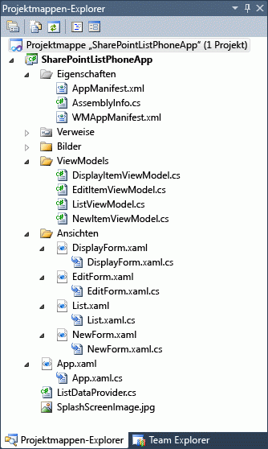

# <a name="overview-of-windows-phone-sharepoint-application-templates-in-visual-studio"></a><span data-ttu-id="75e77-102">Übersicht über Windows Phone SharePoint-Anwendungsvorlagen in Visual Studio</span><span class="sxs-lookup"><span data-stu-id="75e77-102">Overview of Windows Phone SharePoint application templates in Visual Studio</span></span>
<span data-ttu-id="75e77-103">Hier erfahren Sie mehr über die Visual Studio-Vorlagen, die vom Windows Phone SharePoint Software Development Kit für die Entwicklung mobiler Apps installiert werden.</span><span class="sxs-lookup"><span data-stu-id="75e77-103">Learn about the Visual Studio templates installed by the Windows Phone SharePoint Software Development Kit for mobile app development.</span></span>
## <a name="templates-installed-by-the-windows-phone-sharepoint-software-development-kit"></a><span data-ttu-id="75e77-104">Vorlagen installiert, indem Sie im Windows Phone SharePoint Software Development Kit</span><span class="sxs-lookup"><span data-stu-id="75e77-104">Templates installed by the Windows Phone SharePoint Software Development Kit</span></span>
<span data-ttu-id="75e77-105"><a name="BKMK_TemplatesInstalled"> </a></span><span class="sxs-lookup"><span data-stu-id="75e77-105"></span></span>

<span data-ttu-id="75e77-106">Nachdem Sie Ihre Entwicklungsumgebung einrichten und Windows Phone SharePoint Software Development Kit (SDK) installieren, werden zwei zusätzliche Silverlight für Windows Phone-Vorlagen für Projekte verfügbar:</span><span class="sxs-lookup"><span data-stu-id="75e77-106">After you set up your development environment and install the Windows Phone SharePoint Software Development Kit (SDK), two additional Silverlight for Windows Phone templates are available for projects:</span></span>
  
    
    

- <span data-ttu-id="75e77-107">Die Vorlage Windows Phone leeres SharePoint-Anwendung</span><span class="sxs-lookup"><span data-stu-id="75e77-107">The Windows Phone Empty SharePoint Application template</span></span>
    
  
- <span data-ttu-id="75e77-108">Die Vorlage Windows Phone SharePoint List Application</span><span class="sxs-lookup"><span data-stu-id="75e77-108">The Windows Phone SharePoint List Application template</span></span>
    
  
<span data-ttu-id="75e77-p101">Diese Vorlagen dienen derzeit nur in C#-Projekten verwendet werden. Sie sind nicht verfügbar für Visual Basic Projekte. Die Vorlagen sind verfügbar, jedoch für die Verwendung in Visual Studio 2012 und Visual Studio Express 2012 für Windows Phone 8 und Visual Studio 2010 und Visual Studio 2010 Express für Windows Phone 7.</span><span class="sxs-lookup"><span data-stu-id="75e77-p101">Currently, these templates are designed to be used only in C# projects. They are not available for Visual Basic projects. The templates are available, however, for use in Visual Studio 2012 and Visual Studio Express 2012 for Windows Phone 8 and in Visual Studio 2010 and Visual Studio 2010 Express for Windows Phone 7.</span></span>
  
    
    

> <span data-ttu-id="75e77-112">**Hinweis:** Windows Phone SharePoint-Vorlagen werden nicht im Menü **Neues Projekt** von Expression Blend angezeigt.</span><span class="sxs-lookup"><span data-stu-id="75e77-112">**Note:** Windows Phone SharePoint templates don't appear in the **New Project** menu of Expression Blend.</span></span> <span data-ttu-id="75e77-113">Sie können jedoch ein Projekt in Expression Blend bearbeiten, indem Sie **In Expression Blend öffnen** aus dem Kontextmenü in Visual Studio wählen.</span><span class="sxs-lookup"><span data-stu-id="75e77-113">Note Windows Phone SharePoint templates don't appear in the New Project menu of Expression Blend. However, you can edit a project in Expression Blend by choosing **Open in Expression Blend** from a shortcut menu in Visual Studio.</span></span>
  
    
    

<span data-ttu-id="75e77-p103">Wenn Sie ein Projekt basierend auf einer der folgenden Vorlagen erstellen, erhalten Sie nicht die Möglichkeit, eine Windows Phone-Zielplattform. Wie bei von Visual Studio Express 2012 erstellten Projekten mithilfe dieser zielanwendungen Vorlagen Windows Phone 8 für SharePoint; Und von Visual Studio 2010 Express mithilfe von Vorlagen erstellte Projekten Windows Phone OS Version 7.1 ist standardmäßig verweisen, das **AppPlatformVersion** -Attribut des **Deployment** -Elements in der Datei WMAppManifest.xml hat den Wert 7.1.</span><span class="sxs-lookup"><span data-stu-id="75e77-p103">When you create a project based on either one of these templates, you are not given the option of choosing a target Windows Phone platform. As for projects created from Visual Studio Express 2012 using these templates target Windows Phone 8 applications against SharePoint ; And projects created from Visual Studio 2010 Express using these templates target Windows Phone OS version 7.1 by default That is, the **AppPlatformVersion** attribute of the **Deployment** element in the WMAppManifest.xml file has a value of 7.1.</span></span>
  
    
    


```XML

<Deployment xmlns="http://schemas.microsoft.com/windowsphone/2009/deployment" AppPlatformVersion="7.1">
```


> <span data-ttu-id="75e77-116">
>   **Hinweis:** Weitere Informationen zu den Einstellungen in der Datei WMAppManifest.xml finden Sie unter  [Application Manifest-Datei für Windows Phone](http://msdn.microsoft.com/de-de/library/ff769509.aspx).</span><span class="sxs-lookup"><span data-stu-id="75e77-116">**Note** For more information about settings in the WMAppManifest.xml file, see  [Application Manifest File for Windows Phone](http://msdn.microsoft.com/de-de/library/ff769509.aspx).</span></span> 
  
    
    


## <a name="starting-a-project-based-on-the-windows-phone-empty-sharepoint-application-template"></a><span data-ttu-id="75e77-117">Starten eines Projekts basierend auf der Vorlage für Windows Phone Empty SharePoint-Anwendung</span><span class="sxs-lookup"><span data-stu-id="75e77-117">Starting a project based on the Windows Phone Empty SharePoint Application template</span></span>
<span data-ttu-id="75e77-118"><a name="BKMK_EmptySPAppTemplate"> </a></span><span class="sxs-lookup"><span data-stu-id="75e77-118"></span></span>

<span data-ttu-id="75e77-119">Wenn Sie ein Visual Studio Projekt basierend auf der Vorlage Windows Phone leeres SharePoint-Anwendung erstellen, ähnelt das Startprojekt eines Projekts mithilfe der Windows Phone-Anwendung-Basisvorlage (von der Windows Phone SDK 7.1 installiert), durch das Hinzufügen von Verweisen auf DLLs von Windows Phone SharePoint SDK (Microsoft.SharePoint.Client.Phone.dll, Microsoft.SharePoint.Client.Phone.Auth.UI und Microsoft.SharePoint.Client.Phone.Runtime.dll wie in Abbildung 1 dargestellt), und einigen andere Neukonfiguration installiert erstellt.</span><span class="sxs-lookup"><span data-stu-id="75e77-119">If you create a Visual Studio project based on the Windows Phone Empty SharePoint Application template, the starting project is similar to a project created by using the basic Windows Phone Application template (installed by the Windows Phone SDK 7.1), with the addition of references to DLLs installed by the Windows Phone SharePoint SDK (Microsoft.SharePoint.Client.Phone.dll, Microsoft.SharePoint.Client.Phone.Auth.UI, and Microsoft.SharePoint.Client.Phone.Runtime.dll as shown in Figure 1) and a few other reconfigurations.</span></span>
  
    
    

> <span data-ttu-id="75e77-120">**Hinweis:** Die gleichen Vorlagen stehen für Windows Phone 8 in Visual Studio Express 2012 zur Verfügung.</span><span class="sxs-lookup"><span data-stu-id="75e77-120">**Note** The same templates are available for Windows Phone 8 in Visual Studio Express 2012.</span></span> 
  
    
    


<span data-ttu-id="75e77-121">**Abbildung 1. Dateien in einem Windows Phone Empty SharePoint-Anwendungsprojekt**</span><span class="sxs-lookup"><span data-stu-id="75e77-121">**Figure 1. Files in a Windows Phone Empty SharePoint Application project**</span></span>

  
    
    

  
    
    

  
    
    
<span data-ttu-id="75e77-p104">Die Dateien in einem Projekt auf Grundlage der Vorlage Windows Phone leeres SharePoint-Anwendung sind die standard-Dateien einer Silverlight Windows Phone-App. Die Datei MainPage.xaml enthält XAML-Deklarationen, die die Benutzeroberfläche (UI) der app zu bilden. Eine Code-Behind-Datei MainPage.xaml.cs, ist die Verwendung des Mechanismus für das partielle Klassen zugeordnet, mit der Datei MainPage.xaml, wie die anderen CodeBehind-Dateien im Projekt sind. (Siehe  [partielle Klassen und Code-Behind](http://msdn.microsoft.com/de-de/library/cc221357.aspx).) Die Datei MainPage.xaml.cs enthält Prozedurcode zum Implementieren der Logik für Vorgänge und Ereignisse in der Benutzeroberfläche zu unterstützen. Objektebene stellt die allgemeine Windows-app. Die zugeordneten Code-Behind-Datei App.xaml.cs, umfasst Prozedurcode zum Behandeln von Ereignissen für die app-Lebenszyklus.</span><span class="sxs-lookup"><span data-stu-id="75e77-p104">The files in a project based on the Windows Phone Empty SharePoint Application template are the standard files of a Silverlight Windows Phone app. The MainPage.xaml file contains XAML declarations that constitute the user interface (UI) of the app. A code-behind file, MainPage.xaml.cs, is associated with the MainPage.xaml file by using the mechanism of partial classes, as are the other code-behind files in the project. (See  [Code-Behind and Partial Classes](http://msdn.microsoft.com/de-de/library/cc221357.aspx).) The MainPage.xaml.cs file contains procedural code to implement logic to support operations and events in the UI. The App.xaml file represents the overall Windows app. The associated code-behind file, App.xaml.cs, includes procedural code to handle life-cycle events for the app.</span></span>
  
    
    

## <a name="starting-a-project-based-on-the-windows-phone-sharepoint-list-application-template"></a><span data-ttu-id="75e77-129">Starten eines Projekts basierend auf der Vorlage Windows Phone SharePoint List Application</span><span class="sxs-lookup"><span data-stu-id="75e77-129">Starting a project based on the Windows Phone SharePoint List Application template</span></span>
<span data-ttu-id="75e77-130"><a name="BKMK_SPListAppTemplate"> </a></span><span class="sxs-lookup"><span data-stu-id="75e77-130"></span></span>

<span data-ttu-id="75e77-p105">Die Vorlage Windows Phone SharePoint List Application ist erheblich leistungsstärker als die Vorlage Windows Phone leeres SharePoint-Anwendung. Diese Vorlage wurde entwickelt, beim Erstellen von Windows Phone-apps zur Verarbeitung von einem wahrscheinlich Szenario in die Entwicklung mobiler Anwendungen für SharePoint: Zugreifen auf und Bearbeiten von Daten in einer SharePoint-Liste aus einer Windows Phone gespeichert. Wenn Sie ein auf dieser Vorlage basierende Visual Studio-Projekt erstellen, ist ein Assistent führt Sie durch die erforderlichen Konfigurationsschritte aus und generiert Lösungsdateien für eine funktionale Windows Phone-app, die mit SharePoint-Listendaten arbeiten können. Sie können erstellen und Bereitstellen die app aus dem generierten Dateien mit geringer oder ohne Änderung.</span><span class="sxs-lookup"><span data-stu-id="75e77-p105">The Windows Phone SharePoint List Application template is considerably more powerful than the Windows Phone Empty SharePoint Application template. This template was designed to help you create Windows Phone apps to handle a likely scenario in mobile application development for SharePoint: accessing and manipulating data stored in a SharePoint list from a Windows Phone. When you create a Visual Studio project based on this template, a wizard guides you through the necessary configuration steps and generates solution files for a functional Windows Phone app that can work with SharePoint list data. You can build and deploy the app from the generated files with little or no modification.</span></span>
  
    
    

> <span data-ttu-id="75e77-135">**Hinweis:** Die gleichen Vorlagen stehen für Windows Phone 8 in Visual Studio Express 2012 zur Verfügung.</span><span class="sxs-lookup"><span data-stu-id="75e77-135">**Note** The same templates are available for Windows Phone 8 in Visual Studio Express 2012.</span></span> 
  
    
    


### <a name="understanding-the-solution-files-in-a-windows-phone-sharepoint-list-application-project"></a><span data-ttu-id="75e77-136">Grundlegendes zu den Lösungsdateien in einem Windows Phone SharePoint-Listenanwendungs-Projekt</span><span class="sxs-lookup"><span data-stu-id="75e77-136">Understanding the solution files in a Windows Phone SharePoint List Application project</span></span>

<span data-ttu-id="75e77-p106">Die für ein Visual Studio Projekt mithilfe der Vorlage Windows Phone SharePoint List Application-Dateien sind in Abbildung 2 dargestellt. (Verweise auf andere Assemblys - nicht in Abbildung 2 dargestellten - wie System.Runtime.Serialization.dll und Microsoft.Phone.Controls.dll zusätzlich zu diese Verweise durch die Vorlage Windows Phone leeres SharePoint-Anwendung enthalten sind. Diese zusätzliche Assemblys unterstützen die Verwaltung von SharePoint-Listendaten und die visuelle Steuerelemente auf diese Daten darstellen.)</span><span class="sxs-lookup"><span data-stu-id="75e77-p106">The files generated for a Visual Studio project using the Windows Phone SharePoint List Application template are shown in Figure 2. (References to other assemblies—not shown in Figure 2—such as System.Runtime.Serialization.dll and Microsoft.Phone.Controls.dll are additional to those references included by the Windows Phone Empty SharePoint Application template. These additional assemblies support the management of SharePoint list data and the visual controls to represent that data.)</span></span>
  
    
    

<span data-ttu-id="75e77-140">**Abbildung 2. Dateien in einem Projekt auf Windows Phone SharePoint List Application**</span><span class="sxs-lookup"><span data-stu-id="75e77-140">**Figure 2. Files in a Windows Phone SharePoint List Application project**</span></span>

  
    
    

  
    
    

  
    
    
<span data-ttu-id="75e77-142">In Tabelle 1 werden die Projektdateien für beschrieben.</span><span class="sxs-lookup"><span data-stu-id="75e77-142">The project files for are described in Table 1.</span></span>
  
    
    

<span data-ttu-id="75e77-143">**In Tabelle 1. Windows Phone SharePoint List Application Projektdateien**</span><span class="sxs-lookup"><span data-stu-id="75e77-143">**Table 1. Windows Phone SharePoint List Application project files**</span></span>


|<span data-ttu-id="75e77-144">**Datei**</span><span class="sxs-lookup"><span data-stu-id="75e77-144">**File**</span></span>|<span data-ttu-id="75e77-145">**Beschreibung**</span><span class="sxs-lookup"><span data-stu-id="75e77-145">**Description**</span></span>|
|:-----|:-----|
|<span data-ttu-id="75e77-146">App.xaml</span><span class="sxs-lookup"><span data-stu-id="75e77-146">App.xaml</span></span>  <br/> |<span data-ttu-id="75e77-p107">Stellt die allgemeine Windows Phone-Anwendung dar. Enthält Deklarationen der Elemente im Zusammenhang mit der Anwendung (statt auf einzelne Seiten innerhalb der Anwendung), wie die Anwendung Lebenszyklusereignisse wie **Application_Deactivated** und **Application_Closing**. </span><span class="sxs-lookup"><span data-stu-id="75e77-p107">Represents the overall Windows Phone application. Includes declarations of elements related to the application (instead of to individual pages within the application), such as application life-cycle events like **Application_Deactivated** and **Application_Closing**.  </span></span><br/> |
|<span data-ttu-id="75e77-149">App.xaml.cs</span><span class="sxs-lookup"><span data-stu-id="75e77-149">App.xaml.cs</span></span>  <br/> |<span data-ttu-id="75e77-p108">Die CodeBehind-Datei App.xaml (mithilfe des partiellen Klasse Mechanismus, wie die Groß-/Kleinschreibung für die anderen CodeBehind-Dateien in das Projekt ist) zugeordnet. So behandeln Sie die Vorgänge in Lebenszyklusereignisse wie **Application_Deactivated** und **Application_Closing**Prozedurcode enthält. Schreiben Sie Code in dieser Datei offline (local) Speicherung von Daten zu verwalten. </span><span class="sxs-lookup"><span data-stu-id="75e77-p108">The code-behind file associated with App.xaml (using the partial-class mechanism, as is the case for the other code-behind files in the project). Includes procedural code to handle the operations in the life-cycle events, such as **Application_Deactivated** and **Application_Closing**. You write code in this file to manage offline (local) storage of data.  </span></span><br/> |
|<span data-ttu-id="75e77-153">ListDataProvider.cs</span><span class="sxs-lookup"><span data-stu-id="75e77-153">The ListDataProvider.cs file</span></span>  <br/> |<span data-ttu-id="75e77-154">Enthält Code für den Zugriff auf Daten auf die SharePoint Server und bietet Zugriff auf die Grundlage für die verschiedenen Listenansichten der Anwendung-Abfragesyntax.</span><span class="sxs-lookup"><span data-stu-id="75e77-154">Contains code for accessing data on the SharePoint Server and provides access to the query syntax on which the various list views of the application are based.</span></span>  <br/> |
|<span data-ttu-id="75e77-155">List.xaml</span><span class="sxs-lookup"><span data-stu-id="75e77-155">List.xaml</span></span>  <br/> |<span data-ttu-id="75e77-p109">Definiert die Elemente der Benutzeroberfläche für das Standardformular für die Ansicht in der Anwendung Telefon; vergleichbar mit der alle Elemente (oder für alle Vorgänge, alle Kontakte oder eine ähnliche) Ansicht in SharePoint. Die Datei List.xaml enthält das **Pivot** -Steuerelement, das den primären Container für visuelle Elemente in der Anwendung, einschließlich der **PivotItem** -Steuerelemente, die die vom Entwickler in der Windows Phone-app enthalten sein gewählte Listenansichten gerendert, bildet. </span><span class="sxs-lookup"><span data-stu-id="75e77-p109">Defines the UI elements for the default view form in the phone application; analogous to the All Items (or All Tasks, All Contacts, or similar) view in SharePoint. The List.xaml file contains the **Pivot** control that constitutes the primary container for visual elements in the application, including the **PivotItem** controls that render the list views chosen by the developer to be included in the Windows Phone app. </span></span><br/> |
|<span data-ttu-id="75e77-158">List.xaml.cs</span><span class="sxs-lookup"><span data-stu-id="75e77-158">List.xaml.cs</span></span>  <br/> |<span data-ttu-id="75e77-p110">Der Code-Behind-Datei List.xaml zugeordnet. Enthält Code zur Implementierung der Methoden und Ereignishandler für die Schaltflächen auf dem Formular, wie **neu** und **Aktualisieren**. </span><span class="sxs-lookup"><span data-stu-id="75e77-p110">The code-behind file associated with List.xaml. Includes code to implement the methods and handlers for the buttons on the form, such as **New** and **Refresh**.  </span></span><br/> |
|<span data-ttu-id="75e77-161">DisplayForm.xaml</span><span class="sxs-lookup"><span data-stu-id="75e77-161">DisplayForm.xaml</span></span>  <br/> |<span data-ttu-id="75e77-p111">Definiert die Elemente der Benutzeroberfläche für das Formular zum **Anzeigen eines** Eintrags (oder die Seite) in der Anwendung; entspricht dem **Element anzeigen** Formular in SharePoint. In der Windows Phone-app werden die Felder in einer vertikalen "Stapel" mithilfe eines **StackPanel** -Steuerelements in einem Silverlight **Pivot** Steuerelement enthaltene gerendert. </span><span class="sxs-lookup"><span data-stu-id="75e77-p111">Defines the UI elements for the **Display Item** form (or page) in the application; analogous to the **View Item** form in SharePoint. In the Windows Phone app, the fields are rendered in a vertical "stack" by using a **StackPanel** control contained in a Silverlight **Pivot** control. </span></span><br/> |
|<span data-ttu-id="75e77-164">DisplayForm.xaml.cs</span><span class="sxs-lookup"><span data-stu-id="75e77-164">DisplayForm.xaml.cs</span></span>  <br/> |<span data-ttu-id="75e77-p112">Der Code-Behind-Datei DisplayForm.xaml zugeordnet. Enthält Code zur Implementierung der Methoden und Ereignishandler für die Schaltflächen auf dem Formular, wie etwa **Bearbeiten** und **Löschen**. </span><span class="sxs-lookup"><span data-stu-id="75e77-p112">The code-behind file associated with DisplayForm.xaml. Includes code to implement the methods and handlers for the buttons on the form, such as **Edit** and **Delete**.  </span></span><br/> |
|<span data-ttu-id="75e77-167">EditForm.xaml</span><span class="sxs-lookup"><span data-stu-id="75e77-167">EditForm.xaml</span></span>  <br/> |<span data-ttu-id="75e77-p113">Definiert die Elemente der Benutzeroberfläche für das **Element bearbeiten** Formular in der Anwendung Telefon. entspricht dem **Eintrag bearbeiten** Formular in SharePoint. Wie bei einem Formular für das **Anzeigen** werden die Felder in einem Steuerelement **StackPanel** gerendert. </span><span class="sxs-lookup"><span data-stu-id="75e77-p113">Defines the UI elements for the **Edit Item** form in the phone application; analogous to the **Edit Item** form in SharePoint. As with the **Display Item** form, fields are rendered in a **StackPanel** control. </span></span><br/> |
|<span data-ttu-id="75e77-170">EditForm.xaml.cs</span><span class="sxs-lookup"><span data-stu-id="75e77-170">EditForm.xaml.cs</span></span>  <br/> |<span data-ttu-id="75e77-p114">Der Code-Behind-Datei EditForm.xaml zugeordnet. Enthält Code zur Implementierung der Methoden und Ereignishandler für die Schaltflächen auf dem Formular, wie **Senden** und **Abbrechen**. </span><span class="sxs-lookup"><span data-stu-id="75e77-p114">The code-behind file associated with EditForm.xaml. Includes code to implement the methods and handlers for the buttons on the form, such as **Submit** and **Cancel**.  </span></span><br/> |
|<span data-ttu-id="75e77-173">NewForm.xaml</span><span class="sxs-lookup"><span data-stu-id="75e77-173">NewForm.xaml</span></span>  <br/> |<span data-ttu-id="75e77-p115">Definiert die Elemente der Benutzeroberfläche für das Formular **Neues Element** in der Anwendung Telefon. entspricht dem Formular **Neues Element** in SharePoint. Felder werden in einem Steuerelement **StackPanel** gerendert. </span><span class="sxs-lookup"><span data-stu-id="75e77-p115">Defines the UI elements for the **New Item** form in the phone application; analogous to the **New Item** form in SharePoint. Fields are rendered in a **StackPanel** control. </span></span><br/> |
|<span data-ttu-id="75e77-176">NewForm.xaml.cs</span><span class="sxs-lookup"><span data-stu-id="75e77-176">NewForm.xaml.cs</span></span>  <br/> |<span data-ttu-id="75e77-p116">Der Code-Behind-Datei NewForm.xaml zugeordnet. Enthält Code zur Implementierung der Methoden und Ereignishandler für die Schaltflächen auf dem Formular, wie **Senden** und **Abbrechen**. </span><span class="sxs-lookup"><span data-stu-id="75e77-p116">The code-behind file associated with NewForm.xaml. Includes code to implement the methods and handlers for the buttons on the form, such as **Submit** and **Cancel**.  </span></span><br/> |
|<span data-ttu-id="75e77-179">DisplayItemViewModel.cs</span><span class="sxs-lookup"><span data-stu-id="75e77-179">DisplayItemViewModel.cs</span></span>  <br/> |<span data-ttu-id="75e77-180">Dient als Datenquelle für die DisplayForm.xaml-Datei.</span><span class="sxs-lookup"><span data-stu-id="75e77-180">Serves as the data source for the DisplayForm.xaml file.</span></span>  <br/> |
|<span data-ttu-id="75e77-181">EditItemViewModel.cs</span><span class="sxs-lookup"><span data-stu-id="75e77-181">EditItemViewModel.cs</span></span>  <br/> |<span data-ttu-id="75e77-p117">Dient als Datenquelle für die EditForm.xaml-Datei. Schreiben Sie Code in der Datei beim Bearbeiten eines Listenelements vom Benutzer eingegebenen Daten zu überprüfen.</span><span class="sxs-lookup"><span data-stu-id="75e77-p117">Serves as the data source for the EditForm.xaml file. You write code in this file to validate data entered by users when editing a list item.</span></span>  <br/> |
|<span data-ttu-id="75e77-184">ListViewModel.cs</span><span class="sxs-lookup"><span data-stu-id="75e77-184">ListViewModel.cs</span></span>  <br/> |<span data-ttu-id="75e77-185">Dient als Datenquelle für die List.xaml-Datei.</span><span class="sxs-lookup"><span data-stu-id="75e77-185">Serves as the data source for the List.xaml file.</span></span>  <br/> |
|<span data-ttu-id="75e77-186">NewItemViewModel.cs</span><span class="sxs-lookup"><span data-stu-id="75e77-186">NewItemViewModel.cs</span></span>  <br/> |<span data-ttu-id="75e77-p118">Dient als Datenquelle für die NewForm.xaml-Datei. Schreiben Sie Code in der Datei, die beim Hinzufügen eines neuen Listenelements vom Benutzer eingegebenen Daten zu überprüfen.</span><span class="sxs-lookup"><span data-stu-id="75e77-p118">Serves as the data source for the NewForm.xaml file. You write code in this file to validate data entered by users when adding a new list item.</span></span>  <br/> |
   
<span data-ttu-id="75e77-189">Die Informationen über die Schritte zum Erstellen einer Windows Phone-app mithilfe der Vorlage Windows Phone SharePoint List Application finden Sie unter  [Vorgehensweise: Erstellen eine Windows Phone SharePoint Liste app](how-to-create-a-windows-phone-sharepoint-list-app.md).</span><span class="sxs-lookup"><span data-stu-id="75e77-189">For the details of the steps involved in creating a Windows Phone app by using the Windows Phone SharePoint List Application template, see  [How to: Create a Windows Phone SharePoint list app](how-to-create-a-windows-phone-sharepoint-list-app.md).</span></span>
  
    
    

## <a name="additional-resources"></a><span data-ttu-id="75e77-190">Zusätzliche Ressourcen</span><span class="sxs-lookup"><span data-stu-id="75e77-190">Additional resources</span></span>
<span data-ttu-id="75e77-191"><a name="SP15winphoneover_addlresources"> </a></span><span class="sxs-lookup"><span data-stu-id="75e77-191"></span></span>


-  [<span data-ttu-id="75e77-192">Erstellen von Windows Phone-Apps, die auf SharePoint zugreifen</span><span class="sxs-lookup"><span data-stu-id="75e77-192">Build Windows Phone apps that access SharePoint</span></span>](build-windows-phone-apps-that-access-sharepoint.md)
    
  
-  [<span data-ttu-id="75e77-193">Vorgehensweise: Einrichten einer Umgebung für die Entwicklung von mobilen Anwendungen für SharePoint</span><span class="sxs-lookup"><span data-stu-id="75e77-193">How to: Set up an environment for developing mobile apps for SharePoint</span></span>](how-to-set-up-an-environment-for-developing-mobile-apps-for-sharepoint.md)
    
  
-  [<span data-ttu-id="75e77-194">Windows Phone SDK 8.0</span><span class="sxs-lookup"><span data-stu-id="75e77-194">Windows Phone SDK 8.0</span></span>](http://www.microsoft.com/en-us/download/details.aspx?id=35471)
    
  
-  [<span data-ttu-id="75e77-195">Microsoft SharePoint SDK für Windows Phone 8</span><span class="sxs-lookup"><span data-stu-id="75e77-195">Microsoft SharePoint SDK for Windows Phone 8</span></span>](http://www.microsoft.com/en-us/download/details.aspx?id=36818)
    
  
-  [<span data-ttu-id="75e77-196">Windows Phone SDK 7.1</span><span class="sxs-lookup"><span data-stu-id="75e77-196">Windows Phone SDK 7.1</span></span>](http://www.microsoft.com/en-us/download/details.aspx?id=27570)
    
  
-  [<span data-ttu-id="75e77-197">Microsoft SharePoint SDK for Windows Phone 7.1</span><span class="sxs-lookup"><span data-stu-id="75e77-197">Microsoft SharePoint SDK for Windows Phone 7.1</span></span>](http://www.microsoft.com/en-us/download/details.aspx?id=30476)
    
  
-  <span data-ttu-id="75e77-198">
  [Windows Phone-Entwicklung](http://msdn.microsoft.com/de-de/library/ff402535%28v=vs.92%29.aspx)</span><span class="sxs-lookup"><span data-stu-id="75e77-198">[Windows Phone Development](http://msdn.microsoft.com/de-de/library/ff402535%28v=vs.92%29.aspx)</span></span>
    
  

